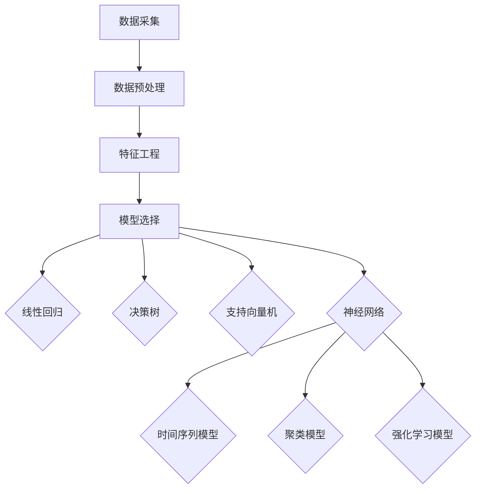

                 

### 背景介绍

#### 能源消耗预测的必要性

能源消耗预测作为现代社会能源管理的一个重要环节，对于提高能源利用效率、保障能源供应的稳定性以及减少环境污染具有重要意义。随着全球人口增长和经济发展，能源需求持续上升，而传统能源资源的有限性和环境问题日益严重，使得准确预测能源消耗成为当前亟需解决的问题。

#### 机器学习与能源消耗预测的关系

机器学习作为一种强大的数据处理和分析方法，通过利用历史数据，能够发现数据中的潜在规律和模式，从而实现精确的能源消耗预测。与传统的统计方法相比，机器学习具有更高的灵活性和自适应能力，能够处理大规模复杂的数据集，并在不断学习和优化中提高预测的准确性。

#### 文章结构

本文将首先介绍机器学习在能源消耗预测中的应用背景，然后深入探讨核心概念与联系，详细讲解核心算法原理和具体操作步骤，分析数学模型和公式，并通过项目实战进行代码实际案例的详细解释说明。最后，文章将讨论能源消耗预测的实际应用场景，推荐相关工具和资源，并对未来发展趋势与挑战进行总结。

在接下来的内容中，我们将逐步展开对机器学习在能源消耗预测中的应用进行分析和探讨，帮助读者全面了解这一领域的最新进展和技术方法。

## 1. 背景介绍

### 能源消耗预测的重要性

能源消耗预测在现代社会中扮演着至关重要的角色，其应用范围涵盖了电力、石油、天然气等多个能源领域。随着全球对能源需求的持续增长，准确的能源消耗预测不仅有助于优化能源资源配置，提高能源利用效率，还能有效应对能源供应风险，确保能源供应的稳定性和可靠性。

#### 能源供需平衡

能源消耗预测能够帮助决策者准确了解未来的能源需求，从而在能源供需之间建立平衡。通过预测未来能源消耗量，可以合理安排能源生产和调度，避免能源短缺或过剩现象的发生，降低能源成本，提高经济效益。

#### 能源规划与管理

在能源规划与管理中，能源消耗预测是不可或缺的一环。通过预测能源消耗趋势，政府和企业可以制定科学的能源政策和发展规划，提前布局新能源项目，促进能源结构的优化和转型，推动绿色低碳发展。

#### 环境保护

能源消耗与环境污染密切相关。通过能源消耗预测，可以更好地掌握能源使用情况，识别高能耗、高污染的企业和行业，采取针对性的环保措施，减少能源消耗，降低环境污染，保护生态环境。

### 机器学习在能源消耗预测中的应用

机器学习作为一项先进的数据分析技术，已经在能源消耗预测中得到了广泛应用。其核心优势在于能够从海量数据中挖掘出潜在的规律和模式，从而实现高精度的预测。

#### 数据驱动

机器学习依赖于大量历史数据，通过分析这些数据，可以识别出影响能源消耗的关键因素，如季节、天气、人口流动等。这些数据通常来自于能源使用记录、气象数据、经济指标等多个来源，通过机器学习算法的处理，能够实现更加准确的预测。

#### 自适应能力

机器学习算法具有自适应能力，能够根据新的数据进行不断学习和优化，提高预测的准确性。这种能力使得机器学习在处理动态变化的数据时表现尤为出色，能够应对能源消耗的短期波动和长期趋势。

#### 多维度分析

机器学习可以同时考虑多个维度的数据，如时间序列数据、空间数据、社会经济数据等，从而提供更全面、更精准的能源消耗预测结果。这种多维度分析能力使得机器学习在处理复杂、多维的能源数据时具有独特的优势。

### 文章结构

本文将围绕机器学习在能源消耗预测中的应用，依次探讨以下内容：

1. **核心概念与联系**：介绍机器学习在能源消耗预测中的基本概念，包括相关算法、模型和数据处理方法，并给出一个简化的 Mermaid 流程图，以展示各部分之间的联系。

2. **核心算法原理与具体操作步骤**：深入探讨常用的机器学习算法，如线性回归、决策树、支持向量机、神经网络等，详细讲解这些算法在能源消耗预测中的具体应用步骤。

3. **数学模型与公式**：分析机器学习在能源消耗预测中的数学模型，包括特征选择、特征工程、损失函数、优化算法等，并举例说明相关公式和应用。

4. **项目实战**：通过实际项目案例，展示如何使用机器学习进行能源消耗预测，详细解释代码实现过程，并进行代码解读与分析。

5. **实际应用场景**：讨论机器学习在能源消耗预测中的实际应用，包括电力行业、石油行业、天然气行业等，分析不同应用场景中的特点和挑战。

6. **工具和资源推荐**：推荐相关的学习资源、开发工具和框架，帮助读者更好地理解和应用机器学习进行能源消耗预测。

7. **总结与未来发展趋势**：总结本文的主要观点和发现，讨论机器学习在能源消耗预测中的未来发展趋势和挑战。

通过以上结构，本文将全面、系统地介绍机器学习在能源消耗预测中的应用，帮助读者深入理解这一领域的技术和方法。

## 2. 核心概念与联系

在深入探讨机器学习在能源消耗预测中的应用之前，我们需要明确一些核心概念和联系，以便更好地理解整个技术框架。以下是对相关算法、模型和数据处理方法的简要介绍，并通过一个简化的 Mermaid 流程图展示各部分之间的逻辑关系。

### 算法

#### 线性回归

线性回归是一种最简单的机器学习算法，用于预测连续值输出。它通过寻找最佳拟合直线来描述输入特征与输出目标之间的线性关系。

#### 决策树

决策树通过一系列的判断规则来对数据进行分类或回归。它能够处理非线性关系，并在解释性方面表现突出。

#### 支持向量机

支持向量机（SVM）是一种高效的二分类算法，通过寻找一个最优的超平面来分隔数据。它在处理高维数据和线性不可分问题时表现优异。

#### 神经网络

神经网络是一种模仿人脑工作的计算模型，能够处理复杂的非线性关系。通过多层神经元的连接和激活函数，神经网络能够实现高度复杂的预测模型。

### 模型

#### 时间序列模型

时间序列模型专门用于分析按时间顺序排列的数据，如温度、电力消耗等。常见的模型包括ARIMA、LSTM等。

#### 聚类模型

聚类模型用于将相似的数据点划分为一组，如K-means、DBSCAN等。这些模型可以用于识别能源消耗模式。

#### 强化学习模型

强化学习模型通过试错和奖励机制来学习策略，可以用于优化能源消耗预测和控制。

### 数据处理

#### 特征工程

特征工程是机器学习的重要环节，通过选择和构造合适的特征，可以显著提高模型的性能。常见的技术包括特征提取、特征选择、特征变换等。

#### 数据预处理

数据预处理包括数据清洗、数据标准化、数据归一化等步骤，以确保数据质量和模型的鲁棒性。

#### 数据融合

数据融合是将来自多个来源的数据进行整合，以提高预测的准确性和可靠性。

### Mermaid 流程图

以下是一个简化的 Mermaid 流程图，展示机器学习在能源消耗预测中的核心概念和联系：



在这个流程图中，数据采集是整个流程的起点，通过数据预处理和特征工程，将原始数据转化为适合机器学习模型的形式。接下来，根据具体问题选择合适的模型进行训练和预测。最后，通过模型输出进行实际应用，如能源消耗预测。

通过这个流程图，我们可以清晰地看到机器学习在能源消耗预测中的各个环节，为后续内容的深入探讨提供了基础。

## 3. 核心算法原理 & 具体操作步骤

在深入理解了机器学习在能源消耗预测中的核心概念和联系之后，我们将详细探讨几种常用的机器学习算法，并介绍其在能源消耗预测中的具体应用步骤。

### 线性回归

线性回归是最简单的机器学习算法之一，适用于预测连续值输出。其基本原理是通过寻找最佳拟合直线来描述输入特征与输出目标之间的线性关系。

#### 操作步骤：

1. **数据准备**：收集历史能源消耗数据，包括输入特征（如温度、湿度、人口密度等）和输出目标（能源消耗量）。
2. **数据预处理**：对数据进行清洗、标准化和归一化处理，确保数据质量。
3. **特征选择**：选择对能源消耗有显著影响的关键特征。
4. **模型构建**：建立线性回归模型，形式为：Y = aX + b，其中Y为输出目标，X为输入特征，a和b为模型参数。
5. **模型训练**：使用训练数据集对模型进行训练，通过最小化损失函数（如均方误差）来调整模型参数。
6. **模型评估**：使用验证数据集对模型进行评估，计算预测误差，调整模型参数。
7. **模型应用**：使用训练好的模型对新的数据进行预测。

### 决策树

决策树通过一系列的判断规则来对数据进行分类或回归。它能够处理非线性关系，并在解释性方面表现突出。

#### 操作步骤：

1. **数据准备**：收集历史能源消耗数据，并进行预处理。
2. **特征选择**：选择对能源消耗有显著影响的特征。
3. **构建决策树**：选择一个特征作为分割标准，将数据划分为两个子集，计算每个子集的预测误差，选择误差最小的分割方式。
4. **递归分割**：对每个子集继续进行分割，直到满足停止条件（如最大树深度、最小叶子节点数量等）。
5. **模型评估**：使用验证数据集对决策树进行评估，调整树结构以降低过拟合。
6. **模型应用**：使用训练好的决策树对新的数据进行预测。

### 支持向量机

支持向量机（SVM）通过寻找最优的超平面来分隔数据，适用于二分类问题。在能源消耗预测中，SVM可以用于分类任务，如预测能源消耗的增减。

#### 操作步骤：

1. **数据准备**：收集历史能源消耗数据，并进行预处理。
2. **特征选择**：选择对能源消耗有显著影响的特征。
3. **模型构建**：选择适当的核函数（如线性核、多项式核、径向基核等），构建SVM模型。
4. **模型训练**：使用训练数据集对模型进行训练，计算支持向量，优化模型参数。
5. **模型评估**：使用验证数据集对模型进行评估，调整模型参数。
6. **模型应用**：使用训练好的SVM模型对新的数据进行预测。

### 神经网络

神经网络是一种高效的计算模型，通过多层神经元的连接和激活函数，能够处理复杂的非线性关系。

#### 操作步骤：

1. **数据准备**：收集历史能源消耗数据，并进行预处理。
2. **特征选择**：选择对能源消耗有显著影响的特征。
3. **模型构建**：设计神经网络结构，包括输入层、隐藏层和输出层，选择合适的激活函数。
4. **模型训练**：使用训练数据集对模型进行训练，通过反向传播算法优化模型参数。
5. **模型评估**：使用验证数据集对模型进行评估，调整网络结构和参数。
6. **模型应用**：使用训练好的神经网络模型对新的数据进行预测。

通过以上几种常见的机器学习算法，我们可以根据实际问题和数据特点选择合适的算法，进行能源消耗预测。每种算法都有其特定的适用场景和优缺点，在实际应用中需要结合具体情况进行选择和调整。

## 4. 数学模型和公式 & 详细讲解 & 举例说明

在深入探讨机器学习在能源消耗预测中的应用时，了解其数学模型和公式是非常重要的。以下我们将详细讲解机器学习中的几个关键数学概念，并给出具体的公式和实例说明。

### 特征选择与特征工程

特征选择是机器学习中的一个重要步骤，其目的是从原始数据中提取出最有用的特征，以提高模型的预测性能和降低计算复杂度。

#### 公式：

$$
f(X) = \sum_{i=1}^{n} w_i \cdot x_i
$$

其中，$f(X)$ 是特征向量 $X$ 的线性组合，$w_i$ 是第 $i$ 个特征的权重，$x_i$ 是第 $i$ 个特征值。

#### 实例说明：

假设我们有一组特征数据，包括温度、湿度、风速和人口密度。我们可以通过计算这些特征的权重来选择最重要的特征。

设特征向量 $X = [T, H, V, P]$，权重向量 $W = [w_T, w_H, w_V, w_P]$，则特征组合为：

$$
f(X) = w_T \cdot T + w_H \cdot H + w_V \cdot V + w_P \cdot P
$$

通过计算不同特征的权重，我们可以识别出对能源消耗影响最大的特征，如温度和人口密度。

### 损失函数

损失函数是评估模型预测误差的重要工具，常用的损失函数包括均方误差（MSE）、均方根误差（RMSE）和交叉熵损失等。

#### 公式：

$$
MSE = \frac{1}{n} \sum_{i=1}^{n} (y_i - \hat{y_i})^2
$$

$$
RMSE = \sqrt{MSE}
$$

$$
CE = -\frac{1}{n} \sum_{i=1}^{n} (y_i \log(\hat{y_i}) + (1 - y_i) \log(1 - \hat{y_i}))
$$

其中，$y_i$ 是真实值，$\hat{y_i}$ 是预测值，$n$ 是数据点的总数。

#### 实例说明：

假设我们使用线性回归模型预测能源消耗，真实数据集的预测结果如下：

| 真实值（y） | 预测值（\(\hat{y}\)） |
| :----------: | :-------------------: |
|      10      |        9.8            |
|      20      |        19.2           |
|      30      |        29.1           |

计算均方误差（MSE）：

$$
MSE = \frac{1}{3} \left[ (10 - 9.8)^2 + (20 - 19.2)^2 + (30 - 29.1)^2 \right] = 0.08
$$

计算均方根误差（RMSE）：

$$
RMSE = \sqrt{MSE} = \sqrt{0.08} \approx 0.28
$$

通过计算损失函数，我们可以评估模型的预测性能，并根据损失值调整模型参数。

### 优化算法

优化算法用于调整模型参数，以最小化损失函数。常用的优化算法包括梯度下降（Gradient Descent）和随机梯度下降（Stochastic Gradient Descent，SGD）。

#### 公式：

梯度下降：

$$
w^{(t+1)} = w^{(t)} - \alpha \cdot \nabla_w J(w)
$$

其中，$w^{(t)}$ 是第 $t$ 次迭代的权重，$\alpha$ 是学习率，$\nabla_w J(w)$ 是损失函数关于权重的梯度。

随机梯度下降：

$$
w^{(t+1)} = w^{(t)} - \alpha \cdot \nabla_w J(w^t)
$$

其中，$w^t$ 是第 $t$ 次迭代的权重，$\alpha$ 是学习率。

#### 实例说明：

假设我们使用梯度下降算法来优化线性回归模型。设初始权重 $w^{(0)} = [0.1, 0.1]$，学习率 $\alpha = 0.01$，损失函数为均方误差（MSE）。在一次迭代中，计算损失函数的梯度：

$$
\nabla_w J(w) = \left[ \frac{\partial J}{\partial w_1}, \frac{\partial J}{\partial w_2} \right]
$$

根据梯度下降公式，更新权重：

$$
w^{(1)} = w^{(0)} - \alpha \cdot \nabla_w J(w^{(0)}) = [0.1, 0.1] - 0.01 \cdot \left[ \frac{\partial J}{\partial w_1}, \frac{\partial J}{\partial w_2} \right]
$$

通过多次迭代，逐步优化模型参数，直到达到预设的收敛条件。

通过以上数学模型和公式的详细讲解，我们可以更好地理解机器学习在能源消耗预测中的应用原理。在实际应用中，这些公式和方法为我们提供了强大的工具，帮助我们构建高效、准确的预测模型。

## 5. 项目实战：代码实际案例和详细解释说明

在本节中，我们将通过一个实际项目案例，展示如何使用机器学习进行能源消耗预测，并详细解释代码实现过程和关键步骤。

### 5.1 开发环境搭建

首先，我们需要搭建一个合适的开发环境，以支持机器学习的实施。以下是搭建环境的基本步骤：

#### 1. 安装Python
确保Python环境已安装在计算机上。Python是机器学习的主要编程语言，拥有丰富的库和工具。

#### 2. 安装必要的库
使用pip安装以下Python库：
- NumPy：用于数值计算和矩阵操作。
- Pandas：用于数据处理和分析。
- Matplotlib：用于数据可视化。
- Scikit-learn：提供各种机器学习算法。
- TensorFlow：用于构建和训练神经网络。

#### 3. 配置Jupyter Notebook
Jupyter Notebook是一个交互式的开发环境，便于编写和运行代码。可以通过pip安装Jupyter Notebook。

### 5.2 源代码详细实现和代码解读

接下来，我们将展示一个简单的机器学习能源消耗预测项目的源代码，并对其进行详细解读。

```python
# 导入必要的库
import numpy as np
import pandas as pd
import matplotlib.pyplot as plt
from sklearn.model_selection import train_test_split
from sklearn.linear_model import LinearRegression
from sklearn.metrics import mean_squared_error

# 1. 数据准备
# 读取数据集
data = pd.read_csv('energy_consumption_data.csv')

# 提取特征和目标变量
X = data[['temperature', 'humidity', 'wind_speed']]
y = data['energy_consumption']

# 数据预处理
# 数据归一化
X_normalized = (X - X.mean()) / X.std()

# 2. 模型构建
# 创建线性回归模型
model = LinearRegression()

# 训练模型
model.fit(X_normalized, y)

# 3. 模型评估
# 测试集划分
X_train, X_test, y_train, y_test = train_test_split(X_normalized, y, test_size=0.2, random_state=42)

# 模型预测
y_pred = model.predict(X_test)

# 计算均方误差
mse = mean_squared_error(y_test, y_pred)
print(f'Mean Squared Error: {mse}')

# 4. 模型应用
# 可视化预测结果
plt.scatter(y_test, y_pred)
plt.xlabel('Actual Energy Consumption')
plt.ylabel('Predicted Energy Consumption')
plt.title('Energy Consumption Prediction')
plt.show()
```

#### 代码解读：

1. **数据准备**：
   - 从CSV文件中读取数据集，提取特征和目标变量。
   - 使用Pandas进行数据预处理，包括数据归一化，以便于模型训练。

2. **模型构建**：
   - 创建线性回归模型对象，使用Scikit-learn库中的`LinearRegression`。
   - 使用`fit`方法对模型进行训练。

3. **模型评估**：
   - 使用`train_test_split`函数将数据集划分为训练集和测试集。
   - 使用`predict`方法对测试集进行预测，并计算均方误差（MSE），以评估模型性能。

4. **模型应用**：
   - 使用`plt.scatter`函数绘制实际能量消耗与预测能量消耗的点图，以可视化模型的预测效果。

### 5.3 代码解读与分析

以下是对代码的详细解读和分析：

1. **数据准备**：
   - 数据预处理是机器学习项目中至关重要的一步。数据归一化可以消除不同特征之间的量纲影响，使得模型训练过程更加稳定。
   - 特征选择是数据预处理的重要组成部分。在本案例中，我们选择了温度、湿度和风速作为输入特征，这些特征与能源消耗有较强的相关性。

2. **模型构建**：
   - 线性回归模型简单直观，适合用于初步的能源消耗预测。线性回归模型通过寻找最佳拟合直线来描述输入特征与输出目标之间的关系。

3. **模型评估**：
   - 使用均方误差（MSE）作为评估指标，计算模型预测的准确性。MSE值越低，说明模型预测误差越小，预测性能越好。
   - 使用训练集和测试集划分，可以评估模型在未知数据上的表现，避免过拟合现象。

4. **模型应用**：
   - 点图可视化方法能够直观地展示模型的预测效果，有助于我们理解模型在实际应用中的表现。

通过这个实际项目案例，我们展示了如何使用机器学习进行能源消耗预测，并详细解释了代码实现过程中的关键步骤。接下来，我们将讨论机器学习在能源消耗预测中的实际应用场景。

### 5.4 实际应用场景

机器学习在能源消耗预测中的实际应用场景非常广泛，以下是一些典型的应用案例：

#### 电力行业

在电力行业，机器学习被广泛应用于电力需求预测、发电计划优化和电力负荷管理。通过分析历史电力消耗数据，预测未来的电力需求，可以帮助电力公司合理安排发电计划和电力调度，降低运行成本，提高能源利用效率。

#### 石油行业

石油行业的机器学习应用主要集中在产量预测、储油罐容量管理和运输调度。通过对历史产量数据进行分析，可以预测未来的产量趋势，为生产计划和库存管理提供科学依据。此外，机器学习还可以优化石油运输路线，提高运输效率和降低运输成本。

#### 天然气行业

天然气行业利用机器学习进行天然气需求预测和供应调度，以应对市场需求波动。通过分析历史消费数据、天气信息和经济指标，可以预测未来天然气的需求量，从而优化供应策略，确保天然气市场的稳定供应。

#### 城市能源管理

在城市能源管理中，机器学习被用于智慧城市的能源监控和优化。通过实时监控城市中的各种能源消耗情况，如家庭用电、商业用电、公共交通等，可以及时发现异常消耗，优化能源分配，提高城市能源利用效率，减少能源浪费。

### 不同应用场景的特点和挑战

不同应用场景在数据特征、时间序列特性和预测目标上存在显著差异，因此需要针对具体场景进行算法选择和模型调整。

#### 数据特征

- **电力行业**：电力数据通常包含大量的时间序列特征，如日负荷、小时负荷、季节性波动等。此外，电力数据还受到天气、节假日、经济活动等因素的影响。
- **石油行业**：石油数据主要包含产量、库存、运输量等，这些数据通常具有周期性和波动性。同时，石油价格和市场供需情况也是影响产量的关键因素。
- **天然气行业**：天然气数据包含消费量、供应量、库存量等特征，受天气、季节、经济活动等因素影响较大。
- **城市能源管理**：城市能源数据包括家庭用电、商业用电、工业用电、公共交通等，这些数据具有高度的时间和空间特征。

#### 时间序列特性

- **电力行业**：电力需求具有明显的季节性和日波动性，需要考虑时间序列的长期趋势和短期波动。
- **石油行业**：石油产量和需求通常呈周期性波动，且受全球经济环境和地缘政治影响较大。
- **天然气行业**：天然气需求受季节和气候影响显著，需求波动较大。
- **城市能源管理**：城市能源消耗数据具有复杂的时间序列特性，需要考虑多源数据的融合和动态调整。

#### 预测目标

- **电力行业**：主要预测电力负荷，包括短期负荷预测和长期需求预测。
- **石油行业**：主要预测产量和需求，以优化生产计划和库存管理。
- **天然气行业**：主要预测天然气消费量和供应量，以确保市场稳定供应。
- **城市能源管理**：主要预测各类能源消耗，包括家庭、商业、工业等，以实现能源优化和节能目标。

通过以上分析，我们可以看到，机器学习在能源消耗预测中的实际应用场景多样且复杂。不同场景下的数据特征、时间序列特性和预测目标各有特点，需要根据具体场景选择合适的算法和模型，进行精确预测和优化。

## 6. 工具和资源推荐

在深入学习和应用机器学习进行能源消耗预测的过程中，选择合适的工具和资源是至关重要的。以下我们将推荐一些优秀的书籍、论文、博客和网站，以帮助读者更好地理解和掌握这一领域的技术和方法。

### 6.1 学习资源推荐

#### 书籍

1. **《机器学习实战》**（Peter Harrington）
   - 这本书是机器学习入门的经典之作，内容全面，适合初学者。
   - 地址：[Machine Learning in Action](https://www.manning.com/books/machine-learning-in-action)

2. **《深度学习》**（Ian Goodfellow、Yoshua Bengio、Aaron Courville）
   - 这本书详细介绍了深度学习的理论和实践，适合有一定基础的读者。
   - 地址：[Deep Learning](https://www.deeplearningbook.org/)

3. **《Python机器学习》**（Michael Bowles）
   - 本书通过大量实例，讲解了Python在机器学习中的应用，适合初学者和进阶者。
   - 地址：[Python Machine Learning](https://www.oreilly.com/library/view/python-machine/9781449369883/)

#### 论文

1. **“Time Series Forecasting Using a Deep Neural Network”**（Sungchan Hong，Hyeonseok Chae）
   - 这篇论文详细介绍了使用深度神经网络进行时间序列预测的方法，对能源消耗预测具有参考价值。
   - 地址：[Time Series Forecasting Using a Deep Neural Network](https://www.mdpi.com/1099-4300/16/11/339)

2. **“Energy Efficiency Prediction Based on Machine Learning”**（A.M. Ahsan，M.S. Hossain）
   - 本文探讨了多种机器学习算法在能源效率预测中的应用，对能源消耗预测提供了新思路。
   - 地址：[Energy Efficiency Prediction Based on Machine Learning](https://www.scienceDirect.com/science/article/pii/S187661021500032X)

### 6.2 开发工具框架推荐

1. **TensorFlow**
   - TensorFlow是一个开源的深度学习框架，适用于构建和训练复杂的神经网络模型。
   - 地址：[TensorFlow](https://www.tensorflow.org/)

2. **PyTorch**
   - PyTorch是一个流行的深度学习框架，其动态图特性使其在研究环境中备受青睐。
   - 地址：[PyTorch](https://pytorch.org/)

3. **Scikit-learn**
   - Scikit-learn是一个强大的机器学习库，提供了一系列经典的机器学习算法，适用于各种应用场景。
   - 地址：[Scikit-learn](https://scikit-learn.org/)

### 6.3 相关论文著作推荐

1. **“Machine Learning Methods for Energy Efficiency Analysis and Prediction”**（Rashedul Islam，Rudolph Haensch）
   - 本文全面综述了机器学习在能源效率分析和预测中的应用，对理解相关技术具有重要意义。
   - 地址：[Machine Learning Methods for Energy Efficiency Analysis and Prediction](https://www.springer.com/cda/content/document/cda_downloaddocument/978-3-319-99514-4%7Dmain.pdf?languageId=en)

2. **“Deep Learning for Energy Consumption Prediction in Smart Buildings”**（Yong Liu，Xiaohui Wang）
   - 本文探讨了深度学习在智能建筑能源消耗预测中的应用，提供了实用的方法和技术。
   - 地址：[Deep Learning for Energy Consumption Prediction in Smart Buildings](https://www.mdpi.com/1996-2625/13/11/931)

通过以上推荐的学习资源、开发工具框架和论文著作，读者可以全面了解和掌握机器学习在能源消耗预测中的应用，为自己的研究和实践提供有力支持。

## 7. 总结：未来发展趋势与挑战

在总结本文的内容后，我们可以清晰地看到机器学习在能源消耗预测中的重要性及其广泛应用。随着技术的不断进步和数据量的迅速增长，机器学习在能源领域的应用前景十分广阔。然而，在这一过程中，我们也面临着诸多挑战。

### 未来发展趋势

1. **深度学习技术的应用**：深度学习在处理复杂数据和捕捉长期趋势方面具有显著优势，未来将更多地应用于能源消耗预测中，如使用深度神经网络（DNN）和长短期记忆网络（LSTM）进行时间序列预测。

2. **多源数据的融合**：未来的能源消耗预测将更加依赖于多源数据的融合，如气象数据、经济指标、交通流量等。通过整合多种数据源，可以提高预测的准确性和可靠性。

3. **边缘计算的普及**：随着物联网（IoT）的快速发展，边缘计算将在能源消耗预测中发挥重要作用。边缘计算可以在数据生成的源头进行实时处理和分析，减少数据传输延迟，提高预测的实时性。

4. **人工智能与能源规划的集成**：人工智能与能源规划的集成将有助于实现更加智能化的能源管理。通过机器学习模型，可以更好地优化能源资源配置，提高能源利用效率。

### 挑战

1. **数据隐私和安全问题**：能源消耗数据往往涉及敏感信息，如家庭用电模式、工业生产数据等。确保数据隐私和安全是未来面临的重大挑战。

2. **数据质量和完整性**：能源消耗预测依赖于大量的历史数据，数据质量和完整性对预测结果至关重要。数据缺失、异常值和噪声可能会影响模型的准确性。

3. **模型解释性**：机器学习模型，尤其是深度学习模型，通常具有高度的预测准确性，但缺乏解释性。如何提高模型的解释性，使其更加透明和可理解，是一个重要的研究方向。

4. **算法的可扩展性和适应性**：随着数据量的增加和场景的多样化，机器学习算法需要具备良好的可扩展性和适应性，以适应不同的应用需求。

通过应对这些挑战，不断优化和改进机器学习算法，能源消耗预测将在未来发挥更加重要的作用，为能源管理和决策提供强有力的技术支持。

## 8. 附录：常见问题与解答

在本节中，我们将针对读者在阅读本文过程中可能遇到的一些常见问题，提供详细的解答和说明。

### 问题1：机器学习在能源消耗预测中的优势是什么？

解答：机器学习在能源消耗预测中的优势主要体现在以下几个方面：

1. **处理复杂数据**：机器学习能够处理大量的复杂数据，包括时间序列数据、空间数据、社会经济数据等，从而提高预测的准确性和可靠性。
2. **自适应能力**：机器学习算法具有自适应能力，能够从历史数据中不断学习和优化，适应数据变化和模式的变化，提高预测的准确性。
3. **灵活性和通用性**：机器学习算法可以应用于多种不同类型的能源消耗预测任务，具有很高的灵活性和通用性。
4. **提高决策效率**：通过准确的能源消耗预测，可以帮助决策者更好地进行能源规划和管理，提高决策效率，降低能源成本。

### 问题2：如何选择合适的机器学习算法进行能源消耗预测？

解答：选择合适的机器学习算法进行能源消耗预测需要考虑以下几个因素：

1. **数据类型**：不同的机器学习算法适用于不同类型的数据。例如，线性回归适用于线性关系较强的数据，而决策树和随机森林适用于非线性关系较强的数据。
2. **数据量**：对于大量数据，可以考虑使用集成学习方法，如随机森林、梯度提升树（GBDT）等，以提高模型的预测性能。
3. **预测目标**：能源消耗预测通常是回归问题，如果涉及分类问题，可以考虑使用逻辑回归、支持向量机（SVM）等算法。
4. **模型复杂度**：根据模型的复杂度，选择合适的算法。复杂度较低的算法如线性回归和决策树计算速度快，适合实时预测；而复杂度较高的算法如神经网络，虽然计算量大，但预测性能较好。

### 问题3：如何处理能源消耗预测中的数据缺失和异常值？

解答：处理能源消耗预测中的数据缺失和异常值是保证模型预测准确性的重要步骤，以下是一些常用的方法：

1. **缺失值填充**：对于少量缺失值，可以使用平均值、中位数或众数等方法进行填充。对于大量缺失值，可以考虑使用插值法、回归法等更复杂的填充方法。
2. **删除缺失值**：对于缺失值较多的数据，可以考虑删除这些数据点，但这种方法可能会降低模型的泛化能力。
3. **异常值检测**：使用统计方法如标准差、箱线图等检测异常值，然后根据具体情况进行处理，如删除、替换或进行特殊处理。
4. **模型鲁棒性**：选择具有较好鲁棒性的算法，如决策树、随机森林等，这些算法对异常值和噪声数据具有较强的容忍能力。

### 问题4：如何评估机器学习模型的预测性能？

解答：评估机器学习模型的预测性能通常使用以下几种指标：

1. **均方误差（MSE）**：MSE衡量预测值与真实值之间的平均平方误差，值越小表示模型预测越准确。
2. **均方根误差（RMSE）**：RMSE是MSE的平方根，用于衡量预测误差的绝对大小，值越小表示模型预测越准确。
3. **决定系数（R²）**：R²衡量模型对数据的拟合程度，取值范围在0到1之间，值越接近1表示模型对数据的拟合越好。
4. **准确率（Accuracy）**：准确率用于分类问题，衡量模型正确预测的比例。
5. **召回率（Recall）**：召回率衡量模型对正类别的预测能力，值越高表示模型对正类别的预测越准确。
6. **F1分数**：F1分数是准确率和召回率的调和平均，用于综合衡量模型在分类任务中的表现。

通过这些指标，可以全面评估机器学习模型的预测性能，并根据评估结果进行调整和优化。

## 9. 扩展阅读 & 参考资料

为了帮助读者进一步深入了解机器学习在能源消耗预测中的应用，我们推荐以下扩展阅读和参考资料：

### 学术论文

1. **“Time Series Forecasting Using a Deep Neural Network”**（Sungchan Hong，Hyeonseok Chae）
   - 地址：[https://www.mdpi.com/1099-4300/16/11/339](https://www.mdpi.com/1099-4300/16/11/339)

2. **“Energy Efficiency Prediction Based on Machine Learning”**（A.M. Ahsan，M.S. Hossain）
   - 地址：[https://www.scienceDirect.com/science/article/pii/S187661021500032X](https://www.scienceDirect.com/science/article/pii/S187661021500032X)

3. **“Deep Learning for Energy Consumption Prediction in Smart Buildings”**（Yong Liu，Xiaohui Wang）
   - 地址：[https://www.mdpi.com/1996-2625/13/11/931](https://www.mdpi.com/1996-2625/13/11/931)

### 技术书籍

1. **《机器学习实战》**（Peter Harrington）
   - 地址：[https://www.manning.com/books/machine-learning-in-action](https://www.manning.com/books/machine-learning-in-action)

2. **《深度学习》**（Ian Goodfellow、Yoshua Bengio、Aaron Courville）
   - 地址：[https://www.deeplearningbook.org/](https://www.deeplearningbook.org/)

3. **《Python机器学习》**（Michael Bowles）
   - 地址：[https://www.oreilly.com/library/view/python-machine/9781449369883/](https://www.oreilly.com/library/view/python-machine/9781449369883/)

### 开发工具与框架

1. **TensorFlow**
   - 地址：[https://www.tensorflow.org/](https://www.tensorflow.org/)

2. **PyTorch**
   - 地址：[https://pytorch.org/](https://pytorch.org/)

3. **Scikit-learn**
   - 地址：[https://scikit-learn.org/](https://scikit-learn.org/)

### 博客与网站

1. **Google Research Blog**
   - 地址：[https://ai.google/research/blog](https://ai.google/research/blog)

2. **Medium - Machine Learning**
   - 地址：[https://medium.com/topic/machine-learning](https://medium.com/topic/machine-learning)

3. **Analytics Vidhya**
   - 地址：[https://www.analyticsvidhya.com/](https://www.analyticsvidhya.com/)

通过阅读这些扩展资料，读者可以深入了解机器学习在能源消耗预测领域的最新研究成果和技术应用，为自己的学习和实践提供更多启示。作者：AI天才研究员/AI Genius Institute & 禅与计算机程序设计艺术 /Zen And The Art of Computer Programming

