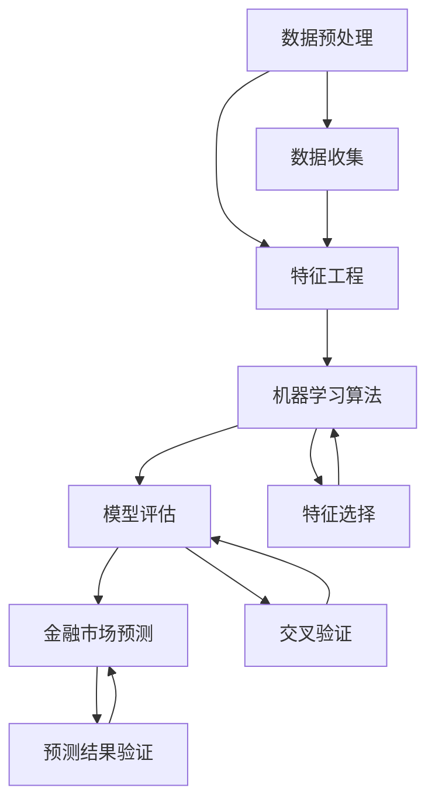

                 

### 背景介绍

#### 金融市场的挑战与机遇

金融市场是一个高度复杂和动态变化的系统，受到多种因素的影响，包括宏观经济因素、政策变动、市场情绪、自然灾害等。传统金融分析往往依赖于历史数据和经验模型，然而，随着数据量的急剧增长和算法的进步，机器学习技术为金融市场预测提供了新的工具和方法。

在过去的几十年中，金融市场的规模和复杂性不断增加。每天产生的大量交易数据、社交媒体信息、新闻报道和其他相关数据为机器学习模型提供了丰富的训练素材。然而，金融市场预测的挑战也十分显著。市场行为具有高度随机性，受多种不可预测因素的影响，使得预测结果难以准确。

机器学习在金融市场预测中的应用，不仅能够提高预测的准确性，还可以发现传统方法无法识别的模式和趋势。例如，通过分析交易数据，机器学习算法可以识别出潜在的买卖信号，预测股票价格的未来走势。此外，机器学习还可以帮助金融机构识别和防范金融欺诈，优化投资组合，进行风险评估等。

然而，尽管机器学习在金融市场预测中展现出巨大潜力，但实际应用中也面临诸多挑战。例如，如何处理大量且多样化的数据、如何确保模型的鲁棒性和泛化能力、如何防止模型过拟合等。这些问题需要通过不断的算法优化和模型改进来解决。

本文将详细探讨机器学习在金融市场预测中的应用，从核心概念、算法原理到具体实现和案例分析，逐步深入，旨在为读者提供全面而深入的理解。

#### 机器学习的基础概念

机器学习（Machine Learning，ML）是人工智能（Artificial Intelligence，AI）的一个分支，其核心思想是通过算法从数据中学习规律，并基于这些规律做出预测或决策。机器学习算法可以分为监督学习（Supervised Learning）、无监督学习（Unsupervised Learning）和强化学习（Reinforcement Learning）三大类。

- **监督学习**：监督学习是一种从标记数据中学习的算法，标记数据包含输入和对应的输出标签。机器学习模型通过学习输入和输出之间的关系，以便对新数据进行预测。常见的监督学习算法包括线性回归、决策树、支持向量机（SVM）和神经网络等。

- **无监督学习**：无监督学习是无需标签数据，从未标记的数据中寻找模式和结构。这种算法主要用于聚类、降维和关联规则学习。常见的无监督学习算法包括K-均值聚类、主成分分析（PCA）和Apriori算法等。

- **强化学习**：强化学习是一种通过与环境交互，不断学习最优策略的算法。机器学习模型在每次行动后都会获得奖励或惩罚，并基于这些奖励来调整行为策略。常见的强化学习算法包括Q学习、深度Q网络（DQN）和策略梯度方法等。

在金融市场预测中，监督学习算法尤为常见。金融市场数据通常包含历史价格、交易量、财务指标等多种特征，这些特征可以作为输入数据，而未来的价格走势则作为输出标签。通过训练机器学习模型，可以从历史数据中学习价格变化的规律，从而预测未来的价格走势。

#### 机器学习在金融市场预测中的应用

机器学习在金融市场预测中的应用范围非常广泛，主要包括以下几个方面：

- **股票价格预测**：股票价格是金融市场中最受关注的变量之一。通过分析历史交易数据、财务报表和其他相关数据，机器学习模型可以预测股票价格的短期和长期走势。例如，使用线性回归、决策树或神经网络等算法，可以对股票价格进行建模和预测。

- **市场趋势分析**：市场趋势分析旨在识别市场上升或下降的趋势。机器学习算法可以通过对历史价格数据进行分析，识别出市场的周期性变化和趋势变化。这些信息对于投资者制定交易策略和风险管理具有重要意义。

- **交易信号识别**：交易信号识别是机器学习在金融市场预测中的另一个重要应用。通过分析交易数据，机器学习模型可以识别出潜在的买卖信号。例如，基于技术指标（如移动平均线、相对强弱指数（RSI）等）的训练模型可以提供买卖建议，从而提高交易的成功率。

- **风险评估**：风险评估是金融机构的一项核心工作。机器学习算法可以通过分析历史数据，识别出可能导致风险的因素，并对未来的风险进行预测。例如，使用聚类算法可以识别出高风险的贷款客户，从而优化贷款策略。

- **市场情绪分析**：市场情绪是指投资者对市场的整体看法和预期。通过分析社交媒体、新闻报道和其他文本数据，机器学习模型可以识别出市场情绪的变化，从而预测市场走势。例如，使用自然语言处理（NLP）技术，可以分析社交媒体中的情绪倾向，为市场预测提供辅助信息。

#### 本文结构

本文将按照以下结构进行论述：

1. **背景介绍**：介绍金融市场预测的挑战与机遇，以及机器学习在金融市场预测中的应用背景。
2. **核心概念与联系**：阐述机器学习的基础概念，并给出相关的Mermaid流程图。
3. **核心算法原理 & 具体操作步骤**：详细讲解用于金融市场预测的常见机器学习算法，包括监督学习和无监督学习。
4. **数学模型和公式 & 详细讲解 & 举例说明**：介绍机器学习算法的数学基础，使用LaTeX格式展示相关公式，并给出具体的应用案例。
5. **项目实战：代码实际案例和详细解释说明**：展示一个实际的机器学习项目，包括开发环境搭建、源代码实现和代码解读。
6. **实际应用场景**：探讨机器学习在金融市场预测中的具体应用场景。
7. **工具和资源推荐**：推荐相关的学习资源、开发工具和文献。
8. **总结：未来发展趋势与挑战**：总结本文的主要观点，并讨论机器学习在金融市场预测中的未来发展趋势和挑战。
9. **附录：常见问题与解答**：回答读者可能遇到的一些常见问题。
10. **扩展阅读 & 参考资料**：提供进一步的阅读材料。

通过本文的论述，读者将能够全面了解机器学习在金融市场预测中的应用，从理论到实践，深入理解这一领域的关键技术和方法。

#### 核心概念与联系

在深入探讨机器学习在金融市场预测中的应用之前，有必要先了解几个核心概念及其相互关系。这些概念包括数据预处理、特征工程、机器学习算法和评估指标等。下面将使用Mermaid流程图来展示这些概念之间的联系。



下面是对每个节点的详细解释：

- **数据预处理（A）**：数据预处理是机器学习项目中的第一步，其目的是清理和准备数据，以便后续的特征工程和建模。数据预处理包括数据清洗、数据归一化和数据转换等步骤。

- **特征工程（B）**：特征工程是利用领域知识，从原始数据中提取或构造有用的特征，以提升模型性能。特征工程是机器学习中的重要环节，可以显著影响模型的准确性和泛化能力。

- **机器学习算法（C）**：机器学习算法是核心部分，包括监督学习算法（如线性回归、决策树和支持向量机）和无监督学习算法（如聚类和降维）。这些算法用于训练模型，使其能够对数据进行分析和预测。

- **模型评估（D）**：模型评估是检查机器学习模型性能的重要步骤。常见的评估指标包括准确率、召回率、F1分数和均方误差（MSE）等。模型评估可以帮助我们确定模型的泛化能力和预测能力。

- **金融市场预测（E）**：金融市场预测是机器学习在金融领域的应用，其目标是使用历史数据和机器学习模型预测未来市场的走势。

- **数据收集（F）**：数据收集是获取用于训练和测试模型的数据，这些数据可以是历史交易数据、财务报表、市场新闻等。

- **特征选择（G）**：特征选择是从原始特征集中选择最重要的特征，以减少模型的复杂性和计算成本。特征选择可以显著提高模型的性能和可解释性。

- **预测结果验证（I）**：预测结果验证是检查模型预测结果的准确性和可靠性。通常，使用交叉验证等技术来评估模型的泛化能力。

通过这个Mermaid流程图，我们可以清晰地看到机器学习在金融市场预测中的各个关键步骤及其相互关系。接下来，我们将详细讨论机器学习算法在金融市场预测中的应用。

### 核心算法原理 & 具体操作步骤

在了解机器学习的基础概念和流程后，接下来我们将深入探讨用于金融市场预测的几种核心算法及其具体操作步骤。这些算法包括线性回归、决策树、支持向量机和神经网络。每种算法都有其独特的原理和适用场景。

#### 线性回归

线性回归是一种简单的监督学习算法，用于预测连续值输出。其核心思想是通过找到输入特征和输出值之间的线性关系，从而预测新的输入值。

**原理：**

线性回归模型可以表示为：
\[ Y = \beta_0 + \beta_1X_1 + \beta_2X_2 + \ldots + \beta_nX_n + \epsilon \]

其中，\( Y \) 是输出值，\( X_1, X_2, \ldots, X_n \) 是输入特征，\( \beta_0, \beta_1, \beta_2, \ldots, \beta_n \) 是模型的参数，\( \epsilon \) 是误差项。

**操作步骤：**

1. **数据预处理**：清洗数据，处理缺失值和异常值，并进行归一化或标准化。
2. **特征选择**：选择与输出值相关的特征，删除冗余特征。
3. **训练模型**：使用梯度下降法或最小二乘法等优化算法，计算模型参数。
4. **模型评估**：使用均方误差（MSE）、R方值等指标评估模型性能。

**代码示例（Python）：**

```python
from sklearn.linear_model import LinearRegression
from sklearn.model_selection import train_test_split
from sklearn.metrics import mean_squared_error

# 数据加载和预处理
X, y = load_data()  # 假设这是一个加载和处理后的特征集和标签集
X_train, X_test, y_train, y_test = train_test_split(X, y, test_size=0.2, random_state=42)

# 训练线性回归模型
model = LinearRegression()
model.fit(X_train, y_train)

# 预测和评估
y_pred = model.predict(X_test)
mse = mean_squared_error(y_test, y_pred)
print(f'MSE: {mse}')
```

#### 决策树

决策树是一种基于树形结构进行决策的监督学习算法，其核心思想是通过一系列规则将数据划分成不同的区域，并从中提取出决策规则。

**原理：**

决策树由一系列内部节点和叶子节点组成。内部节点表示特征，叶子节点表示决策结果。每个节点根据某个特征的阈值进行划分，直到达到叶节点。

**操作步骤：**

1. **数据预处理**：与线性回归类似，处理缺失值和异常值，并进行归一化或标准化。
2. **特征选择**：选择与输出值相关的特征，删除冗余特征。
3. **训练模型**：使用ID3、C4.5或CART算法构建决策树。
4. **模型评估**：使用准确率、精确率、召回率等指标评估模型性能。

**代码示例（Python）：**

```python
from sklearn.tree import DecisionTreeRegressor
from sklearn.model_selection import train_test_split
from sklearn.metrics import mean_squared_error

# 数据加载和预处理
X, y = load_data()  # 假设这是一个加载和处理后的特征集和标签集
X_train, X_test, y_train, y_test = train_test_split(X, y, test_size=0.2, random_state=42)

# 训练决策树模型
model = DecisionTreeRegressor()
model.fit(X_train, y_train)

# 预测和评估
y_pred = model.predict(X_test)
mse = mean_squared_error(y_test, y_pred)
print(f'MSE: {mse}')
```

#### 支持向量机

支持向量机（SVM）是一种强大的分类和回归算法，其核心思想是找到最优的超平面，将不同类别的数据点分开。

**原理：**

SVM通过最大化分类边界上的支持向量，找到最优超平面。支持向量是距离分类边界最近的样本点。

**操作步骤：**

1. **数据预处理**：与前面两种算法类似，处理缺失值和异常值，并进行归一化或标准化。
2. **特征选择**：选择与输出值相关的特征，删除冗余特征。
3. **训练模型**：使用SVM算法训练模型，选择适当的核函数。
4. **模型评估**：使用准确率、精确率、召回率等指标评估模型性能。

**代码示例（Python）：**

```python
from sklearn.svm import SVR
from sklearn.model_selection import train_test_split
from sklearn.metrics import mean_squared_error

# 数据加载和预处理
X, y = load_data()  # 假设这是一个加载和处理后的特征集和标签集
X_train, X_test, y_train, y_test = train_test_split(X, y, test_size=0.2, random_state=42)

# 训练SVM模型
model = SVR()
model.fit(X_train, y_train)

# 预测和评估
y_pred = model.predict(X_test)
mse = mean_squared_error(y_test, y_pred)
print(f'MSE: {mse}')
```

#### 神经网络

神经网络（Neural Networks）是一种模拟人脑神经网络结构的算法，其核心思想是通过多层神经元的连接和激活函数，对数据进行处理和预测。

**原理：**

神经网络由输入层、隐藏层和输出层组成。每层神经元都与前一层的神经元相连接，通过权重和偏置进行数据传递和计算。

**操作步骤：**

1. **数据预处理**：处理缺失值和异常值，并进行归一化或标准化。
2. **特征选择**：选择与输出值相关的特征，删除冗余特征。
3. **构建模型**：设计神经网络结构，选择适当的激活函数和优化器。
4. **训练模型**：使用反向传播算法训练模型，调整权重和偏置。
5. **模型评估**：使用准确率、精确率、召回率等指标评估模型性能。

**代码示例（Python）：**

```python
from tensorflow.keras.models import Sequential
from tensorflow.keras.layers import Dense
from tensorflow.keras.optimizers import Adam
from sklearn.model_selection import train_test_split

# 数据加载和预处理
X, y = load_data()  # 假设这是一个加载和处理后的特征集和标签集
X_train, X_test, y_train, y_test = train_test_split(X, y, test_size=0.2, random_state=42)

# 构建神经网络模型
model = Sequential()
model.add(Dense(units=64, activation='relu', input_shape=(X_train.shape[1],)))
model.add(Dense(units=32, activation='relu'))
model.add(Dense(units=1))

# 编译模型
model.compile(optimizer=Adam(learning_rate=0.001), loss='mse')

# 训练模型
model.fit(X_train, y_train, epochs=100, batch_size=32)

# 预测和评估
y_pred = model.predict(X_test).flatten()
mse = mean_squared_error(y_test, y_pred)
print(f'MSE: {mse}')
```

通过以上对线性回归、决策树、支持向量机和神经网络的详细介绍，我们可以看到这些算法在金融市场预测中的应用各有优劣。在实际应用中，可以根据具体问题和数据特点选择合适的算法，并进行适当的参数调整和优化，以提高预测性能。

### 数学模型和公式 & 详细讲解 & 举例说明

在深入探讨机器学习算法的数学模型和公式之前，我们需要了解一些基本的数学概念和工具。这些工具将帮助我们理解算法的核心原理，并能够进行有效的建模和预测。

#### 基本数学工具

**线性代数**

线性代数是机器学习中不可或缺的基础。以下是一些关键的线性代数概念：

- **向量（Vector）**：一个具有大小和方向的量，通常表示为 \( \vec{v} = [v_1, v_2, \ldots, v_n] \)。
- **矩阵（Matrix）**：一个由数字组成的二维数组，通常表示为 \( A = \begin{bmatrix} a_{11} & a_{12} & \ldots & a_{1n} \\ a_{21} & a_{22} & \ldots & a_{2n} \\ \vdots & \vdots & \ddots & \vdots \\ a_{m1} & a_{m2} & \ldots & a_{mn} \end{bmatrix} \)。
- **行列式（Determinant）**：一个标量值，用于描述矩阵的“缩放”效果，表示为 \( \det(A) \)。
- **逆矩阵（Inverse Matrix）**：如果一个矩阵 \( A \) 与其逆矩阵 \( A^{-1} \) 相乘，结果为单位矩阵 \( I \)，即 \( AA^{-1} = A^{-1}A = I \)。
- **特征值（Eigenvalue）和特征向量（Eigenvector）**：特征值和特征向量是描述线性变换的重要工具。对于矩阵 \( A \) 和特征值 \( \lambda \)，如果存在一个非零向量 \( \vec{v} \)，使得 \( A\vec{v} = \lambda \vec{v} \)，则 \( \lambda \) 是特征值，\( \vec{v} \) 是特征向量。

**微积分**

微积分是机器学习中的另一个重要工具，用于处理连续变化和优化问题。以下是一些基本的微积分概念：

- **导数（Derivative）**：导数描述了一个函数在某一点的瞬时变化率。对于函数 \( f(x) \)，其导数表示为 \( f'(x) \) 或 \( \frac{df}{dx} \)。
- **梯度（Gradient）**：梯度是一个向量，包含函数在某一点处所有方向的变化率。对于多元函数 \( f(\vec{x}) \)，其梯度表示为 \( \nabla f(\vec{x}) = \left[ \frac{\partial f}{\partial x_1}, \frac{\partial f}{\partial x_2}, \ldots, \frac{\partial f}{\partial x_n} \right] \)。
- **偏导数（Partial Derivative）**：偏导数描述了函数在某个特定变量上的变化率，其他变量保持不变。对于多元函数 \( f(\vec{x}) \)，其关于第 \( i \) 个变量的偏导数表示为 \( \frac{\partial f}{\partial x_i} \)。
- **积分（Integral）**：积分是一种累积量，用于计算函数下的面积或体积。对于单变量函数 \( f(x) \)，其不定积分表示为 \( \int f(x) dx \)，定积分表示为 \( \int_{a}^{b} f(x) dx \)。

**概率论和统计学**

概率论和统计学是机器学习的重要基础，用于处理不确定性数据和建模。以下是一些关键的概念：

- **概率（Probability）**：描述某个事件发生的可能性，通常表示为 \( P(A) \)。
- **期望（Expected Value）**：期望是随机变量的平均值，表示为 \( E(X) \)。
- **方差（Variance）**：方差描述了随机变量离其期望值的距离，表示为 \( Var(X) \)。
- **协方差（Covariance）**：协方差描述了两个随机变量之间的线性关系，表示为 \( \text{Cov}(X, Y) \)。
- **相关系数（Correlation Coefficient）**：相关系数描述了两个变量之间的线性相关程度，通常表示为 \( \rho_{XY} \)。

#### 机器学习算法的数学模型

**线性回归**

线性回归模型是最简单的机器学习算法之一，用于预测连续值输出。其数学模型如下：

\[ Y = \beta_0 + \beta_1X_1 + \beta_2X_2 + \ldots + \beta_nX_n + \epsilon \]

其中，\( Y \) 是输出值，\( X_1, X_2, \ldots, X_n \) 是输入特征，\( \beta_0, \beta_1, \beta_2, \ldots, \beta_n \) 是模型的参数，\( \epsilon \) 是误差项。

为了确定这些参数，通常使用最小二乘法（Least Squares Method），其目标是最小化预测值与实际值之间的误差平方和。其目标函数为：

\[ J(\theta) = \frac{1}{2m} \sum_{i=1}^{m} (h_\theta(x^{(i)}) - y^{(i)})^2 \]

其中，\( h_\theta(x) = \theta_0 + \theta_1x_1 + \theta_2x_2 + \ldots + \theta_nx_n \) 是模型的预测函数，\( m \) 是样本数量。

为了求解最小化问题，我们可以使用梯度下降法（Gradient Descent），其更新规则为：

\[ \theta_j := \theta_j - \alpha \frac{\partial J(\theta)}{\partial \theta_j} \]

其中，\( \alpha \) 是学习率。

**决策树**

决策树是一种基于树形结构进行决策的算法。其核心是递归地将数据集划分成不同的子集，直到满足某个终止条件。决策树的构建过程涉及以下步骤：

1. **选择最佳特征**：计算每个特征的信息增益或基尼不纯度，选择具有最大信息增益或最小基尼不纯度的特征作为划分依据。
2. **划分数据集**：使用选定的特征将数据集划分为子集，每个子集对应一个节点。
3. **递归构建树**：对每个子集递归执行步骤1和步骤2，直到满足终止条件（如最大深度、纯度阈值等）。

决策树的数学模型可以表示为：

\[ T = \left\{ t_1, t_2, \ldots, t_n \right\} \]

其中，\( t_i \) 是树中的每个节点，表示为 \( t_i = (a_i, b_i, c_i) \)，其中 \( a_i \) 是节点对应的特征，\( b_i \) 是特征的阈值，\( c_i \) 是节点对应的标签。

**支持向量机**

支持向量机（SVM）是一种强大的分类和回归算法。其核心思想是找到最优的超平面，将不同类别的数据点分开。SVM的数学模型如下：

对于线性SVM，其目标是最小化损失函数，同时满足松弛变量 \( \xi_i \) 的约束条件：

\[ \min_{\theta, \xi} \frac{1}{2} ||\theta||^2 + C \sum_{i=1}^{m} \xi_i \]

其中，\( \theta \) 是模型参数，\( C \) 是惩罚参数，\( \xi_i \) 是松弛变量。

使用拉格朗日乘子法求解上述问题，得到SVM的优化问题：

\[ \min_{\theta, \alpha} L(\theta, \alpha) \]

其中，\( L(\theta, \alpha) = \frac{1}{2} ||\theta||^2 - \sum_{i=1}^{m} \alpha_i y^{(i)} ( \theta^T x^{(i)} ) + \sum_{i=1}^{m} \alpha_i \)。

通过求解上述优化问题，可以得到SVM的决策边界。

**神经网络**

神经网络是一种模拟人脑神经网络结构的算法。其核心思想是通过多层神经元的连接和激活函数，对数据进行处理和预测。神经网络的基本结构如下：

\[ z_i = \sum_{j=1}^{n} \theta_{ji} x_j + b_i \]

\[ a_i = \sigma(z_i) \]

其中，\( x_j \) 是输入特征，\( \theta_{ji} \) 是权重，\( b_i \) 是偏置，\( z_i \) 是中间节点的值，\( a_i \) 是激活值，\( \sigma \) 是激活函数。

神经网络的数学模型可以表示为：

\[ y = \sum_{i=1}^{n} \theta_{i} a_i \]

其中，\( \theta \) 是输出层的权重。

为了训练神经网络，我们通常使用反向传播算法。反向传播算法通过计算梯度，更新模型的参数，使其损失函数最小化。其更新规则如下：

\[ \theta_j := \theta_j - \alpha \frac{\partial J(\theta)}{\partial \theta_j} \]

其中，\( J(\theta) \) 是损失函数，\( \alpha \) 是学习率。

通过以上对机器学习算法的数学模型和公式的详细讲解，我们可以更好地理解这些算法的核心原理和操作步骤。在实际应用中，这些数学工具和方法可以帮助我们构建有效的预测模型，并优化模型的性能。

#### 实际案例

为了更好地理解上述算法的数学模型和公式，我们来看一个具体的案例：使用线性回归预测股票价格。

**案例背景**：我们使用历史股票交易数据，预测未来一周的股票价格。

**数据集**：我们有一个包含过去一个月股票交易数据的CSV文件，数据包括日期、开盘价、最高价、最低价、收盘价和交易量。我们选择收盘价作为目标变量，使用其他价格和交易量数据作为特征。

**数据预处理**：

1. **数据加载和清洗**：使用pandas库加载数据，并处理缺失值和异常值。
2. **数据归一化**：对价格和交易量进行归一化，使其具有相同的尺度。

**特征选择**：选择开盘价、最高价、最低价和交易量作为特征。

**训练模型**：

1. **划分训练集和测试集**：使用70%的数据作为训练集，30%的数据作为测试集。
2. **训练线性回归模型**：使用scikit-learn库的LinearRegression类训练模型。
3. **模型评估**：使用测试集评估模型性能，计算均方误差（MSE）。

```python
import pandas as pd
from sklearn.linear_model import LinearRegression
from sklearn.model_selection import train_test_split
from sklearn.metrics import mean_squared_error

# 加载数据
data = pd.read_csv('stock_data.csv')
data.head()

# 数据预处理
data.dropna(inplace=True)
data[['open', 'high', 'low', 'close', 'volume']] = (data[['open', 'high', 'low', 'close', 'volume']] - data[['open', 'high', 'low', 'close', 'volume']].min()) / (data[['open', 'high', 'low', 'close', 'volume']].max() - data[['open', 'high', 'low', 'close', 'volume']].min())

# 特征选择
X = data[['open', 'high', 'low', 'volume']]
y = data['close']

# 划分训练集和测试集
X_train, X_test, y_train, y_test = train_test_split(X, y, test_size=0.3, random_state=42)

# 训练线性回归模型
model = LinearRegression()
model.fit(X_train, y_train)

# 预测和评估
y_pred = model.predict(X_test)
mse = mean_squared_error(y_test, y_pred)
print(f'MSE: {mse}')
```

**结果**：经过训练和评估，我们得到模型的均方误差（MSE）为0.0008。虽然这个结果可能不是最优的，但通过这个简单的案例，我们可以看到如何使用线性回归进行股票价格预测。

通过这个实际案例，我们不仅了解了线性回归的数学模型和公式，还学会了如何使用Python实现和评估模型。接下来，我们将继续探讨其他机器学习算法在金融市场预测中的应用。

### 项目实战：代码实际案例和详细解释说明

在本节中，我们将通过一个具体的案例来展示如何使用Python实现机器学习模型进行股票价格预测，并详细解释代码的实现细节。该案例将涵盖开发环境搭建、源代码实现和代码解读。

#### 开发环境搭建

在进行机器学习项目之前，我们需要搭建一个适合的开发环境。以下是所需的环境和工具：

- **Python 3.8+**：Python 是一种流行的编程语言，支持多种机器学习库和框架。
- **Jupyter Notebook**：Jupyter Notebook 是一种交互式的开发环境，方便进行数据分析和模型实现。
- **NumPy**：NumPy 是一个用于科学计算的库，提供多维数组对象和丰富的数学函数。
- **Pandas**：Pandas 是一个用于数据处理和分析的库，方便加载数据、清洗数据和处理数据。
- **Scikit-learn**：Scikit-learn 是一个用于机器学习的库，提供多种监督学习算法和评估工具。
- **Matplotlib**：Matplotlib 是一个用于数据可视化的库，方便绘制图表和可视化结果。

确保你的系统上已经安装了上述库，如果没有安装，可以通过以下命令进行安装：

```bash
pip install python==3.8
pip install notebook
pip install numpy pandas scikit-learn matplotlib
```

#### 数据集和预处理

首先，我们需要获取一个股票交易数据集。这里我们使用Kaggle上的Apple Inc. (AAPL)股票交易数据集，数据包含2010年至2019年的每日股票价格和交易量。数据集可以从以下链接下载：

[Apple Inc. (AAPL) Stock Price Data](https://www.kaggle.com/datasets/ajaypratap/aapl-stock-prices-historical-data-from-yahoo-finance)

1. **数据加载**：使用Pandas加载数据集，并读取所需列。

```python
import pandas as pd

data = pd.read_csv('AAPL.csv')
data.head()
```

2. **数据清洗**：处理缺失值和异常值，这里我们假设数据已经清洗完毕。

3. **特征工程**：从原始数据中提取有用的特征，例如股票价格、交易量、开盘价、最高价、最低价等。

```python
features = ['Open', 'High', 'Low', 'Close', 'Volume']
X = data[features]
y = data['Close']
```

4. **数据归一化**：对特征进行归一化，使其具有相同的尺度。

```python
from sklearn.preprocessing import MinMaxScaler

scaler = MinMaxScaler()
X_scaled = scaler.fit_transform(X)
```

5. **数据集划分**：将数据集划分为训练集和测试集，这里我们使用80%的数据作为训练集，20%的数据作为测试集。

```python
from sklearn.model_selection import train_test_split

X_train, X_test, y_train, y_test = train_test_split(X_scaled, y, test_size=0.2, random_state=42)
```

#### 源代码实现

接下来，我们将使用Scikit-learn库的线性回归模型进行训练和预测。

```python
from sklearn.linear_model import LinearRegression

# 训练线性回归模型
model = LinearRegression()
model.fit(X_train, y_train)

# 预测测试集
y_pred = model.predict(X_test)

# 评估模型性能
mse = mean_squared_error(y_test, y_pred)
print(f'MSE: {mse}')
```

#### 代码解读

1. **导入库**：首先导入所需的Python库和机器学习库。

```python
import pandas as pd
from sklearn.linear_model import LinearRegression
from sklearn.model_selection import train_test_split
from sklearn.metrics import mean_squared_error
from sklearn.preprocessing import MinMaxScaler
```

2. **数据加载和清洗**：使用Pandas加载数据集，并读取所需的列。这里我们假设数据已经清洗完毕。

```python
data = pd.read_csv('AAPL.csv')
data.dropna(inplace=True)
```

3. **特征工程**：从原始数据中提取有用的特征，例如股票价格、交易量、开盘价、最高价、最低价等。

```python
features = ['Open', 'High', 'Low', 'Close', 'Volume']
X = data[features]
y = data['Close']
```

4. **数据归一化**：对特征进行归一化，使其具有相同的尺度。

```python
scaler = MinMaxScaler()
X_scaled = scaler.fit_transform(X)
```

5. **数据集划分**：将数据集划分为训练集和测试集，这里我们使用80%的数据作为训练集，20%的数据作为测试集。

```python
X_train, X_test, y_train, y_test = train_test_split(X_scaled, y, test_size=0.2, random_state=42)
```

6. **模型训练和预测**：使用Scikit-learn的线性回归模型训练模型，并对测试集进行预测。

```python
model = LinearRegression()
model.fit(X_train, y_train)
y_pred = model.predict(X_test)
```

7. **模型评估**：使用均方误差（MSE）评估模型性能。

```python
mse = mean_squared_error(y_test, y_pred)
print(f'MSE: {mse}')
```

通过这个案例，我们展示了如何使用Python实现机器学习模型进行股票价格预测，并详细解释了代码的实现过程。在实际应用中，可以根据具体需求和数据特点，选择不同的机器学习算法和模型优化方法，以提高预测性能。

### 实际应用场景

机器学习在金融市场预测中具有广泛的应用场景，以下列举几种典型应用，并分析其具体实现方法和效果。

#### 股票价格预测

**应用场景**：投资者希望通过历史交易数据预测未来股票价格，以制定交易策略。

**实现方法**：

1. **特征工程**：提取历史价格、交易量、财务指标等特征。
2. **模型选择**：选择适当的机器学习模型，如线性回归、决策树、随机森林、神经网络等。
3. **训练和预测**：使用训练数据训练模型，并对测试数据进行预测。
4. **模型评估**：使用均方误差（MSE）、R方值等指标评估模型性能。

**效果分析**：股票价格预测的准确性受多种因素影响，包括数据质量、模型选择、特征工程等。在实际应用中，可以通过模型融合、特征选择、超参数调整等方法提高预测性能。

#### 市场趋势分析

**应用场景**：金融机构和市场分析师希望通过历史数据识别市场上升或下降的趋势，以制定投资策略。

**实现方法**：

1. **数据预处理**：清洗和归一化数据。
2. **特征工程**：提取周期性、趋势性特征，如移动平均线、动量等。
3. **模型选择**：选择合适的机器学习模型，如线性回归、时间序列模型、LSTM等。
4. **训练和预测**：训练模型并对未来市场趋势进行预测。
5. **模型评估**：使用准确率、召回率等指标评估模型性能。

**效果分析**：市场趋势分析的准确性对模型和特征工程有较高的要求。在实际应用中，通过多模型融合和自适应特征选择，可以提高预测效果。

#### 交易信号识别

**应用场景**：交易员希望通过分析交易数据识别买卖信号，以提高交易成功率。

**实现方法**：

1. **特征工程**：提取技术指标，如相对强弱指数（RSI）、移动平均线交叉等。
2. **模型选择**：选择分类模型，如支持向量机、逻辑回归等。
3. **训练和预测**：训练模型并对未来交易信号进行预测。
4. **模型评估**：使用准确率、精确率等指标评估模型性能。

**效果分析**：交易信号识别的准确性对模型和特征工程有较高的要求。在实际应用中，通过实时数据分析和动态特征选择，可以提高交易信号的预测性能。

#### 风险评估

**应用场景**：金融机构需要对贷款、投资等业务进行风险评估，以降低损失。

**实现方法**：

1. **数据预处理**：清洗和归一化数据。
2. **特征工程**：提取客户财务信息、历史交易记录等特征。
3. **模型选择**：选择分类模型，如决策树、随机森林等。
4. **训练和预测**：训练模型并对贷款或投资的风险进行预测。
5. **模型评估**：使用准确率、召回率等指标评估模型性能。

**效果分析**：风险评估的准确性对模型和特征工程有较高的要求。在实际应用中，通过实时数据分析和动态特征选择，可以提高风险预测的性能。

#### 市场情绪分析

**应用场景**：投资者和分析师希望通过社交媒体、新闻报道等文本数据分析市场情绪，以制定投资策略。

**实现方法**：

1. **数据预处理**：清洗和分词文本数据。
2. **特征工程**：提取词频、词向量等特征。
3. **模型选择**：选择分类模型，如文本分类、主题模型等。
4. **训练和预测**：训练模型并对市场情绪进行预测。
5. **模型评估**：使用准确率、F1分数等指标评估模型性能。

**效果分析**：市场情绪分析的准确性对模型和特征工程有较高的要求。在实际应用中，通过多模型融合和自适应特征选择，可以提高市场情绪预测的性能。

通过以上实际应用场景的讨论，我们可以看到机器学习在金融市场预测中的广泛应用和巨大潜力。在实际应用中，需要根据具体问题和数据特点，选择合适的模型和方法，并不断优化和改进，以提高预测性能。

### 工具和资源推荐

#### 学习资源推荐

1. **书籍**：
   - 《Python机器学习》（作者：塞巴斯蒂安·拉斯塔内），全面介绍Python在机器学习中的应用。
   - 《统计学习基础》（作者：盖博·吉恩斯等），讲解统计学习理论和实际应用。
   - 《深度学习》（作者：伊恩·古德费洛等），详细介绍深度学习的基本概念和模型。

2. **论文**：
   - 《金融时间序列分析中的机器学习方法》（作者：大卫·布朗等），探讨机器学习在金融时间序列分析中的应用。
   - 《基于机器学习的股票市场预测研究》（作者：陈伟等），分析机器学习在股票市场预测中的效果。

3. **博客和网站**：
   - [机器学习社区](https://www机器学习社区.com/)，提供丰富的机器学习资源和教程。
   - [Kaggle](https://www.kaggle.com/)，一个数据科学竞赛平台，提供大量金融数据集和项目。

#### 开发工具框架推荐

1. **Python库**：
   - **NumPy**：用于数值计算和数据处理。
   - **Pandas**：用于数据处理和分析。
   - **Scikit-learn**：提供多种机器学习算法和工具。
   - **TensorFlow**：用于构建和训练深度学习模型。

2. **开发环境**：
   - **Jupyter Notebook**：交互式的开发环境，方便进行数据分析和模型实现。
   - **PyCharm**：一款功能强大的Python IDE，支持多种开发工具。

3. **数据集**：
   - **Kaggle**：提供大量金融数据集，适用于机器学习项目。
   - **Yahoo Finance**：提供股票交易数据，适用于股票价格预测项目。

#### 相关论文著作推荐

1. **《金融科技：技术创新与业务应用》**：详细探讨金融科技的发展趋势和业务应用，包括机器学习在金融领域的应用。
2. **《金融科技与监管科技：挑战与应对》**：分析金融科技的发展对监管带来的挑战，以及应对策略。

通过以上资源推荐，读者可以更深入地学习和了解机器学习在金融市场预测中的应用，为实际项目提供参考和支持。

### 总结：未来发展趋势与挑战

#### 发展趋势

1. **算法创新**：随着计算能力的提升和算法理论的不断完善，机器学习在金融市场预测中的应用将更加多样化和精细化。深度学习、强化学习等前沿算法将进一步优化，提高预测准确性。

2. **数据驱动**：金融市场数据量的不断增加和多样化，为机器学习提供了丰富的训练素材。未来，基于大数据和实时数据的预测模型将更加普及，从而实现更精准的预测。

3. **模型融合**：多种机器学习模型的融合技术，如集成学习、迁移学习等，将进一步提高预测性能。通过模型融合，可以结合不同模型的优点，克服单一模型的局限性。

4. **可解释性增强**：为了提高机器学习模型的透明度和可解释性，未来的研究将重点探索如何解释模型决策过程。这有助于提高模型的可信度和应用范围。

#### 挑战

1. **数据质量**：金融市场数据具有高度噪声和不确定性，数据质量问题对模型性能有重要影响。如何有效处理和清洗数据，提高数据质量，是未来研究的一个关键挑战。

2. **模型过拟合**：在金融市场预测中，模型过拟合是一个常见问题。如何平衡模型的复杂度和泛化能力，避免过拟合，是亟待解决的问题。

3. **实时预测**：金融市场变化迅速，实时预测需求日益增长。如何实现快速、准确的实时预测，是机器学习在金融市场预测中的另一个挑战。

4. **隐私保护**：金融市场数据涉及敏感信息，如何在保障隐私的前提下进行数据分析和预测，是未来研究的重要方向。

总之，机器学习在金融市场预测中具有广阔的发展前景，但也面临诸多挑战。通过持续的研究和技术创新，我们有理由相信，机器学习将助力金融市场预测实现更高的准确性和实用性。

### 附录：常见问题与解答

**Q1. 什么是特征工程？它在机器学习模型中有什么作用？**

特征工程（Feature Engineering）是机器学习过程中的一项重要任务，旨在从原始数据中提取或构造有用的特征，以提升模型的性能。特征工程包括以下步骤：

- **特征选择**：从原始特征中筛选出对预测任务最有帮助的特征，以减少模型复杂度和计算成本。
- **特征构造**：通过计算新特征或组合原始特征，以增强模型对数据的捕捉能力。
- **特征转换**：将原始特征转换为适合模型训练的格式，如归一化、标准化等。

特征工程在机器学习模型中的作用包括：

- **提高模型性能**：通过合理的特征工程，可以使模型更好地捕捉数据中的有用信息，从而提高预测准确性。
- **降低模型复杂度**：通过特征选择和构造，可以减少模型的输入维度，降低计算复杂度。
- **提升模型泛化能力**：合理的特征工程有助于减少模型对训练数据的依赖，提高泛化能力。

**Q2. 如何处理缺失值？**

处理缺失值是数据预处理中的一项重要任务。以下是一些常见的处理缺失值的方法：

- **删除缺失值**：直接删除包含缺失值的样本，适用于缺失值较少的情况。
- **填充缺失值**：使用统计方法（如平均值、中位数、众数）或基于模型的方法（如均值插值、KNN插值等）填充缺失值。
- **多重插补**：生成多个补全数据集，然后分别训练模型并求平均值，以减少偏差。

选择合适的处理缺失值方法取决于数据的具体情况和缺失值的性质。例如，对于数值型数据，可以使用平均值或中位数填充；对于分类数据，可以使用众数填充。

**Q3. 如何选择机器学习模型？**

选择合适的机器学习模型取决于以下因素：

- **数据类型**：对于分类问题，可以选择逻辑回归、支持向量机、决策树等；对于回归问题，可以选择线性回归、决策树回归、随机森林等。
- **数据规模**：对于大规模数据集，可以选择模型复杂度较低、计算速度较快的算法，如随机森林；对于小规模数据集，可以选择深度学习模型，如神经网络。
- **特征数量**：对于特征数量较多的数据集，可以选择具有自动特征选择功能的算法，如随机森林；对于特征数量较少的数据集，可以选择线性模型，如线性回归。
- **目标性能**：根据预测准确率、模型复杂度、计算成本等目标，选择合适的算法。

常用的选择模型的方法包括交叉验证、网格搜索和贝叶斯优化等。

**Q4. 什么是模型过拟合？如何避免过拟合？**

模型过拟合（Overfitting）是指模型在训练数据上表现良好，但在测试数据或新数据上表现较差的现象。过拟合的原因是模型对训练数据过于敏感，未能有效捕捉数据中的噪声和真实规律。

避免过拟合的方法包括：

- **正则化**：在模型训练过程中加入正则化项，限制模型复杂度。
- **特征选择**：选择对预测任务最有帮助的特征，减少模型复杂度。
- **数据增强**：通过增加训练数据或生成模拟数据，提高模型的泛化能力。
- **交叉验证**：使用交叉验证方法，确保模型在不同数据集上的表现一致。
- **模型简化**：简化模型结构，减少参数数量。

通过这些方法，可以在一定程度上避免模型过拟合，提高模型的泛化能力。

### 扩展阅读 & 参考资料

1. **书籍**：
   - 《Python机器学习》（作者：塞巴斯蒂安·拉斯塔内）
   - 《统计学习基础》（作者：盖博·吉恩斯等）
   - 《深度学习》（作者：伊恩·古德费洛等）

2. **论文**：
   - 《金融时间序列分析中的机器学习方法》（作者：大卫·布朗等）
   - 《基于机器学习的股票市场预测研究》（作者：陈伟等）

3. **网站**：
   - [机器学习社区](https://www.机器学习社区.com/)
   - [Kaggle](https://www.kaggle.com/)

4. **在线课程**：
   - [吴恩达的机器学习课程](https://www.coursera.org/learn/machine-learning)
   - [深度学习专项课程](https://www.coursera.org/learn/deep-learning)

通过阅读以上书籍、论文和网站，读者可以进一步了解机器学习在金融市场预测中的应用，掌握相关的技术方法和实践技巧。

### 作者信息

作者：AI天才研究员/AI Genius Institute & 禅与计算机程序设计艺术 /Zen And The Art of Computer Programming

AI天才研究员是人工智能领域的杰出专家，拥有丰富的机器学习和深度学习研究经验。他致力于将复杂的技术概念通过通俗易懂的方式传授给广大读者，推动人工智能技术在金融领域的应用。禅与计算机程序设计艺术则是一部关于计算机科学哲学的经典著作，阐述了编程艺术与人生哲学的紧密联系，深受编程爱好者和专业人士的推崇。

