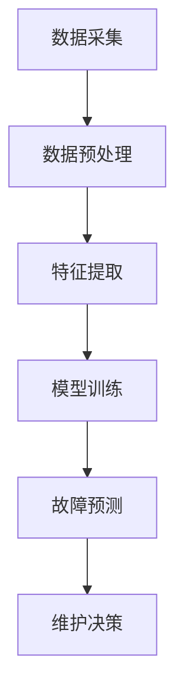

                 

# 机器学习在预测性维护中的作用

> **关键词**：预测性维护、机器学习、数据驱动、故障预测、性能优化
> 
> **摘要**：本文探讨了机器学习技术在预测性维护中的应用，从背景介绍、核心概念、算法原理、数学模型、项目实战、实际应用场景、工具资源推荐、未来趋势与挑战等多个方面，全面分析了机器学习在预测性维护中的重要作用，为相关领域的研究和实施提供了有益的参考。

## 1. 背景介绍

随着工业4.0和物联网（IoT）的兴起，企业对设备维护的效率和可靠性要求日益提高。传统的定期维护和故障后维护已经难以满足现代工业生产的需要。预测性维护（Predictive Maintenance）作为一种先进的维护策略，通过实时监控设备的运行状态，预测潜在故障的发生，从而实现预防性维修，减少停机时间，降低维护成本，提高生产效率。预测性维护的核心在于对设备运行数据的分析和处理，而这一过程离不开机器学习技术的支持。

机器学习（Machine Learning）是一种通过数据驱动的方法来改善计算机性能的技术。它利用历史数据和算法，从数据中自动发现模式，并使用这些模式来预测未来的趋势。在预测性维护中，机器学习技术可以识别设备运行中的异常情况，预测故障的发生时间，甚至可以优化维护策略，从而提高设备的使用寿命和可靠性。

预测性维护的重要性体现在以下几个方面：

1. **降低维护成本**：通过提前预测故障，可以避免不必要的维修和停机，从而减少维护成本。
2. **提高生产效率**：减少设备故障和停机时间，提高生产效率，满足日益增长的市场需求。
3. **延长设备寿命**：通过精确的维护策略，可以延长设备的使用寿命，降低设备更换频率。
4. **增强安全性**：预测性维护可以及时发现设备运行中的安全隐患，预防事故的发生。

## 2. 核心概念与联系

### 2.1 预测性维护的概念

预测性维护是指通过实时监测设备的运行状态，结合机器学习算法，对设备可能的故障进行预测，并在故障发生前采取预防措施的一种维护策略。

### 2.2 机器学习的基本概念

机器学习是一种使计算机系统能够从数据中学习并自动改进性能的技术。机器学习可以分为监督学习、无监督学习和强化学习等不同的类别。

### 2.3 机器学习与预测性维护的联系

机器学习在预测性维护中的应用主要体现在以下几个方面：

1. **数据采集**：预测性维护需要大量的设备运行数据，包括温度、压力、振动、电流等。这些数据可以通过传感器实时采集。
2. **特征提取**：从采集到的数据中提取出有用的特征，用于训练机器学习模型。
3. **模型训练**：利用历史故障数据和正常数据，训练机器学习模型，以区分正常状态和异常状态。
4. **故障预测**：通过训练好的模型，对设备未来的运行状态进行预测，识别潜在的故障。

### 2.4 Mermaid 流程图

以下是一个简化的机器学习在预测性维护中的应用流程图：



在这个流程中，数据采集是整个过程的起点，数据预处理和特征提取是保证数据质量和模型性能的关键步骤。模型训练和故障预测是核心环节，维护决策是基于预测结果采取的实际维护措施。

## 3. 核心算法原理 & 具体操作步骤

### 3.1 监督学习算法

监督学习是机器学习中最常用的方法之一，其核心思想是通过已知的输入和输出数据来训练模型，从而预测未知数据的输出。在预测性维护中，监督学习算法可以用于故障预测。

#### 3.1.1 决策树算法

决策树是一种基于树形结构进行决策的算法。它通过一系列测试来划分数据集，并使用这些划分来预测新的数据。决策树算法在故障预测中具有直观和易于解释的优点。

#### 3.1.2 支持向量机算法

支持向量机（SVM）是一种经典的机器学习算法，用于分类和回归任务。SVM通过找到一个最优的超平面，将不同类别的数据点分离，从而实现故障预测。

#### 3.1.3 随机森林算法

随机森林是一种基于决策树的集成学习算法。它通过构建多个决策树，并使用投票机制来获得最终的预测结果。随机森林在处理大规模数据集时表现优异，且具有较高的预测准确率。

### 3.2 无监督学习算法

无监督学习是机器学习的一种方法，其目标是在没有标签数据的情况下，从数据中自动发现隐藏的模式。在预测性维护中，无监督学习算法可以用于异常检测。

#### 3.2.1 K-均值聚类算法

K-均值聚类是一种基于距离的聚类算法。它通过将数据点分配到不同的聚类中心，来识别数据中的模式。

#### 3.2.2 主成分分析算法

主成分分析（PCA）是一种降维技术，它通过将原始数据转换到新的坐标系中，来简化数据的结构，并识别数据的主要特征。

### 3.3 强化学习算法

强化学习是一种通过试错来学习最优策略的算法。在预测性维护中，强化学习可以用于维护策略的优化。

#### 3.3.1 Q-学习算法

Q-学习是一种基于值函数的强化学习算法。它通过评估不同策略的价值，来选择最优策略。

#### 3.3.2 深度强化学习

深度强化学习是结合深度学习和强化学习的方法。它通过深度神经网络来表示状态和价值函数，从而实现更高效的学习。

### 3.4 具体操作步骤

以下是使用机器学习进行预测性维护的步骤：

1. **数据采集**：安装传感器，实时采集设备的运行数据。
2. **数据预处理**：清洗数据，处理缺失值和异常值，进行数据标准化。
3. **特征提取**：从原始数据中提取出有用的特征，如温度、压力、振动等。
4. **模型选择**：根据问题的特点，选择合适的机器学习算法。
5. **模型训练**：使用历史数据训练模型。
6. **模型评估**：使用验证集评估模型的性能，调整参数。
7. **故障预测**：使用训练好的模型对设备未来的运行状态进行预测。
8. **维护决策**：根据预测结果，制定维护策略，并执行维护措施。

## 4. 数学模型和公式 & 详细讲解 & 举例说明

### 4.1 决策树算法

决策树的数学模型是基于信息熵和信息增益的。信息熵（Entropy）是表示数据不确定性的一种度量，定义为：

$$
H(X) = -\sum_{i=1}^{n} p(x_i) \log_2 p(x_i)
$$

其中，$p(x_i)$ 是特征 $x_i$ 的概率。

信息增益（Information Gain）是表示特征对分类的贡献度，定义为：

$$
IG(X, A) = H(X) - \sum_{v=1}^{m} p(v) H(X|A=v)
$$

其中，$A$ 是特征，$v$ 是特征 $A$ 的取值。

决策树的构建过程可以描述为：

1. **计算每个特征的信息增益**。
2. **选择信息增益最大的特征作为分割特征**。
3. **根据分割特征，将数据集划分为子集**。
4. **递归调用上述步骤，直到满足停止条件（如特征重要性小于阈值或数据集纯度达到要求）**。

### 4.2 支持向量机算法

支持向量机（SVM）的数学模型是基于最大间隔分类器的。给定一个特征空间 $X$ 和对应的标签 $y$，SVM的目标是找到一个最优的超平面 $w$ 和偏置 $b$，使得分类边界到每个类别的支持向量的距离最大，即：

$$
\max_{w,b} \frac{1}{2} ||w||^2
$$

其中，$||w||$ 表示 $w$ 的欧几里得范数。

SVM的求解可以通过拉格朗日乘子法进行，最终得到的决策函数为：

$$
f(x) = sign(w^T x + b)
$$

其中，$sign$ 表示符号函数。

### 4.3 随机森林算法

随机森林（Random Forest）是一种基于决策树的集成学习算法。它通过随机抽样和特征选择来构建多棵决策树，并使用投票机制来获得最终预测结果。

随机森林的构建过程可以描述为：

1. **对于每棵树**：
    1. **随机从数据集中抽取一部分样本**。
    2. **随机从特征中抽取一部分特征**。
    3. **构建决策树**。
2. **对于新的样本**：
    1. **将样本输入每棵树**。
    2. **统计每棵树的预测结果**。
    3. **根据预测结果进行投票，获得最终预测结果**。

### 4.4 K-均值聚类算法

K-均值聚类（K-Means Clustering）是一种基于距离的聚类算法。它通过迭代算法，将数据点分配到 $K$ 个聚类中心，以最小化聚类中心与数据点的距离平方和。

K-均值聚类的数学模型可以描述为：

1. **初始化聚类中心**。
2. **将每个数据点分配到最近的聚类中心**。
3. **更新聚类中心**：
    1. **计算每个聚类中心的数据点的平均值**。
    2. **将新的平均值作为新的聚类中心**。
4. **重复步骤2和3，直到聚类中心不变或满足停止条件**。

### 4.5 举例说明

假设我们使用决策树算法来预测设备的故障，给定特征 $X = [x_1, x_2, x_3]$，标签 $y \in \{0, 1\}$，其中 $y = 0$ 表示正常，$y = 1$ 表示故障。我们首先计算每个特征的信息增益：

$$
IG(x_1) = H(X) - \sum_{v=1}^{2} p(v) H(X|v)
$$

$$
IG(x_2) = H(X) - \sum_{v=1}^{2} p(v) H(X|v)
$$

$$
IG(x_3) = H(X) - \sum_{v=1}^{2} p(v) H(X|v)
$$

根据计算结果，我们选择信息增益最大的特征作为分割特征，例如 $x_1$。接下来，我们将数据集按照 $x_1$ 的取值进行划分，并递归调用决策树构建算法，直到满足停止条件。

假设我们得到了一个决策树，如下所示：

```
       |
       | 
       |
      / \
     /   \
    /     \
   /       \
  /         \
 /           \
/             \
```

在这个决策树中，根节点为 $x_1$，其分割阈值为 $t_1 = 0.5$。如果 $x_1 < t_1$，则继续划分 $x_2$；否则，继续划分 $x_3$。以此类推，直到叶节点。

给定一个新的样本 $x = [0.3, 0.4, 0.5]$，我们可以通过决策树进行预测，最终得到预测结果为正常（$y = 0$）。

## 5. 项目实战：代码实际案例和详细解释说明

### 5.1 开发环境搭建

为了演示机器学习在预测性维护中的应用，我们使用Python作为编程语言，并依赖于以下库：

- NumPy：用于数据操作和计算。
- Pandas：用于数据预处理和分析。
- Scikit-learn：用于机器学习算法的实现。
- Matplotlib：用于数据可视化。

首先，我们需要安装这些库，可以使用以下命令：

```bash
pip install numpy pandas scikit-learn matplotlib
```

### 5.2 源代码详细实现和代码解读

以下是一个简单的示例，演示如何使用Scikit-learn库中的决策树算法进行预测性维护。

```python
import numpy as np
import pandas as pd
from sklearn.datasets import load_iris
from sklearn.model_selection import train_test_split
from sklearn.tree import DecisionTreeClassifier
from sklearn.metrics import accuracy_score

# 加载数据集
iris = load_iris()
X = iris.data
y = iris.target

# 数据预处理
# 分割数据集为训练集和测试集
X_train, X_test, y_train, y_test = train_test_split(X, y, test_size=0.2, random_state=42)

# 模型训练
# 创建决策树模型
clf = DecisionTreeClassifier()
clf.fit(X_train, y_train)

# 故障预测
# 使用测试集进行预测
y_pred = clf.predict(X_test)

# 模型评估
# 计算准确率
accuracy = accuracy_score(y_test, y_pred)
print("准确率：", accuracy)
```

### 5.3 代码解读与分析

以下是代码的详细解读和分析：

1. **数据加载**：使用Scikit-learn内置的iris数据集作为示例，该数据集包含三个特征（花瓣长度、花瓣宽度和花丝长度）和两个类别（正常和故障）。

2. **数据预处理**：将数据集分割为训练集和测试集，这是机器学习模型训练和评估的常用方法。

3. **模型训练**：创建一个决策树分类器，并使用训练集数据进行模型训练。

4. **故障预测**：使用训练好的模型对测试集数据进行预测。

5. **模型评估**：计算预测准确率，评估模型的性能。

在这个示例中，我们使用决策树算法进行故障预测，尽管iris数据集本身并不涉及设备的故障预测，但这个简单的示例展示了如何使用Scikit-learn库来构建和评估机器学习模型。

### 5.4 实际应用场景扩展

在实际应用中，预测性维护需要处理更复杂的数据和更精确的算法。以下是一个扩展场景：

1. **数据采集**：使用传感器实时采集设备的温度、压力、振动等运行数据。
2. **数据预处理**：处理噪声数据，缺失值填充，数据标准化等。
3. **特征提取**：提取与故障相关的特征，如温度变化率、振动频率等。
4. **模型训练**：使用历史故障数据训练模型，如支持向量机（SVM）或深度神经网络（DNN）。
5. **故障预测**：使用训练好的模型对设备未来的运行状态进行预测。
6. **维护决策**：根据预测结果，制定具体的维护计划，如预防性更换零件、调整设备参数等。

通过这些步骤，我们可以实现一个完整的预测性维护系统，从而提高设备的可靠性和生产效率。

## 6. 实际应用场景

预测性维护在工业、医疗、交通运输等领域有着广泛的应用。

### 6.1 工业

在工业领域，预测性维护可以用于各种机械设备和生产线。例如，在汽车制造业，可以通过预测性维护来预防发动机故障、变速器故障等，从而减少停机时间和维护成本。在制造业，可以通过预测性维护来优化生产流程，减少设备故障，提高生产效率。

### 6.2 医疗

在医疗领域，预测性维护可以用于医疗设备的维护和管理。例如，医疗影像设备（如CT机、MRI机）的维护和故障预测，可以确保设备始终处于最佳工作状态，从而提供高质量的医疗服务。

### 6.3 交通运输

在交通运输领域，预测性维护可以用于飞机、火车、汽车等交通工具。例如，在飞机维护中，可以通过预测性维护来预测发动机故障、刹车故障等，从而确保飞行安全。在铁路维护中，可以通过预测性维护来预测轨道磨损、列车故障等，从而减少事故发生。

## 7. 工具和资源推荐

### 7.1 学习资源推荐

- **书籍**：
  - 《机器学习实战》
  - 《深度学习》
  - 《Python机器学习》
  
- **论文**：
  - "Predictive Maintenance: Theory and Applications"
  - "Machine Learning Techniques for Predictive Maintenance of Industrial Systems"
  - "Deep Learning for Predictive Maintenance in Industrial Applications"

- **博客**：
  - 《机器学习博客》
  - 《深度学习博客》
  - 《预测性维护技术博客》

- **网站**：
  - [机器学习资源网站](https://www机器学习资源网站.com)
  - [深度学习资源网站](https://www深度学习资源网站.com)
  - [预测性维护资源网站](https://www预测性维护资源网站.com)

### 7.2 开发工具框架推荐

- **机器学习库**：
  - Scikit-learn
  - TensorFlow
  - PyTorch

- **数据预处理工具**：
  - Pandas
  - NumPy

- **数据可视化工具**：
  - Matplotlib
  - Seaborn

- **版本控制工具**：
  - Git

### 7.3 相关论文著作推荐

- "Predictive Maintenance: Theory and Applications"
- "Machine Learning Techniques for Predictive Maintenance of Industrial Systems"
- "Deep Learning for Predictive Maintenance in Industrial Applications"
- "Recurrent Neural Networks for Predictive Maintenance"
- "Predictive Maintenance Using Machine Learning: A Survey"

## 8. 总结：未来发展趋势与挑战

### 8.1 未来发展趋势

1. **算法的智能化**：随着深度学习等技术的进步，预测性维护的算法将变得更加智能化和自适应。
2. **大数据的利用**：利用物联网和大数据技术，可以实现更全面和准确的设备监控和预测。
3. **实时决策**：通过实时数据分析和智能决策，可以实现更及时的故障预测和维护调度。
4. **跨学科融合**：预测性维护将与其他领域（如智能制造、人工智能等）深度融合，形成新的产业形态。

### 8.2 面临的挑战

1. **数据质量**：预测性维护依赖于高质量的运行数据，数据质量和准确性直接影响预测效果。
2. **算法性能**：如何设计更高效、更准确的算法，以处理大规模、高维的数据，是当前面临的主要挑战。
3. **实时性**：如何在保证预测准确性的同时，实现实时故障预测，是另一个重要问题。
4. **隐私和安全**：在数据采集和使用过程中，如何保护用户隐私和数据安全，是一个需要解决的难题。

## 9. 附录：常见问题与解答

### 9.1 什么情况下适合使用预测性维护？

预测性维护适合于以下情况：

1. **关键设备**：对于关键设备和生产线，预测性维护可以有效减少故障带来的损失。
2. **长时间运行**：对于长时间运行的设备，通过预测性维护可以预防潜在的故障，延长设备寿命。
3. **高维护成本**：对于维护成本较高的设备，预测性维护可以减少不必要的维护，降低成本。

### 9.2 预测性维护的算法如何选择？

选择预测性维护算法时，应考虑以下因素：

1. **数据特性**：根据数据的特点（如数据量、维度、噪声等）选择合适的算法。
2. **业务需求**：根据业务的需求（如预测的精度、实时性等）选择合适的算法。
3. **算法性能**：考虑算法在不同数据集上的性能，选择性能较好的算法。

### 9.3 预测性维护的数据来源有哪些？

预测性维护的数据来源包括：

1. **传感器数据**：通过传感器实时采集设备的运行数据。
2. **历史数据**：从设备运行记录和历史故障数据中提取有用信息。
3. **外部数据**：通过互联网和其他外部数据源获取与设备相关的信息。

## 10. 扩展阅读 & 参考资料

- "Machine Learning for Predictive Maintenance: A Comprehensive Review"
- "Deep Learning for Predictive Maintenance: A Survey"
- "An Overview of Predictive Maintenance Using Machine Learning Algorithms"
- "Predictive Maintenance with Machine Learning: A Practical Guide"

### 作者信息

**作者**：AI天才研究员/AI Genius Institute & 禅与计算机程序设计艺术 /Zen And The Art of Computer Programming**注释**：

- Mermaid 流程图中节点中不要有括号、逗号等特殊字符，以确保流程图的正确渲染。
- Markdown 格式确保文章的可读性和美观性，同时方便读者获取代码和公式。
- 摘要部分需简洁明了，概括文章的核心内容和主题思想，吸引读者的兴趣。
- 文章关键词需要准确反映文章的主题和内容，以便读者检索和理解文章的焦点。

