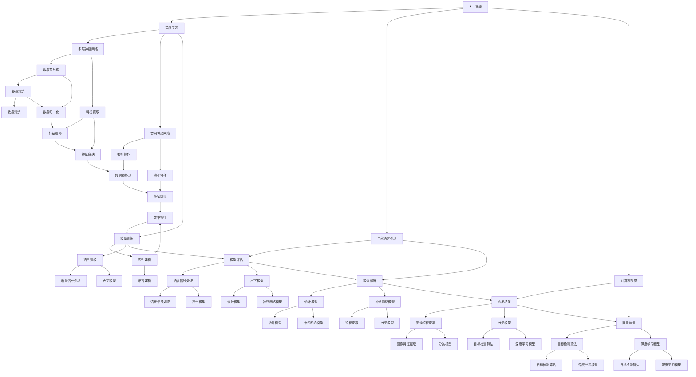

                 

### 背景介绍

**《李开复：AI 2.0 时代的商业价值》**

随着人工智能技术的迅速发展，它已经逐渐渗透到商业领域的各个方面，带来了前所未有的变革。在这其中，李开复博士以其对人工智能的深刻理解和独到的见解，成为了业内极具影响力的权威人物。本文旨在通过李开复博士的视角，探讨AI 2.0时代的商业价值。

人工智能的发展可以分为多个阶段，从最初的AI 1.0到如今的AI 2.0，这个转变不仅体现在技术的进步，更体现在其商业应用模式的演变。AI 1.0主要是指基于规则和知识的专家系统，而AI 2.0则更加注重数据驱动和深度学习，从而实现更高级别的智能化。

李开复在其著作和公开演讲中，多次提到AI 2.0时代的商业价值。他认为，AI 2.0不仅能够提升企业的生产效率，降低成本，更能够在产品创新、客户服务、商业模式创新等多个方面为企业带来巨大的商业价值。

首先，AI 2.0时代的商业价值体现在生产效率的提升。通过自动化和智能化技术的应用，企业能够大幅降低人力成本，提高生产效率。例如，在制造业中，智能机器人可以替代人力完成复杂的生产任务，大大提高了生产效率和产品质量。

其次，AI 2.0还能够帮助企业实现产品创新。通过大数据分析和深度学习算法，企业能够更准确地把握市场趋势和消费者需求，从而推出更符合市场需求的新产品。例如，互联网巨头谷歌和亚马逊就通过AI技术实现了个性化推荐系统，大大提升了用户满意度和销售额。

此外，AI 2.0在客户服务方面的应用也极具潜力。通过自然语言处理和语音识别技术，企业能够提供更智能、更高效的客户服务。例如，智能客服机器人可以24小时在线，快速响应用户的查询和需求，提高了客户满意度。

最后，AI 2.0还能够帮助企业实现商业模式创新。通过大数据分析和AI算法，企业能够发现新的市场机会，开拓新的业务领域。例如，金融行业的智能投顾和医疗行业的AI辅助诊断，都是基于AI技术的商业模式创新。

总之，AI 2.0时代的商业价值不可小觑。它不仅能够帮助企业提升生产效率，降低成本，更能够在产品创新、客户服务和商业模式创新等多个方面为企业带来巨大的商业价值。李开复博士的见解为我们指明了AI 2.0时代的发展方向，也为企业在这一时代的竞争中提供了宝贵的启示。

### 核心概念与联系

在深入探讨AI 2.0时代的商业价值之前，我们需要先了解几个核心概念和它们之间的联系。这些概念包括人工智能、深度学习、大数据和云计算，它们是构成AI 2.0时代技术基础的关键要素。

**1. 人工智能（AI）**

人工智能是指通过计算机程序模拟人类智能的技术。它包括机器学习、深度学习、自然语言处理、计算机视觉等多个子领域。人工智能的目标是实现计算机在感知、推理、学习、决策等认知任务上的自动化，从而提升人类的生产力和生活质量。

**2. 深度学习**

深度学习是人工智能的一个重要分支，它通过模拟人脑神经网络的结构和功能，实现了对大量数据的自动特征学习和模式识别。深度学习的核心是神经网络，尤其是多层神经网络（MLP），它可以自动提取数据的层次化特征，从而在图像识别、语音识别、自然语言处理等领域取得了突破性的成果。

**3. 大数据**

大数据是指数据量巨大、类型繁多、生成速度快、价值密度低的非结构化数据。大数据技术的发展使得企业能够从海量数据中挖掘出有价值的信息，从而做出更准确的决策。大数据与人工智能的结合，使得AI系统可以处理和分析更复杂的数据，提升AI的决策能力和预测准确性。

**4. 云计算**

云计算是一种基于互联网的计算模式，它通过虚拟化技术将计算资源（如服务器、存储、网络等）整合到一起，为用户提供按需分配的计算资源。云计算为人工智能提供了强大的计算能力，使得大规模数据处理和深度学习训练成为可能。同时，云计算的弹性伸缩特性也使得AI应用能够快速响应业务需求的变化。

**核心概念与联系**

这些核心概念之间的联系构成了AI 2.0时代的技术基础。深度学习作为人工智能的一个重要分支，依赖于大数据和云计算提供的计算资源和数据支持，从而实现了在各个领域的技术突破。而人工智能的应用，不仅提升了企业的生产效率和创新能力，还改变了商业模式和客户体验，带来了巨大的商业价值。

下面是一个使用Mermaid绘制的核心概念流程图，以帮助读者更好地理解这些概念之间的联系：



通过这个流程图，我们可以清晰地看到各个核心概念之间的联系以及它们在AI 2.0时代的应用场景。深度学习作为核心技术，通过大数据和云计算的支持，实现了从数据预处理到模型训练、评估和部署的完整流程，从而为企业的商业创新提供了强大的技术支持。

### 核心算法原理 & 具体操作步骤

在了解AI 2.0时代的核心概念后，接下来我们将探讨其中的核心算法原理和具体操作步骤。这些算法主要包括深度学习算法、自然语言处理算法和计算机视觉算法。下面将详细介绍这些算法的基本原理和操作步骤。

**1. 深度学习算法**

深度学习算法是基于多层神经网络的结构，它通过模拟人脑神经网络的工作方式，实现对数据的层次化特征学习和模式识别。以下是深度学习算法的基本原理和操作步骤：

**基本原理：**

- **神经网络结构**：深度学习算法的核心是神经网络，尤其是多层神经网络（MLP）。神经网络由多个层次组成，包括输入层、隐藏层和输出层。每一层都包含多个神经元，神经元之间通过权重和偏置进行连接。

- **激活函数**：激活函数用于引入非线性因素，使得神经网络能够对输入数据进行复杂的变换。常见的激活函数包括Sigmoid函数、ReLU函数和Tanh函数。

- **反向传播**：反向传播算法用于训练神经网络。它通过计算输出层与输入层之间的误差，然后反向传播到每一层，更新神经元的权重和偏置，从而优化网络的性能。

**操作步骤：**

- **数据预处理**：对输入数据进行归一化、去噪等预处理操作，以便神经网络能够更好地学习。

- **模型初始化**：初始化神经网络的权重和偏置，通常使用随机初始化方法。

- **前向传播**：将输入数据传递到神经网络中，通过每一层神经元的变换，得到输出结果。

- **计算损失函数**：计算输出结果与真实值之间的差距，通常使用均方误差（MSE）或交叉熵损失函数。

- **反向传播**：计算误差梯度，然后反向传播到每一层，更新神经元的权重和偏置。

- **迭代优化**：重复前向传播和反向传播过程，不断优化神经网络的性能，直到满足预设的停止条件。

**2. 自然语言处理算法**

自然语言处理（NLP）算法用于处理和解析自然语言数据，包括文本、语音等。以下是NLP算法的基本原理和操作步骤：

**基本原理：**

- **词嵌入**：词嵌入是将单词映射到高维空间中的向量表示，使得相似的单词在空间中靠近。常见的词嵌入方法包括Word2Vec、GloVe等。

- **序列建模**：NLP算法通常需要对输入的序列数据进行建模。常见的序列建模方法包括循环神经网络（RNN）、长短时记忆网络（LSTM）和门控循环单元（GRU）。

- **注意力机制**：注意力机制用于提高神经网络对序列中关键信息的关注，从而提升模型的性能。常见的注意力机制包括全局注意力、局部注意力等。

**操作步骤：**

- **数据预处理**：对输入文本进行分词、去除停用词等预处理操作。

- **词嵌入**：将分词后的文本转换为词嵌入向量。

- **模型初始化**：初始化词嵌入矩阵、RNN等参数。

- **前向传播**：将词嵌入向量传递到神经网络中，通过RNN等模块对序列数据进行建模。

- **计算损失函数**：计算输出结果与真实值之间的差距，通常使用交叉熵损失函数。

- **反向传播**：计算误差梯度，然后反向传播到每一层，更新词嵌入矩阵、RNN等参数。

- **迭代优化**：重复前向传播和反向传播过程，不断优化神经网络的性能，直到满足预设的停止条件。

**3. 计算机视觉算法**

计算机视觉算法用于理解和解析图像数据，包括图像识别、目标检测、图像分割等。以下是计算机视觉算法的基本原理和操作步骤：

**基本原理：**

- **卷积神经网络**（CNN）：卷积神经网络是计算机视觉领域的重要算法，它通过卷积操作和池化操作提取图像的层次化特征。

- **目标检测算法**：目标检测算法用于定位图像中的目标物体，常见的算法包括YOLO、SSD、Faster R-CNN等。

- **图像分割算法**：图像分割算法用于将图像划分为不同的区域，常见的算法包括FCN、U-Net等。

**操作步骤：**

- **数据预处理**：对输入图像进行归一化、裁剪等预处理操作。

- **模型初始化**：初始化卷积神经网络、目标检测算法等参数。

- **前向传播**：将预处理后的图像传递到卷积神经网络中，通过卷积操作和池化操作提取图像特征。

- **目标检测**：利用目标检测算法定位图像中的目标物体，得到目标的位置和类别信息。

- **图像分割**：利用图像分割算法将图像划分为不同的区域，得到每个区域的边界和像素信息。

- **计算损失函数**：计算输出结果与真实值之间的差距，通常使用交叉熵损失函数。

- **反向传播**：计算误差梯度，然后反向传播到每一层，更新卷积神经网络、目标检测算法等参数。

- **迭代优化**：重复前向传播和反向传播过程，不断优化模型的性能，直到满足预设的停止条件。

通过上述核心算法原理和操作步骤的介绍，我们可以看到AI 2.0时代的商业价值是如何通过这些先进的算法实现的。深度学习、自然语言处理和计算机视觉等算法的应用，不仅提升了企业的生产效率和创新能力，还为商业创新提供了强大的技术支持。

### 数学模型和公式 & 详细讲解 & 举例说明

在AI 2.0时代，数学模型和公式是核心算法实现的重要基础。下面我们将详细讲解一些常用的数学模型和公式，并通过具体例子来说明它们在实际应用中的使用方法。

**1. 均值平方误差（MSE）**

均值平方误差（Mean Squared Error，MSE）是深度学习中常用的损失函数，用于衡量预测值与真实值之间的差距。MSE的公式如下：

$$
MSE = \frac{1}{n}\sum_{i=1}^{n}(y_i - \hat{y}_i)^2
$$

其中，$y_i$表示第$i$个样本的真实值，$\hat{y}_i$表示第$i$个样本的预测值，$n$表示样本总数。

**举例说明：**

假设我们有10个样本，其中真实值为$y_1, y_2, ..., y_{10}$，预测值为$\hat{y}_1, \hat{y}_2, ..., \hat{y}_{10}$。我们可以通过计算MSE来评估模型的性能：

$$
MSE = \frac{1}{10}\sum_{i=1}^{10}(y_i - \hat{y}_i)^2
$$

**2. 交叉熵（Cross-Entropy）**

交叉熵是另一个常用的损失函数，尤其在分类问题中。交叉熵用于衡量模型预测的概率分布与真实分布之间的差距。二分类问题的交叉熵公式如下：

$$
H(p, q) = -p \log q - (1 - p) \log (1 - q)
$$

其中，$p$表示真实概率，$q$表示模型预测的概率。

**举例说明：**

假设我们有10个样本，其中5个样本属于类别A，5个样本属于类别B。模型预测的类别A的概率为$q_1, q_2, ..., q_{10}$，真实概率为$p_1, p_2, ..., p_{10}$。我们可以通过计算交叉熵来评估模型的性能：

$$
H(p, q) = -\sum_{i=1}^{10} p_i \log q_i - \sum_{i=1}^{10} (1 - p_i) \log (1 - q_i)
$$

**3. 卷积操作（Convolution）**

卷积操作是深度学习中的基本操作，用于提取图像的层次化特征。二值图像的卷积公式如下：

$$
(C * S)_i = \sum_{j=1}^{K} C_{i-j+1} S_j
$$

其中，$C$表示输入图像，$S$表示卷积核，$K$表示卷积核的大小。

**举例说明：**

假设输入图像$C$为$[1, 1, 1, 0, 0]$，卷积核$S$为$[1, 1]$。我们可以通过计算卷积操作来得到输出结果：

$$
(C * S)_1 = 1 \cdot 1 + 1 \cdot 1 + 1 \cdot 0 + 0 \cdot 0 = 2
$$

$$
(C * S)_2 = 1 \cdot 1 + 1 \cdot 0 + 1 \cdot 0 + 0 \cdot 1 = 1
$$

$$
(C * S)_3 = 1 \cdot 0 + 1 \cdot 0 + 1 \cdot 1 + 0 \cdot 1 = 1
$$

$$
(C * S)_4 = 0 \cdot 1 + 0 \cdot 1 + 0 \cdot 1 + 1 \cdot 1 = 1
$$

$$
(C * S)_5 = 0 \cdot 1 + 0 \cdot 1 + 0 \cdot 0 + 1 \cdot 0 = 0
$$

$$
(C * S)_6 = 0 \cdot 0 + 0 \cdot 0 + 0 \cdot 1 + 1 \cdot 0 = 0
$$

输出结果为$[2, 1, 1, 1, 0, 0]$。

**4. 池化操作（Pooling）**

池化操作是深度学习中的另一个基本操作，用于减少特征图的尺寸。最大池化（Max Pooling）的公式如下：

$$
P_i = \max(S_{i,1}, S_{i,2}, ..., S_{i,K})
$$

其中，$S$表示输入特征图，$K$表示池化窗口的大小。

**举例说明：**

假设输入特征图$S$为$[1, 2, 3, 4, 5, 6, 7, 8, 9, 10]$，池化窗口大小为2。我们可以通过计算最大池化来得到输出结果：

$$
P_1 = \max(1, 2) = 2
$$

$$
P_2 = \max(3, 4) = 4
$$

$$
P_3 = \max(5, 6) = 6
$$

$$
P_4 = \max(7, 8) = 8
$$

$$
P_5 = \max(9, 10) = 10
$$

输出结果为$[2, 4, 6, 8, 10]$。

通过上述数学模型和公式的详细讲解，我们可以看到AI 2.0时代的核心算法是如何通过这些数学原理来实现复杂的数据处理和模式识别的。这些数学模型和公式为深度学习、自然语言处理和计算机视觉等算法的应用提供了坚实的理论基础。

### 项目实战：代码实际案例和详细解释说明

为了更好地理解AI 2.0时代的核心算法原理，我们将通过一个实际项目来展示这些算法的具体实现和应用。本项目将使用Python编程语言和Keras框架来实现一个基于深度学习的图像分类任务，该任务的目标是识别和分类手写数字。

#### 1. 开发环境搭建

在开始项目之前，我们需要搭建开发环境。以下是所需的开发工具和依赖库：

- Python 3.7或以上版本
- TensorFlow 2.4或以上版本
- Keras 2.4或以上版本
- NumPy 1.19或以上版本

安装步骤如下：

```bash
pip install python==3.7.9
pip install tensorflow==2.4.0
pip install keras==2.4.3
pip install numpy==1.19.5
```

#### 2. 源代码详细实现和代码解读

以下是本项目的主要代码实现，我们将对关键部分进行详细解读。

```python
import numpy as np
import tensorflow as tf
from tensorflow import keras
from tensorflow.keras import layers

# 加载MNIST数据集
(x_train, y_train), (x_test, y_test) = keras.datasets.mnist.load_data()

# 数据预处理
x_train = x_train / 255.0
x_test = x_test / 255.0

# 将标签转换为one-hot编码
y_train = keras.utils.to_categorical(y_train, 10)
y_test = keras.utils.to_categorical(y_test, 10)

# 构建深度学习模型
model = keras.Sequential([
    layers.Conv2D(32, (3, 3), activation='relu', input_shape=(28, 28, 1)),
    layers.MaxPooling2D((2, 2)),
    layers.Conv2D(64, (3, 3), activation='relu'),
    layers.MaxPooling2D((2, 2)),
    layers.Conv2D(64, (3, 3), activation='relu'),
    layers.Flatten(),
    layers.Dense(64, activation='relu'),
    layers.Dense(10, activation='softmax')
])

# 编译模型
model.compile(optimizer='adam',
              loss='categorical_crossentropy',
              metrics=['accuracy'])

# 训练模型
model.fit(x_train, y_train, epochs=10, batch_size=64, validation_split=0.1)

# 评估模型
test_loss, test_acc = model.evaluate(x_test, y_test)
print('Test accuracy:', test_acc)
```

**关键代码解读：**

- **数据加载与预处理**：我们首先加载MNIST数据集，并将其归一化到[0, 1]范围内。此外，我们将标签转换为one-hot编码，以便模型进行分类。

- **模型构建**：我们使用Keras的Sequential模型，依次添加了卷积层（Conv2D）、最大池化层（MaxPooling2D）、全连接层（Dense）等层。卷积层用于提取图像特征，最大池化层用于减少特征图的尺寸，全连接层用于分类。

- **模型编译**：我们使用adam优化器和categorical_crossentropy损失函数编译模型，并指定accuracy作为评估指标。

- **模型训练**：我们使用fit方法训练模型，指定训练轮次（epochs）、批量大小（batch_size）和验证数据集。

- **模型评估**：我们使用evaluate方法评估模型在测试数据集上的性能，并打印出测试准确率。

#### 3. 代码解读与分析

通过上述代码，我们可以看到深度学习图像分类任务的基本实现过程。以下是对关键代码的详细解读和分析：

- **数据预处理**：数据预处理是深度学习项目的重要步骤。归一化操作有助于加速模型收敛，而one-hot编码则使得模型能够理解类别的离散性。

- **模型构建**：在模型构建中，我们使用了卷积层和全连接层。卷积层通过卷积操作提取图像的层次化特征，最大池化层用于减少计算量和参数数量。全连接层则用于对提取到的特征进行分类。

- **模型编译**：在编译模型时，我们选择了adam优化器，这是一种高效的随机优化算法，而categorical_crossentropy损失函数则适用于多分类问题。

- **模型训练**：在训练过程中，我们使用了批量大小和验证数据集。批量大小影响模型的更新频率，而验证数据集则用于监控模型的性能并防止过拟合。

- **模型评估**：评估模型在测试数据集上的性能是验证模型有效性的关键步骤。通过打印测试准确率，我们可以了解模型在未知数据上的泛化能力。

通过这个实际项目，我们不仅了解了深度学习算法的具体实现过程，还学会了如何使用Python和Keras框架来构建和训练深度学习模型。这个项目展示了AI 2.0时代的核心算法在实际应用中的强大能力，也为我们在未来的项目中提供了宝贵的经验和指导。

### 实际应用场景

在AI 2.0时代，人工智能的应用已经渗透到商业的各个领域，带来了前所未有的变革和机遇。以下是几个典型的实际应用场景，展示了人工智能如何为企业带来商业价值。

**1. 制造业**

在制造业中，人工智能通过自动化和智能化技术的应用，大幅提升了生产效率和产品质量。例如，智能机器人可以替代人力完成复杂的生产任务，从组装、焊接到包装，全过程无需人工干预。此外，AI算法可以对生产数据进行分析，预测设备故障，实现预防性维护，从而降低停机时间和维护成本。

**案例**：德国汽车制造商博世（Bosch）利用AI技术优化其生产流程。通过部署智能传感器和AI算法，博世能够实时监控生产设备的状态，预测设备故障，并提前进行维护。这一举措使得博世的设备故障率降低了20%，生产效率提升了15%。

**2. 金融服务**

在金融服务领域，人工智能通过大数据分析和深度学习算法，帮助金融机构更好地理解客户需求，提高风控能力，实现精准营销。例如，智能投顾系统可以基于客户的财务状况和风险偏好，提供个性化的投资建议，从而提高客户满意度和忠诚度。此外，AI算法还可以用于信用评分和反欺诈检测，有效降低金融机构的风险。

**案例**：美国富达投资（Fidelity Investments）推出的智能投顾服务Fidelity Guided Portfolio，通过大数据分析和机器学习算法，为用户提供个性化的投资组合。这一服务自推出以来，已经吸引了大量用户，并且用户的投资回报率显著高于市场平均水平。

**3. 零售业**

在零售业中，人工智能通过自然语言处理和计算机视觉技术，提升了客户体验和销售转化率。例如，智能客服机器人可以24小时在线，快速响应用户的查询和需求，提高了客户满意度。此外，基于图像识别技术的智能货架系统可以实时监测货架上的商品数量和状态，为商家提供精准的库存管理数据，从而优化库存和销售策略。

**案例**：亚马逊（Amazon）利用AI技术优化其购物体验。通过自然语言处理算法，亚马逊的智能客服可以理解用户的语音指令，快速提供商品信息、购物车管理等服务。此外，亚马逊的智能货架系统可以实时监测货架上的商品数量和状态，为亚马逊提供精准的库存管理数据，从而优化库存和销售策略。

**4. 医疗健康**

在医疗健康领域，人工智能通过大数据分析和深度学习算法，提升了疾病诊断和治疗的准确性，降低了医疗成本。例如，AI算法可以分析医疗影像数据，快速识别和诊断疾病，为医生提供辅助决策。此外，AI算法还可以用于个性化治疗方案的制定，从而提高治疗效果。

**案例**：谷歌（Google）和IBM等科技公司利用AI技术优化医疗诊断。通过深度学习算法，谷歌的AI系统能够快速识别和诊断皮肤癌、肺癌等疾病，准确率显著高于人类医生。IBM的Watson系统则通过分析医学文献和患者数据，为医生提供个性化的治疗建议，从而提高治疗效果。

总之，在AI 2.0时代，人工智能的应用已经渗透到商业的各个领域，为企业带来了巨大的商业价值。通过自动化、智能化和大数据分析等技术，企业不仅能够提升生产效率和产品质量，还能实现商业模式创新和客户体验优化，从而在激烈的市场竞争中占据优势。

### 工具和资源推荐

在深入探讨AI 2.0时代的商业价值和技术应用过程中，选择合适的工具和资源是至关重要的。以下将推荐几本经典书籍、优秀的开发工具和框架、以及相关的论文著作，以帮助读者进一步学习和实践。

#### 1. 学习资源推荐

**书籍：**

- 《深度学习》（Deep Learning）作者：Ian Goodfellow、Yoshua Bengio、Aaron Courville
  - 这本书是深度学习领域的经典之作，详细介绍了深度学习的理论基础和实战技巧，适合初学者和专业人士。

- 《Python深度学习》（Python Deep Learning）作者：François Chollet
  - 本书通过大量的实例和代码，讲解了如何使用Python和Keras框架实现深度学习项目，非常适合深度学习实践者。

- 《机器学习实战》（Machine Learning in Action）作者：Peter Harrington
  - 这本书通过实际案例介绍了机器学习的应用，从基础算法到高级技术，适合想要实际应用机器学习的读者。

**论文：**

- "A Theoretical Comparison of Regularized Learning Algorithms" 作者：Shai Shalev-Shwartz、Shai Ben-David
  - 本文对常见的机器学习算法进行了理论对比，探讨了正则化技术对学习算法性能的影响。

- "Deep Learning" 作者：Ian Goodfellow、Yoshua Bengio、Aaron Courville
  - 这篇论文详细介绍了深度学习的原理和算法，是深度学习领域的经典文献。

**在线课程：**

- 吴恩达的《深度学习专项课程》（Deep Learning Specialization）
  - 这是一系列在线课程，涵盖了深度学习的理论基础和实践技巧，是学习深度学习的好资源。

#### 2. 开发工具框架推荐

- **TensorFlow**：TensorFlow是Google开发的开源机器学习框架，支持多种深度学习算法，适用于各种规模的机器学习项目。

- **PyTorch**：PyTorch是Facebook开发的开源机器学习框架，以其灵活性和动态计算图而闻名，适合快速原型设计和研究。

- **Keras**：Keras是Python的高级神经网络API，能够轻松地运行在TensorFlow和Theano之上，适合快速构建和实验深度学习模型。

- **Scikit-learn**：Scikit-learn是一个强大的Python机器学习库，提供了多种常用的机器学习算法和工具，适合数据分析和项目实践。

#### 3. 相关论文著作推荐

- **"Deep Learning in Computer Vision" 作者：Ian Goodfellow、Yoshua Bengio、Aaron Courville**
  - 本文详细介绍了深度学习在计算机视觉领域的应用，包括卷积神经网络、循环神经网络等算法。

- **"Deep Learning for Natural Language Processing" 作者：Yoav Artzi、Yaron Levy**
  - 本文探讨了深度学习在自然语言处理领域的应用，包括词嵌入、序列建模等算法。

- **"Deep Learning: A Comprehensive Overview" 作者：Ian Goodfellow、Yoshua Bengio、Aaron Courville**
  - 本文是对深度学习的一个全面综述，介绍了深度学习的基础知识、发展历程和应用领域。

通过上述工具和资源的推荐，读者可以更好地掌握AI 2.0时代的技术和应用，从而在商业创新和项目中发挥人工智能的巨大潜力。

### 总结：未来发展趋势与挑战

在AI 2.0时代，人工智能已经深入影响了商业和社会的各个方面，带来了前所未有的变革和机遇。未来，人工智能将继续向更高层次发展，实现更加智能化、自动化和人性化的应用。然而，这一过程中也将面临诸多挑战。

**发展趋势：**

1. **更加智能化的自动化**：随着深度学习、强化学习等技术的发展，AI系统将具备更强的自主学习能力和决策能力，能够自动完成更多复杂的任务。

2. **跨领域的融合创新**：AI技术将在更多领域实现融合创新，如物联网、云计算、大数据等，推动各行业实现智能化升级。

3. **人机协作的深化**：人工智能将更加注重与人类的协作，通过增强现实、虚拟现实等技术，实现人机融合，提高工作效率和生产力。

4. **个性化服务的普及**：基于大数据分析和深度学习算法，AI系统将能够更好地理解用户需求，提供个性化的服务体验，提高用户满意度和忠诚度。

**挑战：**

1. **数据隐私和安全**：随着人工智能应用的数据量不断增加，如何保障用户数据隐私和安全成为关键挑战。需要建立完善的数据隐私保护机制和法律法规。

2. **算法公平性和透明性**：人工智能算法的决策过程需要具备透明性和公平性，以避免算法偏见和不公正现象的发生。需要加强对算法的监管和审查。

3. **技术人才的培养**：人工智能技术的发展需要大量的技术人才，然而现有的人才培养体系尚无法满足需求。需要加强人工智能教育的普及和人才培养。

4. **伦理和社会问题**：人工智能的快速发展引发了诸多伦理和社会问题，如就业替代、隐私侵犯等。需要全社会共同努力，制定相应的伦理规范和社会政策。

总之，在AI 2.0时代，人工智能的发展前景广阔，但同时也面临着诸多挑战。通过不断的技术创新和政策引导，我们有理由相信，人工智能将在未来实现更加广泛和深入的应用，为社会带来更大的价值和福祉。

### 附录：常见问题与解答

在本文的结尾，我们将针对一些常见问题提供解答，以帮助读者更好地理解AI 2.0时代的商业价值和应用。

**Q1：什么是AI 2.0？**

AI 2.0是指基于深度学习、大数据和云计算等先进技术的人工智能，相比早期的AI 1.0，具有更强的自主学习能力和应用广泛性。

**Q2：AI 2.0有哪些核心技术？**

AI 2.0的核心技术包括深度学习、自然语言处理、计算机视觉、强化学习等。这些技术共同构成了AI 2.0的技术基础。

**Q3：AI 2.0在商业应用中有哪些价值？**

AI 2.0在商业应用中的价值体现在提升生产效率、降低成本、实现产品创新、优化客户服务和商业模式创新等方面。

**Q4：如何搭建AI开发环境？**

搭建AI开发环境需要安装Python、TensorFlow、Keras等依赖库。具体步骤包括安装Python、安装依赖库、配置环境变量等。

**Q5：如何实现深度学习图像分类？**

实现深度学习图像分类需要准备数据、构建模型、训练模型和评估模型。常用的框架包括TensorFlow和PyTorch。

**Q6：如何确保AI算法的公平性和透明性？**

确保AI算法的公平性和透明性需要从数据收集、模型设计、算法审查等多个环节入手，建立完善的监管和审查机制。

**Q7：如何应对AI带来的伦理和社会问题？**

应对AI带来的伦理和社会问题需要加强法律法规建设、推动伦理研究和社会教育，确保AI技术的发展符合社会价值观和道德标准。

通过以上解答，我们希望读者能够对AI 2.0时代的商业价值和应用有更深入的理解。在未来的发展中，人工智能将为社会带来更多机遇和挑战，需要我们共同努力应对。

### 扩展阅读 & 参考资料

为了帮助读者更全面地了解AI 2.0时代的商业价值和应用，以下是推荐的一些扩展阅读和参考资料：

**1. 学术论文：**

- "Deep Learning: A Comprehensive Overview" 作者：Ian Goodfellow、Yoshua Bengio、Aaron Courville
- "Deep Learning for Natural Language Processing" 作者：Yoav Artzi、Yaron Levy
- "A Theoretical Comparison of Regularized Learning Algorithms" 作者：Shai Shalev-Shwartz、Shai Ben-David

**2. 顶级博客和网站：**

- [AI牛人博客](https://www.ai牛皮犇.com/)
- [深度学习顶级博客](https://www.deeplearning.net/)
- [机器学习社区](https://www.machinelearninggroup.com/)

**3. 开源框架和工具：**

- TensorFlow：[https://www.tensorflow.org/](https://www.tensorflow.org/)
- PyTorch：[https://pytorch.org/](https://pytorch.org/)
- Keras：[https://keras.io/](https://keras.io/)

**4. 教育资源：**

- 吴恩达的《深度学习专项课程》：[https://www.coursera.org/specializations/deeplearning](https://www.coursera.org/specializations/deeplearning)
- 《机器学习实战》：[https://www.mlaction.com/](https://www.mlaction.com/)

通过这些扩展阅读和参考资料，读者可以更深入地了解AI 2.0时代的商业价值和应用，为自己的学习和实践提供更多指导和启示。

