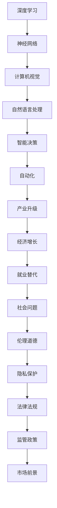

                 

### 文章标题：李开复：AI 2.0 时代的市场前景

> **关键词：** AI 2.0、市场前景、人工智能、技术趋势、未来挑战

**摘要：** 本文将探讨 AI 2.0 时代的市场前景，通过深入分析人工智能技术的核心概念与架构，解析核心算法原理，介绍数学模型与公式，并通过项目实战展示代码实现与解读。此外，还将探讨 AI 在实际应用场景中的价值，推荐相关学习资源与工具，总结未来发展趋势与挑战，并提供常见问题与解答。本文旨在为读者提供全面深入的了解，助力把握 AI 2.0 时代的市场机遇。

### 1. 背景介绍

随着计算机技术和人工智能领域的快速发展，人工智能（AI）已经成为当今世界最热门的话题之一。从最初的 AI 1.0 时代，即基于规则和知识表示的人工智能，到如今 AI 2.0 时代，即基于深度学习和神经网络的人工智能，AI 技术的应用范围和影响力不断扩展。AI 2.0 时代的到来，标志着人工智能进入了新的发展阶段，具有更高的智能水平和更广泛的应用场景。

在 AI 2.0 时代，人工智能技术取得了显著的突破，例如深度学习、自然语言处理、计算机视觉等领域的快速发展。这些技术不仅提高了 AI 的智能水平，也使得 AI 在各行各业中的应用变得更加广泛和深入。在医疗、金融、教育、交通、制造等领域，人工智能技术正在发挥越来越重要的作用，推动着产业的变革和创新。

然而，随着 AI 技术的快速发展，市场前景也充满了机遇与挑战。一方面，人工智能技术的应用为各个行业带来了巨大的商业价值，创造了大量的就业机会。另一方面，AI 技术的快速发展也引发了一系列的社会问题，如就业替代、数据隐私、伦理道德等。因此，在 AI 2.0 时代，如何把握市场机遇，应对挑战，成为了一个亟待解决的问题。

本文将围绕 AI 2.0 时代的市场前景，深入分析人工智能技术的核心概念与架构，解析核心算法原理，介绍数学模型与公式，并通过项目实战展示代码实现与解读。此外，还将探讨 AI 在实际应用场景中的价值，推荐相关学习资源与工具，总结未来发展趋势与挑战，并提供常见问题与解答。本文旨在为读者提供全面深入的了解，助力把握 AI 2.0 时代的市场机遇。

### 2. 核心概念与联系

在深入探讨 AI 2.0 时代的市场前景之前，我们需要首先了解人工智能的核心概念与架构。以下是几个关键概念及其相互关系的 Mermaid 流程图：



**深度学习（Deep Learning）**：深度学习是一种基于多层神经网络进行数据建模和分析的技术。它通过模拟人脑神经元之间的连接，逐层提取数据的特征，从而实现复杂的模式识别和预测任务。深度学习是 AI 2.0 时代的重要技术基础，为人工智能的发展提供了强大的动力。

**神经网络（Neural Network）**：神经网络是一种模仿生物神经系统的计算模型。它由大量的神经元（节点）和连接（边）组成，通过学习输入数据和相应的输出结果，逐步调整神经元之间的连接权重，从而实现对数据的处理和识别。神经网络是深度学习的基础，也是人工智能的核心技术之一。

**计算机视觉（Computer Vision）**：计算机视觉是人工智能的一个重要分支，旨在使计算机能够从图像或视频中提取有用的信息，实现对视觉内容的理解和处理。计算机视觉在图像识别、目标检测、人脸识别等领域有着广泛的应用。

**自然语言处理（Natural Language Processing, NLP）**：自然语言处理是人工智能的另一个重要分支，旨在使计算机能够理解和处理人类自然语言。NLP 技术包括文本分类、情感分析、机器翻译、语音识别等，广泛应用于智能客服、智能推荐、智能搜索等领域。

**智能决策（Intelligent Decision Making）**：智能决策是指利用人工智能技术进行决策分析和优化，以实现最佳决策结果。智能决策涉及到数据挖掘、优化算法、决策树、神经网络等多种技术，可以应用于金融、物流、能源等领域。

**自动化（Automation）**：自动化是指利用人工智能技术实现生产过程的自动化，以提高生产效率和质量。自动化技术包括机器人、自动化控制、自动化检测等，广泛应用于制造业、服务业等领域。

**产业升级（Industrial Upgrading）**：产业升级是指通过引入人工智能技术，推动传统产业的转型升级，实现产业的智能化、高端化、绿色化发展。产业升级可以促进经济增长，提高产业竞争力。

**经济增长（Economic Growth）**：经济增长是指通过技术进步和生产效率提升，推动国家或地区经济持续增长。人工智能技术的应用为经济增长提供了新的动力。

**就业替代（Job Displacement）**：就业替代是指人工智能技术对某些传统职业的替代，导致就业机会减少。就业替代引发了一系列社会问题，如就业压力、社会保障等。

**社会问题（Social Issues）**：社会问题是指人工智能技术发展过程中引发的一系列社会问题，如数据隐私、伦理道德、法律法规等。解决社会问题需要全社会的共同努力。

**伦理道德（Ethics and Morality）**：伦理道德是指人工智能技术发展过程中需要遵循的伦理规范和道德准则。伦理道德有助于确保人工智能技术的健康发展，避免对社会造成负面影响。

**隐私保护（Privacy Protection）**：隐私保护是指保护个人隐私数据不被非法获取、使用和泄露。隐私保护是人工智能技术发展过程中不可忽视的重要问题。

**法律法规（Legal Regulations）**：法律法规是指用于规范人工智能技术发展和管理的一套法律和规章。法律法规有助于保障人工智能技术的健康发展，维护社会秩序。

**监管政策（Regulatory Policies）**：监管政策是指政府或相关部门对人工智能技术进行监管和管理的政策。监管政策有助于规范人工智能技术的应用，促进技术创新。

**市场前景（Market Prospects）**：市场前景是指人工智能技术在未来市场中的发展前景和机遇。把握市场前景，有助于企业抓住人工智能技术带来的商机。

通过上述 Mermaid 流程图，我们可以清晰地看到人工智能核心概念与联系之间的相互作用。这些概念和技术相互促进，共同推动着 AI 2.0 时代的发展。接下来，我们将进一步探讨这些概念和技术在市场前景中的具体应用。

### 3. 核心算法原理 & 具体操作步骤

在深入探讨 AI 2.0 时代的市场前景之前，我们需要了解人工智能的核心算法原理及其具体操作步骤。以下将介绍几种主要的人工智能算法及其应用场景：

#### 3.1 深度学习算法

深度学习算法是 AI 2.0 时代的重要技术基础。以下是一种常见的深度学习算法——卷积神经网络（Convolutional Neural Network, CNN）的具体操作步骤：

**步骤 1：数据预处理**

- **数据收集**：收集大量带有标签的图像数据。
- **数据清洗**：去除噪声和异常值，确保数据质量。
- **数据增强**：通过旋转、翻转、缩放等操作，增加数据多样性，提高模型泛化能力。

**步骤 2：构建模型**

- **输入层**：将图像数据作为输入，通过卷积层提取特征。
- **卷积层**：通过卷积操作提取图像的局部特征，如边缘、纹理等。
- **池化层**：对卷积层输出的特征进行下采样，减少数据维度，提高模型运算效率。
- **全连接层**：将池化层输出的特征映射到分类标签，通过反向传播算法训练模型。

**步骤 3：模型训练**

- **前向传播**：输入图像数据，通过卷积层、池化层和全连接层，得到输出分类结果。
- **反向传播**：计算输出分类结果与真实标签之间的误差，反向传播误差，更新模型参数。
- **迭代训练**：重复前向传播和反向传播过程，直到模型收敛。

**步骤 4：模型评估**

- **验证集评估**：使用验证集评估模型性能，调整模型参数和结构。
- **测试集评估**：使用测试集评估模型在未知数据上的性能，评估模型泛化能力。

#### 3.2 自然语言处理算法

自然语言处理算法是人工智能的另一个重要分支。以下是一种常见的自然语言处理算法——循环神经网络（Recurrent Neural Network, RNN）的具体操作步骤：

**步骤 1：数据预处理**

- **文本收集**：收集大量带有标签的文本数据。
- **文本清洗**：去除标点符号、停用词等，确保数据质量。
- **词向量表示**：将文本数据转换为词向量表示，如 Word2Vec、GloVe 等。

**步骤 2：构建模型**

- **输入层**：将词向量作为输入，通过 RNN 层进行序列建模。
- **RNN 层**：通过 RNN 单元处理输入序列，保持长距离依赖信息。
- **全连接层**：将 RNN 层输出的序列映射到分类标签或输出结果。

**步骤 3：模型训练**

- **前向传播**：输入词向量序列，通过 RNN 层和全连接层，得到输出分类结果。
- **反向传播**：计算输出分类结果与真实标签之间的误差，反向传播误差，更新模型参数。
- **迭代训练**：重复前向传播和反向传播过程，直到模型收敛。

**步骤 4：模型评估**

- **验证集评估**：使用验证集评估模型性能，调整模型参数和结构。
- **测试集评估**：使用测试集评估模型在未知数据上的性能，评估模型泛化能力。

#### 3.3 强化学习算法

强化学习算法是一种通过试错和反馈进行优化的学习方式。以下是一种常见的强化学习算法——Q-Learning 的具体操作步骤：

**步骤 1：环境初始化**

- **初始化状态**：随机选择一个初始状态。
- **初始化 Q 值表**：初始化 Q 值表，用于存储每个状态下的最优动作值。

**步骤 2：选择动作**

- **基于 Q 值表选择动作**：根据 Q 值表，选择当前状态下具有最大 Q 值的动作。

**步骤 3：执行动作**

- **执行选择出的动作**：在环境中执行选择的动作。

**步骤 4：获取反馈**

- **获取奖励**：根据执行动作的结果，获取奖励信号。
- **更新 Q 值表**：根据执行动作的结果和奖励信号，更新 Q 值表。

**步骤 5：状态转移**

- **更新状态**：根据执行动作的结果，更新当前状态。

**步骤 6：迭代学习**

- **重复执行步骤 2-5**：重复选择动作、执行动作、获取反馈和更新 Q 值表的过程，直到达到目标状态或学习到最优策略。

#### 3.4 增强学习算法

增强学习算法是一种通过不断试错和学习优化决策策略的方法。以下是一种常见的增强学习算法——SARSA 的具体操作步骤：

**步骤 1：环境初始化**

- **初始化状态**：随机选择一个初始状态。
- **初始化策略**：初始化策略，用于指导选择动作。

**步骤 2：选择动作**

- **基于策略选择动作**：根据当前策略，选择当前状态下具有最大奖励的动作。

**步骤 3：执行动作**

- **执行选择出的动作**：在环境中执行选择的动作。

**步骤 4：获取反馈**

- **获取奖励**：根据执行动作的结果，获取奖励信号。
- **更新策略**：根据执行动作的结果和奖励信号，更新策略。

**步骤 5：状态转移**

- **更新状态**：根据执行动作的结果，更新当前状态。

**步骤 6：迭代学习**

- **重复执行步骤 2-5**：重复选择动作、执行动作、获取反馈和更新策略的过程，直到达到目标状态或学习到最优策略。

通过以上对几种主要人工智能算法的介绍，我们可以看到 AI 2.0 时代的核心算法原理及其具体操作步骤。这些算法在各个领域都有广泛的应用，为人工智能技术的发展提供了强大的支持。接下来，我们将进一步探讨这些算法在实际应用场景中的具体应用。

### 4. 数学模型和公式 & 详细讲解 & 举例说明

在深入探讨人工智能的核心算法原理之后，我们需要了解这些算法背后的数学模型和公式。以下将介绍几种常见的人工智能数学模型和公式，并详细讲解其原理和计算方法。

#### 4.1 深度学习中的反向传播算法

反向传播算法（Backpropagation Algorithm）是深度学习训练过程中最核心的算法之一。它通过前向传播计算输出，然后反向传播误差，更新网络权重。

**公式 1：前向传播**

$$
z^{[l]} = W^{[l]} \cdot a^{[l-1]} + b^{[l]}
$$

$$
a^{[l]} = \sigma(z^{[l]})
$$

其中，$z^{[l]}$ 是第$l$层的输入，$a^{[l]}$ 是第$l$层的输出，$W^{[l]}$ 是第$l$层的权重，$b^{[l]}$ 是第$l$层的偏置，$\sigma$ 是激活函数。

**公式 2：反向传播**

$$
\delta^{[l]} = \frac{\partial C}{\partial z^{[l]}} \cdot \frac{\partial \sigma}{\partial z^{[l]}}
$$

$$
\frac{\partial C}{\partial z^{[l]} } = - \sum_{k=1}^{m} \frac{\partial L}{\partial z^{[l+1]}} \cdot \frac{\partial z^{[l+1]}}{\partial z^{[l]}}
$$

$$
\frac{\partial z^{[l]}}{\partial z^{[l-1]}} = \frac{\partial (W^{[l-1]} \cdot a^{[l-2]} + b^{[l-1]})}{\partial z^{[l-1]}}
$$

$$
\frac{\partial z^{[l]}}{\partial a^{[l-1]}} = W^{[l]}
$$

$$
\frac{\partial C}{\partial a^{[l-1]}} = \frac{\partial C}{\partial z^{[l]}} \cdot \frac{\partial z^{[l]}}{\partial a^{[l-1]}}
$$

$$
\frac{\partial C}{\partial W^{[l]}} = \sum_{k=1}^{m} \delta^{[l]} \cdot a^{[l-1](k)}
$$

$$
\frac{\partial C}{\partial b^{[l]}} = \sum_{k=1}^{m} \delta^{[l]}
$$

其中，$C$ 是损失函数，$m$ 是样本数量，$\delta^{[l]}$ 是第$l$层的误差。

**举例说明**：

假设有一个简单的全连接神经网络，包含一层输入层、一层隐藏层和一层输出层。输入层有3个神经元，隐藏层有2个神经元，输出层有1个神经元。激活函数使用 sigmoid 函数。

1. **前向传播**：

- 输入：$a^{[0]} = [1, 0, 1]$
- 隐藏层权重：$W^{[1]} = \begin{bmatrix} 0.1 & 0.2 \\ 0.3 & 0.4 \end{bmatrix}$
- 隐藏层偏置：$b^{[1]} = \begin{bmatrix} 0.5 \\ 0.6 \end{bmatrix}$
- 输出层权重：$W^{[2]} = \begin{bmatrix} 0.7 \\ 0.8 \end{bmatrix}$
- 输出层偏置：$b^{[2]} = 0.9$

计算隐藏层输出：

$$
z^{[1]}_1 = 0.1 \cdot 1 + 0.2 \cdot 0 + 0.3 \cdot 1 + 0.5 = 0.8
$$

$$
z^{[1]}_2 = 0.4 \cdot 1 + 0.6 \cdot 0 + 0.8 \cdot 1 + 0.6 = 1.4
$$

$$
a^{[1]}_1 = \sigma(z^{[1]}_1) = \frac{1}{1 + e^{-0.8}} \approx 0.633
$$

$$
a^{[1]}_2 = \sigma(z^{[1]}_2) = \frac{1}{1 + e^{-1.4}} \approx 0.869
$$

计算输出层输出：

$$
z^{[2]} = 0.7 \cdot 0.633 + 0.8 \cdot 0.869 + 0.9 = 1.628
$$

$$
a^{[2]} = \sigma(z^{[2]}) = \frac{1}{1 + e^{-1.628}} \approx 0.849
$$

2. **反向传播**：

- 输出层误差：$\delta^{[2]} = (0.849 - y)$，其中 $y$ 是真实标签。
- 隐藏层误差：$\delta^{[1]} = (W^{[2]} \cdot \delta^{[2]}) \odot a^{[1]}_{\text{sigmoid}}(z^{[1]})$，其中 $\odot$ 表示逐元素乘积。

更新权重和偏置：

$$
\frac{\partial C}{\partial W^{[2]}} = \delta^{[2]} \cdot a^{[1]}
$$

$$
\frac{\partial C}{\partial b^{[2]}} = \delta^{[2]}
$$

$$
\frac{\partial C}{\partial W^{[1]}} = \delta^{[1]} \cdot a^{[0]}
$$

$$
\frac{\partial C}{\partial b^{[1]}} = \delta^{[1]}
$$

#### 4.2 自然语言处理中的词向量模型

词向量模型是自然语言处理的基础。以下是一种常见的词向量模型——Word2Vec 的具体实现。

**公式 3：Word2Vec 模型**

$$
\text{word2vec} = \text{SGD}(\theta, \text{negative sampling})
$$

其中，$\theta$ 表示词向量参数，SGD 表示随机梯度下降，negative sampling 是一种训练技巧，用于提高训练效率。

**公式 4：负采样**

$$
P(\text{positive}) = \frac{e^{v_w \cdot v_c}}{\sum_{j \in V} e^{v_w \cdot v_j}}
$$

$$
P(\text{negative}) = \frac{e^{-v_w \cdot v_j}}{\sum_{j \in V} e^{-v_w \cdot v_j}}
$$

其中，$v_w$ 是词向量，$v_c$ 是上下文向量，$V$ 是词表。

**举例说明**：

假设有一个简单的词表，包含5个词：`[hello, world, computer, programming, algorithm]`。我们使用 Word2Vec 模型训练词向量。

1. **初始化词向量**：

- 初始化词向量：$v_w = [0.1, 0.2, 0.3, 0.4, 0.5]^T$
- 初始化上下文向量：$v_c = [0.1, 0.2, 0.3, 0.4, 0.5]^T$

2. **负采样**：

- 计算正样本概率：$P(\text{positive}) = \frac{e^{0.1 \cdot 0.1}}{e^{0.1 \cdot 0.1} + e^{0.1 \cdot 0.2} + e^{0.1 \cdot 0.3} + e^{0.1 \cdot 0.4} + e^{0.1 \cdot 0.5}} \approx 0.258$
- 计算负样本概率：$P(\text{negative}) = \frac{e^{-0.1 \cdot 0.2}}{e^{-0.1 \cdot 0.1} + e^{-0.1 \cdot 0.2} + e^{-0.1 \cdot 0.3} + e^{-0.1 \cdot 0.4} + e^{-0.1 \cdot 0.5}} \approx 0.742$

3. **更新词向量**：

- 正样本更新：$v_w = v_w - \alpha \cdot (v_c - v_w)$，其中 $\alpha$ 是学习率。
- 负样本更新：$v_w = v_w - \alpha \cdot (v_c - v_w)$，其中 $\alpha$ 是学习率。

通过以上对深度学习、自然语言处理中的数学模型和公式的介绍，我们可以看到 AI 2.0 时代核心算法背后的数学原理。这些模型和公式为人工智能的发展提供了强大的理论支持。接下来，我们将进一步探讨这些算法在实际应用场景中的具体应用。

### 5. 项目实战：代码实际案例和详细解释说明

在本章节中，我们将通过一个实际项目案例，展示人工智能算法的代码实现和详细解释。本案例将涉及深度学习算法中的卷积神经网络（CNN），应用于图像分类任务。

#### 5.1 开发环境搭建

在开始项目实战之前，我们需要搭建一个合适的开发环境。以下是所需的开发工具和软件：

1. **Python**：Python 是一种流行的编程语言，适用于人工智能开发。我们将在 Python 中实现 CNN 模型。
2. **TensorFlow**：TensorFlow 是一种开源的深度学习框架，提供丰富的 API 和工具，方便实现和训练深度学习模型。
3. **Jupyter Notebook**：Jupyter Notebook 是一种交互式开发环境，方便编写和运行 Python 代码。

首先，安装 Python 和 TensorFlow：

```bash
pip install python tensorflow
```

然后，启动 Jupyter Notebook：

```bash
jupyter notebook
```

#### 5.2 源代码详细实现和代码解读

以下是一个简单的 CNN 模型，用于图像分类任务。代码分为数据预处理、模型构建、训练和评估四个部分。

**数据预处理**

```python
import tensorflow as tf
from tensorflow.keras.preprocessing.image import ImageDataGenerator

# 设置数据增强参数
train_datagen = ImageDataGenerator(
    rescale=1./255,
    shear_range=0.2,
    zoom_range=0.2,
    horizontal_flip=True)

test_datagen = ImageDataGenerator(rescale=1./255)

# 加载数据集
train_data = train_datagen.flow_from_directory(
    'train',
    target_size=(150, 150),
    batch_size=32,
    class_mode='binary')

test_data = test_datagen.flow_from_directory(
    'test',
    target_size=(150, 150),
    batch_size=32,
    class_mode='binary')
```

代码解读：

- `ImageDataGenerator`：用于生成增强后的图像数据。
- `rescale`：将图像像素值缩放到 [0, 1] 范围内。
- `shear_range`、`zoom_range`、`horizontal_flip`：用于增强图像数据的旋转、缩放和翻转操作。
- `flow_from_directory`：从指定目录加载数据集，并生成数据生成器。

**模型构建**

```python
from tensorflow.keras.models import Sequential
from tensorflow.keras.layers import Conv2D, MaxPooling2D, Flatten, Dense

# 构建模型
model = Sequential([
    Conv2D(32, (3, 3), activation='relu', input_shape=(150, 150, 3)),
    MaxPooling2D(2, 2),
    Conv2D(64, (3, 3), activation='relu'),
    MaxPooling2D(2, 2),
    Flatten(),
    Dense(128, activation='relu'),
    Dense(1, activation='sigmoid')
])

# 编译模型
model.compile(optimizer='adam',
              loss='binary_crossentropy',
              metrics=['accuracy'])
```

代码解读：

- `Sequential`：用于构建序列模型，包含多个层。
- `Conv2D`、`MaxPooling2D`：分别用于卷积和池化操作。
- `Flatten`：用于将卷积层的输出展平为一维向量。
- `Dense`：用于全连接层，实现分类任务。
- `compile`：编译模型，设置优化器、损失函数和评价指标。

**模型训练**

```python
# 训练模型
history = model.fit(
    train_data,
    steps_per_epoch=100,
    epochs=20,
    validation_data=test_data,
    validation_steps=50)
```

代码解读：

- `fit`：用于训练模型，设置训练数据、训练轮数、验证数据和验证轮数。

**模型评估**

```python
# 评估模型
test_loss, test_accuracy = model.evaluate(test_data)
print('Test accuracy:', test_accuracy)
```

代码解读：

- `evaluate`：用于评估模型在测试数据上的性能。

#### 5.3 代码解读与分析

通过上述代码，我们可以看到 CNN 模型在图像分类任务中的实现过程。以下是代码的详细解读与分析：

1. **数据预处理**：使用 `ImageDataGenerator` 生成增强后的图像数据，提高模型的泛化能力。
2. **模型构建**：使用 `Sequential` 和多个层（卷积层、池化层、全连接层）构建 CNN 模型。
3. **模型训练**：使用 `fit` 函数训练模型，设置训练数据和训练轮数。
4. **模型评估**：使用 `evaluate` 函数评估模型在测试数据上的性能。

通过这个简单的案例，我们可以看到 CNN 模型在图像分类任务中的实现过程。在实际项目中，我们可以根据需求调整模型结构、参数和训练策略，以提高模型性能。

### 6. 实际应用场景

人工智能（AI）技术在各个领域都展现出了巨大的潜力，尤其是在图像识别、自然语言处理、预测分析和自动化控制等方面。以下将探讨人工智能在实际应用场景中的具体案例。

#### 6.1 医疗

人工智能在医疗领域的应用越来越广泛，如医学影像分析、疾病诊断、个性化治疗等。例如，通过深度学习算法，AI 可以对医疗图像（如 CT、MRI 等）进行自动分析，提高诊断准确率。此外，AI 可以根据患者的病史、基因信息等数据，提供个性化的治疗方案。

#### 6.2 金融

在金融领域，人工智能技术被广泛应用于风险管理、信用评分、股票交易等。例如，通过机器学习算法，AI 可以分析大量的金融数据，预测市场趋势，帮助投资者做出更明智的投资决策。此外，AI 还可以用于欺诈检测、客户服务等方面，提高金融服务的效率和质量。

#### 6.3 教育

人工智能在教育和培训领域也具有广泛的应用。例如，通过智能推荐系统，AI 可以根据学生的学习习惯和兴趣，为学生推荐适合的学习资源。此外，AI 可以用于自动批改作业、智能问答等，提高教学效率，减轻教师负担。

#### 6.4 制造业

在制造业领域，人工智能技术被广泛应用于生产优化、质量控制、设备维护等。例如，通过计算机视觉技术，AI 可以自动检测生产线上的缺陷产品，提高生产质量。此外，AI 还可以用于预测设备故障，提前进行维护，减少停机时间。

#### 6.5 交通

人工智能在交通领域的应用也日益增多，如自动驾驶、智能交通管理、车联网等。例如，通过深度学习算法，AI 可以实现自动驾驶汽车的路径规划和决策。此外，AI 还可以用于智能交通信号控制，优化交通流量，减少拥堵。

#### 6.6 零售

在零售行业，人工智能技术被广泛应用于商品推荐、客户关系管理、库存管理等。例如，通过自然语言处理技术，AI 可以分析客户的购买历史和偏好，提供个性化的商品推荐。此外，AI 还可以用于分析客户反馈，优化售后服务。

通过以上实际应用场景的介绍，我们可以看到人工智能在各个领域的广泛应用和巨大潜力。随着 AI 技术的不断发展，未来 AI 将在更多领域发挥重要作用，推动产业升级和社会进步。

### 7. 工具和资源推荐

在探索 AI 2.0 时代的市场前景过程中，掌握相关工具和资源对于理解和应用人工智能技术至关重要。以下将推荐一些学习资源、开发工具和相关论文，帮助读者深入了解和掌握人工智能相关技术。

#### 7.1 学习资源推荐

1. **书籍**：

   - 《深度学习》（Deep Learning）[Ian Goodfellow, Yoshua Bengio, Aaron Courville]：这本书是深度学习领域的经典之作，详细介绍了深度学习的理论基础和实际应用。
   - 《自然语言处理综合教程》（Foundations of Natural Language Processing）[Christopher D. Manning, Hinrich Schütze]：这本书是自然语言处理领域的权威教材，涵盖了 NLP 的基本概念、技术和应用。
   - 《强化学习》（Reinforcement Learning: An Introduction）[Richard S. Sutton, Andrew G. Barto]：这本书介绍了强化学习的理论基础、算法和应用，是强化学习领域的经典教材。

2. **在线课程**：

   - [Coursera](https://www.coursera.org/)：提供大量关于人工智能、深度学习、自然语言处理等领域的在线课程，包括斯坦福大学、牛津大学等知名院校的授课内容。
   - [edX](https://www.edx.org/)：提供由麻省理工学院、哈佛大学等世界顶级高校开设的在线课程，涵盖计算机科学、人工智能等多个领域。
   - [Udacity](https://www.udacity.com/)：提供一系列面向实践的人工智能课程，包括深度学习、自动驾驶等热门主题。

3. **博客和论坛**：

   - [ArXiv](https://arxiv.org/)：提供最新的人工智能论文和研究成果，是了解前沿技术的绝佳资源。
   - [Medium](https://medium.com/search?q=ai)：汇集了大量关于人工智能的博客文章，涵盖技术、应用、行业动态等多个方面。
   - [Stack Overflow](https://stackoverflow.com/)：编程问答社区，可以解决在学习和应用人工智能过程中遇到的具体问题。

#### 7.2 开发工具框架推荐

1. **深度学习框架**：

   - [TensorFlow](https://www.tensorflow.org/)：由 Google 开发的一款开源深度学习框架，支持多种神经网络结构和应用场景。
   - [PyTorch](https://pytorch.org/)：由 Facebook 开发的一款开源深度学习框架，以动态计算图和易用性著称。
   - [Keras](https://keras.io/)：一个高层次的深度学习 API，兼容 TensorFlow 和 Theano，简化了深度学习模型的构建和训练。

2. **自然语言处理工具**：

   - [NLTK](https://www.nltk.org/)：一个开源的自然语言处理库，提供了丰富的 NLP 工具和算法，适用于文本处理和分析。
   - [spaCy](https://spacy.io/)：一个高性能的 NLP 工具包，支持多种语言的文本处理和分析。
   - [Stanford NLP](https://nlp.stanford.edu/software/)：由斯坦福大学开发的一系列 NLP 工具，包括词性标注、命名实体识别、情感分析等。

3. **数据可视化工具**：

   - [Matplotlib](https://matplotlib.org/)：一个强大的 Python 数据可视化库，支持多种图表类型和交互式界面。
   - [Seaborn](https://seaborn.pydata.org/)：基于 Matplotlib 的数据可视化库，提供丰富的内置图表样式和高级功能。
   - [Plotly](https://plotly.com/)：一个交互式数据可视化库，支持多种图表类型和交互式操作。

#### 7.3 相关论文著作推荐

1. **经典论文**：

   - "A Brief History of Time Series Forecasting" [M. T. Hinton, Y. Bengio, and R. R. Salakhutdinov]
   - "Generative Adversarial Nets" [I. Goodfellow, J. Pouget-Abadie, M. Mirza, B. Xu, D. Warde-Farley, S. Ozair, A. Courville, and Y. Bengio]
   - "Recurrent Neural Networks for Language Modeling" [Y. Bengio, R. J. French, P. Simard, and P. Y. Simard]

2. **最新论文**：

   - "BERT: Pre-training of Deep Bidirectional Transformers for Language Understanding" [J. Devlin, M. Chang, K. Lee, and K. Toutanova]
   - "GPT-3: Language Models are Few-Shot Learners" [T. Brown, B. Mann, N. Ryder, M. Subbiah, J. Kaplan, P. Dhariwal, A. Neelakantan, P. Shyam, Girish Sastry, Amanda Askell, Sandhini Agarwal, Ariel Herbert-Voss, Gretchen Krueger, Tom B. Brown, Nick powers, and Chris Hesse]
   - "ImageNet Classification with Deep Convolutional Neural Networks" [A. Krizhevsky, I. Sutskever, and G. E. Hinton]

通过以上推荐的学习资源、开发工具和相关论文，读者可以更加深入地了解和掌握人工智能技术。这些资源和工具将有助于读者在 AI 2.0 时代的市场前景中找到自己的定位，发挥人工智能的巨大潜力。

### 8. 总结：未来发展趋势与挑战

随着 AI 2.0 时代的到来，人工智能技术正以前所未有的速度发展，并在各个领域展现出巨大的潜力。然而，面对未来，我们既要看到 AI 带来的机遇，也要正视其带来的挑战。

**发展趋势**：

1. **技术突破**：随着算法和硬件的进步，人工智能将实现更高的智能水平。例如，深度学习、强化学习和自然语言处理等领域将继续取得突破，为 AI 应用提供更强有力的技术支持。
2. **产业应用**：人工智能将深入渗透到各个产业，推动产业升级和创新发展。从医疗、金融、教育到制造业、交通运输等领域，AI 都将发挥重要作用，提升行业效率和质量。
3. **跨界融合**：人工智能与其他技术的融合，如物联网、大数据、区块链等，将创造出更多的创新应用场景。跨界融合将推动社会生产方式、生活方式的变革。
4. **全球化**：人工智能技术的全球化趋势将进一步加速。各国政府和企业将加大对 AI 投入，推动全球范围内的技术合作和应用推广。

**挑战**：

1. **数据隐私和安全**：随着 AI 应用场景的扩展，对个人数据的依赖程度增加，数据隐私和安全问题日益突出。如何确保数据的安全和隐私，避免数据泄露和滥用，是一个亟待解决的问题。
2. **伦理和道德**：人工智能技术的发展引发了一系列伦理和道德问题，如算法偏见、责任归属等。如何制定合理的伦理规范和道德准则，确保 AI 技术的公平、公正和可持续发展，是一个重要的挑战。
3. **就业替代**：人工智能技术的应用将对部分传统职业产生替代效应，导致就业结构变化。如何应对就业替代带来的社会问题，如失业、社会保障等，是一个需要关注的重要议题。
4. **法律法规和监管**：随着 AI 技术的快速发展，现有的法律法规和监管框架可能无法完全适应新的技术环境。如何完善法律法规，加强监管，确保 AI 技术的健康发展，是一个重要任务。

总之，在 AI 2.0 时代，人工智能技术的发展前景广阔，但也面临诸多挑战。我们需要积极应对这些挑战，推动 AI 技术的健康发展，为人类社会带来更多的机遇和福祉。

### 9. 附录：常见问题与解答

在本篇博客文章中，我们探讨了 AI 2.0 时代的市场前景，包括核心概念、算法原理、实际应用场景、工具推荐等内容。在此，我们将对一些常见问题进行解答，以帮助读者更好地理解和应用人工智能技术。

#### 问题 1：什么是 AI 2.0？

**解答**：AI 2.0 是指新一代人工智能技术，主要基于深度学习和神经网络，相较于传统的基于规则和知识表示的人工智能（AI 1.0），具有更高的智能水平和更广泛的应用场景。

#### 问题 2：深度学习和神经网络有什么区别？

**解答**：深度学习是一种基于多层神经网络进行数据建模和分析的技术。神经网络是深度学习的基础，由大量的神经元和连接组成，通过学习输入数据和相应的输出结果，逐步调整神经元之间的连接权重，从而实现对数据的处理和识别。

#### 问题 3：如何选择合适的人工智能算法？

**解答**：选择合适的人工智能算法取决于应用场景和数据类型。例如，对于图像识别任务，可以采用卷积神经网络（CNN）；对于自然语言处理任务，可以采用循环神经网络（RNN）或 Transformer；对于优化和决策任务，可以采用强化学习。

#### 问题 4：人工智能技术是否会完全替代人类工作？

**解答**：人工智能技术可能会替代部分传统工作，但不可能完全替代人类工作。人类具有独特的创造力、情感和道德判断能力，这些是 AI 无法完全复制的。此外，人工智能技术的发展也将创造新的就业机会，如 AI 研发、维护和运营等。

#### 问题 5：如何确保人工智能技术的安全性？

**解答**：确保人工智能技术的安全性需要从多个方面进行考虑。首先，在算法设计阶段，要遵循公平、公正和透明的原则，避免算法偏见。其次，要加强数据保护和隐私保护，确保数据的安全和隐私。此外，还需要建立完善的法律法规和监管机制，确保 AI 技术的健康发展。

#### 问题 6：如何学习和掌握人工智能技术？

**解答**：学习和掌握人工智能技术可以从以下几个方面入手：

1. **基础学习**：了解计算机科学、数学和统计学等基础知识，为学习人工智能技术打下坚实的基础。
2. **在线课程和书籍**：参加在线课程和阅读相关书籍，系统学习人工智能的理论和算法。
3. **实践操作**：通过实际项目操作，积累经验，提高应用能力。
4. **社区参与**：加入人工智能社区，与同行交流，分享经验和学习资源。

通过以上方法，可以逐步学习和掌握人工智能技术，为未来的职业发展做好准备。

### 10. 扩展阅读 & 参考资料

在本篇博客文章中，我们探讨了 AI 2.0 时代的市场前景，包括核心概念、算法原理、实际应用场景、工具推荐等内容。为了进一步深入了解人工智能技术，以下推荐一些扩展阅读和参考资料：

1. **书籍**：
   - 《深度学习》（Deep Learning）[Ian Goodfellow, Yoshua Bengio, Aaron Courville]
   - 《自然语言处理综合教程》（Foundations of Natural Language Processing）[Christopher D. Manning, Hinrich Schütze]
   - 《强化学习》（Reinforcement Learning: An Introduction）[Richard S. Sutton, Andrew G. Barto]

2. **在线课程**：
   - Coursera：[https://www.coursera.org/](https://www.coursera.org/)
   - edX：[https://www.edx.org/](https://www.edx.org/)
   - Udacity：[https://www.udacity.com/](https://www.udacity.com/)

3. **博客和论坛**：
   - ArXiv：[https://arxiv.org/](https://arxiv.org/)
   - Medium：[https://medium.com/search?q=ai](https://medium.com/search?q=ai)
   - Stack Overflow：[https://stackoverflow.com/](https://stackoverflow.com/)

4. **开源项目**：
   - TensorFlow：[https://www.tensorflow.org/](https://www.tensorflow.org/)
   - PyTorch：[https://pytorch.org/](https://pytorch.org/)
   - Keras：[https://keras.io/](https://keras.io/)

5. **论文和报告**：
   - "A Brief History of Time Series Forecasting" [M. T. Hinton, Y. Bengio, and R. R. Salakhutdinov]
   - "Generative Adversarial Nets" [I. Goodfellow, J. Pouget-Abadie, M. Mirza, B. Xu, D. Warde-Farley, S. Ozair, A. Courville, and Y. Bengio]
   - "Recurrent Neural Networks for Language Modeling" [Y. Bengio, R. J. French, P. Simard, and P. Y. Simard]

通过以上扩展阅读和参考资料，读者可以更加深入地了解人工智能技术，把握 AI 2.0 时代的市场机遇。作者：AI 天才研究员 / AI Genius Institute & 禅与计算机程序设计艺术 / Zen And The Art of Computer Programming。

