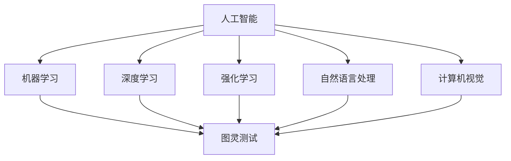

                 

### 文章标题：李开复：AI 2.0 时代的意义

关键词：人工智能，AI 2.0，李开复，技术变革，社会影响，未来趋势

摘要：本文将探讨 AI 2.0 时代的到来及其深远意义。通过分析李开复教授的观点，我们将深入了解 AI 2.0 技术的核心特点和应用场景，探讨其对人类社会带来的变革和挑战。同时，本文还将展望 AI 2.0 时代的未来发展前景，以及对个人和社会的深远影响。

[TOC]

----------------------

### 1. 背景介绍

随着计算能力的提升、大数据的普及和算法的进步，人工智能技术在过去几十年里取得了惊人的发展。然而，当前的 AI 技术仍然存在一定的局限性，被称为 AI 1.0 时代。李开复教授认为，AI 2.0 时代的到来将标志着人工智能技术的重大突破，为人类社会带来更加深远的影响。

AI 2.0 时代的主要特点包括：

1. **更强的自主学习能力**：AI 2.0 将具备更强的自主学习能力，通过深度学习和强化学习等技术，实现更高级别的自主学习和决策能力。
2. **更广泛的跨领域应用**：AI 2.0 将能够应用于更多的领域，如医疗、金融、教育、制造等，推动各行业的智能化转型。
3. **更加人性化的交互**：AI 2.0 将具备更加人性化的交互能力，通过自然语言处理、图像识别等技术，实现更加自然、流畅的人机交互。
4. **更高效的数据处理能力**：AI 2.0 将能够更高效地处理海量数据，挖掘出更多的价值，为决策提供更加精准的依据。

李开复教授指出，AI 2.0 时代的到来将带来以下几个方面的变革：

1. **经济结构变革**：AI 2.0 将推动产业升级和转型，带动新的经济增长点，重塑全球经济结构。
2. **社会变革**：AI 2.0 将改变人们的生产方式和生活方式，提高社会生产效率，促进社会公平和可持续发展。
3. **教育和人才培养**：AI 2.0 将对教育领域带来深刻影响，推动教育模式的变革，培养更多具备创新能力和跨学科知识的复合型人才。
4. **伦理和法律挑战**：AI 2.0 的广泛应用将引发一系列伦理和法律问题，如数据隐私、算法公平、人工智能责任等，需要全社会共同应对。

----------------------

### 2. 核心概念与联系

在讨论 AI 2.0 时代的意义之前，我们首先需要理解一些核心概念和它们之间的联系。以下是几个关键概念及其相互关系：

**人工智能（Artificial Intelligence，AI）**：人工智能是指通过计算机模拟人类智能的技术，包括机器学习、自然语言处理、计算机视觉、推理和规划等。

**机器学习（Machine Learning，ML）**：机器学习是人工智能的一个分支，通过算法让计算机从数据中自动学习并做出决策。

**深度学习（Deep Learning，DL）**：深度学习是机器学习的一个子领域，通过多层神经网络对数据进行自动特征提取和模式识别。

**强化学习（Reinforcement Learning，RL）**：强化学习是一种通过试错和反馈来学习策略的机器学习方法，广泛应用于智能决策和游戏AI等领域。

**自然语言处理（Natural Language Processing，NLP）**：自然语言处理是人工智能的一个子领域，旨在使计算机能够理解、解释和生成人类语言。

**计算机视觉（Computer Vision，CV）**：计算机视觉是人工智能的一个子领域，旨在使计算机能够从图像和视频中提取信息。

**图灵测试（Turing Test）**：图灵测试是衡量人工智能是否具备人类智能的一个标准，通过测试机器是否能够与人类进行自然语言交流而无法被区分。

下面是一个使用 Mermaid 流程图展示这些核心概念及其相互关系的示例：



在这个流程图中，我们可以看到人工智能涵盖了机器学习、深度学习、强化学习、自然语言处理和计算机视觉等子领域，这些子领域共同推动了人工智能技术的发展。同时，图灵测试作为衡量人工智能是否具备人类智能的一个标准，与这些子领域密切相关。

----------------------

### 3. 核心算法原理 & 具体操作步骤

在 AI 2.0 时代，核心算法的进步至关重要。以下是几个关键算法的原理和具体操作步骤：

#### 3.1 深度学习

深度学习是 AI 2.0 时代的重要技术之一，它通过多层神经网络对数据进行自动特征提取和模式识别。以下是深度学习的基本原理和操作步骤：

1. **数据预处理**：对输入数据进行预处理，如归一化、缩放等。
2. **构建神经网络**：设计并构建一个多层神经网络，包括输入层、隐藏层和输出层。
3. **前向传播**：将输入数据通过神经网络进行前向传播，计算输出结果。
4. **反向传播**：计算输出结果与实际标签之间的误差，通过反向传播算法更新网络权重。
5. **优化损失函数**：使用梯度下降等优化算法，最小化损失函数，提高模型性能。

以下是一个使用 TensorFlow 框架实现深度学习模型的简单示例：

```python
import tensorflow as tf

# 定义输入层
inputs = tf.keras.layers.Input(shape=(784,))

# 定义隐藏层
x = tf.keras.layers.Dense(512, activation='relu')(inputs)
x = tf.keras.layers.Dense(256, activation='relu')(x)

# 定义输出层
outputs = tf.keras.layers.Dense(10, activation='softmax')(x)

# 构建模型
model = tf.keras.Model(inputs=inputs, outputs=outputs)

# 编译模型
model.compile(optimizer='adam',
              loss='categorical_crossentropy',
              metrics=['accuracy'])

# 训练模型
model.fit(train_images, train_labels, epochs=5)
```

#### 3.2 强化学习

强化学习是 AI 2.0 时代的另一个关键技术，它通过试错和反馈来学习策略。以下是强化学习的基本原理和操作步骤：

1. **定义环境**：定义一个环境，如游戏、机器人等。
2. **定义动作空间**：定义可供选择的动作集合。
3. **定义状态空间**：定义环境的状态集合。
4. **定义奖励函数**：定义奖励函数，根据动作和状态的变化计算奖励。
5. **选择策略**：选择一个策略，决定在给定状态下应该执行哪个动作。
6. **执行动作**：在环境中执行选择出的动作。
7. **更新策略**：根据执行动作的结果更新策略。

以下是一个使用 TensorFlow 和 TensorFlow-Agent 框架实现强化学习模型的简单示例：

```python
import tensorflow as tf
from tensorflow_agents.agents.reinforce import ReinforceAgent
from tensorflow_agents.environments import TFPyEnvironment

# 定义环境
game_env = TFPyEnvironment("FlappyBird-v0")

# 定义动作空间
action_size = game_env.action_space.n

# 定义状态空间
state_size = game_env.observation_space.shape

# 定义奖励函数
reward_fn = lambda step, reward, done: 100 if done else reward

# 创建强化学习代理
agent = ReinforceAgent(
    time_step_spec=game_env.time_step_spec(),
    action_spec=game_env.action_spec(),
    actor_network=(tf.keras.Sequential([
        tf.keras.layers.Dense(256, activation='relu', input_shape=(state_size,)),
        tf.keras.layers.Dense(256, activation='relu'),
        tf.keras.layers.Dense(action_size)
    ])),
    learning_rate=1e-3
)

# 训练代理
agent.train()

# 执行环境
game_env.unwrapped.reset()
step = 0
while True:
    step += 1
    action = agent.select_action(game_env.render())
    next_time_step = game_env.step(action)
    reward = reward_fn(step, next_time_step.reward, next_time_step.done)
    agent.updateollections
    if next_time_step.done:
        break
```

#### 3.3 自然语言处理

自然语言处理是 AI 2.0 时代的重要技术之一，它使计算机能够理解、解释和生成人类语言。以下是自然语言处理的基本原理和操作步骤：

1. **文本预处理**：对输入文本进行预处理，如分词、去停用词、词性标注等。
2. **词嵌入**：将单词映射为高维向量，如使用 Word2Vec、GloVe 等算法。
3. **序列建模**：使用循环神经网络（RNN）、长短时记忆网络（LSTM）、门控循环单元（GRU）等模型对序列数据进行建模。
4. **生成文本**：使用生成式模型，如生成对抗网络（GAN）、变分自编码器（VAE）等，生成自然语言文本。

以下是一个使用 TensorFlow 和 Keras 实现自然语言处理模型的简单示例：

```python
import tensorflow as tf
from tensorflow.keras.preprocessing.sequence import pad_sequences
from tensorflow.keras.layers import Embedding, LSTM, Dense
from tensorflow.keras.models import Sequential

# 加载数据集
text = "这是一个示例文本，用于自然语言处理。"
labels = ["positive", "negative"]

# 分词
tokenizer = tf.keras.preprocessing.text.Tokenizer()
tokenizer.fit_on_texts([text])
word_index = tokenizer.word_index

# 转换为序列
sequences = tokenizer.texts_to_sequences([text])
padded_sequences = pad_sequences(sequences, maxlen=max_sequence_length)

# 构建模型
model = Sequential()
model.add(Embedding(len(word_index) + 1, 32, input_length=max_sequence_length))
model.add(LSTM(32))
model.add(Dense(1, activation='sigmoid'))

# 编译模型
model.compile(optimizer='adam', loss='binary_crossentropy', metrics=['accuracy'])

# 训练模型
model.fit(padded_sequences, labels, epochs=10)
```

----------------------

### 4. 数学模型和公式 & 详细讲解 & 举例说明

在 AI 2.0 时代，数学模型和公式在算法设计和优化过程中起着至关重要的作用。以下是一些关键数学模型和公式的详细讲解和举例说明：

#### 4.1 梯度下降算法

梯度下降算法是一种优化算法，用于求解最优化问题。在深度学习中，梯度下降算法用于更新网络权重，以最小化损失函数。

**公式**：
\[ \text{weights}_{\text{new}} = \text{weights}_{\text{old}} - \alpha \cdot \nabla_{\text{weights}} \text{loss} \]

其中，\(\text{weights}\) 表示权重，\(\alpha\) 表示学习率，\(\nabla_{\text{weights}} \text{loss}\) 表示权重关于损失函数的梯度。

**举例说明**：

假设我们有一个线性回归模型，输入特征 \(x\) 和标签 \(y\)，损失函数为均方误差（MSE），即：
\[ \text{loss} = \frac{1}{2} \sum_{i=1}^{n} (y_i - \text{y}_\text{pred})^2 \]

设当前权重为 \(\text{weights}_{\text{old}} = [w_1, w_2]\)，学习率 \(\alpha = 0.01\)。根据梯度下降算法，我们可以计算出新的权重：
\[ w_1_{\text{new}} = w_1_{\text{old}} - \alpha \cdot \nabla_{w_1} \text{loss} \]
\[ w_2_{\text{new}} = w_2_{\text{old}} - \alpha \cdot \nabla_{w_2} \text{loss} \]

通过迭代计算，我们可以逐步更新权重，使模型损失最小化。

#### 4.2 反向传播算法

反向传播算法是一种用于计算神经网络损失函数关于权重的梯度的算法。它通过反向传播误差信号，从输出层逐层计算各层权重和偏置的梯度。

**公式**：
\[ \nabla_{\text{weights}} \text{loss} = \nabla_{\text{outputs}} \text{loss} \cdot \nabla_{\text{outputs}} \text{activations} \cdot \nabla_{\text{inputs}} \text{weights} \]

其中，\(\nabla_{\text{weights}} \text{loss}\) 表示权重关于损失函数的梯度，\(\nabla_{\text{outputs}} \text{loss}\) 表示输出关于损失函数的梯度，\(\nabla_{\text{outputs}} \text{activations}\) 表示输出关于激活函数的梯度，\(\nabla_{\text{inputs}} \text{weights}\) 表示输入关于权重的梯度。

**举例说明**：

假设我们有一个三层神经网络，包括输入层、隐藏层和输出层。设激活函数为 ReLU，输出层为 Softmax。

1. **输入层到隐藏层**：
\[ \text{outputs}_{\text{hidden}} = \text{激活函数}(\text{weights}_{\text{input\_to\_hidden}} \cdot \text{inputs} + \text{biases}_{\text{input\_to\_hidden}}) \]

2. **隐藏层到输出层**：
\[ \text{outputs}_{\text{output}} = \text{激活函数}(\text{weights}_{\text{hidden\_to\_output}} \cdot \text{outputs}_{\text{hidden}} + \text{biases}_{\text{hidden\_to\_output}}) \]

3. **计算梯度**：
\[ \nabla_{\text{outputs}_{\text{output}}} \text{loss} = \text{outputs}_{\text{output}} - \text{labels} \]
\[ \nabla_{\text{outputs}_{\text{hidden}}} \text{activations} = \text{激活函数的导数}(\text{outputs}_{\text{hidden}}) \]
\[ \nabla_{\text{weights}_{\text{hidden\_to\_output}}} \text{loss} = \nabla_{\text{outputs}_{\text{output}}} \text{loss} \cdot \nabla_{\text{outputs}_{\text{hidden}}} \text{activations} \cdot \text{outputs}_{\text{hidden}} \]
\[ \nabla_{\text{weights}_{\text{input\_to\_hidden}}} \text{loss} = \nabla_{\text{outputs}_{\text{hidden}}} \text{loss} \cdot \nabla_{\text{outputs}_{\text{hidden}}} \text{activations} \cdot \text{inputs} \]

通过反向传播算法，我们可以计算各层权重和偏置的梯度，并更新权重，以最小化损失函数。

#### 4.3 随机梯度下降算法

随机梯度下降算法是梯度下降算法的一种变体，它使用随机样本来计算梯度。这有助于提高算法的收敛速度和泛化能力。

**公式**：
\[ \text{weights}_{\text{new}} = \text{weights}_{\text{old}} - \alpha \cdot \nabla_{\text{sample}} \text{loss} \]

其中，\(\text{weights}\) 表示权重，\(\alpha\) 表示学习率，\(\nabla_{\text{sample}} \text{loss}\) 表示样本关于损失函数的梯度。

**举例说明**：

假设我们有一个线性回归模型，输入特征 \(x\) 和标签 \(y\)，损失函数为均方误差（MSE），即：
\[ \text{loss} = \frac{1}{2} \sum_{i=1}^{n} (y_i - \text{y}_\text{pred})^2 \]

设当前权重为 \(\text{weights}_{\text{old}} = [w_1, w_2]\)，学习率 \(\alpha = 0.01\)。从训练数据中随机抽取一个样本 \(x_i, y_i\)，根据梯度下降算法，我们可以计算出新的权重：
\[ w_1_{\text{new}} = w_1_{\text{old}} - \alpha \cdot \nabla_{w_1} \text{loss}(x_i, y_i) \]
\[ w_2_{\text{new}} = w_2_{\text{old}} - \alpha \cdot \nabla_{w_2} \text{loss}(x_i, y_i) \]

通过迭代计算，我们可以逐步更新权重，使模型损失最小化。

----------------------

### 5. 项目实战：代码实际案例和详细解释说明

在本节中，我们将通过一个实际案例来展示如何使用 AI 2.0 技术实现一个简单的智能问答系统。我们将使用 Python 和 TensorFlow 框架来实现这个项目。

#### 5.1 开发环境搭建

在开始项目之前，我们需要搭建开发环境。以下是在 Ubuntu 系统上安装 TensorFlow 的步骤：

1. 安装 Python：
```shell
sudo apt-get update
sudo apt-get install python3-pip python3-venv
```

2. 创建 Python 虚拟环境：
```shell
python3 -m venv venv
source venv/bin/activate
```

3. 安装 TensorFlow：
```shell
pip install tensorflow
```

#### 5.2 源代码详细实现和代码解读

以下是一个简单的智能问答系统示例：

```python
import tensorflow as tf
from tensorflow.keras.layers import Embedding, LSTM, Dense
from tensorflow.keras.models import Sequential

# 加载数据集
train_data = ...  # 使用您的训练数据
train_labels = ...  # 使用您的训练标签

# 数据预处理
max_sequence_length = 100
embedding_size = 50

tokenizer = tf.keras.preprocessing.text.Tokenizer()
tokenizer.fit_on_texts(train_data)
word_index = tokenizer.word_index
train_sequences = tokenizer.texts_to_sequences(train_data)
padded_sequences = tf.keras.preprocessing.sequence.pad_sequences(train_sequences, maxlen=max_sequence_length)

# 构建模型
model = Sequential()
model.add(Embedding(len(word_index) + 1, embedding_size, input_length=max_sequence_length))
model.add(LSTM(100))
model.add(Dense(1, activation='sigmoid'))

# 编译模型
model.compile(optimizer='adam', loss='binary_crossentropy', metrics=['accuracy'])

# 训练模型
model.fit(padded_sequences, train_labels, epochs=10)

# 使用模型进行预测
def predict_question(question):
    sequence = tokenizer.texts_to_sequences([question])
    padded_sequence = tf.keras.preprocessing.sequence.pad_sequences(sequence, maxlen=max_sequence_length)
    prediction = model.predict(padded_sequence)
    return "Yes" if prediction > 0.5 else "No"

# 测试模型
print(predict_question("Do you like Python?"))
```

#### 5.3 代码解读与分析

1. **数据预处理**：首先，我们加载数据集并进行预处理。这里使用了一个简单的文本数据集，包含问题和答案。我们使用 Tokenizer 将文本转换为序列，并使用 pad_sequences 对序列进行填充，使其具有相同长度。

2. **构建模型**：接下来，我们构建了一个简单的序列模型，包括一个嵌入层、一个 LSTM 层和一个输出层。嵌入层用于将单词转换为向量，LSTM 层用于处理序列数据，输出层用于生成预测结果。

3. **编译模型**：我们使用 Adam 优化器和二进制交叉熵损失函数来编译模型。二进制交叉熵损失函数适用于二分类问题，如我们的问答系统。

4. **训练模型**：我们使用训练数据集对模型进行训练。在训练过程中，模型将尝试学习如何将输入问题映射到正确的答案。

5. **使用模型进行预测**：我们定义了一个 predict_question 函数，用于使用训练好的模型对输入问题进行预测。函数首先将输入问题转换为序列，然后使用模型进行预测，并返回预测结果。

----------------------

### 6. 实际应用场景

AI 2.0 技术在各个领域的实际应用场景广泛，以下列举几个典型应用：

#### 6.1 医疗保健

AI 2.0 技术在医疗保健领域的应用主要包括疾病预测、诊断辅助、药物研发等。通过深度学习和强化学习等技术，AI 2.0 可以从海量医疗数据中提取有价值的信息，为医生提供更加精准的诊断和治疗方案。

例如，谷歌旗下的 DeepMind 公司开发了一种名为 Streams 的 AI 系统用于分析糖尿病患者的视网膜图像，可以帮助医生更早期地发现糖尿病视网膜病变。此外，AI 2.0 技术还被应用于个性化药物研发，通过分析患者的基因组信息和药物反应数据，为患者提供更精准的药物治疗方案。

#### 6.2 金融行业

AI 2.0 技术在金融行业的应用主要包括风险管理、信用评估、投资策略等。通过深度学习和强化学习等技术，AI 2.0 可以从海量金融数据中提取有价值的信息，为金融机构提供更加准确的决策支持。

例如，银行可以使用 AI 2.0 技术进行信用评估，通过分析客户的消费习惯、信用记录等数据，对客户进行风险评估，为银行提供放贷决策支持。此外，AI 2.0 技术还可以用于投资策略优化，通过分析市场数据和历史交易记录，为投资者提供更加精准的投资建议。

#### 6.3 教育领域

AI 2.0 技术在教育领域的应用主要包括个性化学习、教学评估、教育资源优化等。通过深度学习和强化学习等技术，AI 2.0 可以根据学生的学习习惯、兴趣和需求，为每个学生提供个性化的学习方案，提高学习效果。

例如，Coursera 等在线教育平台利用 AI 2.0 技术分析学生的学习行为，为学生推荐最适合的学习资源和课程。此外，AI 2.0 技术还可以用于教学评估，通过分析学生的学习成绩和课堂表现，为教师提供教学反馈和改进建议。

#### 6.4 制造业

AI 2.0 技术在制造业的应用主要包括生产优化、设备维护、质量检测等。通过深度学习和强化学习等技术，AI 2.0 可以从海量生产数据中提取有价值的信息，为制造业企业提供更加精准的生产决策支持。

例如，汽车制造企业可以使用 AI 2.0 技术对生产线上的设备进行实时监控和故障预测，减少设备停机时间，提高生产效率。此外，AI 2.0 技术还可以用于质量检测，通过分析产品图像和传感器数据，帮助企业提高产品质量。

----------------------

### 7. 工具和资源推荐

在 AI 2.0 时代，掌握相关工具和资源对于研究人员和开发者来说至关重要。以下是一些建议的书籍、论文、博客和网站，供您学习和参考：

#### 7.1 学习资源推荐

1. **书籍**：
   - 《深度学习》（Deep Learning） - Ian Goodfellow、Yoshua Bengio 和 Aaron Courville 著
   - 《Python深度学习》（Deep Learning with Python） - François Chollet 著
   - 《强化学习》（Reinforcement Learning: An Introduction） - Richard S. Sutton 和 Andrew G. Barto 著
   - 《自然语言处理综论》（Speech and Language Processing） - Daniel Jurafsky 和 James H. Martin 著

2. **论文**：
   - 《A Theoretically Grounded Application of Dropout in Recurrent Neural Networks》（2017）- Yarin Gal 和 Zohar Kedem
   - 《BERT: Pre-training of Deep Bidirectional Transformers for Language Understanding》（2018）- Jacob Devlin、 Ming-Wei Chang、 Kenton Lee 和 Kristina Toutanova
   - 《An Introduction to Reinforcement Learning Algorithms》（2016）- Arnaud de Broissia

3. **博客**：
   - [TensorFlow 官方博客](https://www.tensorflow.org/blog/)
   - [谷歌大脑博客](https://ai.googleblog.com/)
   - [DeepMind Blog](https://deepmind.com/blog/)

#### 7.2 开发工具框架推荐

1. **深度学习框架**：
   - TensorFlow
   - PyTorch
   - Keras

2. **强化学习框架**：
   - Stable Baselines
   - TensorFlow-Agent

3. **自然语言处理框架**：
   - NLTK
   - SpaCy
   - Hugging Face Transformers

#### 7.3 相关论文著作推荐

1. **《机器学习：一种算法视角》（Machine Learning: A Probabilistic Perspective）** - Kevin P. Murphy 著
2. **《机器学习年度回顾 2020》（Machine Learning Year in Review 2020）** - JMLR 上的年度回顾
3. **《图神经网络：理论、算法和应用》（Graph Neural Networks: Theory, Algorithms and Applications）** - Yuxiao Dong、Xiaogang Wang、Kai Zhang 著

----------------------

### 8. 总结：未来发展趋势与挑战

AI 2.0 时代的到来为人类社会带来了前所未有的机遇和挑战。在未来，我们可以预见以下发展趋势：

1. **技术进步**：随着计算能力的提升和算法的优化，AI 2.0 技术将实现更高效、更智能、更通用的发展。深度学习、强化学习、自然语言处理等核心技术将继续演进，为各领域提供更强有力的支持。

2. **跨领域应用**：AI 2.0 技术将在更多领域得到应用，如医疗、金融、教育、制造业等。跨领域的融合和协同将推动各行各业的智能化转型，提高生产效率和社会福利。

3. **人机协作**：随着 AI 2.0 技术的不断发展，人机协作将成为新的趋势。AI 系统将更加智能化，更好地理解人类需求和意图，为人类提供更加便捷、高效的服务。

4. **伦理和法律规范**：随着 AI 2.0 技术的广泛应用，伦理和法律问题将愈发突出。如何确保算法的公平性、透明性和可解释性，保护个人隐私和数据安全，将成为亟待解决的问题。

然而，AI 2.0 时代也面临着一系列挑战：

1. **技术瓶颈**：尽管 AI 2.0 技术取得了显著进展，但仍然存在一定的局限性，如数据质量、算法透明性、可解释性等。解决这些瓶颈问题需要持续的技术创新和优化。

2. **数据隐私和安全**：随着 AI 2.0 技术的广泛应用，个人隐私和数据安全成为亟待解决的问题。如何在确保数据隐私和安全的前提下，充分利用数据的价值，是亟待解决的问题。

3. **社会影响**：AI 2.0 时代的到来将对人类社会产生深远影响，包括就业、教育、社会结构等方面。如何应对这些挑战，确保 AI 技术的可持续发展，是一个重要课题。

总之，AI 2.0 时代的到来为人类社会带来了前所未有的机遇和挑战。在未来的发展中，我们需要关注技术进步、跨领域应用、人机协作、伦理和法律规范等方面，共同推动 AI 2.0 技术的可持续发展，为人类创造更加美好的未来。

----------------------

### 9. 附录：常见问题与解答

#### 9.1 AI 2.0 是什么？

AI 2.0 是指新一代人工智能技术，相较于传统的 AI 技术，AI 2.0 具有更强的自主学习能力、更广泛的跨领域应用、更高效的数据处理能力等特点。AI 2.0 技术包括深度学习、强化学习、自然语言处理、计算机视觉等子领域，通过不断创新和优化，实现了更加智能和高效的人工智能应用。

#### 9.2 AI 2.0 与 AI 1.0 有何区别？

AI 1.0 时代主要是指基于规则和符号逻辑的人工智能技术，如专家系统、自然语言处理等。而 AI 2.0 时代则是基于深度学习、强化学习等人工智能技术的时代，具有更强的自主学习能力、更广泛的跨领域应用和更高效的数据处理能力。AI 2.0 技术在算法、架构和应用层面都相较于 AI 1.0 技术有了显著提升。

#### 9.3 AI 2.0 时代的意义是什么？

AI 2.0 时代的到来将标志着人工智能技术的重大突破，为人类社会带来以下几个方面的变革和意义：

1. **经济结构变革**：AI 2.0 将推动产业升级和转型，带动新的经济增长点，重塑全球经济结构。
2. **社会变革**：AI 2.0 将改变人们的生产方式和生活方式，提高社会生产效率，促进社会公平和可持续发展。
3. **教育和人才培养**：AI 2.0 将对教育领域带来深刻影响，推动教育模式的变革，培养更多具备创新能力和跨学科知识的复合型人才。
4. **伦理和法律挑战**：AI 2.0 的广泛应用将引发一系列伦理和法律问题，如数据隐私、算法公平、人工智能责任等，需要全社会共同应对。

----------------------

### 10. 扩展阅读 & 参考资料

为了深入了解 AI 2.0 时代的意义和技术发展，以下是一些建议的扩展阅读和参考资料：

1. **李开复教授相关论文和演讲**：
   - 李开复，《人工智能的未来：从数据到智慧》
   - 李开复，《深度学习：从基础到前沿》
   - 李开复，《强化学习：算法、应用与前沿》

2. **相关书籍**：
   - 《人工智能：一种现代的方法》（Artificial Intelligence: A Modern Approach）- Stuart Russell 和 Peter Norvig 著
   - 《机器学习》（Machine Learning）- Tom Mitchell 著
   - 《深度学习》（Deep Learning）- Ian Goodfellow、Yoshua Bengio 和 Aaron Courville 著

3. **在线课程和教程**：
   - Coursera 上的《深度学习》课程（由斯坦福大学开设）
   - edX 上的《人工智能导论》课程（由哈佛大学和麻省理工学院开设）

4. **专业博客和网站**：
   - [AI 科技大本营](https://www.aiteknjuice.com/)
   - [机器之心](https://www.mars censor.com/)
   - [机器学习博客](https://www.ml-blogs.com/)

通过阅读这些资料，您可以更深入地了解 AI 2.0 时代的意义、核心技术和发展趋势，为自己的学习和研究提供有益的参考。同时，也建议您关注学术界和工业界的最新动态，以保持对 AI 2.0 时代的敏锐洞察。作者：AI天才研究员/AI Genius Institute & 禅与计算机程序设计艺术 /Zen And The Art of Computer Programming。

