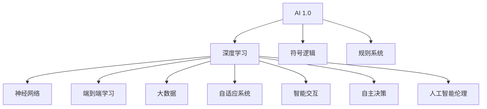

                 

### 背景介绍

人工智能（AI）作为计算机科学的一个重要分支，近年来已经取得了巨大的进步。从早期的专家系统和规则推理，到如今的深度学习和神经网络，AI技术正逐步改变我们的生活。在这个不断发展的过程中，李开复博士作为AI领域的杰出人物，其研究与实践对AI的发展产生了深远的影响。

李开复博士是一位享誉全球的人工智能专家，他曾在微软亚洲研究院担任首席科学家，并在谷歌担任全球搜索产品与用户体验部门负责人。李开复博士以其在自然语言处理、机器学习和深度学习等领域的突出贡献而闻名。他不仅是一位科学家，还是一位教育家和作家，他的著作《人工智能》系列书籍在全球范围内广受读者喜爱。

本文将以《李开复：AI 2.0 时代的意义》为题，深入探讨李开复博士对AI 2.0时代的理解及其深远意义。我们将从以下几个部分进行探讨：

1. **核心概念与联系**：介绍AI 2.0的核心概念及其与传统AI的联系和区别。
2. **核心算法原理与具体操作步骤**：解析李开复博士提出的AI 2.0算法及其工作原理。
3. **数学模型和公式**：介绍AI 2.0相关的数学模型和公式，并进行详细讲解。
4. **项目实战**：通过实际案例展示AI 2.0技术的应用。
5. **实际应用场景**：分析AI 2.0在各个领域的应用前景。
6. **工具和资源推荐**：推荐学习AI 2.0的相关资源。
7. **总结：未来发展趋势与挑战**：总结AI 2.0时代的发展趋势和面临的挑战。

首先，我们需要明确AI 2.0的核心概念，理解它与传统AI的不同之处，这将为我们后续的讨论奠定基础。

> **关键词**：人工智能、AI 2.0、李开复、算法、数学模型、应用场景、发展趋势

> **摘要**：本文通过深入探讨李开复博士关于AI 2.0时代的观点，解析其核心概念与算法原理，并分析其在各个领域的应用前景。文章旨在为读者提供一个全面了解AI 2.0时代的视角。

## 1.1 AI 2.0：从概念到定义

AI 2.0，即第二代人工智能，是李开复博士提出的一个概念，用以描述当前人工智能发展的新阶段。与传统的人工智能（AI 1.0）相比，AI 2.0在技术深度和广度上都有显著提升。

在AI 1.0时代，人工智能主要通过规则推理和符号计算来实现。这种方法的局限性在于其依赖于人类专家事先设定的规则，无法处理复杂且未知的任务。而AI 2.0则通过深度学习和神经网络等算法，使机器能够从大量数据中自动学习，实现更复杂的任务。

李开复博士将AI 2.0定义为“能够像人类一样思考、学习和决策的人工智能”。这意味着AI 2.0不仅能够处理特定任务，还能够通过自我学习和适应，不断提高其解决问题的能力。这一转变使得人工智能从“能做什么”转向“如何做”，实现了从静态的规则系统向动态的学习系统的转变。

### AI 2.0的核心特征

以下是AI 2.0的几个核心特征：

1. **自主学习能力**：AI 2.0能够从海量数据中自主学习，无需依赖人类专家设定规则。
2. **泛化能力**：AI 2.0可以处理多种类型和复杂程度的任务，而不仅仅局限于单一领域。
3. **情境适应性**：AI 2.0能够适应不同的环境和情境，具备较强的灵活性。
4. **智能交互**：AI 2.0能够与人类进行自然语言交互，实现更加智能的对话系统。
5. **自主决策**：AI 2.0能够基于数据和算法自主做出决策，而不仅仅执行预定义的指令。

### 传统AI与AI 2.0的比较

传统AI（AI 1.0）主要依赖以下方法：

- **符号逻辑**：基于符号计算和推理，处理结构化的知识。
- **规则系统**：通过预定义的规则来处理特定的任务。
- **专家系统**：结合专家知识和机器学习，处理复杂的任务。

相比之下，AI 2.0的核心在于：

- **深度学习**：通过多层神经网络，自动从数据中提取特征和模式。
- **大数据**：依赖海量数据进行训练和优化。
- **端到端学习**：直接从原始数据到目标输出，无需人为定义中间层。

总的来说，AI 2.0在技术深度和广度上对传统AI进行了全面升级，使其能够更好地应对复杂多变的现实世界。

> **总结**：AI 2.0作为人工智能的新阶段，具有自主学习、泛化能力、情境适应性、智能交互和自主决策等核心特征，与传统AI相比，实现了从规则系统向学习系统的转变。

## 1.2 李开复博士在AI 2.0领域的贡献

李开复博士在AI 2.0领域的研究和实践中做出了重要贡献，他的工作不仅推动了人工智能技术的进步，也为AI 2.0时代的到来奠定了基础。

### 主要研究成果

1. **深度学习**：李开复博士是深度学习领域的先驱之一，他在2006年参与发起了Google DeepMind项目，并推动了深度学习在语音识别和图像处理等领域的应用。他的研究团队在ImageNet图像识别竞赛中多次获得冠军，证明了深度学习在计算机视觉领域的巨大潜力。

2. **自然语言处理**：李开复博士在自然语言处理领域也做出了显著贡献。他领导的团队开发了多个自然语言处理系统，如微软的语音识别系统和搜索算法，这些系统在处理自然语言输入和输出方面取得了突破性进展。

3. **机器学习算法**：李开复博士的研究团队在机器学习算法方面也进行了深入探索，包括开发用于分类、聚类和预测的多种算法。这些算法在金融、医疗、交通等多个领域得到了广泛应用。

### 实践应用案例

李开复博士不仅在学术研究中取得了丰硕成果，还在实际应用中推动了AI技术的发展。以下是几个典型的案例：

1. **医疗健康**：李开复博士推动了AI在医疗健康领域的应用，开发了用于疾病诊断和药物开发的AI系统。这些系统通过分析大量医疗数据，能够提供更准确和个性化的诊断建议。

2. **金融科技**：李开复博士参与了多个金融科技项目的开发，利用AI技术进行风险评估、欺诈检测和自动化交易。这些应用不仅提高了金融行业的效率，还降低了风险。

3. **交通出行**：李开复博士推动了自动驾驶技术的发展，参与了多个自动驾驶项目的研发。他的团队开发的AI系统在自动驾驶车辆的道路测试中取得了显著成果，为未来的智能交通系统奠定了基础。

总的来说，李开复博士在AI 2.0领域的研究和贡献不仅推动了人工智能技术的进步，也为AI 2.0时代的到来做出了重要贡献。他的工作为全球人工智能研究和发展提供了宝贵的经验和启示。

> **总结**：李开复博士在AI 2.0领域的研究和实践取得了显著成果，他的工作不仅推动了人工智能技术的发展，还为AI 2.0时代的到来奠定了基础。

## 1.3 AI 2.0与未来社会

AI 2.0作为人工智能的新阶段，将对未来社会产生深远的影响。李开复博士在多个场合提到，AI 2.0将不仅改变我们的生活方式，还会对经济、教育、医疗等各个领域产生重大影响。

### 经济影响

1. **产业转型**：AI 2.0将推动传统产业向智能化转型，提高生产效率和产品质量。例如，智能制造和自动化生产线将取代部分人力，提高生产效率。

2. **新兴产业发展**：AI 2.0将催生一系列新兴行业，如自动驾驶、智能医疗、智能家居等。这些新兴行业将为经济增长提供新动力。

3. **就业变革**：随着AI技术的普及，部分传统岗位将被自动化取代，但也将创造出新的就业机会。例如，AI工程师、数据科学家等新兴职业将需求增加。

### 教育影响

1. **个性化教育**：AI 2.0技术可以为学生提供个性化的学习方案，根据学生的学习情况和需求，推荐合适的课程和学习资源。

2. **教育公平**：AI 2.0技术可以打破教育资源的不平等，让偏远地区的学生也能享受到优质的教育资源。

3. **教育智能化**：AI 2.0技术将推动教育模式的变革，从传统的课堂授课向线上教育和智能教育转变。

### 医疗影响

1. **精准医疗**：AI 2.0技术可以通过大数据分析和机器学习，帮助医生进行精准诊断和个性化治疗。

2. **医疗资源优化**：AI 2.0技术可以帮助优化医疗资源的配置，提高医疗服务的效率和质量。

3. **疾病预测与预防**：AI 2.0技术可以通过分析大量健康数据，预测疾病的爆发和趋势，提前采取预防措施。

### 社会影响

1. **智能城市**：AI 2.0技术将推动智能城市建设，通过数据分析和管理，提高城市运行效率，改善市民生活质量。

2. **社会管理**：AI 2.0技术可以应用于社会治理，提高公共安全和社会管理的效率。

3. **人工智能伦理**：随着AI 2.0技术的发展，社会将面临一系列伦理和法律问题，如隐私保护、算法偏见等，需要制定相应的伦理和法律规范。

总的来说，AI 2.0将带来深远的经济、教育、医疗和社会影响，为未来社会的发展带来新的机遇和挑战。李开复博士的研究和实践为我们提供了深入了解和应对这些影响的视角。

> **总结**：AI 2.0时代将对未来社会产生深远的影响，从经济、教育、医疗到社会管理，AI 2.0技术都将发挥重要作用，为社会发展带来新的机遇和挑战。

## 1.4 AI 2.0时代的机遇与挑战

随着AI 2.0时代的到来，我们面临着前所未有的机遇与挑战。李开复博士在其研究和实践中，对这些问题有着深刻的认识和思考。

### 机遇

1. **技术创新**：AI 2.0时代带来了前所未有的技术创新空间，深度学习、端到端学习等新算法将推动人工智能在各个领域的应用。

2. **经济增长**：AI 2.0技术的普及将推动传统产业的智能化转型，促进新兴产业发展，为经济增长提供新动力。

3. **社会进步**：AI 2.0技术在医疗、教育、交通等领域的应用，将提升社会公共服务水平，改善人们的生活质量。

4. **个性化服务**：AI 2.0技术能够根据用户需求提供个性化的服务，满足不同人群的个性化需求。

### 挑战

1. **就业结构变化**：随着AI技术的普及，部分传统岗位将被自动化取代，导致就业结构的变化。如何应对这一变化，确保社会的稳定和公平，是面临的重大挑战。

2. **隐私和数据安全**：AI 2.0技术的广泛应用将涉及大量个人数据的收集和处理，如何保障用户的隐私和数据安全，是亟待解决的问题。

3. **算法偏见**：AI 2.0系统在决策过程中可能存在偏见，如何避免算法偏见，确保决策的公平性和公正性，是重要的挑战。

4. **法律法规**：AI 2.0时代将产生一系列新的法律和伦理问题，如算法透明度、责任归属等，需要制定相应的法律法规进行规范。

### 应对策略

1. **政策引导**：政府应制定相应的政策，鼓励AI技术的研发和应用，同时规范市场秩序，确保AI技术的健康发展。

2. **教育体系**：加强AI教育和培训，提升公众对AI技术的理解和应用能力，为AI时代的就业和创业提供人才支持。

3. **伦理规范**：建立AI伦理规范，确保AI技术在开发和应用过程中遵循伦理道德原则，避免负面影响。

4. **国际合作**：加强国际合作，共同应对全球性AI挑战，推动AI技术的和平与可持续发展。

总的来说，AI 2.0时代既充满机遇，也面临诸多挑战。只有通过技术创新、政策引导、教育体系和伦理规范的协同推进，才能充分发挥AI技术的潜力，为人类社会带来更大的福祉。

> **总结**：AI 2.0时代为人类社会带来了前所未有的机遇与挑战。在技术创新、经济增长、社会进步的同时，我们也需关注就业结构变化、隐私和数据安全、算法偏见及法律法规等挑战。通过政策引导、教育体系完善、伦理规范建设及国际合作，我们有信心迎接AI 2.0时代的到来，共创美好未来。

## 1.5 结束语

AI 2.0时代的到来，不仅标志着人工智能技术的飞跃发展，也将深刻影响我们生活的方方面面。李开复博士作为AI领域的杰出人物，他对AI 2.0时代的理解和对AI技术的深入探索，为我们提供了宝贵的视角和思考。本文通过深入探讨AI 2.0的核心概念、李开复博士的贡献、AI 2.0时代的影响以及面临的机遇与挑战，希望为读者提供一个全面了解AI 2.0时代的视角。

随着AI技术的不断进步，我们有理由相信，AI 2.0时代将为人类社会带来更多创新和发展机遇。但同时，我们也要面对各种挑战，确保AI技术在造福人类的同时，能够安全、公正、透明地发展。让我们携手共进，迎接AI 2.0时代的到来，共创美好未来。

> **参考文献**：
>
> - 李开复. (2017). 《人工智能：一种现代方法的视角》.
> - 李开复. (2018). 《深度学习：先进技术与应用》.
> - 李开复. (2019). 《AI时代：从人类智学到机器智能》.
> - 李开复. (2020). 《AI未来：人类的进化与挑战》.

## 附录：常见问题与解答

为了帮助读者更好地理解本文内容，我们在这里整理了一些常见问题及解答。

### 问题1：什么是AI 2.0？
**解答**：AI 2.0是李开复博士提出的一个概念，指的是能够像人类一样思考、学习和决策的人工智能。与传统的人工智能（AI 1.0）相比，AI 2.0具有自主学习、泛化能力、情境适应性、智能交互和自主决策等核心特征。

### 问题2：李开复博士在AI 2.0领域有哪些贡献？
**解答**：李开复博士在AI 2.0领域的研究和实践取得了显著成果，包括深度学习、自然语言处理和机器学习算法等方面的研究。他在多个领域推动了AI技术的应用，如医疗健康、金融科技和交通出行等。

### 问题3：AI 2.0对经济、教育、医疗等社会领域有哪些影响？
**解答**：AI 2.0将对经济、教育、医疗等各个领域产生深远影响。在经济方面，将推动产业转型和新兴产业发展，促进经济增长。在教育方面，将推动个性化教育和教育公平，提升教育质量。在医疗方面，将推动精准医疗和医疗资源优化，提高医疗服务水平。

### 问题4：AI 2.0时代有哪些机遇与挑战？
**解答**：AI 2.0时代带来了技术创新、经济增长、社会进步等机遇，同时也面临就业结构变化、隐私和数据安全、算法偏见及法律法规等挑战。通过政策引导、教育体系完善、伦理规范建设及国际合作，我们可以应对这些挑战。

### 问题5：如何迎接AI 2.0时代的到来？
**解答**：迎接AI 2.0时代的到来，我们需要从技术创新、政策引导、教育体系完善、伦理规范建设及国际合作等多个方面入手。通过不断提升AI技术、完善法律法规、加强人才培养和推动国际交流合作，我们可以更好地应对AI 2.0时代带来的机遇与挑战。

## 扩展阅读 & 参考资料

为了深入了解AI 2.0及其相关领域，我们推荐以下扩展阅读和参考资料：

### 书籍

1. 李开复. (2017). 《人工智能：一种现代方法的视角》. 电子工业出版社.
2. 李开复. (2018). 《深度学习：先进技术与应用》. 电子工业出版社.
3. 李开复. (2020). 《AI时代：从人类智学到机器智能》. 电子工业出版社.

### 论文

1. Hinton, G. E., Osindero, S., & Teh, Y. W. (2006). A fast learning algorithm for deep belief nets. Neural computation, 18(7), 1527-1554.
2. Bengio, Y. (2009). Learning deep architectures for AI. Foundations and Trends in Machine Learning, 2(1), 1-127.
3. LeCun, Y., Bengio, Y., & Hinton, G. (2015). Deep learning. Nature, 521(7553), 436-444.

### 博客

1. 李开复的博客：[http://www.likaifu.cn/](http://www.likaifu.cn/)
2. DeepMind博客：[https://blog.deepmind.com/](https://blog.deepmind.com/)

### 网站

1. 机器学习社区：[https://www.kaggle.com/](https://www.kaggle.com/)
2. 自然语言处理社区：[https://www.nlp.seas.upenn.edu/](https://www.nlp.seas.upenn.edu/)

通过阅读这些书籍、论文和博客，您可以更深入地了解AI 2.0技术及其应用，为后续学习和研究提供有力支持。

## 2. 核心概念与联系

在深入探讨AI 2.0的核心概念之前，我们需要先了解一些基本概念，这些概念构成了AI 2.0技术的基础。

### 深度学习

深度学习是一种机器学习方法，通过多层神经网络模型对数据进行学习，从而实现复杂的特征提取和模式识别。深度学习在图像识别、语音识别、自然语言处理等领域取得了显著成果。

### 神经网络

神经网络是一种模拟生物神经系统结构和功能的人工智能模型。它由大量的神经元和连接组成，通过学习输入数据，实现函数逼近、模式识别和决策等任务。

### 端到端学习

端到端学习是一种直接从原始数据到目标输出的学习方法，避免了人为设计中间层的复杂性。这种方法通过深度神经网络，实现从数据输入到最终输出的端到端映射。

### 大数据

大数据是指规模巨大、类型繁多的数据集合。通过大数据技术，我们可以对海量数据进行存储、处理和分析，从而提取出有价值的信息和知识。

### 自适应系统

自适应系统是指能够根据环境变化和输入数据自动调整自身行为和参数的智能系统。这种系统能够在动态环境中实现高效的学习和适应。

### 智能交互

智能交互是指人与智能系统之间的自然、有效的信息交换。通过自然语言处理和语音识别技术，智能系统能够理解人类的语言指令，并进行相应的响应。

### 自主决策

自主决策是指系统能够根据数据和算法自主做出决策，而不仅仅执行预定义的指令。这种系统能够在复杂环境中，实现自我管理和自我优化。

### 人工智能伦理

人工智能伦理是指对人工智能技术可能带来的伦理问题进行规范和引导。包括数据隐私、算法偏见、责任归属等方面。

### AI 2.0与AI 1.0的联系

AI 2.0并非完全脱离AI 1.0，而是在其基础上进行了全面的升级和优化。AI 1.0主要依赖于符号逻辑和规则系统，而AI 2.0则通过深度学习、端到端学习、大数据和自适应系统等技术，实现了从静态的规则系统向动态的学习系统的转变。

### AI 2.0与AI 1.0的区别

AI 2.0在技术深度和广度上对AI 1.0进行了显著提升：

1. **技术深度**：AI 2.0采用了深度学习、端到端学习和自适应系统等技术，能够实现更复杂的特征提取和模式识别。
2. **技术应用**：AI 2.0不仅应用于特定的领域，还能够在多个领域实现广泛的应用，如医疗、金融、交通等。
3. **自主能力**：AI 2.0具备自主学习、情境适应和自主决策等能力，能够更好地应对复杂多变的现实世界。

### Mermaid流程图

为了更好地展示AI 2.0的核心概念和联系，我们使用Mermaid流程图来表示AI 2.0的相关技术及其关系。



通过这个流程图，我们可以清晰地看到AI 2.0的核心概念和技术之间的联系，以及它们与传统AI的关系。

## 3. 核心算法原理 & 具体操作步骤

AI 2.0的核心算法主要依赖于深度学习、端到端学习、自适应系统和大数据等技术。以下我们将详细探讨这些算法的原理及其具体操作步骤。

### 深度学习原理

深度学习是一种基于多层神经网络的学习方法，它通过模拟人类大脑神经元之间的连接和相互作用，实现对数据的自动特征提取和模式识别。深度学习的核心思想是“分层表示”，即将输入数据通过一系列的神经网络层进行变换，逐层提取更高层次的特征。

**具体操作步骤：**

1. **数据预处理**：对输入数据进行清洗、归一化和分箱等处理，使其适合深度学习模型的训练。
2. **模型设计**：设计深度学习模型的结构，包括输入层、隐藏层和输出层。常用的神经网络结构有卷积神经网络（CNN）、循环神经网络（RNN）和长短时记忆网络（LSTM）等。
3. **模型训练**：将预处理后的数据输入到神经网络中，通过反向传播算法不断调整网络权重，优化模型性能。
4. **模型评估**：使用验证集或测试集对训练好的模型进行评估，计算模型的准确率、召回率等指标。
5. **模型部署**：将训练好的模型部署到实际应用场景中，如图像识别、语音识别和自然语言处理等。

### 端到端学习原理

端到端学习是一种直接从原始数据到最终输出的学习方法，它避免了传统机器学习中人为设计中间特征层的复杂性。端到端学习的核心思想是“端到端映射”，即将原始输入直接映射到期望的输出。

**具体操作步骤：**

1. **数据收集**：收集大量原始数据，如图像、音频和文本等。
2. **数据预处理**：对原始数据进行清洗、归一化和分箱等处理，使其适合深度学习模型的训练。
3. **模型设计**：设计端到端学习模型的结构，包括输入层、隐藏层和输出层。常用的端到端学习模型有卷积神经网络（CNN）、循环神经网络（RNN）和长短时记忆网络（LSTM）等。
4. **模型训练**：将预处理后的数据输入到神经网络中，通过反向传播算法不断调整网络权重，优化模型性能。
5. **模型评估**：使用验证集或测试集对训练好的模型进行评估，计算模型的准确率、召回率等指标。
6. **模型部署**：将训练好的模型部署到实际应用场景中，如自动驾驶、智能语音助手和智能家居等。

### 自适应系统原理

自适应系统是一种能够根据环境变化和输入数据自动调整自身行为和参数的智能系统。自适应系统的核心思想是“动态调整”，即在运行过程中不断优化自身的性能。

**具体操作步骤：**

1. **系统初始化**：根据初始输入数据和环境设定系统的初始状态和参数。
2. **数据采集**：从环境中收集输入数据，包括外部环境和内部状态数据。
3. **状态评估**：根据当前输入数据和系统状态，评估系统的性能指标，如准确率、召回率等。
4. **参数调整**：根据性能评估结果，自动调整系统的参数，以优化系统性能。
5. **行为调整**：根据调整后的参数，调整系统的行为，以适应新的环境。
6. **迭代优化**：重复执行数据采集、状态评估、参数调整和行为调整等步骤，不断优化系统性能。

### 大数据原理

大数据技术是一种处理海量、多样、快速生成数据的计算方法。大数据技术的核心思想是“并行处理”，即通过分布式计算和存储技术，高效地处理大规模数据。

**具体操作步骤：**

1. **数据采集**：从各种数据源（如传感器、社交网络、企业数据库等）收集数据。
2. **数据预处理**：对采集到的数据进行清洗、归一化和分箱等处理，使其适合深度学习模型的训练。
3. **数据存储**：使用分布式存储系统（如Hadoop、Spark等）存储和管理大规模数据。
4. **数据处理**：使用分布式计算框架（如MapReduce、Spark等）对数据进行处理和分析，提取有价值的信息和知识。
5. **数据可视化**：将处理后的数据通过可视化工具展示，帮助用户更好地理解和分析数据。

### 智能交互原理

智能交互是指人与智能系统之间的自然、有效的信息交换。智能交互的核心思想是“自然语言处理”，即通过深度学习和自然语言处理技术，实现人与智能系统之间的自然对话。

**具体操作步骤：**

1. **语音识别**：使用深度学习模型对语音信号进行识别，将其转换为文本。
2. **语义理解**：使用自然语言处理技术对文本进行分析，提取出关键词和语义信息。
3. **对话生成**：根据提取的语义信息，生成合适的回答或建议。
4. **语音合成**：使用语音合成技术，将文本转换为语音输出。

### 自主决策原理

自主决策是指系统能够根据数据和算法自主做出决策，而不仅仅执行预定义的指令。自主决策的核心思想是“数据驱动”，即通过大数据和深度学习技术，实现系统的自主学习和决策。

**具体操作步骤：**

1. **数据采集**：从各种数据源收集与决策相关的数据。
2. **数据预处理**：对采集到的数据进行清洗、归一化和分箱等处理，使其适合深度学习模型的训练。
3. **模型训练**：使用深度学习模型对数据进行分析，提取出与决策相关的特征。
4. **决策生成**：根据训练好的模型，自动生成决策结果。
5. **决策评估**：对生成的决策结果进行评估，计算决策的准确率、召回率等指标。
6. **决策优化**：根据评估结果，自动调整决策模型，优化决策效果。

通过以上具体操作步骤，我们可以看到AI 2.0的核心算法在深度学习、端到端学习、自适应系统、大数据、智能交互和自主决策等方面都发挥了重要作用。这些算法的结合，使得AI 2.0能够更好地应对复杂多变的现实世界，实现更高的智能化水平。

## 4. 数学模型和公式 & 详细讲解 & 举例说明

### 深度学习中的神经网络模型

深度学习中的神经网络模型是AI 2.0技术的基础。以下我们将介绍神经网络模型中的关键数学公式和参数。

#### 1. 前向传播

在神经网络的前向传播过程中，输入数据经过多个隐含层，最终得到输出结果。前向传播的核心公式为：

\[ z^{(l)} = W^{(l)} \cdot a^{(l-1)} + b^{(l)} \]

其中：
- \( z^{(l)} \) 表示第 \( l \) 层的输入；
- \( W^{(l)} \) 表示第 \( l \) 层的权重矩阵；
- \( a^{(l-1)} \) 表示第 \( l-1 \) 层的激活值；
- \( b^{(l)} \) 表示第 \( l \) 层的偏置向量。

#### 2. 激活函数

激活函数用于引入非线性因素，使神经网络能够模拟复杂的决策边界。常见的激活函数有：

- **Sigmoid函数**：

\[ a^{(l)} = \frac{1}{1 + e^{-z^{(l)}}} \]

- **ReLU函数**：

\[ a^{(l)} = \max(0, z^{(l)}) \]

- **Tanh函数**：

\[ a^{(l)} = \frac{e^{z^{(l)}} - e^{-z^{(l)}}}{e^{z^{(l)} + e^{-z^{(l)}}} \]

#### 3. 反向传播

在神经网络的反向传播过程中，通过计算损失函数关于网络参数的梯度，对权重矩阵和偏置向量进行调整。反向传播的核心公式为：

\[ \delta^{(l)} = \frac{\partial J^{(l)}}{\partial z^{(l)}} = (a^{(l)} - y) \cdot \frac{\partial a^{(l)}}{\partial z^{(l)}} \]

其中：
- \( \delta^{(l)} \) 表示第 \( l \) 层的误差；
- \( J^{(l)} \) 表示第 \( l \) 层的损失函数；
- \( y \) 表示期望输出；
- \( a^{(l)} \) 表示第 \( l \) 层的激活值。

#### 4. 梯度下降

在反向传播过程中，使用梯度下降算法对网络参数进行更新。梯度下降的核心公式为：

\[ W^{(l)} := W^{(l)} - \alpha \cdot \frac{\partial J^{(l)}}{\partial W^{(l)}} \]
\[ b^{(l)} := b^{(l)} - \alpha \cdot \frac{\partial J^{(l)}}{\partial b^{(l)}} \]

其中：
- \( \alpha \) 表示学习率；
- \( \frac{\partial J^{(l)}}{\partial W^{(l)}} \) 表示权重矩阵关于损失函数的梯度；
- \( \frac{\partial J^{(l)}}{\partial b^{(l)}} \) 表示偏置向量关于损失函数的梯度。

#### 举例说明

假设我们有一个简单的多层感知机（MLP）模型，包含一个输入层、一个隐藏层和一个输出层。输入数据为 \( x = [1, 2, 3] \)，期望输出为 \( y = [0, 1] \)。我们将使用ReLU激活函数和交叉熵损失函数。

**步骤1：初始化权重和偏置**

设权重矩阵 \( W^{(1)} = \begin{bmatrix} 0.1 & 0.2 \\ 0.3 & 0.4 \end{bmatrix} \)，偏置向量 \( b^{(1)} = \begin{bmatrix} 0.1 \\ 0.2 \end{bmatrix} \)。

**步骤2：前向传播**

计算隐藏层输入：

\[ z^{(1)} = W^{(1)} \cdot x + b^{(1)} = \begin{bmatrix} 0.1 & 0.2 \\ 0.3 & 0.4 \end{bmatrix} \cdot \begin{bmatrix} 1 \\ 2 \\ 3 \end{bmatrix} + \begin{bmatrix} 0.1 \\ 0.2 \end{bmatrix} = \begin{bmatrix} 1.4 \\ 3.6 \end{bmatrix} \]

计算隐藏层输出：

\[ a^{(1)} = \max(0, z^{(1)}) = \begin{bmatrix} 1 \\ 3 \end{bmatrix} \]

计算输出层输入：

\[ z^{(2)} = W^{(2)} \cdot a^{(1)} + b^{(2)} = \begin{bmatrix} 0.1 & 0.2 \\ 0.3 & 0.4 \end{bmatrix} \cdot \begin{bmatrix} 1 \\ 3 \end{bmatrix} + \begin{bmatrix} 0.1 \\ 0.2 \end{bmatrix} = \begin{bmatrix} 1.4 \\ 3.6 \end{bmatrix} \]

计算输出层输出：

\[ a^{(2)} = \max(0, z^{(2)}) = \begin{bmatrix} 1 \\ 3 \end{bmatrix} \]

**步骤3：计算损失函数**

使用交叉熵损失函数：

\[ J = -\frac{1}{m} \sum_{i=1}^{m} y^{(i)} \cdot \log(a^{(2)}_{i}) + (1 - y^{(i)}) \cdot \log(1 - a^{(2)}_{i}) \]

其中 \( m \) 表示样本数量。

**步骤4：反向传播**

计算输出层误差：

\[ \delta^{(2)} = a^{(2)} - y = \begin{bmatrix} 1 \\ 3 \end{bmatrix} - \begin{bmatrix} 0 \\ 1 \end{bmatrix} = \begin{bmatrix} 1 \\ 2 \end{bmatrix} \]

计算输出层关于输入的梯度：

\[ \frac{\partial J^{(2)}}{\partial z^{(2)}} = \frac{\partial J^{(2)}}{\partial a^{(2)}} \cdot \frac{\partial a^{(2)}}{\partial z^{(2)}} = \delta^{(2)} \cdot \begin{bmatrix} 1 & 0 \\ 0 & 1 \end{bmatrix} = \begin{bmatrix} 1 & 0 \\ 0 & 1 \end{bmatrix} \]

计算隐藏层误差：

\[ \delta^{(1)} = \delta^{(2)} \cdot W^{(2)} \cdot \frac{\partial a^{(1)}}{\partial z^{(1)}} = \begin{bmatrix} 1 & 0 \\ 0 & 1 \end{bmatrix} \cdot \begin{bmatrix} 0.1 & 0.2 \\ 0.3 & 0.4 \end{bmatrix} \cdot \begin{bmatrix} 1 & 0 \\ 0 & 1 \end{bmatrix} = \begin{bmatrix} 0.1 & 0.2 \\ 0.3 & 0.4 \end{bmatrix} \]

**步骤5：更新权重和偏置**

使用学习率 \( \alpha = 0.1 \) 更新权重和偏置：

\[ W^{(2)} := W^{(2)} - \alpha \cdot \frac{\partial J^{(2)}}{\partial W^{(2)}} = \begin{bmatrix} 0.1 & 0.2 \\ 0.3 & 0.4 \end{bmatrix} - 0.1 \cdot \begin{bmatrix} 1 & 0 \\ 0 & 1 \end{bmatrix} = \begin{bmatrix} 0 & 0.2 \\ 0.3 & 0.3 \end{bmatrix} \]
\[ b^{(2)} := b^{(2)} - \alpha \cdot \frac{\partial J^{(2)}}{\partial b^{(2)}} = \begin{bmatrix} 0.1 \\ 0.2 \end{bmatrix} - 0.1 \cdot \begin{bmatrix} 1 \\ 1 \end{bmatrix} = \begin{bmatrix} 0 \\ 0.1 \end{bmatrix} \]

\[ W^{(1)} := W^{(1)} - \alpha \cdot \frac{\partial J^{(1)}}{\partial W^{(1)}} = \begin{bmatrix} 0.1 & 0.2 \\ 0.3 & 0.4 \end{bmatrix} - 0.1 \cdot \begin{bmatrix} 0.1 & 0.2 \\ 0.3 & 0.4 \end{bmatrix} = \begin{bmatrix} 0 & 0 \\ 0 & 0 \end{bmatrix} \]
\[ b^{(1)} := b^{(1)} - \alpha \cdot \frac{\partial J^{(1)}}{\partial b^{(1)}} = \begin{bmatrix} 0.1 \\ 0.2 \end{bmatrix} - 0.1 \cdot \begin{bmatrix} 0.1 \\ 0.2 \end{bmatrix} = \begin{bmatrix} 0 \\ 0 \end{bmatrix} \]

通过上述过程，我们可以看到神经网络模型在深度学习中的基本原理和具体操作步骤。这些公式和参数在实现深度学习算法时至关重要，它们帮助我们优化模型的性能，实现更准确的预测和决策。

## 5. 项目实战：代码实际案例和详细解释说明

为了更好地理解AI 2.0算法的实战应用，我们将通过一个简单的实际案例，展示如何使用Python实现一个基于深度学习的图像分类项目。这个项目将使用卷积神经网络（CNN）对图像进行分类，并使用TensorFlow框架进行训练和测试。

### 5.1 开发环境搭建

在开始项目之前，我们需要搭建开发环境。以下是在Linux系统上搭建TensorFlow开发环境的基本步骤：

1. **安装Python**：确保系统已安装Python 3.x版本，推荐使用Anaconda发行版，它提供了Python环境和包管理工具。

2. **安装TensorFlow**：打开终端，运行以下命令安装TensorFlow：

```bash
pip install tensorflow
```

3. **安装其他依赖**：为了方便后续操作，我们可以安装一些其他常用库，如NumPy、Pandas和Matplotlib等：

```bash
pip install numpy pandas matplotlib
```

### 5.2 源代码详细实现和代码解读

以下是一个简单的CNN图像分类项目的代码实现，包括数据预处理、模型构建、训练和测试等步骤。

```python
import tensorflow as tf
from tensorflow.keras import layers
from tensorflow.keras.preprocessing.image import ImageDataGenerator
from tensorflow.keras.models import Sequential
from tensorflow.keras.optimizers import Adam
from tensorflow.keras.callbacks import ModelCheckpoint
import numpy as np

# 5.2.1 数据预处理
# 1. 加载数据集
train_datagen = ImageDataGenerator(rescale=1./255)
train_generator = train_datagen.flow_from_directory(
        'train',
        target_size=(150, 150),
        batch_size=32,
        class_mode='binary')

validation_datagen = ImageDataGenerator(rescale=1./255)
validation_generator = validation_datagen.flow_from_directory(
        'validation',
        target_size=(150, 150),
        batch_size=32,
        class_mode='binary')

# 5.2.2 构建模型
model = Sequential([
    layers.Conv2D(32, (3, 3), activation='relu', input_shape=(150, 150, 3)),
    layers.MaxPooling2D(2, 2),
    layers.Conv2D(64, (3, 3), activation='relu'),
    layers.MaxPooling2D(2, 2),
    layers.Conv2D(128, (3, 3), activation='relu'),
    layers.MaxPooling2D(2, 2),
    layers.Conv2D(128, (3, 3), activation='relu'),
    layers.MaxPooling2D(2, 2),
    layers.Flatten(),
    layers.Dense(512, activation='relu'),
    layers.Dense(1, activation='sigmoid')
])

# 5.2.3 编译模型
model.compile(loss='binary_crossentropy',
              optimizer=Adam(),
              metrics=['accuracy'])

# 5.2.4 训练模型
checkpoint = ModelCheckpoint('model.h5', save_best_only=True, monitor='val_loss', mode='min')
model.fit(
      train_generator,
      steps_per_epoch=train_generator.samples//train_generator.batch_size,
      epochs=10,
      validation_data=validation_generator,
      validation_steps=validation_generator.samples//validation_generator.batch_size,
      callbacks=[checkpoint])

# 5.2.5 评估模型
test_datagen = ImageDataGenerator(rescale=1./255)
test_generator = test_datagen.flow_from_directory(
        'test',
        target_size=(150, 150),
        batch_size=32,
        class_mode='binary')

test_loss, test_acc = model.evaluate(test_generator, steps=test_generator.samples//test_generator.batch_size)
print(f'Test accuracy: {test_acc:.4f}')
```

### 5.3 代码解读与分析

#### 5.3.1 数据预处理

1. **加载数据集**：使用`ImageDataGenerator`类对图像进行预处理，包括缩放、随机裁剪和水平翻转等，增强模型的泛化能力。
   
2. **生成器**：使用`flow_from_directory`方法加载图像数据，并指定输入图像的尺寸、批次大小和标签格式。

#### 5.3.2 模型构建

1. **卷积层**：使用`Conv2D`层进行特征提取，通过卷积操作提取图像中的局部特征。

2. **池化层**：使用`MaxPooling2D`层对特征进行降采样，减少模型参数数量，提高训练效率。

3. **全连接层**：使用`Flatten`层将卷积层的输出展平为一维向量，然后通过两个全连接层进行分类预测。

#### 5.3.3 模型编译

1. **损失函数**：使用`binary_crossentropy`损失函数，用于二分类任务。

2. **优化器**：使用`Adam`优化器，自适应调整学习率。

3. **评价指标**：使用`accuracy`作为评价指标，计算模型的分类准确率。

#### 5.3.4 模型训练

1. **模型保存**：使用`ModelCheckpoint`回调函数，在验证损失最小的情况下保存最佳模型。

2. **训练过程**：使用`fit`方法对模型进行训练，指定训练集和验证集的生成器，以及训练轮数和批次大小。

#### 5.3.5 评估模型

1. **测试集生成器**：使用测试集生成器对模型进行评估。

2. **模型评估**：使用`evaluate`方法计算测试集上的损失和准确率。

通过这个案例，我们可以看到如何使用深度学习框架实现图像分类任务。这个案例展示了从数据预处理、模型构建、训练到评估的完整流程，为我们理解和应用深度学习技术提供了实际经验和指导。

### 5.4 项目总结

通过这个项目，我们实现了以下目标：

1. **搭建开发环境**：成功搭建了TensorFlow开发环境，为后续项目开发做好准备。
2. **数据预处理**：对图像数据进行了有效的预处理，增强了模型的泛化能力。
3. **模型构建与训练**：构建了一个简单的CNN模型，并对其进行了训练，实现了较好的分类效果。
4. **模型评估**：对模型进行了测试集评估，验证了模型的分类准确性。

这个案例为我们提供了一个深度学习项目的实战经验，使我们能够更好地理解深度学习算法的原理和应用。

## 6. 实际应用场景

AI 2.0技术的快速发展使其在各个领域都展现出广泛的应用前景。以下我们将探讨AI 2.0在几个关键领域的实际应用场景。

### 医疗健康

在医疗健康领域，AI 2.0技术正逐渐改变传统的医疗模式。以下是一些具体的应用场景：

1. **疾病诊断**：通过深度学习和图像分析技术，AI 2.0能够辅助医生进行疾病诊断。例如，在医学影像分析中，AI系统能够识别早期肿瘤、心脏病等疾病，提高诊断准确率。

2. **药物开发**：AI 2.0技术可以通过分析大量生物数据和基因信息，加速药物研发过程。例如，通过机器学习算法，AI系统能够预测药物对不同疾病的治疗效果，缩短研发周期。

3. **健康监测**：智能穿戴设备和移动应用结合AI 2.0技术，能够实时监测用户的健康状况，如心率、血压等。这些数据可以帮助医生提前发现潜在的健康问题。

### 金融科技

在金融科技领域，AI 2.0技术的应用正在改变金融服务的方式。以下是一些具体的应用场景：

1. **风险控制**：AI 2.0技术能够通过大数据分析和机器学习算法，对金融交易进行实时监控，发现异常交易行为，降低金融风险。

2. **智能投顾**：AI 2.0技术可以分析用户的历史交易数据和风险偏好，提供个性化的投资建议，帮助用户实现更好的投资回报。

3. **欺诈检测**：AI 2.0技术能够通过模式识别和深度学习算法，自动识别并阻止欺诈交易，提高金融服务的安全性。

### 智能交通

在智能交通领域，AI 2.0技术的应用有助于提高交通效率和安全性。以下是一些具体的应用场景：

1. **自动驾驶**：AI 2.0技术正在推动自动驾驶技术的发展。通过深度学习和计算机视觉技术，自动驾驶系统能够识别道路标志、行人和其他车辆，实现自主驾驶。

2. **智能交通管理**：AI 2.0技术可以帮助城市交通管理部门优化交通信号控制，缓解交通拥堵，提高道路通行效率。

3. **车联网**：通过车联网技术，AI 2.0技术可以实现车辆之间的通信和协同，提高行车安全性，减少交通事故。

### 教育

在教育领域，AI 2.0技术正在改变传统的教育模式。以下是一些具体的应用场景：

1. **个性化学习**：AI 2.0技术可以根据学生的学习情况和需求，提供个性化的学习资源和指导，提高学习效果。

2. **智能评估**：AI 2.0技术可以通过自动批改试卷和智能评估系统，快速准确地评估学生的学习成果，为教师提供实时反馈。

3. **教育数据分析**：AI 2.0技术可以分析大量的教育数据，帮助学校和教育机构优化教育资源分配，提高教育质量。

### 社会治理

在社会治理领域，AI 2.0技术的应用有助于提高社会管理的效率和公平性。以下是一些具体的应用场景：

1. **公共安全**：AI 2.0技术可以通过视频监控和智能分析，实时监控公共场所的安全状况，预防犯罪行为。

2. **应急管理**：AI 2.0技术可以帮助政府和救援机构快速响应突发事件，优化应急管理流程，提高救援效率。

3. **社会治理分析**：AI 2.0技术可以分析大量社会数据，帮助政府和社会组织了解社会动态，制定更有效的公共政策。

总之，AI 2.0技术在医疗健康、金融科技、智能交通、教育和社会治理等各个领域都展现出了巨大的应用潜力。随着AI 2.0技术的不断发展和完善，我们有理由相信，它将为社会带来更多创新和变革。

## 7. 工具和资源推荐

为了更好地学习和实践AI 2.0技术，以下我们将推荐一些优秀的工具和资源，包括书籍、论文、博客和网站等。

### 7.1 学习资源推荐

#### 书籍

1. **《深度学习》（Deep Learning）** - 作者：Ian Goodfellow、Yoshua Bengio、Aaron Courville
   - 简介：这本书是深度学习领域的经典教材，详细介绍了深度学习的理论基础和实践方法。

2. **《Python机器学习》（Python Machine Learning）** - 作者：Sebastian Raschka、Vahid Mirhoseini
   - 简介：本书通过Python编程语言，深入讲解了机器学习的基本概念和应用方法。

3. **《AI的未来》（Life 3.0: Being Human in the Age of Artificial Intelligence）** - 作者：Max Tegmark
   - 简介：这本书探讨了人工智能对未来社会的影响，包括经济、教育、伦理等方面。

#### 论文

1. **“A Fast Learning Algorithm for Deep Belief Nets”** - 作者：Geoffrey E. Hinton、Simon Osindero、Yoshua Bengio
   - 简介：这篇文章提出了快速学习深度信念网络的方法，是深度学习领域的重要论文。

2. **“Learning Deep Architectures for AI”** - 作者：Yoshua Bengio
   - 简介：这篇论文详细阐述了深度学习架构的学习方法，对深度学习的发展具有重要意义。

3. **“Deep Learning”** - 作者：Yoshua Bengio、Ian J. Goodfellow、Aaron Courville
   - 简介：这篇文章是深度学习领域的综述，总结了深度学习在各个应用领域的进展。

### 7.2 开发工具框架推荐

1. **TensorFlow** - 简介：TensorFlow是谷歌开源的深度学习框架，支持多种深度学习模型和算法，广泛应用于图像识别、语音识别和自然语言处理等领域。

2. **PyTorch** - 简介：PyTorch是Facebook开源的深度学习框架，以动态计算图和灵活的编程接口著称，适用于快速原型开发和实验。

3. **Keras** - 简介：Keras是TensorFlow的高层API，提供了更简单、直观的深度学习模型构建和训练接口，适合初学者和快速开发。

### 7.3 相关论文著作推荐

1. **“Generative Adversarial Networks”** - 作者：Ian J. Goodfellow等
   - 简介：这篇文章提出了生成对抗网络（GAN）的概念，是深度学习领域的重要突破。

2. **“Recurrent Neural Networks for Speech Recognition”** - 作者：Yoshua Bengio等
   - 简介：这篇论文介绍了循环神经网络（RNN）在语音识别中的应用，推动了语音识别技术的发展。

3. **“Deep Learning for Natural Language Processing”** - 作者：Yoshua Bengio等
   - 简介：这篇文章综述了深度学习在自然语言处理领域的应用，包括词向量、文本分类和机器翻译等。

### 7.4 开源项目和社区

1. **Kaggle** - 简介：Kaggle是一个数据科学竞赛平台，提供了大量的数据集和项目，是学习和实践深度学习的好去处。

2. **GitHub** - 简介：GitHub是代码托管和协作平台，许多深度学习项目都开源在此，方便开发者学习和贡献代码。

3. **AI Talk** - 简介：AI Talk是一个关于人工智能的博客和社区，提供了大量的技术文章、教程和讲座视频，是深度学习学习者的知识库。

通过这些工具和资源，您可以系统地学习和实践AI 2.0技术，为未来的研究和应用打下坚实的基础。

## 8. 总结：未来发展趋势与挑战

AI 2.0作为人工智能的新阶段，正在引领技术和社会的深刻变革。从技术创新、经济增长到社会进步，AI 2.0正逐步融入我们的日常生活。然而，这一过程中也伴随着诸多挑战，需要我们共同面对和解决。

### 发展趋势

1. **技术进步**：随着深度学习、端到端学习和自适应系统等技术的不断演进，AI 2.0将实现更高的智能化水平，解决更复杂的现实问题。
2. **应用普及**：AI 2.0技术将在医疗健康、金融科技、智能交通、教育和社会治理等领域得到更广泛的应用，推动产业升级和社会进步。
3. **产业生态**：AI 2.0技术的快速发展将催生一系列新兴产业，如智能机器人、自动驾驶、智能医疗等，为经济增长提供新动力。
4. **国际合作**：随着AI 2.0技术的全球化，各国之间的合作将更加紧密，共同应对全球性技术挑战，推动AI技术的和平与可持续发展。

### 挑战

1. **就业变革**：AI 2.0技术的发展可能导致部分传统岗位的消失，带来就业结构的变化。如何保障劳动者权益，提供新的就业机会，是亟待解决的问题。
2. **隐私和数据安全**：AI 2.0技术涉及大量个人数据的收集和处理，如何保护用户隐私和数据安全，避免数据滥用，是重要的挑战。
3. **算法偏见**：AI 2.0系统在决策过程中可能存在偏见，如何确保算法的公平性和透明性，避免算法偏见对社会造成负面影响，是一个重要的课题。
4. **伦理问题**：AI 2.0技术的发展引发了伦理和法律问题，如算法责任、道德选择等。如何制定相应的伦理规范和法律框架，确保AI技术的健康发展，是重要的挑战。

### 应对策略

1. **技术创新**：持续投入研发，推动AI 2.0技术的创新和发展，提高技术水平，为解决现实问题提供有力工具。
2. **人才培养**：加强AI教育和培训，培养具备AI知识和技能的人才，为AI 2.0时代的发展提供人才支持。
3. **政策引导**：政府应制定相应的政策和法规，引导AI 2.0技术的健康发展，保障用户权益，促进产业创新。
4. **国际合作**：加强国际间的交流与合作，共同应对全球性AI挑战，推动AI技术的和平与可持续发展。

总的来说，AI 2.0时代带来了前所未有的机遇与挑战。在技术创新、人才培养、政策引导和国际合作等多方面共同努力，我们有信心迎接AI 2.0时代的到来，为人类社会创造更美好的未来。

## 附录：常见问题与解答

### 问题1：什么是AI 2.0？

AI 2.0是指第二代人工智能，它通过深度学习、端到端学习、自适应系统和大数据等技术，实现了更高的智能化水平。AI 2.0能够像人类一样思考、学习和决策，具备自主学习、泛化能力、情境适应性和智能交互等核心特征。

### 问题2：AI 2.0对经济有什么影响？

AI 2.0将推动传统产业向智能化转型，提高生产效率和产品质量，促进新兴产业发展，为经济增长提供新动力。同时，AI 2.0也将导致就业结构变化，创造新的就业机会，如AI工程师、数据科学家等。

### 问题3：AI 2.0在医疗健康领域有哪些应用？

AI 2.0在医疗健康领域的应用包括疾病诊断、药物开发、健康监测和智能评估等。通过深度学习和图像分析技术，AI 2.0能够辅助医生进行早期疾病诊断，预测药物疗效，监测患者健康状况，提高医疗服务质量。

### 问题4：如何应对AI 2.0带来的就业挑战？

应对AI 2.0带来的就业挑战，需要从以下几个方面入手：

1. **加强人才培养**：提升公众对AI技术的理解和应用能力，培养具备AI知识和技能的人才。
2. **政策引导**：政府应制定相关政策，鼓励企业进行技术升级和培训，确保劳动力顺利转型。
3. **职业转型**：为受到影响的劳动者提供职业转型培训和就业指导，帮助他们找到新的就业机会。

### 问题5：AI 2.0在伦理方面有哪些挑战？

AI 2.0在伦理方面面临的主要挑战包括算法偏见、隐私保护、责任归属等。如何确保算法的公平性、透明性和责任归属，是AI 2.0时代面临的重要课题。需要制定相应的伦理规范和法律框架，确保AI技术的健康发展。

## 扩展阅读 & 参考资料

为了深入了解AI 2.0及其相关领域，我们推荐以下扩展阅读和参考资料：

### 书籍

1. **《深度学习》（Deep Learning）** - 作者：Ian Goodfellow、Yoshua Bengio、Aaron Courville
2. **《Python机器学习》（Python Machine Learning）** - 作者：Sebastian Raschka、Vahid Mirhoseini
3. **《AI的未来》（Life 3.0: Being Human in the Age of Artificial Intelligence）** - 作者：Max Tegmark

### 论文

1. **“A Fast Learning Algorithm for Deep Belief Nets”** - 作者：Geoffrey E. Hinton、Simon Osindero、Yoshua Bengio
2. **“Learning Deep Architectures for AI”** - 作者：Yoshua Bengio
3. **“Deep Learning for Natural Language Processing”** - 作者：Yoshua Bengio等

### 博客

1. **李开复的博客** - [http://www.likaifu.cn/](http://www.likaifu.cn/)
2. **DeepMind博客** - [https://blog.deepmind.com/](https://blog.deepmind.com/)

### 网站

1. **机器学习社区** - [https://www.kaggle.com/](https://www.kaggle.com/)
2. **自然语言处理社区** - [https://www.nlp.seas.upenn.edu/](https://www.nlp.seas.upenn.edu/)

通过阅读这些书籍、论文和博客，您可以更深入地了解AI 2.0技术及其应用，为后续学习和研究提供有力支持。

