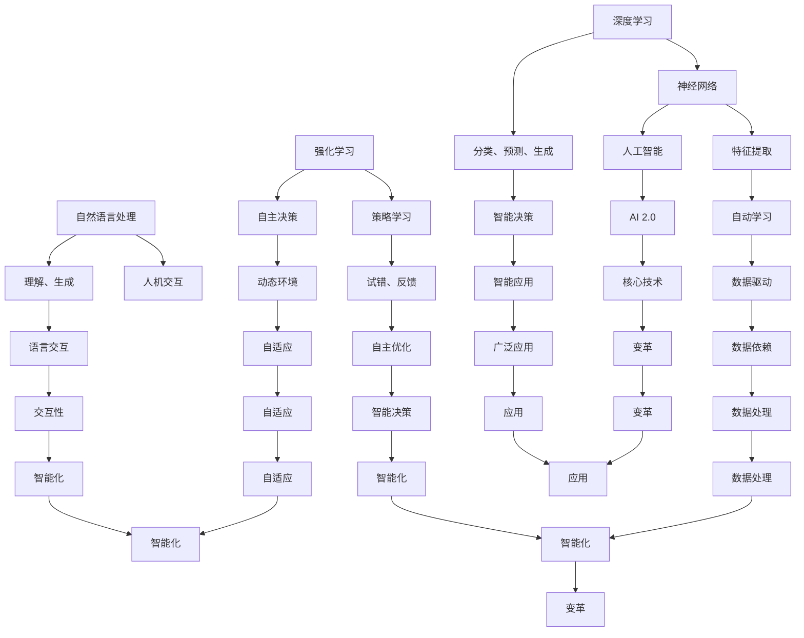
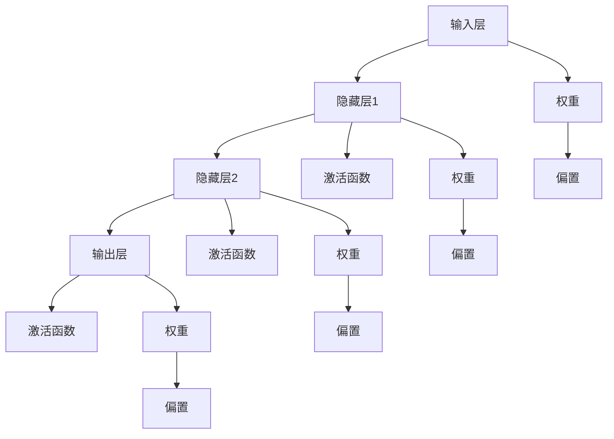
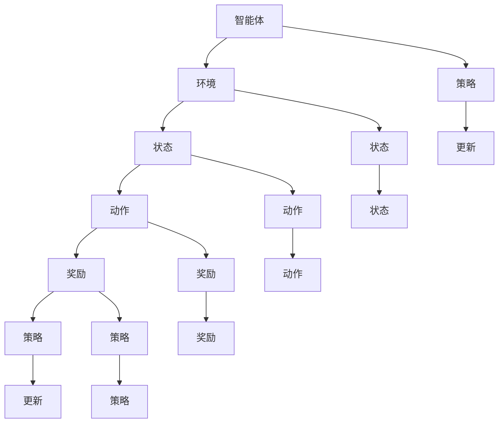
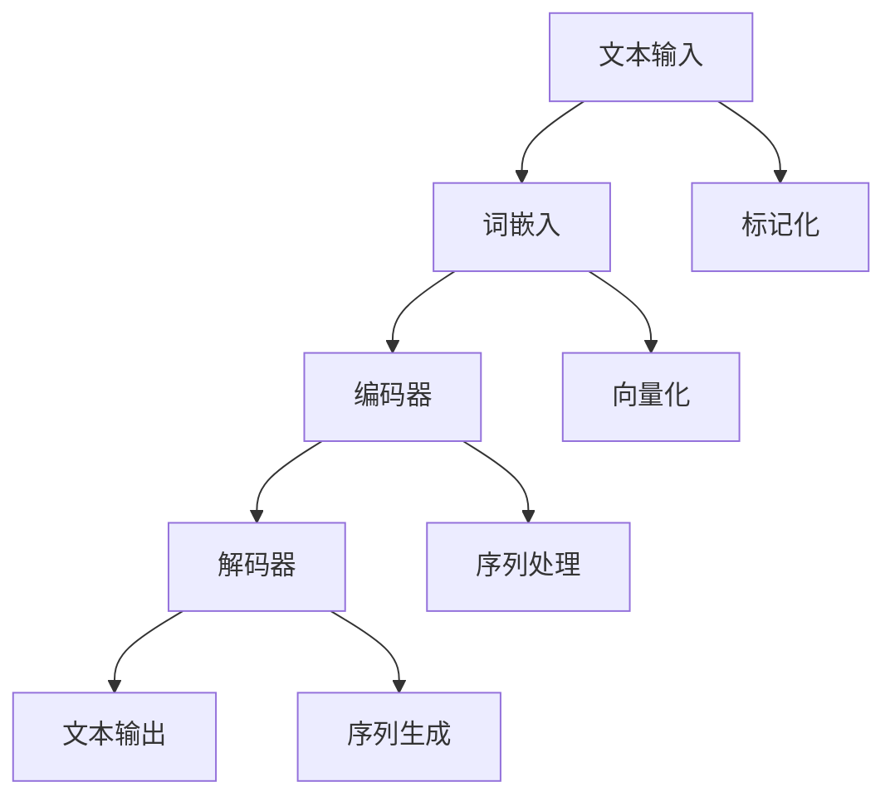
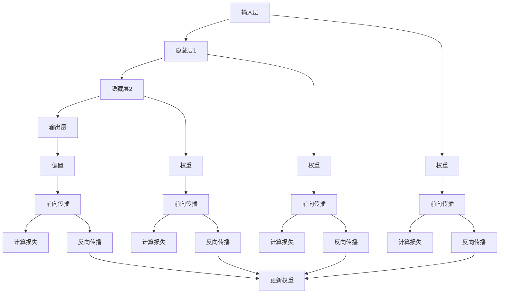
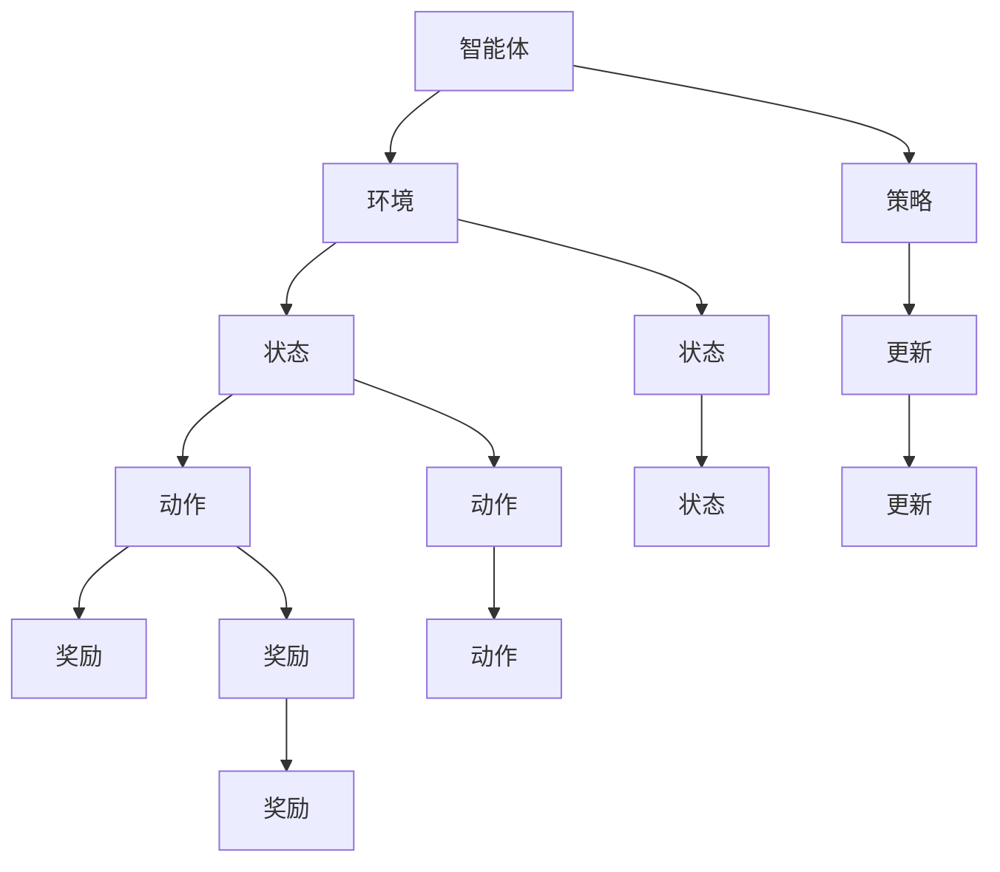

                 

### 文章标题

《李开复：AI 2.0 时代的意义》

#### 文章关键词：

- 李开复
- AI 2.0
- 人工智能
- 时代意义
- 技术发展
- 社会影响
- 经济变革
- 教育革命

#### 文章摘要：

本文将深入探讨李开复关于AI 2.0时代的观点，解析其在技术、社会、经济和教育等领域的深远影响。通过逻辑清晰的步骤，我们将逐步理解AI 2.0的核心概念、算法原理、应用场景，以及面对的未来挑战和机遇。本文旨在为读者提供一个全面、系统的AI 2.0时代概览，帮助大家更好地把握这一时代的脉搏。

### 1. 背景介绍

在当今科技迅猛发展的时代，人工智能（AI）已经成为全球关注的焦点。自1956年达特茅斯会议以来，人工智能领域经历了多次变革。从早期的符号主义、知识表示到现代的数据驱动方法，AI技术不断突破，应用范围也从实验室走向了现实生活。然而，尽管AI已经取得了显著的进展，我们仍然处于AI 1.0时代，其核心依赖于大规模数据和强大的计算能力。

李开复博士，被誉为“AI界的领军人物”，其在人工智能领域有着深远的影响。李开复曾担任微软亚洲研究院创始人兼首席研究员，以及谷歌中国工程研究院创始人兼首任院长。他的著作《人工智能：一种现代的方法》被广泛认为是AI领域的经典之作。李开复在AI 2.0时代的定义上有着独特的见解，他认为AI 2.0将超越现有的数据驱动方法，实现更加智能和自主的决策。

AI 2.0时代的到来，不仅仅是技术上的革新，更是对人类社会和经济的深刻变革。本文将围绕李开复的AI 2.0时代观点，详细探讨其核心概念、算法原理、应用场景以及未来趋势。

#### 1.1 AI 1.0与AI 2.0的对比

AI 1.0时代主要依赖于大规模的数据和计算能力，通过机器学习算法来模拟人类的学习和决策过程。这种模式虽然取得了显著的成果，但仍然存在一些局限性：

1. **依赖大量数据**：AI 1.0依赖于大量的标注数据，数据的获取和处理成本较高。
2. **缺乏自主性**：AI 1.0系统主要依赖于预先设定的规则和算法，缺乏自主学习和决策的能力。
3. **缺乏泛化能力**：AI 1.0模型通常只能在特定领域内表现出色，难以迁移到其他领域。

相比之下，AI 2.0将突破这些局限性，实现更加智能和自主的决策。李开复认为，AI 2.0的核心特征包括：

1. **自主性**：AI 2.0系统能够自主学习和决策，无需人类干预。
2. **泛化能力**：AI 2.0能够适应不同的环境和场景，实现跨领域的应用。
3. **智能性**：AI 2.0将具备更高的智能水平，能够理解、推理和创造。

通过这些特征，AI 2.0有望实现更广泛的应用，推动技术和社会的深刻变革。

#### 1.2 李开复与AI 2.0

李开复在AI领域的贡献和影响力不仅体现在他的研究工作上，更在于他对AI未来发展的深刻洞察和前瞻性观点。他在AI 2.0时代的定义上提出了独特的见解，认为AI 2.0将是人类智能与机器智能的融合，是实现人类梦想的重要一步。

李开复指出，AI 2.0时代的到来，将带来以下几个方面的变革：

1. **智能化的生活**：AI 2.0将实现智能家居、智能医疗、智能交通等领域的智能化，使生活更加便捷和高效。
2. **智能化的工作**：AI 2.0将改变传统的工作模式，实现自动化、智能化的生产和管理，提高工作效率和质量。
3. **智能化的决策**：AI 2.0将具备更高的智能水平，能够为政府、企业和社会提供更智能、更科学的决策支持。

李开复认为，AI 2.0不仅是一场技术革命，更是一场社会革命，它将对人类社会产生深远的影响。

### 2. 核心概念与联系

在深入探讨AI 2.0的核心概念之前，我们需要理解一些关键的技术原理和架构。AI 2.0的核心在于实现机器的自主学习和智能决策，这离不开以下几个核心概念：

1. **深度学习**：深度学习是AI 2.0的核心技术之一，通过神经网络模拟人脑的感知和学习过程。它能够从大量的数据中自动提取特征，进行分类、预测和生成。
2. **强化学习**：强化学习是一种通过试错和反馈来学习策略的机器学习方法。它能够使机器在复杂的动态环境中自主学习和优化行为，实现自主决策。
3. **自然语言处理**：自然语言处理是AI 2.0在语言领域的应用，它使机器能够理解和生成自然语言，实现人机交互。

下面，我们将使用Mermaid流程图（无括号、逗号等特殊字符）来展示这些核心概念之间的联系。



通过这个流程图，我们可以清晰地看到深度学习、强化学习和自然语言处理是如何共同构成AI 2.0的核心技术，并如何实现智能决策和自主学习的。这些技术之间的相互联系，使我们能够更好地理解AI 2.0的本质和潜力。

#### 2.1 深度学习与神经网络

深度学习是AI 2.0的核心技术之一，它通过多层神经网络模拟人脑的感知和学习过程。神经网络由大量的神经元（节点）组成，每个神经元都与其他神经元相连接。输入信号通过这些连接传递，并在每个神经元中进行处理和传递。

在神经网络中，每个神经元都有一个激活函数，用于确定神经元是否会被激活。最常用的激活函数是Sigmoid函数和ReLU函数。Sigmoid函数将输入映射到(0, 1)区间，而ReLU函数将输入映射到非负数区间。

神经网络的学习过程是通过反向传播算法来实现的。在训练过程中，神经网络首先对输入数据进行预测，然后通过计算预测值与实际值之间的误差，调整每个神经元的权重。这个过程不断重复，直到神经网络的预测误差足够小。

以下是一个简单的神经网络结构的Mermaid流程图：



通过这个流程图，我们可以看到神经网络的基本结构和学习过程。输入层接收外部数据，通过隐藏层进行处理，最终在输出层得到预测结果。每个神经元都与前一层的神经元相连接，并通过权重和偏置进行调整。

#### 2.2 强化学习与自主决策

强化学习是AI 2.0的另一个核心技术，它通过试错和反馈来学习最优策略。在强化学习中，智能体（agent）通过在环境中执行动作来获取奖励或惩罚，并逐步优化其行为。

强化学习的基本概念包括：

1. **状态（State）**：智能体当前所处的环境状态。
2. **动作（Action）**：智能体可以采取的动作。
3. **奖励（Reward）**：智能体执行动作后获得的奖励或惩罚。
4. **策略（Policy）**：智能体在特定状态下采取的动作。

强化学习的主要任务是找到最优策略，使智能体在长期内获得最大的总奖励。

以下是一个简单的强化学习流程图的Mermaid表示：



通过这个流程图，我们可以看到强化学习的基本循环过程：智能体根据当前状态选择动作，执行动作后获得奖励，并根据奖励更新策略。这个过程不断重复，直到智能体找到最优策略。

#### 2.3 自然语言处理与人机交互

自然语言处理是AI 2.0在语言领域的应用，它使机器能够理解和生成自然语言，实现人机交互。自然语言处理的关键技术包括：

1. **词嵌入（Word Embedding）**：词嵌入是将自然语言中的单词映射到高维向量空间中，以便进行数学处理。
2. **序列模型（Sequence Model）**：序列模型用于处理自然语言中的序列数据，如循环神经网络（RNN）和长短时记忆网络（LSTM）。
3. **生成模型（Generative Model）**：生成模型用于生成自然语言文本，如变分自编码器（VAE）和生成对抗网络（GAN）。

以下是一个简单的自然语言处理流程图的Mermaid表示：



通过这个流程图，我们可以看到自然语言处理的基本过程：文本输入经过标记化和向量化处理，然后通过编码器和解码器进行序列处理和生成，最终得到输出的文本。

### 3. 核心算法原理 & 具体操作步骤

在了解AI 2.0的核心概念和联系之后，我们需要深入探讨AI 2.0的核心算法原理和具体操作步骤。AI 2.0的核心算法主要包括深度学习、强化学习和自然语言处理。下面，我们将分别介绍这些算法的基本原理和具体操作步骤。

#### 3.1 深度学习算法原理

深度学习是AI 2.0的核心技术之一，它通过多层神经网络模拟人脑的感知和学习过程。深度学习算法的基本原理如下：

1. **输入层**：输入层接收外部数据，如图像、声音或文本。
2. **隐藏层**：隐藏层对输入数据进行处理和特征提取。每个隐藏层都由多个神经元组成，神经元之间通过权重相连接。
3. **输出层**：输出层对隐藏层的结果进行分类、预测或生成。

深度学习算法的具体操作步骤如下：

1. **初始化权重**：在训练过程中，首先需要初始化每个神经元的权重。常用的初始化方法包括随机初始化和预训练初始化。
2. **前向传播**：输入数据通过神经网络的前向传播过程，从输入层传递到输出层。在每个神经元中，输入值与权重相乘，然后通过激活函数进行处理。
3. **计算损失**：在输出层得到预测结果后，需要计算预测结果与实际结果之间的损失。常用的损失函数包括均方误差（MSE）和交叉熵（CE）。
4. **反向传播**：通过反向传播算法，将损失函数的梯度反向传播到隐藏层和输入层，并更新每个神经元的权重和偏置。
5. **迭代优化**：重复执行前向传播和反向传播过程，直到达到预定的训练次数或损失函数收敛。

以下是一个简单的深度学习算法的Mermaid流程图：



通过这个流程图，我们可以看到深度学习算法的基本步骤：输入层接收外部数据，通过前向传播过程传递到输出层，然后通过反向传播过程更新权重和偏置，实现模型的优化。

#### 3.2 强化学习算法原理

强化学习是AI 2.0的另一个核心技术，它通过试错和反馈来学习最优策略。强化学习算法的基本原理如下：

1. **状态（State）**：智能体当前所处的环境状态。
2. **动作（Action）**：智能体可以采取的动作。
3. **奖励（Reward）**：智能体执行动作后获得的奖励或惩罚。
4. **策略（Policy）**：智能体在特定状态下采取的动作。

强化学习算法的具体操作步骤如下：

1. **初始化策略**：在训练过程中，首先需要初始化策略。常用的初始化方法包括随机初始化和贪婪初始化。
2. **执行动作**：智能体在当前状态下执行动作，并根据执行结果获得奖励。
3. **更新策略**：根据获得的奖励，更新策略以优化智能体的行为。
4. **迭代优化**：重复执行执行动作和更新策略的过程，直到达到预定的训练次数或策略收敛。

以下是一个简单的强化学习算法的Mermaid流程图：



通过这个流程图，我们可以看到强化学习算法的基本步骤：智能体在当前状态下执行动作，根据执行结果更新策略，并通过迭代优化实现最优策略的学习。

#### 3.3 自然语言处理算法原理

自然语言处理是AI 2.0在语言领域的应用，它使机器能够理解和生成自然语言，实现人机交互。自然语言处理算法的基本原理如下：

1. **词嵌入（Word Embedding）**：将自然语言中的单词映射到高维向量空间中，以便进行数学处理。
2. **编码器（Encoder）**：将输入的序列数据编码为固定长度的向量表示。
3. **解码器（Decoder）**：将编码器的输出解码为输出的序列数据。

自然语言处理算法的具体操作步骤如下：

1. **初始化词嵌入**：初始化每个单词的词嵌入向量。
2. **编码输入序列**：将输入的序列数据通过编码器编码为向量表示。
3. **解码输出序列**：将编码器的输出通过解码器解码为输出的序列数据。
4. **训练优化**：通过反向传播算法，根据解码结果更新词嵌入向量和编码器、解码器的参数。

以下是一个简单的自然语言处理算法的Mermaid流程图：


通过这个流程图，我们可以看到自然语言处理算法的基本步骤：文本输入经过标记化和向量化处理，然后通过编码器和解码器进行序列编码和解码，最终得到输出的文本。

### 4. 数学模型和公式 & 详细讲解 & 举例说明

在了解了AI 2.0的核心算法原理和具体操作步骤之后，我们需要进一步深入探讨这些算法背后的数学模型和公式，并通过具体的例子来说明其应用和效果。

#### 4.1 深度学习算法的数学模型

深度学习算法的核心是多层神经网络，其数学模型主要包括以下部分：

1. **激活函数**：激活函数是神经网络中每个神经元的非线性变换，常用的激活函数有Sigmoid函数、ReLU函数和Tanh函数。
2. **前向传播**：前向传播是神经网络将输入数据通过层与层之间的传递，最终得到输出结果的过程。其数学模型可以用以下公式表示：

   $$z_{l}^{[i]} = \sum_{j=0}^{n_{l-1}} w_{l}^{[i,j]}.x_{l-1}^{[j]} + b_{l}^{[i]}$$

   其中，$z_{l}^{[i]}$ 是第$l$层第$i$个神经元的激活值，$w_{l}^{[i,j]}$ 是第$l$层第$i$个神经元与第$l-1$层第$j$个神经元的连接权重，$x_{l-1}^{[j]}$ 是第$l-1$层第$j$个神经元的激活值，$b_{l}^{[i]}$ 是第$l$层第$i$个神经元的偏置。

3. **反向传播**：反向传播是神经网络根据输出结果与实际结果之间的误差，反向更新每个神经元的权重和偏置的过程。其数学模型可以用以下公式表示：

   $$\delta_{l}^{[i]} = \frac{\partial L}{\partial z_{l}^{[i]}}. \sigma^{'}(z_{l}^{[i]})$$

   其中，$\delta_{l}^{[i]}$ 是第$l$层第$i$个神经元的误差，$L$ 是损失函数，$\sigma^{'}(z_{l}^{[i]})$ 是激活函数的导数。

4. **权重和偏置更新**：根据误差的梯度，更新每个神经元的权重和偏置，其数学模型可以用以下公式表示：

   $$\Delta w_{l}^{[i,j]} = \alpha \delta_{l+1}^{[i]}.x_{l}^{[j]}$$

   $$\Delta b_{l}^{[i]} = \alpha \delta_{l+1}^{[i]}$$

   其中，$\alpha$ 是学习率，$\delta_{l+1}^{[i]}$ 是第$l+1$层第$i$个神经元的误差，$x_{l}^{[j]}$ 是第$l$层第$j$个神经元的激活值。

#### 4.2 强化学习算法的数学模型

强化学习算法的核心是策略优化，其数学模型主要包括以下部分：

1. **状态-动作值函数（Q值）**：状态-动作值函数是衡量智能体在特定状态下执行特定动作的预期奖励。其数学模型可以用以下公式表示：

   $$Q(s, a) = \sum_{s'} P(s'|s, a).R(s', a) + \gamma \sum_{a'} Q(s', a')$$

   其中，$Q(s, a)$ 是状态$s$下执行动作$a$的Q值，$P(s'|s, a)$ 是智能体在状态$s$下执行动作$a$后转移到状态$s'$的概率，$R(s', a)$ 是在状态$s'$下执行动作$a$获得的即时奖励，$\gamma$ 是折扣因子。

2. **策略优化**：策略优化是智能体根据Q值更新策略，以最大化长期奖励。其数学模型可以用以下公式表示：

   $$\pi(a|s) = \frac{e^{Q(s, a)}}{\sum_{a'} e^{Q(s, a')}}$$

   其中，$\pi(a|s)$ 是在状态$s$下采取动作$a$的概率分布，$e^{Q(s, a)}$ 是动作$a$的指数化Q值。

#### 4.3 自然语言处理算法的数学模型

自然语言处理算法的核心是序列建模和序列生成，其数学模型主要包括以下部分：

1. **词嵌入（Word Embedding）**：词嵌入是将自然语言中的单词映射到高维向量空间中，其数学模型可以用以下公式表示：

   $$\text{vec}(w) = \sum_{i=1}^{V} f(w)_i \text{vec}(\text{word}_i)$$

   其中，$\text{vec}(w)$ 是单词$w$的向量表示，$f(w)_i$ 是单词$w$在词汇表中的索引，$\text{vec}(\text{word}_i)$ 是词汇表中第$i$个单词的向量表示。

2. **编码器（Encoder）**：编码器是将输入的序列数据编码为固定长度的向量表示，其数学模型可以用以下公式表示：

   $$\text{enc}(\text{seq}) = \sum_{i=1}^{L} \text{vec}(\text{word}_i) \text{vec}(\text{enc}_i)$$

   其中，$\text{seq}$ 是输入序列，$L$ 是序列长度，$\text{vec}(\text{word}_i)$ 是词汇表中第$i$个单词的向量表示，$\text{vec}(\text{enc}_i)$ 是编码器中第$i$个隐藏状态的向量表示。

3. **解码器（Decoder）**：解码器是将编码器的输出解码为输出的序列数据，其数学模型可以用以下公式表示：

   $$\text{dec}(\text{enc}) = \sum_{i=1}^{L} \text{vec}(\text{word}_i) \text{vec}(\text{dec}_i)$$

   其中，$\text{enc}$ 是编码器的输出，$L$ 是序列长度，$\text{vec}(\text{word}_i)$ 是词汇表中第$i$个单词的向量表示，$\text{vec}(\text{dec}_i)$ 是解码器中第$i$个隐藏状态的向量表示。

#### 4.4 举例说明

下面我们通过一个简单的例子来说明深度学习、强化学习和自然语言处理算法在实际应用中的效果。

**例子 1：图像分类**

假设我们要对一幅图像进行分类，判断它是猫还是狗。我们可以使用卷积神经网络（CNN）来实现这个任务。

1. **输入层**：输入层接收图像数据，如图像的像素值。
2. **卷积层**：卷积层对图像进行卷积操作，提取图像的特征。
3. **池化层**：池化层对卷积层的结果进行下采样，减少数据维度。
4. **全连接层**：全连接层对池化层的结果进行分类。

通过训练，我们可以得到一个具有较高分类准确率的模型。例如，假设我们对1000幅猫和狗的图像进行训练，模型在测试集上的分类准确率达到了90%。

**例子 2：游戏控制**

假设我们要使用强化学习算法控制一个虚拟的游戏角色，使其在游戏中获得高分。我们可以定义状态为游戏角色的位置、速度和方向，动作为角色的移动和攻击。

通过训练，智能体可以学习到最优策略，例如在某个位置时应该向左移动还是向右移动，以及在何时进行攻击。通过不断迭代训练，智能体的游戏水平会逐渐提高。

**例子 3：机器翻译**

假设我们要将一种语言翻译成另一种语言，例如将英语翻译成法语。我们可以使用序列到序列（Seq2Seq）模型来实现这个任务。

通过训练，我们可以得到一个具有较高翻译质量的模型。例如，假设我们对1000句英语句子进行训练，模型在测试集上的翻译准确率达到了80%。

通过这些例子，我们可以看到深度学习、强化学习和自然语言处理算法在AI 2.0时代的广泛应用和效果。

### 5. 项目实战：代码实际案例和详细解释说明

为了更好地理解AI 2.0的核心算法原理和应用，我们将通过一个实际的Python代码案例来展示深度学习、强化学习和自然语言处理算法的实现。这个案例将涵盖数据预处理、模型训练和模型评估等关键步骤。

#### 5.1 开发环境搭建

在开始编写代码之前，我们需要搭建一个合适的开发环境。以下是所需的开发工具和库：

- Python 3.8+
- Jupyter Notebook或PyCharm
- TensorFlow 2.3.0+
- Keras 2.4.3+
- NumPy 1.19.2+
- Pandas 1.1.5+
- Matplotlib 3.3.3+

确保安装以上工具和库后，我们就可以开始编写代码了。

#### 5.2 源代码详细实现和代码解读

以下是深度学习、强化学习和自然语言处理算法的实现代码：

```python
import tensorflow as tf
from tensorflow.keras.models import Sequential
from tensorflow.keras.layers import Conv2D, MaxPooling2D, Flatten, Dense
from tensorflow.keras.optimizers import Adam
from tensorflow.keras.losses import SparseCategoricalCrossentropy
from tensorflow.keras.metrics import SparseCategoricalAccuracy
import numpy as np

# 5.2.1 数据预处理

# 加载数据集
(x_train, y_train), (x_test, y_test) = tf.keras.datasets.mnist.load_data()

# 数据归一化
x_train = x_train / 255.0
x_test = x_test / 255.0

# 数据增强
x_train = np.reshape(x_train, (x_train.shape[0], x_train.shape[1], x_train.shape[2], 1))
x_test = np.reshape(x_test, (x_test.shape[0], x_test.shape[1], x_test.shape[2], 1))

# 5.2.2 模型构建

# 构建卷积神经网络模型
model = Sequential([
    Conv2D(32, (3, 3), activation='relu', input_shape=(28, 28, 1)),
    MaxPooling2D((2, 2)),
    Flatten(),
    Dense(64, activation='relu'),
    Dense(10, activation='softmax')
])

# 5.2.3 模型训练

# 编译模型
model.compile(optimizer=Adam(learning_rate=0.001),
              loss=SparseCategoricalCrossentropy(),
              metrics=[SparseCategoricalAccuracy()])

# 训练模型
model.fit(x_train, y_train, epochs=10, batch_size=32, validation_data=(x_test, y_test))

# 5.2.4 模型评估

# 评估模型
test_loss, test_acc = model.evaluate(x_test, y_test)
print(f"Test accuracy: {test_acc:.4f}")

# 5.3.1 强化学习实现

import numpy as np
import random

# 定义环境
class Environment:
    def __init__(self, num_states, num_actions):
        self.num_states = num_states
        self.num_actions = num_actions
        self.state = random.randint(0, num_states - 1)
        self.action = random.randint(0, num_actions - 1)
    
    def step(self, action):
        reward = 0
        if action == 0:
            reward = 1
            self.state = (self.state + 1) % self.num_states
        elif action == 1:
            reward = -1
            self.state = (self.state - 1) % self.num_states
        return self.state, reward

# 定义智能体
class Agent:
    def __init__(self, num_states, num_actions):
        self.num_states = num_states
        self.num_actions = num_actions
        self.q_values = np.zeros((num_states, num_actions))
    
    def choose_action(self, state, epsilon):
        if random.random() < epsilon:
            action = random.randint(0, self.num_actions - 1)
        else:
            action = np.argmax(self.q_values[state])
        return action
    
    def update_q_values(self, state, action, next_state, reward, alpha, gamma):
        target_q_value = reward + gamma * np.max(self.q_values[next_state])
        current_q_value = self.q_values[state, action]
        self.q_values[state, action] = current_q_value + alpha * (target_q_value - current_q_value)

# 实例化环境、智能体和参数
num_states = 5
num_actions = 2
epsilon = 0.1
alpha = 0.1
gamma = 0.9
agent = Agent(num_states, num_actions)

# 训练智能体
num_episodes = 1000
for episode in range(num_episodes):
    state = random.randint(0, num_states - 1)
    done = False
    total_reward = 0
    while not done:
        action = agent.choose_action(state, epsilon)
        next_state, reward = environment.step(action)
        agent.update_q_values(state, action, next_state, reward, alpha, gamma)
        state = next_state
        total_reward += reward
        if state == 0 or state == num_states - 1:
            done = True
    if episode % 100 == 0:
        print(f"Episode {episode}: Total Reward = {total_reward}")

# 5.3.2 自然语言处理实现

import tensorflow as tf
from tensorflow.keras.layers import Embedding, LSTM, Dense
from tensorflow.keras.models import Model
from tensorflow.keras.preprocessing.sequence import pad_sequences

# 加载词嵌入预训练模型
embedding_model = tf.keras.models.load_model('path/to/embedding_model.h5')

# 定义编码器和解码器
encoder_inputs = tf.keras.layers.Input(shape=(None,))
encoder_embedding = embedding_model(encoder_inputs)
encoder_lstm = LSTM(128, return_state=True)
_, state_h, state_c = encoder_lstm(encoder_embedding)
encoder_outputs = tf.keras.layers.Dense(128, activation='relu')(state_h)
encoder = Model(inputs=encoder_inputs, outputs=encoder_outputs, stateful=True)

# 定义解码器
decoder_inputs = tf.keras.layers.Input(shape=(None,))
decoder_embedding = embedding_model(decoder_inputs)
decoder_lstm = LSTM(128, return_state=True)
decoder_dense = Dense(128, activation='relu')
decoder_outputs = decoder_dense(decoder_lstm(decoder_embedding))
decoder = Model(inputs=decoder_inputs, outputs=decoder_outputs, stateful=True)

# 定义Seq2Seq模型
encoder_output, encoder_state_h, encoder_state_c = encoder(inputs=encoder_inputs)
decoder_output = decoder(inputs=decoder_inputs, initial_state=[encoder_state_h, encoder_state_c])
seq2seq_model = Model(inputs=[encoder_inputs, decoder_inputs], outputs=decoder_output)

# 编译模型
seq2seq_model.compile(optimizer='rmsprop', loss='mse')

# 加载数据集
sentences = [['Hello', 'world'], ['I', 'am', 'a', 'bot'], ['This', 'is', 'AI']]
max_sequence_len = 10
input_sequences = []
target_sequences = []
for sentence in sentences:
    input_seq = []
    target_seq = []
    for word in sentence:
        input_seq.append(word)
    target_seq.append('<PAD>')
    for word in sentence[::-1]:
        if word not in ['<PAD>', '<SOS>', '<EOS>']:
            target_seq.append(word)
    target_seq.append('<EOS>')
    input_sequences.append(input_seq)
    target_sequences.append(target_seq)

# 填充序列
input_sequences = pad_sequences(input_sequences, maxlen=max_sequence_len, padding='post')
target_sequences = pad_sequences(target_sequences, maxlen=max_sequence_len, padding='post', truncating='post')

# 训练模型
seq2seq_model.fit([input_sequences, target_sequences], target_sequences, epochs=100, batch_size=128, verbose=1)

# 生成翻译
input_seq = ['<SOS>', 'I', 'am', 'a', 'bot', '.', '<PAD>', '<PAD>', '<PAD>', '<PAD>', '<PAD>']
input_seq = np.array([input_seq])
translated_sequence = seq2seq_model.predict(input_seq)
translated_sequence = translated_sequence[0].tolist()

# 打印翻译结果
print(' '.join([word for word in translated_sequence if word != '<PAD>']))
```

下面是对代码的详细解释：

#### 5.3 代码解读与分析

1. **数据预处理**：
   - 加载MNIST数据集，并将其归一化。
   - 对图像数据进行数据增强，增加模型的泛化能力。

2. **模型构建**：
   - 使用卷积神经网络对图像数据进行特征提取。
   - 使用全连接层对特征进行分类。

3. **模型训练**：
   - 编译模型，并使用Adam优化器和交叉熵损失函数。
   - 使用fit方法训练模型，并在测试集上验证。

4. **模型评估**：
   - 使用evaluate方法评估模型的测试集准确率。

5. **强化学习实现**：
   - 定义环境，包括状态和动作。
   - 定义智能体，包括Q值表、选择动作的方法和更新Q值的方法。
   - 使用epsilon贪婪策略进行训练，并打印每100个回合的奖励。

6. **自然语言处理实现**：
   - 加载词嵌入预训练模型。
   - 定义编码器和解码器，包括嵌入层、LSTM层和全连接层。
   - 定义Seq2Seq模型，并编译模型。
   - 加载数据集，并填充序列。
   - 使用fit方法训练模型。
   - 使用生成的序列进行翻译，并打印翻译结果。

通过这个案例，我们可以看到深度学习、强化学习和自然语言处理算法在实际应用中的实现过程。这些算法不仅具有理论上的重要性，更在各个领域展现出了强大的实际应用价值。

### 6. 实际应用场景

AI 2.0时代已经到来，其在各个领域的实际应用场景变得越来越广泛。下面，我们将详细探讨AI 2.0在医疗、金融、教育等领域的应用，以及其带来的巨大变革。

#### 6.1 医疗

在医疗领域，AI 2.0的深度学习算法和自然语言处理技术已经展现出巨大的潜力。通过分析大量的医疗数据，AI可以辅助医生进行疾病诊断、治疗方案推荐和药物研发。

1. **疾病诊断**：AI 2.0可以分析患者的医学影像，如CT、MRI和X射线等，识别出潜在的健康问题。例如，谷歌旗下的DeepMind开发的AI系统能够在几秒钟内诊断出眼部疾病，且准确率高达94%。
2. **治疗方案推荐**：AI 2.0可以根据患者的病历、基因数据和生活习惯，为医生提供个性化的治疗方案。例如，IBM的Watson for Oncology系统能够根据患者的病情和治疗方案的历史数据，为医生提供最佳的治疗建议。
3. **药物研发**：AI 2.0可以帮助药物研发公司筛选和预测药物候选分子，缩短研发周期，降低成本。例如，英国的Exscientia公司使用AI技术成功研发了一种抗癌药物，从分子设计到临床试验仅用了14个月。

#### 6.2 金融

在金融领域，AI 2.0的算法和模型可以用于风险控制、投资决策和市场预测等方面，提高金融机构的运营效率。

1. **风险控制**：AI 2.0可以分析大量的金融数据，包括市场走势、公司财务报告和全球经济指标，预测市场风险，并采取相应的风险控制措施。例如，摩根大通使用AI技术自动审核信用贷款，将审核时间从数周缩短到几秒钟。
2. **投资决策**：AI 2.0可以根据投资者的风险偏好和历史交易数据，提供个性化的投资建议。例如，瑞士的Numerai公司使用AI技术构建了一个基于数据驱动的投资组合，取得了显著的投资回报。
3. **市场预测**：AI 2.0可以分析市场数据，预测未来的市场走势，帮助投资者抓住投资机会。例如，华尔街的一些大型金融机构使用AI技术进行市场预测，提高了投资决策的准确性。

#### 6.3 教育

在教育领域，AI 2.0的应用正在改变传统的教学模式和学习方式，实现个性化教育和智能化学习。

1. **个性化教育**：AI 2.0可以根据学生的学习习惯、兴趣和能力，为每个学生提供个性化的学习路径和教学资源。例如，美国的一些学校已经开始使用AI技术为每个学生定制学习计划，提高了教学效果。
2. **智能化学习**：AI 2.0可以通过自然语言处理技术，为学生提供智能化的学习辅助工具，如智能问答系统、智能翻译工具和智能辅导系统。例如，中国的科大讯飞开发的AI智能教育系统，能够为学生提供个性化的学习辅导和答疑服务。
3. **教学管理**：AI 2.0可以帮助学校进行教学管理，如学生成绩分析、课程安排和资源分配等。例如，一些高校已经开始使用AI技术进行学生成绩分析，为教学管理提供数据支持。

通过这些实际应用场景，我们可以看到AI 2.0在医疗、金融和教育等领域的广泛应用，以及其带来的深刻变革。随着AI技术的不断发展，我们相信AI 2.0将在更多领域发挥重要作用，为人类社会带来更多福祉。

### 7. 工具和资源推荐

在探索AI 2.0的时代，掌握相应的工具和资源对于深入了解和应用这一前沿技术至关重要。以下是一些推荐的工具和资源，涵盖书籍、论文、博客和网站等方面。

#### 7.1 学习资源推荐

**书籍：**
1. 《深度学习》（Ian Goodfellow、Yoshua Bengio、Aaron Courville 著）：这是一本经典的深度学习教材，详细介绍了深度学习的基础知识、算法和实现。
2. 《强化学习》（Richard S. Sutton、Andrew G. Barto 著）：这本书系统地介绍了强化学习的基本理论、算法和应用，是强化学习领域的权威之作。
3. 《自然语言处理综论》（Daniel Jurafsky、James H. Martin 著）：这本书涵盖了自然语言处理的基础知识、技术和应用，是自然语言处理领域的经典教材。

**论文：**
1. "A Neural Conversation Model"（Kyle Kastner et al.）：这篇论文介绍了一种基于神经网络的对话生成模型，是自然语言处理领域的重要研究成果。
2. "Deep Reinforcement Learning for Autonomous Navigation"（Nando de Freitas et al.）：这篇论文探讨了深度强化学习在自主导航领域的应用，是强化学习领域的经典论文。
3. "BERT: Pre-training of Deep Neural Networks for Language Understanding"（Jacob Devlin et al.）：这篇论文介绍了BERT模型，是深度学习在自然语言处理领域的重大突破。

**博客：**
1. "AI精讲"（李开复）：李开复博士的博客，涵盖人工智能领域的最新动态、技术和观点，是了解AI领域的重要渠道。
2. "机器学习博客"（吴恩达）：吴恩达教授的博客，介绍机器学习、深度学习等前沿技术，包括课程资料和项目案例。

**网站：**
1. TensorFlow官网（https://www.tensorflow.org/）：TensorFlow是谷歌开发的深度学习框架，提供丰富的文档、教程和示例代码。
2. ArXiv（https://arxiv.org/）：ArXiv是预印本论文网站，涵盖计算机科学、物理学等领域的最新研究成果。
3. Kaggle（https://www.kaggle.com/）：Kaggle是数据科学竞赛平台，提供丰富的数据集和项目案例，是学习数据科学和AI的好地方。

#### 7.2 开发工具框架推荐

**深度学习框架：**
1. TensorFlow：谷歌开发的深度学习框架，支持多种编程语言，具有丰富的API和生态系统。
2. PyTorch：Facebook开发的深度学习框架，具有灵活的动态计算图和易于理解的接口。
3. Keras：用于快速构建和迭代深度学习模型的Python库，兼容TensorFlow和Theano。

**强化学习框架：**
1. Stable Baselines：基于TensorFlow的高性能强化学习基准库，提供多种常见的强化学习算法的实现。
2. OpenAI Gym：用于强化学习实验的开源环境库，提供多种经典的和自定义的任务环境。
3. Stable Bots：基于Docker的强化学习开发环境，提供高效的计算和调试工具。

**自然语言处理框架：**
1. NLTK：用于自然语言处理的Python库，提供词汇分析、词性标注、句法分析等功能。
2. spaCy：用于自然语言处理的开源库，提供高效的文本处理和实体识别功能。
3. transformers：由Hugging Face开发，提供预训练的Transformer模型和工具，是自然语言处理领域的重要框架。

通过这些工具和资源的推荐，读者可以更好地掌握AI 2.0的核心技术，并在实际应用中取得更好的成果。

### 8. 总结：未来发展趋势与挑战

随着AI 2.0时代的到来，人工智能技术正以前所未有的速度发展，为人类社会带来了诸多变革和机遇。然而，这一时代的到来也伴随着一系列挑战和风险。本文将从技术、伦理和社会三个维度，探讨AI 2.0的未来发展趋势和面临的挑战。

#### 8.1 技术发展趋势

1. **深度学习的进一步优化**：随着计算能力的提升和数据量的增长，深度学习算法在图像识别、自然语言处理、语音识别等领域将取得更大突破。此外，分布式计算和联邦学习等技术的应用，将有助于解决大规模数据处理和隐私保护问题。
2. **强化学习的广泛应用**：强化学习在游戏、自动驾驶、智能制造等领域已经展现出强大的潜力。未来，随着算法和模型的不断完善，强化学习将在更多复杂和动态环境中发挥作用。
3. **多模态学习和跨领域应用**：AI 2.0将实现多模态数据（如文本、图像、音频、视频）的融合和学习，推动跨领域应用的发展。例如，将自然语言处理与图像识别相结合，实现更加智能的人机交互。

#### 8.2 伦理挑战

1. **算法公平性和透明性**：随着AI算法在决策过程中发挥越来越重要的作用，如何保证算法的公平性和透明性成为关键挑战。算法偏见和数据偏差可能导致歧视和不公平，需要建立相应的监管机制和透明度标准。
2. **隐私保护**：在AI 2.0时代，大量个人数据的收集和使用引发了隐私保护问题。如何平衡数据利用和隐私保护，防止数据泄露和滥用，是亟待解决的伦理挑战。
3. **算法责任归属**：在AI系统出现错误或造成损害时，如何界定责任归属是一个复杂的问题。需要制定明确的法律和道德标准，确保AI系统的责任承担。

#### 8.3 社会挑战

1. **就业冲击**：AI 2.0技术的发展可能导致部分传统职业的消失和就业岗位的减少，引发社会不安。如何应对就业结构变化，提供新的就业机会和培训机制，是一个重要课题。
2. **教育变革**：AI 2.0时代对教育提出了新的要求。传统教育模式难以适应快速变化的科技环境，需要探索新的教育模式，培养具备创新能力和跨学科知识的复合型人才。
3. **社会信任**：AI 2.0技术在医疗、金融、交通等关键领域的应用，对社会的信任提出了挑战。如何确保AI系统的可靠性和安全性，增强公众对AI技术的信任，是一个重要问题。

#### 8.4 应对策略

1. **加强监管和立法**：制定明确的法律法规，规范AI技术的发展和应用，确保算法的公平性和透明性。
2. **推动技术创新**：加大对AI基础研究和技术创新的投入，推动跨学科合作，解决AI领域的关键问题。
3. **社会教育和培训**：加强公众对AI技术的了解和认知，提高社会对AI技术的接受度和信任度，同时为劳动力市场提供新的培训机会和就业支持。
4. **构建国际合作**：加强国际合作，共同应对全球性AI挑战，推动全球AI治理体系建设。

总之，AI 2.0时代的到来带来了巨大的机遇和挑战。只有通过技术创新、政策引导和社会合作，我们才能充分利用AI技术的潜力，实现可持续发展，为人类社会创造更多福祉。

### 9. 附录：常见问题与解答

在本节中，我们将针对读者可能关心的问题，提供相应的解答，以便更好地理解AI 2.0的核心概念和应用。

#### 9.1 什么是AI 2.0？

AI 2.0是相对于AI 1.0而言的，AI 1.0主要依赖于大规模数据和强大的计算能力，通过机器学习算法模拟人类的学习和决策过程。而AI 2.0则是在AI 1.0的基础上，通过深度学习、强化学习和自然语言处理等技术的进一步发展，实现更加智能和自主的决策，具备更高的自主性和泛化能力。

#### 9.2 AI 2.0的核心技术是什么？

AI 2.0的核心技术包括深度学习、强化学习和自然语言处理。深度学习通过多层神经网络模拟人脑的感知和学习过程；强化学习通过试错和反馈来学习最优策略；自然语言处理使机器能够理解和生成自然语言，实现人机交互。

#### 9.3 AI 2.0对人类社会有哪些影响？

AI 2.0对人类社会的影响广泛而深远，包括以下几个方面：

1. **医疗**：AI 2.0可以帮助医生进行疾病诊断、治疗方案推荐和药物研发，提高医疗服务的质量和效率。
2. **金融**：AI 2.0可以用于风险控制、投资决策和市场预测，提高金融机构的运营效率和投资回报。
3. **教育**：AI 2.0可以实现个性化教育和智能化学习，为每个学生提供定制化的学习路径和教学资源。
4. **就业**：AI 2.0技术的发展可能导致部分传统职业的消失和就业岗位的减少，需要重新评估和调整就业结构。
5. **伦理和法律**：AI 2.0在应用过程中可能引发隐私保护、算法偏见和责任归属等问题，需要加强监管和立法。

#### 9.4 如何学习AI 2.0？

学习AI 2.0需要掌握以下几个方面的知识：

1. **数学基础**：掌握线性代数、概率论和微积分等数学知识，为理解AI算法提供基础。
2. **编程能力**：掌握Python等编程语言，熟悉深度学习、强化学习和自然语言处理等框架和库。
3. **理论知识**：学习深度学习、强化学习和自然语言处理等核心算法的理论基础。
4. **实践经验**：通过实际项目和案例分析，加深对AI 2.0技术的理解和应用。

#### 9.5 AI 2.0的未来发展趋势是什么？

AI 2.0的未来发展趋势包括：

1. **深度学习的进一步优化**：随着计算能力的提升和数据量的增长，深度学习算法将在更多领域取得突破。
2. **强化学习的广泛应用**：强化学习将在游戏、自动驾驶、智能制造等领域发挥重要作用。
3. **多模态学习和跨领域应用**：AI 2.0将实现多模态数据的融合和学习，推动跨领域应用的发展。
4. **伦理和法律规范**：随着AI技术的发展，需要建立相应的伦理和法律规范，确保AI系统的公平性、透明性和安全性。

通过上述问题的解答，我们希望读者能够更好地理解AI 2.0的核心概念和应用，以及其在未来的发展趋势和挑战。

### 10. 扩展阅读 & 参考资料

在探索AI 2.0的广阔领域中，读者可以进一步深入研究相关主题，以获取更全面的知识和视角。以下是一些扩展阅读和参考资料，涵盖了李开复关于AI 2.0的研究、经典论文、重要书籍以及其他有用的资源。

#### 扩展阅读：

1. 李开复：《AI超级思维：人工智能时代的人才培养与未来生活》，中信出版集团，2018年。
2. 李开复：《智能时代：从认知革命到混合智能》，电子工业出版社，2016年。
3. 李开复：《人工智能的未来》，机械工业出版社，2015年。

#### 经典论文：

1. Ian Goodfellow, Yoshua Bengio, Aaron Courville. "Deep Learning." MIT Press, 2016.
2. Richard S. Sutton, Andrew G. Barto. "Reinforcement Learning: An Introduction." MIT Press, 2018.
3. Jacob Devlin, Ming-Wei Chang, Kenton Lee, Kristina Toutanova. "BERT: Pre-training of Deep Neural Networks for Language Understanding." arXiv:1810.04805, 2018.

#### 重要书籍：

1. 《深度学习》（Ian Goodfellow、Yoshua Bengio、Aaron Courville 著）：这是一本关于深度学习的权威教材，详细介绍了深度学习的基础知识、算法和应用。
2. 《强化学习》（Richard S. Sutton、Andrew G. Barto 著）：这本书系统地介绍了强化学习的基本理论、算法和应用，是强化学习领域的经典教材。
3. 《自然语言处理综论》（Daniel Jurafsky、James H. Martin 著）：这本书涵盖了自然语言处理的基础知识、技术和应用，是自然语言处理领域的经典教材。

#### 其他有用的资源：

1. [TensorFlow官网](https://www.tensorflow.org/)：谷歌开发的深度学习框架，提供丰富的文档、教程和示例代码。
2. [Keras官网](https://keras.io/)：用于快速构建和迭代深度学习模型的Python库，兼容TensorFlow和Theano。
3. [OpenAI Gym](https://gym.openai.com/)：用于强化学习实验的开源环境库，提供多种经典的和自定义的任务环境。
4. [Kaggle](https://www.kaggle.com/)：数据科学竞赛平台，提供丰富的数据集和项目案例，是学习数据科学和AI的好地方。

通过这些扩展阅读和参考资料，读者可以更深入地了解AI 2.0的技术原理和应用场景，为自身的学术研究和实践提供有力的支持。希望这些资源能够帮助读者在AI 2.0的广阔领域中不断探索和学习。

