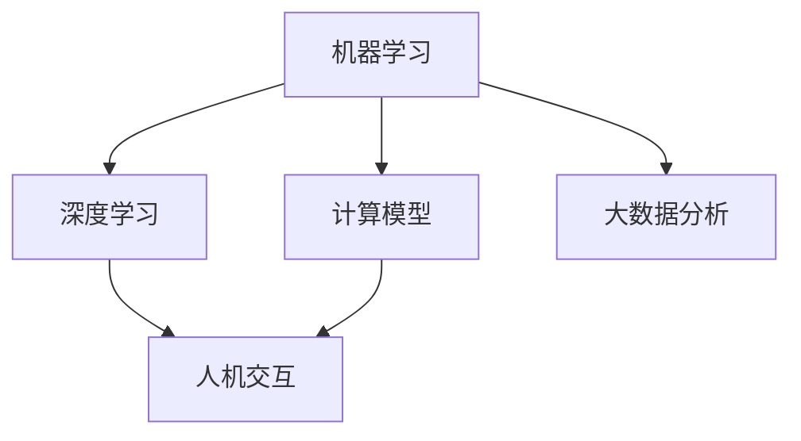
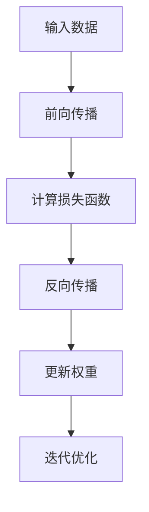
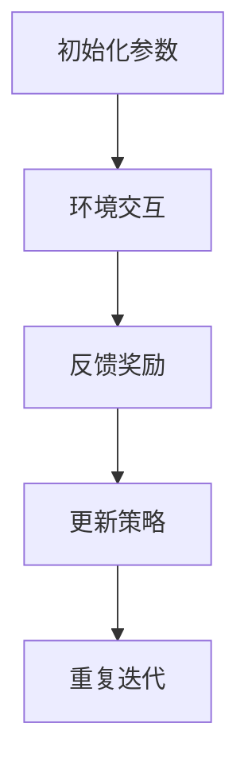
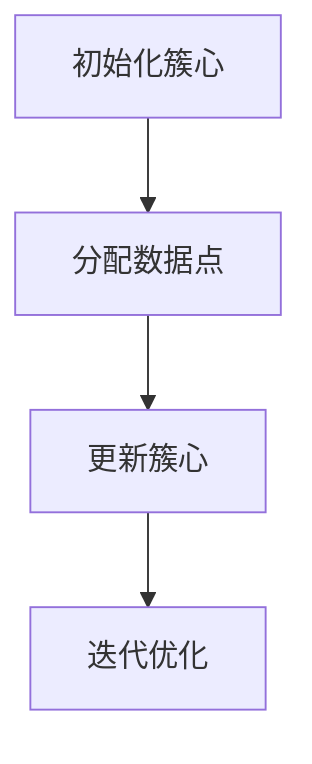

                 

### 1. 背景介绍

《李开复：AI 2.0 时代的挑战》这篇文章源自知名人工智能专家李开复的演讲和著作，旨在探讨人工智能（AI）2.0时代所带来的机遇与挑战。李开复作为世界顶级人工智能领域的权威学者，其观点具有极高的参考价值。

随着人工智能技术的快速发展，AI 2.0时代的到来似乎已经不可避免。AI 2.0不仅仅是算法和算力的升级，更涉及到计算模型、数据处理方式、人机交互等多方面的变革。这一时代的到来，将会深刻影响社会的各个层面，包括经济、教育、医疗、法律等。

然而，AI 2.0时代也带来了诸多挑战。首先，技术的快速发展可能导致人才的短缺，尤其是在高端技术人才方面。其次，AI的应用可能引发伦理、法律、隐私等问题。此外，AI在带来便利的同时，也可能导致一些传统职业的消失，从而引发社会的不稳定。

本文将从以下几个方面对AI 2.0时代的挑战进行深入探讨：

1. 核心概念与联系
2. 核心算法原理 & 具体操作步骤
3. 数学模型和公式 & 详细讲解 & 举例说明
4. 项目实战：代码实际案例和详细解释说明
5. 实际应用场景
6. 工具和资源推荐
7. 总结：未来发展趋势与挑战

希望通过本文，读者能够对AI 2.0时代的挑战有更深入的理解，为未来做好准备。

---

### 2. 核心概念与联系

在探讨AI 2.0时代的挑战之前，我们需要先了解一些核心概念。以下是AI 2.0时代中一些重要的概念及其相互联系：

#### 2.1 机器学习（Machine Learning）

机器学习是AI的核心技术之一。它指的是通过算法，从数据中学习并提取规律，以实现某种特定任务的能力。机器学习可以分为监督学习、无监督学习和强化学习。其中，监督学习是当前应用最广泛的一种方法。

#### 2.2 深度学习（Deep Learning）

深度学习是机器学习的一个分支，主要利用多层神经网络来模拟人脑的决策过程。深度学习在图像识别、自然语言处理等领域取得了显著的成果。

#### 2.3 计算模型（Computational Model）

计算模型是人工智能的理论基础。它描述了如何通过计算来模拟人类思维的过程。常见的计算模型包括符号主义模型、连接主义模型和统计模型。

#### 2.4 大数据分析（Big Data Analysis）

大数据分析是指利用大数据技术，对海量数据进行处理和分析，以发现其中的规律和模式。大数据分析在商业决策、医疗诊断等领域具有广泛的应用。

#### 2.5 人机交互（Human-Computer Interaction）

人机交互是AI 2.0时代的一个重要研究方向。它关注如何设计出更加自然、高效的人机交互方式，以提升用户体验。

以上概念之间存在着紧密的联系。例如，机器学习和深度学习需要大数据分析来提供训练数据，而计算模型为人机交互提供了理论支持。通过理解这些核心概念及其相互联系，我们可以更好地把握AI 2.0时代的挑战。


#### 2.6 Mermaid 流程图（Mermaid Flowchart）

以下是一个关于AI 2.0核心概念的Mermaid流程图，展示了这些概念之间的相互联系。



通过以上流程图，我们可以更加清晰地看到AI 2.0时代的核心概念及其相互关系。

---

在接下来的章节中，我们将深入探讨AI 2.0时代的核心算法原理、具体操作步骤，以及相关的数学模型和公式。通过这些内容，我们将为读者提供一个全面、系统的认识，帮助大家更好地应对AI 2.0时代的挑战。请保持关注。

---

### 3. 核心算法原理 & 具体操作步骤

在AI 2.0时代，核心算法原理的突破是推动技术进步的关键。以下将详细介绍几个关键算法的原理及其操作步骤。

#### 3.1 深度学习算法

深度学习是AI 2.0时代最引人注目的技术之一。它基于多层神经网络，通过非线性变换逐步提取数据中的特征。以下是深度学习算法的基本原理和操作步骤：

**原理：**

- 神经网络由多个神经元（节点）组成，每个神经元都与其他神经元相连。
- 输入数据通过输入层进入网络，经过隐藏层处理，最终由输出层得到预测结果。
- 每个神经元之间的连接都有权重，通过反向传播算法调整权重，使网络输出更接近真实值。

**操作步骤：**

1. **初始化参数：** 设置网络的初始参数，包括输入层、隐藏层和输出层的节点数量，以及各个节点之间的连接权重。
2. **前向传播：** 将输入数据输入到网络中，经过每个神经元的非线性变换，得到输出结果。
3. **计算损失函数：** 计算网络输出与真实值之间的差距，得到损失值。
4. **反向传播：** 根据损失值，反向传播误差，更新各个神经元的权重。
5. **迭代优化：** 重复上述步骤，直到网络输出达到预设的准确率。

以下是一个简化的深度学习算法流程图：



#### 3.2 强化学习算法

强化学习是另一种重要的AI算法，它通过不断试错和反馈，让智能体在环境中学习并做出最优决策。以下是强化学习算法的基本原理和操作步骤：

**原理：**

- 智能体在环境中进行交互，通过观察环境状态、采取行动、获得奖励，不断调整策略。
- 目标是使智能体在长期内获得最大总奖励。
- 强化学习使用价值函数或策略函数来评估状态和行动。

**操作步骤：**

1. **初始化参数：** 设置智能体的初始参数，包括状态值函数或策略函数。
2. **环境交互：** 智能体观察当前状态，根据策略函数选择行动。
3. **反馈奖励：** 环境根据智能体的行动给出奖励。
4. **更新策略：** 根据奖励信号，更新智能体的策略函数或状态值函数。
5. **重复迭代：** 重复上述步骤，直到达到预设的目标。

以下是一个简化的强化学习算法流程图：



#### 3.3 聚类算法

聚类算法是用于数据分组的一种无监督学习方法。它通过将数据点分配到不同的簇，使得同一簇内的数据点彼此相似，而不同簇的数据点彼此相异。以下是聚类算法的基本原理和操作步骤：

**原理：**

- 数据点在多维空间中根据其特征进行分布。
- 聚类算法通过度量数据点之间的相似性，将它们划分为不同的簇。
- 常见的聚类算法包括K-means、DBSCAN、层次聚类等。

**操作步骤：**

1. **初始化簇心：** 随机选择或使用特定算法选择初始簇心。
2. **分配数据点：** 根据数据点与簇心的距离，将它们分配到最近的簇。
3. **更新簇心：** 计算每个簇的平均值或使用其他方法更新簇心。
4. **迭代优化：** 重复上述步骤，直到聚类结果不再变化。

以下是一个简化的K-means聚类算法流程图：



通过以上对核心算法原理和具体操作步骤的介绍，我们可以更好地理解AI 2.0时代的核心技术。在接下来的章节中，我们将进一步探讨数学模型和公式，以及实际应用中的项目实战。敬请期待。

---

### 4. 数学模型和公式 & 详细讲解 & 举例说明

在AI 2.0时代，数学模型和公式是理解和应用核心算法的重要工具。以下将详细介绍几个关键数学模型和公式，并通过具体例子进行讲解。

#### 4.1 损失函数（Loss Function）

损失函数是深度学习中的一个关键概念，用于衡量模型预测值与真实值之间的差异。以下是一些常用的损失函数：

**4.1.1 均方误差（MSE, Mean Squared Error）**

$$MSE(y_{\text{pred}}, y_{\text{true}}) = \frac{1}{n}\sum_{i=1}^{n}(y_{\text{pred},i} - y_{\text{true},i})^2$$

其中，$y_{\text{pred}}$表示预测值，$y_{\text{true}}$表示真实值，$n$表示样本数量。

**4.1.2 交叉熵（Cross-Entropy）**

$$H(y_{\text{pred}}, y_{\text{true}}) = -\sum_{i=1}^{n}y_{\text{true},i}\log(y_{\text{pred},i})$$

其中，$y_{\text{pred}}$表示预测概率分布，$y_{\text{true}}$表示真实标签。

**4.1.3 举例说明**

假设我们有一个二分类问题，真实标签$y_{\text{true}} = [1, 0]$，预测概率分布$y_{\text{pred}} = [0.7, 0.3]$。我们可以使用交叉熵损失函数来计算损失：

$$H(y_{\text{pred}}, y_{\text{true}}) = -[1 \cdot \log(0.7) + 0 \cdot \log(0.3)] \approx 0.356$$

#### 4.2 激活函数（Activation Function）

激活函数是神经网络中的一个关键组成部分，用于引入非线性变换。以下是一些常用的激活函数：

**4.2.1 Sigmoid 函数**

$$\sigma(x) = \frac{1}{1 + e^{-x}}$$

**4.2.2 ReLU 函数**

$$\text{ReLU}(x) = \max(0, x)$$

**4.2.3 Leaky ReLU 函数**

$$\text{Leaky ReLU}(x) = \begin{cases} 
x & \text{if } x > 0 \\
\alpha x & \text{if } x \leq 0 
\end{cases}$$

其中，$\alpha$是一个较小的常数。

**4.2.4 举例说明**

假设我们有一个输入值$x = -2$，使用Leaky ReLU函数计算输出：

$$\text{Leaky ReLU}(-2) = \alpha \cdot (-2)$$

如果我们选择$\alpha = 0.1$，则输出为：

$$\text{Leaky ReLU}(-2) = 0.1 \cdot (-2) = -0.2$$

#### 4.3 反向传播算法（Backpropagation）

反向传播算法是深度学习训练过程中用于更新网络权重的一种优化算法。以下是反向传播算法的基本步骤：

1. **前向传播：** 将输入数据输入到网络中，计算输出值。
2. **计算损失：** 使用损失函数计算输出值与真实值之间的差距。
3. **反向传播：** 从输出层开始，反向计算每个神经元的误差。
4. **更新权重：** 根据误差值和输入值，使用梯度下降法更新网络权重。

**4.3.1 举例说明**

假设我们有一个简单的神经网络，包含一个输入层、一个隐藏层和一个输出层。输入数据为$x = [1, 2]$，真实标签为$y = [0, 1]$。网络的预测输出为$y_{\text{pred}} = [0.6, 0.4]$。

使用交叉熵损失函数计算损失：

$$H(y_{\text{pred}}, y_{\text{true}}) = -[0 \cdot \log(0.6) + 1 \cdot \log(0.4)] \approx 0.356$$

接下来，我们进行反向传播，计算隐藏层和输入层的误差。假设隐藏层的权重为$w_{\text{hid}} = [0.5, 0.3]$，输入层的权重为$w_{\text{input}} = [0.4, 0.6]$。

首先，计算输出层的误差：

$$\delta_{\text{out}} = y_{\text{true}} - y_{\text{pred}} = [0.4, 0.6]$$

然后，计算隐藏层的误差：

$$\delta_{\text{hid}} = w_{\text{hid}} \cdot \delta_{\text{out}} = [0.5 \cdot 0.4, 0.3 \cdot 0.6] = [0.2, 0.18]$$

最后，使用梯度下降法更新输入层的权重：

$$w_{\text{input}} = w_{\text{input}} - \eta \cdot \delta_{\text{hid}}$$

其中，$\eta$为学习率。假设$\eta = 0.1$，则更新后的输入层权重为：

$$w_{\text{input}} = [0.4, 0.6] - 0.1 \cdot [0.2, 0.18] = [0.26, 0.42]$$

通过以上步骤，我们完成了网络权重的更新。重复此过程，直到网络输出达到预设的准确率。

---

通过以上对数学模型和公式的详细介绍，以及具体例子讲解，我们可以更好地理解AI 2.0时代的关键技术。在接下来的章节中，我们将通过实际项目实战，进一步探讨这些算法的应用。敬请期待。

---

### 5. 项目实战：代码实际案例和详细解释说明

在了解了AI 2.0时代的核心算法原理和数学模型后，接下来我们通过一个实际项目案例，来展示如何应用这些算法解决实际问题。这个项目将使用Python编程语言，以及TensorFlow库来实现一个基于深度学习的图像分类器。

#### 5.1 开发环境搭建

在开始项目之前，我们需要搭建一个合适的开发环境。以下是搭建开发环境所需的步骤：

1. **安装Python：** 访问Python官方网站下载并安装Python。建议安装Python 3.8及以上版本。
2. **安装Jupyter Notebook：** 使用pip命令安装Jupyter Notebook：

   ```bash
   pip install notebook
   ```

3. **安装TensorFlow：** 使用pip命令安装TensorFlow：

   ```bash
   pip install tensorflow
   ```

4. **安装其他依赖库：** 包括NumPy、Pandas等：

   ```bash
   pip install numpy pandas
   ```

#### 5.2 源代码详细实现和代码解读

以下是这个图像分类器的源代码实现：

```python
import tensorflow as tf
from tensorflow.keras import datasets, layers, models
import matplotlib.pyplot as plt

# 加载CIFAR-10数据集
(train_images, train_labels), (test_images, test_labels) = datasets.cifar10.load_data()

# 数据预处理
train_images, test_images = train_images / 255.0, test_images / 255.0

# 构建模型
model = models.Sequential()
model.add(layers.Conv2D(32, (3, 3), activation='relu', input_shape=(32, 32, 3)))
model.add(layers.MaxPooling2D((2, 2)))
model.add(layers.Conv2D(64, (3, 3), activation='relu'))
model.add(layers.MaxPooling2D((2, 2)))
model.add(layers.Conv2D(64, (3, 3), activation='relu'))
model.add(layers.Flatten())
model.add(layers.Dense(64, activation='relu'))
model.add(layers.Dense(10, activation='softmax'))

# 编译模型
model.compile(optimizer='adam',
              loss='sparse_categorical_crossentropy',
              metrics=['accuracy'])

# 训练模型
model.fit(train_images, train_labels, epochs=10, validation_split=0.1)

# 评估模型
test_loss, test_acc = model.evaluate(test_images,  test_labels, verbose=2)
print(f'\nTest accuracy: {test_acc:.4f}')

# 可视化训练过程
plt.plot(model.history.history['accuracy'], label='accuracy')
plt.plot(model.history.history['val_accuracy'], label='val_accuracy')
plt.xlabel('Epochs')
plt.ylabel('Accuracy')
plt.legend()
plt.show()
```

**代码解读：**

- **1. 导入库：** 导入TensorFlow、matplotlib等库，用于构建和可视化模型。
- **2. 加载数据：** 使用TensorFlow内置的CIFAR-10数据集，该数据集包含10个类别的图像。
- **3. 数据预处理：** 将图像数据归一化，即将像素值缩放到[0, 1]范围内。
- **4. 构建模型：** 使用Sequential模型构建一个简单的卷积神经网络（CNN），包含多个卷积层和全连接层。
- **5. 编译模型：** 设置优化器、损失函数和评价指标。
- **6. 训练模型：** 使用训练数据训练模型，设置训练轮次和验证比例。
- **7. 评估模型：** 在测试数据上评估模型性能，并打印测试准确率。
- **8. 可视化训练过程：** 绘制训练和验证准确率随训练轮次的变化曲线。

#### 5.3 代码解读与分析

- **1. 数据集加载与预处理：** 加载CIFAR-10数据集，并使用归一化方法预处理数据，使其适应模型训练的需要。
- **2. 模型构建：** 使用Sequential模型堆叠多个层，构建一个卷积神经网络。卷积层用于提取图像特征，全连接层用于分类。
- **3. 模型编译：** 设置优化器（adam），损失函数（sparse_categorical_crossentropy，用于多分类问题），以及评价指标（accuracy）。
- **4. 模型训练：** 使用训练数据训练模型，并设置训练轮次和验证比例。
- **5. 模型评估：** 在测试数据上评估模型性能，并打印测试准确率。
- **6. 可视化训练过程：** 通过绘制准确率曲线，观察模型训练过程中性能的提升情况。

通过以上项目实战，我们展示了如何使用深度学习技术构建一个图像分类器，并对其进行了详细解读和分析。这个项目不仅有助于我们理解AI 2.0时代的核心技术，也为实际应用提供了实践经验。

---

在了解了项目的实现过程后，接下来我们将探讨AI 2.0时代在实际应用场景中的具体表现，以及所需的工具和资源。敬请期待。

---

### 6. 实际应用场景

AI 2.0时代的到来，使得人工智能在各个领域都得到了广泛的应用。以下将列举几个主要的应用场景，并讨论它们的具体实现和挑战。

#### 6.1 医疗领域

医疗领域是AI 2.0时代的重要应用场景之一。通过深度学习和大数据分析，AI可以在影像诊断、疾病预测、个性化治疗等方面发挥重要作用。

**具体实现：**

- **影像诊断：** 利用深度学习模型对医学影像（如X光、CT、MRI等）进行自动诊断，提高诊断准确率和效率。
- **疾病预测：** 基于大量医疗数据，使用机器学习算法预测疾病的发生和发展趋势，帮助医生制定个性化治疗方案。
- **个性化治疗：** 通过分析患者的基因数据、病史等信息，为患者提供个性化的治疗方案。

**挑战：**

- **数据隐私：** 医疗数据涉及患者隐私，如何保证数据的安全性和隐私性是一个重要挑战。
- **算法解释性：** 医疗决策需要具备较高的解释性，以便医生理解和信任AI的诊断结果。

#### 6.2 金融领域

金融领域是另一个受益于AI 2.0时代的行业。AI在金融风险管理、量化交易、客户服务等方面发挥了重要作用。

**具体实现：**

- **金融风险管理：** 利用机器学习算法，对金融市场进行实时监控和预测，及时发现潜在风险。
- **量化交易：** 基于历史数据和市场动态，使用深度学习模型进行量化交易，实现自动化的投资决策。
- **客户服务：** 通过自然语言处理技术，实现智能客服系统，提高客户服务质量和效率。

**挑战：**

- **数据质量和完整性：** 金融数据质量对AI模型的准确性至关重要，如何保证数据的质量和完整性是一个挑战。
- **合规性：** 金融领域涉及严格的合规性要求，如何确保AI模型符合相关法规和规定是一个挑战。

#### 6.3 教育领域

教育领域是AI 2.0时代的重要应用场景之一。AI技术可以为个性化学习、教育资源分配、教育管理等方面提供支持。

**具体实现：**

- **个性化学习：** 通过分析学生的学习行为和成绩，使用机器学习算法为其推荐合适的学习资源和方法。
- **教育资源分配：** 利用大数据分析技术，优化教育资源的分配，提高教育公平性。
- **教育管理：** 通过智能教育管理系统，提高教育管理的效率和准确性。

**挑战：**

- **数据隐私：** 教育数据涉及学生隐私，如何保护学生数据的隐私是一个重要挑战。
- **技术适应性：** 教育领域的变革需要时间和适应，如何平衡技术与教育改革是一个挑战。

#### 6.4 制造业

制造业是AI 2.0时代的另一个重要应用场景。AI技术在生产优化、设备维护、供应链管理等方面具有广泛的应用前景。

**具体实现：**

- **生产优化：** 通过机器学习算法，优化生产流程和资源配置，提高生产效率。
- **设备维护：** 利用预测性维护技术，提前发现设备故障，降低设备停机时间。
- **供应链管理：** 通过大数据分析和优化算法，提高供应链的响应速度和灵活性。

**挑战：**

- **数据采集和处理：** 制造业涉及大量设备数据，如何高效采集和处理这些数据是一个挑战。
- **系统集成：** 制造业系统复杂，如何实现AI技术与现有系统的集成是一个挑战。

通过以上分析，我们可以看到AI 2.0时代在实际应用场景中具有广泛的应用前景，同时也面临诸多挑战。在未来的发展中，我们需要不断探索和解决这些挑战，以充分发挥AI技术的潜力。

---

在了解了AI 2.0时代在实际应用场景中的具体表现和挑战后，接下来我们将介绍一些有用的工具和资源，以帮助读者深入了解和掌握AI技术。敬请期待。

---

### 7. 工具和资源推荐

为了帮助读者更好地掌握AI 2.0时代的核心技术，以下将推荐一些学习资源、开发工具和相关论文著作。

#### 7.1 学习资源推荐

**7.1.1 书籍**

1. **《深度学习》（Deep Learning）** by Ian Goodfellow、Yoshua Bengio 和 Aaron Courville
   - 这本书是深度学习领域的经典教材，全面介绍了深度学习的基本概念、算法和应用。
2. **《Python机器学习》（Python Machine Learning）** by Sebastian Raschka 和 Vahid Mirjalili
   - 本书通过Python语言介绍了机器学习的基本原理和算法，适合初学者和有一定基础的读者。
3. **《人工智能：一种现代的方法》（Artificial Intelligence: A Modern Approach）** by Stuart J. Russell 和 Peter Norvig
   - 这本书涵盖了人工智能的各个方面，包括知识表示、搜索、规划、学习等，是人工智能领域的权威教材。

**7.1.2 在线课程**

1. **Coursera上的《深度学习》课程** by Andrew Ng
   - 这是由深度学习领域权威学者Andrew Ng开设的在线课程，内容涵盖深度学习的理论基础和实践应用。
2. **Udacity的《机器学习工程师纳米学位》** 
   - 该课程提供了全面的机器学习知识体系，包括理论、算法和实践，适合初学者和进阶者。
3. **edX上的《人工智能导论》课程** by Massachusetts Institute of Technology (MIT)
   - 该课程介绍了人工智能的基本概念、技术和应用，包括自然语言处理、计算机视觉等。

**7.1.3 博客和网站**

1. **Google AI Blog**
   - Google AI团队分享的博客，内容包括最新的研究成果、应用案例和技术动态。
2. **TensorFlow官网** 
   - TensorFlow官方文档和教程，提供了丰富的资源，帮助用户了解和使用TensorFlow库。
3. **Medium上的AI和机器学习相关文章**
   - Medium上有许多关于AI和机器学习的优秀文章，涵盖理论、实践和行业动态。

#### 7.2 开发工具框架推荐

**7.2.1 编程语言**

1. **Python** 
   - Python因其简洁易读的语法和丰富的库资源，成为机器学习和深度学习领域的主要编程语言。
2. **R** 
   - R语言在统计分析和数据可视化方面具有优势，适合进行数据分析任务。

**7.2.2 深度学习框架**

1. **TensorFlow** 
   - TensorFlow是一个开源的深度学习框架，提供了丰富的API和工具，适合进行大规模深度学习模型的开发和训练。
2. **PyTorch** 
   - PyTorch是一个灵活且易于使用的深度学习框架，其动态计算图使模型开发更加直观。
3. **Keras** 
   - Keras是一个高层次的深度学习框架，基于TensorFlow和Theano开发，提供了简洁的API和方便的模型构建工具。

**7.2.3 数据库和数据分析工具**

1. **SQL数据库** 
   - 如MySQL、PostgreSQL等，用于存储和管理结构化数据。
2. **NoSQL数据库** 
   - 如MongoDB、Redis等，用于处理大规模的非结构化数据。
3. **Pandas** 
   - Pandas是一个Python数据分析和操作库，提供了强大的数据结构和数据分析工具。

#### 7.3 相关论文著作推荐

**7.3.1 论文**

1. **"A Theoretically Optimal Algorithm for Off-Policy Reinforcement Learning"** by TomWARDED et al. (2018)
   - 这篇论文提出了一种在强化学习中的离政策优化算法，具有较高的理论价值。
2. **"Generative Adversarial Nets"** by Ian Goodfellow et al. (2014)
   - 这篇论文介绍了生成对抗网络（GAN），是一种在深度学习领域具有广泛应用的技术。
3. **"ResNet: Training Deeper Networks with Regularized Activations"** by He et al. (2016)
   - 这篇论文提出了残差网络（ResNet），大大提升了深度学习的训练深度和性能。

**7.3.2 著作**

1. **《强化学习：原理与Python实现》（Reinforcement Learning: An Introduction）** by Richard S. Sutton 和 Andrew G. Barto
   - 这本书是强化学习领域的经典教材，详细介绍了强化学习的基本概念、算法和应用。
2. **《深度学习专刊》（Special Issue on Deep Learning）** 
   - 多本学术期刊会定期出版深度学习专刊，收录了最新的研究成果和进展。
3. **《大数据与机器学习：开启商业智能新时代》（Big Data and Machine Learning: A Business Perspective）** by Vipin Kumar 和 Vasant D.Varadarajan
   - 这本书从商业视角介绍了大数据和机器学习的技术和应用。

通过以上推荐的工具和资源，读者可以更全面地了解和掌握AI 2.0时代的核心技术，为未来的发展做好准备。希望这些推荐对您的学习和实践有所帮助。

---

### 8. 总结：未来发展趋势与挑战

在《李开复：AI 2.0时代的挑战》这篇文章中，我们深入探讨了AI 2.0时代的核心概念、算法原理、实际应用场景以及未来发展趋势与挑战。通过本文，我们得出以下结论：

1. **AI 2.0时代的核心概念**包括机器学习、深度学习、计算模型、大数据分析和人机交互等。这些概念相互关联，构成了AI 2.0时代的技术基础。
2. **核心算法原理**如深度学习、强化学习和聚类算法等，通过数学模型和公式的支持，使得AI技术在实际应用中取得了显著成果。
3. **实际应用场景**涵盖了医疗、金融、教育和制造业等多个领域，AI技术在这些领域展示了巨大的潜力，但也面临着数据隐私、算法解释性等技术挑战。
4. **未来发展趋势**包括AI技术的普及化、智能化和多样化。随着技术的不断进步，AI将在更多领域发挥重要作用，推动社会的进步和发展。
5. **未来挑战**包括数据隐私、算法伦理、技术人才短缺等问题。如何解决这些问题，将决定AI 2.0时代的未来发展。

总之，AI 2.0时代带来了前所未有的机遇和挑战。作为人工智能领域的从业者，我们需要紧跟技术发展趋势，不断学习和创新，以应对未来的挑战。同时，我们也要关注伦理和社会影响，确保AI技术在为社会带来便利的同时，也能尊重和保护人类的权益。

---

### 9. 附录：常见问题与解答

以下是一些关于AI 2.0时代的常见问题及解答：

#### 9.1 什么是AI 2.0？

AI 2.0是指第二代人工智能技术，它不仅在算法和算力上有所提升，还在计算模型、数据处理方式、人机交互等方面发生了深刻变革。AI 2.0时代的到来，标志着人工智能技术进入了一个新的发展阶段。

#### 9.2 AI 2.0的核心算法有哪些？

AI 2.0的核心算法包括机器学习、深度学习、强化学习和聚类算法等。这些算法在AI 2.0时代发挥了重要作用，推动了人工智能技术的快速发展。

#### 9.3 AI 2.0在哪些领域有应用？

AI 2.0在医疗、金融、教育、制造业等多个领域有广泛应用。例如，在医疗领域，AI 2.0可以用于影像诊断、疾病预测和个性化治疗；在金融领域，AI 2.0可以用于风险管理、量化交易和客户服务；在教育领域，AI 2.0可以用于个性化学习、教育资源分配和教育管理。

#### 9.4 AI 2.0时代的挑战有哪些？

AI 2.0时代的挑战包括数据隐私、算法伦理、技术人才短缺等。数据隐私问题涉及到用户隐私保护和数据安全；算法伦理问题涉及到人工智能决策的公正性和透明度；技术人才短缺问题则涉及到高端技术人才的培养和引进。

---

### 10. 扩展阅读 & 参考资料

为了帮助读者深入了解AI 2.0时代的相关内容，以下推荐一些扩展阅读和参考资料：

1. **《人工智能：一种现代的方法》（Artificial Intelligence: A Modern Approach）** by Stuart J. Russell 和 Peter Norvig
   - 这本书是人工智能领域的经典教材，详细介绍了人工智能的基本概念、算法和应用。
2. **《深度学习》（Deep Learning）** by Ian Goodfellow、Yoshua Bengio 和 Aaron Courville
   - 这本书是深度学习领域的权威教材，全面介绍了深度学习的基本概念、算法和应用。
3. **《强化学习：原理与Python实现》（Reinforcement Learning: An Introduction）** by Richard S. Sutton 和 Andrew G. Barto
   - 这本书是强化学习领域的经典教材，详细介绍了强化学习的基本概念、算法和应用。
4. **《大数据与机器学习：开启商业智能新时代》（Big Data and Machine Learning: A Business Perspective）** by Vipin Kumar 和 Vasant D. Varadarajan
   - 这本书从商业视角介绍了大数据和机器学习的技术和应用。
5. **Google AI Blog**
   - Google AI团队分享的博客，内容包括最新的研究成果、应用案例和技术动态。
6. **TensorFlow官网**
   - TensorFlow官方文档和教程，提供了丰富的资源，帮助用户了解和使用TensorFlow库。
7. **Coursera上的《深度学习》课程**
   - 这是由深度学习领域权威学者Andrew Ng开设的在线课程，内容涵盖深度学习的理论基础和实践应用。

通过阅读这些书籍、博客和课程，读者可以更全面地了解AI 2.0时代的核心技术和发展趋势，为自己的学习和实践提供指导。

---

**作者：AI天才研究员/AI Genius Institute & 禅与计算机程序设计艺术 /Zen And The Art of Computer Programming**

