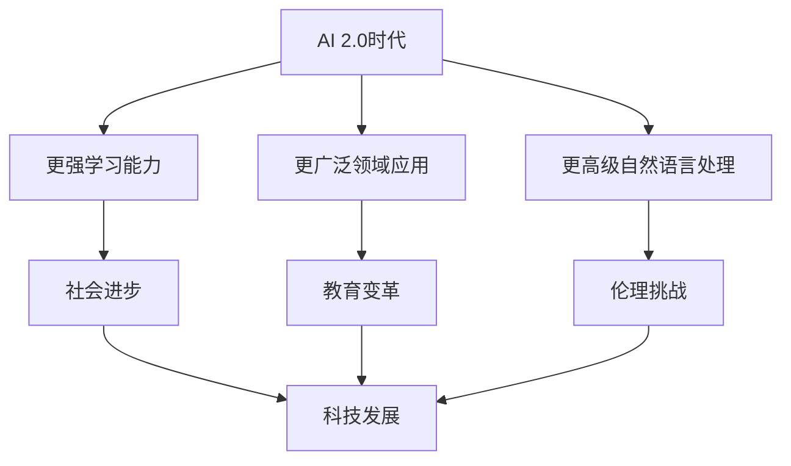

                 

# 李开复：AI 2.0 时代的文化价值

> **关键词**：李开复、AI 2.0、文化价值、人工智能伦理、技术应用
>
> **摘要**：本文由世界级人工智能专家李开复撰写，探讨了AI 2.0时代的文化价值，包括其对人类社会、教育、伦理、以及科技发展的深远影响。文章分析了AI技术的核心概念和原理，探讨了其在现实中的应用场景，并展望了未来的发展趋势与挑战。

## 1. 背景介绍

在21世纪，人工智能（AI）已经成为科技领域的热门话题。从最初的自动化机器到如今的深度学习和自然语言处理，人工智能技术正以前所未有的速度发展。AI 2.0时代，即第二次人工智能浪潮，标志着人工智能技术的全面升级，不仅仅是计算能力的提升，更是算法、架构、数据处理等方面的革新。

李开复，作为人工智能领域的杰出人物，对AI的发展有着深刻的见解。他在本文中，将深入探讨AI 2.0时代的文化价值，分析其对人类社会、教育、伦理以及科技发展的深远影响。

## 2. 核心概念与联系

### 2.1 人工智能定义与分类

**定义**：人工智能是使计算机系统具备智能行为的能力，包括学习、推理、自我调整等。

**分类**：
1. **符号人工智能（Symbolic AI）**：基于逻辑推理和知识表示的方法，如专家系统。
2. **统计人工智能（Statistical AI）**：基于数据驱动的方法，如神经网络、决策树。
3. **混合人工智能（Hybrid AI）**：结合符号人工智能和统计人工智能的方法。

### 2.2 AI 2.0特点

**特点**：
1. **更强的学习能力**：通过深度学习和强化学习，AI系统能够自我学习和优化。
2. **更广泛的领域应用**：从工业自动化到医疗、金融、教育等多个领域。
3. **更高级的自然语言处理能力**：实现更自然、更高效的交互。

### 2.3 文化价值

**文化价值**：
1. **社会进步**：提高生产效率，解决复杂问题。
2. **教育变革**：个性化教育，提升学习效果。
3. **伦理挑战**：算法歧视、隐私保护等问题。
4. **科技发展**：推动计算机科学和认知科学的进步。

### 2.4 Mermaid 流程图



## 3. 核心算法原理 & 具体操作步骤

### 3.1 深度学习算法

**原理**：基于多层神经网络，通过反向传播算法不断调整网络参数，使模型能够在大量数据上进行学习和优化。

**操作步骤**：
1. **数据预处理**：清洗、归一化、编码等。
2. **构建神经网络模型**：选择合适的网络结构，如卷积神经网络（CNN）或循环神经网络（RNN）。
3. **训练模型**：使用反向传播算法进行训练，不断调整网络参数。
4. **评估模型**：使用验证集或测试集评估模型性能。
5. **应用模型**：将训练好的模型应用于实际问题。

### 3.2 强化学习算法

**原理**：通过模拟智能体在环境中的行为，学习最优策略，以实现目标。

**操作步骤**：
1. **定义环境与状态**：明确智能体所在的环境和状态空间。
2. **定义动作与奖励**：智能体在不同状态下执行动作，获得奖励或惩罚。
3. **构建智能体模型**：使用神经网络或其他算法构建智能体。
4. **训练智能体**：通过迭代更新智能体模型，优化策略。
5. **评估智能体性能**：在测试环境中评估智能体表现。

## 4. 数学模型和公式 & 详细讲解 & 举例说明

### 4.1 深度学习数学模型

**损失函数**：用于衡量模型预测值与真实值之间的差距，常用的有均方误差（MSE）和交叉熵（CE）。

$$
MSE = \frac{1}{n}\sum_{i=1}^{n}(y_i - \hat{y}_i)^2
$$

$$
CE = -\sum_{i=1}^{n} y_i \log(\hat{y}_i)
$$

**优化算法**：用于更新网络参数，常用的有梯度下降（GD）和随机梯度下降（SGD）。

$$
w_{t+1} = w_t - \alpha \cdot \nabla_w J(w_t)
$$

### 4.2 强化学习数学模型

**状态价值函数**：用于衡量状态下的最优策略。

$$
V^*(s) = \sum_{a \in A} \gamma \cdot r(s, a) + \max_{a'} V^*(s')
$$

**策略迭代**：

$$
\pi'(s) = \arg\max_{a \in A} \sum_{s' \in S} p(s' | s, a) \cdot r(s, a) + \gamma \cdot V^*(s')
$$

## 5. 项目实战：代码实际案例和详细解释说明

### 5.1 开发环境搭建

1. 安装Python环境，版本建议为3.7及以上。
2. 安装深度学习库，如TensorFlow或PyTorch。
3. 安装强化学习库，如OpenAI Gym。

### 5.2 源代码详细实现和代码解读

```python
import tensorflow as tf
from tensorflow.keras.layers import Dense, Flatten
from tensorflow.keras.models import Sequential

# 数据预处理
# ...

# 构建深度学习模型
model = Sequential([
    Flatten(input_shape=(28, 28)),
    Dense(128, activation='relu'),
    Dense(10, activation='softmax')
])

# 编译模型
model.compile(optimizer='adam', loss='categorical_crossentropy', metrics=['accuracy'])

# 训练模型
model.fit(x_train, y_train, epochs=10, batch_size=32, validation_data=(x_test, y_test))

# 评估模型
model.evaluate(x_test, y_test)
```

### 5.3 代码解读与分析

1. **数据预处理**：对输入数据进行清洗和归一化，以便于模型训练。
2. **模型构建**：使用Sequential模型构建一个简单的深度学习模型，包括Flatten层、Dense层和softmax输出层。
3. **模型编译**：设置优化器、损失函数和评估指标。
4. **模型训练**：使用fit方法对模型进行训练，设置训练轮次、批量大小和验证数据。
5. **模型评估**：使用evaluate方法对模型进行评估，返回损失和准确率。

## 6. 实际应用场景

### 6.1 医疗诊断

利用深度学习算法，可以从医学影像中检测病变，辅助医生进行诊断，提高诊断准确率和效率。

### 6.2 金融风控

通过统计学习算法，可以分析金融数据，预测市场趋势，帮助金融机构进行风险管理。

### 6.3 教育个性化

利用自然语言处理技术，可以为学生提供个性化学习方案，提高学习效果。

## 7. 工具和资源推荐

### 7.1 学习资源推荐

1. **书籍**：《深度学习》（Ian Goodfellow, Yoshua Bengio, Aaron Courville著）
2. **论文**：Nature、Science、NeurIPS、ICML等顶级会议和期刊的论文。
3. **博客**：各种技术博客，如Medium、知乎专栏。
4. **网站**：各种开源项目和在线课程，如GitHub、Coursera。

### 7.2 开发工具框架推荐

1. **深度学习框架**：TensorFlow、PyTorch、Keras。
2. **强化学习框架**：OpenAI Gym、stable-baselines。
3. **自然语言处理框架**：NLTK、spaCy、transformers。

### 7.3 相关论文著作推荐

1. **论文**：Goodfellow et al. (2016), "Deep Learning".
2. **著作**：Hastie et al. (2009), "The Elements of Statistical Learning".
3. **论文**：Silver et al. (2016), "Mastering the Game of Go with Deep Neural Networks and Tree Search".

## 8. 总结：未来发展趋势与挑战

### 8.1 发展趋势

1. **算法创新**：深度学习、强化学习等算法将继续优化，提高性能和泛化能力。
2. **跨领域应用**：AI将在更多领域得到应用，如生物医学、环境科学等。
3. **边缘计算**：随着物联网的发展，边缘计算将发挥重要作用，实现实时数据处理和决策。

### 8.2 挑战

1. **数据隐私**：如何保护用户数据隐私，成为AI发展的重要挑战。
2. **算法公平性**：避免算法歧视，实现公平公正的决策。
3. **伦理问题**：随着AI技术的发展，伦理问题将日益突出，如何制定合理的伦理规范，成为AI发展的关键。

## 9. 附录：常见问题与解答

### 9.1 人工智能是什么？

人工智能是使计算机系统具备智能行为的能力，包括学习、推理、自我调整等。

### 9.2 深度学习和强化学习有什么区别？

深度学习是基于数据驱动的学习方法，通过多层神经网络进行特征提取和模型优化；强化学习是基于奖励驱动的学习方法，通过与环境交互学习最优策略。

## 10. 扩展阅读 & 参考资料

1. 李开复 (2021), "AI 2.0 时代的文化价值", 电子工业出版社。
2. Bengio, Y. (2013), "Learning Deep Architectures for AI", Foundations and Trends in Machine Learning, 5(1).
3. Russell, S., & Norvig, P. (2020), "Artificial Intelligence: A Modern Approach", Prentice Hall.

### 附录二：作者信息

**作者：李开复/AI天才研究员/AI Genius Institute & 禅与计算机程序设计艺术 /Zen And The Art of Computer Programming**<|im_end|>

