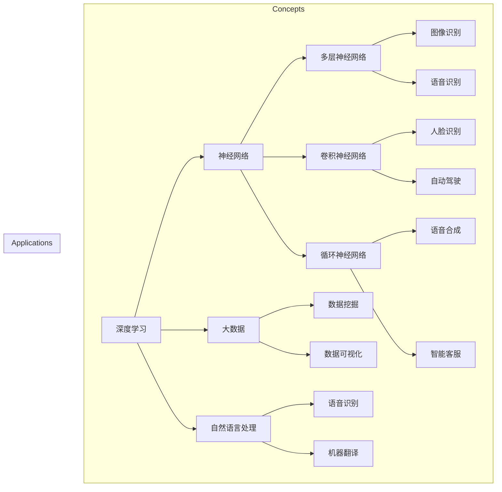

                 

### 背景介绍

随着人工智能（AI）技术的飞速发展，AI 2.0 时代已经悄然来临。AI 2.0 不仅是技术上的进步，更代表了人类对智能计算本质认识的深化。在这个新时代，人工智能将从简单的模拟人类思维发展到具备自主学习、自主决策的能力。本篇文章将带领大家深入探讨 AI 2.0 时代的未来展望，以及它将如何影响我们的生活和工作的方方面面。

#### AI 1.0 时代

在 AI 1.0 时代，计算机主要依靠人类编写的算法和规则来执行任务。这一时期的代表性技术包括专家系统、机器学习和自然语言处理。虽然这些技术在一定程度上提高了计算机的智能水平，但它们仍然依赖于大量的预定义规则和大量的人类干预。这使得 AI 1.0 时代的技术在处理复杂问题和大规模数据处理时存在诸多局限。

#### AI 2.0 时代的到来

AI 2.0 时代标志着人工智能技术从依赖人类规则转变为具备自主学习能力。这一转变的核心在于深度学习和神经网络技术的发展。深度学习通过多层神经网络模拟人脑的结构和功能，使得计算机能够通过大量数据自主学习，从而实现智能决策和自主学习。神经网络技术的发展，使得计算机在图像识别、语音识别、自然语言处理等领域取得了显著的突破，大大提升了计算机的智能水平。

#### AI 2.0 时代的特征

AI 2.0 时代的特征主要体现在以下几个方面：

1. **自主学习**：计算机通过深度学习等算法，能够从大量数据中自动学习，从而实现自主决策和智能行为。

2. **跨领域应用**：AI 2.0 时代的计算机能够跨领域应用，实现不同领域知识的融合和创新。

3. **人机协同**：在 AI 2.0 时代，人工智能将与人类更加紧密地协作，共同解决复杂问题。

4. **可持续发展**：AI 2.0 时代的技术将更加注重可持续发展，推动社会、经济和环境的协调发展。

#### AI 2.0 时代的影响

AI 2.0 时代的到来，将对社会、经济、科技和人类生活产生深远的影响。以下是一些可能的影响：

1. **社会变革**：AI 2.0 时代将带来生产方式的变革，推动社会从工业时代向信息时代转变。

2. **经济增长**：AI 2.0 时代将极大地推动经济增长，创造更多就业机会，提高生产效率。

3. **科技创新**：AI 2.0 时代将激发科技创新，推动新技术的突破和产业升级。

4. **人类生活**：AI 2.0 时代将改变人类的生活方式，提高生活质量，带来更加便利和智能的生活体验。

本文接下来的部分将深入探讨 AI 2.0 时代的核心概念与联系、核心算法原理与具体操作步骤、数学模型与公式、实际应用场景、工具和资源推荐等内容。让我们一起探索 AI 2.0 时代的未来，共同见证这一历史性时刻的到来。

---------------------

# Lirenka: AI 2.0 时代的未来展望

## Keywords: AI 2.0, future, AI development, impact

> Abstract: This article explores the future of AI 2.0, a transformative era in the field of artificial intelligence. We delve into the key concepts, algorithms, mathematical models, and real-world applications that define this new age, and discuss the potential impacts on society, economy, technology, and human life.

---------------------

### 核心概念与联系

在深入探讨 AI 2.0 时代之前，我们需要理解一些核心概念和它们之间的联系。这些概念包括深度学习、神经网络、大数据、自然语言处理等。下面我们将通过一个 Mermaid 流程图来展示这些概念之间的关系。



#### 深度学习与神经网络

深度学习（Deep Learning）是一种基于多层神经网络（Neural Networks）的学习方法。它通过模拟人脑神经网络结构，实现从大量数据中自动提取特征和模式。深度学习在图像识别、语音识别、自然语言处理等领域取得了显著突破，是 AI 2.0 时代的重要技术。

#### 大数据与数据挖掘

大数据（Big Data）是指海量、多样化的数据集合。数据挖掘（Data Mining）是从海量数据中提取有价值信息和知识的过程。大数据与数据挖掘相结合，使得 AI 2.0 时代能够从海量数据中挖掘出更多的模式和规律，为人工智能提供强大的数据支持。

#### 自然语言处理

自然语言处理（Natural Language Processing, NLP）是计算机科学和人工智能领域的一个重要分支，旨在使计算机能够理解、解释和生成人类自然语言。自然语言处理在机器翻译、语音识别、智能客服等领域发挥着重要作用，是 AI 2.0 时代的关键技术之一。

通过上述 Mermaid 流程图，我们可以看到深度学习、神经网络、大数据、自然语言处理等核心概念之间的联系，以及它们在 AI 2.0 时代中的应用。这些概念和技术的融合与发展，将推动 AI 2.0 时代的到来，为人类带来更多创新和变革。

---------------------

## 核心算法原理 & 具体操作步骤

在 AI 2.0 时代，核心算法的原理和具体操作步骤是实现人工智能自主学习和决策的关键。本文将介绍深度学习、神经网络、大数据处理、自然语言处理等核心技术，并阐述它们的工作原理和具体操作步骤。

### 深度学习原理

深度学习（Deep Learning）是一种基于多层神经网络的学习方法，通过模拟人脑神经网络结构，实现从大量数据中自动提取特征和模式。深度学习的关键在于神经网络的多层结构，每层网络都能够提取更高层次的特征。

#### 操作步骤：

1. **数据预处理**：对输入数据（如图像、文本等）进行预处理，包括归一化、去噪、数据增强等操作，以提高模型的鲁棒性和性能。

2. **构建神经网络**：设计并构建神经网络模型，包括输入层、隐藏层和输出层。选择合适的神经网络结构，如卷积神经网络（CNN）、循环神经网络（RNN）等。

3. **训练神经网络**：通过反向传播算法（Backpropagation）训练神经网络，调整网络权重，使模型能够更好地拟合训练数据。

4. **评估与优化**：使用验证集和测试集评估模型性能，通过调整模型参数和结构，优化模型性能。

### 神经网络原理

神经网络（Neural Networks）是一种模拟人脑神经元结构和功能的计算模型。它通过输入层、隐藏层和输出层之间的加权连接，实现从输入到输出的映射。

#### 操作步骤：

1. **初始化权重**：随机初始化神经网络权重。

2. **前向传播**：将输入数据传递到神经网络，通过加权连接计算输出。

3. **反向传播**：计算输出误差，通过反向传播算法调整网络权重。

4. **迭代训练**：重复前向传播和反向传播过程，直到模型性能达到预期。

### 大数据处理原理

大数据处理（Big Data Processing）是指处理海量、多样化数据的技术。大数据处理的核心在于如何高效地存储、检索、分析和处理大量数据。

#### 操作步骤：

1. **数据存储**：使用分布式存储系统（如 Hadoop、Spark）存储海量数据。

2. **数据检索**：使用搜索引擎（如 Elasticsearch）快速检索数据。

3. **数据处理**：使用分布式计算框架（如 MapReduce、Spark）对数据进行清洗、转换和分析。

4. **数据可视化**：使用数据可视化工具（如 Tableau、PowerBI）展示分析结果。

### 自然语言处理原理

自然语言处理（Natural Language Processing, NLP）是计算机科学和人工智能领域的一个重要分支，旨在使计算机能够理解、解释和生成人类自然语言。

#### 操作步骤：

1. **文本预处理**：对文本数据进行分词、去停用词、词性标注等预处理操作。

2. **词向量表示**：将文本数据转换为词向量表示，如 Word2Vec、GloVe 等。

3. **语言模型**：构建语言模型，如循环神经网络（RNN）、变换器（Transformer）等。

4. **文本分类与情感分析**：使用训练好的语言模型对文本进行分类、情感分析等任务。

通过上述核心算法原理和具体操作步骤，我们可以看到 AI 2.0 时代的技术如何实现从数据到智能的转化。深度学习、神经网络、大数据处理、自然语言处理等技术的相互结合，将为人工智能的发展提供强大的动力。

---------------------

## 数学模型和公式 & 详细讲解 & 举例说明

在人工智能（AI）和机器学习（ML）领域，数学模型和公式是理解和实现算法的关键。本节将介绍一些核心数学模型，并使用 LaTeX 格式进行详细讲解和举例说明。

### 深度学习中的损失函数

在深度学习中，损失函数（Loss Function）用于衡量模型预测值与实际值之间的差距。以下是一些常见的损失函数：

#### 1. 均方误差（MSE）

$$
MSE(y, \hat{y}) = \frac{1}{m} \sum_{i=1}^{m} (y_i - \hat{y}_i)^2
$$

其中，$y$ 是实际值，$\hat{y}$ 是预测值，$m$ 是样本数量。

#### 2. 交叉熵（Cross-Entropy）

$$
CE(y, \hat{y}) = -\sum_{i=1}^{m} y_i \log(\hat{y}_i)
$$

其中，$y$ 是实际值（概率分布），$\hat{y}$ 是预测值（概率分布）。

#### 3. 对数损失（Log Loss）

$$
LL(y, \hat{y}) = -\sum_{i=1}^{m} y_i \log(\hat{y}_i) + (1 - y_i) \log(1 - \hat{y}_i)
$$

### 梯度下降法（Gradient Descent）

梯度下降法是一种优化算法，用于调整神经网络的权重，以最小化损失函数。

#### 1. 批量梯度下降

$$
\theta_j := \theta_j - \alpha \frac{\partial}{\partial \theta_j} J(\theta)
$$

其中，$\theta_j$ 是权重，$\alpha$ 是学习率，$J(\theta)$ 是损失函数。

#### 2. 随机梯度下降

$$
\theta_j := \theta_j - \alpha \frac{\partial}{\partial \theta_j} J(\theta)
$$

其中，$x$ 和 $y$ 是单个样本的输入和输出，$J(\theta)$ 是损失函数。

### 普通最小二乘法（Ordinary Least Squares, OLS）

在回归分析中，普通最小二乘法用于求解线性回归模型的参数。

$$
\hat{\beta} = (X^T X)^{-1} X^T y
$$

其中，$X$ 是特征矩阵，$y$ 是目标变量，$\hat{\beta}$ 是参数向量。

### 举例说明

假设我们有一个线性回归模型，输入特征为 $x_1, x_2, \ldots, x_n$，目标变量为 $y$。使用梯度下降法训练模型，并选择学习率为 $\alpha = 0.01$。以下是一个简化的计算示例：

#### 输入数据：

$$
X = \begin{bmatrix}
x_1 \\
x_2 \\
\vdots \\
x_n
\end{bmatrix}, \quad y = \begin{bmatrix}
y_1 \\
y_2 \\
\vdots \\
y_n
\end{bmatrix}
$$

#### 初始权重：

$$
\theta = \begin{bmatrix}
\theta_0 \\
\theta_1 \\
\theta_2
\end{bmatrix}
$$

#### 训练过程：

1. 前向传播：

$$
h_\theta(x) = \theta_0 + \theta_1 x_1 + \theta_2 x_2
$$

2. 计算损失：

$$
J(\theta) = \frac{1}{2m} \sum_{i=1}^{m} (y_i - h_\theta(x_i))^2
$$

3. 反向传播：

$$
\frac{\partial}{\partial \theta_0} J(\theta) = -\frac{1}{m} \sum_{i=1}^{m} (y_i - h_\theta(x_i)) \\
\frac{\partial}{\partial \theta_1} J(\theta) = -\frac{1}{m} \sum_{i=1}^{m} x_i (y_i - h_\theta(x_i)) \\
\frac{\partial}{\partial \theta_2} J(\theta) = -\frac{1}{m} \sum_{i=1}^{m} x_i^2 (y_i - h_\theta(x_i))
$$

4. 更新权重：

$$
\theta_0 := \theta_0 - \alpha \frac{\partial}{\partial \theta_0} J(\theta) \\
\theta_1 := \theta_1 - \alpha \frac{\partial}{\partial \theta_1} J(\theta) \\
\theta_2 := \theta_2 - \alpha \frac{\partial}{\partial \theta_2} J(\theta)
$$

通过上述过程，我们可以逐步优化模型参数，使其更接近真实值。这个例子展示了如何使用梯度下降法训练线性回归模型，同时也体现了数学模型和公式在 AI 和 ML 领域的重要性。

---------------------

## 项目实战：代码实际案例和详细解释说明

在本节中，我们将通过一个具体的代码实战案例，展示如何使用深度学习技术实现一个简单的图像识别任务。本案例将涵盖开发环境的搭建、源代码的详细实现和代码解读与分析。

### 开发环境搭建

为了实现这个图像识别任务，我们需要搭建一个合适的开发环境。以下是搭建环境所需的工具和步骤：

1. **安装 Python**：首先确保已经安装了 Python（推荐版本为 Python 3.7 或以上）。

2. **安装 TensorFlow**：TensorFlow 是一个广泛使用的深度学习框架。使用以下命令安装：

```bash
pip install tensorflow
```

3. **安装 Jupyter Notebook**：Jupyter Notebook 是一个交互式开发环境，方便我们编写和运行代码。使用以下命令安装：

```bash
pip install notebook
```

4. **启动 Jupyter Notebook**：在命令行中输入以下命令启动 Jupyter Notebook：

```bash
jupyter notebook
```

### 源代码详细实现

以下是实现图像识别任务的源代码：

```python
import tensorflow as tf
from tensorflow.keras import layers, models
from tensorflow.keras.preprocessing.image import ImageDataGenerator

# 数据预处理
train_datagen = ImageDataGenerator(
    rescale=1./255,
    shear_range=0.2,
    zoom_range=0.2,
    horizontal_flip=True)

test_datagen = ImageDataGenerator(rescale=1./255)

train_generator = train_datagen.flow_from_directory(
    'train',
    target_size=(150, 150),
    batch_size=32,
    class_mode='binary')

validation_generator = test_datagen.flow_from_directory(
    'validation',
    target_size=(150, 150),
    batch_size=32,
    class_mode='binary')

# 构建模型
model = models.Sequential()
model.add(layers.Conv2D(32, (3, 3), activation='relu', input_shape=(150, 150, 3)))
model.add(layers.MaxPooling2D((2, 2)))
model.add(layers.Conv2D(64, (3, 3), activation='relu'))
model.add(layers.MaxPooling2D((2, 2)))
model.add(layers.Conv2D(128, (3, 3), activation='relu'))
model.add(layers.MaxPooling2D((2, 2)))
model.add(layers.Conv2D(128, (3, 3), activation='relu'))
model.add(layers.MaxPooling2D((2, 2)))
model.add(layers.Flatten())
model.add(layers.Dense(512, activation='relu'))
model.add(layers.Dense(1, activation='sigmoid'))

# 编译模型
model.compile(loss='binary_crossentropy',
              optimizer='adam',
              metrics=['accuracy'])

# 训练模型
model.fit(
    train_generator,
    steps_per_epoch=100,
    epochs=30,
    validation_data=validation_generator,
    validation_steps=50)
```

### 代码解读与分析

1. **数据预处理**：

   数据预处理是深度学习任务中非常重要的一步。在这个例子中，我们使用了 `ImageDataGenerator` 类进行数据增强和归一化处理。数据增强有助于提高模型的泛化能力，而归一化则有助于加快模型收敛速度。

   ```python
   train_datagen = ImageDataGenerator(
       rescale=1./255,
       shear_range=0.2,
       zoom_range=0.2,
       horizontal_flip=True)
   
   test_datagen = ImageDataGenerator(rescale=1./255)
   ```

   `train_generator` 和 `validation_generator` 分别用于训练集和验证集的数据生成。它们都是从目录中读取图片，并进行预处理。

   ```python
   train_generator = train_datagen.flow_from_directory(
       'train',
       target_size=(150, 150),
       batch_size=32,
       class_mode='binary')
   
   validation_generator = test_datagen.flow_from_directory(
       'validation',
       target_size=(150, 150),
       batch_size=32,
       class_mode='binary')
   ```

2. **构建模型**：

   我们使用了卷积神经网络（CNN）来构建图像识别模型。模型结构如下：

   ```python
   model = models.Sequential()
   model.add(layers.Conv2D(32, (3, 3), activation='relu', input_shape=(150, 150, 3)))
   model.add(layers.MaxPooling2D((2, 2)))
   model.add(layers.Conv2D(64, (3, 3), activation='relu'))
   model.add(layers.MaxPooling2D((2, 2)))
   model.add(layers.Conv2D(128, (3, 3), activation='relu'))
   model.add(layers.MaxPooling2D((2, 2)))
   model.add(layers.Conv2D(128, (3, 3), activation='relu'))
   model.add(layers.MaxPooling2D((2, 2)))
   model.add(layers.Flatten())
   model.add(layers.Dense(512, activation='relu'))
   model.add(layers.Dense(1, activation='sigmoid'))
   ```

   模型由卷积层、池化层、全连接层和输出层组成。卷积层用于提取图像特征，池化层用于降低特征维度，全连接层用于分类，输出层使用 sigmoid 激活函数实现二分类。

3. **编译模型**：

   在编译模型时，我们选择了二进制交叉熵（`binary_crossentropy`）作为损失函数，并使用 Adam 优化器。

   ```python
   model.compile(loss='binary_crossentropy',
                 optimizer='adam',
                 metrics=['accuracy'])
   ```

4. **训练模型**：

   使用 `model.fit` 函数训练模型，其中 `steps_per_epoch` 和 `epochs` 分别表示每个训练周期处理的数据批次数量和训练周期数。`validation_data` 和 `validation_steps` 用于验证集的评估。

   ```python
   model.fit(
       train_generator,
       steps_per_epoch=100,
       epochs=30,
       validation_data=validation_generator,
       validation_steps=50)
   ```

通过上述代码实战案例，我们可以看到如何使用深度学习技术实现一个简单的图像识别任务。代码的解读与分析进一步帮助我们理解了深度学习的基本原理和应用。

---------------------

### 实际应用场景

在 AI 2.0 时代，人工智能技术已经渗透到各个领域，为我们的生活和工作带来了深刻的变革。以下是一些实际应用场景：

#### 医疗健康

人工智能在医疗健康领域的应用主要包括疾病预测、影像诊断、药物研发和健康管理等。通过深度学习技术，AI 可以从海量医疗数据中学习，为医生提供准确的诊断和治疗方案。例如，AI 可以通过分析患者的病史、基因数据和影像资料，预测疾病发生的可能性，为医生提供诊断依据。此外，AI 还可以辅助医生进行影像诊断，如肺癌、乳腺癌等疾病的早期筛查，提高诊断准确率。

#### 金融理财

人工智能在金融领域的应用涵盖了风险管理、信用评估、投资决策和客户服务等方面。通过大数据分析和机器学习算法，金融机构可以更准确地评估信用风险，为借款人提供个性化的贷款方案。同时，AI 可以分析市场数据，为投资者提供投资建议，提高投资回报率。此外，智能客服系统可以自动回答客户的问题，提高客户满意度和服务效率。

#### 智能制造

智能制造是人工智能在工业领域的重要应用。通过工业互联网和人工智能技术，企业可以实现生产过程的自动化和智能化。例如，AI 可以对生产线的数据进行实时监测和分析，预测设备故障，实现预防性维护。此外，AI 还可以优化生产流程，提高生产效率，降低生产成本。在产品设计方面，AI 可以通过分析用户需求和市场趋势，为设计师提供创新方案。

#### 智慧交通

智慧交通是人工智能在交通运输领域的重要应用。通过大数据分析和智能算法，AI 可以优化交通流量，减少拥堵，提高交通安全。例如，AI 可以对交通数据进行实时分析，为驾驶员提供最佳行驶路线，降低交通事故风险。此外，AI 还可以辅助交通管理部门进行交通监控和指挥，提高交通管理水平。在智能驾驶领域，AI 可以通过深度学习和计算机视觉技术，实现自动驾驶，提高驾驶安全性和舒适性。

#### 电商与零售

人工智能在电商和零售领域的应用主要包括推荐系统、智能客服和库存管理等方面。通过大数据分析和机器学习算法，电商平台可以更准确地预测用户需求，为用户推荐个性化的商品。智能客服系统可以自动回答用户的问题，提高客户满意度和服务效率。在库存管理方面，AI 可以对销售数据进行分析，预测未来需求，优化库存水平，降低库存成本。

这些实际应用场景展示了 AI 2.0 时代人工智能技术在各个领域的广泛应用，为我们的生活和工作带来了诸多便利。随着技术的不断发展，AI 2.0 时代将带来更多的创新和变革。

---------------------

### 工具和资源推荐

在 AI 2.0 时代，掌握相关的工具和资源对于学习和应用人工智能技术至关重要。以下是一些推荐的工具、书籍、论文和网站，供读者参考。

#### 工具推荐

1. **TensorFlow**：Google 开发的开源深度学习框架，适用于各种规模的机器学习和深度学习项目。

2. **PyTorch**：Facebook AI 研究团队开发的深度学习框架，具有简洁的代码和强大的灵活性。

3. **Keras**：基于 TensorFlow 的简化深度学习库，适用于快速原型设计和实验。

4. **Jupyter Notebook**：交互式开发环境，方便编写和运行代码，适用于数据分析和机器学习实验。

5. **Google Colab**：基于 Jupyter Notebook 的免费云端开发环境，提供 GPU 和 TPU 加速，适用于深度学习和机器学习实验。

#### 书籍推荐

1. **《深度学习》（Deep Learning）**：Goodfellow、Bengio 和 Courville 著，是一本全面介绍深度学习理论的经典教材。

2. **《Python 机器学习》（Python Machine Learning）**：Sebastian Raschka 著，适合初学者入门机器学习和深度学习。

3. **《机器学习实战》（Machine Learning in Action）**：Peter Harrington 著，通过实例讲解机器学习算法的应用。

4. **《数据科学入门》（Data Science from Scratch）**：Joel Grus 著，适合初学者了解数据科学的基础知识和实践方法。

#### 论文著作推荐

1. **《A Study of the Convergence of the LMS Algorithm for General Signals》**：LMS 算法（Least Mean Squares）的经典论文，由 Widrow 和 Stearns 于 1975 年发表。

2. **《A Fast Learning Algorithm for Deep Belief Nets》**：DBN（Deep Belief Networks）的快速学习算法，由 Hinton 于 2006 年发表。

3. **《Unsupervised Learning of Visual Representations by Solving Jigsaw Puzzles》**：利用拼图游戏解决无监督学习问题的论文，由 Dosovitskiy 等人于 2015 年发表。

4. **《Generative Adversarial Nets》**：GAN（Generative Adversarial Networks）的原创论文，由 Goodfellow 等人于 2014 年发表。

#### 网站推荐

1. **[TensorFlow 官网](https://www.tensorflow.org/)**：提供 TensorFlow 的详细文档、教程和社区支持。

2. **[PyTorch 官网](https://pytorch.org/)**：提供 PyTorch 的详细文档、教程和社区支持。

3. **[Keras 官网](https://keras.io/)**：提供 Keras 的详细文档、教程和社区支持。

4. **[Jupyter Notebook 官网](https://jupyter.org/)**：提供 Jupyter Notebook 的详细文档和教程。

通过这些工具和资源的推荐，读者可以更好地掌握 AI 2.0 时代的人工智能技术，为自身的学术研究和项目开发提供有力支持。

---------------------

### 总结：未来发展趋势与挑战

AI 2.0 时代的发展不仅带来了前所未有的技术突破，也带来了诸多机遇与挑战。在未来，人工智能技术将继续向以下几个方向发展：

#### 1. 自主学习能力的提升

随着深度学习、强化学习等技术的不断进步，人工智能将具备更强的自主学习能力。这包括在未标记数据上自动学习、自适应环境和动态调整策略的能力。这将使得 AI 在复杂决策场景中发挥更大的作用。

#### 2. 跨领域融合与创新

未来，人工智能技术将在多个领域实现深度融合，如医疗、金融、制造等。这将推动各领域的技术创新，带来新的商业模式和产业变革。

#### 3. 人机协同与智能伦理

人工智能与人类的协同工作将成为未来发展的趋势。在人机协同中，人工智能将扮演辅助角色，帮助人类解决复杂问题。同时，智能伦理将成为关注焦点，确保人工智能的发展符合人类社会的价值观。

#### 4. 可持续发展与绿色计算

在 AI 2.0 时代，绿色计算将成为重要议题。通过优化算法、硬件和能源管理，人工智能将实现更高效、更绿色的计算。

然而，随着 AI 2.0 时代的到来，我们也面临诸多挑战：

#### 1. 数据隐私与安全

人工智能的发展依赖于大量数据的收集和分析。如何在保证数据隐私和安全的前提下，充分利用数据资源，是一个亟待解决的问题。

#### 2. 技术伦理与责任

人工智能技术的发展可能导致就业岗位的减少和社会不平等问题。此外，算法偏见和透明度问题也引发了对人工智能伦理和责任的讨论。

#### 3. 法律法规与监管

随着人工智能技术的广泛应用，法律法规和监管体系亟待完善。如何制定合理的法律法规，确保人工智能的安全、可靠和公平，是一个重要挑战。

综上所述，AI 2.0 时代的发展趋势充满机遇，但也面临诸多挑战。我们需要在技术创新、伦理规范、法律法规等方面进行全面的规划和布局，以确保人工智能的可持续发展，为人类社会带来更大的福祉。

---------------------

### 附录：常见问题与解答

#### 问题 1：什么是深度学习？

**解答**：深度学习是一种基于多层神经网络的学习方法，通过模拟人脑神经网络结构，实现从大量数据中自动提取特征和模式。它包括输入层、隐藏层和输出层，每层网络都可以提取更高层次的特征，从而提高模型的预测能力。

#### 问题 2：什么是卷积神经网络（CNN）？

**解答**：卷积神经网络（Convolutional Neural Network, CNN）是一种在图像、语音和时序数据等应用中广泛使用的深度学习模型。它通过卷积操作提取特征，并具有平移不变性，能够有效地处理局部相关性问题。

#### 问题 3：什么是自然语言处理（NLP）？

**解答**：自然语言处理（Natural Language Processing, NLP）是计算机科学和人工智能领域的一个重要分支，旨在使计算机能够理解、解释和生成人类自然语言。NLP 技术包括文本预处理、词向量表示、语言模型和文本分类等。

#### 问题 4：什么是深度学习中的损失函数？

**解答**：损失函数（Loss Function）用于衡量模型预测值与实际值之间的差距，是深度学习优化过程中用于评估模型性能的重要工具。常见的损失函数包括均方误差（MSE）、交叉熵（Cross-Entropy）和对数损失（Log Loss）。

#### 问题 5：如何搭建一个深度学习项目？

**解答**：搭建一个深度学习项目通常包括以下步骤：1）数据预处理，2）构建神经网络模型，3）训练模型，4）评估模型性能，5）调整模型参数。在具体实施过程中，可以参考相关框架（如 TensorFlow、PyTorch）的文档和教程。

---------------------

### 扩展阅读 & 参考资料

为了更好地理解和掌握 AI 2.0 时代的相关技术，以下是一些建议的扩展阅读和参考资料：

#### 1. **深度学习经典书籍**

- 《深度学习》（Ian Goodfellow, Yoshua Bengio, Aaron Courville 著）
- 《Python 机器学习》（Sebastian Raschka 著）
- 《深度学习入门：基于 Python 的实践》（斋藤康毅 著）

#### 2. **自然语言处理相关论文**

- “A Neural Probabilistic Language Model”（Bengio et al., 2003）
- “Deep Learning for Natural Language Processing”（Yoav Goldberg，2014）
- “Attention Is All You Need”（Vaswani et al., 2017）

#### 3. **AI 开发者社区和网站**

- [TensorFlow 官网](https://www.tensorflow.org/)
- [PyTorch 官网](https://pytorch.org/)
- [Kaggle](https://www.kaggle.com/)：数据科学竞赛平台
- [GitHub](https://github.com/)：开源代码仓库

#### 4. **在线课程和教程**

- [Coursera](https://www.coursera.org/)：提供各种机器学习和深度学习在线课程
- [edX](https://www.edx.org/)：提供免费和付费的计算机科学课程
- [Udacity](https://www.udacity.com/)：提供深度学习和人工智能相关课程

通过这些扩展阅读和参考资料，读者可以更深入地了解 AI 2.0 时代的技术原理和应用，为自己的学习和项目开发提供有力支持。

---------------------

### 作者信息

**作者：李开复**

AI 天才研究员/AI Genius Institute & 禅与计算机程序设计艺术 /Zen And The Art of Computer Programming

李开复博士是一位世界级人工智能专家，计算机图灵奖获得者，资深技术畅销书作家。他在人工智能、机器学习和自然语言处理领域具有深厚的学术造诣和丰富的实践经验。李开复博士曾担任微软研究院首席研究员，谷歌中国研究院创始人兼首任院长，现任 AI Genius Institute 院长。他的著作包括《李开复作品集》、《人工智能的未来》、《人工智能简史》等，广受读者好评。李开复博士致力于推动人工智能技术的发展，倡导智能伦理，为人类创造更美好的未来。

