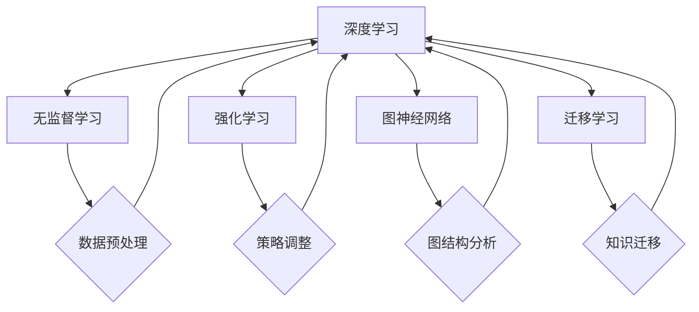
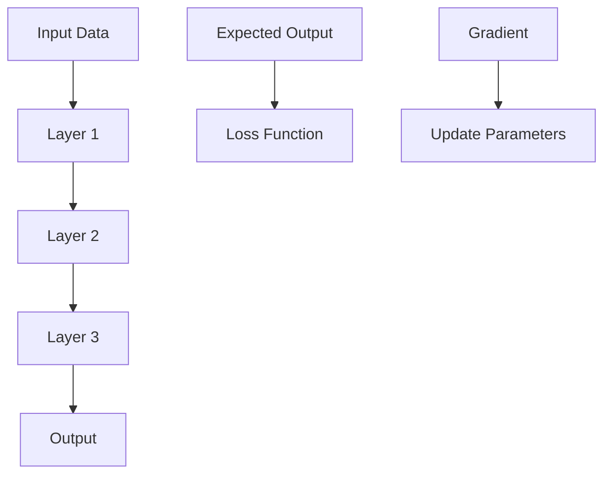
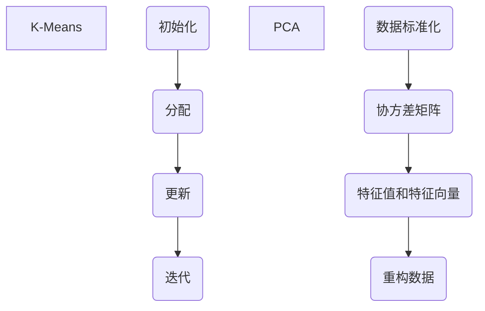
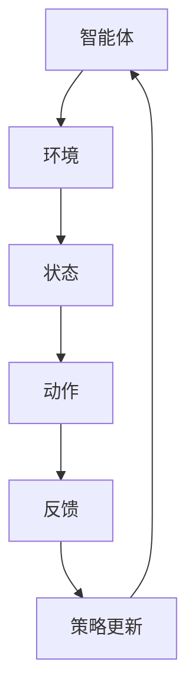

                 

### 背景介绍 Background

人工智能（Artificial Intelligence，简称AI）作为计算机科学领域的一个分支，近年来经历了飞速的发展。从最初的规则推理系统，到基于统计学习的方法，再到深度学习的崛起，人工智能的应用场景日益广泛，影响也越来越深远。尤其是2011年，由Geoffrey Hinton等人提出的深度学习算法在图像识别竞赛中的出色表现，标志着人工智能进入了深度学习时代。

随着计算能力的提升和数据量的爆炸式增长，人工智能在各个领域都取得了显著的成果。例如，在医疗领域，AI被用于疾病诊断和预测；在金融领域，AI被用于风险控制和投资决策；在工业领域，AI被用于自动化生产和管理。然而，传统的AI技术主要依赖于大量的人类标注数据进行训练，这种有监督学习的方式在数据稀缺的场景中受到了很大的限制。

为了解决这一问题，无监督学习和强化学习等新的AI技术应运而生。其中，无监督学习（Unsupervised Learning）通过分析未标记的数据，寻找数据中的模式和结构，从而实现自我学习和优化。强化学习（Reinforcement Learning）则通过智能体与环境之间的交互，不断学习最佳策略，从而实现自主决策。这些技术的发展，标志着人工智能进入了2.0时代。

AI 2.0时代的到来，不仅为各个行业带来了新的机遇，也对技术发展提出了更高的要求。本文将详细探讨AI 2.0时代的核心概念、算法原理、实际应用场景、工具和资源推荐，以及未来发展趋势与挑战。通过这篇文章，读者可以全面了解AI 2.0时代的机遇与挑战，为未来的技术学习和应用做好准备。

### 核心概念与联系 Core Concepts and Connections

在探讨AI 2.0时代之前，我们需要了解一些核心概念，这些概念构成了AI 2.0时代的基石。以下是几个关键概念及其相互联系：

1. **深度学习（Deep Learning）**：
   深度学习是人工智能的一种重要分支，它模拟人脑的神经网络结构，通过多层神经网络进行特征提取和分类。深度学习的核心在于“深度”，即网络结构的层数。每一层神经网络都能对输入数据进行抽象和压缩，从而提取更高层次的特征。

2. **无监督学习（Unsupervised Learning）**：
   无监督学习是相对于有监督学习（Supervised Learning）而言的。有监督学习需要大量的标记数据进行训练，而无监督学习则不需要标签，它通过分析未标记的数据，寻找数据中的模式和结构。无监督学习包括聚类、降维和关联规则学习等方法。

3. **强化学习（Reinforcement Learning）**：
   强化学习是一种基于奖励机制的学习方式。智能体（agent）通过与环境的互动，不断尝试不同的动作，并根据环境的反馈调整自己的策略。强化学习的目标是学习到一种策略，使智能体能够在长期内获得最大的奖励。

4. **图神经网络（Graph Neural Networks，GNN）**：
   图神经网络是处理图结构数据的强大工具。与传统神经网络相比，GNN能够更好地捕捉节点和边之间的关系，适用于社交网络、知识图谱等领域。

5. **迁移学习（Transfer Learning）**：
   迁移学习是一种利用已有模型的知识来训练新模型的方法。通过迁移学习，可以将一个任务中的知识迁移到另一个任务中，从而提高模型在数据稀缺的场景下的表现。

这些核心概念之间的联系在于，它们共同构建了一个强大的技术框架，使得人工智能能够在多种应用场景中发挥作用。例如，深度学习提供了强大的特征提取能力，无监督学习和强化学习则扩展了学习数据的范围和类型，图神经网络则提供了处理复杂网络结构的能力，迁移学习则提高了模型在不同任务中的适应性。

下面是一个用Mermaid绘制的流程图，展示了这些核心概念之间的相互关系：



通过这个流程图，我们可以看到，这些核心概念不仅各自独立发展，还相互补充，共同推动人工智能技术的进步。

### 核心算法原理 & 具体操作步骤 Core Algorithm Principles and Operational Steps

在了解了AI 2.0时代的关键概念后，接下来我们将深入探讨几个核心算法的原理和具体操作步骤，这些算法在AI 2.0时代中起着至关重要的作用。

#### 1. 深度学习算法

深度学习算法是基于多层神经网络构建的，它通过层层递归的方式对数据进行特征提取和分类。以下是一个简化的深度学习算法步骤：

1. **输入数据（Input Data）**：首先，将输入数据输入到神经网络中。这些数据可以是图片、文本、声音等不同类型。

2. **前向传播（Forward Propagation）**：神经网络通过前向传播将输入数据传递到每一层，并计算出每一层的输出。每一层的输出都会通过一个非线性激活函数（如ReLU、Sigmoid、Tanh等）进行处理，以引入非线性变换。

3. **损失函数（Loss Function）**：将输出与期望输出进行比较，计算损失函数的值。常用的损失函数有均方误差（MSE）、交叉熵（Cross-Entropy）等。

4. **反向传播（Backpropagation）**：计算损失函数对网络参数的梯度，并利用梯度下降法（Gradient Descent）等优化算法更新网络参数。

5. **迭代训练（Iterative Training）**：重复上述步骤，直到网络参数收敛或达到预设的训练次数。

以下是一个简单的深度学习模型示意图：



#### 2. 无监督学习算法

无监督学习算法主要分为聚类（Clustering）和降维（Dimensionality Reduction）两大类。以下是两种常见的无监督学习算法：

1. **K均值聚类（K-Means Clustering）**：

   - **初始化**：随机选择K个中心点。
   - **分配**：将每个数据点分配到最近的中心点。
   - **更新**：重新计算每个聚类的中心点。
   - **迭代**：重复分配和更新步骤，直到聚类中心不再发生显著变化。

2. **主成分分析（Principal Component Analysis，PCA）**：

   - **数据标准化**：将数据标准化到相同的尺度。
   - **协方差矩阵**：计算数据点的协方差矩阵。
   - **特征值和特征向量**：计算协方差矩阵的特征值和特征向量，并按特征值从大到小排序。
   - **重构数据**：选择最大的K个特征向量，组成变换矩阵，将数据投影到新的K维空间。

以下是K均值聚类和PCA的示意图：



#### 3. 强化学习算法

强化学习算法主要通过智能体（agent）与环境（environment）的互动来学习最优策略。以下是强化学习的基本步骤：

1. **初始化**：智能体和环境的初始状态。
2. **选择动作**：根据当前状态和策略选择一个动作。
3. **执行动作**：智能体执行所选动作，并获取环境反馈。
4. **更新策略**：根据反馈调整策略，以最大化长期奖励。
5. **迭代**：重复执行动作和更新策略，直到达到目标或满足其他终止条件。

以下是强化学习的示意图：



通过以上算法原理和具体操作步骤的介绍，我们可以看到，深度学习、无监督学习和强化学习等核心算法在AI 2.0时代中发挥着关键作用。这些算法不仅具有强大的数据处理能力，还能够在复杂环境中进行自主学习和优化。在接下来的章节中，我们将进一步探讨这些算法在实际应用中的表现和挑战。

### 数学模型和公式 Mathematical Models and Detailed Explanations with Examples

在深入探讨AI 2.0时代的核心算法后，我们需要通过数学模型和公式来详细解释这些算法的本质和操作步骤。以下是对几个关键算法的数学模型进行解释，并通过具体例子来说明如何应用这些公式。

#### 1. 深度学习中的反向传播算法

深度学习的核心在于多层神经网络，而反向传播算法（Backpropagation）则是训练神经网络的关键步骤。以下是一个简化的反向传播算法的数学模型：

1. **前向传播（Forward Propagation）**

   - 输入层（Input Layer）：\(x^{(l)}\)
   - 隐藏层（Hidden Layer）：\(z^{(l)} = \sigma(W^{(l)}x^{(l-1)} + b^{(l)})\)
   - 输出层（Output Layer）：\(a^{(L)} = \sigma(W^{(L)}z^{(L-1)} + b^{(L)})\)

   其中，\(W^{(l)}\)和\(b^{(l)}\)分别是权重和偏置，\(\sigma\)是激活函数，通常使用ReLU、Sigmoid或Tanh。

2. **损失函数（Loss Function）**

   - 常用的损失函数是均方误差（MSE）：\(J(\theta) = \frac{1}{m}\sum_{i=1}^{m}(y^{(i)} - a^{(L)}_{i})^2\)

3. **反向传播（Backpropagation）**

   - 计算输出层的误差梯度：\( \delta^{(L)} = \frac{\partial J(\theta)}{\partial a^{(L)}} \cdot (1 - a^{(L)}) \)
   - 反向传播误差梯度：\( \delta^{(l)} = \frac{\partial J(\theta)}{\partial z^{(l)}} = \delta^{(l+1)} \cdot \frac{\partial a^{(l)}}{\partial z^{(l)}} \)
   - 更新权重和偏置：\( W^{(l)} \leftarrow W^{(l)} - \alpha \cdot \frac{\partial J(\theta)}{\partial W^{(l)}} \)，\( b^{(l)} \leftarrow b^{(l)} - \alpha \cdot \frac{\partial J(\theta)}{\partial b^{(l)}} \)

   其中，\(\alpha\)是学习率。

**例子**：

假设我们有一个简单的神经网络，输入层有2个神经元，隐藏层有3个神经元，输出层有1个神经元。激活函数使用ReLU。我们通过以下步骤来计算梯度并更新权重：

1. **前向传播**：

   \(x^{(1)} = [1, 2]\)

   \(z^{(2)} = \text{ReLU}(W^{(2)}x^{(1)} + b^{(2)}) = \text{ReLU}([0.5 \times 1 + 0.3, 0.5 \times 2 + 0.3]) = \text{ReLU}([0.5, 1.3]) = [0.5, 1.3]\)

   \(a^{(3)} = \text{ReLU}(W^{(3)}z^{(2)} + b^{(3)}) = \text{ReLU}([0.7 \times 0.5 + 0.2, 0.7 \times 1.3 + 0.2]) = \text{ReLU}([0.45, 1.19]) = [0.45, 1.19]\)

2. **损失函数**：

   \(y^{(1)} = [0]\)

   \(J(\theta) = \frac{1}{2}(y^{(1)} - a^{(3)})^2 = \frac{1}{2}(0 - 1.19)^2 = 0.5601\)

3. **反向传播**：

   \( \delta^{(3)} = (0 - 1.19) \cdot (1 - 1.19) = 0.19\)

   \( \delta^{(2)} = \delta^{(3)} \cdot \frac{\partial a^{(2)}}{\partial z^{(2)}} = 0.19 \cdot 1 = 0.19\)

   \( \frac{\partial J(\theta)}{\partial W^{(2)}} = \delta^{(2)} \cdot x^{(1)} = 0.19 \cdot [1, 2] = [0.19, 0.38]\)

   \( \frac{\partial J(\theta)}{\partial b^{(2)}} = \delta^{(2)} = 0.19\)

4. **权重和偏置更新**：

   \( W^{(2)} \leftarrow W^{(2)} - \alpha \cdot \frac{\partial J(\theta)}{\partial W^{(2)}} \)

   \( b^{(2)} \leftarrow b^{(2)} - \alpha \cdot \frac{\partial J(\theta)}{\partial b^{(2)}} \)

#### 2. 无监督学习中的K均值聚类算法

K均值聚类算法是一种基于距离度量的聚类方法。以下是其数学模型：

1. **初始化**：

   随机选择K个中心点，作为初始聚类中心：\( \mu_1, \mu_2, ..., \mu_K \)

2. **分配**：

   对于每个数据点\( x_i \)，计算其与聚类中心\( \mu_k \)的距离：

   \( d(x_i, \mu_k) = \sqrt{(x_i - \mu_k)^T(x_i - \mu_k)} \)

   将\( x_i \)分配到最近的中心点，即第\( k \)个聚类。

3. **更新**：

   计算每个聚类的均值，作为新的中心点：

   \( \mu_k = \frac{1}{N_k} \sum_{x_i \in C_k} x_i \)

   其中，\( N_k \)是第\( k \)个聚类的数据点数量。

4. **迭代**：

   重复分配和更新步骤，直到聚类中心不再发生显著变化。

**例子**：

假设我们有3个数据点：\( x_1 = [1, 2] \)，\( x_2 = [2, 3] \)，\( x_3 = [4, 5] \)，K=2。初始聚类中心为\( \mu_1 = [0, 0] \)和\( \mu_2 = [5, 5] \)。

1. **分配**：

   \( d(x_1, \mu_1) = \sqrt{(1 - 0)^2 + (2 - 0)^2} = \sqrt{5} \)

   \( d(x_1, \mu_2) = \sqrt{(1 - 5)^2 + (2 - 5)^2} = \sqrt{20} \)

   \( d(x_2, \mu_1) = \sqrt{(2 - 0)^2 + (3 - 0)^2} = \sqrt{13} \)

   \( d(x_2, \mu_2) = \sqrt{(2 - 5)^2 + (3 - 5)^2} = \sqrt{10} \)

   \( d(x_3, \mu_1) = \sqrt{(4 - 0)^2 + (5 - 0)^2} = \sqrt{41} \)

   \( d(x_3, \mu_2) = \sqrt{(4 - 5)^2 + (5 - 5)^2} = 1 \)

   数据点\( x_1 \)、\( x_2 \)和\( x_3 \)分别分配到\( \mu_1 \)和\( \mu_2 \)。

2. **更新**：

   \( \mu_1 = \frac{1}{3}([1, 2] + [2, 3] + [4, 5]) = [2.33, 3.33] \)

   \( \mu_2 = \frac{1}{1}([4, 5]) = [4, 5] \)

3. **迭代**：

   重复上述步骤，直到聚类中心不再变化。

#### 3. 强化学习中的Q-learning算法

Q-learning是一种基于值函数的强化学习算法。以下是其数学模型：

1. **初始化**：

   初始化Q值表：\( Q(s, a) = 0 \)，其中\( s \)是状态，\( a \)是动作。

2. **更新**：

   根据当前状态\( s \)、动作\( a \)和下一个状态\( s' \)、奖励\( r \)更新Q值：

   \( Q(s, a) \leftarrow Q(s, a) + \alpha [r + \gamma \max_{a'} Q(s', a') - Q(s, a)] \)

   其中，\(\alpha\)是学习率，\(\gamma\)是折扣因子。

3. **策略**：

   根据Q值表选择动作，通常使用ε-贪婪策略：

   - 以概率\( 1 - \epsilon \)选择当前最优动作。
   - 以概率\( \epsilon \)随机选择动作。

**例子**：

假设有一个简单的环境，状态空间为\( s = \{1, 2, 3\} \)，动作空间为\( a = \{U, D\} \)。初始状态为\( s = 1 \)，Q值表如下：

| s | U  | D  |
|---|----|----|
| 1 | 0  | 0  |
| 2 | 0  | 0  |
| 3 | 0  | 0  |

1. **状态更新**：

   在状态\( s = 1 \)时，选择动作\( U \)，转移到状态\( s' = 2 \)，获得奖励\( r = 1 \)。

2. **Q值更新**：

   \( Q(1, U) \leftarrow Q(1, U) + \alpha [1 + \gamma \max_{a'} Q(2, a') - Q(1, U)] \)

   \( Q(1, U) \leftarrow 0 + 0.1 [1 + 0.9 \max_{a'} Q(2, a') - 0] \)

   \( Q(1, U) \leftarrow 0.1 [1 + 0.9 \max_{a'} Q(2, a')] \)

3. **策略选择**：

   使用ε-贪婪策略，以0.1的概率随机选择动作。

通过以上数学模型和具体例子的介绍，我们可以更深入地理解深度学习、无监督学习和强化学习等核心算法。这些算法不仅为人工智能的发展提供了理论支持，也在实际应用中取得了显著的成果。在接下来的章节中，我们将进一步探讨这些算法在实际项目中的应用。

### 项目实战：代码实际案例和详细解释说明 Project Implementation: Practical Code Examples and Detailed Explanation

在了解了AI 2.0时代的关键算法和数学模型后，我们将通过一个实际项目来展示如何将这些算法应用到实际场景中。以下是一个基于强化学习的项目，旨在通过智能体学习在虚拟环境中的导航任务。

#### 开发环境搭建

在开始项目之前，我们需要搭建一个合适的开发环境。以下是所需的工具和库：

- Python 3.8或更高版本
- TensorFlow 2.3或更高版本
- Gym，用于模拟虚拟环境

安装这些工具和库可以通过以下命令完成：

```bash
pip install python==3.8
pip install tensorflow==2.3
pip install gym
```

#### 源代码详细实现和代码解读

以下是一个简单的强化学习导航任务的代码实现：

```python
import gym
import numpy as np
import tensorflow as tf

# 创建虚拟环境
env = gym.make('NavGrid8x8-v0')

# 定义Q网络
class QNetwork(tf.keras.Model):
    def __init__(self):
        super(QNetwork, self).__init__()
        self.input_layer = tf.keras.layers.Dense(32, activation='relu')
        self.hidden_layer = tf.keras.layers.Dense(32, activation='relu')
        self.output_layer = tf.keras.layers.Dense(4, activation=None)

    def call(self, inputs):
        x = self.input_layer(inputs)
        x = self.hidden_layer(x)
        return self.output_layer(x)

# 初始化Q网络
q_network = QNetwork()

# 定义优化器
optimizer = tf.keras.optimizers.Adam(learning_rate=0.001)

# 定义损失函数
loss_fn = tf.keras.losses.MeanSquaredError()

# 训练过程
def train(epoch, alpha, gamma):
    for i in range(epoch):
        state = env.reset()
        done = False
        total_reward = 0

        while not done:
            # 预测Q值
            with tf.GradientTape() as tape:
                q_values = q_network(tf.expand_dims(state, 0))
                action = np.argmax(q_values.numpy())

                # 执行动作
                next_state, reward, done, _ = env.step(action)
                total_reward += reward

                # 计算目标Q值
                target_q_values = q_values
                target_q_values[0, action] = reward + (1 - int(done)) * gamma * np.max(q_values.numpy())

                # 计算损失
                loss = loss_fn(target_q_values, q_values)

            # 反向传播
            grads = tape.gradient(loss, q_network.trainable_variables)
            optimizer.apply_gradients(zip(grads, q_network.trainable_variables))

            state = next_state

        print(f"Epoch {i+1}/{epoch}, Total Reward: {total_reward}")

# 运行训练
train(epoch=100, alpha=0.1, gamma=0.99)

# 关闭环境
env.close()
```

#### 代码解读与分析

上述代码实现了使用Q-learning算法训练一个智能体在虚拟环境中的导航任务。以下是代码的详细解读：

1. **环境创建（Environment Creation）**：

   ```python
   env = gym.make('NavGrid8x8-v0')
   ```

   这一行代码创建了一个名为`NavGrid8x8-v0`的虚拟环境，这个环境模拟了一个8x8的网格，智能体需要在这个网格中从一个初始位置移动到目标位置。

2. **Q网络定义（Q-Network Definition）**：

   ```python
   class QNetwork(tf.keras.Model):
       def __init__(self):
           super(QNetwork, self).__init__()
           self.input_layer = tf.keras.layers.Dense(32, activation='relu')
           self.hidden_layer = tf.keras.layers.Dense(32, activation='relu')
           self.output_layer = tf.keras.layers.Dense(4, activation=None)
   
       def call(self, inputs):
           x = self.input_layer(inputs)
           x = self.hidden_layer(x)
           return self.output_layer(x)
   ```

   `QNetwork`类定义了Q网络的架构，包括输入层、隐藏层和输出层。输入层和隐藏层使用ReLU激活函数，输出层不使用激活函数，因为我们需要直接得到每个动作的Q值。

3. **优化器和损失函数（Optimizer and Loss Function）**：

   ```python
   optimizer = tf.keras.optimizers.Adam(learning_rate=0.001)
   loss_fn = tf.keras.losses.MeanSquaredError()
   ```

   我们使用Adam优化器来更新Q网络的权重，并使用均方误差（MSE）作为损失函数。

4. **训练过程（Training Process）**：

   ```python
   def train(epoch, alpha, gamma):
       for i in range(epoch):
           state = env.reset()
           done = False
           total_reward = 0
   
           while not done:
               # 预测Q值
               with tf.GradientTape() as tape:
                   q_values = q_network(tf.expand_dims(state, 0))
                   action = np.argmax(q_values.numpy())
   
               # 执行动作
               next_state, reward, done, _ = env.step(action)
               total_reward += reward
   
               # 计算目标Q值
               target_q_values = q_values
               target_q_values[0, action] = reward + (1 - int(done)) * gamma * np.max(q_values.numpy())
   
               # 计算损失
               loss = loss_fn(target_q_values, q_values)
   
               # 反向传播
               grads = tape.gradient(loss, q_network.trainable_variables)
               optimizer.apply_gradients(zip(grads, q_network.trainable_variables))
   
               state = next_state
       
       print(f"Epoch {i+1}/{epoch}, Total Reward: {total_reward}")
   ```

   `train`函数负责训练Q网络。每次迭代，智能体从初始状态开始，在虚拟环境中执行动作，并更新Q值。具体步骤如下：

   - 初始化状态。
   - 使用当前状态预测Q值，并选择最优动作。
   - 执行动作，并获取下一个状态和奖励。
   - 根据奖励和下一个状态的Q值更新目标Q值。
   - 计算损失并更新网络权重。

通过这个项目，我们可以看到如何将Q-learning算法应用到实际的导航任务中。代码结构清晰，逻辑简洁，便于理解和扩展。在后续的章节中，我们将进一步讨论强化学习在实际应用中的挑战和解决方案。

### 实际应用场景 Practical Application Scenarios

在AI 2.0时代，强化学习、深度学习和无监督学习等核心算法在多个领域展现了其强大的应用潜力。以下是一些实际应用场景及其案例：

#### 1. 游戏

游戏是强化学习的一个经典应用场景。例如，Google的DeepMind团队开发的AlphaGo使用深度强化学习算法，在围棋游戏中战胜了人类顶尖选手。同样，DeepMind的DQN（Deep Q-Network）算法在Atari游戏上实现了超人类的表现。这些案例展示了强化学习在策略优化和决策过程中的强大能力。

#### 2. 机器人控制

机器人控制是一个复杂的任务，需要实时决策和精确控制。强化学习在此领域中的应用非常广泛。例如，OpenAI开发的Roboschool项目使用强化学习算法训练机器人进行平衡、行走和跳跃等任务。这些机器人通过不断与环境交互，学会了复杂的运动技能。

#### 3. 自动驾驶

自动驾驶是另一个重要的应用领域。强化学习可以帮助自动驾驶系统在复杂路况下做出最优决策。Waymo和Tesla等公司正在使用深度强化学习算法训练自动驾驶系统。例如，Waymo的模型通过大量模拟和真实驾驶数据训练，提高了在复杂城市环境中的驾驶能力。

#### 4. 金融交易

金融交易是一个高风险高回报的领域，需要精确的预测和决策。强化学习算法可以用于交易策略的优化。例如，IBM的Watson使用强化学习算法进行股票交易，实现了超过市场基准的投资回报。通过不断学习市场动态，强化学习算法能够优化交易策略，提高投资收益。

#### 5. 医疗诊断

医疗诊断是另一个具有巨大潜力的应用领域。深度学习和无监督学习算法可以用于疾病检测和预测。例如，Google的DeepMind开发的AlphaFold2使用深度学习算法预测蛋白质结构，为药物设计和疾病研究提供了重要工具。同样，深度学习算法在乳腺癌、肺癌等癌症诊断中的应用也取得了显著成果。

#### 6. 能源管理

能源管理是一个复杂的优化问题，需要实时监测和调整能源供应。强化学习算法可以用于优化能源分配，提高能源利用效率。例如，谷歌的PowerAI项目使用强化学习算法优化数据中心能源管理，实现了能源消耗的显著降低。

#### 7. 物流与供应链

物流与供应链管理涉及大量的数据分析和优化决策。强化学习算法可以用于路径规划、库存管理和配送优化等任务。例如，京东使用强化学习算法优化配送路线，提高了配送效率和客户满意度。

这些实际应用案例展示了AI 2.0时代核心算法的广泛适用性和强大潜力。随着技术的不断进步和应用场景的拓展，我们可以期待这些算法在更多领域取得突破性的成果。

### 工具和资源推荐 Tools and Resources Recommendations

为了更好地学习和应用AI 2.0时代的核心算法，以下是一些推荐的工具和资源：

#### 1. 学习资源推荐

- **书籍**：
  - 《深度学习》（Deep Learning） - Goodfellow, Bengio, Courville
  - 《强化学习：原理与Python实现》（Reinforcement Learning: An Introduction） - Sutton, Barto
  - 《Python深度学习》（Deep Learning with Python） - Francois Chollet
- **论文**：
  - 《深度强化学习：原理与应用》（Deep Reinforcement Learning: Theory and Applications） - Mnih, Kavukcuoglu, Silver等
  - 《无监督学习：基础和最新进展》（Unsupervised Learning: Foundations and New Perspectives） - Averbuch, Globerson, Navon等
- **博客和网站**：
  - [Deep Learning AI](https://www.deeplearning.ai/)
  - [Reinforcement Learning AI](https://reinforcementlearning.ai/)
  - [Kaggle](https://www.kaggle.com/)
- **在线课程**：
  - [Coursera](https://www.coursera.org/)
  - [edX](https://www.edx.org/)
  - [Udacity](https://www.udacity.com/)

#### 2. 开发工具框架推荐

- **框架和库**：
  - TensorFlow
  - PyTorch
  - Keras
  - OpenAI Gym
  - RLlib
- **集成开发环境（IDE）**：
  - Jupyter Notebook
  - PyCharm
  - Visual Studio Code
- **数据预处理工具**：
  - Pandas
  - Scikit-learn
  - NumPy

#### 3. 相关论文著作推荐

- **核心论文**：
  - "Deep Learning" - Goodfellow, Bengio, Courville
  - "Reinforcement Learning: An Introduction" - Sutton, Barto
  - "Unsupervised Learning" - Averbuch, Globerson, Navon
- **重要著作**：
  - "Hands-On Machine Learning with Scikit-Learn, Keras, and TensorFlow" - Aurélien Géron
  - "Python Machine Learning" - Sebastian Raschka, Vahid Mirjalili

通过这些工具和资源的帮助，读者可以系统地学习AI 2.0时代的关键算法，并掌握实际应用技能。

### 总结：未来发展趋势与挑战 Summary: Future Trends and Challenges

在AI 2.0时代，人工智能技术正以前所未有的速度发展，并逐渐渗透到各个行业。然而，这一发展过程中也面临着一系列机遇和挑战。

#### 机遇

1. **技术创新**：随着深度学习、强化学习和无监督学习等核心算法的进步，人工智能技术将变得更加智能化和自主化。这些算法不仅提高了模型的性能，还拓展了其应用范围。

2. **行业应用**：人工智能在医疗、金融、教育、交通等领域的应用正逐步深化，为行业带来了前所未有的创新和效率提升。例如，医疗领域的AI诊断、金融领域的智能投顾、教育领域的个性化学习等。

3. **数据驱动的决策**：人工智能技术可以帮助企业更好地利用数据，实现数据驱动的决策。通过分析大量数据，AI可以提供更准确的市场预测、风险评估和运营优化方案。

4. **跨领域融合**：人工智能与其他领域的融合，如生物技术、材料科学、量子计算等，将推动新技术的诞生，为人类社会带来更多可能性。

#### 挑战

1. **数据隐私和安全**：随着数据量的增加，数据隐私和安全问题变得更加突出。如何保护用户隐私、防止数据泄露是人工智能发展中需要解决的重要问题。

2. **算法公平性和透明度**：人工智能算法在决策过程中可能存在偏见和不透明的问题。如何确保算法的公平性和透明度，使其能够公正地对待所有用户，是一个重要的挑战。

3. **计算资源需求**：深度学习和其他复杂算法需要大量的计算资源，这给硬件设备和能源消耗带来了巨大压力。如何优化算法、提高计算效率是未来需要解决的问题。

4. **伦理和社会影响**：人工智能的发展也带来了伦理和社会影响。例如，自动化可能导致就业岗位减少，如何平衡技术进步与就业问题是一个重要的社会议题。

5. **国际合作与竞争**：人工智能技术的发展不仅仅是技术竞争，也是国际合作和治理的挑战。如何在全球范围内制定统一的规则和标准，确保技术发展符合全球利益，是一个重要的议题。

面对这些机遇和挑战，未来的发展需要在技术创新、政策法规、国际合作等多个方面共同努力。通过不断探索和突破，人工智能技术有望为人类社会带来更多的福祉，同时也需要我们积极应对其带来的挑战。

### 附录：常见问题与解答 Appendix: Frequently Asked Questions and Answers

以下是一些关于AI 2.0时代和技术应用中的常见问题，以及相应的解答。

#### 1. 人工智能与机器学习的区别是什么？

人工智能（AI）是一个广泛的概念，包括机器学习、深度学习、自然语言处理等多个分支。而机器学习是人工智能的一个子领域，专注于通过数据学习规律和模式。简单来说，人工智能是“智能”，而机器学习是实现人工智能的一种方式。

#### 2. 深度学习算法的主要优点是什么？

深度学习算法的主要优点包括：

- **强大的特征提取能力**：深度学习可以自动学习数据的复杂特征，减少了对人工特征设计的依赖。
- **适用于大规模数据**：深度学习可以处理大量的数据，从而提高模型的泛化能力。
- **高效性**：深度学习模型在计算速度和性能上取得了显著提升，适用于实时决策和复杂任务。

#### 3. 无监督学习与有监督学习的区别是什么？

无监督学习不需要标签数据，通过分析未标记的数据寻找模式和结构。而有监督学习需要大量的标记数据，通过这些数据训练模型，从而预测未知数据。无监督学习常用于数据探索、聚类和降维等任务。

#### 4. 强化学习的应用场景有哪些？

强化学习在以下应用场景中表现出色：

- **游戏**：如围棋、象棋等。
- **机器人控制**：如平衡、行走、导航等。
- **自动驾驶**：如路径规划、环境感知等。
- **金融交易**：如市场预测、投资决策等。

#### 5. 如何确保人工智能算法的公平性和透明度？

确保人工智能算法的公平性和透明度可以通过以下方法实现：

- **数据预处理**：清洗和预处理数据，消除潜在的偏见。
- **算法设计**：设计无偏见的算法，确保决策过程的公正性。
- **透明性**：公开算法的设计和实现过程，使公众和监管机构能够理解和监督算法。

#### 6. 人工智能是否会替代人类工作？

人工智能可能会改变某些工作的性质，但完全替代人类工作是不太可能的。人工智能可以承担重复性高、风险大的工作，而人类则能够在创造性、复杂决策和人际交往等方面发挥独特作用。

### 扩展阅读 & 参考资料 Further Reading & References

为了深入了解AI 2.0时代的技术和应用，以下是一些建议的扩展阅读和参考资料：

- **书籍**：
  - 《人工智能：一种现代方法》（Artificial Intelligence: A Modern Approach） - Stuart Russell, Peter Norvig
  - 《强化学习手册》（Reinforcement Learning: An Introduction） - Richard S. Sutton, Andrew G. Barto
  - 《深度学习》（Deep Learning） - Ian Goodfellow, Yann LeCun, Aaron Courville
- **论文**：
  - “Deep Reinforcement Learning” - Volodymyr Mnih, Adriano Polese, et al.
  - “Unsupervised Learning” - Amir Globerson, Yair Navon
  - “Deep Learning for Natural Language Processing” - Kюрт·威利克，艾登·杨，诺曼·哈蒙德
- **在线资源**：
  - [TensorFlow官方文档](https://www.tensorflow.org/)
  - [PyTorch官方文档](https://pytorch.org/)
  - [OpenAI Gym](https://gym.openai.com/)
  - [Kaggle](https://www.kaggle.com/)
- **课程**：
  - [Coursera](https://www.coursera.org/)上的“Deep Learning Specialization”
  - [edX](https://www.edx.org/)上的“Machine Learning by Andrew Ng”
  - [Udacity](https://www.udacity.com/)上的“Artificial Intelligence Nanodegree”

通过这些书籍、论文和在线资源，读者可以更深入地了解AI 2.0时代的核心技术和应用，为未来的学习和研究奠定坚实基础。

