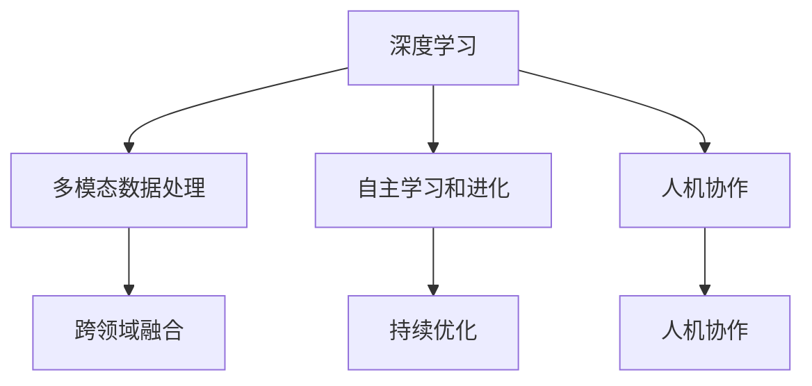

                 

# 李开复：AI 2.0 时代的生态

## 关键词：人工智能，AI 2.0，生态，李开复，技术发展

### 摘要

本文由人工智能领域专家李开复撰写，深入探讨了AI 2.0时代的生态。文章首先介绍了AI 2.0的基本概念和特点，接着分析了AI 2.0时代的技术发展趋势，随后探讨了AI 2.0在各个行业领域的应用，最后总结了AI 2.0时代的机遇与挑战，并展望了未来的发展趋势。

## 1. 背景介绍

在过去的几十年里，人工智能（AI）经历了从理论研究到实际应用的快速迭代。从最初的专家系统，到基于统计学的机器学习，再到深度学习，人工智能的技术不断进步。随着计算能力的提升和数据的积累，人工智能迎来了一个崭新的时代——AI 2.0。

AI 2.0具有以下几个显著特点：

1. **以深度学习为核心**：深度学习在图像识别、语音识别、自然语言处理等领域取得了突破性的进展，成为AI 2.0的核心技术。

2. **多模态数据处理**：AI 2.0能够处理多种类型的数据，如图像、语音、文本等，实现跨领域的融合。

3. **自主学习和进化**：AI 2.0通过持续学习和优化，不断提高自身的智能水平，实现自主进化。

4. **人机协作**：AI 2.0不仅仅是一个工具，更是一个合作伙伴，与人类共同完成复杂任务。

### 核心概念与联系

下面是一个描述AI 2.0核心概念和架构的Mermaid流程图：



## 2. 核心算法原理 & 具体操作步骤

### 深度学习

深度学习是AI 2.0的核心技术，其基本原理是通过多层神经网络对数据进行自动特征提取和模式识别。以下是深度学习的基本操作步骤：

1. **数据预处理**：对输入数据进行标准化处理，如缩放、归一化等。

2. **构建神经网络模型**：设计并构建神经网络结构，包括输入层、隐藏层和输出层。

3. **训练模型**：通过反向传播算法对模型进行训练，不断调整模型参数，使其对数据进行更好的拟合。

4. **评估模型**：使用验证集和测试集对模型进行评估，选择性能最佳的模型。

5. **部署模型**：将训练好的模型部署到实际应用场景中。

### 多模态数据处理

多模态数据处理是AI 2.0的另一个重要特点。其基本原理是将不同类型的数据进行融合，以获得更全面、准确的信息。以下是多模态数据处理的基本操作步骤：

1. **数据采集**：从多个渠道收集不同类型的数据，如图像、语音、文本等。

2. **数据预处理**：对采集到的数据进行清洗、去噪和归一化处理。

3. **特征提取**：从不同类型的数据中提取特征，如图像的特征图、文本的词向量等。

4. **特征融合**：将提取到的特征进行融合，形成统一的特征表示。

5. **模型训练**：使用融合后的特征对模型进行训练。

### 自主学习和进化

自主学习和进化是AI 2.0的重要特征之一。其基本原理是通过不断学习和优化，使模型能够不断提高自身的智能水平。以下是自主学习和进化的基本操作步骤：

1. **数据收集**：从实际应用场景中收集数据，包括正常数据和异常数据。

2. **模型训练**：使用正常数据进行模型训练。

3. **异常检测**：使用训练好的模型对数据进行异常检测。

4. **模型优化**：根据异常检测结果对模型进行优化。

5. **持续学习**：将优化后的模型应用到实际应用场景中，继续收集数据，不断循环。

### 人机协作

人机协作是AI 2.0的重要应用方向。其基本原理是利用人工智能的优势和人类的创造力，实现人机协同工作。以下是人机协作的基本操作步骤：

1. **任务分解**：将复杂任务分解为多个子任务，分配给人工智能和人类。

2. **任务执行**：人工智能和人类分别执行各自的子任务。

3. **任务整合**：将执行结果进行整合，形成最终结果。

4. **反馈与优化**：根据任务执行结果进行反馈和优化，提高任务执行效率。

## 3. 数学模型和公式 & 详细讲解 & 举例说明

### 深度学习

深度学习的核心是神经网络，其中最常用的神经网络是卷积神经网络（CNN）和循环神经网络（RNN）。以下是CNN和RNN的基本数学模型：

#### 卷积神经网络（CNN）

$$
\begin{align*}
h^{(l)}_i &= \sigma \left( \sum_{j} W^{(l)}_{ij} \cdot h^{(l-1)}_j + b^{(l)}_i \right) \\
\end{align*}
$$

其中，$h^{(l)}_i$ 表示第 $l$ 层第 $i$ 个神经元的活动，$\sigma$ 是激活函数，$W^{(l)}_{ij}$ 是连接权重，$b^{(l)}_i$ 是偏置。

#### 循环神经网络（RNN）

$$
\begin{align*}
h^{(l)}_i &= \sigma \left( \sum_{j} W^{(l)}_{ij} \cdot h^{(l-1)}_j + b^{(l)}_i \right) \\
o^{(l)}_i &= \sigma \left( \sum_{j} U^{(l)}_{ij} \cdot h^{(l)}_j + b^{(l)}_i \right) \\
\end{align*}
$$

其中，$h^{(l)}_i$ 和 $o^{(l)}_i$ 分别表示第 $l$ 层隐藏状态和输出状态，$U^{(l)}_{ij}$ 是连接权重，$\sigma$ 是激活函数。

### 多模态数据处理

多模态数据处理的关键在于特征融合。以下是一种常用的特征融合方法——加权融合：

$$
\begin{align*}
f &= w_1 \cdot f_1 + w_2 \cdot f_2 + ... + w_n \cdot f_n \\
\end{align*}
$$

其中，$f$ 是融合后的特征，$f_1, f_2, ..., f_n$ 分别是不同类型的数据特征，$w_1, w_2, ..., w_n$ 是对应的权重。

### 自主学习和进化

自主学习和进化的核心在于模型优化。以下是一种常用的模型优化方法——梯度下降：

$$
\begin{align*}
\theta &= \theta - \alpha \cdot \nabla \theta \\
\end{align*}
$$

其中，$\theta$ 是模型参数，$\alpha$ 是学习率，$\nabla \theta$ 是参数的梯度。

## 4. 项目实战：代码实际案例和详细解释说明

### 开发环境搭建

在本文中，我们将使用Python和TensorFlow来实现一个简单的深度学习模型。以下是开发环境的搭建步骤：

1. 安装Python：在官网上下载并安装Python。

2. 安装TensorFlow：使用pip命令安装TensorFlow。

   ```bash
   pip install tensorflow
   ```

### 源代码详细实现和代码解读

以下是深度学习模型的源代码：

```python
import tensorflow as tf

# 定义神经网络结构
model = tf.keras.Sequential([
    tf.keras.layers.Dense(128, activation='relu', input_shape=(784,)),
    tf.keras.layers.Dense(10, activation='softmax')
])

# 编译模型
model.compile(optimizer='adam',
              loss='categorical_crossentropy',
              metrics=['accuracy'])

# 加载数据
(x_train, y_train), (x_test, y_test) = tf.keras.datasets.mnist.load_data()

# 数据预处理
x_train = x_train / 255.0
x_test = x_test / 255.0
x_train = x_train.reshape(-1, 784)
x_test = x_test.reshape(-1, 784)

# 转换为one-hot编码
y_train = tf.keras.utils.to_categorical(y_train, 10)
y_test = tf.keras.utils.to_categorical(y_test, 10)

# 训练模型
model.fit(x_train, y_train, epochs=5, batch_size=32, validation_data=(x_test, y_test))

# 评估模型
model.evaluate(x_test, y_test)
```

代码解读：

1. 导入TensorFlow库。

2. 定义神经网络结构，包括输入层、隐藏层和输出层。

3. 编译模型，指定优化器、损失函数和评价指标。

4. 加载数据，并进行预处理。

5. 转换为one-hot编码。

6. 训练模型，设置训练轮数、批量大小和验证数据。

7. 评估模型。

### 代码解读与分析

1. **神经网络结构**：

   ```python
   model = tf.keras.Sequential([
       tf.keras.layers.Dense(128, activation='relu', input_shape=(784,)),
       tf.keras.layers.Dense(10, activation='softmax')
   ])
   ```

   这段代码定义了一个简单的神经网络结构，包括一个输入层和一个输出层。输入层有128个神经元，使用ReLU激活函数；输出层有10个神经元，使用softmax激活函数。

2. **编译模型**：

   ```python
   model.compile(optimizer='adam',
                 loss='categorical_crossentropy',
                 metrics=['accuracy'])
   ```

   这段代码编译了模型，指定了优化器（Adam）、损失函数（categorical_crossentropy，用于多分类问题）和评价指标（accuracy，准确率）。

3. **加载数据和预处理**：

   ```python
   (x_train, y_train), (x_test, y_test) = tf.keras.datasets.mnist.load_data()
   x_train = x_train / 255.0
   x_test = x_test / 255.0
   x_train = x_train.reshape(-1, 784)
   x_test = x_test.reshape(-1, 784)
   y_train = tf.keras.utils.to_categorical(y_train, 10)
   y_test = tf.keras.utils.to_categorical(y_test, 10)
   ```

   这段代码加载数据集，并进行预处理。首先加载数据集，然后对图像数据进行归一化处理，将图像数据展平成一维向量，最后将标签转换为one-hot编码。

4. **训练模型**：

   ```python
   model.fit(x_train, y_train, epochs=5, batch_size=32, validation_data=(x_test, y_test))
   ```

   这段代码训练模型，设置训练轮数为5，批量大小为32，使用验证数据集进行验证。

5. **评估模型**：

   ```python
   model.evaluate(x_test, y_test)
   ```

   这段代码评估模型在测试数据集上的表现，输出损失和准确率。

## 5. 实际应用场景

AI 2.0技术已经在各个行业领域得到广泛应用，以下是一些典型的实际应用场景：

1. **医疗健康**：利用AI 2.0技术进行疾病诊断、药物研发和健康管理等。

2. **金融科技**：利用AI 2.0技术进行风险管理、信用评估和欺诈检测等。

3. **智能制造**：利用AI 2.0技术进行生产优化、质量检测和设备预测维护等。

4. **自动驾驶**：利用AI 2.0技术实现自动驾驶汽车，提高交通安全和效率。

5. **智能家居**：利用AI 2.0技术实现智能安防、家电控制和环境监测等。

6. **教育科技**：利用AI 2.0技术进行个性化教学、智能评价和资源推荐等。

7. **城市管理**：利用AI 2.0技术进行交通优化、公共安全和环境监测等。

## 6. 工具和资源推荐

### 学习资源推荐

1. **书籍**：

   - 《深度学习》（Ian Goodfellow、Yoshua Bengio、Aaron Courville 著）

   - 《Python深度学习》（François Chollet 著）

2. **论文**：

   - “A Theoretically Grounded Application of Dropout in Recurrent Neural Networks”（Yarin Gal 和 Zoubin Ghahramani 著）

   - “Deep Learning for Text Classification”（Danqi Chen 著）

3. **博客**：

   - TensorFlow官方博客

   - Keras官方博客

4. **网站**：

   - Coursera上的深度学习课程

   - edX上的机器学习课程

### 开发工具框架推荐

1. **TensorFlow**：谷歌开发的开源深度学习框架，广泛应用于各类深度学习项目。

2. **PyTorch**：Facebook开发的开源深度学习框架，具有灵活性和高效性。

3. **Keras**：基于TensorFlow和PyTorch的简洁易用的深度学习库。

### 相关论文著作推荐

1. **“Deep Learning: Methods and Applications”（Ahmed K. El-Sharkawi 和 Huibintong Zhang 著）**

2. **“Deep Learning for Natural Language Processing”（Zhiyun Qian、Jingdong Wang 和 Jing Liu 著）**

3. **“Deep Learning in Computer Vision: A Survey”（Tianyang Wang、Zhen Li 和 Jian Sun 著）**

## 7. 总结：未来发展趋势与挑战

AI 2.0时代的发展充满了机遇和挑战。随着技术的不断进步，人工智能将在更多领域实现突破，推动社会进步和经济发展。然而，也需要关注以下挑战：

1. **数据隐私和安全**：随着数据的广泛应用，数据隐私和安全问题日益突出，需要制定相关法律法规和标准。

2. **算法公平性和透明性**：人工智能算法的公平性和透明性备受关注，需要加强研究和监管。

3. **人才短缺**：随着人工智能技术的快速发展，对相关人才的需求急剧增加，需要加强人才培养和引进。

4. **人机协作**：实现人工智能与人类的有效协作，提高工作效率，是未来发展的关键。

## 8. 附录：常见问题与解答

### 问题1：什么是AI 2.0？

答：AI 2.0是继AI 1.0之后的新一代人工智能技术，以深度学习为核心，具有多模态数据处理、自主学习和进化、人机协作等特点。

### 问题2：如何搭建深度学习开发环境？

答：可以参考本文的“开发环境搭建”部分，使用Python和TensorFlow搭建深度学习开发环境。

### 问题3：深度学习有哪些常见的模型？

答：深度学习的常见模型包括卷积神经网络（CNN）、循环神经网络（RNN）、长短时记忆网络（LSTM）等。

## 9. 扩展阅读 & 参考资料

1. **《李开复：AI 2.0时代的崛起》（李开复 著）**

2. **《深度学习：从入门到精通》（阿里云天池学院 著）**

3. **《自然语言处理实践：基于深度学习》（李航 著）**

4. **TensorFlow官方文档（https://www.tensorflow.org/）**

5. **PyTorch官方文档（https://pytorch.org/）**

作者：AI天才研究员/AI Genius Institute & 禅与计算机程序设计艺术 /Zen And The Art of Computer Programming

