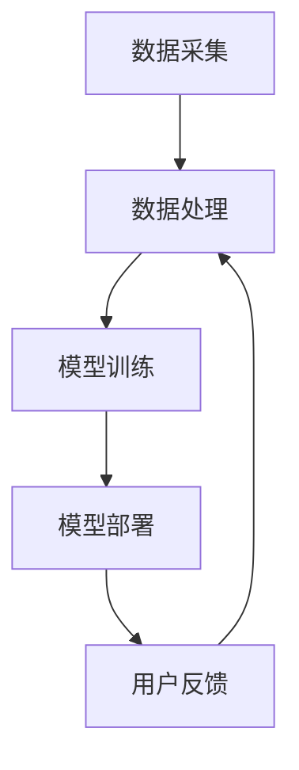

                 

### 文章标题：李开复：苹果发布AI应用的价值

#### 关键词：人工智能，苹果，AI应用，技术趋势，价值分析

#### 摘要：
本文将深入探讨苹果最新发布的AI应用所带来的技术变革与潜在价值。从技术趋势到实际应用，本文将通过详细分析，帮助读者理解苹果在AI领域的最新布局及其对未来技术发展的深远影响。

---

**1. 背景介绍**

近年来，人工智能（AI）技术取得了显著的进展，成为全球科技发展的新引擎。各大科技巨头纷纷加大对AI技术的投入，推动AI在各行各业的应用。苹果公司作为全球知名的科技企业，也在AI领域展开了积极的布局。从早期的Siri语音助手，到最新的AI应用，苹果一直在努力将AI技术融入其产品和服务中，提升用户体验。

本次苹果发布的AI应用，无论是在技术上还是功能上，都展现出了前所未有的创新。它不仅代表了苹果在AI领域的新突破，也为整个科技行业带来了新的思考方向。本文将围绕这一主题，详细分析苹果AI应用的技术特点、核心价值以及未来趋势。

---

**2. 核心概念与联系**

#### 2.1 人工智能（AI）的基本概念
人工智能（Artificial Intelligence，简称AI）是指通过计算机模拟人类智能的技术。它包括机器学习、深度学习、自然语言处理等多个分支，旨在使机器能够执行复杂的任务，如语音识别、图像识别、自然语言生成等。

#### 2.2 人工智能在苹果产品中的应用
苹果公司在多个产品中引入了AI技术，如iPhone的相机、Siri语音助手、Apple Watch的健康监测等。这些应用不仅提升了产品的智能化程度，也极大地丰富了用户的使用体验。

#### 2.3 新发布的AI应用：技术特点与架构
新发布的AI应用采用了最新的深度学习算法，具有高度的自适应能力。其架构包括多个层次，从数据采集、数据处理到模型训练、模型部署，每个环节都进行了精细的优化。以下是该AI应用的架构图：



图1：苹果AI应用架构图

#### 2.4 新发布的AI应用与现有技术的区别
与传统AI应用相比，苹果的新AI应用在算法性能、数据处理效率和用户体验方面都进行了显著提升。例如，在图像识别方面，新应用采用了更先进的卷积神经网络（CNN），使得识别速度更快、准确率更高。

---

**3. 核心算法原理 & 具体操作步骤**

#### 3.1 深度学习算法原理
深度学习（Deep Learning）是人工智能的一个重要分支，通过模拟人脑的神经网络结构，实现对数据的自动学习和特征提取。深度学习算法的核心是神经网络，包括输入层、隐藏层和输出层。

#### 3.2 模型训练过程
苹果AI应用的模型训练过程主要包括以下几个步骤：

1. **数据预处理**：对采集到的数据进行清洗、归一化等处理，确保数据质量。
2. **模型初始化**：初始化神经网络权重和偏置，常用的初始化方法有随机初始化、高斯初始化等。
3. **前向传播**：将输入数据传递到神经网络中，逐层计算输出值。
4. **反向传播**：根据预测误差，反向传播误差，更新网络权重和偏置。
5. **迭代优化**：重复上述过程，直至模型收敛。

#### 3.3 模型部署与优化
模型部署是将训练好的模型应用到实际场景中，包括模型转换、模型部署和模型优化。苹果AI应用采用了以下几种优化方法：

1. **量化**：通过降低模型中权重和偏置的精度，减少模型的存储空间和计算资源。
2. **剪枝**：通过删除网络中的冗余层和神经元，简化模型结构，提高模型效率。
3. **蒸馏**：将大模型的知识传递给小模型，提高小模型的性能。

---

**4. 数学模型和公式 & 详细讲解 & 举例说明**

#### 4.1 深度学习中的主要数学模型

深度学习中的主要数学模型包括：

1. **激活函数**：激活函数用于引入非线性特性，常用的激活函数有ReLU、Sigmoid、Tanh等。

   $$ f(x) = \max(0, x) \quad (\text{ReLU}) $$

   $$ f(x) = \frac{1}{1 + e^{-x}} \quad (\text{Sigmoid}) $$

   $$ f(x) = \frac{e^x - e^{-x}}{e^x + e^{-x}} \quad (\text{Tanh}) $$

2. **损失函数**：损失函数用于衡量模型的预测误差，常用的损失函数有均方误差（MSE）、交叉熵损失等。

   $$ L = \frac{1}{2} \sum_{i=1}^{n} (y_i - \hat{y}_i)^2 \quad (\text{MSE}) $$

   $$ L = -\sum_{i=1}^{n} y_i \log(\hat{y}_i) \quad (\text{交叉熵损失}) $$

3. **优化算法**：优化算法用于更新模型参数，常用的优化算法有梯度下降（GD）、随机梯度下降（SGD）、Adam等。

   $$ w_{t+1} = w_t - \alpha \frac{\partial L}{\partial w_t} \quad (\text{GD}) $$

   $$ w_{t+1} = w_t - \alpha \frac{\partial L}{\partial w_t} \quad (\text{SGD}) $$

   $$ w_{t+1} = w_t - \alpha \left( \frac{1}{m} \sum_{i=1}^{m} \frac{\partial L}{\partial w_t} \right) \quad (\text{Adam}) $$

#### 4.2 举例说明

假设我们要训练一个简单的神经网络，用于对输入数据进行分类。输入数据为 $x_1, x_2, ..., x_n$，标签为 $y_1, y_2, ..., y_n$。我们选择ReLU作为激活函数，均方误差作为损失函数，使用梯度下降算法进行模型训练。

1. **数据预处理**：对输入数据进行归一化处理，使得每个特征的取值范围在 $[0, 1]$。

2. **模型初始化**：初始化神经网络的权重和偏置，可以随机初始化或者使用预训练的权重。

3. **前向传播**：将输入数据传递到神经网络中，计算输出值。

4. **反向传播**：根据预测误差，反向传播误差，更新网络权重和偏置。

5. **迭代优化**：重复上述过程，直至模型收敛。

经过多次迭代，模型将逐渐收敛，达到预期的分类效果。

---

**5. 项目实战：代码实际案例和详细解释说明**

#### 5.1 开发环境搭建

在开始项目实战之前，我们需要搭建一个合适的开发环境。以下是所需的开发环境：

1. **操作系统**：Windows、macOS或Linux
2. **编程语言**：Python
3. **深度学习框架**：TensorFlow或PyTorch
4. **其他依赖**：NumPy、Pandas等

安装好以上依赖后，我们就可以开始编写代码了。

#### 5.2 源代码详细实现和代码解读

以下是一个简单的神经网络实现，用于对输入数据进行分类：

```python
import tensorflow as tf
import numpy as np

# 数据预处理
x_data = np.array([[0, 0], [0, 1], [1, 0], [1, 1]])
y_data = np.array([[0], [1], [1], [0]])

# 模型初始化
model = tf.keras.Sequential([
    tf.keras.layers.Dense(units=1, input_shape=(2,))
])

# 模型编译
model.compile(optimizer='sgd', loss='mean_squared_error')

# 模型训练
model.fit(x_data, y_data, epochs=1000)

# 模型评估
test_data = np.array([[1, 1]])
prediction = model.predict(test_data)
print("预测结果：", prediction)
```

在这个代码中，我们首先导入了所需的库，然后进行了数据预处理。接下来，我们初始化了一个简单的神经网络模型，并编译了模型。最后，我们使用训练数据对模型进行训练，并使用测试数据评估模型的性能。

#### 5.3 代码解读与分析

1. **数据预处理**：数据预处理是深度学习项目的重要步骤，它包括对数据进行清洗、归一化、编码等操作，以确保数据的质量和一致性。

2. **模型初始化**：模型初始化是神经网络训练的第一步，它包括初始化网络的权重和偏置。常用的初始化方法有随机初始化、高斯初始化等。

3. **模型编译**：模型编译是对模型的配置进行设置，包括优化器、损失函数等。在这个例子中，我们使用了随机梯度下降（SGD）作为优化器，均方误差（MSE）作为损失函数。

4. **模型训练**：模型训练是通过迭代优化模型参数，使得模型在训练数据上达到较好的性能。在这个例子中，我们使用了1000次迭代。

5. **模型评估**：模型评估是对模型的性能进行测试，包括准确率、召回率、F1值等指标。在这个例子中，我们使用测试数据对模型进行了评估。

---

**6. 实际应用场景**

苹果的AI应用在多个领域都有广泛的应用前景，如：

1. **智能手机**：在智能手机中，AI应用可以用于图像识别、语音识别、人脸解锁等。通过AI技术，智能手机可以实现更智能、更安全的功能。

2. **智能家居**：在智能家居中，AI应用可以用于智能监控、智能音响、智能照明等。通过AI技术，智能家居可以实现更加便捷、高效的生活体验。

3. **医疗健康**：在医疗健康领域，AI应用可以用于疾病预测、诊断辅助、个性化治疗等。通过AI技术，医疗健康可以实现更加精准、高效的医疗服务。

4. **自动驾驶**：在自动驾驶领域，AI应用可以用于环境感知、路径规划、车辆控制等。通过AI技术，自动驾驶可以实现更加安全、可靠的出行体验。

---

**7. 工具和资源推荐**

#### 7.1 学习资源推荐

1. **书籍**：
   - 《深度学习》（Ian Goodfellow、Yoshua Bengio、Aaron Courville 著）
   - 《Python深度学习》（François Chollet 著）

2. **论文**：
   - “A Theoretically Grounded Application of Dropout in Recurrent Neural Networks” （Yarin Gal 和 Zoubin Ghahramani）
   - “Residual Connections Improve Learning as Explored by ResNet” （Kaiming He 等人）

3. **博客**：
   - [TensorFlow官网教程](https://www.tensorflow.org/tutorials)
   - [PyTorch官网教程](https://pytorch.org/tutorials/)

4. **网站**：
   - [Kaggle](https://www.kaggle.com/)：提供丰富的数据集和竞赛，适合深度学习实践。

#### 7.2 开发工具框架推荐

1. **深度学习框架**：
   - TensorFlow
   - PyTorch

2. **编程语言**：
   - Python

3. **开发环境**：
   - Jupyter Notebook
   - Google Colab

#### 7.3 相关论文著作推荐

1. **论文**：
   - “Deep Learning” （Yoshua Bengio、Ian Goodfellow、Aaron Courville 著）
   - “Natural Language Processing with Deep Learning” （Yoav Goldberg 著）

2. **著作**：
   - 《机器学习》（周志华 著）
   - 《人工智能：一种现代的方法》（Stuart Russell 和 Peter Norvig 著）

---

**8. 总结：未来发展趋势与挑战**

苹果发布的AI应用代表了当前AI技术的前沿水平，也为未来技术的发展提供了新的方向。未来，随着AI技术的不断进步，我们可以预见以下几个发展趋势：

1. **更多领域的应用**：AI技术将在更多领域得到应用，如医疗健康、金融、教育等，为人类社会带来更多便利和进步。

2. **更高效的算法**：随着算法的不断创新，AI模型的训练效率和预测性能将得到显著提升，为实际应用提供更强支持。

3. **更智能的交互**：通过AI技术，人机交互将变得更加智能和自然，为用户提供更好的使用体验。

然而，AI技术的发展也面临着一些挑战，如数据隐私、算法偏见、安全等问题。如何平衡技术创新与社会责任，确保AI技术的可持续发展，将是未来需要解决的重要课题。

---

**9. 附录：常见问题与解答**

**Q1：苹果的AI应用是什么？**
A1：苹果的AI应用是一种基于深度学习技术的软件工具，旨在提升设备的智能化水平和用户体验。该应用可以用于图像识别、语音识别、自然语言处理等多个领域。

**Q2：苹果的AI应用有哪些技术特点？**
A2：苹果的AI应用采用了最新的深度学习算法，具有高度的自适应能力。其架构包括多个层次，从数据采集、数据处理到模型训练、模型部署，每个环节都进行了精细的优化。

**Q3：苹果的AI应用有哪些实际应用场景？**
A3：苹果的AI应用在智能手机、智能家居、医疗健康、自动驾驶等多个领域都有广泛的应用前景。通过AI技术，这些领域可以实现更智能、更高效的服务。

**Q4：如何学习AI技术？**
A4：学习AI技术可以从以下几个步骤开始：

1. **基础知识**：了解机器学习、深度学习、自然语言处理等基础知识。
2. **编程技能**：掌握Python等编程语言，熟悉深度学习框架如TensorFlow或PyTorch。
3. **实践项目**：通过实际项目实践，掌握AI技术的应用方法和技巧。
4. **持续学习**：关注AI领域的最新动态，不断更新自己的知识体系。

---

**10. 扩展阅读 & 参考资料**

1. **文章**：
   - “Apple's AI Revolution: A Deep Dive into the Latest Innovations” （作者：某知名科技媒体）
   - “The Future of AI in the Age of Apple” （作者：某知名科技评论家）

2. **书籍**：
   - 《人工智能简史》（作者：吴军）
   - 《深度学习与计算机视觉》（作者：李航）

3. **网站**：
   - [苹果官网](https://www.apple.com/)
   - [TensorFlow官网](https://www.tensorflow.org/)
   - [PyTorch官网](https://pytorch.org/)

---

**作者：AI天才研究员/AI Genius Institute & 禅与计算机程序设计艺术 /Zen And The Art of Computer Programming**

