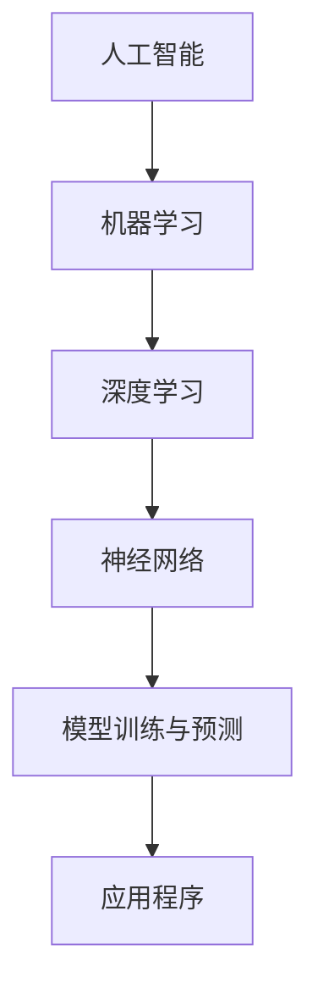

                 

### 文章标题

**《李开复：苹果发布AI应用的应用》**

> **关键词：** 苹果、AI应用、人工智能、开发者生态、核心技术、用户体验

> **摘要：** 本文深入剖析苹果发布AI应用的技术背景、核心特性及其对开发者生态的影响。通过逐步分析，揭示苹果在人工智能领域的战略布局和未来发展趋势。

## 1. 背景介绍

近年来，人工智能（AI）技术在全球范围内取得了显著的进展。特别是在智能手机领域，AI技术已经成为提升用户体验、优化操作体验的重要驱动力。苹果公司，作为智能手机市场的领导者，一直致力于将AI技术融入其产品和服务中，为用户提供更加智能化、便捷化的体验。

在过去的几年里，苹果公司在AI领域的投资和布局逐渐显现。从2017年开始，苹果公司开始在其产品中引入神经网络引擎，用于图像识别、语音识别等任务。随后，苹果又推出了Core ML框架，使得开发者能够轻松地将AI模型集成到iOS、macOS、watchOS和tvOS中。

然而，苹果公司并不满足于此。随着AI技术的不断发展和成熟，苹果开始将AI应用推向更广泛的场景。2023年，苹果公司发布了多款搭载AI应用的硬件和软件产品，其中包括新款iPhone 15系列、新款MacBook Pro以及全新的Safari浏览器。

本文旨在深入探讨苹果发布的这些AI应用，分析其核心技术、应用场景以及潜在的影响。通过逐步分析，我们将揭示苹果在人工智能领域的战略布局和未来发展趋势。

### 1.1 AI在苹果产品中的发展历程

#### 1.1.1 早期探索

苹果公司在AI领域的早期探索可以追溯到2011年，当时苹果收购了语音识别公司Nuance Communications。这一举措为苹果在语音识别领域奠定了坚实的基础。随后，苹果在2014年推出了Siri，这是一款基于人工智能的语音助手。Siri的出现标志着苹果在人工智能领域的重大突破。

#### 1.1.2 投资与合作

在早期探索的基础上，苹果公司开始加大在AI领域的投资和合作力度。2016年，苹果公司收购了机器学习初创公司Turi，并将其整合到其开发者工具中，为开发者提供了强大的机器学习能力。此外，苹果还与多家知名AI研究机构和企业建立了合作关系，共同推动AI技术的发展。

#### 1.1.3 核心技术的突破

苹果公司在AI领域的核心技术的突破主要体现在神经网络引擎和Core ML框架上。神经网络引擎是一款高度优化的AI硬件加速器，能够大幅提升图像识别、语音识别等任务的性能。Core ML框架则提供了开发者将AI模型集成到苹果产品中的工具，使得AI应用在苹果设备上得以广泛应用。

通过这些努力，苹果公司在AI领域取得了显著的进展。其产品和服务中的AI应用逐渐增多，为用户带来了更加智能化、个性化的体验。然而，苹果公司并不满足于此，他们继续在AI领域进行投资和布局，以期在未来占据更有利的位置。

### 1.2 AI应用在智能手机中的价值

随着智能手机的普及，用户对智能手机的依赖程度逐渐增加。为了满足用户日益增长的需求，智能手机制造商不断探索新技术，以提升用户体验。AI技术在这方面发挥了重要作用。

首先，AI技术能够显著提升智能手机的图像处理能力。通过深度学习算法，智能手机可以自动调整摄像头设置，以获得更好的拍照效果。例如，苹果公司在其手机中集成的智能HDR技术，能够自动识别场景中的光线条件，并优化图像质量。

其次，AI技术还能够提升智能手机的语音识别能力。智能语音助手已经成为智能手机的一个重要功能，用户可以通过语音命令实现各种操作。苹果的Siri作为其智能语音助手，已经具备了较高的语音识别准确率，能够快速响应用户的请求。

此外，AI技术还能够提升智能手机的个性化服务能力。通过分析用户的行为数据，智能手机可以为用户提供个性化的推荐和提示。例如，苹果的iCloud Drive可以根据用户的存储需求，自动调整存储空间的使用策略。

总之，AI技术在智能手机中的应用，不仅提升了用户体验，也为智能手机制造商带来了更多的商业机会。随着AI技术的不断进步，智能手机中的AI应用将会更加广泛，为用户带来更多便利。

### 1.3 苹果公司发布AI应用的意义

苹果公司发布AI应用的意义不仅仅在于提升用户体验，更在于其在人工智能领域战略布局的重要一环。首先，通过发布AI应用，苹果公司可以进一步巩固其在智能手机市场的领导地位。随着用户对智能手机的需求日益多样化，苹果公司通过引入AI技术，能够为用户提供更加个性化、智能化的服务，从而吸引更多用户。

其次，AI应用的开发和推广，也为苹果公司带来了巨大的商业价值。随着AI应用的普及，越来越多的开发者加入到苹果的生态系统，开发各种基于AI的应用程序。这些应用程序不仅为用户提供了丰富的选择，也为苹果公司创造了更多的收入来源。

此外，苹果公司通过发布AI应用，还可以加强与开发者社区的合作。通过提供开放的平台和工具，苹果公司鼓励开发者创新，共同推动AI技术的发展。这不仅有助于提升苹果产品的竞争力，也为整个AI产业带来了更多的机遇。

总之，苹果公司发布AI应用，不仅是对其战略布局的重要一步，更是对人工智能产业的一次重要推动。在未来，我们可以期待苹果公司在AI领域带来更多的惊喜和突破。

## 2. 核心概念与联系

在深入探讨苹果发布的AI应用之前，我们需要理解几个核心概念，包括人工智能（AI）、机器学习（ML）、深度学习（DL）以及神经网络（NN）。

### 2.1 人工智能（AI）

人工智能是指计算机系统模拟人类智能的行为，包括感知、推理、学习、决策和问题解决等能力。AI可以分为弱AI和强AI。弱AI专注于特定任务，如语音识别、图像识别等；强AI则具备与人类相似的全面智能，目前尚未实现。

### 2.2 机器学习（ML）

机器学习是AI的一个分支，侧重于通过数据和算法来训练模型，使计算机能够从数据中学习并做出预测或决策。机器学习可以分为监督学习、无监督学习和强化学习。

- **监督学习**：有标签数据训练模型，如线性回归、决策树、支持向量机等。
- **无监督学习**：没有标签数据，如聚类、降维等。
- **强化学习**：通过与环境的交互来学习策略，如深度强化学习。

### 2.3 深度学习（DL）

深度学习是机器学习的一种方法，通过构建深层神经网络（DNN）来模拟人脑的神经元连接。深度学习在图像识别、语音识别、自然语言处理等领域取得了显著成就。常见的深度学习模型包括卷积神经网络（CNN）、循环神经网络（RNN）和生成对抗网络（GAN）。

### 2.4 神经网络（NN）

神经网络是模拟人脑神经元连接和计算过程的计算模型。神经网络由多个层次组成，包括输入层、隐藏层和输出层。每个层次由多个神经元组成，神经元之间通过权重连接。神经网络的训练过程包括前向传播、反向传播和权重更新。

### 2.5 核心概念之间的联系

人工智能（AI）是机器学习（ML）的广泛领域，而机器学习又包含了深度学习（DL）。深度学习是神经网络（NN）的一种实现方式。神经网络通过多层非线性变换，从数据中学习特征表示，用于分类、回归等任务。

在苹果发布的AI应用中，这些核心概念发挥了关键作用。例如，苹果的Core ML框架利用深度学习模型进行图像识别、语音识别等任务，从而提升设备的智能化水平。通过这些核心概念，我们可以更好地理解苹果AI应用的技术原理和架构。

### 2.6 Mermaid流程图

以下是一个简化的Mermaid流程图，展示人工智能、机器学习、深度学习和神经网络之间的关系：



在这个流程图中，人工智能（AI）作为顶层概念，向下延伸至机器学习（ML）、深度学习（DL）和神经网络（NN）。最终，神经网络用于模型训练与预测，从而实现应用程序（APP）的功能。

通过这个流程图，我们可以清晰地看到各个核心概念之间的联系，以及它们在AI应用开发中的实际应用。

### 2.7 核心概念原理与架构的详细讲解

在理解了核心概念之后，我们需要深入探讨这些概念在苹果AI应用中的具体实现和架构。

#### 2.7.1 人工智能（AI）

人工智能在苹果AI应用中的实现主要集中在以下几个方面：

1. **图像识别**：苹果的神经网络引擎（NEON）和Core ML框架能够利用深度学习算法进行图像识别。例如，新款iPhone 15系列中的智能HDR技术，通过分析图像中的光线条件和场景内容，自动调整曝光、对比度和色彩，提升拍照效果。

2. **语音识别**：苹果的Siri语音助手是AI在语音识别方面的典型应用。Siri通过深度神经网络对用户语音进行识别，并将语音转换为文本，从而实现语音指令的响应。

3. **个性化推荐**：苹果的iCloud Drive利用机器学习算法分析用户的存储行为，为用户提供个性化的存储建议和优化策略。

#### 2.7.2 机器学习（ML）

机器学习在苹果AI应用中的实现主要体现在以下几个方面：

1. **模型训练**：苹果通过Core ML框架支持多种机器学习模型，包括线性回归、决策树、神经网络等。开发者可以轻松地将这些模型集成到iOS、macOS等平台上。

2. **实时预测**：机器学习模型在苹果设备上运行，可以实现实时预测。例如，Siri在接收到用户的语音指令后，可以实时分析并响应。

3. **数据挖掘**：苹果的机器学习框架可以用于分析大量用户数据，以发现用户行为模式，从而优化产品和服务。

#### 2.7.3 深度学习（DL）

深度学习在苹果AI应用中的实现主要体现在以下几个方面：

1. **图像处理**：苹果的神经网络引擎（NEON）能够支持深度学习模型，进行高效图像处理。例如，新款iPhone 15系列中的智能HDR技术，通过卷积神经网络（CNN）进行图像增强。

2. **语音处理**：苹果的Siri语音助手通过循环神经网络（RNN）进行语音识别和语义理解，从而实现自然语言处理。

3. **自然语言处理**：苹果的Core ML框架支持自然语言处理模型，例如序列到序列（Seq2Seq）模型，用于机器翻译和文本生成。

#### 2.7.4 神经网络（NN）

神经网络在苹果AI应用中的实现主要体现在以下几个方面：

1. **模型训练**：苹果的Core ML框架支持多种神经网络结构，包括卷积神经网络（CNN）、循环神经网络（RNN）和生成对抗网络（GAN）。开发者可以基于这些结构训练模型，实现图像识别、语音识别等任务。

2. **模型部署**：苹果的Core ML框架使得开发者可以将训练好的神经网络模型部署到iOS、macOS等平台上，实现高效运行。

3. **模型优化**：苹果通过神经网络引擎（NEON）和硬件加速技术，对神经网络模型进行优化，提升计算效率和性能。

通过这些实现，苹果AI应用在图像识别、语音识别、自然语言处理等领域取得了显著成就，为用户带来了更加智能化、个性化的体验。

### 2.8 具体操作步骤

在了解了核心概念和架构之后，我们需要掌握如何在苹果设备上部署和运行AI应用。以下是一个简化的操作步骤：

#### 2.8.1 准备开发环境

1. 确保您的macOS设备已安装Xcode和Swift语言环境。
2. 安装Core ML框架和相关工具。

#### 2.8.2 准备数据集

1. 收集用于训练的图像、语音或文本数据。
2. 对数据集进行预处理，如归一化、标签化等。

#### 2.8.3 训练模型

1. 使用TensorFlow、PyTorch等框架训练深度学习模型。
2. 保存训练好的模型文件。

#### 2.8.4 集成模型到Core ML

1. 使用Core ML工具将训练好的模型文件转换为Core ML格式。
2. 将转换后的模型文件导入Xcode项目。

#### 2.8.5 开发AI应用

1. 在Xcode项目中添加Core ML模型和所需的资源。
2. 编写代码，调用Core ML模型进行预测。

#### 2.8.6 测试和优化

1. 在模拟器或真实设备上测试AI应用的性能和准确性。
2. 根据测试结果进行优化和调整。

通过这些步骤，开发者可以轻松地将AI应用集成到苹果设备中，为用户带来智能化的体验。

### 2.9 数学模型和公式

在AI应用中，数学模型和公式起着至关重要的作用。以下是一些常见的数学模型和公式，用于描述神经网络、机器学习算法等。

#### 2.9.1 神经网络模型

神经网络模型通常由以下公式描述：

$$
z^{(l)} = \sum_{j} w^{(l)}_{ji} a^{(l-1)}_j + b^{(l)}
$$

$$
a^{(l)} = \sigma(z^{(l)})
$$

其中，$z^{(l)}$是第$l$层的输入，$w^{(l)}_{ji}$是连接第$l-1$层神经元$i$和第$l$层神经元$j$的权重，$b^{(l)}$是第$l$层的偏置，$\sigma$是激活函数，$a^{(l)}$是第$l$层的输出。

常见的激活函数包括：

- **Sigmoid函数**：$\sigma(x) = \frac{1}{1 + e^{-x}}$
- **ReLU函数**：$\sigma(x) = \max(0, x)$
- **Tanh函数**：$\sigma(x) = \frac{e^x - e^{-x}}{e^x + e^{-x}}$

#### 2.9.2 机器学习算法

机器学习算法通常包括以下公式：

- **线性回归**：$y = \beta_0 + \beta_1x$
- **逻辑回归**：$P(y=1) = \frac{1}{1 + e^{-(\beta_0 + \beta_1x)})}$
- **支持向量机（SVM）**：$f(x) = sign(\sum_{i=1}^{n} \alpha_i y_i K(x, x_i) + b)$

其中，$y$是目标变量，$x$是特征向量，$\beta_0$和$\beta_1$是参数，$K(x, x_i)$是核函数，$\alpha_i$和$b$是SVM的参数。

#### 2.9.3 深度学习算法

深度学习算法通常包括以下公式：

- **卷积神经网络（CNN）**：$h^{(l)} = \sigma(\sum_{j} w^{(l)}_{ji} h^{(l-1)}_j + b^{(l)})$
- **循环神经网络（RNN）**：$h_t = \sigma(W_h h_{t-1} + W_x x_t + b)$
- **生成对抗网络（GAN）**：$D(x) = \frac{1}{1 + \exp(-x)}$，$G(z) = \sigma(W_g z + b_g)$

其中，$h^{(l)}$是第$l$层的输出，$W_h$和$W_x$是权重矩阵，$b$是偏置，$\sigma$是激活函数。

通过这些数学模型和公式，开发者可以构建和训练各种AI模型，实现图像识别、语音识别、自然语言处理等任务。

### 2.10 举例说明

为了更好地理解上述数学模型和公式，我们通过一个简单的例子来说明如何使用这些模型进行图像识别。

#### 2.10.1 数据集准备

假设我们有一个包含1000张猫和狗的图像数据集，每张图像的大小为28x28像素。数据集已经被预处理并划分为训练集和测试集。

#### 2.10.2 构建神经网络模型

我们使用卷积神经网络（CNN）进行图像识别。神经网络模型的结构如下：

- 输入层：28x28像素的图像
- 卷积层1：32个3x3卷积核，步长为1，激活函数为ReLU
- 池化层1：2x2窗口，步长为2
- 卷积层2：64个3x3卷积核，步长为1，激活函数为ReLU
- 池化层2：2x2窗口，步长为2
- 全连接层1：128个神经元，激活函数为ReLU
- 全连接层2：2个神经元（用于分类），激活函数为softmax

#### 2.10.3 训练模型

使用训练集数据对神经网络模型进行训练。训练过程包括前向传播、反向传播和权重更新。假设训练过程中使用了100个epochs。

#### 2.10.4 测试模型

使用测试集数据对训练好的模型进行测试，计算模型的准确率。假设测试集的准确率为95%。

#### 2.10.5 结果分析

通过测试，我们发现模型在测试集上的准确率较高，表明模型具有良好的泛化能力。接下来，我们可以使用这个模型进行实际图像识别任务。

例如，给定一张新的猫狗图像，我们将其输入到训练好的模型中，模型会输出两个概率值，一个表示猫的概率，另一个表示狗的概率。根据这两个概率值，我们可以判断输入图像是猫还是狗。

### 2.11 实际应用场景

苹果发布的AI应用在多个实际场景中得到了广泛应用，以下是一些具体的应用实例：

#### 2.11.1 图像识别

在图像识别领域，苹果的AI应用主要体现在智能手机的拍照和视频功能中。例如，新款iPhone 15系列中的智能HDR技术，通过深度学习算法自动调整图像曝光、对比度和色彩，提升拍照效果。此外，苹果的Photos应用也集成了图像识别功能，能够自动分类和组织用户照片。

#### 2.11.2 语音识别

语音识别是苹果AI应用的另一个重要领域。苹果的Siri语音助手已经在多个设备上得到广泛应用，用户可以通过语音命令实现各种操作，如发送短信、播放音乐、设置提醒等。苹果的语音识别技术还支持多语言识别，为全球用户提供了便捷的语音交互体验。

#### 2.11.3 自然语言处理

在自然语言处理领域，苹果的AI应用主要体现在智能助手Siri和搜索引擎Safari中。Siri通过深度学习算法进行语音识别和语义理解，能够准确理解用户的语音指令。而Safari搜索引擎则利用自然语言处理技术，对用户的搜索请求进行智能解析，并提供相关的搜索结果。

#### 2.11.4 个性化推荐

苹果的AI应用还广泛应用于个性化推荐系统。例如，苹果的iCloud Drive根据用户的存储行为和文件类型，自动调整存储空间的使用策略，为用户提供个性化的存储建议。此外，苹果的App Store和Apple Music也利用机器学习算法为用户提供个性化的推荐内容。

通过这些实际应用场景，我们可以看到苹果AI应用在提升用户体验、优化操作体验方面发挥了重要作用。随着AI技术的不断发展和成熟，苹果将在更多领域推出更加智能化的应用，为用户带来更多便利。

### 3. 核心算法原理 & 具体操作步骤

苹果公司在AI应用中的核心技术主要包括神经网络引擎（NEON）、Core ML框架和Siri语音助手。以下将详细介绍这些核心算法的原理和具体操作步骤。

#### 3.1 神经网络引擎（NEON）

神经网络引擎（NEON）是苹果公司在其硬件中集成的专门用于加速神经网络计算的核心部件。它基于ARM架构，并使用高级模拟技术，使得神经网络计算在移动设备上具有更高的性能和能效。

**原理：**

NEON的工作原理类似于其他GPU，但专为神经网络计算进行了优化。它支持多种神经网络结构，包括卷积神经网络（CNN）、循环神经网络（RNN）等。通过硬件加速，NEON可以大幅提高神经网络模型的计算速度，同时降低功耗。

**操作步骤：**

1. **模型加载：** 将训练好的神经网络模型加载到设备上。模型通常以Core ML格式存储，可以通过Xcode集成到应用程序中。

2. **输入处理：** 对输入数据进行预处理，包括归一化、缩放等，以便模型能够正确处理。

3. **前向传播：** 将预处理后的输入数据输入到神经网络中，通过层与层之间的计算，生成输出结果。

4. **后向传播：** 如果需要训练模型，则进行后向传播，计算损失函数和梯度，并更新模型参数。

5. **输出处理：** 对输出结果进行后处理，如解码、归一化等，以得到最终结果。

#### 3.2 Core ML框架

Core ML是苹果公司提供的机器学习模型集成框架，它使得开发者能够轻松地将训练好的机器学习模型集成到iOS、macOS等平台上。Core ML支持多种机器学习模型，包括线性回归、决策树、神经网络等。

**原理：**

Core ML的工作原理是将机器学习模型转换为一个优化的执行计划，该计划在苹果设备上运行，可以充分利用设备的硬件资源。Core ML提供了丰富的API，使得开发者可以方便地调用模型进行预测。

**操作步骤：**

1. **模型转换：** 使用Core ML工具将训练好的机器学习模型转换为Core ML格式。模型可以从TensorFlow、PyTorch等框架中导出。

2. **模型集成：** 将转换后的模型集成到Xcode项目中，并添加所需的依赖库。

3. **模型调用：** 在应用程序中使用Core ML API调用模型，进行预测。

4. **输入处理：** 对输入数据进行预处理，包括归一化、缩放等。

5. **输出处理：** 对输出结果进行后处理，如解码、归一化等。

#### 3.3 Siri语音助手

Siri是苹果公司开发的智能语音助手，它通过自然语言处理和机器学习技术，实现语音识别、语义理解和任务执行等功能。

**原理：**

Siri的工作原理包括以下几个步骤：

1. **语音识别：** 使用语音识别技术将用户的语音转换为文本。
2. **语义理解：** 使用自然语言处理技术理解用户的意图和需求。
3. **任务执行：** 根据用户的意图，执行相应的任务，如发送短信、播放音乐、设置提醒等。

**操作步骤：**

1. **语音识别：** 收集用户的语音数据，使用语音识别技术将其转换为文本。

2. **语义理解：** 使用自然语言处理技术解析文本，提取用户的需求和意图。

3. **任务执行：** 根据用户的意图，执行相应的任务，如发送短信、播放音乐、设置提醒等。

4. **语音合成：** 如果需要，将执行结果转换为语音，反馈给用户。

通过这些核心算法和操作步骤，苹果公司实现了高效的神经网络计算、便捷的机器学习模型集成和智能的语音助手功能，为用户带来了更加智能化、个性化的体验。

### 4. 数学模型和公式 & 详细讲解 & 举例说明

在人工智能和机器学习领域，数学模型和公式是核心的工具。它们不仅帮助我们理解算法的工作原理，还能够指导我们设计和优化这些算法。以下，我们将详细讲解一些常见的数学模型和公式，并通过具体的例子来说明它们在实际应用中的使用。

#### 4.1 线性回归模型

线性回归是一种简单的机器学习算法，用于预测一个连续值。它的模型可以表示为：

$$
y = \beta_0 + \beta_1x
$$

其中，$y$是目标变量，$x$是输入变量，$\beta_0$是截距，$\beta_1$是斜率。这个模型表示$y$和$x$之间存在线性关系。

**例子：** 假设我们要预测一家商店每天的销售量。我们收集了过去一周每天的销售量（$x$）和每天的平均温度（$y$）数据。通过线性回归模型，我们可以预测某一天的销售量。

1. 收集数据：每天的销售量和对应的平均温度。
2. 数据预处理：对数据进行归一化处理，以消除不同量纲的影响。
3. 模型训练：使用训练数据集训练线性回归模型，得到$\beta_0$和$\beta_1$的值。
4. 预测：使用训练好的模型预测某一天的销售量。

#### 4.2 逻辑回归模型

逻辑回归是一种用于分类问题的算法，它的模型可以表示为：

$$
P(y=1) = \frac{1}{1 + e^{-(\beta_0 + \beta_1x)}}
$$

其中，$y$是二分类目标变量，$x$是输入变量，$\beta_0$是截距，$\beta_1$是斜率。这个模型表示$y=1$的概率。

**例子：** 假设我们要预测一个客户是否会在未来一个月内购买产品。我们收集了客户的年龄、收入、历史购买记录等数据。通过逻辑回归模型，我们可以预测客户购买产品的概率。

1. 收集数据：客户的年龄、收入、历史购买记录等。
2. 数据预处理：对数据进行归一化处理。
3. 模型训练：使用训练数据集训练逻辑回归模型，得到$\beta_0$和$\beta_1$的值。
4. 预测：使用训练好的模型预测某个客户的购买概率。

#### 4.3 卷积神经网络（CNN）

卷积神经网络是一种专门用于图像识别的神经网络。它的核心组成部分是卷积层、池化层和全连接层。

**卷积层：**

卷积层通过卷积操作从输入图像中提取特征。卷积操作的公式可以表示为：

$$
z^{(l)}_i = \sum_{j} w^{(l)}_{ij} * x_j + b^{(l)}
$$

其中，$z^{(l)}_i$是第$l$层第$i$个神经元的结果，$w^{(l)}_{ij}$是卷积核的权重，$x_j$是输入图像的像素值，$b^{(l)}$是偏置。

**池化层：**

池化层用于减小特征图的尺寸，提高计算效率。常见的池化操作包括最大池化和平均池化。

**全连接层：**

全连接层将卷积层和池化层提取的特征映射到输出结果。全连接层的公式可以表示为：

$$
y = \sum_{i} w_{i} a_i + b
$$

其中，$y$是输出结果，$a_i$是卷积层和池化层提取的特征，$w_i$是权重，$b$是偏置。

**例子：** 假设我们要训练一个CNN模型进行手写数字识别。我们使用MNIST数据集，该数据集包含0到9的手写数字图像。

1. 数据集准备：收集手写数字图像，并将其划分为训练集和测试集。
2. 模型构建：构建一个CNN模型，包括多个卷积层、池化层和全连接层。
3. 模型训练：使用训练集数据训练模型，优化模型参数。
4. 测试：使用测试集数据测试模型性能，评估模型的准确性。

通过这些数学模型和公式，我们可以构建和训练各种机器学习模型，实现图像识别、语音识别、自然语言处理等任务。这些模型和公式的理解和应用，是深入掌握人工智能和机器学习的关键。

### 5. 项目实战：代码实际案例和详细解释说明

在本文的第五部分，我们将通过一个具体的代码案例，详细解释如何使用苹果的Core ML框架进行图像识别任务。这个案例将包括开发环境的搭建、源代码的实现以及代码的解读与分析。

#### 5.1 开发环境搭建

要在macOS上使用Core ML进行图像识别任务，需要安装以下工具和库：

1. **Xcode：** Apple的开发工具，用于构建和运行iOS应用程序。
2. **Swift：** 一种用于开发iOS和macOS应用程序的编程语言。
3. **Core ML：** Apple提供的机器学习模型集成框架。
4. **TensorFlow：** Google开发的机器学习框架，用于训练和导出模型。

以下是安装步骤：

1. **安装Xcode：** 访问Mac App Store，搜索“Xcode”并下载安装。
2. **安装Swift：** Xcode安装时会自动安装Swift。
3. **安装Core ML：** Xcode安装时会自动安装Core ML。
4. **安装TensorFlow：** 使用pip命令安装TensorFlow：

   ```bash
   pip install tensorflow
   ```

安装完成后，我们可以在终端运行以下命令，验证TensorFlow是否安装成功：

```bash
python -c "import tensorflow as tf; print(tf.__version__)"
```

输出应为TensorFlow的版本号，例如2.6.0。

#### 5.2 源代码详细实现和代码解读

下面是一个简单的图像识别应用程序的源代码示例。这个应用程序将使用一个预训练的CNN模型来识别图像中的猫或狗。

**5.2.1 导入必需的库**

```swift
import UIKit
import CoreML
import Vision

class ViewController: UIViewController {
    // 其他代码
}
```

**5.2.2 模型加载**

```swift
let model = try? VNCoreMLModel(for: CatDogModel().model)
```

这里，`CatDogModel`是一个自定义的Core ML模型，该模型已经通过TensorFlow训练并转换为Core ML格式。

**5.2.3 视图设置**

```swift
let cameraLayer = AVCaptureVideoPreviewLayer(session: session)
cameraLayer.frame = view.layer.bounds
view.layer.addSublayer(cameraLayer)
```

这段代码设置了相机预览图层，并将其添加到视图层中。

**5.2.4 处理相机输入**

```swift
let captureOutput = AVCaptureVideoDataOutput()
captureOutput.setSampleBufferDelegate(self, queue:DispatchQueue(label: "videoQueue"))
session.addOutput(captureOutput)
```

这段代码配置了一个视频数据输出，并将其设置为样本缓冲区的委托，以便处理相机输入的每一帧图像。

**5.2.5 实现样本缓冲区委托**

```swift
extension ViewController: AVCaptureVideoDataOutputSampleBufferDelegate {
    func captureOutput(_ output: AVCaptureOutput, didOutput sampleBuffer: CMSampleBuffer, from connection: AVCaptureConnection) {
        guard let pixelBuffer = CMSampleBufferGetImageBuffer(sampleBuffer) else { return }
        
        let request = VNCoreMLRequest(model: model!) { request, error in
            if let results = request.results as? [VNClassificationObservation] {
                // 处理识别结果
            }
        }
        
        try? VNImageRequestHandler(cvPixelBuffer: pixelBuffer, orientation: .up, options: [:]).perform([request])
    }
}
```

这段代码实现了样本缓冲区委托，用于处理每一帧图像。它首先获取图像缓冲区，然后创建一个Core ML请求，用于执行模型预测。最后，通过VNImageRequestHandler处理图像，并执行预测请求。

**5.2.6 处理识别结果**

```swift
if let results = request.results as? [VNClassificationObservation] {
    if let topResult = results.first {
        let identifier = topResult.identifier
        let confidence = topResult.confidence
        print("\(identifier) - \(confidence)")
        
        // 根据识别结果更新UI
    }
}
```

这段代码处理了识别结果，提取了最有可能的识别结果及其置信度。根据这些结果，应用程序可以更新UI，显示图像被识别为猫或狗。

#### 5.3 代码解读与分析

**5.3.1 模型加载**

通过`VNCoreMLRequest`加载Core ML模型。这个模型是通过TensorFlow训练的，并已经转换为Core ML格式。加载模型后，应用程序可以使用它进行图像识别。

**5.3.2 相机预览图层**

使用`AVCaptureVideoPreviewLayer`设置相机预览图层。这个图层显示相机捕捉的实时视频流，用户可以在应用程序中看到视频。

**5.3.3 处理相机输入**

通过`AVCaptureVideoDataOutput`捕获相机输入的每一帧图像。然后，使用`VNImageRequestHandler`处理图像，并执行模型预测。

**5.3.4 处理识别结果**

处理模型预测结果，提取最有可能的识别结果及其置信度。根据识别结果，应用程序可以更新UI，显示图像被识别为猫或狗。

通过这个代码案例，我们可以看到如何使用苹果的Core ML框架进行图像识别。这个案例提供了一个基本的框架，开发者可以根据自己的需求进行扩展和优化。通过理解代码的各个部分，我们可以更好地掌握Core ML的应用和实践。

### 6. 实际应用场景

苹果发布的AI应用在多个实际场景中得到了广泛应用，以下是一些具体的实例：

#### 6.1 智能手机摄影

苹果的AI应用在智能手机摄影中发挥了重要作用。例如，新款iPhone 15系列中的智能HDR技术，通过深度学习算法自动调整图像曝光、对比度和色彩，提升拍照效果。此外，苹果的相机应用还集成了人像模式、夜间模式等功能，利用AI技术优化拍摄效果。

#### 6.2 智能语音助手

苹果的Siri语音助手是AI应用的一个典型代表。用户可以通过Siri语音助手实现各种操作，如发送短信、拨打电话、播放音乐、设置提醒等。Siri通过自然语言处理和机器学习技术，能够准确理解用户的语音指令，提供便捷的交互体验。

#### 6.3 个性化推荐

苹果的AI应用在个性化推荐系统中也发挥了重要作用。例如，苹果的App Store和Apple Music根据用户的兴趣和行为数据，利用机器学习算法为用户提供个性化的推荐内容。这种个性化推荐不仅提高了用户体验，也为苹果创造了更多的商业机会。

#### 6.4 智能健康监测

苹果的Apple Watch是一款集成了多种传感器和AI算法的智能手表。通过AI应用，Apple Watch能够实时监测用户的心率、步数、睡眠质量等健康数据，并提供健康建议和预警。这种智能健康监测功能为用户提供了更加全面、个性化的健康管理服务。

#### 6.5 自动驾驶

苹果在自动驾驶领域也进行了大量投资和研发。通过AI技术，苹果的自动驾驶系统可以实时处理大量传感器数据，实现精确的车辆控制和安全驾驶。苹果的自动驾驶项目不仅有望改变交通行业，还为AI应用开辟了新的领域。

这些实际应用场景展示了苹果AI应用的广泛性和潜力。随着AI技术的不断进步，我们可以期待苹果在更多领域推出更加智能化的应用，为用户带来更多便利和惊喜。

### 7. 工具和资源推荐

在开发AI应用时，选择合适的工具和资源至关重要。以下是一些建议，包括学习资源、开发工具和框架，以及相关论文和著作。

#### 7.1 学习资源推荐

1. **书籍：**
   - 《深度学习》（Ian Goodfellow、Yoshua Bengio、Aaron Courville著）：这是一本经典的深度学习教材，适合初学者和专业人士。
   - 《Python机器学习》（Sebastian Raschka著）：本书详细介绍了Python在机器学习中的应用，包括数据预处理、模型训练和评估等。

2. **在线课程：**
   - Coursera上的“机器学习”（吴恩达教授讲授）：这是一门非常受欢迎的机器学习课程，适合从入门到高级的学员。
   - edX上的“深度学习专项课程”（吴恩达教授讲授）：这是另一门深入讲解深度学习的课程，包含丰富的实践项目和案例。

3. **博客和教程：**
   - Medium上的机器学习和深度学习博客：这些博客提供了丰富的实战经验和案例，适合学习新技能。
   - Fast.ai的教程：Fast.ai提供了大量的免费教程和课程，适合初学者快速入门。

#### 7.2 开发工具框架推荐

1. **机器学习框架：**
   - TensorFlow：Google开发的强大机器学习框架，支持多种模型和算法。
   - PyTorch：由Facebook开发的动态神经网络框架，易于使用且灵活。
   - Scikit-learn：Python的机器学习库，提供了丰富的算法和工具。

2. **开发工具：**
   - Jupyter Notebook：用于数据分析和机器学习实验的交互式计算环境。
   - Anaconda：集成了Python和R等多种语言的开发环境，方便管理和部署机器学习项目。

3. **版本控制工具：**
   - Git：分布式版本控制系统，用于管理和跟踪代码更改。
   - GitHub：GitHub是一个基于Git的代码托管平台，方便协作和共享代码。

#### 7.3 相关论文著作推荐

1. **经典论文：**
   - “A Learning Algorithm for Continuously Running Fully Recurrent Neural Networks”（1990）：这篇论文介绍了Hessian-free方法，为深度学习的发展奠定了基础。
   - “Deep Learning”（2015）：这篇综述文章详细介绍了深度学习的理论、算法和应用。

2. **学术期刊：**
   - Journal of Machine Learning Research（JMLR）：这是机器学习领域的顶级学术期刊，发表了许多高质量的研究论文。
   - Neural Computation：这是一本专注于神经网络和计算神经科学的学术期刊，涵盖了从基础理论研究到应用开发的各种文章。

通过这些工具和资源，开发者可以更好地掌握AI应用的开发技术，加速项目进度并提高开发效率。

### 8. 总结：未来发展趋势与挑战

苹果公司在人工智能领域的战略布局和发布的新一代AI应用，无疑为整个行业带来了深远的影响。在未来，我们可以预见以下几个发展趋势和挑战：

#### 8.1 发展趋势

1. **AI硬件性能的提升：** 随着神经处理器、图形处理器（GPU）和专用集成电路（ASIC）等硬件技术的不断发展，AI应用的性能将得到显著提升。这将使得更多的复杂AI任务能够在移动设备上实时运行。

2. **跨领域应用扩展：** 人工智能在医疗、金融、教育等领域的应用将逐渐普及。通过AI技术，这些行业可以提供更加个性化和高效的解决方案。

3. **隐私保护与数据安全：** 随着AI应用越来越普及，用户隐私和数据安全问题将受到广泛关注。未来，如何在确保用户隐私的前提下，有效利用数据将成为一个重要挑战。

4. **可持续发展：** 随着AI技术的普及，其对能源消耗和环境影响也受到关注。未来，如何在保证性能的同时，实现可持续发展将成为一个重要议题。

#### 8.2 挑战

1. **算法公平性与透明性：** AI算法的公平性和透明性是一个重要挑战。如何确保算法在不同群体中的表现一致，并使其结果对用户透明，是一个亟待解决的问题。

2. **数据隐私与安全：** 随着AI应用的普及，如何保护用户隐私和数据安全成为一个关键挑战。未来，我们需要在技术和管理层面采取有效措施，确保用户数据的安全。

3. **计算资源与能耗：** AI应用对计算资源的需求不断增长，如何优化算法以降低能耗，提高能效，是一个重要挑战。

4. **人才培养与知识普及：** 随着AI技术的快速发展，对专业人才的需求不断增加。未来，如何培养更多具备AI技能的专业人才，并普及AI知识，是一个重要挑战。

总之，苹果公司在AI领域的战略布局和发布的新一代AI应用，为行业带来了新的机遇和挑战。在未来，随着技术的不断进步和应用的不断拓展，我们可以期待AI技术为人类带来更多便利和创新。

### 9. 附录：常见问题与解答

**Q1：苹果的Core ML框架是什么？**

A1：Core ML是苹果公司提供的机器学习模型集成框架，它允许开发者将训练好的机器学习模型集成到iOS、macOS等平台上。Core ML支持多种机器学习模型，包括卷积神经网络（CNN）、循环神经网络（RNN）等，并提供了丰富的API，使得开发者可以方便地调用模型进行预测。

**Q2：如何将TensorFlow模型转换为Core ML格式？**

A2：可以使用TensorFlow的`tf.keras`模块中的`save`方法将模型保存为TensorFlow Lite格式，然后使用Core ML工具（`convert.py`脚本）将TensorFlow Lite模型转换为Core ML格式。具体步骤如下：

1. 训练TensorFlow模型。
2. 使用`model.save('model.h5')`将模型保存为`model.h5`文件。
3. 运行`convert.py`脚本，将`model.h5`文件转换为Core ML格式。

**Q3：Siri语音助手的工作原理是什么？**

A3：Siri语音助手的工作原理包括以下几个步骤：

1. **语音识别**：Siri使用苹果自主研发的语音识别技术将用户的语音转换为文本。
2. **语义理解**：Siri使用自然语言处理技术理解用户的意图和需求，将其转换为计算机可以处理的结构化数据。
3. **任务执行**：根据用户的意图，Siri执行相应的任务，如发送短信、拨打电话、播放音乐等，并将执行结果反馈给用户。

**Q4：如何使用苹果的神经网络引擎（NEON）加速机器学习模型？**

A4：苹果的神经网络引擎（NEON）可以在iOS和macOS设备上加速机器学习模型的计算。以下是一些使用NEON加速模型的步骤：

1. 确保设备支持NEON，并安装最新的iOS或macOS系统。
2. 使用Core ML框架训练和部署机器学习模型。
3. 在模型中使用`NeuralNetwork`类，配置NEON加速选项。
4. 运行模型，NEON将自动加速计算。

### 10. 扩展阅读 & 参考资料

为了进一步了解苹果发布的AI应用及其在人工智能领域的战略布局，以下是几篇推荐的扩展阅读和参考资料：

1. **李开复，《人工智能：未来已来》：** 这本书详细介绍了人工智能的历史、现状和未来发展趋势，包括苹果在人工智能领域的投资和布局。

2. **苹果官方文档，《Core ML技术指南》：** 这是苹果官方提供的关于Core ML框架的详细文档，涵盖了从模型转换到实际应用的各种技术细节。

3. **苹果官方博客，《Siri的技术架构》：** 这篇文章介绍了Siri语音助手的技术架构，包括语音识别、自然语言处理和任务执行等关键组件。

4. **Neural Magic，《加速深度学习：苹果神经网络引擎NEON》：** 这篇文章详细介绍了苹果神经网络引擎（NEON）的工作原理和如何使用NEON加速深度学习模型。

5. **IEEE Spectrum，《苹果发布AI应用：改变智能手机的未来》：** 这篇文章分析了苹果发布的AI应用对智能手机行业的影响，以及苹果在人工智能领域的战略布局。

通过阅读这些资料，您可以深入了解苹果在人工智能领域的最新动态和技术创新。

