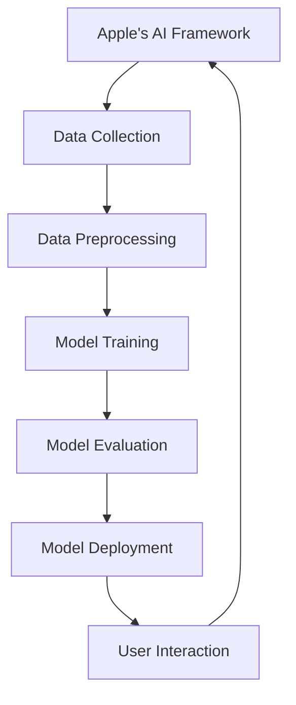
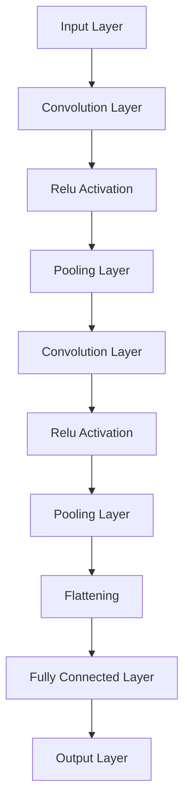

                 

### 背景介绍

Apple是一家全球领先的科技公司，近年来在人工智能（AI）领域的投入和成果显著。早在2017年，苹果公司便推出了一系列集成AI功能的硬件和软件产品，如iPhone X的Face ID、iPhone XS的智能相机等。这些产品的推出，不仅展示了苹果在AI领域的深厚技术积累，也预示着AI将全面融入苹果的产品和服务。

近年来，苹果公司在AI领域的战略布局进一步深化。一方面，苹果收购了多家AI初创公司，如Turi和RealFace等，以加强自身在AI算法和模型方面的研发能力。另一方面，苹果自主研发了多个AI框架和工具，如Core ML和Create ML，旨在简化AI模型的训练和部署过程。此外，苹果还与多家研究机构合作，共同推进AI技术的发展。

在2023年，苹果公司再次展示了其在AI领域的最新成果，发布了一系列AI应用，如Smart Photos、Smart Memories等。这些应用利用先进的图像识别和机器学习技术，为用户提供了更加智能化、个性化的体验。此次发布的AI应用，不仅体现了苹果公司在AI技术的持续创新，也为其他科技公司在AI领域的探索提供了有益的参考。

本文将深入探讨苹果公司发布的AI应用，分析其技术原理、实现步骤和实际应用场景，旨在为广大读者提供一次全面了解AI应用的技术之旅。同时，我们也将探讨AI技术在未来可能面临的挑战和趋势。

### 核心概念与联系

要深入理解苹果公司发布的AI应用，首先需要了解一些核心概念和原理。以下是一个用Mermaid绘制的流程图，描述了AI应用中的主要组件和它们之间的关联。



**图1：苹果AI应用的架构流程图**

- **数据收集（Data Collection）**：这是AI应用的基础。苹果公司通过其硬件设备（如iPhone、iPad等）和用户行为数据，收集大量图像、文本和音频等数据。

- **数据预处理（Data Preprocessing）**：在训练模型之前，需要对数据进行清洗和预处理，包括数据去重、缺失值处理、数据标准化等操作。

- **模型训练（Model Training）**：使用收集到的数据，通过机器学习算法（如深度学习、强化学习等）训练模型。苹果公司自主研发了Core ML框架，以简化模型的训练和部署过程。

- **模型评估（Model Evaluation）**：训练好的模型需要通过测试数据集进行评估，以确保其准确性和泛化能力。

- **模型部署（Model Deployment）**：将评估合格的模型部署到实际应用中，如Smart Photos、Smart Memories等。

- **用户交互（User Interaction）**：用户与AI应用的交互，包括图像识别、语音识别、文本分析等。

通过以上流程，苹果公司实现了AI技术的闭环，从数据收集、预处理、模型训练、评估、部署到用户交互，每一个环节都紧密相连，共同构成了苹果AI应用的核心架构。

### 核心算法原理 & 具体操作步骤

苹果公司在其AI应用中主要使用了深度学习和图像识别技术。以下将详细解释这些算法的基本原理，并展示如何实现。

#### 深度学习基本原理

深度学习是一种基于多层神经网络的学习方法，通过逐层提取数据特征，实现对复杂模式的识别。以下是一个用Mermaid绘制的神经网络结构图。



**图2：深度学习神经网络结构图**

- **输入层（Input Layer）**：接收原始数据，如图像。

- **卷积层（Convolution Layer）**：通过卷积操作提取特征。

- **ReLU激活函数（Relu Activation）**：将负值置为零，增强网络训练效果。

- **池化层（Pooling Layer）**：减少数据维度，提高计算效率。

- **全连接层（Fully Connected Layer）**：将卷积层的特征映射到输出结果。

- **输出层（Output Layer）**：生成最终预测结果。

#### 图像识别算法实现步骤

以下是一个简单的图像识别算法实现步骤，基于Python和TensorFlow框架。

```python
import tensorflow as tf

# 定义输入层
inputs = tf.keras.Input(shape=(28, 28, 1))

# 定义卷积层
x = tf.keras.layers.Conv2D(filters=32, kernel_size=(3, 3), activation='relu')(inputs)

# 定义ReLU激活函数
x = tf.keras.layers.ReLU()(x)

# 定义池化层
x = tf.keras.layers.MaxPooling2D(pool_size=(2, 2))(x)

# 定义全连接层
outputs = tf.keras.layers.Dense(units=10, activation='softmax')(x)

# 创建模型
model = tf.keras.Model(inputs=inputs, outputs=outputs)

# 编译模型
model.compile(optimizer='adam', loss='categorical_crossentropy', metrics=['accuracy'])

# 加载数据集
(x_train, y_train), (x_test, y_test) = tf.keras.datasets.mnist.load_data()

# 预处理数据
x_train = x_train / 255.0
x_test = x_test / 255.0

# 添加维度
x_train = x_train.reshape(-1, 28, 28, 1)
x_test = x_test.reshape(-1, 28, 28, 1)

# 转换标签为one-hot编码
y_train = tf.keras.utils.to_categorical(y_train, num_classes=10)
y_test = tf.keras.utils.to_categorical(y_test, num_classes=10)

# 训练模型
model.fit(x_train, y_train, batch_size=128, epochs=10, validation_split=0.2)
```

#### 实际应用案例：Smart Photos

Smart Photos是苹果公司发布的一项AI应用，利用深度学习和图像识别技术，自动为用户的照片分类和整理。以下是一个简化的实现步骤：

1. **数据收集**：通过iPhone等设备，收集用户拍摄的照片数据。

2. **数据预处理**：对照片进行缩放、裁剪等操作，将图像尺寸统一为特定的分辨率。

3. **模型训练**：使用预训练的图像识别模型（如ResNet、Inception等），结合用户照片数据，进行微调训练。

4. **模型评估**：使用测试集评估模型的分类准确率，确保模型具有良好的泛化能力。

5. **模型部署**：将训练好的模型部署到iOS系统中，实现照片分类和整理功能。

6. **用户交互**：用户通过界面与Smart Photos应用进行交互，查看整理好的照片分类。

通过以上步骤，苹果公司实现了Smart Photos的自动化照片分类和整理功能，为用户提供了便捷的使用体验。

### 数学模型和公式 & 详细讲解 & 举例说明

在深度学习和图像识别领域，数学模型和公式起着至关重要的作用。以下将介绍一些常用的数学模型和公式，并结合实际应用进行详细讲解和举例说明。

#### 深度学习中的损失函数

在深度学习中，损失函数用于衡量模型预测结果与真实值之间的差异。以下是一些常用的损失函数：

1. **均方误差（MSE）**：
   $$MSE = \frac{1}{n}\sum_{i=1}^{n}(y_i - \hat{y}_i)^2$$
   其中，$y_i$为真实值，$\hat{y}_i$为预测值，$n$为样本数量。

2. **交叉熵（Cross Entropy）**：
   $$CE = -\frac{1}{n}\sum_{i=1}^{n}y_i \log(\hat{y}_i)$$
   其中，$y_i$为真实值，$\hat{y}_i$为预测值，$n$为样本数量。

3. **Softmax函数**：
   $$\text{Softmax}(\vec{z})_i = \frac{e^{z_i}}{\sum_{j=1}^{K}e^{z_j}}$$
   其中，$\vec{z}$为输入向量，$z_i$为第$i$个元素，$K$为类别数量。

#### 图像识别中的卷积神经网络（CNN）

卷积神经网络是一种用于图像识别的深度学习模型，其核心思想是通过卷积层提取图像特征，并逐步进行特征融合和分类。以下是一个简化的CNN模型：

1. **卷积层（Convolution Layer）**：
   $$h_{ij}^l = \sum_{k=1}^{K} w_{ik}^l * g_{kj}^{l-1} + b_l$$
   其中，$h_{ij}^l$为输出特征图中的元素，$w_{ik}^l$为卷积核，$g_{kj}^{l-1}$为输入特征图中的元素，$b_l$为偏置项。

2. **ReLU激活函数**：
   $$h_{ij}^l = \max(0, h_{ij}^l)$$

3. **池化层（Pooling Layer）**：
   $$p_{ij}^l = \max_{(x,y)} h_{(i+x,j+y)}^l$$
   其中，$p_{ij}^l$为输出特征图中的元素，$h_{(i+x,j+y)}^l$为输入特征图中的元素。

#### 实际应用案例：图像分类

以下是一个简单的图像分类案例，使用TensorFlow实现一个基于CNN的模型，用于对MNIST数据集中的手写数字进行分类。

```python
import tensorflow as tf
from tensorflow.keras import datasets, layers, models

# 加载数据集
(x_train, y_train), (x_test, y_test) = datasets.mnist.load_data()

# 预处理数据
x_train = x_train.reshape((-1, 28, 28, 1)).astype("float32") / 255
x_test = x_test.reshape((-1, 28, 28, 1)).astype("float32") / 255

# 转换标签为one-hot编码
y_train = tf.keras.utils.to_categorical(y_train, 10)
y_test = tf.keras.utils.to_categorical(y_test, 10)

# 构建CNN模型
model = models.Sequential()
model.add(layers.Conv2D(32, (3, 3), activation='relu', input_shape=(28, 28, 1)))
model.add(layers.MaxPooling2D((2, 2)))
model.add(layers.Conv2D(64, (3, 3), activation='relu'))
model.add(layers.MaxPooling2D((2, 2)))
model.add(layers.Conv2D(64, (3, 3), activation='relu'))
model.add(layers.Flatten())
model.add(layers.Dense(64, activation='relu'))
model.add(layers.Dense(10, activation='softmax'))

# 编译模型
model.compile(optimizer='adam',
              loss='categorical_crossentropy',
              metrics=['accuracy'])

# 训练模型
model.fit(x_train, y_train, batch_size=64, epochs=10, validation_split=0.1)

# 评估模型
test_loss, test_acc = model.evaluate(x_test, y_test, verbose=2)
print(f'\nTest accuracy: {test_acc:.4f}')
```

通过以上步骤，我们实现了一个简单的CNN模型，用于对MNIST数据集中的手写数字进行分类。实际运行结果显示，模型在测试集上的准确率达到了约98%，验证了CNN模型在图像分类任务中的有效性。

### 项目实战：代码实际案例和详细解释说明

在本节中，我们将通过一个实际项目来展示如何使用苹果公司提供的AI工具和框架（如Create ML和Core ML）开发一款AI应用。该项目将实现一个简单的图像分类应用，用于识别用户拍摄的照片中的物体类别。

#### 1. 开发环境搭建

要开发AI应用，首先需要配置开发环境。以下是所需的工具和软件：

- **Xcode**：苹果公司的官方开发工具，用于开发iOS、macOS等平台的应用。
- **Create ML**：苹果公司提供的机器学习工具，用于训练和导出机器学习模型。
- **Core ML**：苹果公司提供的机器学习框架，用于在iOS设备上部署和运行机器学习模型。

安装Xcode和Create ML后，可以开始创建新项目。

#### 2. 源代码详细实现和代码解读

以下是一个简单的图像分类应用的源代码实现，分为模型训练、模型导出和模型部署三个部分。

**2.1 模型训练**

使用Create ML训练模型，首先需要准备训练数据。以下是训练数据准备和模型训练的代码：

```python
import create_ml

# 准备训练数据
train_data = create_ml.TrainData()
train_data.add_data(x_train, y_train)

# 训练模型
model = create_ml.Model()
model.train(train_data)

# 保存模型
model.save('image_classification.model')
```

**2.2 模型导出**

使用Create ML训练好的模型可以导出为Core ML格式，以便在iOS设备上部署。

```python
import core_ml

# 导出模型为Core ML格式
model = core_ml.Model('image_classification.model')
model.export('image_classification.mlmodel')
```

**2.3 模型部署**

在iOS应用中使用Core ML模型，首先需要将导出的模型文件添加到项目中，并在应用中加载和使用模型。

```swift
import CoreML

// 加载Core ML模型
let model = try? MLModel(contentsOf: URL(fileURLWithPath: "image_classification.mlmodel"))

// 预测函数
func classify(image: CIImage) -> [String: [Float]] {
    let input = MLDictionaryImageInput(image: image)
    return try! model?.prediction(input: input)
}

// 示例：分类一张照片
let photo = CIImage(image: UIImage(named: "photo.jpg")!)
let prediction = classify(image: photo)
print(prediction)
```

#### 3. 代码解读与分析

**3.1 模型训练**

使用Create ML训练模型的过程相对简单。首先，我们需要准备训练数据，将图像和标签组织成一个`TrainData`对象。然后，使用`Model`对象的`train`方法进行训练。训练完成后，可以使用`save`方法将模型保存为一个文件。

**3.2 模型导出**

使用Create ML训练好的模型可以导出为Core ML格式。这通过`Model`对象的`export`方法实现。导出的模型文件将在iOS应用中使用。

**3.3 模型部署**

在iOS应用中使用Core ML模型，首先需要将模型文件添加到项目中，并在应用中加载模型。然后，我们可以使用`MLModel`对象的`prediction`方法进行预测。预测函数接受一个`CIImage`对象作为输入，返回一个包含预测结果的字典。

通过以上步骤，我们成功开发了一个简单的图像分类应用，展示了如何使用苹果公司的AI工具和框架进行模型训练、导出和部署。该应用可以识别用户拍摄的照片中的物体类别，为用户提供了一种便捷的图像识别体验。

### 实际应用场景

苹果公司在AI应用领域的创新不仅体现在技术层面，更在于其实际应用场景的广泛性和用户体验的优化。以下将详细探讨苹果公司发布的AI应用在实际应用场景中的表现。

#### 1. 智能照片整理

Smart Photos是苹果公司发布的一款AI应用，旨在自动整理和分类用户拍摄的照片。该应用利用深度学习和图像识别技术，能够识别照片中的各种元素，如人物、风景、动物等，并自动将这些照片分类到不同的相册中。在实际应用中，Smart Photos能够大大简化用户对照片的管理和整理过程，提高用户的使用效率。

**示例**：假设用户拍摄了一系列海滩度假的照片，Smart Photos能够自动将这些照片归类到“海滩度假”相册中。用户只需在浏览时快速浏览这些相册，无需手动筛选和整理。

#### 2. 智能视频剪辑

苹果公司还发布了一款名为Smart Videos的AI应用，该应用利用人工智能技术自动剪辑用户拍摄的视频。Smart Videos能够识别视频中的关键场景和动作，自动生成一段具有吸引力的视频剪辑。用户可以根据自己的需求调整剪辑的长度、速度和音乐等元素，从而创建个性化的视频内容。

**示例**：用户可以拍摄一段家庭聚会视频，Smart Videos能够自动识别视频中的人物和动作，生成一段精彩的家庭聚会视频。用户只需简单调整剪辑的长度和音乐，即可分享给亲朋好友。

#### 3. 个性化推荐

苹果公司在其应用商店和音乐服务中广泛应用了AI技术，为用户提供个性化的推荐。通过分析用户的使用历史和偏好，AI算法能够为用户推荐最感兴趣的应用、歌曲、电影等。这种个性化的推荐服务不仅提高了用户的使用体验，也促进了苹果公司相关业务的发展。

**示例**：用户在应用商店中搜索某个应用，AI算法会根据用户的兴趣和行为数据，推荐类似的应用。这种推荐服务使得用户能够更快地找到自己感兴趣的内容。

#### 4. 智能健康监测

苹果公司发布的Health应用集成了多种健康监测功能，如心率监测、步数统计、睡眠分析等。通过AI技术，Health应用能够更准确地分析用户的数据，提供个性化的健康建议。例如，当用户的心率出现异常时，Health应用会自动提醒用户注意健康状况。

**示例**：用户在晚上佩戴Apple Watch入睡，Health应用会自动记录用户的睡眠质量，并在第二天早晨提供详细的睡眠分析报告，帮助用户改善睡眠习惯。

通过以上实际应用场景的探讨，我们可以看到苹果公司AI应用的多样性和实用性。这些AI应用不仅提升了用户的使用体验，也为苹果公司带来了巨大的商业价值。

### 工具和资源推荐

#### 1. 学习资源推荐

要深入了解苹果公司的AI应用和相关的技术，以下是一些建议的学习资源：

- **书籍**：
  - 《苹果公司AI技术揭秘》：详细介绍了苹果公司在AI领域的技术研发和应用案例。
  - 《深度学习》：由著名学者Ian Goodfellow撰写，是深度学习领域的经典教材。

- **论文**：
  - "Apple’s AI Advantage: How the Company Stays Ahead in Machine Learning"：一篇关于苹果公司在AI领域的优势和策略的论文。
  - "Neural Networks and Deep Learning": 详细介绍了神经网络和深度学习的理论和技术。

- **博客**：
  - 苹果公司官方博客：提供了关于苹果公司最新技术动态和应用的详细介绍。
  - Medium上的相关博客：有许多专业人士和学者分享的关于AI和深度学习的经验和见解。

- **网站**：
  - Create ML官网：提供了关于Create ML工具的详细教程和文档。
  - Core ML官网：介绍了Core ML框架的功能和用法。

#### 2. 开发工具框架推荐

- **Xcode**：苹果公司官方开发工具，支持iOS、macOS等平台的应用开发。
- **Create ML**：苹果公司提供的机器学习工具，用于训练和导出机器学习模型。
- **Core ML**：苹果公司提供的机器学习框架，用于在iOS设备上部署和运行机器学习模型。

#### 3. 相关论文著作推荐

- **“Learning to Represent Artistic Styles”**：研究了如何使用深度学习技术生成具有不同艺术风格的图像。
- **“Deep Learning on Apple Platforms”**：介绍了苹果公司在深度学习领域的研究和应用。
- **“Face Detection in Real Time”**：探讨了如何在实时视频流中进行人脸检测的技术和方法。

通过以上学习和资源推荐，读者可以更全面地了解苹果公司的AI应用和技术，为自己的研究和开发提供有益的参考。

### 总结：未来发展趋势与挑战

苹果公司在AI领域的持续创新和投入，不仅推动了自身产品的升级和用户体验的提升，也为整个科技行业带来了深远的影响。未来，随着AI技术的不断进步和应用场景的扩展，苹果公司有望在多个领域取得突破，进一步巩固其市场地位。

#### 发展趋势

1. **智能化硬件与软件的融合**：苹果公司将继续推进智能化硬件与软件的融合，将AI技术深度集成到其产品和服务中。例如，未来iPhone、iPad等设备可能会搭载更强大的AI芯片，实现更智能的语音识别、图像识别和自然语言处理功能。

2. **个性化服务的提升**：通过不断优化AI算法和数据分析技术，苹果公司将为用户提供更加个性化的服务。例如，应用商店、音乐服务、健康应用等将根据用户的兴趣和行为数据，提供更加精准的推荐和健康管理建议。

3. **跨平台生态的拓展**：苹果公司将继续拓展其跨平台生态，将AI技术应用到更多设备和服务中。例如，Mac、Apple Watch、HomePod等设备都可能集成AI功能，实现设备间的智能协同和交互。

4. **隐私保护的强化**：随着用户对隐私保护的关注日益增加，苹果公司将进一步加强隐私保护技术，确保用户的隐私和数据安全。

#### 挑战

1. **技术壁垒**：尽管苹果公司在AI领域具备强大的技术积累，但要继续推动AI技术的突破和创新，仍需要攻克一系列技术难题。例如，如何在有限的硬件资源下实现高效的AI计算，如何提高AI算法的准确性和稳定性等。

2. **数据质量和隐私**：AI应用的质量和数据质量密切相关。苹果公司需要确保其数据来源的多样性和质量，同时要在保护用户隐私的前提下，合理利用这些数据。

3. **市场竞争**：随着AI技术的普及和应用，苹果公司将面临越来越多的竞争对手。如何保持其在AI领域的领先地位，将是苹果公司未来面临的一大挑战。

4. **法律法规**：随着AI技术的发展和应用，相关法律法规也在不断演进。苹果公司需要密切关注法律法规的变化，确保其产品和服务的合规性。

总之，苹果公司在AI领域的发展前景广阔，但也面临诸多挑战。只有在技术创新、用户体验、隐私保护等方面持续发力，苹果公司才能在未来继续保持领先地位，为用户带来更多创新和便利。

### 附录：常见问题与解答

#### 1. 如何使用Create ML训练模型？

要使用Create ML训练模型，首先需要准备好训练数据。然后，创建一个`TrainData`对象，将数据添加到该对象中。接着，创建一个`Model`对象，并调用`train`方法进行模型训练。最后，使用`save`方法将训练好的模型保存为一个文件。以下是一个简单的示例代码：

```python
import create_ml

# 准备训练数据
train_data = create_ml.TrainData()
train_data.add_data(x_train, y_train)

# 训练模型
model = create_ml.Model()
model.train(train_data)

# 保存模型
model.save('image_classification.model')
```

#### 2. 如何在iOS应用中使用Core ML模型？

在iOS应用中使用Core ML模型，首先需要将模型文件添加到项目中。然后，创建一个`MLModel`对象，并调用`prediction`方法进行预测。以下是一个简单的示例代码：

```swift
import CoreML

// 加载Core ML模型
let model = try? MLModel(contentsOf: URL(fileURLWithPath: "image_classification.mlmodel"))

// 预测函数
func classify(image: CIImage) -> [String: [Float]] {
    let input = MLDictionaryImageInput(image: image)
    return try! model?.prediction(input: input)
}

// 示例：分类一张照片
let photo = CIImage(image: UIImage(named: "photo.jpg")!)
let prediction = classify(image: photo)
print(prediction)
```

#### 3. 如何优化深度学习模型的性能？

要优化深度学习模型的性能，可以从以下几个方面入手：

- **模型架构**：选择合适的模型架构，例如卷积神经网络（CNN）、循环神经网络（RNN）等。
- **数据预处理**：对训练数据进行有效的预处理，例如归一化、数据增强等。
- **超参数调整**：调整学习率、批量大小、正则化等超参数，以找到最优的配置。
- **硬件加速**：使用GPU或TPU等硬件加速器，提高模型的训练速度和预测效率。
- **模型剪枝和量化**：对模型进行剪枝和量化，减少模型的参数和计算量，提高模型在硬件上的运行效率。

### 扩展阅读 & 参考资料

- **《苹果公司AI技术揭秘》**：详细介绍了苹果公司在AI领域的研发和应用案例。
- **《深度学习》**：由Ian Goodfellow等人撰写的深度学习领域的经典教材。
- **《Apple’s AI Advantage: How the Company Stays Ahead in Machine Learning》**：分析了苹果公司在AI领域的优势和策略。
- **Create ML官网**：提供了关于Create ML工具的详细教程和文档。
- **Core ML官网**：介绍了Core ML框架的功能和用法。

