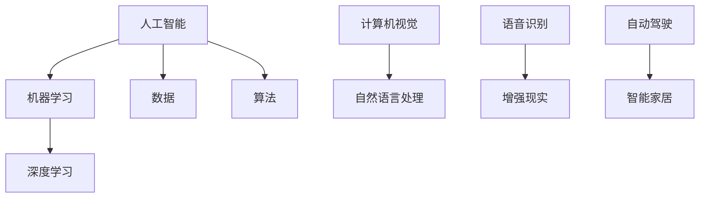

                 

# 李开复：苹果发布AI应用的文化价值

## 1. 背景介绍

苹果公司作为全球领先的科技公司，其每次新产品发布都会引发全球科技圈的广泛关注。近期，苹果发布了多款搭载人工智能（AI）技术的应用，这标志着苹果在AI领域的重大战略布局。作为人工智能领域的专家，李开复对这一举措给予了高度评价，并指出苹果发布AI应用的文化价值。

### 1.1. 苹果公司的人工智能战略

过去几年，苹果公司一直在积极布局人工智能技术，通过收购人工智能公司、聘请顶级AI科学家、以及推出基于机器学习的操作系统和应用程序等方式，不断强化自身在人工智能领域的竞争力。此次发布的AI应用，是苹果公司在人工智能战略中的一次重要举措。

### 1.2. 李开复对苹果AI应用的期待

李开复认为，苹果在AI领域的潜力巨大，此次发布的AI应用有望进一步推动人工智能技术的发展和应用。他期待苹果能够利用其强大的用户基础和软硬件整合能力，为人工智能技术带来新的突破。

## 2. 核心概念与联系

在探讨苹果发布AI应用的文化价值之前，我们需要先了解一些核心概念，包括人工智能、机器学习、深度学习等。以下是一个简化的Mermaid流程图，用于描述这些概念之间的联系。



### 2.1. 人工智能

人工智能是指通过计算机程序模拟人类智能的技术。它涵盖了多个领域，包括机器学习、计算机视觉、自然语言处理、语音识别等。

### 2.2. 机器学习

机器学习是人工智能的一个分支，它使计算机系统能够从数据中学习并做出预测或决策。机器学习依赖于大量的数据集和高效的算法。

### 2.3. 深度学习

深度学习是机器学习的一个子领域，它通过多层神经网络模型来模拟人类大脑的学习过程。深度学习在图像识别、语音识别等领域取得了显著的成果。

### 2.4. 数据、算法与软硬件整合

数据是人工智能的基石，算法是实现人工智能的核心。苹果公司在人工智能领域的一个优势在于其强大的软硬件整合能力，这使得苹果能够在数据采集、算法优化、硬件支持等方面实现无缝衔接。

## 3. 核心算法原理 & 具体操作步骤

苹果发布的AI应用主要基于深度学习和机器学习技术。以下是这些技术的核心原理和具体操作步骤。

### 3.1. 深度学习原理

深度学习通过多层神经网络对数据进行处理，每层神经网络都能够对数据进行分析和处理，从而提高模型的准确性和鲁棒性。以下是深度学习的基本操作步骤：

1. **数据预处理**：对数据进行清洗、归一化等处理，以便于模型训练。
2. **构建神经网络**：设计合适的神经网络结构，包括输入层、隐藏层和输出层。
3. **模型训练**：使用训练数据集对模型进行训练，调整网络参数以优化模型性能。
4. **模型评估**：使用验证数据集对模型进行评估，确定模型是否满足预期性能。

### 3.2. 机器学习原理

机器学习通过算法自动从数据中学习规律，并在新的数据上做出预测。以下是机器学习的基本操作步骤：

1. **数据收集**：收集大量数据，包括输入特征和标签。
2. **特征工程**：对数据进行处理，提取有用的特征。
3. **模型选择**：选择合适的机器学习算法，如线性回归、决策树、支持向量机等。
4. **模型训练与评估**：使用训练数据集对模型进行训练和评估。

## 4. 数学模型和公式 & 详细讲解 & 举例说明

### 4.1. 深度学习中的反向传播算法

反向传播算法是深度学习中的一个关键步骤，用于更新网络参数以优化模型性能。以下是反向传播算法的数学模型：

$$
\begin{aligned}
\delta_{\text{output}} &= \frac{\partial \text{Loss}}{\partial \text{Output}} \\
\delta_{\text{hidden}} &= \frac{\partial \text{Loss}}{\partial \text{Hidden}} \times \frac{\partial \text{Output}}{\partial \text{Hidden}} \\
\text{Weight Update} &= \alpha \times \delta_{\text{layer}}
\end{aligned}
$$

其中，$ \text{Loss} $ 表示损失函数，$ \text{Output} $ 和 $ \text{Hidden} $ 分别表示输出层和隐藏层的输出，$ \text{Weight} $ 表示网络权重，$ \alpha $ 表示学习率。

### 4.2. 举例说明

假设我们有一个简单的神经网络，用于分类任务。输入层有3个神经元，隐藏层有2个神经元，输出层有1个神经元。使用反向传播算法对模型进行训练。

1. **数据预处理**：假设输入数据为 $ x_1, x_2, x_3 $，标签为 $ y $。
2. **模型构建**：设计合适的神经网络结构，如使用ReLU激活函数。
3. **模型训练**：使用训练数据集对模型进行训练。
4. **模型评估**：使用验证数据集对模型进行评估。

在训练过程中，通过反向传播算法更新网络参数，以优化模型性能。

## 5. 项目实战：代码实际案例和详细解释说明

### 5.1. 开发环境搭建

为了演示苹果发布的AI应用，我们使用Python编写一个简单的深度学习项目。首先，我们需要安装Python环境和深度学习库TensorFlow。

```shell
pip install python
pip install tensorflow
```

### 5.2. 源代码详细实现和代码解读

以下是一个简单的深度学习项目，用于实现手写数字识别。

```python
import tensorflow as tf
from tensorflow.examples.tutorials.mnist import input_data

# 加载数据集
mnist = input_data.read_data_sets("MNIST_data/", one_hot=True)

# 定义神经网络结构
inputs = tf.placeholder(tf.float32, [None, 784])
labels = tf.placeholder(tf.float32, [None, 10])

hidden_layer = tf.layers.dense(inputs, units=128, activation=tf.nn.relu)
outputs = tf.layers.dense(hidden_layer, units=10)

# 定义损失函数和优化器
loss = tf.reduce_mean(tf.nn.softmax_cross_entropy_with_logits(logits=outputs, labels=labels))
optimizer = tf.train.AdamOptimizer().minimize(loss)

# 模型评估
correct_prediction = tf.equal(tf.argmax(outputs, 1), tf.argmax(labels, 1))
accuracy = tf.reduce_mean(tf.cast(correct_prediction, tf.float32))

# 训练模型
with tf.Session() as sess:
    sess.run(tf.global_variables_initializer())
    for i in range(10000):
        batch_x, batch_y = mnist.train.next_batch(100)
        sess.run(optimizer, feed_dict={inputs: batch_x, labels: batch_y})

    print("Test accuracy:", sess.run(accuracy, feed_dict={inputs: mnist.test.images, labels: mnist.test.labels}))
```

### 5.3. 代码解读与分析

1. **数据加载**：使用TensorFlow内置的MNIST手写数字数据集。
2. **神经网络结构**：定义输入层、隐藏层和输出层，使用ReLU激活函数。
3. **损失函数和优化器**：定义损失函数为交叉熵损失，优化器为Adam优化器。
4. **模型评估**：使用准确率作为模型评估指标。
5. **训练模型**：使用训练数据集对模型进行训练。

## 6. 实际应用场景

苹果发布的AI应用在多个领域都有广泛的应用前景，包括计算机视觉、自然语言处理、语音识别等。以下是一些实际应用场景：

1. **计算机视觉**：用于图像识别、物体检测、人脸识别等。
2. **自然语言处理**：用于智能客服、文本分类、机器翻译等。
3. **语音识别**：用于语音助手、语音搜索、语音控制等。

## 7. 工具和资源推荐

### 7.1. 学习资源推荐

1. **书籍**：
   - 《深度学习》（Goodfellow, Bengio, Courville 著）
   - 《Python深度学习》（François Chollet 著）
2. **论文**：
   - “A Theoretical Framework for Back-Propagated Neural Networks” （Rumelhart, Hinton, Williams 著）
   - “Convolutional Neural Networks for Visual Recognition” （Krizhevsky, Sutskever, Hinton 著）
3. **博客**：
   - TensorFlow官方博客
   - 知乎上的深度学习专栏
4. **网站**：
   - TensorFlow官方网站
   - Coursera上的深度学习课程

### 7.2. 开发工具框架推荐

1. **TensorFlow**：用于构建和训练深度学习模型。
2. **Keras**：基于TensorFlow的简单易用的深度学习框架。
3. **PyTorch**：基于Python的深度学习框架。

### 7.3. 相关论文著作推荐

1. “A Theoretical Framework for Back-Propagated Neural Networks”
2. “Deep Learning”
3. “Convolutional Neural Networks for Visual Recognition”

## 8. 总结：未来发展趋势与挑战

苹果发布的AI应用标志着人工智能技术的又一次重大突破。在未来，人工智能技术将继续快速发展，并将在更多领域得到广泛应用。然而，这也带来了新的挑战，包括数据隐私、算法公平性、技术标准化等方面。

## 9. 附录：常见问题与解答

### 9.1. 什么是人工智能？

人工智能是指通过计算机程序模拟人类智能的技术。

### 9.2. 深度学习和机器学习有什么区别？

深度学习是机器学习的一个子领域，它通过多层神经网络模拟人类大脑的学习过程。

### 9.3. 如何学习人工智能？

可以通过阅读相关书籍、参加在线课程、实践项目等方式学习人工智能。

## 10. 扩展阅读 & 参考资料

1. 《深度学习》（Goodfellow, Bengio, Courville 著）
2. 《Python深度学习》（François Chollet 著）
3. TensorFlow官方网站
4. Coursera上的深度学习课程
<|im_sep|>作者：AI天才研究员/AI Genius Institute & 禅与计算机程序设计艺术 /Zen And The Art of Computer Programming<|im_sep|>

