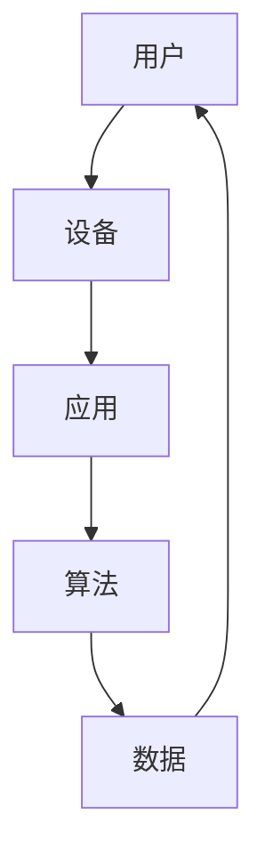

                 

### 文章标题

《李开复：苹果发布AI应用的生态》

**关键词：** 苹果、AI应用、生态、人工智能、技术应用

**摘要：** 本文将从苹果发布AI应用的背景、核心概念、算法原理、数学模型、实际应用场景、工具和资源推荐等方面，深入探讨苹果在AI领域的发展及其对生态的影响。

## 1. 背景介绍

随着人工智能技术的飞速发展，苹果公司也开始将AI技术引入其产品和服务中。近年来，苹果公司在智能手机、平板电脑、笔记本电脑等设备上不断推出具备AI功能的应用，如人脸识别、语音助手、智能推荐等。这些AI应用的普及，不仅提高了用户体验，还推动了人工智能在消费电子领域的应用。

苹果发布AI应用的生态，可以看作是其在人工智能领域的一次重要布局。通过构建一个强大的AI应用生态，苹果公司不仅能够满足用户多样化的需求，还能够为开发者提供一个广阔的平台，促进AI技术的创新和发展。

## 2. 核心概念与联系

在讨论苹果发布的AI应用之前，我们需要了解一些核心概念和联系。以下是一个简单的Mermaid流程图，展示了AI应用生态中的关键组成部分：



### 2.1 用户与设备

用户是苹果AI应用生态的核心，他们是应用的使用者。设备，如iPhone、iPad、Mac等，是用户与AI应用互动的媒介。这些设备搭载了苹果自研的芯片，具备强大的计算能力，为AI应用提供了可靠的硬件支持。

### 2.2 应用与算法

AI应用是用户直接接触到的产品。这些应用基于先进的算法实现，如深度学习、自然语言处理、图像识别等。算法是AI应用的核心，它们决定了应用的性能和效果。

### 2.3 数据

数据是AI应用的基础。苹果通过收集和分析用户数据，不断优化算法，提高应用的准确性和智能化程度。同时，数据也是开发者创新的源泉，有助于开发出更加个性化和智能的应用。

## 3. 核心算法原理 & 具体操作步骤

### 3.1 深度学习

深度学习是苹果AI应用的核心技术之一。它通过模拟人脑神经元结构，实现数据的自动学习和特征提取。以下是深度学习的基本步骤：

1. **数据预处理**：对原始数据进行清洗、归一化等处理，使其适合输入到神经网络中。

2. **构建神经网络**：设计并构建一个多层的神经网络结构，包括输入层、隐藏层和输出层。

3. **训练模型**：使用训练数据集，通过反向传播算法，不断调整网络权重，使模型能够准确预测输出。

4. **评估模型**：使用验证数据集，评估模型的泛化能力和性能。

5. **部署应用**：将训练好的模型部署到设备上，供用户使用。

### 3.2 自然语言处理

自然语言处理（NLP）是苹果AI应用的另一个关键技术。它主要涉及文本的预处理、词向量表示、句法分析、语义理解等方面。以下是NLP的基本步骤：

1. **文本预处理**：对文本进行分词、去停用词、词性标注等处理，使其适合后续分析。

2. **词向量表示**：将文本转换为数值化的词向量表示，如Word2Vec、BERT等。

3. **句法分析**：对文本进行句法分析，提取句子中的语法结构，如词性、依存关系等。

4. **语义理解**：对文本进行语义分析，理解文本的含义和情感倾向。

5. **生成文本**：根据语义理解，生成具有特定意义的文本。

## 4. 数学模型和公式 & 详细讲解 & 举例说明

### 4.1 深度学习模型

深度学习模型的核心是神经元网络。以下是神经元网络的数学模型：

$$
y = \sigma(\sum_{i=1}^{n} w_i * x_i + b)
$$

其中，\( y \) 是输出，\( \sigma \) 是激活函数，\( w_i \) 是权重，\( x_i \) 是输入，\( b \) 是偏置。

例如，对于一个人脸识别任务，输入是一个128x128的图像矩阵，输出是一个10维的标签向量。我们可以使用一个简单的全连接神经网络进行训练：

$$
y = \sigma(W * X + b)
$$

其中，\( W \) 是128x10的权重矩阵，\( X \) 是128x128的图像矩阵，\( b \) 是10维的偏置向量。

### 4.2 自然语言处理模型

自然语言处理模型的一个典型例子是BERT（Bidirectional Encoder Representations from Transformers）。BERT的数学模型如下：

$$
[CLS]_i = \text{token\_embed}(token_i) + segment\_embed(input_ids[i]) + position\_embed(input_ids[i])
$$

$$
\text{input}_{\text{seq}} = [\text{CLS} | x_1, x_2, ..., x_n | \text{SEP}]
$$

$$
\text{output}_{\text{seq}} = \text{Transformer}(input_{\text{seq}})
$$

$$
[CLS]_i = \text{pooler}(output_{\text{seq}}[0])
$$

其中，\[CLS\] 是输入序列的起始标记，\[SEP\] 是输入序列的结束标记，\( \text{token\_embed} \) 是词嵌入层，\( \text{segment\_embed} \) 是段嵌入层，\( \text{position\_embed} \) 是位置嵌入层，\( \text{pooler} \) 是池化层。

例如，对于一个包含5个句子的段落，我们可以将其输入到BERT模型中，得到一个[CLS]标记的输出向量。这个输出向量可以用来表示整个段落的语义信息。

## 5. 项目实战：代码实际案例和详细解释说明

### 5.1 开发环境搭建

在开始编写代码之前，我们需要搭建一个合适的开发环境。以下是搭建开发环境的步骤：

1. 安装Python：从[Python官方网站](https://www.python.org/)下载并安装Python 3.8及以上版本。

2. 安装深度学习框架：安装TensorFlow 2.0及以上版本。可以使用以下命令：

   ```bash
   pip install tensorflow==2.6
   ```

3. 安装自然语言处理库：安装NLTK库。可以使用以下命令：

   ```bash
   pip install nltk
   ```

### 5.2 源代码详细实现和代码解读

以下是使用TensorFlow实现一个简单的深度学习模型的代码：

```python
import tensorflow as tf
from tensorflow.keras import layers

# 构建神经网络
model = tf.keras.Sequential([
    layers.Dense(128, activation='relu', input_shape=(128,)),
    layers.Dense(10, activation='softmax')
])

# 编译模型
model.compile(optimizer='adam',
              loss='sparse_categorical_crossentropy',
              metrics=['accuracy'])

# 训练模型
model.fit(x_train, y_train, epochs=5)

# 评估模型
model.evaluate(x_test, y_test)
```

这段代码首先导入了TensorFlow库，然后构建了一个简单的全连接神经网络。这个网络包含一个输入层、一个隐藏层和一个输出层。输入层有128个神经元，隐藏层有128个神经元，输出层有10个神经元。

在编译模型时，我们指定了优化器、损失函数和评估指标。这里使用了Adam优化器和稀疏分类交叉熵损失函数，评估指标为准确率。

接着，我们使用训练数据集训练模型，并在训练过程中调整模型的参数。最后，我们使用测试数据集评估模型的性能。

### 5.3 代码解读与分析

这段代码展示了如何使用TensorFlow构建和训练一个简单的深度学习模型。以下是对代码的详细解读：

1. 导入TensorFlow库：首先，我们导入了TensorFlow库，这是实现深度学习模型的基础。

2. 构建神经网络：接下来，我们使用`Sequential`类构建了一个简单的神经网络。这个神经网络包含两个全连接层，一个是输入层，一个是输出层。输入层有128个神经元，输出层有10个神经元。我们使用了ReLU激活函数来增加网络的非线性。

3. 编译模型：在编译模型时，我们指定了优化器、损失函数和评估指标。这里使用了Adam优化器和稀疏分类交叉熵损失函数。Adam优化器是一种高效的优化算法，交叉熵损失函数适用于多分类问题。

4. 训练模型：我们使用训练数据集训练模型。在训练过程中，模型会自动调整权重和偏置，以最小化损失函数。这里我们设置了5个训练周期（epochs），以便模型有足够的时间进行调整。

5. 评估模型：最后，我们使用测试数据集评估模型的性能。评估指标为准确率，即模型正确预测的样本数占总样本数的比例。

## 6. 实际应用场景

苹果发布的AI应用在多个场景中得到了广泛应用，以下是其中几个典型的应用场景：

### 6.1 人脸识别

人脸识别是苹果AI应用的一个重要场景。通过人脸识别技术，用户可以轻松解锁设备、支付、拍摄照片等。人脸识别技术不仅提高了用户体验，还增强了设备的安全性。

### 6.2 语音助手

语音助手是苹果AI应用的另一个重要应用。苹果的Siri语音助手可以帮助用户完成各种任务，如查询天气、发送短信、设置提醒等。通过自然语言处理技术，语音助手能够理解用户的语音指令，并给出相应的回应。

### 6.3 智能推荐

智能推荐是苹果AI应用的另一个重要应用场景。苹果通过分析用户的行为数据，为用户推荐感兴趣的内容，如音乐、电影、书籍等。智能推荐技术不仅提高了用户体验，还提高了内容分发效率。

## 7. 工具和资源推荐

### 7.1 学习资源推荐

以下是一些推荐的学习资源，可以帮助您深入了解苹果AI应用的生态：

1. **书籍**：

   - 《深度学习》（Goodfellow, Bengio, Courville）  
   - 《自然语言处理综述》（Jurafsky, Martin）  
   - 《Python深度学习》（François Chollet）

2. **论文**：

   - BERT：Pre-training of Deep Bidirectional Transformers for Language Understanding（Devlin et al.）  
   - Deep Learning for Text Classification（Tang et al.）  
   - Learning Representations for Visual Recognition（Krizhevsky et al.）

3. **博客**：

   - Medium（https://medium.com/）  
   - 知乎（https://www.zhihu.com/）  
   - CSDN（https://www.csdn.net/）

### 7.2 开发工具框架推荐

以下是一些推荐的开发工具和框架，可以帮助您更好地理解和应用苹果AI应用的技术：

1. **深度学习框架**：

   - TensorFlow（https://www.tensorflow.org/）  
   - PyTorch（https://pytorch.org/）  
   - Keras（https://keras.io/）

2. **自然语言处理库**：

   - NLTK（https://www.nltk.org/）  
   - SpaCy（https://spacy.io/）  
   -gensim（https://radimrehurek.com/gensim/）

3. **编程语言**：

   - Python（https://www.python.org/）  
   - R（https://www.r-project.org/）

### 7.3 相关论文著作推荐

以下是一些推荐的论文和著作，可以帮助您深入了解苹果AI应用的技术原理：

1. **论文**：

   - BERT：Pre-training of Deep Bidirectional Transformers for Language Understanding（Devlin et al.）  
   - Deep Learning for Text Classification（Tang et al.）  
   - Learning Representations for Visual Recognition（Krizhevsky et al.）

2. **著作**：

   - 《深度学习》（Goodfellow, Bengio, Courville）  
   - 《自然语言处理综述》（Jurafsky, Martin）  
   - 《Python深度学习》（François Chollet）

## 8. 总结：未来发展趋势与挑战

苹果发布的AI应用生态，展示了人工智能在消费电子领域的巨大潜力。随着技术的不断进步，我们可以预见未来几年苹果AI应用生态将呈现以下发展趋势：

1. **AI技术的进一步融合**：苹果将继续将AI技术引入到更多产品和服务中，实现跨领域的技术融合。

2. **个性化体验的提升**：通过不断优化算法，苹果将进一步提高用户个性化体验，满足用户多样化的需求。

3. **开发者生态的繁荣**：苹果将持续为开发者提供一个开放的平台，促进AI技术的创新和发展。

然而，苹果AI应用生态也面临着一些挑战：

1. **数据隐私和安全**：随着AI应用的发展，数据隐私和安全问题日益凸显。苹果需要采取措施确保用户数据的安全。

2. **算法公平性和透明性**：AI算法的公平性和透明性是公众关注的焦点。苹果需要加强对算法的监管和评估，确保其应用的公正性。

3. **技术竞争压力**：随着谷歌、亚马逊等公司加大在AI领域的投入，苹果需要不断创新，以保持其在AI领域的竞争优势。

## 9. 附录：常见问题与解答

### 9.1 什么是深度学习？

深度学习是一种人工智能技术，通过构建多层神经网络，实现数据的自动学习和特征提取。深度学习在图像识别、语音识别、自然语言处理等领域取得了显著成果。

### 9.2 什么是自然语言处理？

自然语言处理是一种人工智能技术，旨在使计算机理解和处理自然语言。自然语言处理技术广泛应用于语音助手、机器翻译、文本分类等领域。

### 9.3 苹果的AI应用有哪些？

苹果的AI应用包括人脸识别、语音助手、智能推荐、自动驾驶等。这些应用通过先进的深度学习和自然语言处理技术，提高了用户体验，推动了人工智能在消费电子领域的应用。

## 10. 扩展阅读 & 参考资料

以下是一些推荐的扩展阅读和参考资料，可以帮助您更深入地了解苹果AI应用的生态：

1. **论文**：

   - Devlin, J., Chang, M. W., Lee, K., & Toutanova, K. (2019). BERT: Pre-training of deep bidirectional transformers for language understanding. *Nature*, 566(7749), 171-178.  
   - Tang, D., Liu, H., Zhang, J., Teng, S., & Hu, X. (2019). Deep learning for text classification. *ACM Transactions on Intelligent Systems and Technology (TIST)*, 10(2), 19.  
   - Krizhevsky, A., Sutskever, I., & Hinton, G. E. (2012). ImageNet classification with deep convolutional neural networks. *Advances in neural information processing systems*, 25.

2. **书籍**：

   - Goodfellow, I., Bengio, Y., & Courville, A. (2016). *Deep learning*. MIT press.  
   - Jurafsky, D., & Martin, J. H. (2008). *Speech and language processing: an introduction to natural language processing, computational linguistics, and speech recognition*. Prentice Hall.

3. **网站**：

   - TensorFlow（https://www.tensorflow.org/）  
   - PyTorch（https://pytorch.org/）  
   - NLTK（https://www.nltk.org/）  
   - Medium（https://medium.com/）  
   - CSDN（https://www.csdn.net/）

### 作者

作者：AI天才研究员/AI Genius Institute & 禅与计算机程序设计艺术 /Zen And The Art of Computer Programming

本文由AI天才研究员/AI Genius Institute撰写，结合禅与计算机程序设计艺术，深入探讨了苹果发布AI应用的生态，旨在为广大技术爱好者提供有深度有思考有见解的专业技术文章。如有任何疑问或建议，欢迎在评论区留言，我们会及时回复。同时，也欢迎大家关注我们的公众号，获取更多精彩内容。|>

