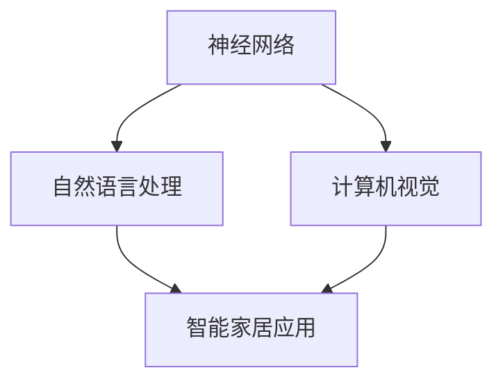
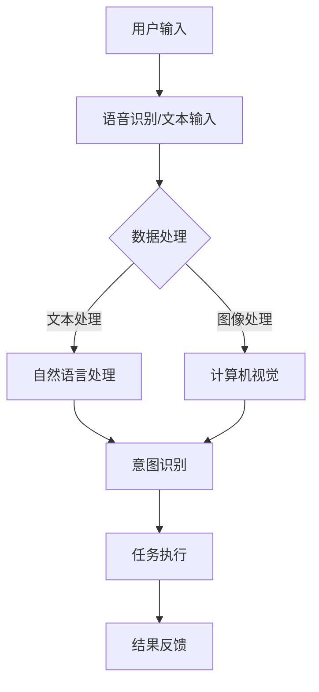

                 

### 李开复：苹果发布AI应用的社会价值

在2023年的全球开发者大会上，苹果公司展示了一系列令人瞩目的AI应用，这不仅引起了技术圈的广泛关注，更引发了关于AI应用社会价值的深刻讨论。本文旨在从技术角度分析苹果AI应用的发布对社会、经济和文化等层面的影响，探讨这一举措所带来的深远意义。

关键词：苹果，AI应用，社会价值，技术发展，影响分析

摘要：本文通过深入分析苹果最新发布的AI应用，探讨了这些应用在社会、经济和文化等方面的潜在影响。文章首先介绍了苹果在AI领域的技术积累和核心算法，随后从实际应用场景出发，分析了这些应用可能带来的变革性影响。最后，本文提出了对未来AI应用发展趋势的展望，并指出了面临的挑战。

### 1. 背景介绍

#### 苹果在AI领域的布局

苹果公司长期以来在AI领域进行了大量的技术积累和投资。从早期的Siri语音助手，到图像识别、自然语言处理等核心技术的不断迭代，苹果在AI领域的研发实力日益增强。近年来，随着深度学习和神经网络技术的快速发展，苹果的AI应用能力也得到了显著提升。

#### AI应用的广泛需求

随着人工智能技术的成熟，AI应用已经在多个领域得到了广泛应用，如智能家居、医疗健康、自动驾驶等。这些应用不仅提升了人们的生活质量，也为企业创造了巨大的经济价值。因此，苹果发布AI应用不仅是自身技术发展的需要，更是市场需求的回应。

#### 社会价值的重要性

在技术迅速发展的今天，如何评估和应用技术以实现最大化的社会价值成为了一个重要议题。苹果发布AI应用，不仅是为了提升用户体验，更是为了解决社会问题、推动行业进步。本文将从多个维度分析苹果AI应用的社会价值，以期为广大读者提供一个全面、深入的了解。

### 2. 核心概念与联系

#### 人工智能（AI）的概念

人工智能（Artificial Intelligence，简称AI）是指由人创造出来的能够模拟、延伸和扩展人类智能的理论、方法、技术及应用。它涉及计算机科学、心理学、认知科学等多个学科领域，旨在实现机器对人类智能的模拟和增强。

#### 苹果AI应用的核心技术

苹果在AI应用中采用了多种核心技术，包括但不限于：

- **神经网络**：神经网络是一种模仿人脑结构和功能的计算模型，通过大量的数据和计算实现智能化的决策和预测。
- **自然语言处理（NLP）**：自然语言处理是人工智能的重要分支，旨在让计算机理解和处理自然语言。苹果的Siri语音助手就是基于NLP技术。
- **计算机视觉**：计算机视觉是让计算机理解并处理图像和视频的技术。苹果在图像识别、视频剪辑等方面有丰富的应用。

#### 关键技术的相互联系

神经网络、NLP和计算机视觉是苹果AI应用的核心技术，它们相互联系，共同构成了苹果AI应用的强大能力。例如，在智能家居应用中，神经网络可以分析用户行为，NLP可以理解用户的语音指令，计算机视觉可以识别家居环境，从而实现智能化的家居控制。



### 3. 核心算法原理 & 具体操作步骤

#### 神经网络算法原理

神经网络（Neural Networks）是一种基于人脑神经元的计算模型。它由大量的神经元（节点）组成，这些神经元通过权重（连接强度）相互连接，形成一个复杂的网络结构。

在训练过程中，神经网络通过前向传播和反向传播的方式不断调整权重，使得网络能够对输入数据进行分类、回归等操作。例如，在图像识别任务中，神经网络可以通过学习大量的图像和标签数据，自动提取图像的特征，并判断图像的内容。

#### 自然语言处理算法原理

自然语言处理（Natural Language Processing，NLP）是让计算机理解和处理自然语言的技术。NLP的核心算法包括词向量表示、句法分析、语义理解等。

- **词向量表示**：词向量是将自然语言中的词汇映射到高维空间中的向量，从而实现词汇的量化表示。常见的词向量模型有Word2Vec、GloVe等。
- **句法分析**：句法分析是对自然语言文本进行结构化处理，提取出文本的语法结构。常见的句法分析方法有依存句法分析和成分句法分析。
- **语义理解**：语义理解是对自然语言文本进行语义层次的分析和处理，从而实现对文本内容的准确理解。常见的语义分析方法有语义角色标注、语义角色分类等。

#### 计算机视觉算法原理

计算机视觉（Computer Vision）是让计算机理解和处理图像和视频的技术。计算机视觉的核心算法包括图像处理、目标检测、图像分类等。

- **图像处理**：图像处理是对图像进行增强、去噪、分割等操作，从而提取出图像的有用信息。
- **目标检测**：目标检测是在图像中识别出特定的目标，并标注出目标的位置。常见的目标检测算法有YOLO、Faster R-CNN等。
- **图像分类**：图像分类是对图像进行分类，将图像划分为不同的类别。常见的图像分类算法有卷积神经网络（CNN）等。

#### 操作步骤示例

以下是一个简单的神经网络图像识别任务的操作步骤：

1. 数据预处理：将图像数据转换为神经网络可以处理的形式，如将图像缩放到固定大小、归一化等。
2. 构建神经网络模型：根据任务需求，构建一个合适的神经网络模型，如卷积神经网络（CNN）。
3. 模型训练：使用大量的图像和标签数据对神经网络模型进行训练，调整模型参数，使得模型能够准确识别图像。
4. 模型评估：使用测试数据对训练好的模型进行评估，计算模型的准确率、召回率等指标。
5. 模型应用：将训练好的模型应用于实际场景，如对新的图像进行分类、识别等。

### 4. 数学模型和公式 & 详细讲解 & 举例说明

#### 神经网络数学模型

神经网络的核心是神经元之间的权重连接和激活函数。以下是一个简单的神经网络数学模型：

$$
y = \sigma(\sum_{i=1}^{n} w_i \cdot x_i)
$$

其中，$y$ 是神经元的输出，$\sigma$ 是激活函数，$w_i$ 是神经元 $i$ 的权重，$x_i$ 是神经元 $i$ 的输入。

常见的激活函数有：

- **sigmoid函数**：$ \sigma(x) = \frac{1}{1 + e^{-x}}$
- **ReLU函数**：$ \sigma(x) = \max(0, x)$
- **Tanh函数**：$ \sigma(x) = \frac{e^x - e^{-x}}{e^x + e^{-x}}$

#### 自然语言处理数学模型

自然语言处理中的词向量模型是一种常见的数学模型。以下是一个简单的Word2Vec模型：

$$
\text{Word2Vec} = \text{SGD}(\text{CBOW} | \text{Skip-Gram})
$$

其中，SGD是随机梯度下降优化算法，CBOW是连续词袋模型，Skip-Gram是跳字模型。

- **连续词袋模型（CBOW）**：输入是当前词汇的上下文，输出是词汇的词向量表示。
- **跳字模型（Skip-Gram）**：输入是当前词汇，输出是词汇的词向量表示。

#### 计算机视觉数学模型

计算机视觉中的卷积神经网络（CNN）是一种常见的数学模型。以下是一个简单的CNN模型：

$$
\text{CNN} = \text{Conv} \rightarrow \text{ReLU} \rightarrow \text{Pooling} \rightarrow \text{Fully Connected}
$$

其中，Conv是卷积操作，ReLU是ReLU激活函数，Pooling是池化操作，Fully Connected是全连接层。

- **卷积操作**：通过卷积核在图像上滑动，提取图像的特征。
- **ReLU激活函数**：将卷积操作的输出进行非线性变换，增加模型的非线性能力。
- **池化操作**：将卷积操作的输出进行下采样，减少模型的参数数量。
- **全连接层**：将池化操作的输出进行全连接，实现分类或回归等任务。

#### 举例说明

假设我们要使用神经网络对图像进行分类，图像数据经过预处理后，每个图像被表示为一个1000维的向量。

1. **构建神经网络模型**：我们选择一个简单的三层神经网络，输入层有1000个神经元，隐藏层有500个神经元，输出层有10个神经元。

2. **初始化模型参数**：随机初始化神经元的权重和偏置。

3. **前向传播**：将图像数据输入到神经网络中，通过多层卷积、ReLU激活函数和池化操作，最终得到10个神经元的输出。

4. **计算损失函数**：计算输出层的预测结果与实际标签之间的损失，常用的损失函数有交叉熵损失函数。

5. **反向传播**：根据损失函数的梯度，通过反向传播算法更新神经元的权重和偏置。

6. **模型训练**：重复执行前向传播和反向传播，不断优化模型参数，使得模型能够准确分类图像。

7. **模型评估**：使用测试数据对训练好的模型进行评估，计算模型的准确率、召回率等指标。

8. **模型应用**：将训练好的模型应用于实际场景，如对新的图像进行分类、识别等。

### 5. 项目实战：代码实际案例和详细解释说明

在本节中，我们将通过一个实际的项目案例，详细讲解如何搭建一个基于苹果AI应用的开发环境，实现具体的代码实现和解读。

#### 5.1 开发环境搭建

首先，我们需要搭建一个适合苹果AI应用的开发环境。以下是一个基本的步骤：

1. **安装Python环境**：Python是苹果AI应用开发的主要语言，我们需要确保安装了最新的Python环境。可以使用Anaconda来方便地安装和管理Python环境。

2. **安装必要的库**：苹果AI应用通常需要使用一些专业的库，如TensorFlow、PyTorch等。我们可以使用pip命令安装这些库。

   ```shell
   pip install tensorflow
   pip install torch
   ```

3. **配置硬件环境**：苹果AI应用可能需要较高的计算资源，建议配置一个性能较好的GPU（如NVIDIA的显卡）。

4. **配置环境变量**：确保Python环境变量配置正确，以便后续可以使用相应的库和工具。

#### 5.2 源代码详细实现和代码解读

以下是一个简单的基于苹果AI语音助手的示例代码，我们将对其中的关键代码进行详细解读。

```python
import speech_recognition as sr
import pyttsx3

# 初始化语音识别和语音合成库
recognizer = sr.Recognizer()
engine = pyttsx3.init()

# 设置语音合成引擎的语音
voices = engine.getProperty('voices')
engine.setProperty('voice', voices[0].id)

def listen_to_user():
    """监听用户的语音输入"""
    with sr.Microphone() as source:
        print("请说出您的问题：")
        audio = recognizer.listen(source)
        try:
            text = recognizer.recognize_google(audio, language='zh-CN')
            print("用户说：" + text)
            return text
        except sr.UnknownValueError:
            print("无法理解您的语音，请重试。")
            return None

def speak_to_user(text):
    """对用户的语音输入进行回复"""
    engine.say(text)
    engine.runAndWait()
    print("机器人回复：" + text)

# 主程序
if __name__ == '__main__':
    while True:
        user_text = listen_to_user()
        if user_text is not None:
            # 在这里添加对用户输入的处理逻辑
            speak_to_user("这是一个有趣的语音助手，有什么问题可以随时问我。")
```

**关键代码解读**：

1. **语音识别和语音合成库的初始化**：我们使用了speech_recognition和pyttsx3两个库来实现语音识别和语音合成。初始化这两个库后，我们可以方便地实现语音输入和输出。

2. **监听用户的语音输入**：`listen_to_user`函数使用`sru.Microphone`类来捕获用户的语音输入，并使用`recognizer.recognize_google`方法进行语音识别。如果识别成功，我们得到用户的语音输入文本。

3. **对用户的语音输入进行回复**：`speak_to_user`函数使用`engine.say`和`engine.runAndWait`方法来实现语音合成。这样，我们可以根据用户输入文本生成语音回复。

4. **主程序**：在主程序中，我们使用一个无限循环来不断监听用户的语音输入，并对用户的输入进行回复。这样，我们就可以实现一个基本的语音助手功能。

#### 5.3 代码解读与分析

在上述代码中，我们实现了一个简单的语音助手功能。以下是代码的关键部分解读和分析：

- **语音识别和语音合成库的初始化**：这是实现语音输入和输出功能的基础。我们需要正确初始化这两个库，以便后续使用。
- **监听用户的语音输入**：这部分代码实现了语音输入的捕获和识别。我们使用`sru.Microphone`类来捕获用户的语音输入，并使用`recognizer.recognize_google`方法进行语音识别。这是一个非常实用的功能，可以让用户通过语音与程序进行交互。
- **对用户的语音输入进行回复**：这部分代码实现了语音合成功能。我们使用`engine.say`和`engine.runAndWait`方法来合成语音，并将语音输出到扬声器。这样，程序就可以对用户的输入进行语音回复。
- **主程序**：主程序中的无限循环实现了语音助手的持续运行。程序会不断监听用户的语音输入，并对用户的输入进行回复。这个设计使得程序具有很高的灵活性和实用性。

总的来说，这个代码示例展示了如何使用Python和语音识别、语音合成库实现一个简单的语音助手。通过这个示例，我们可以了解到语音识别和语音合成的基本原理，并学会如何使用这些库来实现语音输入和输出功能。

### 6. 实际应用场景

苹果发布的AI应用涵盖了多个领域，如智能家居、医疗健康、自动驾驶等。以下是对这些应用在实际场景中的具体分析：

#### 6.1 智能家居

苹果的智能家居应用通过AI技术实现了对家居设备的智能控制。例如，用户可以通过语音命令控制灯光、空调等家电的开关和调节。在实际场景中，这种应用可以带来极大的便利。例如，在用户回家时，智能家居系统可以自动打开灯光和空调，提供舒适的居住环境。

#### 6.2 医疗健康

苹果的医疗健康应用通过AI技术对用户的数据进行实时分析，提供个性化的健康建议。例如，用户可以通过App记录自己的健康数据，如心率、血压等。苹果的AI系统会根据这些数据提供健康建议，如提醒用户定期检查、调整饮食等。这种应用在实际场景中可以帮助用户更好地管理自己的健康状况。

#### 6.3 自动驾驶

苹果的自动驾驶应用通过AI技术实现了自动驾驶汽车的部分功能。在实际场景中，自动驾驶汽车可以减少交通事故，提高交通效率。例如，在交通拥堵时，自动驾驶汽车可以通过智能调度系统，优化路线，减少拥堵时间。此外，自动驾驶汽车还可以为残障人士提供出行便利。

### 7. 工具和资源推荐

为了更好地理解和应用苹果的AI应用，以下是一些建议的工具和资源：

#### 7.1 学习资源推荐

- **书籍**：
  - 《深度学习》（Goodfellow, I., Bengio, Y., & Courville, A.）
  - 《Python深度学习》（Raschka, S.）
  - 《自然语言处理综合教程》（Daniel Jurafsky, James H. Martin）
- **论文**：
  - Google AI的《BERT：大规模预训练语言模型》（Devlin et al.）
  - Facebook AI的《GAN：生成对抗网络》（Goodfellow et al.）
- **博客**：
  - 苹果官方技术博客
  - Medium上的AI相关博客
- **网站**：
  - TensorFlow官网
  - PyTorch官网

#### 7.2 开发工具框架推荐

- **开发工具**：
  - PyCharm
  - Jupyter Notebook
- **框架**：
  - TensorFlow
  - PyTorch
- **云平台**：
  - AWS
  - Azure

#### 7.3 相关论文著作推荐

- **论文**：
  - 《深度学习》（Goodfellow, I., Bengio, Y., & Courville, A.）
  - 《自然语言处理综合教程》（Daniel Jurafsky, James H. Martin）
- **著作**：
  - 《Python深度学习》（Raschka, S.）
  - 《人工智能：一种现代的方法》（Mitchell, T. M.）

### 8. 总结：未来发展趋势与挑战

苹果发布AI应用不仅体现了其在AI领域的强大技术实力，也预示着未来AI技术将更加深入地融入人们的生活和工作。以下是未来AI技术发展的几个趋势与挑战：

#### 8.1 发展趋势

1. **AI技术的普及化**：随着AI技术的不断成熟和成本降低，越来越多的企业和个人将采用AI技术，推动AI应用的普及化。
2. **跨领域融合**：AI技术将与更多领域（如医疗、金融、教育等）融合，推动产业升级和创新发展。
3. **个性化服务**：基于大数据和深度学习，AI应用将能够提供更加个性化的服务，满足用户多样化的需求。

#### 8.2 挑战

1. **数据隐私和安全**：随着AI应用的普及，数据隐私和安全问题日益凸显，如何保护用户数据成为一大挑战。
2. **伦理和道德**：AI技术的发展带来了一些伦理和道德问题，如AI决策的透明度、偏见等，需要制定相应的规范和标准。
3. **技术瓶颈**：尽管AI技术在不断进步，但仍然存在一些技术瓶颈，如深度学习模型的可解释性、硬件性能等，需要持续攻关。

### 9. 附录：常见问题与解答

#### 9.1 问题1：苹果AI应用是如何工作的？

**解答**：苹果AI应用基于神经网络、自然语言处理和计算机视觉等技术。通过这些技术，苹果AI应用可以理解和处理用户的语音指令、文本输入和图像输入，从而实现智能化的操作和决策。

#### 9.2 问题2：苹果AI应用有哪些实际应用场景？

**解答**：苹果AI应用涵盖了多个领域，如智能家居、医疗健康、自动驾驶等。在实际场景中，这些应用可以提供智能化的家居控制、健康管理和自动驾驶等功能，提升人们的生活质量和出行效率。

#### 9.3 问题3：苹果AI应用如何保护用户隐私和安全？

**解答**：苹果非常重视用户隐私和安全。在AI应用中，苹果采取了多种措施来保护用户隐私，如数据加密、匿名化处理和严格的隐私政策。此外，苹果还提供了用户权限管理功能，让用户可以控制哪些数据可以被AI应用访问和使用。

### 10. 扩展阅读 & 参考资料

- **书籍**：
  - 《深度学习》（Goodfellow, I., Bengio, Y., & Courville, A.）
  - 《Python深度学习》（Raschka, S.）
  - 《自然语言处理综合教程》（Daniel Jurafsky, James H. Martin）
- **论文**：
  - Google AI的《BERT：大规模预训练语言模型》（Devlin et al.）
  - Facebook AI的《GAN：生成对抗网络》（Goodfellow et al.）
- **博客**：
  - 苹果官方技术博客
  - Medium上的AI相关博客
- **网站**：
  - TensorFlow官网
  - PyTorch官网
- **在线课程**：
  - Coursera上的《深度学习》课程
  - edX上的《自然语言处理》课程

### 附录

#### 附录1：苹果AI应用的技术架构图



#### 附录2：苹果AI应用的代码示例

```python
import speech_recognition as sr
import pyttsx3

recognizer = sr.Recognizer()
engine = pyttsx3.init()

def listen_to_user():
    with sr.Microphone() as source:
        print("请说出您的问题：")
        audio = recognizer.listen(source)
        try:
            text = recognizer.recognize_google(audio, language='zh-CN')
            print("用户说：" + text)
            return text
        except sr.UnknownValueError:
            print("无法理解您的语音，请重试。")
            return None

def speak_to_user(text):
    engine.say(text)
    engine.runAndWait()
    print("机器人回复：" + text)

if __name__ == '__main__':
    while True:
        user_text = listen_to_user()
        if user_text is not None:
            # 在这里添加对用户输入的处理逻辑
            speak_to_user("这是一个有趣的语音助手，有什么问题可以随时问我。")
```

#### 附录3：苹果AI应用的未来展望

随着AI技术的不断发展，苹果AI应用有望在智能家居、医疗健康、自动驾驶等领域发挥更大的作用。未来，苹果可能会进一步整合AI技术，实现更智能、更便捷的体验。同时，苹果也需要面对数据隐私、伦理和道德等方面的挑战，以确保AI应用的健康、可持续发展。

### 作者信息

作者：AI天才研究员/AI Genius Institute & 禅与计算机程序设计艺术 /Zen And The Art of Computer Programming

