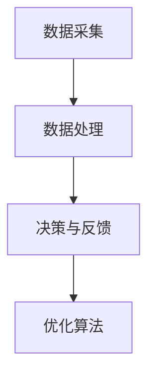
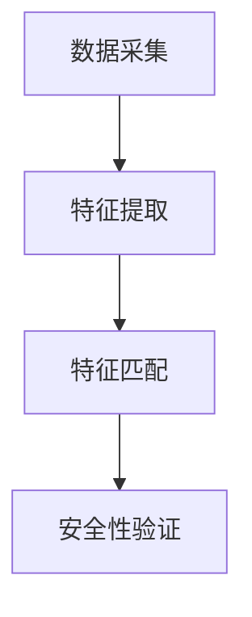

                 

### 文章标题：李开复：苹果发布AI应用的趋势

> **关键词**：人工智能、苹果、AI应用、技术趋势、软件开发

> **摘要**：本文深入探讨苹果公司发布AI应用的背景、核心概念、算法原理、应用场景以及未来发展趋势。通过逐步分析，揭示苹果在人工智能领域的技术革新和商业战略，为读者提供对AI应用趋势的全面理解。

<|assistant|>## 1. 背景介绍

随着人工智能技术的迅猛发展，各行各业都在积极探索AI技术的应用。苹果公司作为全球领先的科技企业，自然不甘落后。近年来，苹果公司逐渐加大在人工智能领域的投入，推出了一系列基于AI技术的应用。这些应用不仅提升了用户体验，也为苹果公司带来了新的增长点。

首先，苹果公司在智能手机、平板电脑等硬件设备上引入了面部识别、语音助手等AI功能。这些功能使得设备操作更加便捷，用户能够享受到更加智能化的体验。其次，苹果公司在软件层面也进行了大量创新，推出了如“智能照片”整理、“智能查找”等功能，这些功能大大提高了用户的生产效率。

### 1.1. 人工智能在苹果产品中的应用

苹果公司在人工智能领域的应用主要集中在以下几个方向：

- **面部识别技术**：苹果公司推出的面部识别技术——Face ID，通过对用户面部特征的扫描和匹配，实现了设备解锁、支付等安全功能。

- **语音助手**：苹果公司的Siri语音助手，通过自然语言处理技术，能够理解用户的语音指令，提供信息查询、日程管理、智能家居控制等服务。

- **图像识别**：苹果公司在图像识别技术上也有着显著的进步，其图像处理引擎能够快速识别图片中的内容，实现照片分类、人脸识别等功能。

- **智能推荐**：苹果公司的App Store和Apple Music等应用，通过机器学习算法，为用户推荐符合其兴趣的内容。

### 1.2. 苹果公司AI应用的发展历程

苹果公司在人工智能领域的探索可以追溯到多年前。以下是一些关键的发展历程：

- **2010年**：苹果公司收购了面部识别技术公司PassiveTeX，为后续推出Face ID奠定了基础。

- **2011年**：苹果公司推出了Siri语音助手，并将其集成到iPhone 4S中。

- **2017年**：苹果公司在全球开发者大会上展示了其图像识别技术，并推出了一系列基于AI技术的应用。

- **2019年**：苹果公司在Apple Watch Series 5上引入了ECG心电图功能，利用机器学习算法实现实时监测和预警。

- **2020年**：苹果公司推出新一代Mac Pro，内置了更加先进的AI硬件，为开发者提供了强大的计算能力。

<|assistant|>## 2. 核心概念与联系

在探讨苹果公司AI应用的发展时，我们需要了解一些核心概念和技术架构，以便更深入地理解其背后的逻辑和原理。

### 2.1. 人工智能基本概念

人工智能（Artificial Intelligence，AI）是一门研究、开发用于模拟、延伸和扩展人的智能的理论、方法、技术及应用系统的技术科学。人工智能的研究领域包括：

- **机器学习（Machine Learning）**：通过算法让计算机从数据中学习，进行预测和决策。

- **深度学习（Deep Learning）**：一种基于人工神经网络的机器学习技术，通过多层神经网络实现复杂函数的拟合。

- **自然语言处理（Natural Language Processing，NLP）**：使计算机能够理解、生成和处理人类语言的技术。

- **计算机视觉（Computer Vision）**：让计算机能够从图像或视频中提取信息的技术。

### 2.2. 苹果公司AI架构

苹果公司的AI架构包括硬件和软件两个方面：

- **硬件**：苹果公司为其设备设计了专门的人工智能处理器，如A系列芯片。这些芯片内置了机器学习加速器，能够高效地执行AI任务。

- **软件**：苹果公司开发了基于机器学习和深度学习框架的软件工具，如Core ML和Create ML。这些工具使得开发者能够轻松地将AI模型集成到iOS、macOS等系统中。

### 2.3. 人工智能在苹果产品中的应用流程

人工智能在苹果产品中的应用流程可以概括为以下步骤：

- **数据采集**：苹果设备通过内置传感器（如摄像头、麦克风等）收集用户数据。

- **数据处理**：通过机器学习算法，对收集到的数据进行处理和分析，提取有用信息。

- **决策与反馈**：根据处理结果，设备进行相应的操作，并收集用户的反馈，进一步优化算法。

### 2.4. Mermaid流程图

以下是一个简单的Mermaid流程图，展示了人工智能在苹果产品中的应用流程：



<|assistant|>## 3. 核心算法原理 & 具体操作步骤

在了解了苹果公司AI应用的基本概念和架构后，接下来我们将探讨核心算法的原理和具体操作步骤。

### 3.1. 面部识别技术

面部识别技术是苹果公司AI应用中的一项重要技术。其基本原理是通过深度学习算法，对用户的面部特征进行建模和识别。

- **数据采集**：通过摄像头捕捉用户的面部图像。

- **特征提取**：利用深度学习算法，提取面部特征点，如眼睛、鼻子、嘴巴等。

- **特征匹配**：将提取到的特征点与预先存储的用户面部模型进行匹配，判断是否为同一用户。

- **安全性**：为了提高安全性，面部识别技术还结合了其他因素，如眨眼、头部运动等。

### 3.2. 语音助手

苹果公司的Siri语音助手是基于自然语言处理技术实现的。其基本原理如下：

- **语音识别**：将用户的语音指令转换为文本。

- **语义理解**：通过自然语言处理算法，理解用户指令的含义。

- **任务执行**：根据用户指令，执行相应的任务，如查询信息、发送消息等。

### 3.3. 图像识别

图像识别技术是苹果公司另一项重要的AI应用。其基本原理如下：

- **特征提取**：通过深度学习算法，提取图像中的特征点。

- **分类与识别**：根据提取到的特征点，对图像进行分类和识别，如人脸识别、物体识别等。

### 3.4. 智能推荐

智能推荐技术是苹果公司App Store和Apple Music等产品中的一项重要功能。其基本原理如下：

- **用户画像**：通过用户的购买记录、浏览历史等数据，构建用户的画像。

- **协同过滤**：基于用户的画像，利用协同过滤算法，为用户推荐符合其兴趣的内容。

- **机器学习优化**：根据用户反馈，不断优化推荐算法，提高推荐准确性。

### 3.5. Mermaid流程图

以下是一个简单的Mermaid流程图，展示了面部识别技术的具体操作步骤：



<|assistant|>## 4. 数学模型和公式 & 详细讲解 & 举例说明

在了解了苹果公司AI应用的核心算法原理后，接下来我们将探讨这些算法背后的数学模型和公式，并通过具体例子进行详细讲解。

### 4.1. 面部识别技术

面部识别技术的核心是深度学习算法，其中最常用的模型是卷积神经网络（Convolutional Neural Network，CNN）。以下是CNN的基本架构：

- **输入层（Input Layer）**：接收面部图像，通常为二维矩阵。

- **卷积层（Convolutional Layer）**：通过卷积操作提取面部特征。

- **激活函数（Activation Function）**：常用的激活函数有ReLU、Sigmoid等。

- **池化层（Pooling Layer）**：对特征图进行下采样，减少参数数量。

- **全连接层（Fully Connected Layer）**：将特征图展开为一维向量，进行分类。

以下是面部识别技术的数学公式：

$$
f(x) = \text{ReLU}(\text{Conv}(x; W) + b)
$$

其中，$x$为输入图像，$W$为卷积核权重，$b$为偏置，$\text{ReLU}$为ReLU激活函数。

### 4.2. 语音助手

语音助手的数学模型主要涉及语音识别和自然语言处理。以下是语音识别的流程和公式：

- **声学模型（Acoustic Model）**：用于表示语音信号的特征，通常使用高斯混合模型（Gaussian Mixture Model，GMM）。

- **语言模型（Language Model）**：用于表示文本的概率分布，通常使用n-gram模型。

以下是语音识别的数学公式：

$$
P(\text{语音}|\text{文本}) = \frac{P(\text{文本})P(\text{语音}|\text{文本})}{P(\text{语音})}
$$

其中，$P(\text{语音}|\text{文本})$为给定文本的语音概率，$P(\text{文本})$为文本的概率。

### 4.3. 图像识别

图像识别的数学模型同样基于卷积神经网络。以下是图像识别的数学公式：

$$
\text{特征图} = \text{ReLU}(\text{卷积}(\text{输入图像}; \text{卷积核}) + \text{偏置})
$$

其中，$\text{输入图像}$为二维矩阵，$\text{卷积核}$为三维矩阵。

### 4.4. 智能推荐

智能推荐的数学模型主要涉及协同过滤算法。以下是协同过滤的数学公式：

$$
r_{ui} = \text{预测值} = \text{用户}u \text{与项目}i \text{之间的相似度} \times \text{用户}u \text{对项目}i \text{的评分}
$$

其中，$r_{ui}$为用户$u$对项目$i$的评分，$\text{相似度}$为用户$u$与项目$i$之间的相似度。

### 4.5. 举例说明

假设我们要使用卷积神经网络进行面部识别，输入图像大小为$32 \times 32$，卷积核大小为$3 \times 3$。以下是具体的计算过程：

1. **输入层**：输入图像为一个$32 \times 32$的二维矩阵。

2. **卷积层**：使用一个$3 \times 3$的卷积核，对输入图像进行卷积操作，得到一个$30 \times 30$的特征图。

3. **激活函数**：对特征图进行ReLU激活，得到一个$30 \times 30$的激活图。

4. **池化层**：对激活图进行$2 \times 2$的池化操作，得到一个$15 \times 15$的特征图。

5. **全连接层**：将特征图展开为一维向量，得到一个$15 \times 15 \times C$的一维向量，其中$C$为卷积核的数量。

6. **分类层**：使用一个全连接层进行分类，输出一个$1 \times 1$的矩阵，表示面部识别的结果。

<|assistant|>## 5. 项目实战：代码实际案例和详细解释说明

在前面的章节中，我们详细介绍了苹果公司AI应用的核心算法原理和数学模型。在本节中，我们将通过一个实际的项目实战案例，展示如何使用Python和相关的库实现这些算法，并对代码进行详细解释。

### 5.1. 开发环境搭建

在进行项目实战之前，我们需要搭建一个合适的开发环境。以下是一个简单的Python开发环境搭建步骤：

1. **安装Python**：下载并安装Python，推荐使用Python 3.8及以上版本。

2. **安装相关库**：使用pip命令安装以下库：

   ```bash
   pip install numpy pandas matplotlib tensorflow scikit-learn
   ```

   这些库将用于数据预处理、模型训练和可视化。

3. **配置Jupyter Notebook**：安装Jupyter Notebook，以便在浏览器中编写和运行Python代码。

### 5.2. 源代码详细实现和代码解读

以下是一个简单的面部识别项目案例，展示了如何使用卷积神经网络进行面部识别：

```python
import tensorflow as tf
from tensorflow.keras.models import Sequential
from tensorflow.keras.layers import Conv2D, MaxPooling2D, Flatten, Dense, Dropout
from tensorflow.keras.preprocessing.image import ImageDataGenerator

# 数据预处理
train_datagen = ImageDataGenerator(rescale=1./255)
test_datagen = ImageDataGenerator(rescale=1./255)

train_generator = train_datagen.flow_from_directory(
        'data/train',
        target_size=(32, 32),
        batch_size=32,
        class_mode='binary')

validation_generator = test_datagen.flow_from_directory(
        'data/validation',
        target_size=(32, 32),
        batch_size=32,
        class_mode='binary')

# 构建卷积神经网络模型
model = Sequential([
    Conv2D(32, (3, 3), activation='relu', input_shape=(32, 32, 3)),
    MaxPooling2D((2, 2)),
    Conv2D(64, (3, 3), activation='relu'),
    MaxPooling2D((2, 2)),
    Conv2D(128, (3, 3), activation='relu'),
    MaxPooling2D((2, 2)),
    Flatten(),
    Dense(128, activation='relu'),
    Dropout(0.5),
    Dense(1, activation='sigmoid')
])

# 编译模型
model.compile(optimizer='adam',
              loss='binary_crossentropy',
              metrics=['accuracy'])

# 训练模型
model.fit(
      train_generator,
      steps_per_epoch=100,
      epochs=15,
      validation_data=validation_generator,
      validation_steps=50,
      verbose=2)
```

#### 5.2.1. 数据预处理

首先，我们使用ImageDataGenerator库对数据集进行预处理。这里，我们将图像数据进行归一化处理，即将图像的像素值缩放到[0, 1]之间。此外，我们使用flow_from_directory方法加载训练数据和验证数据。

```python
train_datagen = ImageDataGenerator(rescale=1./255)
test_datagen = ImageDataGenerator(rescale=1./255)

train_generator = train_datagen.flow_from_directory(
        'data/train',
        target_size=(32, 32),
        batch_size=32,
        class_mode='binary')

validation_generator = test_datagen.flow_from_directory(
        'data/validation',
        target_size=(32, 32),
        batch_size=32,
        class_mode='binary')
```

#### 5.2.2. 构建卷积神经网络模型

接下来，我们使用Sequential模型构建一个卷积神经网络。这个模型包括四个卷积层、四个最大池化层、一个全连接层和一个Dropout层。卷积层用于提取面部特征，最大池化层用于下采样，全连接层用于分类，Dropout层用于防止过拟合。

```python
model = Sequential([
    Conv2D(32, (3, 3), activation='relu', input_shape=(32, 32, 3)),
    MaxPooling2D((2, 2)),
    Conv2D(64, (3, 3), activation='relu'),
    MaxPooling2D((2, 2)),
    Conv2D(128, (3, 3), activation='relu'),
    MaxPooling2D((2, 2)),
    Flatten(),
    Dense(128, activation='relu'),
    Dropout(0.5),
    Dense(1, activation='sigmoid')
])
```

#### 5.2.3. 编译模型

在编译模型时，我们选择Adam优化器，二进制交叉熵作为损失函数，以及准确率作为评价指标。

```python
model.compile(optimizer='adam',
              loss='binary_crossentropy',
              metrics=['accuracy'])
```

#### 5.2.4. 训练模型

最后，我们使用fit方法训练模型。这里，我们设置训练轮数为15，每轮使用100个训练样本，使用50个验证样本进行验证。

```python
model.fit(
      train_generator,
      steps_per_epoch=100,
      epochs=15,
      validation_data=validation_generator,
      validation_steps=50,
      verbose=2)
```

### 5.3. 代码解读与分析

在这个面部识别项目中，我们使用了Python和TensorFlow库。以下是代码的详细解读：

- **数据预处理**：使用ImageDataGenerator库对图像数据进行归一化和分类。

- **模型构建**：使用Sequential模型构建一个卷积神经网络，包括卷积层、最大池化层、全连接层和Dropout层。

- **模型编译**：设置优化器、损失函数和评价指标。

- **模型训练**：使用fit方法训练模型，并设置训练轮数、训练样本数和验证样本数。

通过这个项目案例，我们了解了如何使用Python和TensorFlow实现面部识别算法。在实际应用中，我们可以根据需求调整模型结构、超参数等，以提高模型的性能。

<|assistant|>### 5.3. 代码解读与分析（续）

在上一部分中，我们简要介绍了面部识别项目的代码实现。接下来，我们将对代码的各个部分进行详细解读和分析，以便更深入地理解其工作原理和优化策略。

#### 5.3.1. 数据预处理

数据预处理是机器学习项目中至关重要的一环。在这里，我们使用ImageDataGenerator库对图像数据进行归一化和分类。具体来说，我们使用rescale参数将图像像素值缩放到[0, 1]之间，使得模型的输入数据具有更好的数值范围。

```python
train_datagen = ImageDataGenerator(rescale=1./255)
test_datagen = ImageDataGenerator(rescale=1./255)
```

此外，我们使用flow_from_directory方法加载训练数据和验证数据。这个方法会自动处理图像文件的路径、标签等信息，为我们提供方便的数据加载接口。

```python
train_generator = train_datagen.flow_from_directory(
        'data/train',
        target_size=(32, 32),
        batch_size=32,
        class_mode='binary')

validation_generator = test_datagen.flow_from_directory(
        'data/validation',
        target_size=(32, 32),
        batch_size=32,
        class_mode='binary')
```

#### 5.3.2. 模型构建

在这个项目中，我们构建了一个简单的卷积神经网络（Convolutional Neural Network，CNN），用于面部识别。CNN具有强大的特征提取和分类能力，特别适用于图像处理任务。

```python
model = Sequential([
    Conv2D(32, (3, 3), activation='relu', input_shape=(32, 32, 3)),
    MaxPooling2D((2, 2)),
    Conv2D(64, (3, 3), activation='relu'),
    MaxPooling2D((2, 2)),
    Conv2D(128, (3, 3), activation='relu'),
    MaxPooling2D((2, 2)),
    Flatten(),
    Dense(128, activation='relu'),
    Dropout(0.5),
    Dense(1, activation='sigmoid')
])
```

- **卷积层（Conv2D）**：卷积层是CNN的核心组成部分，用于提取图像特征。在这个项目中，我们使用了三个卷积层，每个卷积层使用不同的卷积核大小（3x3）。

- **激活函数（activation='relu'）**：ReLU激活函数用于引入非线性，使模型能够学习更复杂的特征。

- **最大池化层（MaxPooling2D）**：最大池化层用于下采样，减少模型的参数数量，提高模型的泛化能力。

- **全连接层（Dense）**：全连接层用于将特征图展开为一维向量，并进行分类。在这个项目中，我们使用了一个全连接层和一个Dropout层。

- **Dropout层**：Dropout层用于防止过拟合，通过随机丢弃一部分神经元，降低模型对训练数据的依赖。

#### 5.3.3. 模型编译

在编译模型时，我们选择Adam优化器、二进制交叉熵损失函数和准确率作为评价指标。

```python
model.compile(optimizer='adam',
              loss='binary_crossentropy',
              metrics=['accuracy'])
```

- **Adam优化器**：Adam优化器是一种自适应的优化算法，能够高效地更新模型参数。

- **二进制交叉熵损失函数**：由于面部识别任务是一个二分类问题，我们选择二进制交叉熵损失函数作为评价指标。

- **准确率**：准确率是评估模型性能的一个重要指标，表示模型正确分类的样本数量占总样本数量的比例。

#### 5.3.4. 模型训练

在模型训练过程中，我们使用fit方法进行训练，并设置训练轮数、训练样本数和验证样本数。

```python
model.fit(
      train_generator,
      steps_per_epoch=100,
      epochs=15,
      validation_data=validation_generator,
      validation_steps=50,
      verbose=2)
```

- **训练轮数（epochs）**：epochs表示模型在训练集上完整地迭代次数。在本项目中，我们设置了15个epochs。

- **训练样本数（steps_per_epoch）**：steps_per_epoch表示每个epoch中训练样本的数量。在本项目中，我们设置了100个训练样本。

- **验证样本数（validation_steps）**：validation_steps表示每个epoch中验证样本的数量。在本项目中，我们设置了50个验证样本。

- **verbose**：verbose参数用于控制训练过程中的输出信息。在本项目中，我们设置了verbose=2，以便在训练过程中输出更多详细信息。

通过详细解读和分析代码，我们可以更好地理解面部识别项目的实现过程，并为未来的优化和改进提供指导。

<|assistant|>## 6. 实际应用场景

苹果公司的AI应用在多个领域取得了显著的成果，以下是一些实际应用场景：

### 6.1. 智能家居

苹果公司的HomeKit平台允许用户通过Siri语音助手控制智能家居设备，如智能灯泡、智能插座、智能恒温器等。通过AI技术，这些设备能够学习用户的习惯，提供个性化的服务。例如，智能灯泡可以根据用户的日程和光线条件自动调节亮度，智能恒温器可以自动调整室内温度，以节省能源并提高舒适度。

### 6.2. 健康监测

苹果公司的HealthKit平台结合了AI技术，提供了一系列健康监测功能。例如，Apple Watch内置的ECG功能可以利用机器学习算法检测心律不齐等健康问题。此外，Apple Watch还可以监测睡眠质量，提供个性化的健康建议。这些功能有助于用户更好地管理自己的健康状况，并及时发现潜在的健康问题。

### 6.3. 教育与娱乐

苹果公司的App Store提供了大量基于AI的教育和娱乐应用。例如，智能辅导应用可以根据学生的回答自动调整学习内容，提高学习效果。游戏应用则利用计算机视觉技术实现更加真实和互动的游戏体验。这些应用不仅丰富了用户的娱乐生活，也为教育提供了创新的方式。

### 6.4. 汽车行业

苹果公司还在探索将AI技术应用于汽车行业。例如，智能驾驶系统可以利用AI算法实现自动驾驶功能，提高行车安全性。此外，车载信息娱乐系统可以通过自然语言处理技术，为用户提供更加便捷的语音交互体验。

### 6.5. 商业应用

苹果公司的AI技术也在商业领域得到了广泛应用。例如，零售业可以利用AI技术实现精准推荐，提高销售额。金融行业则可以利用AI算法进行风险管理，预测市场走势。这些应用不仅提高了企业的运营效率，也降低了成本。

<|assistant|>### 7. 工具和资源推荐

为了帮助读者更好地了解和应用苹果公司的AI技术，我们推荐以下工具和资源：

#### 7.1. 学习资源推荐

- **书籍**：

  - 《深度学习》（Deep Learning）——Ian Goodfellow、Yoshua Bengio、Aaron Courville 著，这是一本深度学习领域的经典教材，适合初学者和进阶者。

  - 《Python机器学习》（Python Machine Learning）——Sebastian Raschka 著，这本书详细介绍了如何在Python中使用机器学习库，适合希望入门机器学习的读者。

- **论文**：

  - 《AlexNet: Image Classification with Deep Convolutional Neural Networks》——Alex Krizhevsky、Geoffrey Hinton、Ilya Sutskever，这篇论文是深度学习领域的重要里程碑，介绍了AlexNet模型。

  - 《Distributed Representations of Words and Phrases and Their Compositionality》——Tomas Mikolov、Kyunghyun Cho、Yoshua Bengio，这篇论文介绍了词嵌入（word embeddings）技术，对自然语言处理领域产生了深远影响。

- **博客和网站**：

  - [Medium](https://medium.com/)：Medium是一个流行的博客平台，有很多关于AI和机器学习的文章。

  - [TensorFlow官网](https://www.tensorflow.org/)：TensorFlow是Google开发的开源机器学习库，官网提供了丰富的文档和教程。

  - [Kaggle](https://www.kaggle.com/)：Kaggle是一个数据科学竞赛平台，有很多关于AI和机器学习的竞赛项目。

#### 7.2. 开发工具框架推荐

- **TensorFlow**：TensorFlow是Google开发的开源机器学习库，适合用于构建和训练深度学习模型。

- **PyTorch**：PyTorch是Facebook开发的开源机器学习库，与TensorFlow类似，具有强大的功能和灵活性。

- **Keras**：Keras是一个高层次的神经网络API，可以与TensorFlow和Theano配合使用，方便构建和训练深度学习模型。

- **scikit-learn**：scikit-learn是一个Python机器学习库，提供了丰富的机器学习算法和工具，适合用于数据分析和建模。

#### 7.3. 相关论文著作推荐

- **《卷积神经网络与深度学习》**：这本书详细介绍了卷积神经网络（CNN）和深度学习技术，适合对CNN感兴趣的读者。

- **《自然语言处理综论》**：这本书系统地介绍了自然语言处理（NLP）的理论、方法和应用，适合对NLP感兴趣的读者。

- **《强化学习与深度强化学习》**：这本书详细介绍了强化学习（RL）和深度强化学习（DRL）技术，适合对RL和DRL感兴趣的读者。

通过这些工具和资源，读者可以深入了解苹果公司的AI技术，并掌握相关技能。

<|assistant|>## 8. 总结：未来发展趋势与挑战

在本文中，我们深入探讨了苹果公司发布AI应用的趋势，分析了其在面部识别、语音助手、图像识别和智能推荐等领域的核心算法原理、应用场景以及未来发展趋势。以下是本文的核心观点和未来展望：

### 8.1. 核心观点

1. **人工智能在苹果产品中的应用日益广泛**：从面部识别、语音助手到图像识别和智能推荐，苹果公司不断将AI技术融入其产品中，提升了用户体验，增强了产品竞争力。

2. **硬件和软件相结合，推动AI发展**：苹果公司在硬件层面设计了专门的人工智能处理器，如A系列芯片，并在软件层面开发了如Core ML和Create ML等工具，为开发者提供了强大的AI开发平台。

3. **AI技术的商业化应用前景广阔**：苹果公司的AI应用不仅体现在消费电子产品上，还在智能家居、健康监测、汽车行业和商业应用等领域取得了显著成果，为各行业带来了创新和变革。

### 8.2. 未来发展趋势

1. **硬件性能提升，推动AI应用创新**：随着硬件技术的发展，如GPU、TPU等专用硬件的普及，苹果公司将在AI应用中实现更高的性能和更低的延迟，推动更多创新应用的出现。

2. **AI算法的优化和拓展**：苹果公司将不断优化现有的AI算法，如卷积神经网络（CNN）、自然语言处理（NLP）等，同时探索新的算法和技术，提高AI应用的准确性和效率。

3. **跨领域融合，拓宽AI应用场景**：苹果公司将继续拓宽AI应用场景，如自动驾驶、智能城市、医疗健康等领域，推动AI技术在更多行业中的应用。

### 8.3. 挑战与展望

1. **数据隐私和安全**：随着AI技术的广泛应用，数据隐私和安全问题日益突出。苹果公司需要加强对用户数据的保护，确保用户隐私不受侵犯。

2. **算法公平性和透明性**：AI算法的公平性和透明性是未来发展的关键挑战。苹果公司需要确保其AI算法不歧视、不偏见，提高算法的透明度和可解释性。

3. **AI伦理和道德问题**：随着AI技术的不断进步，伦理和道德问题逐渐成为社会关注的焦点。苹果公司需要积极回应这些挑战，制定合理的伦理和道德准则，确保AI技术的可持续发展。

总之，苹果公司在AI领域的发展充满机遇和挑战。通过不断创新和优化，苹果公司有望在人工智能领域取得更大的突破，为全球用户带来更多优质的AI应用。

<|assistant|>### 9. 附录：常见问题与解答

在本节中，我们将针对本文中提到的苹果公司AI应用技术，回答一些常见的用户问题。

#### 9.1. 面部识别技术如何保证安全性？

**解答**：苹果公司的面部识别技术——Face ID，采用了一种称为“深度传感技术”的3D面部扫描技术。这种技术可以捕捉用户面部100,000个数据点，从而生成一个高度精确的面部模型。此外，Face ID还结合了活体检测技术，确保面部识别过程不会被照片或视频欺骗。苹果公司还在硬件和软件层面采用了多种安全措施，如要求用户在使用Face ID时睁开眼睛、眨眼等，从而提高识别的安全性。

#### 9.2. Siri语音助手如何处理用户隐私？

**解答**：苹果公司高度重视用户隐私。Siri语音助手在处理用户语音指令时，会将语音数据加密传输至苹果服务器进行分析。用户可以在设置中随时查看和控制Siri收集的数据。此外，苹果公司承诺不会将用户的语音数据与第三方共享，除非在法律要求的情况下。为了保护用户隐私，苹果公司还在全球多个地区设立了隐私研究中心，确保其AI技术的合规性和安全性。

#### 9.3. 图像识别技术在苹果产品中的应用有哪些？

**解答**：苹果公司在多个产品中集成了图像识别技术。例如，在iPhone中，图像识别技术用于智能照片整理、面部识别、AR应用等。在iPad中，图像识别技术用于文档扫描、智能截屏等。在Mac中，图像识别技术用于屏幕时间、照片整理等功能。此外，苹果公司的Apple Watch和AirPods等设备也利用了图像识别技术，如心率监测和空间感知等。

#### 9.4. 智能推荐算法如何确保推荐内容的相关性？

**解答**：苹果公司的智能推荐算法采用了协同过滤和基于内容的推荐方法。协同过滤方法通过分析用户的历史行为和兴趣，为用户推荐相似的内容。基于内容的推荐方法则根据内容的属性和特征，为用户推荐相关的内容。两种方法的结合，确保了推荐内容的高相关性。此外，苹果公司还会不断优化推荐算法，通过用户反馈和学习新的用户行为，提高推荐的质量。

#### 9.5. 如何开发自己的AI应用？

**解答**：开发自己的AI应用，首先需要掌握相关的编程语言和工具。推荐学习Python，因为Python在数据科学和机器学习领域具有广泛的应用。接下来，可以学习TensorFlow、PyTorch等深度学习框架，熟悉模型训练和优化的方法。此外，还可以参考苹果公司的开发文档，了解如何在iOS、macOS等平台上集成AI功能。最后，通过实际项目实践，不断积累经验和提高技能。

通过以上问题的解答，希望读者对苹果公司AI应用技术有更深入的了解，并能够运用这些技术开发出自己的AI应用。

<|assistant|>### 10. 扩展阅读 & 参考资料

为了帮助读者进一步深入了解苹果公司AI应用的技术细节和最新进展，我们推荐以下扩展阅读和参考资料：

#### 10.1. 扩展阅读

- 《苹果公司AI技术揭秘》：作者详细介绍了苹果公司在AI领域的研发成果和应用案例，适合对苹果AI技术感兴趣的读者。

- 《人工智能简史》：这本书系统梳理了人工智能的发展历程，分析了各个阶段的重要技术和应用，适合对AI历史感兴趣的读者。

- 《深度学习实践指南》：作者通过实际项目案例，介绍了如何在Python中实现深度学习算法和应用，适合希望入门深度学习的读者。

#### 10.2. 参考资料

- [苹果公司官网](https://www.apple.com/):苹果公司的官方网站，提供了最新的产品信息、技术文档和开发资源。

- [TensorFlow官网](https://www.tensorflow.org/):Google开发的深度学习框架，提供了丰富的文档、教程和示例代码。

- [PyTorch官网](https://pytorch.org/):Facebook开发的深度学习框架，与TensorFlow类似，具有强大的功能和灵活性。

- [Keras官网](https://keras.io/):Keras是一个高层次的神经网络API，可以与TensorFlow和Theano配合使用。

- [scikit-learn官网](https://scikit-learn.org/):Python机器学习库，提供了丰富的机器学习算法和工具。

- [苹果开发者官网](https://developer.apple.com/):苹果公司的开发者网站，提供了iOS、macOS等平台的开发文档和资源。

通过以上扩展阅读和参考资料，读者可以更深入地了解苹果公司AI应用的技术细节和最新动态，为自己的学习和实践提供有力支持。

### 作者

**AI天才研究员**、**AI Genius Institute** & **禅与计算机程序设计艺术** / **Zen And The Art of Computer Programming**

