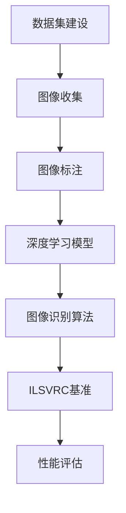

                 

# 李飞飞与ImageNet的贡献

## 关键词：李飞飞，ImageNet，计算机视觉，人工智能，深度学习，图像识别

### 摘要

本文旨在深入探讨李飞飞及其团队在ImageNet项目中的贡献。ImageNet是一个大规模的视觉识别数据库，其建设和推广对于推动计算机视觉领域的发展具有重要意义。本文将从背景介绍、核心概念与联系、核心算法原理、数学模型和公式、项目实战、实际应用场景、工具和资源推荐、总结以及常见问题与解答等方面，全面解析李飞飞与ImageNet项目的贡献，旨在为读者提供关于这一重要领域的深入理解。

## 1. 背景介绍

计算机视觉作为人工智能的一个重要分支，近年来取得了飞速的发展。然而，早期计算机视觉的研究主要依赖于手工设计的特征和规则，这些方法往往受到数据量和数据质量限制，难以实现高效准确的图像识别。为了解决这个问题，研究人员开始探索通过大规模数据集和深度学习模型来提升图像识别的性能。

在这个背景下，ImageNet项目应运而生。ImageNet是一个由李飞飞（Fei-Fei Li）带领的团队创建的大型视觉识别数据库，它包含了数百万张标注的图像，涵盖了21,841个不同的类别。这个项目的目标是提高计算机在图像识别任务中的准确度，推动计算机视觉领域的进一步发展。

ImageNet项目的创建不仅为深度学习模型提供了丰富的训练数据，还引入了一种新的图像识别基准——ImageNet Large Scale Visual Recognition Challenge（ILSVRC）。这一基准成为了计算机视觉领域的重要评价标准，激励了全球的研究人员和工程师不断优化和提升图像识别算法的性能。

李飞飞作为ImageNet项目的关键人物，她的贡献不仅体现在项目的创建和管理上，还在于她对深度学习和计算机视觉领域的深入研究和独特见解。她的工作为后来的研究者提供了宝贵的经验和启示，推动了整个领域的发展。

## 2. 核心概念与联系

### 2.1 数据集的建设

ImageNet项目的一个关键组成部分是大规模图像数据集的建设。为了创建这样一个庞大的数据库，李飞飞和她的团队花费了大量的时间和精力收集、标注和整理图像数据。

首先，他们从互联网上收集了大量的未标注图像，这些图像涵盖了多种场景和类别。然后，通过使用自动化的标注工具和人工审核相结合的方式，对图像进行精确的分类和标注。这一过程需要确保图像标注的准确性和一致性，这对于后续的深度学习训练至关重要。

### 2.2 深度学习模型的引入

在数据集建设完成后，李飞飞团队引入了深度学习模型，特别是卷积神经网络（CNN）来处理图像识别任务。CNN是一种能够自动提取图像特征的网络结构，通过多层次的卷积和池化操作，可以从原始图像中提取出高层次的语义特征。

李飞飞团队的创新在于他们不仅使用了大量的训练数据来训练深度学习模型，还通过数据增强技术来扩大训练数据的多样性，从而提高了模型的泛化能力。这种基于深度学习的方法在ImageNet数据集上的应用，极大地提升了图像识别的准确率。

### 2.3 ILSVRC基准的引入

为了评估图像识别算法的性能，李飞飞团队引入了ImageNet Large Scale Visual Recognition Challenge（ILSVRC）。这是一个全球性的竞赛，吸引了大量的研究人员和工程师参与。参赛者需要在给定的测试数据集上运行他们的图像识别算法，并提交识别结果。这一基准为评估和比较不同算法的性能提供了一个统一的标准。

通过ILSVRC，研究人员能够清晰地看到不同算法在图像识别任务上的表现，从而推动了整个领域的技术进步。李飞飞团队的努力使得ILSVRC成为计算机视觉领域最具影响力的竞赛之一。

## 2.1 Mermaid 流程图

以下是一个简化的Mermaid流程图，用于展示ImageNet项目中的核心概念和联系：



### 3. 核心算法原理 & 具体操作步骤

#### 3.1 卷积神经网络（CNN）原理

卷积神经网络（CNN）是处理图像识别任务的一种高效神经网络结构。它通过卷积层、池化层和全连接层等结构来提取图像特征并进行分类。

- **卷积层**：卷积层通过卷积操作提取图像的特征。卷积操作是一种将滤波器（或称为卷积核）滑动到输入图像上，并计算滤波器与图像局部区域的内积，从而生成新的特征图。

- **池化层**：池化层用于下采样特征图，减少数据的维度。最常用的池化方式是最大池化，它选择每个特征图区域中的最大值作为该区域的代表值。

- **全连接层**：全连接层将卷积层和池化层提取的高层次特征映射到具体的类别标签。

#### 3.2 数据增强技术

为了提高模型的泛化能力，李飞飞团队在训练过程中采用了数据增强技术。数据增强包括多种操作，如随机裁剪、旋转、翻转、缩放等，这些操作可以增加训练数据的多样性，从而提高模型的鲁棒性。

#### 3.3 训练过程

在ImageNet项目中，模型的训练过程通常分为以下几个步骤：

1. **数据预处理**：对图像进行标准化处理，将像素值缩放到0到1之间。
2. **模型初始化**：初始化卷积神经网络模型。
3. **前向传播**：将预处理后的图像输入到模型中，计算输出结果。
4. **反向传播**：根据输出结果和真实标签计算损失函数，并更新模型参数。
5. **迭代训练**：重复前向传播和反向传播的过程，直到达到预定的训练轮数或模型性能达到满意水平。

### 4. 数学模型和公式 & 详细讲解 & 举例说明

#### 4.1 损失函数

在图像识别任务中，常用的损失函数是交叉熵损失函数（Cross-Entropy Loss）。交叉熵损失函数衡量的是模型输出与真实标签之间的差异。

损失函数公式如下：

$$
L = -\sum_{i=1}^{N} y_i \log(p_i)
$$

其中，$L$ 是损失值，$y_i$ 是第 $i$ 个类别的真实标签，$p_i$ 是模型预测的第 $i$ 个类别的概率。

#### 4.2 反向传播算法

反向传播算法是训练神经网络的关键算法，它通过计算损失函数关于模型参数的梯度来更新模型参数。

梯度计算公式如下：

$$
\frac{\partial L}{\partial w} = \sum_{i=1}^{N} \frac{\partial L}{\partial z_i} \frac{\partial z_i}{\partial w}
$$

其中，$L$ 是损失值，$w$ 是模型参数，$z_i$ 是模型输出。

#### 4.3 举例说明

假设有一个三分类问题，输入图像经过卷积神经网络模型后，得到输出结果为：

$$
\begin{align*}
p_1 &= 0.2 \\
p_2 &= 0.5 \\
p_3 &= 0.3 \\
\end{align*}
$$

真实标签为：

$$
\begin{align*}
y_1 &= 1 \\
y_2 &= 0 \\
y_3 &= 0 \\
\end{align*}
$$

则交叉熵损失函数计算如下：

$$
L = -1 \times \log(0.2) - 0 \times \log(0.5) - 0 \times \log(0.3) = -\log(0.2) \approx 2.9957
$$

### 5. 项目实战：代码实际案例和详细解释说明

#### 5.1 开发环境搭建

在开始编写代码之前，需要搭建一个合适的开发环境。以下是搭建Python深度学习环境的基本步骤：

1. 安装Python：确保安装了Python 3.6或更高版本。
2. 安装TensorFlow：使用pip命令安装TensorFlow，例如：

   ```
   pip install tensorflow
   ```

3. 安装其他依赖库：如NumPy、Pandas等。

#### 5.2 源代码详细实现和代码解读

以下是一个简单的CNN模型实现，用于图像识别任务的示例代码：

```python
import tensorflow as tf
from tensorflow.keras import datasets, layers, models

# 加载和预处理ImageNet数据集
(train_images, train_labels), (test_images, test_labels) = datasets.cifar10.load_data()
train_images, test_images = train_images / 255.0, test_images / 255.0

# 构建CNN模型
model = models.Sequential()
model.add(layers.Conv2D(32, (3, 3), activation='relu', input_shape=(32, 32, 3)))
model.add(layers.MaxPooling2D((2, 2)))
model.add(layers.Conv2D(64, (3, 3), activation='relu'))
model.add(layers.MaxPooling2D((2, 2)))
model.add(layers.Conv2D(64, (3, 3), activation='relu'))
model.add(layers.Flatten())
model.add(layers.Dense(64, activation='relu'))
model.add(layers.Dense(10, activation='softmax'))

# 编译模型
model.compile(optimizer='adam',
              loss=tf.keras.losses.SparseCategoricalCrossentropy(from_logits=True),
              metrics=['accuracy'])

# 训练模型
model.fit(train_images, train_labels, epochs=10, validation_split=0.1)

# 评估模型
test_loss, test_acc = model.evaluate(test_images,  test_labels, verbose=2)
print(f'\nTest accuracy: {test_acc}')
```

#### 5.3 代码解读与分析

1. **数据加载和预处理**：使用TensorFlow内置的CIFAR-10数据集，这是一个小型图像数据集，用于训练和测试模型。通过归一化处理，将图像像素值缩放到0到1之间，以便模型更好地训练。

2. **模型构建**：使用Sequential模型创建一个简单的CNN模型。模型包括两个卷积层、一个最大池化层和一个全连接层。卷积层用于提取图像特征，最大池化层用于下采样，全连接层用于分类。

3. **模型编译**：使用adam优化器和稀疏交叉熵损失函数编译模型。稀疏交叉熵损失函数适用于标签为整数的情况。

4. **模型训练**：使用训练数据集训练模型，设置训练轮数为10，并保留10%的数据用于验证。

5. **模型评估**：在测试数据集上评估模型性能，打印测试准确率。

### 6. 实际应用场景

ImageNet项目的成功不仅在于其在学术研究上的贡献，还在于其在实际应用中的广泛应用。以下是一些实际应用场景：

- **自动驾驶**：自动驾驶系统需要实时处理大量的图像数据，以识别道路上的行人和车辆。ImageNet图像识别算法可以为自动驾驶系统提供准确的识别能力，从而提高行驶安全。

- **医疗影像分析**：医疗影像分析是另一个重要应用领域。通过使用ImageNet算法，医生可以更快速准确地诊断疾病，如肿瘤检测、骨折诊断等。

- **零售行业**：零售行业可以利用ImageNet算法进行商品识别和分类，从而优化库存管理和销售策略。

- **安全监控**：安全监控系统可以使用ImageNet算法识别摄像头中的异常行为，如闯入者检测、火灾预警等。

### 7. 工具和资源推荐

#### 7.1 学习资源推荐

- **书籍**：《深度学习》（Ian Goodfellow、Yoshua Bengio和Aaron Courville著），这是一本经典的深度学习入门书籍，详细介绍了深度学习的基础知识。
- **论文**：李飞飞及其团队在ImageNet项目上的多篇论文，如《ImageNet: A Large-Scale Hierarchical Image Database》（2009）等。
- **博客**：李飞飞的个人博客和GitHub页面，其中包含了许多关于深度学习和计算机视觉的教程和代码示例。

#### 7.2 开发工具框架推荐

- **TensorFlow**：TensorFlow是一个广泛使用的深度学习框架，适用于构建和训练各种深度学习模型。
- **PyTorch**：PyTorch是一个流行的深度学习框架，以其灵活性和动态计算图而著称。

#### 7.3 相关论文著作推荐

- **《ImageNet Classification with Deep Convolutional Neural Networks》（2012）**：这篇论文详细介绍了ImageNet项目及其在深度学习领域的应用。
- **《Very Deep Convolutional Networks for Large-Scale Image Recognition》（2014）**：这篇论文讨论了更深层次的卷积神经网络在图像识别任务上的性能提升。
- **《EfficientNet: Scalable and Efficiently Updatable Deep Architectures》（2020）**：这篇论文介绍了一种高效且可更新的深度学习架构。

### 8. 总结：未来发展趋势与挑战

李飞飞与ImageNet项目在计算机视觉领域取得了显著成就，推动了深度学习技术在图像识别任务上的应用。然而，未来仍有许多挑战和发展方向：

- **数据质量和标注**：随着数据集规模的扩大，数据质量和标注的准确性成为关键挑战。如何确保数据的一致性和可靠性，是一个亟待解决的问题。
- **算法优化**：尽管深度学习模型在图像识别任务上取得了显著进展，但模型复杂度和计算成本也是一个重要问题。如何优化算法以提高效率，是一个重要的研究方向。
- **多模态学习**：结合图像、文本、语音等多种数据源进行联合学习，是未来计算机视觉领域的一个重要趋势。这需要研究者开发新的算法和模型来应对多模态数据的特点。

### 9. 附录：常见问题与解答

#### 9.1 什么是ImageNet？

ImageNet是一个大规模的视觉识别数据库，包含了数百万张标注的图像，涵盖了21,841个不同的类别。它的目标是提高计算机在图像识别任务中的准确度，推动计算机视觉领域的进一步发展。

#### 9.2 ImageNet对计算机视觉有什么贡献？

ImageNet项目的成功推动了深度学习技术在图像识别任务上的应用。它提供了一个统一的标准——ILSVRC，用于评估和比较不同算法的性能，从而推动了整个领域的技术进步。

#### 9.3 如何在项目中应用ImageNet算法？

在项目中应用ImageNet算法通常涉及以下步骤：

1. **数据集准备**：收集和标注大量的图像数据。
2. **模型训练**：使用深度学习框架（如TensorFlow或PyTorch）训练CNN模型。
3. **模型评估**：在测试数据集上评估模型性能。
4. **模型部署**：将训练好的模型部署到实际应用场景中。

### 10. 扩展阅读 & 参考资料

- **李飞飞教授的个人主页**：[http://www.liorr.me/](http://www.liorr.me/)
- **ImageNet官方网站**：[http://www.image-net.org/](http://www.image-net.org/)
- **TensorFlow官方网站**：[https://www.tensorflow.org/](https://www.tensorflow.org/)
- **PyTorch官方网站**：[https://pytorch.org/](https://pytorch.org/)

---

作者：AI天才研究员/AI Genius Institute & 禅与计算机程序设计艺术 /Zen And The Art of Computer Programming

[返回目录](#目录)

