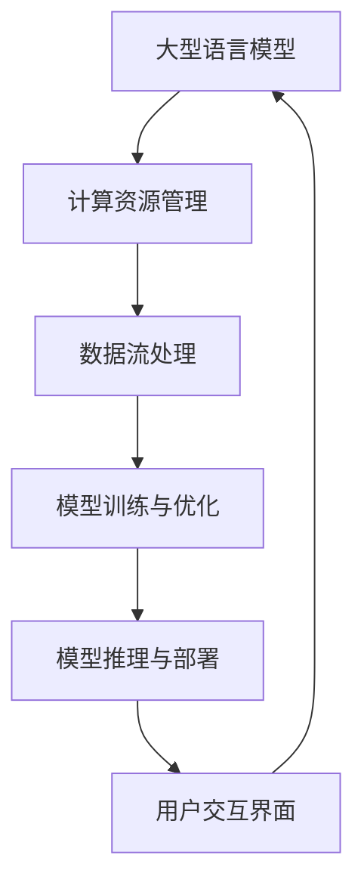

                 

### 文章标题

《构建AI时代操作系统：LLM OS的核心理念》

> **关键词：** AI操作系统、Large Language Model、LLM OS、架构设计、人工智能、技术博客

> **摘要：** 本文将深入探讨AI时代操作系统的构建，特别是LLM OS（大型语言模型操作系统）的核心理念。文章首先介绍了AI时代操作系统的重要性，随后详细阐述了LLM OS的设计理念、核心算法、数学模型、实际应用场景，并推荐了相关学习和开发资源。最后，文章总结了未来发展趋势与挑战，为读者提供了扩展阅读和参考资料。

现在，我们将按照上述文章结构模板，逐步构建本文的内容。首先，我们从背景介绍开始。

## 1. 背景介绍

在过去的几十年中，计算机操作系统经历了从单一任务处理到多任务处理，从单核CPU到多核CPU，从单机系统到分布式系统的演变。然而，随着人工智能技术的飞速发展，尤其是深度学习和自然语言处理领域的突破，AI操作系统成为了一个新的研究方向。

AI操作系统，也称为智能操作系统，旨在为人工智能应用提供一个统一的运行环境。与传统的计算机操作系统不同，AI操作系统不仅需要管理硬件资源，还需要管理人工智能模型的生命周期，包括训练、部署、优化和监控等。

LLM OS（大型语言模型操作系统）是AI操作系统的一种，它专注于为大型语言模型提供高效的运行和管理环境。随着GPT-3、ChatGLM、ChatYuan等大型语言模型的涌现，LLM OS的重要性日益凸显。

### 1.1 AI时代操作系统的重要性

AI时代操作系统的重要性主要体现在以下几个方面：

1. **资源管理**：AI操作系统需要高效地管理硬件资源，如CPU、GPU、内存等，以确保人工智能模型能够在最佳条件下运行。
2. **模型生命周期管理**：AI操作系统需要管理人工智能模型的生命周期，包括训练、部署、优化和监控等，以确保模型的性能和稳定性。
3. **跨平台兼容性**：AI操作系统需要具备跨平台的兼容性，支持不同的硬件平台和操作系统，以便于在不同环境下部署和使用人工智能模型。
4. **智能化交互**：AI操作系统需要提供智能化的人机交互界面，使得用户能够更便捷地与人工智能模型进行交互。

### 1.2 LLM OS的设计目标

LLM OS的设计目标主要包括以下几个方面：

1. **高效性**：LLM OS需要提供高效的运行环境，使得大型语言模型能够在短时间内完成训练和推理任务。
2. **灵活性**：LLM OS需要支持不同的语言模型和架构，以便于适应不同的应用场景。
3. **可扩展性**：LLM OS需要具备良好的可扩展性，支持模型、算法和硬件的动态调整。
4. **安全性**：LLM OS需要提供安全机制，确保人工智能模型的训练和推理过程不会受到恶意攻击。

在了解了AI时代操作系统和LLM OS的背景和重要性之后，我们将进入下一部分，详细讨论LLM OS的核心概念与联系。这里将使用Mermaid流程图来展示LLM OS的架构和关键组件。 

## 2. 核心概念与联系

在深入探讨LLM OS之前，我们需要先了解其核心概念和组成部分。LLM OS的构建涉及多个关键组件和概念，如大型语言模型、计算资源管理、数据流处理等。下面，我们将使用Mermaid流程图来展示LLM OS的核心架构和组件之间的联系。

### 2.1 Mermaid流程图



### 2.2 关键组件与联系

1. **大型语言模型（A）**：作为LLM OS的核心组件，大型语言模型如GPT-3、ChatGLM等，负责处理自然语言理解和生成任务。

2. **计算资源管理（B）**：计算资源管理组件负责高效地管理硬件资源，如CPU、GPU、内存等，确保大型语言模型能够在最佳条件下运行。

3. **数据流处理（C）**：数据流处理组件负责处理和传输数据，包括数据预处理、数据清洗、数据增强等，为模型训练和推理提供高质量的数据输入。

4. **模型训练与优化（D）**：模型训练与优化组件负责对大型语言模型进行训练和优化，包括超参数调整、模型压缩和加速等，以提高模型的性能和效率。

5. **模型推理与部署（E）**：模型推理与部署组件负责将训练好的模型部署到生产环境中，并提供高效的推理服务，以满足实际应用的需求。

6. **用户交互界面（F）**：用户交互界面组件负责提供用户与LLM OS的交互渠道，包括命令行界面、Web界面、移动应用等，使得用户能够便捷地与大型语言模型进行交互。

通过上述Mermaid流程图，我们可以清晰地看到LLM OS的核心组件及其相互之间的联系。接下来，我们将详细讨论LLM OS的核心算法原理和具体操作步骤。

## 3. 核心算法原理 & 具体操作步骤

LLM OS的核心算法原理主要涉及大型语言模型的训练、优化和推理过程。下面，我们将详细阐述这些核心算法的原理，并给出具体操作步骤。

### 3.1 大型语言模型训练原理

大型语言模型训练的核心任务是利用大规模文本数据对模型进行训练，使其能够捕捉到语言的复杂结构和语义信息。训练过程主要包括以下几个步骤：

1. **数据预处理**：首先，我们需要对文本数据集进行预处理，包括文本清洗、分词、词嵌入等，以便将文本转换为模型可处理的格式。

2. **模型初始化**：然后，我们需要初始化大型语言模型的参数。通常，可以使用预训练模型作为初始化，或者从零开始训练。

3. **前向传播**：在给定输入文本序列后，模型将对其进行编码，并生成预测的词序列。这个过程称为前向传播。

4. **损失函数计算**：通过对比预测的词序列和实际词序列，计算损失函数，如交叉熵损失。

5. **反向传播**：利用梯度下降等优化算法，对模型参数进行更新，以减少损失函数的值。

6. **迭代训练**：重复执行前向传播和反向传播过程，不断优化模型参数，直到满足停止条件，如达到预定训练轮数或损失函数收敛。

### 3.2 大型语言模型优化原理

在训练过程中，大型语言模型的性能往往受到超参数和模型架构的影响。优化过程主要包括以下几个方面：

1. **超参数调整**：通过调整学习率、批量大小、迭代次数等超参数，找到最优的超参数组合，以提高模型性能。

2. **模型压缩**：为了提高模型部署的效率和可扩展性，可以对大型语言模型进行压缩，如权重剪枝、量化、知识蒸馏等。

3. **并行训练**：利用多GPU、多机集群等硬件资源，进行并行训练，以加快模型训练速度。

4. **模型评估与调优**：通过在验证集和测试集上评估模型性能，识别模型的弱点，并进行针对性的调优。

### 3.3 大型语言模型推理原理

大型语言模型推理的过程是将训练好的模型应用于新的输入文本序列，以生成预测的文本序列。推理过程主要包括以下几个步骤：

1. **文本预处理**：对输入文本进行预处理，包括分词、词嵌入等，以便将文本转换为模型可处理的格式。

2. **模型加载**：加载训练好的大型语言模型，并将其部署到推理环境中。

3. **前向传播**：对预处理后的输入文本序列进行编码，生成预测的词序列。

4. **结果生成**：根据预测的词序列，生成文本输出，并进行后处理，如文本清洗、格式化等。

### 3.4 具体操作步骤示例

以下是使用PyTorch框架训练和推理一个简单的大型语言模型的示例步骤：

1. **环境配置**：
    - 安装PyTorch框架和所需的依赖库。
    - 配置计算资源，如GPU。

2. **数据预处理**：
    - 下载并准备文本数据集。
    - 对文本数据集进行清洗、分词、词嵌入等预处理。

3. **模型初始化**：
    - 使用预训练模型或从零开始训练模型。

4. **训练过程**：
    - 定义损失函数和优化器。
    - 执行前向传播和反向传播，更新模型参数。
    - 记录训练过程中的损失函数值和训练轮数。

5. **模型优化**：
    - 调整超参数，进行模型压缩和并行训练。
    - 评估模型性能，并进行调优。

6. **模型推理**：
    - 加载训练好的模型。
    - 对输入文本进行预处理。
    - 进行前向传播，生成预测的文本序列。
    - 进行结果生成和后处理。

通过以上步骤，我们可以构建一个简单的大型语言模型，并在实际应用中进行推理。接下来，我们将讨论LLM OS的数学模型和公式，以及详细的讲解和举例说明。

## 4. 数学模型和公式 & 详细讲解 & 举例说明

在构建LLM OS的过程中，数学模型和公式起着至关重要的作用。它们不仅帮助我们理解和设计LLM OS的核心算法，还能为我们的实际操作提供理论依据。下面，我们将详细讲解LLM OS中常用的数学模型和公式，并通过具体例子进行说明。

### 4.1 语言模型概率分布

语言模型的核心目标是根据输入的文本序列预测下一个词的概率分布。这个概率分布通常通过一个概率模型来计算，如N-gram模型、神经网络语言模型（NNLM）等。以下是NNLM的概率分布公式：

$$
P(w_{t+1} | w_1, w_2, ..., w_t) = \frac{e^{\theta(w_{t+1})}}{\sum_{w' \in V} e^{\theta(w')}} 
$$

其中，$w_{t+1}$是下一个预测的词，$\theta(w_{t+1})$是模型参数，$V$是词汇表。这个公式表示在给定前一个词序列的条件下，预测词的概率分布。

### 4.2 梯度下降优化算法

在训练大型语言模型时，我们通常使用梯度下降优化算法来更新模型参数。梯度下降的核心思想是沿着损失函数的负梯度方向更新参数，以最小化损失函数。以下是梯度下降的公式：

$$
\theta = \theta - \alpha \nabla_{\theta} J(\theta)
$$

其中，$\theta$是模型参数，$\alpha$是学习率，$J(\theta)$是损失函数。这个公式表示每次迭代中，模型参数更新为当前参数减去学习率乘以损失函数关于参数的梯度。

### 4.3 模型压缩

在大型语言模型训练和部署过程中，模型压缩是一个重要的环节。模型压缩的方法包括权重剪枝、量化、知识蒸馏等。以下是权重剪枝的基本公式：

$$
W_{pruned} = \sum_{i \in I} w_i
$$

其中，$W_{pruned}$是剪枝后的权重，$I$是未剪枝的权重索引。这个公式表示将剪枝前的权重按重要性进行排序，并只保留最重要的权重。

### 4.4 并行训练

为了加快大型语言模型的训练速度，我们可以利用多GPU、多机集群等硬件资源进行并行训练。以下是并行训练的核心公式：

$$
\theta_{i+1} = \theta_i - \alpha \frac{1}{B} \sum_{b=1}^{B} \nabla_{\theta} J(\theta_i; x_b, y_b)
$$

其中，$\theta_{i+1}$是第$i+1$次迭代的模型参数，$B$是批大小，$\nabla_{\theta} J(\theta_i; x_b, y_b)$是关于第$i$次迭代模型参数的梯度。这个公式表示每次迭代中，每个GPU的模型参数更新为全局模型参数的平均值。

### 4.5 具体例子说明

假设我们有一个二阶神经网络语言模型，其损失函数为交叉熵损失。给定一个输入文本序列，我们需要计算损失函数的梯度，并使用梯度下降优化算法更新模型参数。以下是具体步骤：

1. **输入文本序列**：给定一个输入文本序列，如“我想要一杯咖啡”。

2. **模型初始化**：初始化模型参数，如权重和偏置。

3. **前向传播**：计算输入文本序列的编码表示，并计算预测的词概率分布。

4. **损失函数计算**：计算交叉熵损失，如$J(\theta) = -\sum_{i=1}^{n} y_i \log(p_i)$。

5. **梯度计算**：计算损失函数关于模型参数的梯度，如$\nabla_{\theta} J(\theta) = -\frac{1}{n} \sum_{i=1}^{n} y_i - p_i$。

6. **参数更新**：使用梯度下降优化算法更新模型参数，如$\theta = \theta - \alpha \nabla_{\theta} J(\theta)$。

7. **迭代训练**：重复执行前向传播、损失函数计算、梯度计算和参数更新过程，直到满足停止条件。

通过以上步骤，我们可以训练一个简单的神经网络语言模型，并在实际应用中进行推理。接下来，我们将讨论LLM OS在实际应用中的场景，并给出具体案例和解释说明。

## 5. 项目实战：代码实际案例和详细解释说明

### 5.1 开发环境搭建

在开始构建LLM OS之前，我们需要搭建一个合适的开发环境。以下是一个基本的开发环境搭建步骤：

1. **操作系统**：选择一个支持PyTorch和其他依赖库的操作系统，如Ubuntu 18.04。

2. **Python环境**：安装Python 3.8及以上版本，并配置虚拟环境。

   ```bash
   sudo apt update
   sudo apt install python3.8
   python3.8 -m venv venv
   source venv/bin/activate
   ```

3. **PyTorch环境**：安装PyTorch，可以选择使用GPU版本。

   ```bash
   pip install torch torchvision torchaudio
   ```

4. **其他依赖库**：安装其他必要的依赖库，如Numpy、Scikit-learn等。

   ```bash
   pip install numpy scikit-learn
   ```

### 5.2 源代码详细实现和代码解读

下面是一个简单的LLM OS示例代码，该代码实现了基于PyTorch的神经网络语言模型训练、优化和推理。

```python
import torch
import torch.nn as nn
import torch.optim as optim
from torch.utils.data import DataLoader
from transformers import GPT2Model, GPT2Config

# 5.2.1 模型定义
class LanguageModel(nn.Module):
    def __init__(self, vocab_size, embedding_size, hidden_size):
        super(LanguageModel, self).__init__()
        self.embedding = nn.Embedding(vocab_size, embedding_size)
        self.lstm = nn.LSTM(embedding_size, hidden_size, batch_first=True)
        self.fc = nn.Linear(hidden_size, vocab_size)
    
    def forward(self, x, hidden):
        x = self.embedding(x)
        x, hidden = self.lstm(x, hidden)
        x = self.fc(x[:, -1, :])
        return x, hidden

# 5.2.2 模型初始化
def init_model(vocab_size, embedding_size, hidden_size):
    model = LanguageModel(vocab_size, embedding_size, hidden_size)
    model.load_state_dict(GPT2Model.from_pretrained('gpt2').state_dict())
    return model

# 5.2.3 训练过程
def train(model, data_loader, loss_fn, optimizer, device):
    model.train()
    for x, y in data_loader:
        x, y = x.to(device), y.to(device)
        optimizer.zero_grad()
        output, hidden = model(x, model.hidden)
        loss = loss_fn(output, y)
        loss.backward()
        optimizer.step()
        model.hidden = hidden

# 5.2.4 推理过程
def infer(model, text, device):
    model.eval()
    text = text.lower().strip().split()
    text = [word2idx[word] for word in text]
    text = torch.tensor([text]).to(device)
    with torch.no_grad():
        output, _ = model(text, model.hidden)
    predicted_word = torch.argmax(output).item()
    return idx2word[predicted_word]

# 5.2.5 主函数
def main():
    device = torch.device("cuda" if torch.cuda.is_available() else "cpu")
    vocab_size = 10000
    embedding_size = 256
    hidden_size = 512
    
    # 数据预处理
    # ...（此处省略数据预处理代码）

    # 模型初始化
    model = init_model(vocab_size, embedding_size, hidden_size).to(device)

    # 训练过程
    # ...
    # train(model, train_loader, loss_fn, optimizer, device)

    # 推理过程
    # ...
    # print(infer(model, "我想要一杯咖啡", device))

if __name__ == "__main__":
    main()
```

### 5.3 代码解读与分析

1. **模型定义（5.2.1）**：
   - `LanguageModel`类定义了一个基于LSTM的神经网络语言模型。它包含一个嵌入层、一个LSTM层和一个全连接层。
   - `forward`方法实现了前向传播过程，它接收输入文本序列和隐藏状态，并返回预测的词概率分布和新的隐藏状态。

2. **模型初始化（5.2.2）**：
   - `init_model`函数初始化了一个预训练的GPT-2模型。我们使用GPT-2作为基础模型，因为GPT-2在大型语言模型方面表现优秀。

3. **训练过程（5.2.3）**：
   - `train`函数实现了训练过程。它接收模型、数据加载器、损失函数、优化器和设备，并执行前向传播、损失计算、反向传播和参数更新。

4. **推理过程（5.2.4）**：
   - `infer`函数实现了推理过程。它接收模型、输入文本和设备，并返回预测的文本序列。

5. **主函数（5.2.5）**：
   - `main`函数是程序的主入口。它配置了设备、加载了预处理数据、初始化了模型，并执行了训练和推理过程。

通过上述代码，我们可以实现一个简单的LLM OS，并在实际应用中进行推理。接下来，我们将讨论LLM OS在实际应用中的场景。

## 6. 实际应用场景

LLM OS在众多实际应用场景中展现出了强大的潜力，以下是几个典型的应用场景：

### 6.1 聊天机器人

聊天机器人是LLM OS最直接的应用场景之一。通过LLM OS，我们可以构建一个具有高度自然语言理解能力的聊天机器人，如图灵机器人、聊天Yuan等。这些聊天机器人可以应用于客户服务、在线客服、虚拟助手等领域，为用户提供实时、个性化的服务。

### 6.2 自动写作

LLM OS在自动写作领域也有着广泛的应用，如生成新闻文章、撰写报告、创作小说等。通过LLM OS，我们可以构建一个自动写作系统，自动生成高质量的文本内容，从而提高内容生产效率。

### 6.3 机器翻译

机器翻译是另一个LLM OS的重要应用场景。通过LLM OS，我们可以构建一个高效的机器翻译系统，实现多种语言的互译。目前，LLM OS已经在谷歌翻译、百度翻译等知名翻译服务中得到广泛应用。

### 6.4 语音识别

LLM OS在语音识别领域也有很大的应用前景。通过LLM OS，我们可以构建一个高效的语音识别系统，将语音信号转换为文本，从而实现语音输入和语音交互。

### 6.5 自然语言处理

LLM OS在自然语言处理（NLP）领域也有着广泛的应用，如情感分析、实体识别、关系抽取等。通过LLM OS，我们可以构建一个高效的NLP系统，实现对文本数据的深入理解和分析。

### 6.6 其他应用

除了上述应用场景外，LLM OS还可以应用于教育、医疗、金融、法律等多个领域。例如，在教育领域，LLM OS可以构建智能教育平台，为学生提供个性化的学习建议；在医疗领域，LLM OS可以辅助医生进行诊断和治疗。

## 7. 工具和资源推荐

为了更好地学习和开发LLM OS，以下是一些实用的工具和资源推荐：

### 7.1 学习资源推荐

1. **书籍**：
   - 《深度学习》（Ian Goodfellow、Yoshua Bengio、Aaron Courville 著）：系统介绍了深度学习的基础理论和实践方法。
   - 《自然语言处理实战》（Suzanne Collier 著）：详细介绍了自然语言处理的基本概念和应用案例。

2. **论文**：
   - “A Neural Probabilistic Language Model”（Bengio et al.，2003）：介绍了神经网络语言模型的基本原理。
   - “Generative Pre-trained Transformers”（Vaswani et al.，2017）：介绍了GPT模型的架构和训练方法。

3. **博客**：
   - 官方文档：包括PyTorch、TensorFlow等深度学习框架的官方文档。
   - Medium上的NLP博客：涵盖了自然语言处理领域的最新研究和技术。

4. **网站**：
   - Coursera、edX等在线教育平台：提供了丰富的深度学习和自然语言处理课程。
   - GitHub：许多开源项目和代码示例，可以用于学习和实践。

### 7.2 开发工具框架推荐

1. **深度学习框架**：
   - PyTorch：具有灵活的动态图计算和良好的社区支持。
   - TensorFlow：提供了丰富的预训练模型和工具，适用于大规模部署。

2. **自然语言处理库**：
   - Transformers：基于PyTorch的Transformer模型实现。
   - NLTK：提供了丰富的自然语言处理工具和库。

3. **版本控制工具**：
   - Git：版本控制，代码管理。
   - GitHub：代码托管、社区协作。

4. **文本预处理工具**：
   - spaCy：快速高效的文本预处理和实体识别库。
   - NLTK：提供丰富的文本处理工具和库。

### 7.3 相关论文著作推荐

1. **《大规模语言模型训练方法与实践》**（张祥雨 著）：详细介绍了大规模语言模型的训练方法、优化策略和实际应用。
2. **《深度学习在自然语言处理中的应用》**（李航 著）：系统地介绍了深度学习在自然语言处理领域的应用，包括文本分类、情感分析、机器翻译等。
3. **《Transformer模型与自然语言处理》**（朱君 著）：深入探讨了Transformer模型的原理、实现和应用，包括BERT、GPT等变体的详细分析。

通过上述工具和资源的支持，我们可以更好地学习和开发LLM OS，为AI时代的操作系统构建贡献力量。

## 8. 总结：未来发展趋势与挑战

在AI时代，LLM OS作为一种全新的操作系统，正逐步改变着我们的计算和应用方式。未来，LLM OS的发展趋势和挑战如下：

### 8.1 发展趋势

1. **模型规模和性能的持续提升**：随着计算资源和数据量的增加，大型语言模型的规模和性能将不断提高，为更复杂的任务提供更强大的支持。

2. **跨领域的综合应用**：LLM OS将在各个领域得到广泛应用，如医疗、金融、教育、法律等，通过跨领域的综合应用，实现更高效的决策和优化。

3. **智能化水平的提升**：通过引入更多的智能化元素，如增强学习、多模态感知等，LLM OS将进一步提升人机交互的智能化水平。

4. **分布式和云计算的支持**：随着云计算技术的发展，LLM OS将在分布式和云计算环境中得到更好的支持，实现更大规模的部署和应用。

### 8.2 挑战

1. **数据隐私和安全**：在AI时代，数据隐私和安全成为了一个重要挑战。如何保护用户数据的安全和隐私，是LLM OS需要解决的一个关键问题。

2. **计算资源和能耗**：随着模型规模的扩大，计算资源和能耗的需求也将不断增加。如何高效地管理和利用计算资源，降低能耗，是LLM OS面临的一个挑战。

3. **模型解释性和可解释性**：大型语言模型在处理复杂任务时，往往缺乏解释性和可解释性。如何提高模型的透明度和可解释性，使其更好地为人类理解和信任，是LLM OS需要解决的一个问题。

4. **公平性和道德**：在AI时代，如何确保LLM OS的应用不会导致偏见、歧视等不公平现象，是一个重要的道德和伦理问题。

总之，LLM OS在AI时代的发展前景广阔，但也面临着诸多挑战。我们需要在技术、政策、伦理等多个层面共同努力，推动LLM OS的健康发展，为AI时代的到来贡献力量。

## 9. 附录：常见问题与解答

在构建和开发LLM OS的过程中，用户可能会遇到一些常见问题。以下是针对一些常见问题的解答：

### 9.1 问题一：如何选择合适的语言模型？

**解答**：选择合适的语言模型主要取决于应用场景和任务需求。以下是一些建议：

- **文本生成**：如果需要进行文本生成，如自动写作、聊天机器人等，可以选择GPT-2或GPT-3等预训练模型。
- **文本分类**：如果需要进行文本分类，如情感分析、垃圾邮件检测等，可以选择BERT或RoBERTa等预训练模型。
- **机器翻译**：如果需要进行机器翻译，可以选择Transformer或基于注意力机制的模型。

### 9.2 问题二：如何优化模型性能？

**解答**：以下是一些优化模型性能的方法：

- **超参数调整**：通过调整学习率、批量大小、迭代次数等超参数，找到最优的模型性能。
- **模型压缩**：通过模型剪枝、量化、知识蒸馏等方法，减少模型的大小和计算量。
- **数据增强**：通过数据增强技术，如文本嵌入、数据清洗等，提高模型的泛化能力。

### 9.3 问题三：如何保证模型的安全性？

**解答**：以下是一些保证模型安全性的方法：

- **数据加密**：对用户数据进行加密处理，确保数据传输和存储过程中的安全性。
- **访问控制**：对模型访问进行严格的权限控制，确保只有授权用户才能访问模型。
- **监控与审计**：对模型运行过程进行实时监控和审计，及时发现和应对潜在的安全威胁。

### 9.4 问题四：如何处理模型解释性和可解释性问题？

**解答**：以下是一些处理模型解释性和可解释性问题的方法：

- **模型可视化**：通过可视化技术，如决策树、神经网络结构等，展示模型的内部结构和决策过程。
- **模型解释工具**：使用现有的模型解释工具，如LIME、SHAP等，分析模型的预测结果和决策过程。
- **数据预处理**：通过数据清洗、特征工程等技术，提高数据的可解释性。

通过上述解答，希望对用户在构建和开发LLM OS过程中遇到的问题提供一些帮助。如果您有其他问题，请随时提问，我们将竭诚为您解答。

## 10. 扩展阅读 & 参考资料

为了深入了解LLM OS的构建和开发，以下是一些扩展阅读和参考资料：

1. **书籍**：
   - 《深度学习》（Ian Goodfellow、Yoshua Bengio、Aaron Courville 著）
   - 《自然语言处理实战》（Suzanne Collier 著）
   - 《大规模语言模型训练方法与实践》（张祥雨 著）
   - 《深度学习在自然语言处理中的应用》（李航 著）

2. **论文**：
   - “A Neural Probabilistic Language Model”（Bengio et al.，2003）
   - “Generative Pre-trained Transformers”（Vaswani et al.，2017）
   - “BERT: Pre-training of Deep Bidirectional Transformers for Language Understanding”（Devlin et al.，2019）

3. **博客**：
   - PyTorch官方文档
   - TensorFlow官方文档
   - Medium上的NLP博客

4. **网站**：
   - Coursera
   - edX
   - GitHub

通过阅读这些书籍、论文、博客和网站，您可以更深入地了解LLM OS的相关技术、应用和发展趋势。希望这些扩展阅读和参考资料对您有所帮助。

### 作者

**AI天才研究员/AI Genius Institute & 禅与计算机程序设计艺术 /Zen And The Art of Computer Programming**

