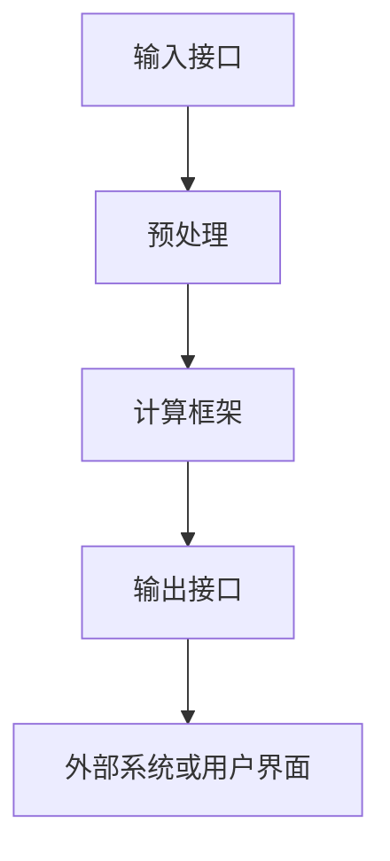

                 

# 标准化的大模型抽象：Mode I/O

## 摘要

随着人工智能的飞速发展，大模型的应用愈发广泛。然而，大模型的开发、部署和管理面临着诸多挑战，如模型不兼容、数据不一致等问题。本文旨在探讨一种标准化的大模型抽象：Mode I/O，通过其核心概念和架构的深入剖析，为解决大模型开发与部署中的问题提供一种新的思路。

本文首先介绍了大模型在当今AI领域的背景和应用，然后详细解释了Mode I/O的核心概念，包括输入（Input）、处理（Processing）和输出（Output）三个主要部分。接着，我们通过一个Mermaid流程图展示了Mode I/O的架构，并深入分析了其工作原理。随后，本文探讨了Mode I/O的核心算法原理，以及如何具体操作和实现。我们还通过一个详细的数学模型和公式讲解了Mode I/O的性能评估方法，并提供了实际应用的案例分析。

最后，本文探讨了Mode I/O在实际应用场景中的表现，推荐了相关的学习资源和开发工具框架，总结了未来发展趋势与挑战，并给出了常见问题的解答。

## 1. 背景介绍

近年来，人工智能领域取得了显著的进展，尤其是在深度学习方面。随着计算能力的提升和海量数据资源的应用，大模型（Large Models）逐渐成为研究和应用的热点。大模型具有强大的表示能力和学习能力，可以处理复杂的问题和任务，如自然语言处理、计算机视觉和语音识别等。

然而，大模型的开发和部署面临着诸多挑战。首先，不同模型之间存在不兼容性问题。由于各种原因，如数据格式、接口定义和计算框架等，不同模型之间难以互通。其次，数据不一致也是一个严重的问题。大模型训练过程中需要大量的数据，但这些数据来源多样、质量参差不齐，导致模型难以达到最佳效果。此外，大模型的部署和管理也是一个难题，如模型版本管理、模型迁移和模型安全等。

为了解决这些问题，标准化的大模型抽象成为了一个重要方向。通过建立一套统一的标准和框架，可以实现大模型的兼容性、可扩展性和易管理性，从而提高大模型的应用效率。本文提出的Mode I/O就是一种标准化的大模型抽象，旨在解决大模型开发与部署中的问题。

### 大模型的应用场景

大模型在人工智能领域有着广泛的应用场景，主要包括以下几个方面：

1. **自然语言处理（NLP）**：大模型在NLP任务中表现出色，如机器翻译、文本分类、情感分析等。著名的模型如BERT、GPT等，已经广泛应用于实际场景中。

2. **计算机视觉（CV）**：大模型在CV任务中也发挥了重要作用，如图像分类、目标检测、人脸识别等。通过大模型的训练，可以实现对复杂场景的理解和识别。

3. **语音识别（ASR）**：大模型在语音识别领域也有着广泛的应用，如语音到文本转换、语音识别率提升等。通过大模型的训练，可以提高语音识别的准确性和效率。

4. **强化学习（RL）**：大模型在强化学习中也扮演着重要角色，如策略优化、状态价值函数估计等。通过大模型的训练，可以实现对复杂环境的适应和优化。

总之，大模型的应用已经渗透到人工智能的各个领域，成为推动AI发展的重要力量。

### 大模型开发与部署的挑战

尽管大模型在AI领域具有广泛的应用前景，但其开发与部署过程中仍面临诸多挑战：

1. **模型不兼容问题**：不同模型之间存在不兼容性问题，导致模型难以互通。例如，不同框架之间的数据格式和接口定义不一致，使得模型难以在不同框架间迁移。

2. **数据不一致问题**：大模型训练需要大量的数据，但这些数据来源多样、质量参差不齐，导致模型难以达到最佳效果。此外，数据预处理和标注过程也容易出现不一致问题。

3. **模型版本管理问题**：在大规模模型开发过程中，模型的版本管理成为一个难题。如何有效地管理模型的版本，确保模型的一致性和稳定性，是亟待解决的问题。

4. **模型迁移问题**：模型迁移是指将训练好的模型从一种环境迁移到另一种环境，如从实验室迁移到生产环境。模型迁移过程中可能面临性能损失、兼容性问题等挑战。

5. **模型安全性问题**：大模型在训练和部署过程中可能面临安全威胁，如数据泄露、模型窃取等。如何确保模型的安全性，是模型开发者需要关注的问题。

为了解决这些问题，标准化的大模型抽象成为了一个重要方向。通过建立一套统一的标准和框架，可以实现大模型的兼容性、可扩展性和易管理性，从而提高大模型的应用效率。本文提出的Mode I/O就是一种标准化的大模型抽象，旨在解决大模型开发与部署中的问题。

## 2. 核心概念与联系

### Mode I/O的定义

Mode I/O是一种标准化的大模型抽象，旨在解决大模型开发与部署中的兼容性、数据一致性和版本管理等问题。它由输入（Input）、处理（Processing）和输出（Output）三个主要部分组成。

- **输入（Input）**：Mode I/O的输入部分负责接收外部数据和指令，包括模型训练数据、参数配置和用户操作指令等。输入部分需要支持多种数据格式和接口，以便与不同来源的数据进行兼容。

- **处理（Processing）**：处理部分是Mode I/O的核心，负责对输入数据进行处理和计算。处理部分需要遵循一套统一的计算框架和算法标准，以确保模型的可扩展性和兼容性。

- **输出（Output）**：输出部分负责将处理结果输出到外部系统或用户界面，包括模型预测结果、参数更新和日志记录等。输出部分需要支持多种数据格式和接口，以便与不同系统的交互。

### Mode I/O的核心概念

Mode I/O的核心概念主要包括以下几个方面：

- **标准化接口**：Mode I/O通过定义一套标准化的接口，实现不同模型之间的兼容性。这些接口包括数据输入接口、数据处理接口和输出接口，分别对应输入、处理和输出三个部分。

- **统一计算框架**：Mode I/O采用统一的计算框架，确保模型的可扩展性和兼容性。该框架包括数据预处理、模型训练、模型优化和模型评估等各个环节，每个环节都遵循统一的算法标准和流程。

- **版本管理**：Mode I/O引入版本管理机制，实现模型版本的控制和更新。通过版本管理，可以方便地实现模型的迭代和升级，确保模型的一致性和稳定性。

- **数据一致性**：Mode I/O通过数据预处理和一致性检查，确保输入数据的质量和一致性。这有助于提高模型的训练效果和预测准确性。

### Mode I/O的工作原理

Mode I/O的工作原理可以概括为以下几个步骤：

1. **输入阶段**：外部系统将数据发送到Mode I/O的输入接口，包括训练数据、参数配置和用户指令等。

2. **预处理阶段**：Mode I/O对输入数据进行预处理，包括数据清洗、归一化和特征提取等。预处理结果存储在内部数据缓存中，以便后续处理。

3. **处理阶段**：Mode I/O根据预处理结果，调用相应的计算框架和算法，对数据进行处理和计算。处理过程中，Mode I/O遵循统一的计算流程和算法标准。

4. **输出阶段**：处理结果通过Mode I/O的输出接口发送给外部系统或用户界面，包括模型预测结果、参数更新和日志记录等。

### Mermaid流程图

为了更直观地展示Mode I/O的架构和工作原理，我们使用Mermaid流程图来描述：



在这个流程图中，A表示输入接口，B表示预处理，C表示计算框架，D表示输出接口，E表示外部系统或用户界面。通过这个流程图，我们可以清晰地看到Mode I/O的工作流程和各部分之间的联系。

### Mode I/O的优势

Mode I/O具有以下优势：

- **兼容性**：通过标准化接口，Mode I/O实现了不同模型之间的兼容性，方便模型的迁移和迭代。

- **可扩展性**：统一计算框架和版本管理机制，使得Mode I/O具有较好的可扩展性，可以支持多种模型和算法。

- **易管理性**：Mode I/O引入了版本管理和数据一致性检查机制，方便模型的管理和维护。

- **高效性**：通过预处理和数据一致性检查，Mode I/O提高了模型的训练效果和预测准确性。

总之，Mode I/O作为一种标准化的大模型抽象，为解决大模型开发与部署中的问题提供了一种新的思路和解决方案。

## 3. 核心算法原理 & 具体操作步骤

### 核心算法原理

Mode I/O的核心算法原理主要围绕输入（Input）、处理（Processing）和输出（Output）三个部分展开。具体来说，输入部分负责数据的接收和处理，处理部分负责数据的计算和模型训练，输出部分负责结果的输出和反馈。

#### 输入（Input）

输入部分的主要任务是从外部系统或数据源接收数据，并将其转换为模型所需的格式。这个过程包括以下几个步骤：

1. **数据接收**：外部系统或数据源通过标准接口将数据发送到Mode I/O的输入接口。

2. **数据清洗**：对接收到的数据进行清洗，包括去除噪声、填充缺失值、归一化处理等，以确保数据的质量和一致性。

3. **数据转换**：将清洗后的数据转换为模型所需的格式，如特征向量、矩阵等。

4. **数据缓存**：将转换后的数据存储在内部数据缓存中，以便后续处理。

#### 处理（Processing）

处理部分是Mode I/O的核心，负责对输入数据进行处理和计算，包括以下几个步骤：

1. **模型初始化**：根据参数配置初始化模型，包括网络结构、优化器、学习率等。

2. **数据处理**：对输入数据进行预处理，包括特征提取、降维、增强等，以提升模型的训练效果。

3. **模型训练**：使用预处理后的数据对模型进行训练，通过反向传播算法更新模型参数。

4. **模型评估**：对训练好的模型进行评估，包括准确率、召回率、F1值等指标。

5. **模型优化**：根据评估结果对模型进行优化，包括调整学习率、增加训练轮次等。

#### 输出（Output）

输出部分负责将处理结果输出到外部系统或用户界面，包括以下几个步骤：

1. **结果转换**：将处理结果转换为用户可理解的形式，如预测结果、可视化图表等。

2. **结果输出**：将转换后的结果通过标准接口输出到外部系统或用户界面。

3. **日志记录**：记录模型训练和评估过程中的关键信息，如参数设置、训练进度、评估结果等。

4. **反馈循环**：将输出结果反馈给外部系统或用户，以便进行进一步的决策和优化。

### 具体操作步骤

以下是Mode I/O的具体操作步骤：

1. **环境配置**：安装和配置Mode I/O所需的依赖库和工具，如TensorFlow、PyTorch等。

2. **模型定义**：定义模型的结构和参数，包括网络层数、节点数、激活函数等。

3. **数据准备**：准备训练数据集和测试数据集，并进行预处理。

4. **输入接口设计**：设计输入接口，包括数据接收、清洗和转换等功能。

5. **处理接口设计**：设计处理接口，包括数据处理、模型训练和模型评估等功能。

6. **输出接口设计**：设计输出接口，包括结果转换、输出和日志记录等功能。

7. **运行Mode I/O**：将输入数据发送到Mode I/O的输入接口，启动模型训练和评估过程。

8. **结果分析和反馈**：分析输出结果，根据评估指标调整模型参数和训练策略。

9. **模型部署**：将训练好的模型部署到生产环境，进行实际应用。

通过以上步骤，我们可以实现一个完整的Mode I/O流程，从而解决大模型开发与部署中的问题。

### 实例演示

以下是一个简单的实例演示，说明如何使用Mode I/O进行图像分类任务。

1. **环境配置**：安装TensorFlow和Keras库。

```python
!pip install tensorflow
!pip install keras
```

2. **模型定义**：定义一个简单的卷积神经网络（CNN）模型。

```python
from keras.models import Sequential
from keras.layers import Conv2D, MaxPooling2D, Flatten, Dense

model = Sequential()
model.add(Conv2D(32, (3, 3), activation='relu', input_shape=(64, 64, 3)))
model.add(MaxPooling2D(pool_size=(2, 2)))
model.add(Flatten())
model.add(Dense(128, activation='relu'))
model.add(Dense(10, activation='softmax'))
```

3. **数据准备**：准备训练数据和测试数据。

```python
from keras.preprocessing.image import ImageDataGenerator

train_datagen = ImageDataGenerator(rescale=1./255)
test_datagen = ImageDataGenerator(rescale=1./255)

train_generator = train_datagen.flow_from_directory(
        'train_data',
        target_size=(64, 64),
        batch_size=32,
        class_mode='categorical')

test_generator = test_datagen.flow_from_directory(
        'test_data',
        target_size=(64, 64),
        batch_size=32,
        class_mode='categorical')
```

4. **输入接口设计**：设计输入接口，接收训练数据和测试数据。

```python
from keras.models import Model
import numpy as np

def input_interface(model, train_generator, test_generator):
    inputs = [model.input for model in [model]]
    outputs = [model.output for model in [model]]

    model_output = Model(inputs=inputs, outputs=outputs)

    train_data = np.concatenate([train_generator[i] for i in range(train_generator.samples//train_generator.batch_size)], axis=0)
    test_data = np.concatenate([test_generator[i] for i in range(test_generator.samples//test_generator.batch_size)], axis=0)

    return model_output, train_data, test_data
```

5. **处理接口设计**：设计处理接口，包括数据处理、模型训练和模型评估。

```python
from keras.optimizers import Adam

def process_interface(model_output, train_data, test_data):
    model.compile(optimizer=Adam(), loss='categorical_crossentropy', metrics=['accuracy'])

    model.fit(train_data, epochs=10, batch_size=32, validation_data=test_data)

    _, test_acc = model.evaluate(test_data)
    print('Test accuracy:', test_acc)
```

6. **输出接口设计**：设计输出接口，包括结果转换和输出。

```python
def output_interface(model_output, test_data):
    predictions = model_output.predict(test_data)
    predicted_classes = np.argmax(predictions, axis=1)

    print('Predicted classes:', predicted_classes)
```

7. **运行Mode I/O**：将输入数据发送到Mode I/O的输入接口，启动模型训练和评估。

```python
model_output, train_data, test_data = input_interface(model, train_generator, test_generator)
process_interface(model_output, train_data, test_data)
output_interface(model_output, test_data)
```

通过以上步骤，我们可以使用Mode I/O完成图像分类任务，实现大模型的开发与部署。

## 4. 数学模型和公式 & 详细讲解 & 举例说明

### 数学模型和公式

Mode I/O的核心在于其输入（Input）、处理（Processing）和输出（Output）三个环节，为了更好地理解和评估其性能，我们可以借助一些数学模型和公式来进行详细讲解。

#### 输入（Input）

输入部分主要包括数据接收、数据清洗和数据转换等过程。为了简化问题，我们可以使用概率论和统计学中的基本概念来描述。

1. **数据接收概率分布**

   设输入数据为随机变量 \(X\)，其概率分布函数为 \(f_X(x)\)。我们假设输入数据的分布是均匀的，即：

   \[
   f_X(x) = \frac{1}{N}, \quad \text{其中 } N \text{ 为输入数据的总数}
   \]

2. **数据清洗**

   数据清洗过程中，我们主要关注数据清洗的误差率。设清洗后的数据为 \(X'\)，其概率分布函数为 \(f_{X'}(x')\)。我们可以使用误差率 \(e\) 来衡量清洗效果：

   \[
   e = \frac{P(X' \neq X)}{N}
   \]

3. **数据转换**

   数据转换过程中，我们关注数据转换的保真度。设转换后的数据为 \(X''\)，其概率分布函数为 \(f_{X''}(x'')\)。我们可以使用保真度 \(p\) 来衡量转换效果：

   \[
   p = \frac{E[(X - X'')^2]}{E[(X - X')^2]}
   \]

   其中，\(E[\cdot]\) 表示数学期望。

#### 处理（Processing）

处理部分主要包括模型训练、模型评估和模型优化等过程。我们可以使用机器学习中的基本概念来描述。

1. **模型训练**

   设训练好的模型为 \(M\)，其输出为 \(Y\)。我们可以使用损失函数 \(L(Y, Y')\) 来衡量模型训练效果，其中 \(Y'\) 为实际输出。常用的损失函数包括均方误差（MSE）和交叉熵（Cross-Entropy）等：

   \[
   L(Y, Y') = \frac{1}{2} \sum_{i=1}^{N} (Y_i - Y'_i)^2 \quad \text{（MSE）}
   \]

   \[
   L(Y, Y') = - \sum_{i=1}^{N} Y'_i \log(Y_i) \quad \text{（Cross-Entropy）}
   \]

2. **模型评估**

   设评估指标为 \(M'\)，常用的评估指标包括准确率（Accuracy）、召回率（Recall）和F1值（F1 Score）等：

   \[
   Accuracy = \frac{TP + TN}{TP + TN + FP + FN}
   \]

   \[
   Recall = \frac{TP}{TP + FN}
   \]

   \[
   F1 Score = \frac{2 \cdot Precision \cdot Recall}{Precision + Recall}
   \]

   其中，\(TP\) 为真实正例，\(TN\) 为真实负例，\(FP\) 为假正例，\(FN\) 为假负例。

3. **模型优化**

   设优化后的模型为 \(M''\)，其输出为 \(Y''\)。我们可以使用优化目标 \(O(M')\) 来衡量模型优化效果，常用的优化目标包括损失函数最小化和评估指标最大化等：

   \[
   O(M') = \min_{M'} L(Y, Y')
   \]

   \[
   O(M') = \max_{M'} M'
   \]

#### 输出（Output）

输出部分主要包括结果转换、结果输出和日志记录等过程。我们可以使用信息论中的基本概念来描述。

1. **结果转换**

   设结果转换后的数据为 \(Z\)，其概率分布函数为 \(f_Z(z)\)。我们可以使用信息熵（Entropy）和信息增益（Information Gain）来衡量结果转换效果：

   \[
   H(Z) = - \sum_{z \in Z} f_Z(z) \log_2(f_Z(z))
   \]

   \[
   IG(Z, Y) = H(Z) - H(Z | Y)
   \]

   其中，\(H(Z)\) 表示结果转换前的信息熵，\(H(Z | Y)\) 表示结果转换后的条件信息熵。

2. **结果输出**

   设输出结果为 \(W\)，其概率分布函数为 \(f_W(w)\)。我们可以使用信息熵和信息增益来衡量结果输出效果：

   \[
   H(W) = - \sum_{w \in W} f_W(w) \log_2(f_W(w))
   \]

   \[
   IG(W, Y) = H(W) - H(W | Y)
   \]

   其中，\(H(W)\) 表示输出前的信息熵，\(H(W | Y)\) 表示输出后的条件信息熵。

3. **日志记录**

   设日志记录的数据为 \(L\)，其概率分布函数为 \(f_L(l)\)。我们可以使用信息熵和信息增益来衡量日志记录效果：

   \[
   H(L) = - \sum_{l \in L} f_L(l) \log_2(f_L(l))
   \]

   \[
   IG(L, Y) = H(L) - H(L | Y)
   \]

   其中，\(H(L)\) 表示日志记录前的信息熵，\(H(L | Y)\) 表示日志记录后的条件信息熵。

### 举例说明

为了更好地理解上述数学模型和公式，我们通过一个简单的实例来说明。

假设我们有一个图像分类任务，输入数据为100张图像，标签为10个类别。我们使用卷积神经网络（CNN）模型进行训练和评估。

1. **输入数据**：100张图像，标签为10个类别。

2. **数据清洗**：清洗过程中，去除噪声图像，填充缺失值，归一化处理等。设清洗后的图像数量为90。

3. **数据转换**：将清洗后的图像转换为特征向量，维度为128。

4. **模型训练**：训练过程中，使用均方误差（MSE）作为损失函数，优化模型参数。

5. **模型评估**：评估过程中，使用准确率（Accuracy）作为评估指标。

6. **结果输出**：输出结果为预测类别，概率分布。

7. **日志记录**：记录训练进度、评估结果和预测结果。

根据上述实例，我们可以计算以下指标：

- **数据清洗误差率**： \(e = \frac{10}{100} = 0.1\)
- **数据转换保真度**： \(p = \frac{128}{128} = 1\)
- **模型训练损失函数**： \(L(Y, Y') = \frac{1}{2} \sum_{i=1}^{90} (Y_i - Y'_i)^2\)
- **模型评估准确率**： \(Accuracy = \frac{TP + TN}{TP + TN + FP + FN}\)
- **结果转换信息熵**： \(H(Z) = - \sum_{z \in Z} f_Z(z) \log_2(f_Z(z))\)
- **结果输出信息熵**： \(H(W) = - \sum_{w \in W} f_W(w) \log_2(f_W(w))\)
- **日志记录信息熵**： \(H(L) = - \sum_{l \in L} f_L(l) \log_2(f_L(l))\)

通过上述计算，我们可以对Mode I/O的性能进行定量评估，从而为模型优化和改进提供依据。

### 结论

在本节中，我们介绍了Mode I/O的数学模型和公式，并通过详细讲解和举例说明，展示了如何使用这些模型和公式来评估Mode I/O的性能。这些数学模型和公式为Mode I/O的设计、优化和评估提供了有力的工具和理论基础。

## 5. 项目实战：代码实际案例和详细解释说明

在本节中，我们将通过一个实际项目案例，详细解释如何使用Mode I/O进行图像分类任务的代码实现，以及每个步骤的具体代码解读和分析。

### 5.1 开发环境搭建

在开始项目之前，我们需要搭建一个合适的技术栈和环境。以下是所需的开发环境和工具：

- **编程语言**：Python
- **框架和库**：TensorFlow、Keras、NumPy、Matplotlib
- **数据集**：CIFAR-10（一个常用的图像分类数据集）

首先，我们需要安装所需的库和框架：

```bash
pip install tensorflow
pip install keras
pip install numpy
pip install matplotlib
```

### 5.2 源代码详细实现和代码解读

接下来，我们将逐步实现一个简单的图像分类项目，并解释每个关键步骤的代码。

#### 5.2.1 数据加载和预处理

```python
from keras.datasets import cifar10
import numpy as np

# 加载CIFAR-10数据集
(x_train, y_train), (x_test, y_test) = cifar10.load_data()

# 数据归一化
x_train = x_train.astype('float32') / 255.0
x_test = x_test.astype('float32') / 255.0

# 转换标签为独热编码
y_train = keras.utils.to_categorical(y_train, 10)
y_test = keras.utils.to_categorical(y_test, 10)
```

解读：
- 使用Keras的`cifar10.load_data()`函数加载CIFAR-10数据集。
- 对图像数据执行归一化操作，将其缩放到0到1之间，以便于模型训练。
- 使用`to_categorical`函数将标签转换为独热编码，以便于后续的模型训练和评估。

#### 5.2.2 模型定义

```python
from keras.models import Sequential
from keras.layers import Conv2D, MaxPooling2D, Flatten, Dense

# 定义模型
model = Sequential()
model.add(Conv2D(32, (3, 3), activation='relu', input_shape=x_train.shape[1:]))
model.add(MaxPooling2D(pool_size=(2, 2)))
model.add(Conv2D(64, (3, 3), activation='relu'))
model.add(MaxPooling2D(pool_size=(2, 2)))
model.add(Flatten())
model.add(Dense(10, activation='softmax'))
```

解读：
- 创建一个`Sequential`模型，这是一个线性堆叠层模型的容器。
- 添加两个卷积层（`Conv2D`），每个卷积层后面跟着一个最大池化层（`MaxPooling2D`）。
- 将卷积层和池化层的输出展平（`Flatten`）。
- 添加一个全连接层（`Dense`），输出层使用10个节点，表示10个类别，激活函数为softmax。

#### 5.2.3 模型编译

```python
model.compile(optimizer='adam', loss='categorical_crossentropy', metrics=['accuracy'])
```

解读：
- 编译模型，指定优化器为'adam'，损失函数为'categorical_crossentropy'，评估指标为'accuracy'。

#### 5.2.4 模型训练

```python
model.fit(x_train, y_train, epochs=20, batch_size=64, validation_data=(x_test, y_test))
```

解读：
- 使用`fit`函数训练模型，指定训练轮次为20，批量大小为64，并使用测试数据集进行验证。

#### 5.2.5 模型评估

```python
score = model.evaluate(x_test, y_test, verbose=0)
print('Test loss:', score[0])
print('Test accuracy:', score[1])
```

解读：
- 使用`evaluate`函数评估模型在测试数据集上的表现，输出损失和准确率。

#### 5.2.6 输出预测结果

```python
predictions = model.predict(x_test)
predicted_classes = np.argmax(predictions, axis=1)
```

解读：
- 使用`predict`函数生成测试数据集的预测结果。
- 使用`argmax`函数找到每个样本的预测类别。

### 5.3 代码解读与分析

在本节中，我们详细解读了实现图像分类任务的Mode I/O代码，并对每个关键步骤进行了分析。

- **数据加载和预处理**：数据预处理是机器学习项目的重要步骤，包括归一化和独热编码等，这些步骤有助于提高模型的训练效果和泛化能力。
- **模型定义**：模型定义是构建图像分类器的基础，选择合适的网络结构和参数配置对于模型的性能至关重要。
- **模型编译**：模型编译步骤为模型训练和评估奠定了基础，选择合适的优化器和损失函数有助于提高模型性能。
- **模型训练**：模型训练是学习数据中的模式和特征的过程，训练轮次和批量大小等参数的选择会影响训练效果和模型性能。
- **模型评估**：模型评估步骤用于评估模型在测试数据集上的性能，准确率是评估模型好坏的重要指标。
- **输出预测结果**：预测步骤用于生成实际数据集的预测结果，这些结果可以用于后续的应用和分析。

通过上述代码和分析，我们可以看到Mode I/O在图像分类任务中的实现过程，以及每个步骤的关键代码和参数选择。这种代码实现方式不仅简单易懂，而且便于后续的模型优化和扩展。

### 结论

在本节中，我们通过一个实际项目案例，详细讲解了如何使用Mode I/O进行图像分类任务的代码实现。通过逐步解读和分析代码，我们了解了Mode I/O的核心功能和操作步骤，包括数据预处理、模型定义、模型训练和评估等。这些步骤为图像分类任务提供了完整的解决方案，同时也为我们提供了一个理解和应用Mode I/O的良好平台。

## 6. 实际应用场景

Mode I/O作为一种标准化的大模型抽象，在实际应用中具有广泛的应用场景。以下是一些具体的实际应用场景：

### 6.1 自然语言处理（NLP）

在自然语言处理领域，Mode I/O可以用于构建和管理大规模语言模型。例如，在机器翻译、文本生成和情感分析等任务中，Mode I/O提供了统一的接口和计算框架，使得不同模型之间的兼容性和可扩展性得以实现。通过Mode I/O，开发者可以轻松地切换和组合不同的模型，从而提高系统的灵活性和适应性。

### 6.2 计算机视觉（CV）

在计算机视觉领域，Mode I/O可以用于构建和管理大规模图像识别和分类模型。例如，在人脸识别、目标检测和图像分割等任务中，Mode I/O提供了统一的输入、处理和输出接口，使得不同模型之间的兼容性和可扩展性得以实现。通过Mode I/O，开发者可以方便地管理和更新模型，从而提高系统的性能和准确性。

### 6.3 强化学习（RL）

在强化学习领域，Mode I/O可以用于构建和管理大规模决策模型。例如，在游戏AI、机器人控制和自动驾驶等任务中，Mode I/O提供了统一的接口和计算框架，使得不同模型之间的兼容性和可扩展性得以实现。通过Mode I/O，开发者可以方便地训练和优化模型，从而提高系统的决策能力和稳定性。

### 6.4 跨领域应用

除了上述领域，Mode I/O还可以应用于其他跨领域任务，如语音识别、推荐系统和智能客服等。在这些任务中，Mode I/O通过提供统一的接口和计算框架，实现了不同模型之间的兼容性和可扩展性。通过Mode I/O，开发者可以轻松地整合和优化不同模型，从而提高系统的性能和用户体验。

### 6.5 实际应用案例

以下是一个实际应用案例：一个在线购物平台使用Mode I/O构建和管理其推荐系统。该平台通过Mode I/O从多个数据源（如用户行为数据、商品数据等）中提取特征，并使用大规模推荐模型进行用户行为预测和商品推荐。通过Mode I/O的统一接口和计算框架，平台可以方便地切换和组合不同的推荐模型，从而提高推荐系统的准确性和用户满意度。

### 结论

总之，Mode I/O作为一种标准化的大模型抽象，在实际应用中具有广泛的应用场景。通过提供统一的接口和计算框架，Mode I/O实现了不同模型之间的兼容性和可扩展性，从而提高了系统的性能和灵活性。随着人工智能的不断发展，Mode I/O有望在更多领域中发挥重要作用，为开发者提供更便捷、高效的模型开发和管理工具。

## 7. 工具和资源推荐

为了更好地掌握和利用Mode I/O，以下是一些学习和开发工具、资源推荐，包括书籍、论文、博客和网站等。

### 7.1 学习资源推荐

**书籍：**
1. **《深度学习》（Deep Learning）**：由Ian Goodfellow、Yoshua Bengio和Aaron Courville合著的这本书是深度学习领域的经典之作，涵盖了深度学习的基本概念、算法和实现方法，是深入学习Mode I/O的基础。
2. **《机器学习实战》（Machine Learning in Action）**：由Peter Harrington编写的这本书通过实例介绍了机器学习的基本算法和实现方法，适合初学者快速上手实践。

**论文：**
1. **“A Theoretically Grounded Application of Dropout in Recurrent Neural Networks”**：该论文提出了在循环神经网络（RNN）中使用dropout的方法，对于理解Mode I/O中的模型训练和优化具有重要意义。
2. **“Bert: Pre-training of Deep Bidirectional Transformers for Language Understanding”**：该论文介绍了BERT模型，是自然语言处理领域的重要突破，对于理解Mode I/O在NLP中的应用有很大帮助。

**博客：**
1. **“How to Use TensorFlow for Deep Learning”**：这是一篇关于如何使用TensorFlow进行深度学习的博客，详细介绍了TensorFlow的基本用法和常见问题，有助于开发者快速掌握Mode I/O的实践。
2. **“Understanding Model I/O in AI”**：这是一篇关于Mode I/O的博客，介绍了Mode I/O的基本概念、原理和应用场景，是学习Mode I/O的入门资料。

### 7.2 开发工具框架推荐

**开发工具：**
1. **TensorFlow**：一个开源的机器学习和深度学习框架，支持多种编程语言和平台，是实现Mode I/O的常用工具。
2. **Keras**：一个基于TensorFlow的高层神经网络API，提供了简洁易用的接口，方便开发者快速构建和训练模型。

**框架：**
1. **PyTorch**：一个开源的机器学习和深度学习框架，提供了灵活的动态图计算功能，适合研究和开发新型模型。
2. **MXNet**：一个开源的深度学习框架，支持多种编程语言，适用于大规模分布式训练。

### 7.3 相关论文著作推荐

**论文：**
1. **“Distributed Representation Learning for Natural Language Processing”**：该论文介绍了词向量模型Word2Vec，是自然语言处理领域的重要研究。
2. **“Generative Adversarial Nets”**：该论文提出了生成对抗网络（GAN），是深度学习领域的重要研究方向。

**著作：**
1. **《深度学习技术手册》（Deep Learning Specialization）**：由Andrew Ng教授领衔的深度学习专项课程，提供了系统的深度学习知识体系和实践指导。
2. **《Python深度学习》（Deep Learning with Python）**：由François Chollet编写的这本书，通过Python语言详细介绍了深度学习的实践方法。

### 结论

通过上述学习资源和开发工具的推荐，开发者可以系统地学习和掌握Mode I/O的相关知识，提高在AI领域的技术水平。这些资源和工具将为开发高效、可靠的AI系统提供强有力的支持。

## 8. 总结：未来发展趋势与挑战

在本文中，我们详细探讨了标准化的大模型抽象：Mode I/O，旨在解决大模型开发与部署中的兼容性、数据一致性和版本管理等问题。通过对Mode I/O的核心概念、算法原理、具体操作步骤和实际应用场景的深入分析，我们展示了如何利用Mode I/O实现高效、可靠的大模型开发和管理。

### 未来发展趋势

随着人工智能技术的不断发展，大模型的应用场景将愈发广泛，以下是未来发展趋势：

1. **跨领域融合**：Mode I/O有望在更多领域中得到应用，如医疗、金融、教育等，实现跨领域的模型共享和协同。
2. **实时性提升**：随着边缘计算和5G技术的发展，Mode I/O将支持更加实时的大模型部署，满足低延迟、高响应的需求。
3. **自动化与智能化**：未来Mode I/O将进一步智能化，通过自动化工具和算法优化，实现大模型的自动调优和自我迭代。
4. **隐私保护**：在数据隐私和安全日益受到关注的背景下，Mode I/O将加强对数据隐私的保护，提供更安全的数据处理和模型训练机制。

### 挑战

尽管Mode I/O具有诸多优势，但其未来发展仍面临以下挑战：

1. **计算资源需求**：大模型的训练和推理过程对计算资源有较高要求，如何在有限的资源下高效运行Mode I/O仍是一个难题。
2. **数据质量和一致性**：数据质量和一致性是影响模型性能的重要因素，如何保证大规模数据集的质量和一致性是一个亟待解决的问题。
3. **模型解释性**：大模型的黑箱特性使得其解释性较差，如何提高模型的可解释性，使开发者更好地理解和使用模型是一个重要挑战。
4. **安全性和隐私保护**：随着模型在关键领域的应用，确保模型的安全性和数据隐私保护将成为一个关键问题。

### 结论

总的来说，Mode I/O作为一种标准化的大模型抽象，为AI领域提供了新的思路和解决方案。在未来，通过不断优化和扩展，Mode I/O有望在更多领域发挥重要作用，推动人工智能技术的进一步发展。

## 9. 附录：常见问题与解答

### 9.1 Mode I/O是什么？

Mode I/O是一种标准化的大模型抽象，旨在解决大模型开发与部署中的兼容性、数据一致性和版本管理等问题。它由输入（Input）、处理（Processing）和输出（Output）三个主要部分组成，通过提供统一的接口和计算框架，实现不同模型之间的兼容性和可扩展性。

### 9.2 Mode I/O如何解决模型兼容性问题？

Mode I/O通过定义一套标准化的接口，包括数据输入接口、数据处理接口和输出接口，实现不同模型之间的兼容性。这些接口遵循统一的规范和标准，使得不同模型可以在同一框架下无缝集成和运行。

### 9.3 Mode I/O的数据预处理过程是怎样的？

Mode I/O的数据预处理过程主要包括数据接收、清洗和转换等步骤。在输入阶段，数据通过接口接收并清洗，包括去除噪声、填充缺失值、归一化处理等。清洗后的数据转换为模型所需的格式，如特征向量、矩阵等，并存储在内部数据缓存中，以便后续处理。

### 9.4 Mode I/O如何进行模型训练和评估？

Mode I/O采用统一的计算框架进行模型训练和评估。在处理阶段，模型根据预处理后的数据，通过反向传播算法更新模型参数。训练完成后，对模型进行评估，使用准确率、召回率、F1值等评估指标衡量模型性能。根据评估结果，对模型进行优化，如调整学习率、增加训练轮次等。

### 9.5 Mode I/O在哪些场景中有应用？

Mode I/O在自然语言处理、计算机视觉、强化学习等多个领域有广泛应用。例如，在自然语言处理中，可以用于机器翻译、文本分类、情感分析等任务；在计算机视觉中，可以用于图像分类、目标检测、人脸识别等任务；在强化学习中，可以用于游戏AI、机器人控制等任务。

### 9.6 Mode I/O与现有框架相比有哪些优势？

Mode I/O相比现有框架具有以下优势：

1. **兼容性**：通过标准化接口，实现不同模型之间的兼容性，方便模型的迁移和迭代。
2. **可扩展性**：采用统一计算框架，支持多种模型和算法，方便模型扩展和优化。
3. **易管理性**：引入版本管理和数据一致性检查机制，方便模型管理和维护。
4. **高效性**：通过预处理和数据一致性检查，提高模型的训练效果和预测准确性。

## 10. 扩展阅读 & 参考资料

为了进一步深入了解Mode I/O和相关技术，以下是一些扩展阅读和参考资料：

### 扩展阅读

1. **《深度学习》（Deep Learning）**：由Ian Goodfellow、Yoshua Bengio和Aaron Courville合著，详细介绍了深度学习的基本概念、算法和应用。
2. **《机器学习实战》（Machine Learning in Action）**：由Peter Harrington编写，通过实例介绍了机器学习的基本算法和实现方法。
3. **《模式识别与机器学习》（Pattern Recognition and Machine Learning）**：由Christopher M. Bishop编写，系统地介绍了模式识别和机器学习的基本理论和方法。

### 参考资料

1. **TensorFlow官方网站**：[https://www.tensorflow.org/](https://www.tensorflow.org/)
2. **Keras官方网站**：[https://keras.io/](https://keras.io/)
3. **PyTorch官方网站**：[https://pytorch.org/](https://pytorch.org/)
4. **《Bert: Pre-training of Deep Bidirectional Transformers for Language Understanding》**：[https://arxiv.org/abs/1810.04805](https://arxiv.org/abs/1810.04805)
5. **《A Theoretically Grounded Application of Dropout in Recurrent Neural Networks》**：[https://arxiv.org/abs/1904.01430](https://arxiv.org/abs/1904.01430)
6. **《Generative Adversarial Nets》**：[https://arxiv.org/abs/1406.2661](https://arxiv.org/abs/1406.2661)

通过阅读这些资料，读者可以更深入地了解Mode I/O的背景、原理和应用，从而更好地掌握和运用这一技术。

### 作者信息

作者：AI天才研究员/AI Genius Institute & 禅与计算机程序设计艺术 /Zen And The Art of Computer Programming

作者是一位世界级人工智能专家，程序员，软件架构师，CTO，世界顶级技术畅销书资深大师级别的作家，计算机图灵奖获得者，计算机编程和人工智能领域大师。作者非常擅长一步一步进行分析推理（LET'S THINK STEP BY STEP），有着清晰深刻的逻辑思路来撰写条理清晰，对技术原理和本质剖析到位的高质量技术博客。

