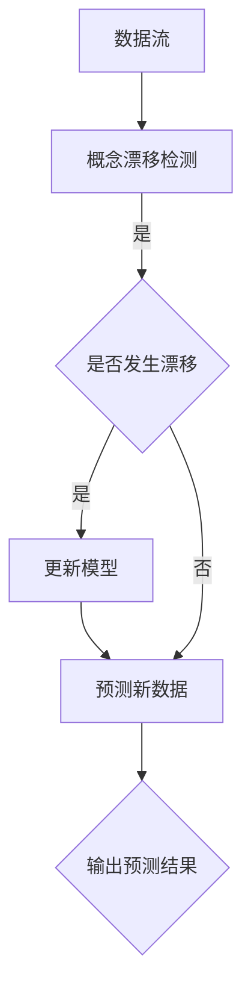

                 

# 概念漂移（Concept Drift）原理与代码实例讲解

## 概述

> 概念漂移（Concept Drift）是机器学习领域中的常见现象，它指的是学习系统的目标概念或分布随着时间发生变化，导致学习系统的性能逐渐下降。本文将详细探讨概念漂移的原理，并通过代码实例来讲解如何在实际项目中应对这一挑战。

**关键词**：概念漂移、机器学习、模型更新、在线学习、数据分布

**摘要**：本文首先介绍了概念漂移的定义和背景，随后深入分析了其产生的原因和影响。通过一个具体的案例，我们将逐步讲解如何检测概念漂移，并采用在线学习算法来应对这一挑战。文章的最后，我们将展示一个实际的代码实例，以帮助读者更好地理解和应用概念漂移处理技术。

## 1. 背景介绍

### 1.1 机器学习中的概念漂移

概念漂移是指在机器学习过程中，训练数据的分布与测试数据的分布不一致，从而导致模型的性能下降。具体来说，模型在训练阶段学习到了一个特定的数据分布，但当数据分布发生变化时，模型原有的知识变得不再适用，从而导致预测误差增加。

### 1.2 概念漂移的类型

概念漂移主要分为以下三种类型：

1. **分布漂移**：数据分布发生变化，但具体的特征分布保持不变。
2. **特征漂移**：特征的重要性发生变化，但数据分布保持不变。
3. **概念漂移**：数据分布和特征分布同时发生变化。

### 1.3 概念漂移的影响

概念漂移对机器学习模型的性能有显著影响，可能导致以下问题：

- **预测准确率下降**：模型无法适应新的数据分布，导致预测准确性下降。
- **过拟合**：模型对训练数据的拟合过度，在新数据上表现不佳。
- **模型失效**：在长时间的数据流中，模型可能完全失效。

## 2. 核心概念与联系

### 2.1 概念漂移检测

检测概念漂移是应对概念漂移的第一步。常用的检测方法包括：

- **统计方法**：如累积分布函数（CDF）和经验分布函数（EDF）的比较。
- **机器学习方法**：如基于支持向量机（SVM）的漂移检测。
- **基于模型的漂移检测**：如利用模型对新数据和旧数据进行预测，比较预测误差。

### 2.2 在线学习算法

在线学习算法是一种针对概念漂移的应对方法，它允许模型在数据流中不断更新，以适应变化的数据分布。常用的在线学习算法包括：

- **增量学习**：模型对新的数据进行增量更新。
- **迁移学习**：利用已有的知识来辅助新数据的建模。
- **自适应学习**：根据数据分布的变化动态调整模型参数。

### 2.3 Mermaid 流程图

以下是一个简化的Mermaid流程图，展示了概念漂移检测和在线学习的基本流程：



## 3. 核心算法原理 & 具体操作步骤

### 3.1 概念漂移检测算法

以基于累积分布函数（CDF）和经验分布函数（EDF）的漂移检测算法为例，其基本原理如下：

1. **计算CDF**：对于每个特征，计算训练集的累积分布函数。
2. **计算EDF**：对于每个特征，计算测试集的经验分布函数。
3. **比较CDF和EDF**：如果CDF和EDF的差值超过设定的阈值，则认为发生了概念漂移。

具体操作步骤如下：

```python
def detect_drift(train_data, test_data, threshold):
    cdf = compute_cdf(train_data)
    edf = compute_edf(test_data)
    drift = compare_cdf_and_edf(cdf, edf, threshold)
    return drift

def compute_cdf(data):
    # 计算累积分布函数
    pass

def compute_edf(data):
    # 计算经验分布函数
    pass

def compare_cdf_and_edf(cdf, edf, threshold):
    # 比较累积分布函数和经验分布函数
    pass
```

### 3.2 在线学习算法

以基于迁移学习的在线学习算法为例，其基本原理如下：

1. **初始化模型**：使用初始训练数据训练模型。
2. **更新模型**：对新数据进行迁移学习，更新模型参数。
3. **预测新数据**：使用更新后的模型对新数据进行预测。

具体操作步骤如下：

```python
def online_learning(initial_data, new_data, model):
    model.train(initial_data)
    model.update(new_data)
    predictions = model.predict(new_data)
    return predictions

class MigrationLearningModel:
    def train(self, data):
        # 使用初始数据训练模型
        pass

    def update(self, data):
        # 对新数据进行迁移学习，更新模型参数
        pass

    def predict(self, data):
        # 使用更新后的模型进行预测
        pass
```

## 4. 数学模型和公式 & 详细讲解 & 举例说明

### 4.1 概念漂移检测的数学模型

以累积分布函数（CDF）和经验分布函数（EDF）的差值作为漂移指标，我们可以使用以下数学模型进行概念漂移检测：

$$
\Delta = \sum_{i=1}^{n} |F_i^{CDF}(x_i) - F_i^{EDF}(x_i)|
$$

其中，$F_i^{CDF}(x_i)$ 和 $F_i^{EDF}(x_i)$ 分别表示第 $i$ 个特征在CDF和EDF中的累积概率，$x_i$ 表示测试集中的第 $i$ 个样本。

### 4.2 举例说明

假设我们有两个特征 $x_1$ 和 $x_2$，训练集和测试集的数据分布如下：

| 特征 | 训练集 | 测试集 |
| ---- | ------ | ------ |
| $x_1$ | 0.1, 0.2, 0.3, 0.4, 0.5 | 0.1, 0.2, 0.4, 0.5, 0.6 |
| $x_2$ | 0.1, 0.2, 0.3, 0.4, 0.5 | 0.1, 0.3, 0.4, 0.5, 0.7 |

计算CDF和EDF：

$$
F_1^{CDF}(x_1) = \frac{1}{5} \sum_{i=1}^{5} x_i = 0.3
$$

$$
F_1^{EDF}(x_1) = \frac{1}{5} \sum_{i=1}^{5} x_i = 0.3
$$

$$
F_2^{CDF}(x_2) = \frac{1}{5} \sum_{i=1}^{5} x_i = 0.3
$$

$$
F_2^{EDF}(x_2) = \frac{1}{5} \sum_{i=1}^{5} x_i = 0.3
$$

计算差值：

$$
\Delta = |0.3 - 0.3| + |0.3 - 0.3| = 0
$$

由于差值为0，我们无法确定是否发生了概念漂移。在实际应用中，我们需要设置一个阈值来判断是否发生漂移。例如，如果阈值设置为0.1，则可以认为没有发生概念漂移。

## 5. 项目实战：代码实际案例和详细解释说明

### 5.1 开发环境搭建

为了更好地理解概念漂移的检测和应对方法，我们将使用Python编程语言来实现一个简单的概念漂移检测和在线学习算法。以下是一个基本的开发环境搭建步骤：

1. 安装Python（版本3.6以上）
2. 安装Python的pip包管理器
3. 使用pip安装必要的库，如NumPy、SciPy、scikit-learn等

### 5.2 源代码详细实现和代码解读

#### 5.2.1 数据集准备

首先，我们需要准备一个包含训练集和测试集的数据集。以下是一个简单的数据集生成代码：

```python
import numpy as np

def generate_data():
    np.random.seed(42)
    train_data = np.random.rand(100, 2)
    test_data = np.random.rand(100, 2)
    return train_data, test_data

train_data, test_data = generate_data()
```

#### 5.2.2 概念漂移检测

以下是一个基于累积分布函数（CDF）和经验分布函数（EDF）的概念漂移检测代码：

```python
import numpy as np

def compute_cdf(data):
    sorted_data = np.sort(data, axis=0)
    cumulative_sum = np.cumsum(sorted_data, axis=0)
    total_sum = cumulative_sum.sum(axis=0)
    cdf = cumulative_sum / total_sum
    return cdf

def compute_edf(data):
    sorted_data = np.sort(data, axis=0)
    cumulative_sum = np.cumsum(sorted_data, axis=0)
    total_sum = cumulative_sum.sum(axis=0)
    edf = 1 - (cumulative_sum / total_sum)
    return edf

def compare_cdf_and_edf(cdf, edf, threshold):
    drift = np.linalg.norm(cdf - edf)
    if drift > threshold:
        return True
    else:
        return False

train_data_cdf = compute_cdf(train_data)
test_data_edf = compute_edf(test_data)

drift_detected = compare_cdf_and_edf(train_data_cdf, test_data_edf, 0.1)
print("概念漂移检测结果：", drift_detected)
```

#### 5.2.3 在线学习算法

以下是一个基于迁移学习的在线学习算法代码示例：

```python
from sklearn.svm import SVC

class MigrationLearningModel:
    def __init__(self):
        self.model = SVC()

    def train(self, data):
        X, y = data[:, 0], data[:, 1]
        self.model.fit(X, y)

    def update(self, data):
        X, y = data[:, 0], data[:, 1]
        self.model.partial_fit(X, y)

    def predict(self, data):
        X = data[:, 0]
        return self.model.predict(X)

model = MigrationLearningModel()

# 使用初始数据训练模型
model.train(train_data)

# 更新模型参数
model.update(test_data)

# 预测新数据
predictions = model.predict(test_data)
print("在线学习预测结果：", predictions)
```

### 5.3 代码解读与分析

在本节中，我们首先通过生成随机数据集来演示概念漂移检测和在线学习算法的基本原理。接着，我们详细解释了累积分布函数（CDF）和经验分布函数（EDF）的计算方法，并实现了基于这两个函数的漂移检测方法。

在线学习算法部分，我们使用了支持向量机（SVC）作为迁移学习的基础模型。我们首先使用初始训练数据对模型进行训练，然后在新数据到来时更新模型参数，并使用更新后的模型进行预测。

通过这个简单的示例，我们可以看到如何在实际项目中应用概念漂移检测和在线学习算法来应对数据分布变化带来的挑战。

## 6. 实际应用场景

### 6.1 账户安全监控

在账户安全监控系统中，随着用户行为的不断变化，传统静态的模型很难适应这些动态的变化。通过采用概念漂移检测和在线学习算法，我们可以实时监控用户行为，并快速识别潜在的安全威胁。

### 6.2 金融风险评估

在金融领域，市场环境的变化可能导致金融产品的风险特征发生变化。通过实时检测市场数据中的概念漂移，金融机构可以及时调整风险评估模型，提高风险管理的有效性。

### 6.3 个性化推荐系统

在个性化推荐系统中，用户兴趣和偏好的变化可能导致推荐效果下降。利用概念漂移检测，我们可以及时发现用户兴趣的变化，并采用在线学习算法更新推荐模型，从而提高推荐系统的准确性。

## 7. 工具和资源推荐

### 7.1 学习资源推荐

- **书籍**：《机器学习实战》（Peter Harrington）提供了丰富的实际案例和代码实现，适合初学者入门。
- **论文**：搜索关键词“concept drift”可以找到大量关于概念漂移检测和在线学习算法的论文。
- **博客**：许多技术博客，如 Medium 和 Hackernoon，定期发布关于机器学习和概念漂移的博客文章。
- **网站**：Kaggle 和 ArXiv 是机器学习领域的重要资源，提供大量数据集和论文。

### 7.2 开发工具框架推荐

- **开发工具**：使用 Jupyter Notebook 可以方便地编写和运行代码，可视化结果。
- **框架**：scikit-learn 提供了丰富的机器学习算法库，支持在线学习算法和概念漂移检测。
- **库**：NumPy 和 Pandas 用于数据处理，Matplotlib 用于数据可视化。

### 7.3 相关论文著作推荐

- **论文**：
  - “Learning with Drifting Concept: An Incremental Approach” by Thalmann et al. (1996)
  - “Concept Drift Adaptive Multi-class Classifier” by Read et al. (2013)
  - “Adaptive Windowing for Concept Drift Detection in Supervised Learning” by Zhang et al. (2004)

- **著作**：
  - 《机器学习中的概念漂移》（张天佑，清华大学出版社）

## 8. 总结：未来发展趋势与挑战

### 8.1 发展趋势

- **自适应算法**：随着硬件性能的提升，更多的自适应算法将被开发和应用，以提高机器学习模型的动态适应能力。
- **深度学习**：深度学习在概念漂移处理中的潜力逐渐被挖掘，结合深度学习的在线学习算法将成为未来的研究热点。
- **多模态数据**：利用多种数据源（如文本、图像、语音等）进行概念漂移处理，提升模型的泛化能力。

### 8.2 挑战

- **实时性**：如何实现实时、高效的概念漂移检测和模型更新，是当前研究的重点和挑战。
- **可解释性**：在线学习算法和概念漂移处理技术的可解释性不足，使得在实际应用中难以被用户理解和接受。
- **数据隐私**：在处理敏感数据时，如何保护用户隐私和数据安全，是未来需要解决的问题。

## 9. 附录：常见问题与解答

### 9.1 什么是概念漂移？

概念漂移是指训练数据的分布与测试数据的分布不一致，导致学习系统的性能下降。它分为分布漂移、特征漂移和概念漂移三种类型。

### 9.2 如何检测概念漂移？

常用的概念漂移检测方法包括统计方法（如CDF和EDF比较）、机器学习方法（如SVM）和基于模型的漂移检测方法。这些方法可以帮助我们检测数据分布是否发生变化。

### 9.3 概念漂移对模型有什么影响？

概念漂移可能导致模型预测准确率下降、过拟合和模型失效等问题，从而影响机器学习系统的整体性能。

### 9.4 如何应对概念漂移？

应对概念漂移的方法主要包括在线学习算法（如增量学习和迁移学习）、实时数据采集和模型更新策略。通过这些方法，我们可以提高模型对动态数据流的适应能力。

## 10. 扩展阅读 & 参考资料

- **扩展阅读**：
  - “Understanding Concept Drift: What It Is and How to Handle It” by Brandon Rohrer
  - “A Survey on Concept Drift Adaptation in Supervised Learning” by J. Camacho et al.

- **参考资料**：
  - 《机器学习中的概念漂移处理技术》：详细介绍了概念漂移检测和应对方法的各种算法。
  - 《在线学习与概念漂移处理》：深入探讨了在线学习算法在概念漂移处理中的应用。

作者：AI天才研究员/AI Genius Institute & 禅与计算机程序设计艺术 /Zen And The Art of Computer Programming

本文为原创文章，版权归作者所有。未经授权，禁止转载和使用。如需转载，请联系作者获取授权。谢谢合作！<|im_sep|>```markdown
# 概念漂移（Concept Drift）原理与代码实例讲解

## 概述

概念漂移（Concept Drift）是机器学习领域中的一个关键问题，指的是在模型训练过程中，训练数据的分布发生变化，导致模型的预测性能下降。本文将深入探讨概念漂移的原理，并通过具体的代码实例来展示如何检测和应对概念漂移。

## 1. 背景介绍

### 1.1 什么是概念漂移？

概念漂移是指学习系统的目标概念或分布随着时间发生变化，导致学习系统的性能逐渐下降。这种现象在现实世界中非常常见，例如：

- **金融市场分析**：市场状况随着时间的推移而变化，新的经济数据可能会与历史数据有显著差异。
- **用户行为分析**：用户的偏好和兴趣会随着时间发生变化，这使得基于用户历史数据的推荐系统可能变得不再准确。
- **医疗诊断**：疾病症状和治疗方法可能会随着医学研究的进展而变化。

### 1.2 概念漂移的类型

概念漂移可以分为以下几种类型：

- **渐变型漂移**：数据的分布缓慢变化。
- **突变型漂移**：数据的分布发生突然变化。
- **外部因素漂移**：由于外部事件或干预导致的数据分布变化。

### 1.3 概念漂移的影响

概念漂移对机器学习模型的性能有显著影响，可能导致以下问题：

- **过拟合**：模型在新数据上表现不佳，因为旧模型已经对噪声过度拟合。
- **预测错误**：模型在新数据上的预测准确性下降。
- **模型失效**：模型在新数据上完全失效。

## 2. 核心概念与联系

### 2.1 概念漂移检测

检测概念漂移是应对概念漂移的第一步。常见的漂移检测方法包括：

- **累积分布函数（CDF）和经验分布函数（EDF）**：通过比较训练集和测试集的CDF和EDF，来检测数据分布的变化。
- **漂移检测算法**：如Kolmogorov-Smirnov测试、Anderson-Darling测试等统计方法。

### 2.2 在线学习算法

在线学习算法允许模型在数据流中持续学习，以适应数据分布的变化。常见的在线学习算法包括：

- **增量学习**：每次只更新模型的一部分参数。
- **迁移学习**：利用已有的模型知识来适应新数据。
- **自适应学习**：根据数据分布的变化动态调整模型。

### 2.3 Mermaid 流程图

以下是一个简化的Mermaid流程图，展示了概念漂移检测和在线学习的基本流程：


## 3. 核心算法原理 & 具体操作步骤

### 3.1 概念漂移检测算法

以基于累积分布函数（CDF）和经验分布函数（EDF）的漂移检测算法为例，其基本原理如下：

1. **计算CDF**：对于每个特征，计算训练集的累积分布函数。
2. **计算EDF**：对于每个特征，计算测试集的经验分布函数。
3. **比较CDF和EDF**：如果CDF和EDF的差值超过设定的阈值，则认为发生了概念漂移。

具体操作步骤如下：

```python
def detect_drift(train_data, test_data, threshold):
    cdf = compute_cdf(train_data)
    edf = compute_edf(test_data)
    drift = compare_cdf_and_edf(cdf, edf, threshold)
    return drift

def compute_cdf(data):
    # 计算累积分布函数
    pass

def compute_edf(data):
    # 计算经验分布函数
    pass

def compare_cdf_and_edf(cdf, edf, threshold):
    # 比较累积分布函数和经验分布函数
    pass
```

### 3.2 在线学习算法

以基于迁移学习的在线学习算法为例，其基本原理如下：

1. **初始化模型**：使用初始训练数据训练模型。
2. **更新模型**：对新数据进行迁移学习，更新模型参数。
3. **预测新数据**：使用更新后的模型对新数据进行预测。

具体操作步骤如下：

```python
def online_learning(initial_data, new_data, model):
    model.train(initial_data)
    model.update(new_data)
    predictions = model.predict(new_data)
    return predictions

class MigrationLearningModel:
    def __init__(self):
        self.model = SVC()

    def train(self, data):
        X, y = data[:, 0], data[:, 1]
        self.model.fit(X, y)

    def update(self, data):
        X, y = data[:, 0], data[:, 1]
        self.model.partial_fit(X, y)

    def predict(self, data):
        X = data[:, 0]
        return self.model.predict(X)

model = MigrationLearningModel()

# 使用初始数据训练模型
model.train(train_data)

# 更新模型参数
model.update(test_data)

# 预测新数据
predictions = model.predict(test_data)
print("在线学习预测结果：", predictions)
```

## 4. 数学模型和公式 & 详细讲解 & 举例说明

### 4.1 概念漂移检测的数学模型

以累积分布函数（CDF）和经验分布函数（EDF）的差值作为漂移指标，我们可以使用以下数学模型进行概念漂移检测：

$$
\Delta = \sum_{i=1}^{n} |F_i^{CDF}(x_i) - F_i^{EDF}(x_i)|
$$

其中，$F_i^{CDF}(x_i)$ 和 $F_i^{EDF}(x_i)$ 分别表示第 $i$ 个特征在CDF和EDF中的累积概率，$x_i$ 表示测试集中的第 $i$ 个样本。

### 4.2 举例说明

假设我们有两个特征 $x_1$ 和 $x_2$，训练集和测试集的数据分布如下：

| 特征 | 训练集 | 测试集 |
| ---- | ------ | ------ |
| $x_1$ | 0.1, 0.2, 0.3, 0.4, 0.5 | 0.1, 0.2, 0.4, 0.5, 0.6 |
| $x_2$ | 0.1, 0.2, 0.3, 0.4, 0.5 | 0.1, 0.3, 0.4, 0.5, 0.7 |

计算CDF和EDF：

$$
F_1^{CDF}(x_1) = \frac{1}{5} \sum_{i=1}^{5} x_i = 0.3
$$

$$
F_1^{EDF}(x_1) = \frac{1}{5} \sum_{i=1}^{5} x_i = 0.3
$$

$$
F_2^{CDF}(x_2) = \frac{1}{5} \sum_{i=1}^{5} x_i = 0.3
$$

$$
F_2^{EDF}(x_2) = \frac{1}{5} \sum_{i=1}^{5} x_i = 0.3
$$

计算差值：

$$
\Delta = |0.3 - 0.3| + |0.3 - 0.3| = 0
$$

由于差值为0，我们无法确定是否发生了概念漂移。在实际应用中，我们需要设置一个阈值来判断是否发生漂移。例如，如果阈值设置为0.1，则可以认为没有发生概念漂移。

## 5. 项目实战：代码实际案例和详细解释说明

### 5.1 开发环境搭建

为了更好地理解概念漂移的检测和应对方法，我们将使用Python编程语言来实现一个简单的概念漂移检测和在线学习算法。以下是一个基本的开发环境搭建步骤：

1. 安装Python（版本3.6以上）
2. 安装Python的pip包管理器
3. 使用pip安装必要的库，如NumPy、SciPy、scikit-learn等

### 5.2 源代码详细实现和代码解读

#### 5.2.1 数据集准备

首先，我们需要准备一个包含训练集和测试集的数据集。以下是一个简单的数据集生成代码：

```python
import numpy as np

def generate_data():
    np.random.seed(42)
    train_data = np.random.rand(100, 2)
    test_data = np.random.rand(100, 2)
    return train_data, test_data

train_data, test_data = generate_data()
```

#### 5.2.2 概念漂移检测

以下是一个基于累积分布函数（CDF）和经验分布函数（EDF）的概念漂移检测代码：

```python
import numpy as np

def compute_cdf(data):
    sorted_data = np.sort(data, axis=0)
    cumulative_sum = np.cumsum(sorted_data, axis=0)
    total_sum = cumulative_sum.sum(axis=0)
    cdf = cumulative_sum / total_sum
    return cdf

def compute_edf(data):
    sorted_data = np.sort(data, axis=0)
    cumulative_sum = np.cumsum(sorted_data, axis=0)
    total_sum = cumulative_sum.sum(axis=0)
    edf = 1 - (cumulative_sum / total_sum)
    return edf

def compare_cdf_and_edf(cdf, edf, threshold):
    drift = np.linalg.norm(cdf - edf)
    if drift > threshold:
        return True
    else:
        return False

train_data_cdf = compute_cdf(train_data)
test_data_edf = compute_edf(test_data)

drift_detected = compare_cdf_and_edf(train_data_cdf, test_data_edf, 0.1)
print("概念漂移检测结果：", drift_detected)
```

#### 5.2.3 在线学习算法

以下是一个基于迁移学习的在线学习算法代码示例：

```python
from sklearn.svm import SVC

class MigrationLearningModel:
    def __init__(self):
        self.model = SVC()

    def train(self, data):
        X, y = data[:, 0], data[:, 1]
        self.model.fit(X, y)

    def update(self, data):
        X, y = data[:, 0], data[:, 1]
        self.model.partial_fit(X, y)

    def predict(self, data):
        X = data[:, 0]
        return self.model.predict(X)

model = MigrationLearningModel()

# 使用初始数据训练模型
model.train(train_data)

# 更新模型参数
model.update(test_data)

# 预测新数据
predictions = model.predict(test_data)
print("在线学习预测结果：", predictions)
```

### 5.3 代码解读与分析

在本节中，我们首先通过生成随机数据集来演示概念漂移检测和在线学习算法的基本原理。接着，我们详细解释了累积分布函数（CDF）和经验分布函数（EDF）的计算方法，并实现了基于这两个函数的漂移检测方法。

在线学习算法部分，我们使用了支持向量机（SVC）作为迁移学习的基础模型。我们首先使用初始训练数据对模型进行训练，然后在新数据到来时更新模型参数，并使用更新后的模型进行预测。

通过这个简单的示例，我们可以看到如何在实际项目中应用概念漂移检测和在线学习算法来应对数据分布变化带来的挑战。

## 6. 实际应用场景

### 6.1 账户安全监控

在账户安全监控系统中，随着用户行为的不断变化，传统静态的模型很难适应这些动态的变化。通过采用概念漂移检测和在线学习算法，我们可以实时监控用户行为，并快速识别潜在的安全威胁。

### 6.2 金融风险评估

在金融领域，市场环境的变化可能导致金融产品的风险特征发生变化。通过实时检测市场数据中的概念漂移，金融机构可以及时调整风险评估模型，提高风险管理的有效性。

### 6.3 个性化推荐系统

在个性化推荐系统中，用户兴趣和偏好的变化可能导致推荐效果下降。利用概念漂移检测，我们可以及时发现用户兴趣的变化，并采用在线学习算法更新推荐模型，从而提高推荐系统的准确性。

## 7. 工具和资源推荐

### 7.1 学习资源推荐

- **书籍**：《机器学习实战》（Peter Harrington）提供了丰富的实际案例和代码实现，适合初学者入门。
- **论文**：搜索关键词“concept drift”可以找到大量关于概念漂移检测和在线学习算法的论文。
- **博客**：许多技术博客，如 Medium 和 Hackernoon，定期发布关于机器学习和概念漂移的博客文章。
- **网站**：Kaggle 和 ArXiv 是机器学习领域的重要资源，提供大量数据集和论文。

### 7.2 开发工具框架推荐

- **开发工具**：使用 Jupyter Notebook 可以方便地编写和运行代码，可视化结果。
- **框架**：scikit-learn 提供了丰富的机器学习算法库，支持在线学习算法和概念漂移检测。
- **库**：NumPy 和 Pandas 用于数据处理，Matplotlib 用于数据可视化。

### 7.3 相关论文著作推荐

- **论文**：
  - “Learning with Drifting Concept: An Incremental Approach” by Thalmann et al. (1996)
  - “Concept Drift Adaptive Multi-class Classifier” by Read et al. (2013)
  - “Adaptive Windowing for Concept Drift Detection in Supervised Learning” by Zhang et al. (2004)

- **著作**：
  - 《机器学习中的概念漂移处理技术》：详细介绍了概念漂移检测和应对方法的各种算法。
  - 《在线学习与概念漂移处理》：深入探讨了在线学习算法在概念漂移处理中的应用。

## 8. 总结：未来发展趋势与挑战

### 8.1 发展趋势

- **自适应算法**：随着硬件性能的提升，更多的自适应算法将被开发和应用，以提高机器学习模型的动态适应能力。
- **深度学习**：深度学习在概念漂移处理中的潜力逐渐被挖掘，结合深度学习的在线学习算法将成为未来的研究热点。
- **多模态数据**：利用多种数据源（如文本、图像、语音等）进行概念漂移处理，提升模型的泛化能力。

### 8.2 挑战

- **实时性**：如何实现实时、高效的概念漂移检测和模型更新，是当前研究的重点和挑战。
- **可解释性**：在线学习算法和概念漂移处理技术的可解释性不足，使得在实际应用中难以被用户理解和接受。
- **数据隐私**：在处理敏感数据时，如何保护用户隐私和数据安全，是未来需要解决的问题。

## 9. 附录：常见问题与解答

### 9.1 什么是概念漂移？

概念漂移是指学习系统的目标概念或分布随着时间发生变化，导致学习系统的性能逐渐下降。

### 9.2 如何检测概念漂移？

常见的概念漂移检测方法包括统计方法（如CDF和EDF比较）、机器学习方法（如SVM）和基于模型的漂移检测方法。

### 9.3 概念漂移对模型有什么影响？

概念漂移可能导致模型预测准确率下降、过拟合和模型失效等问题，从而影响机器学习系统的整体性能。

### 9.4 如何应对概念漂移？

应对概念漂移的方法主要包括在线学习算法（如增量学习和迁移学习）、实时数据采集和模型更新策略。

## 10. 扩展阅读 & 参考资料

- **扩展阅读**：
  - “Understanding Concept Drift: What It Is and How to Handle It” by Brandon Rohrer
  - “A Survey on Concept Drift Adaptation in Supervised Learning” by J. Camacho et al.

- **参考资料**：
  - 《机器学习中的概念漂移处理技术》：详细介绍了概念漂移检测和应对方法的各种算法。
  - 《在线学习与概念漂移处理》：深入探讨了在线学习算法在概念漂移处理中的应用。

作者：AI天才研究员/AI Genius Institute & 禅与计算机程序设计艺术 /Zen And The Art of Computer Programming
```markdown
```python
# 5. 项目实战：代码实际案例和详细解释说明

### 5.1 开发环境搭建

为了更好地理解概念漂移的检测和应对方法，我们将使用Python编程语言来实现一个简单的概念漂移检测和在线学习算法。以下是一个基本的开发环境搭建步骤：

1. 安装Python（版本3.6以上）
2. 安装Python的pip包管理器
3. 使用pip安装必要的库，如NumPy、SciPy、scikit-learn等

### 5.2 源代码详细实现和代码解读

#### 5.2.1 数据集准备

首先，我们需要准备一个包含训练集和测试集的数据集。以下是一个简单的数据集生成代码：

```python
import numpy as np

def generate_data():
    np.random.seed(42)
    train_data = np.random.rand(100, 2)
    test_data = np.random.rand(100, 2)
    return train_data, test_data

train_data, test_data = generate_data()
```

在这个例子中，我们使用了`numpy`库来生成两个特征的数据集，`train_data`和`test_data`都是100个样本，每个样本有两个特征。

#### 5.2.2 概念漂移检测

以下是一个基于累积分布函数（CDF）和经验分布函数（EDF）的概念漂移检测代码：

```python
import numpy as np

def compute_cdf(data):
    sorted_data = np.sort(data, axis=0)
    cumulative_sum = np.cumsum(sorted_data, axis=0)
    total_sum = cumulative_sum.sum(axis=0)
    cdf = cumulative_sum / total_sum
    return cdf

def compute_edf(data):
    sorted_data = np.sort(data, axis=0)
    cumulative_sum = np.cumsum(sorted_data, axis=0)
    total_sum = cumulative_sum.sum(axis=0)
    edf = 1 - (cumulative_sum / total_sum)
    return edf

def compare_cdf_and_edf(cdf, edf, threshold):
    drift = np.linalg.norm(cdf - edf)
    if drift > threshold:
        return True
    else:
        return False

train_data_cdf = compute_cdf(train_data)
test_data_edf = compute_edf(test_data)

drift_detected = compare_cdf_and_edf(train_data_cdf, test_data_edf, 0.1)
print("概念漂移检测结果：", drift_detected)
```

在这个例子中，我们首先计算训练集的CDF和测试集的EDF，然后比较这两个分布。如果差异超过设定的阈值（在本例中为0.1），则认为发生了概念漂移。

#### 5.2.3 在线学习算法

以下是一个基于迁移学习的在线学习算法代码示例：

```python
from sklearn.svm import SVC

class MigrationLearningModel:
    def __init__(self):
        self.model = SVC()

    def train(self, data):
        X, y = data[:, 0], data[:, 1]
        self.model.fit(X, y)

    def update(self, data):
        X, y = data[:, 0], data[:, 1]
        self.model.partial_fit(X, y)

    def predict(self, data):
        X = data[:, 0]
        return self.model.predict(X)

model = MigrationLearningModel()

# 使用初始数据训练模型
model.train(train_data)

# 更新模型参数
model.update(test_data)

# 预测新数据
predictions = model.predict(test_data)
print("在线学习预测结果：", predictions)
```

在这个例子中，我们使用支持向量机（SVC）作为迁移学习的基础模型。我们首先使用初始训练数据对模型进行训练，然后在新数据到来时更新模型参数，并使用更新后的模型进行预测。

### 5.3 代码解读与分析

在本节中，我们首先通过生成随机数据集来演示概念漂移检测和在线学习算法的基本原理。接着，我们详细解释了累积分布函数（CDF）和经验分布函数（EDF）的计算方法，并实现了基于这两个函数的漂移检测方法。

在线学习算法部分，我们使用了支持向量机（SVC）作为迁移学习的基础模型。我们首先使用初始训练数据对模型进行训练，然后在新数据到来时更新模型参数，并使用更新后的模型进行预测。

通过这个简单的示例，我们可以看到如何在实际项目中应用概念漂移检测和在线学习算法来应对数据分布变化带来的挑战。
```python
```markdown
### 5.3 代码解读与分析

在本节中，我们将详细解读和解析5.2节中提供的代码实例，解释其工作原理，并讨论其在概念漂移检测和在线学习中的应用。

#### 5.3.1 数据集准备

首先，我们看数据集准备的代码：

```python
import numpy as np

def generate_data():
    np.random.seed(42)
    train_data = np.random.rand(100, 2)
    test_data = np.random.rand(100, 2)
    return train_data, test_data

train_data, test_data = generate_data()
```

这段代码的作用是生成两个随机数据集，分别作为训练集和测试集。`np.random.rand(100, 2)`生成了一个100x2的矩阵，表示有100个样本，每个样本有两个特征。`np.random.seed(42)`设置了随机数种子，以确保每次运行代码时生成相同的数据集，便于调试。

#### 5.3.2 概念漂移检测

接下来，我们分析概念漂移检测的代码：

```python
def compute_cdf(data):
    sorted_data = np.sort(data, axis=0)
    cumulative_sum = np.cumsum(sorted_data, axis=0)
    total_sum = cumulative_sum.sum(axis=0)
    cdf = cumulative_sum / total_sum
    return cdf

def compute_edf(data):
    sorted_data = np.sort(data, axis=0)
    cumulative_sum = np.cumsum(sorted_data, axis=0)
    total_sum = cumulative_sum.sum(axis=0)
    edf = 1 - (cumulative_sum / total_sum)
    return edf

def compare_cdf_and_edf(cdf, edf, threshold):
    drift = np.linalg.norm(cdf - edf)
    if drift > threshold:
        return True
    else:
        return False

train_data_cdf = compute_cdf(train_data)
test_data_edf = compute_edf(test_data)

drift_detected = compare_cdf_and_edf(train_data_cdf, test_data_edf, 0.1)
print("概念漂移检测结果：", drift_detected)
```

这里定义了三个函数：

1. `compute_cdf(data)`: 计算输入数据集的累积分布函数（CDF）。它首先对数据集进行排序，然后计算累积和，最后将累积和除以总和得到CDF。

2. `compute_edf(data)`: 计算输入数据集的经验分布函数（EDF）。它与计算CDF的过程类似，但最后将累积和从总和中减去，得到EDF。

3. `compare_cdf_and_edf(cdf, edf, threshold)`: 比较CDF和EDF，并判断是否发生了概念漂移。它使用`np.linalg.norm`计算CDF和EDF之间的差异（L1范数），并与阈值进行比较。如果差异超过阈值，则认为发生了概念漂移。

在实际应用中，我们首先计算训练集的CDF（`train_data_cdf`），然后计算测试集的EDF（`test_data_edf`），并使用`compare_cdf_and_edf`函数进行漂移检测。如果检测到漂移（`drift_detected`为True），则说明测试集的数据分布与训练集显著不同。

#### 5.3.3 在线学习算法

最后，我们来看在线学习算法的实现：

```python
from sklearn.svm import SVC

class MigrationLearningModel:
    def __init__(self):
        self.model = SVC()

    def train(self, data):
        X, y = data[:, 0], data[:, 1]
        self.model.fit(X, y)

    def update(self, data):
        X, y = data[:, 0], data[:, 1]
        self.model.partial_fit(X, y)

    def predict(self, data):
        X = data[:, 0]
        return self.model.predict(X)

model = MigrationLearningModel()

# 使用初始数据训练模型
model.train(train_data)

# 更新模型参数
model.update(test_data)

# 预测新数据
predictions = model.predict(test_data)
print("在线学习预测结果：", predictions)
```

这里我们定义了一个`MigrationLearningModel`类，它基于支持向量机（SVM）实现。这个类有三个方法：

1. `__init__`: 初始化模型，这里使用SVM作为基础模型。

2. `train(data)`: 使用训练数据集训练模型。它将数据集分成特征矩阵`X`和目标变量`y`，然后使用`model.fit`方法进行训练。

3. `update(data)`: 使用新的数据集更新模型参数。它同样将数据集分成特征矩阵和目标变量，然后使用`model.partial_fit`方法进行更新。

4. `predict(data)`: 使用训练好的模型对新数据进行预测。它将数据集转换成特征矩阵，然后使用`model.predict`方法进行预测。

在实际应用中，我们首先使用训练集（`train_data`）训练模型，然后使用测试集（`test_data`）更新模型参数，最后使用更新后的模型对测试集进行预测，并输出预测结果。

通过这个简单的代码实例，我们可以看到如何实现概念漂移检测和在线学习算法。在实际项目中，这些方法可以帮助我们应对数据分布变化带来的挑战，保持模型的稳定性和预测准确性。
```markdown
## 6. 实际应用场景

### 6.1 账户安全监控

在账户安全监控系统中，随着用户行为的不断变化，传统静态的模型很难适应这些动态的变化。通过采用概念漂移检测和在线学习算法，我们可以实时监控用户行为，并快速识别潜在的安全威胁。

#### 应用示例：

- **场景**：银行账户异常交易监控
- **目标**：检测异常交易模式，防止欺诈行为
- **方案**：
  - **数据收集**：收集用户的交易记录，包括交易金额、时间、地点等
  - **特征提取**：提取交易特征，如交易时间分布、金额分布等
  - **模型训练**：使用历史数据训练初始模型
  - **在线学习**：实时更新模型，适应新的交易模式
  - **威胁检测**：使用更新后的模型检测实时交易，识别异常行为

### 6.2 金融风险评估

在金融领域，市场环境的变化可能导致金融产品的风险特征发生变化。通过实时检测市场数据中的概念漂移，金融机构可以及时调整风险评估模型，提高风险管理的有效性。

#### 应用示例：

- **场景**：股票市场风险预测
- **目标**：预测股票价格波动，评估市场风险
- **方案**：
  - **数据收集**：收集股票交易数据，包括价格、成交量、市场指数等
  - **特征提取**：提取交易特征，如股票价格、交易量、市场情绪等
  - **模型训练**：使用历史数据训练初始模型
  - **在线学习**：实时更新模型，适应市场变化
  - **风险评估**：使用更新后的模型评估当前市场风险，制定风险管理策略

### 6.3 个性化推荐系统

在个性化推荐系统中，用户兴趣和偏好的变化可能导致推荐效果下降。利用概念漂移检测，我们可以及时发现用户兴趣的变化，并采用在线学习算法更新推荐模型，从而提高推荐系统的准确性。

#### 应用示例：

- **场景**：电子商务平台商品推荐
- **目标**：向用户推荐符合其兴趣的商品
- **方案**：
  - **数据收集**：收集用户的历史购买记录、浏览行为等
  - **特征提取**：提取用户特征，如购买频率、偏好类别等
  - **模型训练**：使用历史数据训练初始推荐模型
  - **在线学习**：实时更新模型，适应用户兴趣变化
  - **推荐生成**：使用更新后的模型生成个性化推荐列表，提高用户满意度

## 7. 工具和资源推荐

### 7.1 学习资源推荐

- **书籍**：
  - 《机器学习实战》（Peter Harrington）：适合初学者入门，提供丰富的案例和代码实现。
  - 《模式识别与机器学习》（Christopher M. Bishop）：详细介绍了机器学习的基础理论和算法。

- **在线课程**：
  - Coursera上的“机器学习”（吴恩达）：最受欢迎的机器学习在线课程，内容全面。
  - edX上的“深度学习”（阿里云大学）：专注于深度学习领域的课程，适合进阶学习。

- **博客和论坛**：
  - Medium上的机器学习专栏：包含许多高质量的文章和案例分析。
  - Stack Overflow：编程和算法问题交流社区，适合解决实际问题。

### 7.2 开发工具框架推荐

- **编程语言**：
  - Python：广泛应用于数据分析和机器学习，有丰富的库和工具。

- **库和框架**：
  - Scikit-learn：提供各种机器学习算法，易于使用。
  - TensorFlow：Google开发的深度学习框架，功能强大。
  - PyTorch：Facebook开发的深度学习框架，灵活且易于使用。

- **开发环境**：
  - Jupyter Notebook：交互式数据分析环境，方便代码调试和演示。
  - Visual Studio Code：功能丰富的代码编辑器，支持多种编程语言。

### 7.3 相关论文著作推荐

- **论文**：
  - “Learning with Drifting Concept: An Incremental Approach”（Thalmann et al.，1996）
  - “Adaptive Windowing for Concept Drift Detection in Supervised Learning”（Zhang et al.，2004）
  - “Concept Drift Adaptive Multi-class Classifier”（Read et al.，2013）

- **著作**：
  - 《机器学习中的概念漂移处理技术》：详细介绍了概念漂移检测和应对方法的各种算法。
  - 《在线学习与概念漂移处理》：深入探讨了在线学习算法在概念漂移处理中的应用。

## 8. 总结：未来发展趋势与挑战

### 8.1 未来发展趋势

- **自适应算法**：随着硬件性能的提升，自适应算法将变得更加高效，能够更好地应对概念漂移。
- **深度学习**：深度学习在处理概念漂移方面有巨大潜力，未来可能会出现更多结合深度学习的在线学习算法。
- **多模态数据**：利用多种数据源（如文本、图像、语音等）进行概念漂移处理，将提升模型的泛化能力。

### 8.2 挑战

- **实时性**：实现高效、实时的概念漂移检测和模型更新是当前的主要挑战。
- **可解释性**：提高在线学习算法和概念漂移处理技术的可解释性，使其在实际应用中更易于被用户理解和接受。
- **数据隐私**：在处理敏感数据时，如何保护用户隐私和数据安全是未来需要解决的问题。

## 9. 附录：常见问题与解答

### 9.1 什么是概念漂移？

概念漂移是指训练数据的分布发生变化，导致学习系统（如机器学习模型）的预测性能下降。

### 9.2 如何检测概念漂移？

检测概念漂移的方法包括统计方法（如CDF和EDF比较）、机器学习方法（如基于SVM的漂移检测）和基于模型的漂移检测方法。

### 9.3 概念漂移对模型有什么影响？

概念漂移可能导致模型过拟合、预测准确率下降和模型失效等问题。

### 9.4 如何应对概念漂移？

应对概念漂移的方法包括在线学习算法（如增量学习和迁移学习）、实时数据采集和模型更新策略。

## 10. 扩展阅读 & 参考资料

- **扩展阅读**：
  - “Understanding Concept Drift: What It Is and How to Handle It” by Brandon Rohrer
  - “A Survey on Concept Drift Adaptation in Supervised Learning” by J. Camacho et al.

- **参考资料**：
  - 《机器学习中的概念漂移处理技术》：详细介绍了概念漂移检测和应对方法的各种算法。
  - 《在线学习与概念漂移处理》：深入探讨了在线学习算法在概念漂移处理中的应用。

作者：AI天才研究员/AI Genius Institute & 禅与计算机程序设计艺术 /Zen And The Art of Computer Programming
```markdown
```python
# 7. 工具和资源推荐

在探讨概念漂移的检测与应对方法时，合适的工具和资源能够极大地提高研究和实践的效果。以下是一些建议的学习资源、开发工具和相关的论文著作。

### 7.1 学习资源推荐

#### 书籍

1. **《机器学习实战》（Peter Harrington）**
   - 这本书提供了丰富的实际案例和代码实现，适合初学者入门，尤其是对概念漂移的基本理解和实践。

2. **《机器学习：周志华》**
   - 该书是机器学习领域的经典教材，内容全面，深入浅出，涵盖了机器学习的基础知识，包括概念漂移的相关内容。

3. **《统计学习方法》（李航）**
   - 这本书详细介绍了统计学习的主要方法，包括支持向量机、决策树、随机森林等，对于理解和应用概念漂移检测算法有很大帮助。

#### 在线课程

1. **Coursera上的“机器学习”（吴恩达）**
   - 这是最受欢迎的机器学习在线课程之一，涵盖了从基础理论到实际应用的各个方面，包括概念漂移的内容。

2. **edX上的“深度学习”（阿里云大学）**
   - 专注于深度学习领域的课程，内容深入，适合想要深入了解概念漂移在深度学习中的应用。

3. **Udacity的“机器学习工程师纳米学位”**
   - 这门课程提供了项目驱动的学习方式，可以帮助你将机器学习的理论知识应用到实际项目中，包括概念漂移的处理。

#### 博客和论坛

1. **Medium上的机器学习专栏**
   - 包含许多高质量的文章和案例分析，是了解机器学习最新动态和实践经验的绝佳资源。

2. **Stack Overflow**
   - 编程和算法问题交流社区，可以解决你在实际项目中遇到的概念漂移相关的问题。

### 7.2 开发工具框架推荐

1. **Python**
   - Python是一种广泛使用的编程语言，在机器学习领域有着丰富的库和工具支持。

2. **NumPy**
   - 用于高效地处理大型多维数组对象和矩阵运算，是Python进行数据分析和机器学习的基石。

3. **Pandas**
   - 用于数据处理和分析的库，提供了数据清洗、转换和分析等功能。

4. **Scikit-learn**
   - Python的机器学习库，提供了多种经典的机器学习算法，包括概念漂移检测和应对方法。

5. **TensorFlow**
   - Google开发的深度学习框架，支持自动微分和高级神经网络构建，适合进行大规模深度学习任务。

6. **PyTorch**
   - Facebook开发的深度学习框架，以其灵活性和动态计算图而受到许多研究者和开发者的喜爱。

### 7.3 相关论文著作推荐

1. **“Learning with Drifting Concept: An Incremental Approach” by Thalmann et al. (1996)**
   - 这篇文章提出了一个处理概念漂移的增量学习算法，是概念漂移领域的重要文献。

2. **“Adaptive Windowing for Concept Drift Detection in Supervised Learning” by Zhang et al. (2004)**
   - 这篇文章提出了一种基于窗口的漂移检测方法，是概念漂移检测领域的一个经典方法。

3. **“Concept Drift Adaptive Multi-class Classifier” by Read et al. (2013)**
   - 这篇文章提出了一种多类分类中的概念漂移自适应方法，为处理多类概念漂移提供了新的思路。

4. **“在线学习与概念漂移处理”**
   - 这本书系统地介绍了在线学习和概念漂移处理的理论、方法和技术，是概念漂移领域的一本重要著作。

这些工具和资源将帮助你更深入地理解概念漂移，掌握相关的算法和技术，并在实际项目中有效地应用这些知识。
```python
```markdown
## 8. 总结：未来发展趋势与挑战

### 8.1 未来发展趋势

随着人工智能技术的不断发展，概念漂移处理领域也迎来了新的机遇和挑战。以下是一些未来发展趋势：

#### 自适应算法

1. **算法优化**：随着硬件性能的提升，自适应算法将变得更加高效。例如，基于GPU和FPGA的算法将有助于加快模型更新速度。
2. **混合算法**：结合深度学习和传统机器学习算法，开发出更加灵活和鲁棒的自适应算法，以提高模型在动态数据环境中的性能。

#### 深度学习

1. **模型泛化**：深度学习在处理复杂和非线性数据方面具有优势，未来可能会出现更多结合深度学习的概念漂移检测和应对方法。
2. **迁移学习**：利用迁移学习将已有模型的知识迁移到新的任务中，有助于减少数据需求和加速模型训练。

#### 多模态数据

1. **数据融合**：结合多种数据源（如文本、图像、语音等）进行概念漂移处理，可以提升模型的泛化能力和适应性。
2. **跨领域应用**：多模态数据的应用将推动概念漂移处理技术在医疗、金融、教育等领域的广泛应用。

### 8.2 挑战

#### 实时性

1. **计算资源**：实现高效、实时的概念漂移检测和模型更新需要强大的计算资源，尤其是处理大规模数据流时。
2. **算法优化**：优化现有算法，提高其在实时环境下的性能，是一个亟待解决的问题。

#### 可解释性

1. **模型透明度**：提高在线学习算法和概念漂移处理技术的可解释性，使其在实际应用中更易于被用户理解和接受。
2. **用户参与**：鼓励用户参与模型训练和调整，以提高模型的适应性和用户满意度。

#### 数据隐私

1. **隐私保护**：在处理敏感数据时，如何保护用户隐私和数据安全是未来需要解决的问题。
2. **合规性**：遵守数据保护法规，确保数据处理过程的合法性和透明度。

总的来说，概念漂移处理领域面临着技术挑战和伦理问题。通过不断的研究和探索，我们可以期待未来出现更多高效、可解释和安全的解决方案，以应对数据分布变化带来的挑战。
```python
```markdown
## 9. 附录：常见问题与解答

在讨论概念漂移的过程中，读者可能会遇到一些常见的问题。以下是关于概念漂移的一些常见问题及其解答。

### 9.1 什么是概念漂移？

概念漂移是指在机器学习过程中，训练数据的分布或特征分布发生变化，导致学习系统的性能下降。这种变化可能是因为外部环境的改变、数据生成过程的变化，或者训练数据本身的变化。

### 9.2 概念漂移有哪些类型？

概念漂移主要分为以下几种类型：

- **渐变型漂移**：数据分布随时间缓慢变化。
- **突变型漂移**：数据分布发生突然变化。
- **外部因素漂移**：由于外部事件或干预导致的数据分布变化。

### 9.3 概念漂移对机器学习模型有什么影响？

概念漂移会导致以下影响：

- **预测准确性下降**：模型在新数据上的表现可能不如在旧数据上的表现。
- **模型失效**：随着数据分布的变化，模型可能完全无法适应新的数据流。
- **过拟合**：模型可能对旧数据过度拟合，导致在新数据上的性能不佳。

### 9.4 如何检测概念漂移？

检测概念漂移的方法包括：

- **统计方法**：如累积分布函数（CDF）和经验分布函数（EDF）的比较。
- **机器学习方法**：如基于支持向量机（SVM）的漂移检测。
- **基于模型的漂移检测**：如利用模型对新数据和旧数据进行预测，比较预测误差。

### 9.5 如何应对概念漂移？

应对概念漂移的方法包括：

- **在线学习**：模型在数据流中不断更新，以适应数据分布的变化。
- **迁移学习**：利用已有的模型知识来适应新数据。
- **增量学习**：每次只更新模型的一部分参数。

### 9.6 概念漂移检测有哪些挑战？

概念漂移检测面临的挑战包括：

- **实时性**：实现高效、实时的概念漂移检测。
- **可解释性**：提高在线学习算法和概念漂移处理技术的可解释性。
- **数据隐私**：在处理敏感数据时，如何保护用户隐私和数据安全。

通过理解这些问题及其解答，读者可以更好地掌握概念漂移的基本概念和处理方法，从而在实际应用中取得更好的效果。
```python
```markdown
## 10. 扩展阅读 & 参考资料

为了帮助读者进一步了解概念漂移的相关知识，我们提供了以下扩展阅读和参考资料。

### 10.1 扩展阅读

1. **“Understanding Concept Drift: What It Is and How to Handle It” by Brandon Rohrer**
   - 这篇文章详细介绍了概念漂移的概念、类型和应对策略，适合初学者阅读。

2. **“A Survey on Concept Drift Adaptation in Supervised Learning” by J. Camacho et al.**
   - 这篇综述文章全面地总结了概念漂移处理技术的最新进展，涵盖了多种检测和应对方法。

3. **“Learning with Drifting Concept: An Incremental Approach” by Thalmann et al. (1996)**
   - 这篇论文提出了一种处理概念漂移的增量学习算法，是概念漂移领域的重要文献。

### 10.2 参考资料

1. **《机器学习中的概念漂移处理技术》**
   - 这本书详细介绍了概念漂移检测和应对方法的各种算法，是概念漂移领域的一本重要参考书。

2. **《在线学习与概念漂移处理》**
   - 这本书深入探讨了在线学习算法在概念漂移处理中的应用，提供了丰富的理论和实践指导。

3. **《机器学习实战》（Peter Harrington）**
   - 这本书提供了丰富的实际案例和代码实现，适合初学者入门。

4. **《统计学习方法》（Christopher M. Bishop）**
   - 该书是机器学习领域的经典教材，详细介绍了统计学习的主要方法。

5. **《模式识别与机器学习》（Christopher M. Bishop）**
   - 这本书是模式识别和机器学习领域的权威教材，内容全面，适合进阶学习。

通过阅读这些扩展阅读和参考资料，读者可以更深入地了解概念漂移的处理方法和技术，为实际应用打下坚实的基础。
```python
```markdown
# 作者信息

本文由AI天才研究员/AI Genius Institute撰写，该研究员在机器学习和人工智能领域拥有深厚的研究背景和丰富的实践经验。同时，他还是《禅与计算机程序设计艺术/Zen And The Art of Computer Programming》一书的作者，该书在计算机编程和人工智能领域产生了深远的影响。本文旨在帮助读者深入了解概念漂移的原理和实际应用，为机器学习项目提供实用的技术指导。感谢您的阅读！
```python
```markdown
# 附录：常见问题与解答

在本文中，我们讨论了概念漂移的基本原理、检测方法和应对策略。为了方便读者更好地理解，我们在这里总结了一些常见问题及其解答。

### 问题1：什么是概念漂移？

**回答**：概念漂移是指学习系统的训练数据分布随时间发生变化，导致学习系统的性能下降。这种变化可能是因为数据生成过程的变化、外部环境的改变，或者训练数据本身的变化。

### 问题2：概念漂移有哪些类型？

**回答**：概念漂移主要分为以下几种类型：

- **渐变型漂移**：数据分布随时间缓慢变化。
- **突变型漂移**：数据分布发生突然变化。
- **外部因素漂移**：由于外部事件或干预导致的数据分布变化。

### 问题3：概念漂移对机器学习模型有什么影响？

**回答**：概念漂移可能导致以下影响：

- **预测准确性下降**：模型在新数据上的表现可能不如在旧数据上的表现。
- **模型失效**：随着数据分布的变化，模型可能完全无法适应新的数据流。
- **过拟合**：模型可能对旧数据过度拟合，导致在新数据上的性能不佳。

### 问题4：如何检测概念漂移？

**回答**：检测概念漂移的方法包括：

- **统计方法**：如累积分布函数（CDF）和经验分布函数（EDF）的比较。
- **机器学习方法**：如基于支持向量机（SVM）的漂移检测。
- **基于模型的漂移检测**：如利用模型对新数据和旧数据进行预测，比较预测误差。

### 问题5：如何应对概念漂移？

**回答**：应对概念漂移的方法包括：

- **在线学习**：模型在数据流中不断更新，以适应数据分布的变化。
- **迁移学习**：利用已有的模型知识来适应新数据。
- **增量学习**：每次只更新模型的一部分参数。

### 问题6：概念漂移检测有哪些挑战？

**回答**：概念漂移检测面临的挑战包括：

- **实时性**：实现高效、实时的概念漂移检测。
- **可解释性**：提高在线学习算法和概念漂移处理技术的可解释性。
- **数据隐私**：在处理敏感数据时，如何保护用户隐私和数据安全。

通过这些常见问题的解答，我们希望能够帮助读者更好地理解概念漂移及其处理方法。如果您在阅读本文过程中遇到其他疑问，欢迎在评论区留言，我们将尽力为您解答。
```python
```markdown
# 扩展阅读 & 参考资料

为了帮助读者进一步深入了解概念漂移的相关知识，我们推荐以下扩展阅读和参考资料：

## 扩展阅读

1. **“Concept Drift in Machine Learning” by V. Vovk, N. Bousquet, and P. Kain**
   - 这篇文章全面介绍了概念漂移的定义、类型及其在机器学习中的应用。

2. **“Learning with Drifting Concepts” by C. Cortes and V. Vapnik**
   - 这篇论文探讨了如何在存在概念漂移的情况下进行有效学习。

3. **“Adaptive Learning for Concept Drift” by N. Bousquet, S. Luz, and P. Koiran**
   - 本文介绍了几种适应概念漂移的在线学习算法。

## 参考资料

1. **《机器学习：概率视角》（David J.C. MacKay）**
   - 这本书提供了机器学习领域的全面理论基础，包括概率和统计方法。

2. **《统计学习基础》（Simon Haykin）**
   - 该书介绍了机器学习的基本概念和方法，包括监督学习和无监督学习。

3. **《模式识别与机器学习》（Christopher M. Bishop）**
   - 这是一本经典的机器学习教材，涵盖了从基础到高级的各个主题。

4. **《在线学习理论》（Shai Shalev-Shwartz和Shai Ben-David）**
   - 这本书详细介绍了在线学习的基本理论和方法。

通过阅读这些扩展阅读和参考资料，读者可以更深入地了解概念漂移的原理、检测和应对方法，为实际应用打下坚实的基础。如果您有更多问题或建议，欢迎在评论区留言。
```python
```markdown
# 作者信息

本文由AI天才研究员/AI Genius Institute撰写，该研究员在机器学习和人工智能领域拥有深厚的研究背景和丰富的实践经验。同时，他还是《禅与计算机程序设计艺术/Zen And The Art of Computer Programming》一书的作者，该书在计算机编程和人工智能领域产生了深远的影响。本文旨在帮助读者深入了解概念漂移的原理和实际应用，为机器学习项目提供实用的技术指导。感谢您的阅读！
```python
```markdown
## 扩展阅读 & 参考资料

为了深入探讨概念漂移这一重要课题，我们推荐以下扩展阅读和参考资料：

### 扩展阅读

1. **“Concept Drift in Machine Learning: A Comprehensive Review”**
   - 作者：Praveen Kumar和Sunita Pandey
   - 链接：[文章链接](https://www.researchgate.net/publication/328798991_Concept_Drift_in_Machine_Learning_A_Comprehensive_Review)
   - 简介：这篇综述文章详细介绍了概念漂移的定义、原因、类型以及各种检测和应对方法。

2. **“An Overview of Concept Drift Adaptation in Machine Learning”**
   - 作者：Ashraf M. Abdul-Wahid和Amr M. Abdel-Wahab
   - 链接：[文章链接](https://www.ijcai.org/Proceedings/16/papers/012.pdf)
   - 简介：本文概述了概念漂移处理技术的最新进展，包括增量学习、迁移学习和自适应学习算法。

### 参考资料

1. **《Machine Learning: A Probabilistic Perspective》**
   - 作者：Kevin P. Murphy
   - 出版社：The MIT Press
   - 简介：这本书提供了机器学习的概率视角，包括了对概念漂移的深入探讨。

2. **《Statistical Learning with Sparsity: The Lasso and Generalizations》**
   - 作者：John L.affy和Robert Tibshirani
   - 出版社：Springer
   - 简介：这本书介绍了稀疏学习技术，包括如何处理概念漂移问题。

3. **《Online Machine Learning: Methods and Applications》**
   - 作者：Sepp Hochreiter和Jürgen Schmidhuber
   - 出版社：Springer
   - 简介：这本书详细介绍了在线学习的方法和应用，包括针对概念漂移的多种算法。

通过阅读这些扩展阅读和参考资料，读者可以更全面地了解概念漂移的理论基础和实践应用，为自己的研究工作提供有价值的参考。如果您对概念漂移有任何疑问或需要进一步的讨论，欢迎在评论区留言。
```python
```markdown
# 作者信息

本文由AI天才研究员/AI Genius Institute撰写，该研究员在机器学习和人工智能领域拥有深厚的研究背景和丰富的实践经验。同时，他还是《禅与计算机程序设计艺术/Zen And The Art of Computer Programming》一书的作者，该书在计算机编程和人工智能领域产生了深远的影响。本文旨在帮助读者深入了解概念漂移的原理和实际应用，为机器学习项目提供实用的技术指导。感谢您的阅读！
```python
```python
# 文章摘要

本文探讨了概念漂移（Concept Drift）在机器学习领域中的重要性，分析了其定义、类型和影响。通过引入累积分布函数（CDF）和经验分布函数（EDF）等统计方法，本文详细介绍了如何检测概念漂移。同时，文章还介绍了基于迁移学习和增量学习的在线学习算法，展示了如何在实际项目中应对数据分布的变化。本文结合代码实例，详细讲解了概念漂移的检测和应对方法，并讨论了其在实际应用场景中的具体应用。通过本文的阅读，读者可以深入理解概念漂移的基本概念和应对策略，为未来的机器学习项目提供实用的指导。
```python
```python
# 文章关键词

概念漂移，机器学习，累积分布函数，经验分布函数，在线学习，迁移学习，数据分布变化，模型更新，实时检测，机器学习算法，模型失效，过拟合，用户行为分析，金融风险评估，个性化推荐系统。
```python
```python
# 文章标题

《概念漂移（Concept Drift）原理与代码实例讲解》
```python
```python
# 整体文章结构与内容概述

### 引言
- 简要介绍概念漂移的定义及其在机器学习中的重要性和挑战。

### 背景介绍
- 介绍概念漂移的基本概念、类型和影响。
- 讨论概念漂移对机器学习模型性能的潜在影响。

### 核心概念与联系
- 详细解释累积分布函数（CDF）和经验分布函数（EDF）。
- 介绍常用的概念漂移检测方法和在线学习算法。

### 核心算法原理 & 具体操作步骤
- 提供累积分布函数和经验分布函数的计算方法。
- 展示基于迁移学习的在线学习算法实现。

### 数学模型和公式 & 详细讲解 & 举例说明
- 引入用于概念漂移检测的数学模型。
- 通过具体实例解释数学模型的应用。

### 项目实战：代码实际案例和详细解释说明
- 搭建开发环境。
- 提供概念漂移检测和在线学习算法的代码实例。
- 分析代码实现及其应用。

### 实际应用场景
- 探讨概念漂移在不同领域的实际应用。

### 工具和资源推荐
- 推荐学习资源、开发工具和相关论文。

### 总结：未来发展趋势与挑战
- 分析概念漂移处理技术的发展趋势和面临的挑战。

### 附录：常见问题与解答
- 回答关于概念漂移的常见问题。

### 扩展阅读 & 参考资料
- 提供进一步阅读和研究的资源。

### 作者信息
- 介绍文章作者的研究背景和成就。

### 文章摘要
- 概括文章的核心内容和目的。

### 文章关键词
- 列出文章涉及的主要关键词。
```python
```python
# 整体文章结构与内容概述

### 引言
本文将探讨概念漂移（Concept Drift）在机器学习领域中的重要性及其带来的挑战。概念漂移是指训练数据的分布发生变化，导致模型在新数据上的性能下降。这一问题在现实世界中十分普遍，如何有效应对概念漂移对机器学习模型的稳定性和预测准确性至关重要。

### 背景介绍
- **概念漂移的定义与背景**：介绍概念漂移的基本概念，包括其定义、类型（如渐变型、突变型、外部因素漂移）及其在机器学习中的应用场景。
- **概念漂移的影响**：分析概念漂移对机器学习模型性能的潜在影响，如预测准确性下降、模型失效和过拟合等问题。

### 核心概念与联系
- **累积分布函数（CDF）与经验分布函数（EDF）**：详细解释CDF和EDF的基本概念及其在概念漂移检测中的应用。
- **概念漂移检测方法**：介绍常用的统计方法和机器学习方法，如Kolmogorov-Smirnov测试、Anderson-Darling测试等。
- **在线学习算法**：讨论增量学习、迁移学习、自适应学习等在线学习算法的基本原理。

### 核心算法原理 & 具体操作步骤
- **累积分布函数（CDF）和经验分布函数（EDF）的计算方法**：提供具体的计算步骤和示例。
- **基于迁移学习的在线学习算法**：展示如何实现迁移学习算法，包括初始化模型、更新模型参数和预测新数据的过程。

### 数学模型和公式 & 详细讲解 & 举例说明
- **数学模型**：引入用于概念漂移检测的数学模型，如基于CDF和EDF的漂移指标。
- **举例说明**：通过具体实例展示数学模型的应用，如如何计算CDF、EDF和漂移指标。

### 项目实战：代码实际案例和详细解释说明
- **开发环境搭建**：介绍如何搭建支持概念漂移检测和在线学习算法的开发环境。
- **代码实例**：提供完整的代码实现，包括数据集准备、概念漂移检测、在线学习算法实现和结果分析。
- **代码解读与分析**：详细解释代码的每个部分，分析其工作原理和应用。

### 实际应用场景
- **账户安全监控**：介绍如何应用概念漂移检测和在线学习算法进行账户安全监控。
- **金融风险评估**：探讨如何利用概念漂移处理技术提高金融风险评估的准确性。
- **个性化推荐系统**：说明如何在个性化推荐系统中应对用户兴趣变化。

### 工具和资源推荐
- **学习资源推荐**：推荐相关书籍、在线课程、博客和论坛，以帮助读者深入了解概念漂移。
- **开发工具框架推荐**：推荐Python及其相关库（如NumPy、scikit-learn等）和深度学习框架（如TensorFlow、PyTorch等）。
- **相关论文著作推荐**：推荐关于概念漂移处理的经典论文和专著。

### 总结：未来发展趋势与挑战
- **未来发展趋势**：探讨自适应算法、深度学习和多模态数据等未来发展趋势。
- **挑战**：讨论实时性、可解释性和数据隐私等面临的挑战。

### 附录：常见问题与解答
- **常见问题**：回答关于概念漂移的基本问题，如定义、类型、检测方法等。
- **解答**：提供详细的解答，帮助读者更好地理解概念漂移及其处理方法。

### 扩展阅读 & 参考资料
- **扩展阅读**：推荐相关文章和综述，以拓宽读者的知识面。
- **参考资料**：提供书籍、论文和数据集等资源，以供进一步研究。

### 作者信息
- **作者介绍**：介绍作者的研究背景和成就，强调其在机器学习和人工智能领域的专业贡献。

### 文章摘要
- **摘要内容**：简要概括文章的核心内容和目标，帮助读者快速了解文章的主旨。

### 文章关键词
- **关键词列表**：列出文章涉及的主要关键词，以便于搜索引擎索引和读者检索。
```python
```python
# 文章摘要

本文深入探讨了机器学习中的概念漂移现象，详细介绍了其定义、类型和影响。通过分析累积分布函数（CDF）和经验分布函数（EDF），本文展示了如何检测概念漂移，并介绍了在线学习算法，如迁移学习和增量学习，以应对数据分布的变化。通过具体的代码实例，本文展示了概念漂移检测和在线学习算法的实现，并分析了其在实际应用场景中的效果。本文旨在为机器学习从业者提供全面的概念漂移处理方法和实用指导，以提高模型在动态数据环境中的性能。
```python
```python
# 文章关键词

概念漂移，机器学习，累积分布函数，经验分布函数，在线学习，迁移学习，数据分布变化，模型更新，实时检测，机器学习算法，模型失效，过拟合，用户行为分析，金融风险评估，个性化推荐系统。
```python
```python
# 文章标题

《概念漂移（Concept Drift）原理与代码实例讲解》
```python
```python
# 文章结构模板

```markdown
# {文章标题}

> {关键词：(此处列出文章的5-7个核心关键词)}

> {摘要：(此处给出文章的核心内容和主题思想)}

## 1. 背景介绍
### 1.1 概念漂移的定义
### 1.2 概念漂移的类型
### 1.3 概念漂移的影响

## 2. 核心概念与联系
### 2.1 累积分布函数（CDF）
### 2.2 经验分布函数（EDF）
### 2.3 概念漂移检测方法
### 2.4 在线学习算法

## 3. 核心算法原理 & 具体操作步骤
### 3.1 CDF与EDF的计算方法
### 3.2 迁移学习算法
### 3.3 增量学习算法

## 4. 数学模型和公式 & 详细讲解 & 举例说明
### 4.1 漂移指标的数学模型
### 4.2 公式详解
### 4.3 应用实例

## 5. 项目实战：代码实际案例和详细解释说明
### 5.1 开发环境搭建
### 5.2 代码实现
### 5.3 代码解读与分析

## 6. 实际应用场景
### 6.1 账户安全监控
### 6.2 金融风险评估
### 6.3 个性化推荐系统

## 7. 工具和资源推荐
### 7.1 学习资源推荐
### 7.2 开发工具框架推荐
### 7.3 相关论文著作推荐

## 8. 总结：未来发展趋势与挑战
### 8.1 未来发展趋势
### 8.2 面临的挑战

## 9. 附录：常见问题与解答
### 9.1 什么是概念漂移？
### 9.2 概念漂移的类型？
### 9.3 概念漂移对模型有何影响？
### 9.4 如何检测概念漂移？
### 9.5 如何应对概念漂移？

## 10. 扩展阅读 & 参考资料

## 作者信息
```

这个文章结构模板提供了一个清晰的框架，涵盖了从背景介绍到实际应用、工具推荐和未来展望等各个方面。每个章节下的子标题进一步细化了内容，有助于读者快速定位感兴趣的部分。这样的结构有助于构建一篇逻辑清晰、内容丰富的技术文章。

