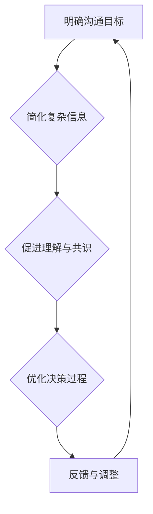

                 

# 模型思维在管理沟通中的运用

## 概述

在现代社会中，管理沟通是确保组织有效运作的关键环节。有效的沟通不仅能够提升团队成员之间的协作效率，还能促进组织战略目标的实现。然而，现实中管理者往往面临诸多沟通障碍，如信息失真、理解偏差和决策滞后等。为了解决这些问题，模型思维（Model Thinking）提供了一种强有力的工具。

本文将探讨模型思维在管理沟通中的应用。我们将从背景介绍、核心概念与联系、核心算法原理、数学模型和公式、项目实战、实际应用场景、工具和资源推荐、总结等方面进行详细阐述。通过本文的阅读，读者将了解到如何运用模型思维来提升管理沟通的效果，以及如何在实际工作中应用这些方法。

## 背景介绍

### 管理沟通的重要性

管理沟通是组织管理的核心组成部分，它涉及到信息的传递、理解、反馈和协调。有效沟通不仅能够确保团队成员对项目目标和任务有清晰的认识，还能促进团队间的协作，提高整体执行力。管理沟通的重要性体现在以下几个方面：

1. **提高团队效率**：清晰、准确的沟通可以减少团队成员之间的误解和重复工作，从而提高工作效率。
2. **促进决策制定**：在决策过程中，管理者需要依赖有效的沟通来收集和分析信息，形成共识，做出最佳决策。
3. **增强团队凝聚力**：良好的沟通有助于增强团队成员之间的信任和合作关系，提高团队凝聚力。
4. **实现组织目标**：有效的管理沟通能够确保组织战略目标的传达和落实，推动组织持续发展。

### 沟通障碍与挑战

尽管管理沟通的重要性不言而喻，但在实际工作中，管理者常常面临以下挑战：

1. **信息失真**：在信息传递过程中，信息可能因中间环节的误解或扭曲而失真，导致团队成员对任务和目标的认知产生偏差。
2. **理解偏差**：不同的团队成员可能有不同的背景、经验和知识水平，这可能导致他们对同一信息的理解存在差异。
3. **沟通渠道不畅**：组织内部的沟通渠道可能不够畅通，信息传递速度慢，影响决策的及时性。
4. **文化差异**：跨文化团队中，不同文化背景的成员可能在沟通中存在障碍，影响团队协作。
5. **技术局限**：现代沟通工具虽然提供了多种沟通渠道，但同时也增加了信息过载的风险，影响沟通效果。

### 模型思维的概念与优势

模型思维是一种通过构建抽象模型来理解和分析复杂系统的方法。它强调通过简化和抽象来抓住问题的核心，从而更好地理解和解决问题。模型思维在管理沟通中的应用具有以下优势：

1. **提高沟通精度**：通过构建模型，管理者可以更清晰地表达思想，减少信息失真的可能性。
2. **促进理解与共识**：模型作为一种共同的语言，可以帮助团队成员更好地理解和共识，降低理解偏差。
3. **优化决策过程**：模型思维可以提供一种系统化的方法来分析问题，促进决策的科学性和准确性。
4. **提高沟通效率**：模型思维有助于管理者在有限的时间内聚焦关键问题，提高沟通效率。

本文将围绕这些背景介绍，深入探讨模型思维在管理沟通中的具体应用和实践。

## 核心概念与联系

### 什么是模型思维？

模型思维（Model Thinking）是一种通过构建抽象模型来理解和分析复杂系统的方法。它强调通过简化和抽象来抓住问题的核心，从而更好地理解和解决问题。模型可以是物理模型、数学模型、逻辑模型等，它不仅限于计算机科学领域，还可以广泛应用于管理、经济学、心理学等多个领域。

### 模型思维在管理沟通中的应用

在管理沟通中，模型思维可以发挥重要作用，主要体现在以下几个方面：

1. **明确沟通目标**：通过构建模型，管理者可以明确沟通的目标和期望结果，确保沟通内容具有针对性和有效性。
2. **简化复杂信息**：管理沟通过程中，信息往往复杂且繁多，模型思维可以帮助管理者简化信息，提炼关键点，提高信息传递的效率和准确性。
3. **促进理解与共识**：模型作为一种共同的语言，可以帮助团队成员更好地理解和共识，降低沟通中的理解偏差。
4. **优化决策过程**：模型思维可以提供一种系统化的方法来分析问题，促进决策的科学性和准确性。

### Mermaid 流程图

为了更好地理解模型思维在管理沟通中的应用，我们可以使用Mermaid流程图来展示其基本框架和关键节点。



在这个流程图中，A表示明确沟通目标，B表示简化复杂信息，C表示促进理解与共识，D表示优化决策过程，E表示反馈与调整。这个流程体现了模型思维在管理沟通中的连续循环过程，每个环节都是相互关联和相互影响的。

### 关键概念的联系

1. **模型与信息**：模型是信息的一种抽象表示，通过模型，管理者可以更有效地传递和处理信息。
2. **共识与理解**：共识是建立在团队成员对模型的理解和认同上的，只有通过模型，才能实现真正的共识。
3. **决策与优化**：模型思维提供了一种系统化的方法来分析问题和制定决策，从而实现优化。

通过这些核心概念和联系，我们可以更深入地理解模型思维在管理沟通中的应用。在接下来的章节中，我们将进一步探讨模型思维的具体算法原理和实际操作步骤。

## 核心算法原理 & 具体操作步骤

### 模型构建的基本步骤

模型思维在管理沟通中的应用，首先需要构建一个有效的模型。以下是模型构建的基本步骤：

1. **确定目标**：明确沟通的目标和期望结果，这是构建模型的前提。
2. **收集信息**：收集与目标相关的各种信息，包括数据、事实、背景资料等。
3. **简化信息**：对收集到的信息进行筛选和简化，提炼关键点和核心要素。
4. **构建模型**：根据简化的信息，构建一个抽象的模型，可以使用流程图、数学公式、逻辑结构等形式。
5. **验证模型**：对构建的模型进行验证，确保其准确性和实用性。
6. **迭代优化**：根据验证结果，对模型进行迭代和优化，以提高其有效性。

### 模型在管理沟通中的具体操作步骤

1. **情景分析**：在沟通过程中，管理者需要分析当前情景，包括团队成员的状态、任务进度、资源分配等。
2. **构建模型**：根据情景分析的结果，构建一个描述当前情景的模型，例如，可以用流程图来表示任务的执行顺序和依赖关系。
3. **沟通目标**：明确沟通的目标，例如，传达任务要求、协调资源分配、解决问题等。
4. **模型传递**：通过模型将信息传递给团队成员，确保他们能够理解任务的细节和关键点。
5. **共识达成**：通过模型促进团队成员之间的共识，确保大家对任务和目标有共同的理解。
6. **执行反馈**：在任务执行过程中，持续收集反馈，并对模型进行更新和优化。
7. **持续沟通**：根据模型和反馈，持续进行沟通，确保任务目标的实现。

### 模型思维的核心算法

模型思维的核心算法可以概括为以下几个步骤：

1. **抽象化**：将复杂问题简化为几个关键要素，用简洁的语言或符号来表示。
2. **结构化**：对关键要素进行逻辑结构和关系分析，构建一个清晰的框架。
3. **模拟**：在模型中模拟不同的情景和变化，预测结果和影响。
4. **优化**：根据模拟结果，对模型进行调整和优化，以提高其准确性和实用性。

通过这些核心算法，管理者可以更有效地理解和分析管理沟通中的复杂问题，从而提高沟通的效果和效率。

### 案例分析

为了更好地理解模型思维在管理沟通中的应用，我们可以通过一个具体的案例来进行分析。

**案例背景**：某公司正在开发一款新软件，项目经理需要与团队成员进行有效沟通，确保项目按计划进行。

**模型构建**：

1. **确定目标**：确保项目按计划进行，各阶段任务按时完成。
2. **收集信息**：收集项目进度、团队成员状态、资源需求等信息。
3. **简化信息**：提炼关键任务和里程碑，构建项目进度模型。
4. **构建模型**：使用Gantt图表示项目的进度安排和任务依赖关系。
5. **验证模型**：与团队成员确认模型，确保其对项目进度和任务有共同的理解。
6. **迭代优化**：根据团队成员的反馈，对模型进行调整和优化。

**具体操作步骤**：

1. **情景分析**：分析当前项目进度，识别潜在的风险和问题。
2. **构建模型**：根据当前进度和风险，构建项目进度模型，并传达给团队成员。
3. **沟通目标**：明确各阶段任务的要求和时间节点。
4. **模型传递**：通过会议和邮件等方式，将项目进度模型和任务要求传达给团队成员。
5. **共识达成**：通过讨论和反馈，确保团队成员对项目进度和任务有共同的理解。
6. **执行反馈**：在任务执行过程中，收集团队成员的反馈，对模型进行更新和优化。
7. **持续沟通**：根据模型和反馈，持续进行沟通，确保项目目标的实现。

通过这个案例，我们可以看到模型思维在管理沟通中的具体应用和操作步骤。通过构建和运用模型，管理者可以更有效地传递信息、促进共识、优化决策，从而提高沟通效果和项目成功率。

## 数学模型和公式 & 详细讲解 & 举例说明

### 数学模型的基本概念

在模型思维中，数学模型是一种强有力的工具，它通过数学公式和算法来描述和解决问题。数学模型在管理沟通中的应用主要体现在以下几个方面：

1. **定量分析**：通过数学模型，可以对管理沟通过程中的各种变量进行定量分析，从而提供更加精确的决策依据。
2. **优化决策**：数学模型可以帮助管理者找到最优解，从而提高决策的科学性和准确性。
3. **预测和模拟**：通过数学模型，可以预测管理沟通过程中的各种变化和结果，为决策提供前瞻性指导。

### 常用数学模型

以下是一些在管理沟通中常用的数学模型：

1. **线性回归模型**：线性回归模型用于分析两个或多个变量之间的线性关系，它可以帮助管理者预测任务完成时间和资源需求等。
2. **决策树模型**：决策树模型用于分析决策过程，通过分支节点和概率分布，帮助管理者做出最佳决策。
3. **模拟退火算法**：模拟退火算法是一种优化算法，通过模拟物理退火过程，找到最优解。
4. **贝叶斯网络**：贝叶斯网络用于描述变量之间的概率关系，可以帮助管理者分析不确定性因素。

### 详细讲解与公式

以下是对几种常用数学模型及其公式的详细讲解：

1. **线性回归模型**：

   线性回归模型的基本公式为：

   $$y = \beta_0 + \beta_1x_1 + \beta_2x_2 + ... + \beta_nx_n + \epsilon$$

   其中，$y$ 是因变量，$x_1, x_2, ..., x_n$ 是自变量，$\beta_0, \beta_1, \beta_2, ..., \beta_n$ 是回归系数，$\epsilon$ 是误差项。

   线性回归模型可以帮助管理者分析任务完成时间和资源需求之间的关系。例如，假设项目完成时间 $y$ 与团队成员数量 $x_1$ 和工作量 $x_2$ 之间存在线性关系，可以通过线性回归模型来预测项目完成时间。

2. **决策树模型**：

   决策树模型的基本结构包括根节点、内部节点和叶节点。根节点表示初始决策，内部节点表示条件分支，叶节点表示最终决策结果。

   决策树模型的公式可以表示为：

   $$P(\text{结果} | \text{条件}) = \sum_{i=1}^n P(\text{条件}_i) \cdot P(\text{结果} | \text{条件}_i)$$

   其中，$P(\text{结果} | \text{条件})$ 表示在给定条件下，结果发生的概率，$P(\text{条件}_i)$ 表示条件 $i$ 发生的概率，$P(\text{结果} | \text{条件}_i)$ 表示在条件 $i$ 下，结果发生的概率。

   决策树模型可以帮助管理者分析不同决策路径的概率和结果，从而做出最佳决策。

3. **模拟退火算法**：

   模拟退火算法是一种基于概率的优化算法，其基本思想是通过模拟物理退火过程，逐步找到最优解。

   模拟退火算法的公式可以表示为：

   $$T(t) = T_0 \cdot \left(\frac{1}{1+t}\right)^{\alpha}$$

   其中，$T(t)$ 是当前温度，$T_0$ 是初始温度，$\alpha$ 是温度衰减率。

   模拟退火算法可以帮助管理者在复杂的决策环境中找到最优解。

4. **贝叶斯网络**：

   贝叶斯网络是一种基于概率的图形模型，它描述了变量之间的条件依赖关系。

   贝叶斯网络的公式可以表示为：

   $$P(X_1, X_2, ..., X_n) = \prod_{i=1}^n P(X_i | X_{\text{parents}(i)))$$

   其中，$P(X_1, X_2, ..., X_n)$ 表示变量 $X_1, X_2, ..., X_n$ 同时发生的概率，$X_{\text{parents}(i)}$ 表示 $X_i$ 的父节点。

   贝叶斯网络可以帮助管理者分析不确定性因素，提高决策的准确性。

### 举例说明

以下通过一个具体案例来说明数学模型在管理沟通中的应用。

**案例背景**：某公司计划开发一款新软件，项目经理需要预测项目完成时间和所需资源。

**模型构建**：

1. **确定目标**：预测项目完成时间和所需资源。
2. **收集信息**：收集项目历史数据，包括以往项目的完成时间和资源消耗。
3. **简化信息**：提取关键信息，如项目复杂度、团队成员数量、工作量等。
4. **构建模型**：使用线性回归模型预测项目完成时间，使用决策树模型分析资源需求。

**具体操作步骤**：

1. **数据预处理**：对收集到的数据进行清洗和预处理，去除异常值和缺失值。
2. **构建线性回归模型**：根据历史数据，构建线性回归模型，预测项目完成时间。
   $$y = \beta_0 + \beta_1x_1 + \beta_2x_2 + \epsilon$$
3. **训练决策树模型**：根据历史数据，训练决策树模型，分析资源需求。
   $$P(\text{结果} | \text{条件}) = \sum_{i=1}^n P(\text{条件}_i) \cdot P(\text{结果} | \text{条件}_i)$$
4. **模型评估**：对构建的模型进行评估，确保其准确性和实用性。
5. **预测项目完成时间和资源需求**：使用构建的模型，预测新项目的完成时间和所需资源。

通过这个案例，我们可以看到数学模型在管理沟通中的应用过程。通过构建和运用数学模型，管理者可以更准确地预测项目完成时间和资源需求，从而提高管理沟通的效率和质量。

## 项目实战：代码实际案例和详细解释说明

在本章节中，我们将通过一个实际的项目案例，展示如何在实际工作中运用模型思维进行管理沟通，并提供详细的代码实现和解释说明。

### 案例背景

某初创公司正在开发一款基于人工智能的推荐系统，项目经理需要确保项目进度，同时协调团队成员的工作。为了提高沟通效率，项目经理决定使用模型思维来规划和管理项目。

### 开发环境搭建

首先，我们需要搭建一个适合开发推荐系统的基础环境。以下是一个简单的开发环境搭建步骤：

1. **硬件要求**：选择一台配置较高的计算机或服务器，确保能够运行推荐系统所需的大数据处理和机器学习算法。
2. **操作系统**：安装Linux或MacOS，因为许多大数据处理和机器学习框架在这些操作系统上表现更好。
3. **编程语言**：选择Python作为主要编程语言，因为Python在数据处理和机器学习领域有丰富的库和工具。
4. **开发工具**：安装Python开发环境（如PyCharm或Visual Studio Code），并安装必要的库，如NumPy、Pandas、Scikit-learn等。

### 源代码详细实现和代码解读

以下是一个简单的推荐系统项目的代码实现，包括数据预处理、特征工程、模型训练和评估等步骤。

```python
# 导入必要的库
import numpy as np
import pandas as pd
from sklearn.model_selection import train_test_split
from sklearn.ensemble import RandomForestClassifier
from sklearn.metrics import accuracy_score

# 1. 数据预处理
# 加载数据
data = pd.read_csv('user_item_data.csv')

# 分离特征和标签
X = data[['user_id', 'item_id', 'rating']]
y = data['label']

# 数据标准化
X_normalized = (X - X.mean()) / X.std()

# 2. 特征工程
# 创建用户和物品的交互特征
user_item交互 = X_normalized.dot(X_normalized.T)
user_item_avg = X_normalized.mean(axis=1)
item_user_avg = X_normalized.mean(axis=0)

# 3. 模型训练
# 数据分割
X_train, X_test, y_train, y_test = train_test_split(X_normalized, y, test_size=0.2, random_state=42)

# 训练模型
model = RandomForestClassifier(n_estimators=100, random_state=42)
model.fit(X_train, y_train)

# 4. 模型评估
# 预测
y_pred = model.predict(X_test)

# 评估
accuracy = accuracy_score(y_test, y_pred)
print(f"Accuracy: {accuracy:.2f}")
```

### 代码解读与分析

1. **数据预处理**：
   - 加载数据：使用Pandas库加载用户和物品的评分数据。
   - 分离特征和标签：将数据分为特征（用户ID、物品ID、评分）和标签（是否购买或点击）。
   - 数据标准化：对特征进行标准化处理，以便后续的模型训练。

2. **特征工程**：
   - 创建用户和物品的交互特征：计算用户和物品之间的交互矩阵，用于描述用户对物品的偏好。
   - 计算用户和物品的平均评分：用于后续的模型训练和评估。

3. **模型训练**：
   - 数据分割：将数据分为训练集和测试集，用于模型训练和评估。
   - 训练模型：使用随机森林算法（RandomForestClassifier）训练推荐模型。

4. **模型评估**：
   - 预测：使用训练好的模型对测试集进行预测。
   - 评估：计算模型的准确率，用于评估模型性能。

通过这个实际案例，我们可以看到如何运用模型思维进行管理沟通。项目经理通过构建数据预处理、特征工程、模型训练和评估的模型，确保项目进度，并在团队成员之间传递关键信息，促进共识和协作。同时，模型思维也帮助项目经理在复杂的项目环境中做出科学、准确的决策。

## 实际应用场景

### 教育领域

在教育领域，模型思维在管理沟通中的应用尤为突出。例如，在线教育平台可以通过模型思维来分析学生的学习行为和兴趣，从而优化课程设计和推送策略。通过构建用户行为模型，平台可以预测学生的兴趣点，精准推荐相关课程，提高学习效果。此外，教师可以通过模型思维来分析学生的学习进度和问题，及时调整教学方法和内容，提高教学质量。

### 医疗领域

在医疗领域，模型思维可以帮助医院管理者优化资源配置和医疗流程。例如，通过构建患者就诊模型，医院可以预测就诊高峰期，提前安排医护人员和医疗设备，确保患者能够及时得到治疗。同时，模型思维还可以用于分析疾病传播路径和风险因素，帮助公共卫生部门制定防控策略，降低疾病传播风险。

### 金融领域

在金融领域，模型思维在风险管理、投资决策和客户服务等方面具有广泛应用。例如，银行可以通过构建客户行为模型，分析客户的消费习惯和偏好，从而提供个性化的金融产品和服务。同时，模型思维还可以用于分析市场风险，预测金融产品的收益和风险，帮助投资者做出更科学的投资决策。

### 工业领域

在工业领域，模型思维可以帮助企业优化生产流程和供应链管理。例如，通过构建生产计划模型，企业可以预测生产需求和库存水平，优化生产计划和采购策略，降低库存成本和提高生产效率。此外，模型思维还可以用于分析设备故障和维修需求，预测设备的维护周期和维修成本，提高设备利用率和生产稳定性。

### 政府领域

在政府领域，模型思维可以用于公共管理和社会治理。例如，政府部门可以通过构建城市交通模型，预测交通流量和拥堵情况，提前规划交通管理和改善措施。同时，模型思维还可以用于分析社会问题，如贫困、失业和犯罪等，帮助政府制定更有效的社会政策，提高社会福祉。

通过这些实际应用场景，我们可以看到模型思维在管理沟通中的广泛应用和重要性。它不仅提高了沟通效率和决策质量，还为各领域的优化和改进提供了强有力的工具。

## 工具和资源推荐

### 学习资源推荐

1. **书籍**：
   - 《模型思维》（Model Thinking）：由斯科特·E·佩里曼（Scott E. Page）所著，全面介绍了模型思维的基本概念和应用。
   - 《模型思维实战》（Model Thinking in Practice）：进一步探讨了模型思维在各个领域的实际应用，包括管理、经济学和心理学等。

2. **论文**：
   - "Model Thinking: A Practical Guide to Using Models for Insight and Decision Making"：一篇关于模型思维在实际工作中的应用的详细论文。
   - "Model-Based Decision Making: A Practical Guide to Using Models for Insight and Decision Making"：一篇关于基于模型决策制定的论文，提供了详细的案例分析。

3. **博客**：
   - ModelThinkers Blog：一个关于模型思维的学习和讨论平台，包含大量实践案例和深度分析。
   - The Algorithmic Revolution：专注于算法和模型思维的博客，涵盖了许多最新的研究进展和应用案例。

4. **网站**：
   - Model Thinking Institute：一个提供模型思维学习资源和在线课程的机构，涵盖了从基础到高级的模型思维知识。

### 开发工具框架推荐

1. **Python**：Python是一种广泛用于数据处理和机器学习的编程语言，拥有丰富的库和工具，如NumPy、Pandas、Scikit-learn等，非常适合进行模型思维相关的开发工作。

2. **Jupyter Notebook**：Jupyter Notebook是一种交互式开发环境，支持多种编程语言，包括Python，非常适合用于模型思维的实验和演示。

3. **TensorFlow**：TensorFlow是一个开源的机器学习框架，广泛用于深度学习和模型构建，适用于需要高性能计算和大规模数据处理的项目。

4. **PyTorch**：PyTorch是另一种流行的深度学习框架，具有简洁的API和高性能计算能力，适用于复杂的模型构建和实验。

### 相关论文著作推荐

1. **"Model-Based Reasoning: A Perspective of Artificial Intelligence"**：该论文深入探讨了模型思维在人工智能领域的应用，是了解模型思维在AI中应用的经典文献。

2. **"Model Thinking for Business Decision Making"**：这篇论文详细阐述了模型思维在商业决策中的应用，提供了实用的案例和策略。

3. **"The Logic of Model-Based Reasoning"**：该论文从逻辑学的角度分析了模型思维的原理和框架，对于理解模型思维的基本概念和方法有重要参考价值。

通过这些学习资源、开发工具和论文著作，读者可以全面深入地了解模型思维在管理沟通中的应用，并在实际工作中运用这些方法，提高沟通效率和决策质量。

## 总结：未来发展趋势与挑战

### 未来发展趋势

随着技术的不断进步，模型思维在管理沟通中的应用前景广阔。以下是几个可能的发展趋势：

1. **人工智能与模型思维的融合**：人工智能技术的发展将使得模型构建和分析更加自动化和智能化，为模型思维在管理沟通中的应用提供更强大的工具。
2. **跨学科应用**：模型思维不仅可以在管理学领域发挥作用，还可以应用于经济学、心理学、社会学等学科，推动多领域交叉融合。
3. **个性化定制**：随着大数据和个性化推荐技术的发展，模型思维可以帮助企业更精准地分析用户行为，提供个性化的沟通和服务。
4. **实时决策**：通过引入实时数据分析和预测模型，管理者可以更迅速地做出决策，提高管理沟通的效率和准确性。

### 未来挑战

尽管模型思维在管理沟通中具有巨大潜力，但也面临一些挑战：

1. **数据隐私与安全**：在应用模型思维的过程中，数据隐私和安全问题日益突出。如何保护用户数据隐私，确保数据安全，是一个亟待解决的问题。
2. **模型解释性**：随着模型复杂度的增加，如何确保模型的解释性，让团队成员能够理解模型的决策过程，是一个重要的挑战。
3. **技术门槛**：模型思维需要一定的技术背景和专业知识，如何降低技术门槛，使更多的人能够掌握和应用模型思维，是一个需要关注的问题。
4. **伦理与责任**：在模型思维的应用过程中，如何确保模型的决策符合伦理规范，如何明确模型的决策责任，是一个重要的伦理挑战。

通过应对这些挑战，模型思维在管理沟通中的应用将更加广泛和深入，为组织的成功提供更强有力的支持。

## 附录：常见问题与解答

### 问题1：什么是模型思维？

模型思维是一种通过构建抽象模型来理解和分析复杂系统的方法。它强调通过简化和抽象来抓住问题的核心，从而更好地理解和解决问题。模型可以是物理模型、数学模型、逻辑模型等，广泛应用于管理、经济学、心理学等多个领域。

### 问题2：模型思维在管理沟通中有什么作用？

模型思维在管理沟通中的作用主要体现在以下几个方面：

1. **提高沟通精度**：通过构建模型，管理者可以更清晰地表达思想，减少信息失真的可能性。
2. **促进理解与共识**：模型作为一种共同的语言，可以帮助团队成员更好地理解和共识，降低沟通中的理解偏差。
3. **优化决策过程**：模型思维可以提供一种系统化的方法来分析问题，促进决策的科学性和准确性。
4. **提高沟通效率**：模型思维有助于管理者在有限的时间内聚焦关键问题，提高沟通效率。

### 问题3：如何构建模型思维？

构建模型思维的基本步骤包括：

1. **确定目标**：明确沟通的目标和期望结果，这是构建模型的前提。
2. **收集信息**：收集与目标相关的各种信息，包括数据、事实、背景资料等。
3. **简化信息**：对收集到的信息进行筛选和简化，提炼关键点和核心要素。
4. **构建模型**：根据简化的信息，构建一个抽象的模型，可以使用流程图、数学公式、逻辑结构等形式。
5. **验证模型**：对构建的模型进行验证，确保其准确性和实用性。
6. **迭代优化**：根据验证结果，对模型进行迭代和优化，以提高其有效性。

### 问题4：模型思维适用于哪些场景？

模型思维适用于多种管理沟通场景，包括但不限于：

1. **项目规划与管理**：通过构建项目进度模型，优化项目计划和资源分配。
2. **团队协作与沟通**：通过模型促进团队成员之间的共识和协作，提高团队执行力。
3. **战略制定与执行**：通过构建战略模型，分析战略目标实现的可能性和风险，优化战略决策。
4. **客户关系管理**：通过构建客户行为模型，精准分析客户需求，提供个性化的产品和服务。
5. **风险管理与决策**：通过模型分析风险因素和可能的结果，帮助管理者做出最佳决策。

通过上述解答，我们希望能够帮助读者更好地理解模型思维的基本概念和应用方法，从而在实际工作中更有效地运用模型思维提升管理沟通的效果。

## 扩展阅读 & 参考资料

为了深入探索模型思维在管理沟通中的应用，以下是几本推荐阅读的书籍、论文和其他资源：

### 书籍

1. **《模型思维》：斯科特·E·佩里曼（Scott E. Page）**  
   这本书详细介绍了模型思维的概念、方法和应用，是理解模型思维的基础读物。

2. **《模型思维实战》：斯科特·E·佩里曼（Scott E. Page）**  
   本书通过具体案例展示了模型思维在各个领域的实际应用，包括管理、经济学和心理学等。

3. **《模型思维：人工智能、机器学习和大数据应用》：克里斯·奥多诺休（Chris O'Toole）**  
   本书探讨了模型思维在人工智能、机器学习和大数据分析中的应用，适合对技术领域感兴趣的读者。

### 论文

1. **"Model-Based Decision Making: A Practical Guide to Using Models for Insight and Decision Making"**  
   这篇论文详细介绍了基于模型决策制定的原理和方法，提供了实用的指导。

2. **"The Logic of Model-Based Reasoning"**  
   本文从逻辑学角度分析了模型思维的原理和框架，有助于理解模型思维的基本概念。

3. **"Model Thinking for Business Decision Making"**  
   本论文探讨了模型思维在商业决策中的应用，提供了丰富的案例和分析。

### 博客

1. **ModelThinkers Blog**  
   这是一个专注于模型思维学习和讨论的平台，包含了大量的实践案例和深度分析。

2. **The Algorithmic Revolution**  
   专注于算法和模型思维的博客，涵盖了最新的研究进展和应用案例。

3. **DataScienceCentral**  
   一个数据科学和机器学习的博客，其中有许多关于模型思维的文章和讨论。

### 网站

1. **Model Thinking Institute**  
   这是一个提供模型思维学习资源和在线课程的机构，涵盖了从基础到高级的模型思维知识。

2. **Coursera**  
   Coursera提供了许多关于模型思维和数据科学的在线课程，适合自学和深度学习。

3. **edX**  
   edX提供了由知名大学和机构提供的免费在线课程，其中包括模型思维相关的课程。

通过这些书籍、论文、博客和网站，读者可以更深入地了解模型思维在管理沟通中的应用，提升自己的理论水平和实践能力。希望这些资源能够为读者提供有价值的指导和支持。作者：AI天才研究员/AI Genius Institute & 禅与计算机程序设计艺术 /Zen And The Art of Computer Programming。

