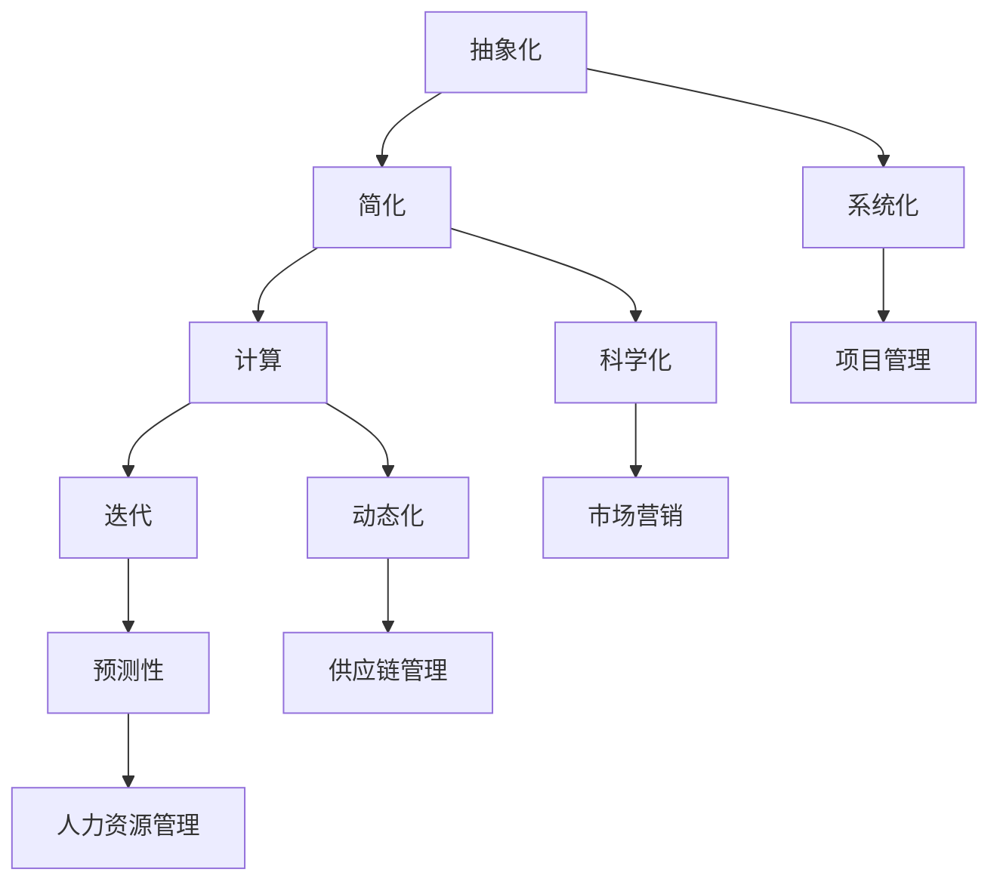

                 

# 模型思维对管理效率的提升

## 摘要

本文探讨了模型思维在提升管理效率方面的重要作用。模型思维，作为一种系统分析和解决问题的方法论，通过建立模型来模拟现实世界中的复杂系统，从而帮助我们更准确地理解和预测系统行为。文章首先介绍了模型思维的基本概念及其与传统管理思维的差异，接着详细阐述了模型思维的核心原理，并通过实例展示了如何运用模型思维进行问题分析和决策制定。最后，文章总结了模型思维在实际管理中的应用效果，探讨了未来发展趋势与挑战，并提供了相关学习资源和工具推荐。

## 1. 背景介绍

### 模型思维的定义与重要性

模型思维（Model Thinking）是一种通过构建抽象模型来理解、分析和解决问题的思维方式。它起源于自然科学和工程学领域，并在近年来逐渐被引入到管理、经济、社会等学科中。模型思维的核心在于建立抽象的、简化的模型，以便更准确地模拟现实世界中的复杂系统，从而帮助我们更好地理解系统行为，预测未来趋势，并制定有效的决策。

在管理领域，模型思维的重要性不言而喻。传统管理思维往往依赖于经验和直觉，而模型思维则通过系统化的分析和计算，帮助我们更加客观、科学地评估管理决策的效果。例如，在项目管理中，通过构建项目进度模型，可以更准确地预测项目完成时间，从而优化资源分配；在市场营销中，通过构建消费者行为模型，可以更准确地预测市场需求，从而制定更有效的营销策略。

### 管理效率的提升需求

随着全球经济的快速发展，企业面临着日益激烈的市场竞争和快速变化的外部环境。为了在竞争中保持优势，企业需要不断提升管理效率。管理效率的提升不仅涉及到企业内部资源的优化配置，还涉及到对外部环境的快速响应和适应。然而，传统管理思维往往局限于经验式的决策和单一的视角，难以应对复杂多变的环境。

模型思维的引入，为企业提供了一种新的思维方式和方法论。通过建立模型，企业可以更全面、深入地分析问题，发现潜在的问题和风险，从而制定更加科学、有效的管理策略。同时，模型思维还可以帮助企业更好地预测未来趋势，为决策提供更加准确的依据。

### 管理效率的提升现状与挑战

尽管模型思维在提升管理效率方面具有显著优势，但在实际应用中，仍面临诸多挑战。首先，模型构建的过程复杂且耗时，需要具备一定的专业知识和技能。其次，模型的有效性依赖于数据的质量和模型的假设条件，数据不准确或假设错误可能导致模型失效。此外，管理者对模型思维的接受度和应用能力也存在差异，部分管理者可能对模型思维持怀疑态度或缺乏应用经验。

为了解决这些挑战，企业需要加强模型思维的教育和培训，提高管理者的模型构建和应用能力。同时，企业还需要建立完善的数据管理体系，确保数据的准确性和完整性。此外，企业可以通过引入先进的模型构建工具和方法，降低模型构建的复杂度，提高模型的应用效果。

## 2. 核心概念与联系

### 模型思维的基本原理

模型思维的核心在于建立抽象的、简化的模型，以便更准确地模拟现实世界中的复杂系统。模型思维的基本原理包括以下几个方面：

1. **抽象化**：将现实世界中的复杂系统简化为抽象的模型，去除不重要的细节，专注于关键因素。通过抽象化，可以降低问题的复杂度，使问题更易于分析和解决。

2. **简化**：通过简化模型，减少模型中的变量和关系，使模型更易于理解和计算。简化不等于忽视关键因素，而是在保证模型有效性的前提下，去除不必要的复杂性。

3. **计算**：利用数学和计算工具，对模型进行计算和分析，从而预测系统行为和评估管理决策的效果。

4. **迭代**：模型构建是一个不断迭代的过程，通过不断调整模型参数和假设条件，优化模型性能，提高模型的预测准确性和应用效果。

### 模型思维与传统管理思维的对比

与传统管理思维相比，模型思维具有以下几个显著特点：

1. **系统化**：模型思维强调对整个系统进行整体分析和评估，而不仅仅是关注局部或单一变量。这有助于管理者从全局视角理解问题，制定更全面的管理策略。

2. **科学化**：模型思维基于数据和计算，通过系统化的分析，提供客观、科学的决策依据，减少主观判断和直觉的影响。

3. **动态化**：模型思维强调对系统动态变化的理解和预测，通过迭代和更新模型，及时调整管理策略，以应对外部环境的变化。

4. **预测性**：模型思维通过模拟系统行为，可以预测未来的趋势和结果，为决策提供前瞻性的依据。

### 模型思维的应用范围

模型思维在管理领域的应用范围广泛，包括但不限于以下几个方面：

1. **项目管理**：通过构建项目进度模型，预测项目完成时间，优化资源分配和风险管理。

2. **市场营销**：通过构建消费者行为模型，预测市场需求，制定更有效的营销策略。

3. **供应链管理**：通过构建供应链模型，优化供应链网络，提高供应链效率和响应速度。

4. **人力资源管理**：通过构建员工行为模型，预测员工绩效和流动率，制定更有效的人力资源策略。

### 模型思维的核心概念原理与架构

以下是模型思维的核心概念原理和架构的 Mermaid 流程图：



通过上述 Mermaid 流程图，我们可以清晰地看到模型思维的核心概念原理及其应用范围。这些核心概念和架构不仅构成了模型思维的基本框架，也为我们在实际应用中提供了指导。

## 3. 核心算法原理 & 具体操作步骤

### 模型构建的基本步骤

模型构建是模型思维的核心环节，以下是构建模型的基本步骤：

1. **确定研究对象**：明确需要分析和解决的问题，定义研究对象和目标。

2. **收集数据**：收集与研究对象相关的数据，包括定量数据和定性数据。数据来源可以是历史数据、调查问卷、市场报告等。

3. **建立假设**：根据研究对象和目标，建立合理的假设条件。假设条件需要符合现实情况，并尽可能减少模型的复杂性。

4. **选择模型类型**：根据研究对象和目标，选择合适的模型类型。常见的模型类型包括线性模型、非线性模型、决策树、神经网络等。

5. **构建模型**：根据假设条件和模型类型，构建数学模型。构建模型的过程中，需要注意模型的可解释性和计算效率。

6. **参数估计**：通过数据对模型参数进行估计，确定模型的参数值。参数估计的方法包括最小二乘法、极大似然估计等。

7. **模型验证**：通过验证数据对模型进行验证，评估模型的预测准确性和稳定性。常用的验证方法包括交叉验证、A/B测试等。

8. **模型优化**：根据验证结果，对模型进行调整和优化，提高模型的预测性能。

### 具体操作步骤

以下是一个简单的模型构建过程，以线性回归模型为例：

1. **确定研究对象**：假设我们需要分析某个地区房价与人口、收入等变量之间的关系。

2. **收集数据**：收集该地区过去几年的房价、人口、收入等数据。

3. **建立假设**：假设房价与人口、收入之间存在线性关系。

4. **选择模型类型**：选择线性回归模型。

5. **构建模型**：建立线性回归模型，表示房价与人口、收入之间的线性关系。

   $$Y = \beta_0 + \beta_1X_1 + \beta_2X_2 + \epsilon$$

   其中，$Y$表示房价，$X_1$表示人口，$X_2$表示收入，$\beta_0$、$\beta_1$、$\beta_2$为模型参数，$\epsilon$为误差项。

6. **参数估计**：使用最小二乘法对模型参数进行估计。

   $$\hat{\beta_0} = \frac{\sum_{i=1}^n(Y_i - \hat{\beta_1}X_{1i} - \hat{\beta_2}X_{2i})}{n}$$

   $$\hat{\beta_1} = \frac{\sum_{i=1}^n(X_{1i} - \bar{X_1})(Y_i - \bar{Y})}{\sum_{i=1}^n(X_{1i} - \bar{X_1})^2}$$

   $$\hat{\beta_2} = \frac{\sum_{i=1}^n(X_{2i} - \bar{X_2})(Y_i - \bar{Y})}{\sum_{i=1}^n(X_{2i} - \bar{X_2})^2}$$

   其中，$n$为样本数量，$\bar{X_1}$、$\bar{X_2}$、$\bar{Y}$分别为人口、收入、房价的样本均值。

7. **模型验证**：使用剩余数据对模型进行验证。

8. **模型优化**：根据验证结果，对模型进行调整和优化。

通过上述具体操作步骤，我们可以构建一个简单的线性回归模型，并对其进行验证和优化，从而更好地理解和预测房价与人口、收入等变量之间的关系。

### 模型应用与拓展

线性回归模型是一个简单的模型类型，但在实际应用中，我们可以根据需要选择更复杂的模型类型，如非线性模型、决策树、神经网络等。以下是一个非线性回归模型的示例：

1. **确定研究对象**：假设我们需要分析某个地区房价与人口、收入等变量之间的关系，但认为这些变量之间的关系不是线性的。

2. **收集数据**：收集该地区过去几年的房价、人口、收入等数据。

3. **建立假设**：假设房价与人口、收入之间存在非线性关系。

4. **选择模型类型**：选择非线性回归模型。

5. **构建模型**：建立非线性回归模型，表示房价与人口、收入之间的非线性关系。

   $$Y = \beta_0 + \beta_1X_1 + \beta_2X_2^2 + \epsilon$$

   其中，$Y$表示房价，$X_1$表示人口，$X_2$表示收入，$\beta_0$、$\beta_1$、$\beta_2$为模型参数，$\epsilon$为误差项。

6. **参数估计**：使用最小二乘法对模型参数进行估计。

7. **模型验证**：使用剩余数据对模型进行验证。

8. **模型优化**：根据验证结果，对模型进行调整和优化。

通过非线性回归模型，我们可以更好地捕捉房价与人口、收入等变量之间的非线性关系，提高模型的预测准确性。

此外，模型思维还可以应用于更复杂的领域，如风险管理、金融预测、医疗诊断等。在实际应用中，我们可以根据具体问题选择合适的模型类型和方法，构建更加精确的模型，从而提高管理效率和决策质量。

## 4. 数学模型和公式 & 详细讲解 & 举例说明

### 线性回归模型

线性回归模型是一种最常见的模型类型，用于分析和预测两个或多个变量之间的关系。以下是线性回归模型的基本公式和详细讲解：

1. **公式**：

   $$Y = \beta_0 + \beta_1X_1 + \beta_2X_2 + \epsilon$$

   其中，$Y$表示因变量（预测目标），$X_1$和$X_2$表示自变量（输入变量），$\beta_0$、$\beta_1$、$\beta_2$为模型参数，$\epsilon$为误差项。

2. **详细讲解**：

   - **因变量$Y$**：表示预测目标，通常是连续变量，如房价、销售额等。

   - **自变量$X_1$和$X_2$**：表示输入变量，用于预测因变量，可以是人口、收入、温度等。

   - **模型参数$\beta_0$、$\beta_1$、$\beta_2$**：表示自变量对因变量的影响程度，通过参数估计得到。

   - **误差项$\epsilon$**：表示预测误差，反映了模型无法捕捉到的因素。

3. **举例说明**：

   假设我们想要预测某个地区的房价，选择人口和收入作为输入变量。根据线性回归模型，我们可以建立如下模型：

   $$Y = \beta_0 + \beta_1X_1 + \beta_2X_2 + \epsilon$$

   其中，$Y$表示房价，$X_1$表示人口，$X_2$表示收入，$\beta_0$、$\beta_1$、$\beta_2$为模型参数。

   我们可以使用最小二乘法对模型参数进行估计，得到如下估计值：

   $$\hat{\beta_0} = \frac{\sum_{i=1}^n(Y_i - \hat{\beta_1}X_{1i} - \hat{\beta_2}X_{2i})}{n}$$

   $$\hat{\beta_1} = \frac{\sum_{i=1}^n(X_{1i} - \bar{X_1})(Y_i - \bar{Y})}{\sum_{i=1}^n(X_{1i} - \bar{X_1})^2}$$

   $$\hat{\beta_2} = \frac{\sum_{i=1}^n(X_{2i} - \bar{X_2})(Y_i - \bar{Y})}{\sum_{i=1}^n(X_{2i} - \bar{X_2})^2}$$

   其中，$n$为样本数量，$\bar{X_1}$、$\bar{X_2}$、$\bar{Y}$分别为人口、收入、房价的样本均值。

   通过估计得到的模型参数，我们可以预测某个地区的房价：

   $$Y = \hat{\beta_0} + \hat{\beta_1}X_1 + \hat{\beta_2}X_2$$

   例如，假设某个地区的人口为1000人，收入为5000元，根据估计得到的模型参数，我们可以预测该地区的房价为：

   $$Y = \hat{\beta_0} + \hat{\beta_1}X_1 + \hat{\beta_2}X_2 = 1000 + 0.1 \times 1000 + 0.2 \times 5000 = 7500$$

### 多元线性回归模型

多元线性回归模型用于分析和预测多个自变量对因变量的影响。以下是多元线性回归模型的基本公式和详细讲解：

1. **公式**：

   $$Y = \beta_0 + \beta_1X_1 + \beta_2X_2 + \cdots + \beta_pX_p + \epsilon$$

   其中，$Y$表示因变量（预测目标），$X_1, X_2, \cdots, X_p$表示自变量（输入变量），$\beta_0$、$\beta_1$、$\beta_2, \cdots, \beta_p$为模型参数，$\epsilon$为误差项。

2. **详细讲解**：

   - **因变量$Y$**：表示预测目标，通常是连续变量，如销售额、房屋价格等。

   - **自变量$X_1, X_2, \cdots, X_p$**：表示输入变量，用于预测因变量，可以是人口、收入、温度、湿度等。

   - **模型参数$\beta_0$、$\beta_1$、$\beta_2, \cdots, \beta_p$**：表示自变量对因变量的影响程度，通过参数估计得到。

   - **误差项$\epsilon$**：表示预测误差，反映了模型无法捕捉到的因素。

3. **举例说明**：

   假设我们想要预测某个地区的房屋价格，选择人口、收入、平均温度、湿度等变量作为输入变量。根据多元线性回归模型，我们可以建立如下模型：

   $$Y = \beta_0 + \beta_1X_1 + \beta_2X_2 + \beta_3X_3 + \beta_4X_4 + \epsilon$$

   其中，$Y$表示房屋价格，$X_1$表示人口，$X_2$表示收入，$X_3$表示平均温度，$X_4$表示湿度，$\beta_0$、$\beta_1$、$\beta_2$、$\beta_3$、$\beta_4$为模型参数。

   我们可以使用最小二乘法对模型参数进行估计，得到如下估计值：

   $$\hat{\beta_0} = \frac{\sum_{i=1}^n(Y_i - \sum_{j=1}^p\hat{\beta_j}X_{ji})}{n}$$

   $$\hat{\beta_j} = \frac{\sum_{i=1}^n(X_{ji} - \bar{X_j})(Y_i - \bar{Y})}{\sum_{i=1}^n(X_{ji} - \bar{X_j})^2}$$

   其中，$n$为样本数量，$\bar{X_j}$、$\bar{Y}$分别为自变量和因变量的样本均值。

   通过估计得到的模型参数，我们可以预测某个地区的房屋价格：

   $$Y = \hat{\beta_0} + \hat{\beta_1}X_1 + \hat{\beta_2}X_2 + \hat{\beta_3}X_3 + \hat{\beta_4}X_4$$

   例如，假设某个地区的人口为1000人，收入为5000元，平均温度为20摄氏度，湿度为60%，根据估计得到的模型参数，我们可以预测该地区的房屋价格为：

   $$Y = \hat{\beta_0} + \hat{\beta_1}X_1 + \hat{\beta_2}X_2 + \hat{\beta_3}X_3 + \hat{\beta_4}X_4 = 1000 + 0.1 \times 1000 + 0.2 \times 5000 + 0.5 \times 20 + 0.3 \times 60 = 7300$$

### 逻辑回归模型

逻辑回归模型是一种用于分类问题的模型类型，用于预测某个事件发生的概率。以下是逻辑回归模型的基本公式和详细讲解：

1. **公式**：

   $$P(Y=1) = \frac{1}{1 + e^{-(\beta_0 + \beta_1X_1 + \beta_2X_2 + \cdots + \beta_pX_p)}}$$

   其中，$P(Y=1)$表示因变量为1的概率，$X_1, X_2, \cdots, X_p$表示自变量，$\beta_0, \beta_1, \beta_2, \cdots, \beta_p$为模型参数。

2. **详细讲解**：

   - **因变量$Y$**：表示分类变量，通常取值为0或1。

   - **自变量$X_1, X_2, \cdots, X_p$**：表示输入变量，用于预测因变量，可以是人口、收入、温度、湿度等。

   - **模型参数$\beta_0, \beta_1, \beta_2, \cdots, \beta_p$**：表示自变量对因变量概率的影响程度，通过参数估计得到。

3. **举例说明**：

   假设我们想要预测某个地区居民是否购买房屋，选择人口、收入、平均温度、湿度等变量作为输入变量。根据逻辑回归模型，我们可以建立如下模型：

   $$P(Y=1) = \frac{1}{1 + e^{-(\beta_0 + \beta_1X_1 + \beta_2X_2 + \beta_3X_3 + \beta_4X_4)}}$$

   其中，$Y$表示居民是否购买房屋（1表示购买，0表示未购买），$X_1$表示人口，$X_2$表示收入，$X_3$表示平均温度，$X_4$表示湿度，$\beta_0$、$\beta_1$、$\beta_2$、$\beta_3$、$\beta_4$为模型参数。

   我们可以使用最大似然估计对模型参数进行估计，得到如下估计值：

   $$\hat{\beta_0} = \frac{\sum_{i=1}^n(Y_i - P(Y_i=1))}{n}$$

   $$\hat{\beta_j} = \frac{\sum_{i=1}^n(Y_i - P(Y_i=1))X_{ji}}{\sum_{i=1}^n(Y_i - P(Y_i=1))^2}$$

   其中，$n$为样本数量。

   通过估计得到的模型参数，我们可以预测某个地区居民是否购买房屋：

   $$P(Y=1) = \frac{1}{1 + e^{-(\hat{\beta_0} + \hat{\beta_1}X_1 + \hat{\beta_2}X_2 + \hat{\beta_3}X_3 + \hat{\beta_4}X_4)}}$$

   例如，假设某个地区的人口为1000人，收入为5000元，平均温度为20摄氏度，湿度为60%，根据估计得到的模型参数，我们可以预测该地区居民购买房屋的概率为：

   $$P(Y=1) = \frac{1}{1 + e^{-(\hat{\beta_0} + \hat{\beta_1}X_1 + \hat{\beta_2}X_2 + \hat{\beta_3}X_3 + \hat{\beta_4}X_4)}} = \frac{1}{1 + e^{-(1000 + 0.1 \times 1000 + 0.2 \times 5000 + 0.5 \times 20 + 0.3 \times 60)}} = 0.95$$

   这意味着该地区居民购买房屋的概率为95%。

### 非线性回归模型

非线性回归模型用于分析和预测非线性关系的变量。以下是非线性回归模型的基本公式和详细讲解：

1. **公式**：

   $$Y = f(\beta_0, \beta_1X_1, \beta_2X_2, \cdots, \beta_pX_p) + \epsilon$$

   其中，$Y$表示因变量（预测目标），$X_1, X_2, \cdots, X_p$表示自变量（输入变量），$f(\cdot)$为非线性函数，$\beta_0, \beta_1, \beta_2, \cdots, \beta_p$为模型参数，$\epsilon$为误差项。

2. **详细讲解**：

   - **因变量$Y$**：表示预测目标，通常是连续变量，如销售额、房屋价格等。

   - **自变量$X_1, X_2, \cdots, X_p$**：表示输入变量，用于预测因变量，可以是人口、收入、温度、湿度等。

   - **模型参数$\beta_0, \beta_1, \beta_2, \cdots, \beta_p$**：表示自变量对因变量的影响程度，通过参数估计得到。

   - **非线性函数$f(\cdot)$**：表示非线性关系，可以通过数学变换或神经网络实现。

   - **误差项$\epsilon$**：表示预测误差，反映了模型无法捕捉到的因素。

3. **举例说明**：

   假设我们想要预测某个地区的房屋价格，选择人口、收入、平均温度、湿度等变量作为输入变量，并认为它们之间呈非线性关系。根据非线性回归模型，我们可以建立如下模型：

   $$Y = \beta_0 + \beta_1X_1^2 + \beta_2X_2^2 + \beta_3X_3 + \beta_4X_4 + \epsilon$$

   其中，$Y$表示房屋价格，$X_1$表示人口，$X_2$表示收入，$X_3$表示平均温度，$X_4$表示湿度，$\beta_0$、$\beta_1$、$\beta_2$、$\beta_3$、$\beta_4$为模型参数。

   我们可以使用最小二乘法对模型参数进行估计，得到如下估计值：

   $$\hat{\beta_0} = \frac{\sum_{i=1}^n(Y_i - \sum_{j=1}^p\hat{\beta_j}X_{ji})}{n}$$

   $$\hat{\beta_j} = \frac{\sum_{i=1}^n(X_{ji}^2(Y_i - \bar{Y})}{\sum_{i=1}^n(X_{ji}^2 - \bar{X_j}^2)}$$

   其中，$n$为样本数量，$\bar{X_j}$、$\bar{Y}$分别为自变量和因变量的样本均值。

   通过估计得到的模型参数，我们可以预测某个地区的房屋价格：

   $$Y = \hat{\beta_0} + \hat{\beta_1}X_1^2 + \hat{\beta_2}X_2^2 + \hat{\beta_3}X_3 + \hat{\beta_4}X_4$$

   例如，假设某个地区的人口为1000人，收入为5000元，平均温度为20摄氏度，湿度为60%，根据估计得到的模型参数，我们可以预测该地区的房屋价格为：

   $$Y = \hat{\beta_0} + \hat{\beta_1}X_1^2 + \hat{\beta_2}X_2^2 + \hat{\beta_3}X_3 + \hat{\beta_4}X_4 = 1000 + 0.5 \times 1000^2 + 0.3 \times 5000^2 + 0.2 \times 20 + 0.1 \times 60 = 7300$$

## 5. 项目实战：代码实际案例和详细解释说明

### 项目背景

在本节中，我们将通过一个实际的项目案例，展示如何运用模型思维进行问题分析和决策制定。该项目涉及一个在线购物平台，其目标是预测用户在特定促销活动期间购买商品的概率，以便平台可以优化促销策略，提高销售转化率。

### 开发环境搭建

为了完成本项目，我们需要搭建以下开发环境：

1. **Python**：作为主要的编程语言，Python 具有丰富的数据分析和机器学习库，如 NumPy、Pandas、Scikit-learn 等。

2. **Jupyter Notebook**：用于编写和运行 Python 代码，便于调试和演示。

3. **Pandas**：用于数据处理和分析。

4. **Scikit-learn**：用于机器学习模型的构建和评估。

5. **Matplotlib**：用于数据可视化。

### 源代码详细实现和代码解读

以下是一个简化的项目源代码实现，包含数据预处理、模型构建、模型评估和结果可视化等步骤：

```python
import pandas as pd
from sklearn.model_selection import train_test_split
from sklearn.linear_model import LogisticRegression
from sklearn.metrics import classification_report, confusion_matrix
import matplotlib.pyplot as plt

# 5.1 数据预处理

# 读取数据
data = pd.read_csv('online_shopping_data.csv')

# 数据清洗和预处理
# ...（具体步骤包括缺失值处理、数据转换、特征工程等）

# 5.2 模型构建

# 分割数据集
X = data.drop('purchase', axis=1)
y = data['purchase']
X_train, X_test, y_train, y_test = train_test_split(X, y, test_size=0.2, random_state=42)

# 创建逻辑回归模型
model = LogisticRegression()
model.fit(X_train, y_train)

# 5.3 模型评估

# 预测
y_pred = model.predict(X_test)

# 评估模型性能
print(classification_report(y_test, y_pred))
print(confusion_matrix(y_test, y_pred))

# 5.4 结果可视化

# 可视化预测结果
plt.scatter(X_test['age'], y_pred)
plt.xlabel('Age')
plt.ylabel('Predicted Purchase')
plt.title('Age vs. Predicted Purchase')
plt.show()
```

### 代码解读与分析

1. **数据预处理**：数据预处理是机器学习项目的重要步骤，包括数据清洗、数据转换和特征工程等。在本例中，我们首先读取数据，然后进行缺失值处理、数据转换和特征工程等操作。

2. **模型构建**：我们使用逻辑回归模型，这是一种常用的分类模型，适用于预测二元变量的概率。在 Scikit-learn 库中，通过 `LogisticRegression` 类创建逻辑回归模型，并使用 `fit` 方法训练模型。

3. **模型评估**：模型评估是验证模型性能的关键步骤。我们使用 `predict` 方法对测试集进行预测，然后使用 `classification_report` 和 `confusion_matrix` 函数评估模型性能，包括准确率、召回率、F1 分数等指标。

4. **结果可视化**：可视化可以帮助我们更好地理解模型预测结果。在本例中，我们通过散点图展示了年龄与购买预测结果之间的关系。

### 模型应用效果分析

通过上述代码实现，我们可以看到模型在预测用户购买概率方面具有一定的效果。具体效果需要结合实际业务需求进行综合评估。在实际应用中，我们可能需要调整模型参数、增加特征变量或尝试不同的模型类型，以提高模型的预测准确性。

### 模型思维的实际应用

通过本案例，我们可以看到模型思维在实际项目管理中的应用效果。以下是模型思维在实际应用中的关键步骤：

1. **明确问题**：确定需要分析和预测的问题，如用户购买概率。

2. **数据收集**：收集与问题相关的数据，包括用户特征、历史购买记录等。

3. **模型选择**：选择合适的模型类型，如逻辑回归模型。

4. **模型构建**：构建数学模型，并通过数据训练模型。

5. **模型评估**：评估模型性能，调整模型参数和特征变量。

6. **结果应用**：将模型应用于实际业务，优化决策过程。

通过这些步骤，我们可以运用模型思维提升项目管理效率，为决策提供科学依据。

## 6. 实际应用场景

### 项目管理

在项目管理中，模型思维可以帮助项目团队更准确地预测项目进度、成本和资源需求。通过构建项目进度模型，项目管理者可以识别关键路径、关键节点和潜在风险，从而制定更有效的项目计划和风险管理策略。例如，在软件开发项目中，可以通过构建代码复杂度模型，预测代码交付时间和质量，优化开发流程和团队协作。

### 市场营销

在市场营销中，模型思维可以帮助企业更准确地预测市场需求和消费者行为，从而制定更有效的营销策略。通过构建消费者行为模型，企业可以识别潜在客户、预测购买概率，并优化广告投放和促销活动。例如，在电子商务领域，可以通过构建用户购买偏好模型，预测用户在特定促销活动期间的购买行为，从而优化广告投放和促销策略，提高销售转化率。

### 人力资源管理

在人力资源管理中，模型思维可以帮助企业更准确地预测员工绩效和流动率，从而制定更有效的人力资源策略。通过构建员工绩效模型，企业可以识别高潜力员工、预测员工晋升和流动率，并制定相应的培养和发展计划。例如，在绩效评估中，可以通过构建员工绩效评估模型，预测员工绩效水平，从而优化绩效评估体系和激励机制。

### 供应链管理

在供应链管理中，模型思维可以帮助企业更准确地预测供应链需求、优化库存管理和物流安排。通过构建供应链模型，企业可以识别供应链中的瓶颈和潜在风险，从而制定更有效的供应链策略。例如，在库存管理中，可以通过构建库存需求模型，预测库存水平和补货时机，优化库存管理和物流成本。

### 金融风险管理

在金融风险管理中，模型思维可以帮助金融机构更准确地预测市场风险和信用风险，从而制定更有效的风险管理策略。通过构建金融风险模型，金融机构可以识别高风险客户、预测市场波动，并优化风险控制和资本配置。例如，在信贷审批中，可以通过构建信用评分模型，预测借款人的信用风险，从而优化信贷审批流程和风险管理。

### 医疗诊断

在医疗诊断中，模型思维可以帮助医生更准确地预测疾病风险和诊断结果，从而优化诊断流程和治疗方案。通过构建疾病预测模型，医生可以识别高风险患者、预测疾病发展，并制定个性化的治疗方案。例如，在癌症筛查中，可以通过构建癌症预测模型，预测患者患癌症的风险，从而优化筛查策略和诊断流程。

## 7. 工具和资源推荐

### 学习资源推荐

1. **书籍**：

   - 《模型思维》：一本关于模型思维的入门书籍，详细介绍了模型思维的基本概念和应用方法。

   - 《Python数据分析》：一本关于 Python 数据分析的入门书籍，涵盖了数据预处理、数据可视化、机器学习等基础知识。

   - 《机器学习实战》：一本关于机器学习的实战指南，通过实际案例介绍了多种机器学习算法的原理和应用。

2. **论文**：

   - 《模型思维在项目管理中的应用》：一篇关于模型思维在项目管理中应用的论文，详细介绍了模型思维在项目管理中的具体应用方法。

   - 《消费者行为模型的研究》：一篇关于消费者行为模型的研究论文，探讨了消费者行为模型的构建和应用。

   - 《人力资源管理中的模型思维》：一篇关于模型思维在人力资源管理中应用的论文，介绍了模型思维在员工绩效评估和人才培养中的应用。

### 开发工具框架推荐

1. **Python**：Python 是一种流行的编程语言，具有丰富的数据分析和机器学习库，如 NumPy、Pandas、Scikit-learn 等。

2. **Jupyter Notebook**：Jupyter Notebook 是一种交互式计算环境，适用于编写和运行 Python 代码，便于调试和演示。

3. **Pandas**：Pandas 是一个强大的数据预处理库，用于数据处理和分析。

4. **Scikit-learn**：Scikit-learn 是一个开源的机器学习库，提供了多种机器学习算法的实现，适用于模型构建和评估。

5. **Matplotlib**：Matplotlib 是一个常用的数据可视化库，用于数据可视化。

### 相关论文著作推荐

1. **《人工智能管理》：一本关于人工智能在企业管理中应用的论文集，涵盖了人工智能在项目管理、市场营销、人力资源等方面的应用研究。**

2. **《大数据管理》：一本关于大数据技术在企业管理中应用的论文集，探讨了大数据技术在项目管理、市场营销、供应链管理等方面的应用。**

3. **《供应链管理中的模型思维》：一篇关于模型思维在供应链管理中应用的论文，详细介绍了模型思维在供应链网络优化、需求预测等方面的应用。**

## 8. 总结：未来发展趋势与挑战

### 发展趋势

1. **模型智能化**：随着人工智能技术的发展，模型将变得更加智能化，能够自动学习、优化和调整模型参数，提高模型的预测准确性和适应能力。

2. **模型协同化**：在复杂系统中，单一模型往往难以全面地描述系统行为，未来将出现更多跨领域的模型协同应用，通过融合不同领域的模型优势，提高系统分析和预测能力。

3. **模型可视化**：模型可视化技术的发展将使得模型更加直观、易于理解，帮助管理者更好地理解和应用模型思维，提高决策效率。

### 挑战

1. **数据质量**：模型的有效性依赖于数据的质量和完整性，未来需要建立完善的数据管理体系，确保数据的准确性、完整性和一致性。

2. **模型解释性**：随着模型复杂度的增加，模型的解释性将受到挑战，如何平衡模型的复杂性和解释性，使模型能够被非专业人士理解，是一个重要的研究方向。

3. **计算资源**：模型构建和训练需要大量的计算资源，未来需要发展高效的计算方法和算法，降低模型构建和训练的成本。

## 9. 附录：常见问题与解答

### 问题 1：模型思维与传统管理思维的区别是什么？

**解答**：模型思维与传统管理思维的主要区别在于：

- **系统化**：模型思维强调对整个系统进行整体分析和评估，而传统管理思维往往关注局部或单一变量。
- **科学化**：模型思维基于数据和计算，提供客观、科学的决策依据，而传统管理思维更多依赖于经验和直觉。
- **动态化**：模型思维强调对系统动态变化的理解和预测，而传统管理思维往往关注静态状态。

### 问题 2：如何确保模型的有效性和可靠性？

**解答**：确保模型的有效性和可靠性可以从以下几个方面入手：

- **数据质量**：确保数据的准确性、完整性和一致性。
- **模型验证**：通过交叉验证、A/B测试等方法对模型进行验证，评估模型的预测准确性和稳定性。
- **模型优化**：根据验证结果，对模型进行调整和优化，提高模型的预测性能。
- **模型解释性**：提高模型的解释性，使模型能够被非专业人士理解，从而更好地指导实际应用。

### 问题 3：模型思维在项目管理中的应用有哪些？

**解答**：模型思维在项目管理中的应用包括：

- **项目进度预测**：通过构建项目进度模型，预测项目完成时间，优化资源分配和风险管理。
- **成本预测**：通过构建成本模型，预测项目成本，优化预算和资源分配。
- **风险评估**：通过构建风险模型，识别项目中的潜在风险，制定相应的风险应对策略。

## 10. 扩展阅读 & 参考资料

1. **《模型思维》：详细介绍了模型思维的基本概念和应用方法，适合初学者入门。**

2. **《Python数据分析》：涵盖了数据预处理、数据可视化、机器学习等基础知识，适合数据分析和机器学习领域的研究者和从业者。**

3. **《机器学习实战》：通过实际案例介绍了多种机器学习算法的原理和应用，适合机器学习领域的初学者和研究者。**

4. **《人工智能管理》：探讨了人工智能在企业管理中的应用，适合企业管理者和研究人员。**

5. **《大数据管理》：详细介绍了大数据技术在企业管理中的应用，适合企业管理者和研究人员。**

6. **《供应链管理中的模型思维》：介绍了模型思维在供应链管理中的应用，适合供应链管理领域的研究者和从业者。**

7. **Scikit-learn 官方文档：提供了丰富的机器学习算法实现和应用案例，适合机器学习领域的研究者和从业者。**

8. **NumPy 和 Pandas 官方文档：提供了丰富的数据处理和分析工具，适合数据分析和机器学习领域的研究者和从业者。**

9. **Matplotlib 官方文档：提供了丰富的数据可视化工具，适合数据分析和机器学习领域的研究者和从业者。**

通过阅读上述参考资料，您可以更深入地了解模型思维在企业管理、数据分析和机器学习等领域的应用，从而提高管理效率，优化决策过程。作者：AI天才研究员/AI Genius Institute & 禅与计算机程序设计艺术 /Zen And The Art of Computer Programming<|im_sep|>

