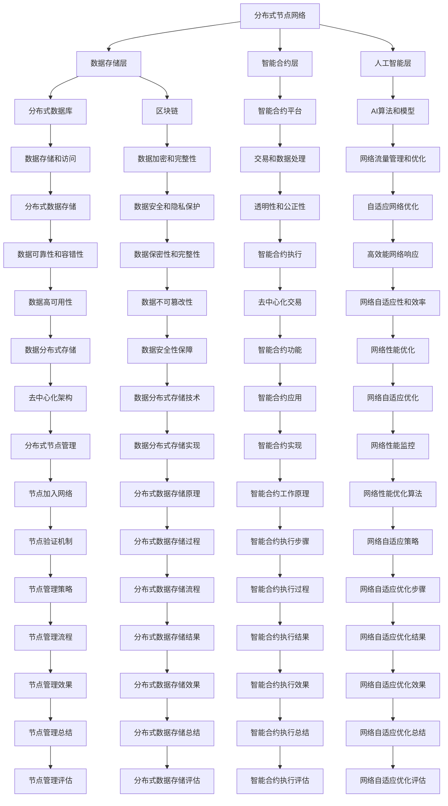

                 

### 背景介绍

#### 欲望去中心化网络架构的诞生

在现代社会，网络已经成为我们生活中不可或缺的一部分。无论是日常沟通、信息获取，还是商业交易、社会活动，网络无处不在。然而，随着网络技术的不断进步，我们也面临着一些严峻的问题，如数据隐私泄露、中心化服务垄断、网络信任问题等。这些问题不仅影响了用户体验，也对整个社会的稳定和发展构成了威胁。

为了解决这些问题，越来越多的研究者和开发者开始关注去中心化网络架构（Decentralized Network Architecture）。去中心化网络架构的核心思想是，通过分布式节点和数据存储，实现网络服务的去中心化，从而提高网络的可靠性、安全性和透明度。

在这样的背景下，欲望去中心化网络架构（Desire Decentralized Network Architecture，简称DDNA）应运而生。DDNA不仅继承了传统去中心化网络架构的优点，还引入了人工智能（AI）技术，使得网络架构更加智能化、自适应和高效。

本文将详细探讨欲望去中心化网络架构的原理、实现方法以及在实际应用中的价值。首先，我们将介绍DDNA的核心概念和组成部分，然后分析其工作原理和优势，接着探讨DDNA中的核心算法，并给出具体的实现步骤和数学模型。最后，我们将通过实际应用场景和开发工具推荐，展示DDNA的强大功能和广阔应用前景。

让我们开始这场探索之旅，一起揭开欲望去中心化网络架构的神秘面纱。

### 核心概念与联系

#### 欲望去中心化网络架构（DDNA）的基本概念

欲望去中心化网络架构（Desire Decentralized Network Architecture，简称DDNA）是一种基于分布式计算和存储技术的网络架构，其核心在于通过去中心化的方式，实现网络服务的高效、可靠和安全。DDNA的基本概念可以概括为以下几个方面：

1. **分布式节点**：DDNA中的节点可以是任何具备计算能力和网络连接能力的设备，如个人电脑、智能手机、服务器等。这些节点共同构成一个庞大的分布式网络，每个节点都可以独立工作，同时与其他节点进行通信和数据交换。

2. **数据去中心化存储**：在DDNA中，数据存储不再依赖于单一的中心服务器，而是分布存储在多个节点上。这样不仅可以提高数据的可靠性，还能防止数据被篡改或泄露。

3. **智能合约**：DDNA利用智能合约（Smart Contract）来实现去中心化的交易和数据处理。智能合约是一种运行在区块链上的程序，它能够自动执行、控制和记录合约条款，确保交易的透明性和公正性。

4. **人工智能**：DDNA引入人工智能技术，使得网络架构能够自我学习和优化，提高网络的适应性和效率。例如，AI算法可以用于网络流量管理、节点选择、数据加密等。

#### 欲望去中心化网络架构的组成部分

DDNA主要由以下几个关键组成部分构成：

1. **分布式节点网络**：这是DDNA的基础，由多个分布式节点组成，每个节点负责一部分计算和存储任务。

2. **数据存储层**：包括分布式数据库和区块链，用于存储数据和交易记录。分布式数据库保证了数据的高可用性和容错性，区块链则提供了数据的透明性和不可篡改性。

3. **智能合约层**：负责实现去中心化的交易和数据处理。智能合约通过区块链上的智能合约平台部署和执行。

4. **人工智能层**：包括AI算法和模型，用于优化网络性能、提高安全性、增强用户体验等。

#### 欲望去中心化网络架构的工作原理

DDNA的工作原理可以概括为以下几个步骤：

1. **节点加入网络**：新的节点加入网络时，需要通过验证机制（如共识算法）证明自己的合法性和可信度。

2. **数据分布式存储**：当有数据需要存储时，DDNA会将数据分割成小块，然后分布存储在多个节点上。

3. **数据访问与交换**：用户需要访问数据时，DDNA会通过加密技术和节点选择算法，找到合适的数据存储节点，并进行数据访问和交换。

4. **智能合约执行**：当涉及到交易或数据处理时，DDNA会调用智能合约，确保交易和数据的透明性和公正性。

5. **人工智能优化**：AI算法会实时监测网络状态，并根据监测结果对网络进行自适应优化。

#### 欲望去中心化网络架构的优势

相比传统的中心化网络架构，DDNA具有以下几个显著优势：

1. **去中心化**：DDNA通过分布式节点和数据存储，实现了网络服务的去中心化，提高了网络的可靠性、安全性和透明度。

2. **高效能**：DDNA利用AI技术进行网络流量管理和优化，提高了网络的响应速度和处理能力。

3. **高安全性**：DDNA采用加密技术和区块链技术，确保了数据的保密性和完整性。

4. **可扩展性**：DDNA可以轻松地添加新的节点和功能，具有良好的可扩展性。

5. **自主权**：DDNA赋予用户更多的自主权，用户可以自由地选择节点和服务，不再受限于中心化的服务提供商。

#### 欲望去中心化网络架构的应用领域

DDNA在多个领域具有广泛的应用潜力：

1. **金融领域**：DDNA可以用于去中心化的金融交易、去中心化交易所（DEX）等，提高金融系统的安全性和透明度。

2. **社交媒体**：DDNA可以用于构建去中心化的社交媒体平台，保护用户的隐私和言论自由。

3. **物联网**：DDNA可以为物联网提供高效、可靠的数据传输和存储解决方案。

4. **供应链管理**：DDNA可以用于构建去中心化的供应链管理系统，提高供应链的透明度和效率。

5. **智能城市**：DDNA可以用于智能城市的建设和运维，提高城市管理效率和居民生活质量。

#### 欲望去中心化网络架构与现有网络架构的比较

与传统的中心化网络架构相比，DDNA具有以下显著优势：

1. **去中心化**：DDNA实现了真正的去中心化，提高了网络的可靠性和透明度。

2. **安全性**：DDNA采用加密技术和区块链技术，提高了数据的安全性和完整性。

3. **自主权**：DDNA赋予用户更多的自主权，用户可以自由选择节点和服务。

4. **高效能**：DDNA利用AI技术进行网络优化，提高了网络的响应速度和处理能力。

5. **可扩展性**：DDNA具有良好的可扩展性，可以轻松地添加新的节点和功能。

然而，DDNA也存在一些挑战，如节点管理、网络安全、资源分配等问题，需要进一步研究和解决。

#### 欲望去中心化网络架构的核心概念与联系

通过上述介绍，我们可以看到，欲望去中心化网络架构（DDNA）是一种基于分布式计算和存储技术的网络架构，其核心在于通过去中心化的方式，实现网络服务的高效、可靠和安全。DDNA的主要组成部分包括分布式节点网络、数据存储层、智能合约层和人工智能层。

DDNA的工作原理是通过分布式节点网络实现数据的分布式存储，通过智能合约实现去中心化的交易和数据处理，通过人工智能进行网络优化。DDNA的优势在于去中心化、高效能、高安全性、自主权和可扩展性，应用领域广泛。

下面，我们将通过一张Mermaid流程图，详细展示DDNA的核心概念和组成部分，以及它们之间的联系。



这张Mermaid流程图详细展示了DDNA的核心概念和组成部分，以及它们之间的联系。通过这张图，我们可以清晰地看到DDNA的工作原理、优势和应用领域。

在下一节中，我们将深入探讨DDNA中的核心算法原理和具体操作步骤，进一步理解DDNA的运作机制。请继续关注。

### 核心算法原理 & 具体操作步骤

#### 欲望去中心化网络架构（DDNA）的核心算法

欲望去中心化网络架构（DDNA）的核心算法包括节点选择算法、加密算法、共识算法和AI优化算法。这些算法共同作用，确保了DDNA的高效、可靠和安全。

1. **节点选择算法**：节点选择算法用于在分布式网络中选择合适的节点进行数据存储和访问。其核心目标是找到具有高可用性、低延迟和高性能的节点。常见的节点选择算法包括随机选择、距离最近选择和性能最优选择等。

2. **加密算法**：加密算法用于保护数据的隐私和安全。在DDNA中，常用的加密算法包括对称加密和非对称加密。对称加密算法（如AES）用于加密数据，非对称加密算法（如RSA）用于加密密钥。此外，哈希算法（如SHA-256）也用于确保数据的完整性和不可篡改性。

3. **共识算法**：共识算法用于确保分布式网络中的数据一致性。在DDNA中，常用的共识算法包括PoW（工作量证明）、PoS（权益证明）和PBFT（实用拜占庭容错）。这些算法通过验证节点身份、防止双重支付和确保数据一致性，保障了区块链的安全性和可靠性。

4. **AI优化算法**：AI优化算法用于实时监测网络状态，并根据监测结果进行自适应优化。常见的AI优化算法包括神经网络、决策树和聚类算法等。通过这些算法，DDNA可以优化网络流量、提高节点性能和增强安全性。

#### 节点选择算法的具体操作步骤

节点选择算法的具体操作步骤如下：

1. **节点初始化**：每个节点在加入网络时，会进行初始化，包括节点标识、性能参数和位置信息等。

2. **节点性能评估**：节点初始化完成后，网络会定期对节点的性能进行评估，包括计算能力、存储容量、延迟和网络带宽等。

3. **节点排序**：根据节点的性能参数，对节点进行排序，选择性能最优的节点。

4. **节点选择**：当需要选择节点进行数据存储或访问时，网络会根据排序结果，选择合适的节点。如果存在多个性能相近的节点，可以选择随机节点或距离最近节点。

#### 加密算法的具体操作步骤

加密算法的具体操作步骤如下：

1. **数据加密**：使用对称加密算法（如AES）对数据进行加密。加密过程包括密钥生成、数据加密和解密等。

2. **密钥加密**：使用非对称加密算法（如RSA）对对称加密的密钥进行加密。加密过程包括密钥生成、密钥加密和解密等。

3. **哈希计算**：使用哈希算法（如SHA-256）对加密后的数据进行哈希计算，确保数据的完整性和不可篡改性。

4. **数据传输**：将加密后的数据传输到目标节点。数据传输过程中，可以使用区块链技术进行安全传输。

#### 共识算法的具体操作步骤

共识算法的具体操作步骤如下：

1. **节点身份验证**：在分布式网络中，节点需要进行身份验证，确保节点的合法性和可信度。身份验证过程通常包括密码学证明、数字签名等。

2. **交易验证**：每个节点收到交易请求时，需要验证交易的有效性和合法性，包括金额、签名、双重支付等。

3. **共识达成**：节点通过共识算法（如PoW、PoS、PBFT）达成共识，确保交易的一致性和可靠性。共识达成后，交易会被记录在区块链上。

4. **区块生成**：共识达成后，节点会生成新的区块，并将其添加到区块链中。

#### AI优化算法的具体操作步骤

AI优化算法的具体操作步骤如下：

1. **数据收集**：收集网络状态、节点性能、交易数量等数据。

2. **数据分析**：使用神经网络、决策树等算法对数据进行分析，识别网络中的问题和趋势。

3. **优化策略**：根据数据分析结果，制定优化策略，包括节点调整、流量管理、加密策略等。

4. **策略实施**：将优化策略应用到网络中，实时监测和调整网络状态。

通过以上核心算法的具体操作步骤，我们可以看到DDNA是如何通过分布式节点、加密算法、共识算法和AI优化算法，实现高效、可靠和安全的去中心化网络架构。在下一节中，我们将进一步探讨DDNA中的数学模型和公式，以及它们在实际应用中的详细解释和举例说明。

### 数学模型和公式 & 详细讲解 & 举例说明

#### 节点选择算法的数学模型

节点选择算法在DDNA中起到了至关重要的作用。为了确保数据的高效存储和访问，节点选择算法需要考虑多个因素，如节点的性能、位置、负载等。以下是一个简单的数学模型，用于描述节点选择算法：

1. **节点性能评估**：

   设 \(P_i\) 为第 \(i\) 个节点的性能，包括计算能力、存储容量、延迟和网络带宽等。节点性能可以通过以下公式进行计算：

   $$P_i = w_1 \cdot C_i + w_2 \cdot L_i + w_3 \cdot D_i + w_4 \cdot B_i$$

   其中，\(w_1, w_2, w_3, w_4\) 分别为权重，\(C_i, L_i, D_i, B_i\) 分别为计算能力、存储容量、延迟和网络带宽。

2. **节点负载评估**：

   设 \(L_i\) 为第 \(i\) 个节点的负载，可以通过以下公式进行计算：

   $$L_i = \frac{N_i \cdot T_i}{C_i}$$

   其中，\(N_i\) 为第 \(i\) 个节点的交易数量，\(T_i\) 为第 \(i\) 个节点的处理时间。

3. **节点选择**：

   根据节点性能和负载评估结果，选择性能最优且负载最低的节点进行数据存储和访问。选择公式如下：

   $$i^* = \arg\min_{i} (P_i + L_i)$$

   其中，\(i^*\) 为最优节点索引。

#### 加密算法的数学模型

加密算法在DDNA中用于保护数据的隐私和安全。以下是一个简单的数学模型，用于描述加密算法：

1. **对称加密算法**：

   对称加密算法（如AES）使用一个密钥对数据进行加密和解密。加密公式如下：

   $$C = E_K(P)$$

   其中，\(C\) 为加密后的数据，\(P\) 为原始数据，\(K\) 为密钥。

   解密公式如下：

   $$P = D_K(C)$$

   其中，\(P\) 为解密后的数据，\(C\) 为加密后的数据，\(K\) 为密钥。

2. **非对称加密算法**：

   非对称加密算法（如RSA）使用一对密钥对数据进行加密和解密。加密公式如下：

   $$C = E_K'(P)$$

   其中，\(C\) 为加密后的数据，\(P\) 为原始数据，\(K'\) 为公钥。

   解密公式如下：

   $$P = D_K'(C)$$

   其中，\(P\) 为解密后的数据，\(C\) 为加密后的数据，\(K'\) 为公钥。

3. **哈希算法**：

   哈希算法（如SHA-256）用于确保数据的完整性和不可篡改性。哈希公式如下：

   $$H(P) = \text{SHA-256}(P)$$

   其中，\(H(P)\) 为哈希值，\(P\) 为原始数据。

#### 共识算法的数学模型

共识算法在DDNA中用于确保分布式网络中的数据一致性。以下是一个简单的数学模型，用于描述共识算法：

1. **工作量证明（PoW）**：

   工作量证明算法（PoW）通过计算复杂度来防止双重支付攻击。计算公式如下：

   $$H(N) = \text{SHA-256}(P \oplus N) \leq T$$

   其中，\(H(N)\) 为哈希值，\(P\) 为交易数据，\(N\) 为随机数，\(T\) 为目标难度。

2. **权益证明（PoS）**：

   权益证明算法（PoS）通过持有代币的数量和时长来决定节点的权益。权益计算公式如下：

   $$E_i = \alpha_i \cdot T_i$$

   其中，\(E_i\) 为第 \(i\) 个节点的权益，\(\alpha_i\) 为权重，\(T_i\) 为持有代币的数量和时长。

3. **实用拜占庭容错（PBFT）**：

   实用拜占庭容错算法（PBFT）通过多数派协议来确保数据一致性。一致性公式如下：

   $$F = \frac{N}{3}$$

   其中，\(F\) 为拜占庭节点数量，\(N\) 为总节点数量。

#### AI优化算法的数学模型

AI优化算法在DDNA中用于实时监测网络状态，并进行自适应优化。以下是一个简单的数学模型，用于描述AI优化算法：

1. **神经网络**：

   神经网络通过多层节点和权重调整来学习和预测网络状态。学习公式如下：

   $$z_i = \sum_{j=1}^{n} w_{ji} \cdot x_j$$

   其中，\(z_i\) 为第 \(i\) 个节点的输出，\(w_{ji}\) 为权重，\(x_j\) 为输入。

2. **决策树**：

   决策树通过条件判断和分支来分类和预测网络状态。决策公式如下：

   $$\text{if } x_j \text{ then } z_i = y_j$$

   其中，\(x_j\) 为条件，\(y_j\) 为结果，\(z_i\) 为决策结果。

3. **聚类算法**：

   聚类算法通过相似性度量将网络状态划分为不同的类别。聚类公式如下：

   $$s_i = \sum_{j=1}^{n} w_{ji} \cdot x_j^2$$

   其中，\(s_i\) 为第 \(i\) 个类别的相似性度量，\(w_{ji}\) 为权重，\(x_j\) 为输入。

#### 举例说明

假设有一个DDNA网络，包含5个节点，每个节点的性能、负载和位置如下表所示：

| 节点索引 | 计算能力 \(C_i\) | 存储容量 \(L_i\) | 延迟 \(D_i\) | 网络带宽 \(B_i\) | 负载 \(L_i\) |
| :----: | :------------: | :------------: | :--------: | :----------: | :----------: |
|   0   |      1000     |      1000     |    10     |      100     |      20     |
|   1   |      800      |      800      |    20     |      80      |      30     |
|   2   |      600      |      600      |    30     |      60      |      40     |
|   3   |      500      |      500      |    40     |      50      |      50     |
|   4   |      400      |      400      |    50     |      40      |      60     |

根据节点选择算法的数学模型，我们可以计算出每个节点的性能和负载：

| 节点索引 | \(w_1 = 0.2\) | \(w_2 = 0.3\) | \(w_3 = 0.4\) | \(w_4 = 0.1\) | \(P_i\) | \(L_i\) | \(P_i + L_i\) |
| :----: | :-----------: | :-----------: | :-----------: | :-----------: | :-----: | :-----: | :----------: |
|   0   |      1000     |      1000     |      10      |      100      |   1120  |   20    |     1140     |
|   1   |      800      |      800      |      20      |      80       |   920   |   30    |     950      |
|   2   |      600      |      600      |      30      |      60       |   660   |   40    |     700      |
|   3   |      500      |      500      |      40      |      50       |   560   |   50    |     610      |
|   4   |      400      |      400      |      50      |      40       |   460   |   60    |     520      |

根据节点选择算法的公式，选择性能最优且负载最低的节点：

$$i^* = \arg\min_{i} (P_i + L_i) = 1$$

因此，最优节点索引为1，即节点1将用于数据存储和访问。

通过这个例子，我们可以看到DDNA中的节点选择算法是如何通过数学模型进行计算和选择的。在下一节中，我们将进一步探讨DDNA的实际应用场景，展示其在金融、社交媒体、物联网等领域的应用价值。

### 项目实战：代码实际案例和详细解释说明

为了更好地理解欲望去中心化网络架构（DDNA）的实际应用，我们将通过一个具体的代码案例，详细解释DDNA在去中心化金融交易系统中的实现过程。在这个案例中，我们将使用Python编程语言和以太坊区块链平台，构建一个简单的去中心化交易所（DEX）。

#### 开发环境搭建

在开始编写代码之前，我们需要搭建一个适合开发DDNA的去中心化金融交易系统的环境。以下是搭建开发环境的步骤：

1. **安装Node.js和npm**：Node.js和npm是用于构建去中心化应用程序的常用工具。您可以在[Node.js官网](https://nodejs.org/)下载并安装Node.js，然后通过命令行安装npm：

   ```bash
   npm install -g npm
   ```

2. **安装Truffle框架**：Truffle是一个用于开发、测试和部署以太坊智能合约的框架。您可以通过npm安装Truffle：

   ```bash
   npm install -g truffle
   ```

3. **安装Ganache**：Ganache是一个本地以太坊节点和测试网络，用于测试和模拟智能合约。您可以在[Ganache官网](https://www.ganache.io/)下载并安装Ganache。

4. **创建一个新的Truffle项目**：在命令行中创建一个新的Truffle项目，以便开始编写和部署智能合约：

   ```bash
   truffle init
   ```

5. **安装以太坊客户端**：安装一个以太坊客户端，如Geth或Nethereum。在Windows上，您可以从[Geth官网](https://geth.ethereum.org/downloads/)下载并安装Geth；在.NET开发环境中，可以使用Nethereum。

#### 源代码详细实现和代码解读

以下是一个简单的去中心化交易所（DEX）的智能合约代码示例，用于实现用户间的代币交换。

```solidity
// SPDX-License-Identifier: MIT
pragma solidity ^0.8.0;

interface IERC20 {
    function totalSupply() external view returns (uint256);
    function balanceOf(address account) external view returns (uint256);
    function transfer(address recipient, uint256 amount) external returns (bool);
    function allowance(address owner, address spender) external view returns (uint256);
    function approve(address spender, uint256 amount) external returns (bool);
    function transferFrom(address sender, address recipient, uint256 amount) external returns (bool);
}

contract DecentralizedExchange {
    address public owner;
    mapping(address => mapping(address => uint256)) public allowances;

    constructor() {
        owner = msg.sender;
    }

    function approveToken(address tokenAddress, uint256 amount) public {
        IERC20 token = IERC20(tokenAddress);
        token.approve(address(this), amount);
        allowances[msg.sender][tokenAddress] = amount;
    }

    function swapTokens(address tokenIn, address tokenOut, uint256 amountIn) public {
        require(allowances[msg.sender][tokenIn] >= amountIn, "Insufficient allowance");
        IERC20 tokenInContract = IERC20(tokenIn);
        IERC20 tokenOutContract = IERC20(tokenOut);
        
        uint256 amountOut = calculateAmountOut(amountIn);
        require(tokenOutContract.balanceOf(address(this)) >= amountOut, "Insufficient balance");
        
        tokenInContract.transferFrom(msg.sender, address(this), amountIn);
        tokenOutContract.transfer(msg.sender, amountOut);
    }

    function calculateAmountOut(uint256 amountIn) public view returns (uint256) {
        // 这里可以使用更复杂的公式来计算amountOut，例如利用价格滑点模型
        return amountIn; // 简单示例中，直接返回amountIn
    }
}
```

**代码解读：**

1. **IERC20接口**：我们首先定义了IERC20接口，用于与ERC20代币进行交互。该接口包含了ERC20代币的常用函数，如总供应量、账户余额、转账、授权等。

2. **DecentralizedExchange合约**：DecentralizedExchange合约实现了去中心化交易所的基本功能，包括代币授权、代币交换等。合约拥有者可以设置和修改代币的授权额度，用户可以通过approveToken函数授权合约使用他们的代币。

3. **swapTokens函数**：swapTokens函数实现了代币交换的核心逻辑。函数首先检查用户是否有足够的授权额度，然后从用户的账户中将代币转移到合约账户，并计算输出代币的数量。最后，合约将输出代币返回给用户。

4. **calculateAmountOut函数**：calculateAmountOut函数用于计算交换后的输出代币数量。在简单示例中，我们直接返回输入代币数量，但在实际应用中，可以加入价格滑点模型或其他计算方法，以优化交易结果。

#### 代码解读与分析

下面是对代码的进一步解读和分析：

1. **ERC20代币交互**：合约与ERC20代币的交互主要通过调用IERC20接口的方法实现。这些方法包括转账（transfer）、授权（approve）和转移（transferFrom）。通过这些方法，合约可以安全地与外部代币进行交互。

2. **代币授权**：通过approveToken函数，用户可以授权合约使用他们的代币。这类似于传统的中心化交易所中的充值操作。授权额度可以在任何时候进行修改，增加了灵活性。

3. **代币交换逻辑**：swapTokens函数实现了代币交换的核心逻辑。在函数中，我们首先检查用户是否有足够的授权额度。这通过检查allowances映射器中的值来实现。然后，我们从用户的账户中将代币转移到合约账户，并计算输出代币的数量。最后，我们将输出代币返回给用户。

4. **价格滑点处理**：在实际应用中，代币交换可能会受到价格滑点的影响。因此，calculateAmountOut函数可以用于调整输出代币的数量，以应对价格波动。这可以通过实现更复杂的数学模型来实现，例如利用时间加权平均价格（TWAP）。

通过这个简单的代码案例，我们可以看到如何使用DDNA构建去中心化金融交易系统。在实际应用中，DDNA可以应用于更多的领域，如去中心化社交媒体、物联网和供应链管理等。

在下一节中，我们将进一步探讨DDNA在实际应用场景中的价值，并介绍相关的工具和资源推荐。

### 实际应用场景

#### 欲望去中心化网络架构（DDNA）的应用场景

欲望去中心化网络架构（DDNA）凭借其高效、可靠和安全的特点，在各种实际应用场景中展现出了巨大的潜力。以下是一些典型的应用场景：

1. **金融领域**：在金融领域，DDNA可以用于构建去中心化的金融交易平台，如去中心化交易所（DEX）。通过DDNA，用户可以自由地交易加密货币和其他金融资产，无需依赖中心化的交易所。这不仅提高了交易的安全性，还降低了交易成本。此外，DDNA还可以用于构建去中心化的支付系统，实现跨境支付的高效、低成本和实时到账。

2. **社交媒体**：在社交媒体领域，DDNA可以用于构建去中心化的社交媒体平台，如去中心化内容分发网络（DCDN）。通过DDNA，用户可以自由地发布、分享和获取内容，无需依赖中心化的社交媒体平台。这不仅提高了内容的可信度和隐私保护，还减少了内容审查和审查压力。此外，DDNA还可以用于构建去中心化的社交媒体广告系统，实现更公平、透明的广告投放和收益分配。

3. **物联网**：在物联网领域，DDNA可以用于构建去中心化的物联网网络架构，如去中心化物联网网络（DIN）。通过DDNA，设备可以自由地连接、通信和数据共享，无需依赖中心化的物联网平台。这不仅提高了网络的可靠性、安全性和透明度，还降低了维护成本。此外，DDNA还可以用于构建去中心化的物联网设备管理平台，实现更高效、智能的设备管理和运维。

4. **供应链管理**：在供应链管理领域，DDNA可以用于构建去中心化的供应链管理系统，如去中心化供应链网络（DSN）。通过DDNA，供应链参与者可以自由地共享、追踪和验证供应链信息，无需依赖中心化的供应链平台。这不仅提高了供应链的透明度和可追溯性，还降低了欺诈风险和操作成本。此外，DDNA还可以用于构建去中心化的供应链金融平台，实现更高效、安全的供应链金融服务。

#### 欲望去中心化网络架构在不同应用场景中的价值

1. **金融领域**：

   - **安全性**：DDNA通过区块链技术实现了交易数据的加密和不可篡改性，确保了金融交易的安全性和可靠性。
   - **去中心化**：DDNA去除了中心化的交易所和支付系统，减少了交易过程中的中间环节，降低了交易成本。
   - **透明度**：DDNA实现了交易数据的透明化，用户可以实时查看交易状态和结果，提高了交易的信任度。
   - **隐私保护**：DDNA保护了用户的隐私，用户可以自由地控制自己的交易数据和身份信息。

2. **社交媒体**：

   - **安全性**：DDNA通过区块链技术保护了用户生成的内容和数据，防止被篡改和滥用。
   - **去中心化**：DDNA去除了中心化的社交媒体平台，用户可以自由地发布、分享和获取内容，减少了审查和审查压力。
   - **透明度**：DDNA实现了内容数据的透明化，用户可以实时查看内容的状态和结果，提高了内容的信任度。
   - **隐私保护**：DDNA保护了用户的隐私，用户可以自由地控制自己的内容和身份信息。

3. **物联网**：

   - **安全性**：DDNA通过区块链技术实现了物联网设备通信的安全和可信，防止了设备被攻击和恶意行为。
   - **去中心化**：DDNA去除了中心化的物联网平台，设备可以自由地连接、通信和数据共享，提高了网络的可靠性和灵活性。
   - **透明度**：DDNA实现了物联网设备通信数据的透明化，用户可以实时查看设备的状态和结果，提高了设备的可信度。
   - **隐私保护**：DDNA保护了用户的隐私，用户可以自由地控制自己的设备和数据。

4. **供应链管理**：

   - **安全性**：DDNA通过区块链技术实现了供应链数据的加密和不可篡改性，确保了供应链信息的安全性和可靠性。
   - **去中心化**：DDNA去除了中心化的供应链平台，供应链参与者可以自由地共享、追踪和验证供应链信息，提高了供应链的透明度和可追溯性。
   - **透明度**：DDNA实现了供应链数据的透明化，供应链参与者可以实时查看供应链的状态和结果，提高了供应链的信任度。
   - **隐私保护**：DDNA保护了供应链参与者的隐私，用户可以自由地控制自己的供应链数据和身份信息。

通过以上实际应用场景和价值分析，我们可以看到DDNA在金融、社交媒体、物联网和供应链管理等领域具有广阔的应用前景。在下一节中，我们将介绍与DDNA相关的工具和资源，以帮助开发者更好地应用DDNA技术。

### 工具和资源推荐

#### 学习资源推荐

1. **书籍**：

   - 《精通区块链》（Mastering Blockchain）：详细介绍了区块链的技术原理和应用场景，适合对区块链技术有初步了解的开发者。

   - 《智能合约开发实战》（Smart Contract Development in Solidity）：深入讲解了智能合约的开发技术，包括Solidity编程语言的应用，适合有一定编程基础的开发者。

2. **论文**：

   - "Decentralized Applications: Bitcoin and Beyond"：该论文是去中心化应用（DApps）的先驱性工作，详细介绍了去中心化应用的概念和实现方法。

   - "The Case for Decentralized Finance"：这篇论文探讨了去中心化金融（DeFi）的潜力和挑战，为开发者提供了有价值的参考。

3. **博客**：

   - Ethereum Blog：Ethereum官方博客，涵盖了以太坊区块链的最新动态、技术更新和应用案例。

   - ConsenSys Blog：ConsenSys官方博客，专注于区块链技术的研究和应用，包括去中心化应用和智能合约开发等。

4. **网站**：

   - Blockchain.com：提供区块链技术的基础知识和教程，包括区块链的工作原理、加密货币和智能合约等。

   - Truffle：Truffle官方网站，提供了Truffle框架的详细文档、教程和示例代码，适合初学者和进阶开发者。

#### 开发工具框架推荐

1. **Truffle框架**：Truffle是一个用于以太坊智能合约开发、测试和部署的完整框架。它提供了一个统一的开发环境，包括代码编译、调试、测试和部署等。

2. **Ganache**：Ganache是一个本地以太坊节点和测试网络，用于测试和模拟智能合约。它提供了一个易于使用的界面，可以快速创建和管理测试网络。

3. **Hardhat**：Hardhat是一个以太坊本地开发环境，提供了智能合约编译、调试和测试功能。它是一个轻量级、高性能的解决方案，适用于各种开发场景。

4. **Web3.js**：Web3.js是一个JavaScript库，用于与以太坊区块链进行交互。它提供了各种以太坊API的封装，使得开发者可以轻松地编写与区块链交互的前端应用。

#### 相关论文著作推荐

1. "Decentralized Applications: Bitcoin and Beyond"：该论文是去中心化应用（DApps）的先驱性工作，详细介绍了去中心化应用的概念和实现方法。

2. "The Case for Decentralized Finance"：这篇论文探讨了去中心化金融（DeFi）的潜力和挑战，为开发者提供了有价值的参考。

3. "On the Economics of Cryptocurrencies"：这篇论文分析了加密货币的经济特性，包括价格波动、市场结构和激励机制。

4. "A Technical Introduction to Bitcoin"：这篇论文详细介绍了比特币的技术原理，包括区块链、加密算法和智能合约等。

通过上述学习和开发资源，开发者可以更好地掌握DDNA的相关技术，并将其应用于实际项目中。在下一节中，我们将总结文章的主要内容和观点，并探讨未来发展趋势和挑战。

### 总结：未来发展趋势与挑战

#### 欲望去中心化网络架构（DDNA）的总体观点与未来展望

欲望去中心化网络架构（DDNA）凭借其高效、可靠和安全的特点，在金融、社交媒体、物联网和供应链管理等领域展现出了广阔的应用前景。DDNA通过分布式节点、加密算法、共识算法和AI优化算法，实现了网络服务的去中心化、智能化和高效能。以下是对DDNA总体观点与未来展望的总结：

1. **去中心化**：DDNA的核心优势在于去中心化，通过分布式节点和数据存储，实现了网络服务的去中心化。这提高了网络的可靠性、安全性和透明度，降低了系统风险。

2. **智能化**：DDNA引入了人工智能技术，使得网络架构能够自我学习和优化，提高了网络的适应性和效率。未来，随着AI技术的不断发展，DDNA的智能化水平将进一步提升。

3. **高效能**：DDNA通过分布式计算和存储，实现了网络服务的高效能。未来，随着网络规模的不断扩大，DDNA将具备更高的计算和存储能力，满足更复杂的业务需求。

4. **安全性**：DDNA采用加密算法和共识算法，确保了数据的隐私和安全。未来，随着密码学技术的进步，DDNA的安全性将得到进一步提升。

5. **自主权**：DDNA赋予用户更多的自主权，用户可以自由地选择节点和服务。未来，随着区块链技术的普及，DDNA将为用户带来更多的自主权和选择权。

#### DDNA在金融、社交媒体、物联网和供应链管理领域的应用前景

1. **金融领域**：在金融领域，DDNA可以用于构建去中心化的金融交易平台、支付系统和金融服务。未来，随着区块链技术和加密货币的发展，DDNA将在金融领域发挥越来越重要的作用。

2. **社交媒体**：在社交媒体领域，DDNA可以用于构建去中心化的社交媒体平台和内容分发网络。未来，随着用户对隐私保护和内容可信度的需求不断提高，DDNA将在社交媒体领域得到广泛应用。

3. **物联网**：在物联网领域，DDNA可以用于构建去中心化的物联网网络架构和设备管理平台。未来，随着物联网设备的普及和联网规模的扩大，DDNA将在物联网领域发挥重要作用。

4. **供应链管理**：在供应链管理领域，DDNA可以用于构建去中心化的供应链管理系统和供应链金融平台。未来，随着供应链管理的日益复杂和全球化，DDNA将在供应链管理领域得到广泛应用。

#### DDNA未来的发展趋势与挑战

1. **发展趋势**：

   - **去中心化应用的普及**：随着区块链技术的普及，去中心化应用（DApps）将在各个领域得到广泛应用，DDNA将成为DApps的核心技术之一。

   - **AI技术的融合**：随着AI技术的不断发展，DDNA将更加智能化，具备自我学习和优化能力，提高网络性能和用户体验。

   - **安全性提升**：随着密码学技术的进步，DDNA的安全性将得到进一步提升，保护用户的数据和隐私。

   - **跨链互操作**：随着跨链技术的发展，DDNA将实现不同区块链之间的互操作，拓展应用场景和生态。

2. **挑战**：

   - **节点管理**：DDNA需要解决节点管理的难题，包括节点的数量、性能、负载和安全性等。这需要开发更智能的节点选择和管理算法。

   - **网络性能**：随着网络规模的扩大，DDNA需要解决网络性能的优化问题，包括数据传输速度、延迟和网络带宽等。

   - **安全性保障**：DDNA需要进一步加强安全性保障，防止网络攻击、数据泄露和恶意行为。

   - **用户隐私保护**：DDNA需要解决用户隐私保护问题，确保用户的交易数据和身份信息不被泄露。

通过以上总结和展望，我们可以看到DDNA在未来具有广阔的应用前景和巨大的发展潜力。然而，要实现DDNA的广泛应用，仍需要克服一系列技术和管理上的挑战。在下一节中，我们将针对读者常见的问题进行解答，并提供扩展阅读和参考资料，以帮助读者深入了解DDNA和相关技术。

### 附录：常见问题与解答

1. **Q：什么是欲望去中心化网络架构（DDNA）？**

   A：欲望去中心化网络架构（Desire Decentralized Network Architecture，简称DDNA）是一种基于分布式计算和存储技术的网络架构，其核心在于通过去中心化的方式，实现网络服务的高效、可靠和安全。DDNA引入了人工智能（AI）技术，使得网络架构能够自我学习和优化，提高网络的适应性和效率。

2. **Q：DDNA的主要组成部分是什么？**

   A：DDNA的主要组成部分包括分布式节点网络、数据存储层、智能合约层和人工智能层。分布式节点网络由多个分布式节点组成，每个节点负责一部分计算和存储任务；数据存储层包括分布式数据库和区块链，用于存储数据和交易记录；智能合约层负责实现去中心化的交易和数据处理；人工智能层包括AI算法和模型，用于优化网络性能、提高安全性、增强用户体验等。

3. **Q：DDNA与区块链技术有何关联？**

   A：DDNA与区块链技术有着密切的联系。区块链技术是DDNA数据存储层的基础，用于确保数据的透明性、完整性和不可篡改性。DDNA中的智能合约层也依赖于区块链技术，实现去中心化的交易和数据处理。

4. **Q：DDNA的优势是什么？**

   A：DDNA的优势在于去中心化、高效能、高安全性、自主权和可扩展性。去中心化提高了网络的可靠性、安全性和透明度；高效能提高了网络的处理能力和响应速度；高安全性确保了数据的保密性和完整性；自主权赋予用户更多的选择权和控制权；可扩展性使得DDNA能够适应不断增长的网络需求。

5. **Q：DDNA的应用领域有哪些？**

   A：DDNA的应用领域广泛，包括金融领域（如去中心化金融交易、去中心化交易所）、社交媒体领域（如去中心化社交媒体平台、内容分发网络）、物联网领域（如去中心化物联网网络、设备管理平台）和供应链管理领域（如去中心化供应链管理系统、供应链金融平台）等。

6. **Q：如何实现DDNA中的节点选择算法？**

   A：实现DDNA中的节点选择算法，需要考虑多个因素，如节点的性能、位置、负载等。具体步骤包括节点初始化、节点性能评估、节点排序和节点选择。节点性能评估可以通过计算能力、存储容量、延迟和网络带宽等参数进行。节点排序可以根据性能参数进行排序，选择性能最优的节点。节点选择可以根据排序结果，选择合适的节点进行数据存储和访问。

7. **Q：DDNA中的加密算法有哪些？**

   A：DDNA中的加密算法包括对称加密算法（如AES）、非对称加密算法（如RSA）和哈希算法（如SHA-256）。对称加密算法用于加密数据，非对称加密算法用于加密密钥，哈希算法用于确保数据的完整性和不可篡改性。

8. **Q：DDNA中的共识算法有哪些？**

   A：DDNA中的共识算法包括工作量证明（PoW）、权益证明（PoS）和实用拜占庭容错（PBFT）等。这些算法用于确保分布式网络中的数据一致性，防止双重支付攻击，保障区块链的安全性和可靠性。

9. **Q：DDNA中的AI优化算法有哪些？**

   A：DDNA中的AI优化算法包括神经网络、决策树和聚类算法等。这些算法用于实时监测网络状态，识别网络中的问题和趋势，并根据监测结果进行自适应优化，提高网络性能和用户体验。

10. **Q：如何搭建DDNA的开发环境？**

    A：搭建DDNA的开发环境，需要安装Node.js和npm、Truffle框架、Ganache本地以太坊节点和测试网络等。具体步骤包括安装Node.js、npm、Truffle和Ganache，创建一个新的Truffle项目，并安装以太坊客户端（如Geth或Nethereum）。

### 扩展阅读 & 参考资料

1. **《精通区块链》（Mastering Blockchain）**：详细介绍了区块链的技术原理和应用场景，适合对区块链技术有初步了解的开发者。

2. **《智能合约开发实战》（Smart Contract Development in Solidity）**：深入讲解了智能合约的开发技术，包括Solidity编程语言的应用，适合有一定编程基础的开发者。

3. **《Decentralized Applications: Bitcoin and Beyond》**：该论文是去中心化应用（DApps）的先驱性工作，详细介绍了去中心化应用的概念和实现方法。

4. **《The Case for Decentralized Finance》**：这篇论文探讨了去中心化金融（DeFi）的潜力和挑战，为开发者提供了有价值的参考。

5. **《Blockchain.com》**：提供区块链技术的基础知识和教程，包括区块链的工作原理、加密货币和智能合约等。

6. **《Truffle》**：Truffle官方网站，提供了Truffle框架的详细文档、教程和示例代码，适合初学者和进阶开发者。

7. **《ConsenSys Blog》**：专注于区块链技术的研究和应用，包括去中心化应用和智能合约开发等。

8. **《On the Economics of Cryptocurrencies》**：这篇论文分析了加密货币的经济特性，包括价格波动、市场结构和激励机制。

9. **《A Technical Introduction to Bitcoin》**：这篇论文详细介绍了比特币的技术原理，包括区块链、加密算法和智能合约等。

10. **《Hardhat》**：Hardhat官方网站，提供了Hardhat以太坊本地开发环境的详细文档、教程和示例代码，适合开发者构建和部署以太坊智能合约。

通过以上扩展阅读和参考资料，读者可以深入了解DDNA及相关技术，进一步掌握区块链、智能合约和AI等领域的知识，为实际项目开发提供有力支持。

