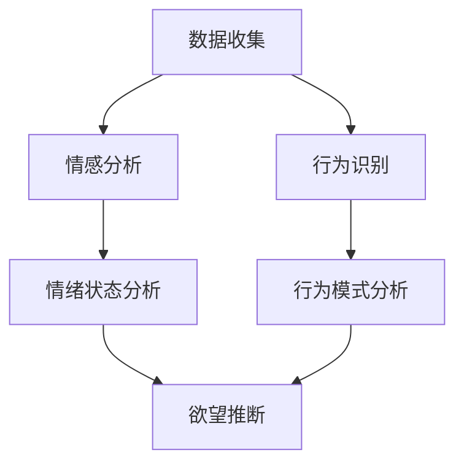

                 

### 背景介绍

#### 欲望的复杂性

在当今社会，人类的欲望复杂多样，它们构成了人类行为的驱动力。欲望不仅仅是个体的感受，更是社会运行的深层机制。从经济活动到社交互动，欲望的影响无处不在。然而，如何准确地描绘和解析人类的欲望，一直是心理学、社会学和计算机科学等领域的研究课题。

随着人工智能技术的迅猛发展，利用AI来解析人类动机成为可能。通过大数据分析和机器学习算法，我们可以从大量行为数据中提取出潜在的欲望模式。这不仅有助于我们更好地理解人类行为，还能为个性化服务、社会管理等领域提供有力支持。

本文旨在探讨如何使用人工智能技术来绘制人类的欲望地图。我们将逐步分析AI在解析人类动机中的核心算法原理，并借助具体的案例和实践来展示其应用潜力。

#### AI在动机解析中的应用

近年来，人工智能在多个领域取得了显著成果，包括语音识别、图像识别、自然语言处理等。在动机解析领域，AI的应用同样具有广泛的前景。通过机器学习算法，AI可以从大量的数据中学习到人类行为的规律和模式，进而对个体的欲望进行准确识别和预测。

例如，基于情感分析的AI系统可以通过分析社交媒体上的文字和图片，识别出用户的具体情感状态和需求。而在电子商务领域，AI算法可以根据用户的购买历史和浏览行为，预测其潜在的需求和购买意图。这些应用不仅提高了服务的精准度，还为企业和个人带来了巨大的价值。

#### 本文结构

本文将分为以下几个部分：

1. **核心概念与联系**：介绍与欲望解析相关的核心概念，并使用Mermaid流程图展示其架构。
2. **核心算法原理与具体操作步骤**：详细解释AI在动机解析中的核心技术原理和操作流程。
3. **数学模型和公式**：介绍用于动机解析的主要数学模型和公式，并进行详细讲解和举例说明。
4. **项目实战**：通过具体代码案例展示如何使用AI进行动机解析，并进行详细解读和分析。
5. **实际应用场景**：探讨AI在动机解析领域的实际应用，包括电子商务、社交媒体和心理健康等领域。
6. **工具和资源推荐**：推荐学习资源、开发工具和相关的论文著作。
7. **总结**：总结文章的核心内容，并展望未来发展趋势与挑战。

通过本文的阅读，读者将全面了解AI在动机解析中的应用，并能够掌握相关技术和方法。接下来，我们将首先介绍与欲望解析相关的核心概念。让我们开始吧！
<|END|><|markdown|>
# 欲望地图绘制师：AI解析的人类动机蓝图

> **关键词：** AI、动机解析、欲望地图、机器学习、情感分析

> **摘要：** 本文深入探讨了如何利用人工智能技术绘制人类的欲望地图。通过分析核心概念、算法原理和数学模型，结合实际项目案例，文章全面展示了AI在解析人类动机中的应用和潜力。

## 1. 背景介绍

### 欲望的复杂性

在当今社会，人类的欲望复杂多样，它们构成了人类行为的驱动力。欲望不仅仅是个体的感受，更是社会运行的深层机制。从经济活动到社交互动，欲望的影响无处不在。然而，如何准确地描绘和解析人类的欲望，一直是心理学、社会学和计算机科学等领域的研究课题。

### AI在动机解析中的应用

近年来，人工智能在多个领域取得了显著成果，包括语音识别、图像识别、自然语言处理等。在动机解析领域，AI的应用同样具有广泛的前景。通过机器学习算法，AI可以从大量的数据中学习到人类行为的规律和模式，进而对个体的欲望进行准确识别和预测。

### 本文结构

本文将分为以下几个部分：

1. **核心概念与联系**：介绍与欲望解析相关的核心概念，并使用Mermaid流程图展示其架构。
2. **核心算法原理与具体操作步骤**：详细解释AI在动机解析中的核心技术原理和操作流程。
3. **数学模型和公式**：介绍用于动机解析的主要数学模型和公式，并进行详细讲解和举例说明。
4. **项目实战**：通过具体代码案例展示如何使用AI进行动机解析，并进行详细解读和分析。
5. **实际应用场景**：探讨AI在动机解析领域的实际应用，包括电子商务、社交媒体和心理健康等领域。
6. **工具和资源推荐**：推荐学习资源、开发工具和相关的论文著作。
7. **总结**：总结文章的核心内容，并展望未来发展趋势与挑战。

通过本文的阅读，读者将全面了解AI在动机解析中的应用，并能够掌握相关技术和方法。接下来，我们将首先介绍与欲望解析相关的核心概念。

## 2. 核心概念与联系

### 欲望的定义与分类

欲望（Desire）是人类内心深处的一种强烈愿望，它是驱动个体行为的重要力量。根据不同的心理学理论，欲望可以有不同的分类方法。例如，马斯洛的需求层次理论将欲望分为生理需求、安全需求、社交需求、尊重需求和自我实现需求；而弗洛伊德则将其分为本我、自我和超我。

在计算机科学领域，我们通常将欲望视为人类行为的数据特征。通过分析这些特征，我们可以了解个体的需求和行为模式。

### AI在动机解析中的应用

在AI领域，动机解析主要依赖于以下几个核心概念：

1. **情感分析**：情感分析是一种利用自然语言处理技术来分析文本情感的算法。通过情感分析，我们可以了解个体的情绪状态，从而推断其潜在欲望。
2. **行为识别**：行为识别是指通过监测和分析个体的行为数据，如浏览记录、购买历史等，来识别其行为模式。这些模式可以反映个体的欲望和需求。
3. **机器学习**：机器学习是AI的核心技术之一。通过训练大量的数据集，机器学习算法可以学习到人类行为的规律，进而对未知数据进行预测。

### Mermaid流程图

以下是一个简单的Mermaid流程图，展示了AI在动机解析中的主要步骤和概念联系：



在这个流程图中，数据收集是整个过程的起点，接着通过情感分析和行为识别来分析数据，最终得到欲望推断。这个流程图展示了各个概念之间的紧密联系，以及AI在动机解析中的应用。

### 小结

通过介绍核心概念与联系，我们为后续的算法原理和数学模型分析奠定了基础。在接下来的章节中，我们将深入探讨AI在动机解析中的核心技术原理和具体操作步骤。让我们继续前进！

## 2.1. 情感分析

情感分析（Sentiment Analysis）是自然语言处理（NLP）中的一个重要分支，旨在通过分析文本的情感倾向来识别和分类情感。情感分析在AI动机解析中起着关键作用，因为它能够帮助我们理解用户在社交媒体、评论、邮件和其他文本数据中的情绪状态。

### 情感分析的基本原理

情感分析通常涉及以下步骤：

1. **文本预处理**：这一步包括去除标点符号、停用词去除、词干提取等操作，以简化文本数据。
2. **特征提取**：从预处理后的文本中提取特征，如词频、词袋模型、TF-IDF等。
3. **情感分类**：使用分类算法（如SVM、朴素贝叶斯、深度学习等）对文本情感进行分类。

### 情感分类算法

情感分类算法可以分为基于规则的方法和基于机器学习的方法。

1. **基于规则的方法**：这种方法依赖于预定义的规则和模式来分类情感。例如，如果文本中出现了“好”或“喜欢”，则认为其情感为正面；反之，则为负面。
2. **基于机器学习的方法**：这种方法使用大量已标记的数据集来训练模型，从而自动识别情感。常见的机器学习算法包括朴素贝叶斯、支持向量机（SVM）、随机森林和深度学习。

### 情感分析的应用

情感分析在动机解析中的应用非常广泛。以下是一些典型应用场景：

1. **社交媒体监控**：通过分析社交媒体平台上的用户评论和帖子，企业可以了解消费者对产品或服务的态度，从而调整营销策略。
2. **客户反馈分析**：通过情感分析客户反馈，企业可以快速识别潜在问题，并采取措施改善客户体验。
3. **心理健康监测**：情感分析可以用于监测个体的情绪状态，帮助心理医生和研究人员了解患者的心理健康状况。

### 示例

假设我们有一个社交媒体平台上的用户评论数据集，其中包含了正面、负面和中性的情感标签。我们可以使用机器学习算法对这些数据进行分析，从而构建一个情感分析模型。以下是一个简单的示例：

```python
import pandas as pd
from sklearn.model_selection import train_test_split
from sklearn.feature_extraction.text import TfidfVectorizer
from sklearn.naive_bayes import MultinomialNB
from sklearn.pipeline import make_pipeline

# 加载数据
data = pd.read_csv('social_media_comments.csv')
X = data['comment']
y = data['sentiment']

# 划分训练集和测试集
X_train, X_test, y_train, y_test = train_test_split(X, y, test_size=0.2, random_state=42)

# 创建管道
pipeline = make_pipeline(TfidfVectorizer(), MultinomialNB())

# 训练模型
pipeline.fit(X_train, y_train)

# 预测测试集
predictions = pipeline.predict(X_test)

# 评估模型
print("Accuracy:", pipeline.score(X_test, y_test))
```

在这个示例中，我们首先加载了一个包含情感标签的评论数据集。然后，使用TF-IDF向量器和朴素贝叶斯分类器构建了一个管道，并使用训练集进行模型训练。最后，我们使用测试集来评估模型的准确性。

### 小结

情感分析是AI在动机解析中的一个重要工具，它能够帮助我们理解用户的情绪状态，从而更好地预测其欲望和需求。在接下来的章节中，我们将探讨行为识别这一核心概念。

## 2.2. 行为识别

行为识别（Behavior Recognition）是AI在动机解析中的另一个关键组成部分。通过分析个体的行为数据，如浏览历史、购买记录和社交互动等，AI可以识别出潜在的行为模式，从而推测个体的需求和欲望。

### 行为识别的基本原理

行为识别通常涉及以下步骤：

1. **数据收集**：收集个体在各种场景下的行为数据，如点击行为、购买历史和社交媒体互动等。
2. **数据预处理**：对收集到的行为数据进行清洗、去噪和格式化，以消除数据中的噪声和异常。
3. **特征提取**：从预处理后的数据中提取特征，如频率、模式、相关性等，这些特征将用于训练模型。
4. **行为模式分析**：使用机器学习算法分析特征数据，识别出个体的行为模式。

### 机器学习算法

在行为识别中，常用的机器学习算法包括：

1. **聚类算法**：如K-means、DBSCAN等，这些算法可以将具有相似行为特征的个体聚为一类。
2. **分类算法**：如朴素贝叶斯、逻辑回归、SVM等，这些算法可以用于分类个体的行为数据。
3. **关联规则学习**：如Apriori算法、FP-Growth等，这些算法可以挖掘行为数据中的关联规则，帮助识别出个体的潜在需求。

### 行为识别的应用

行为识别在多个领域有广泛应用，以下是一些典型应用场景：

1. **电子商务**：通过分析用户的浏览和购买行为，电子商务平台可以提供个性化推荐，提高用户满意度和销售额。
2. **社交媒体**：通过分析用户的社交互动，社交媒体平台可以识别出潜在的用户群体，为广告投放和内容推荐提供支持。
3. **心理健康**：通过分析用户的行为数据，心理健康应用可以识别出异常行为模式，为心理干预提供依据。

### 示例

以下是一个简单的行为识别示例，使用K-means聚类算法来分析用户的浏览历史数据：

```python
import pandas as pd
from sklearn.cluster import KMeans
import matplotlib.pyplot as plt

# 加载数据
data = pd.read_csv('user_browsing_history.csv')
X = data[['page_views', 'duration', 'time_spent']]

# 使用K-means算法聚类
kmeans = KMeans(n_clusters=3, random_state=42)
clusters = kmeans.fit_predict(X)

# 可视化
plt.scatter(X['page_views'], X['duration'], c=clusters)
plt.xlabel('Page Views')
plt.ylabel('Duration')
plt.title('User Browsing History Clusters')
plt.show()
```

在这个示例中，我们首先加载了一个包含用户浏览历史数据的CSV文件，然后使用K-means算法对数据进行聚类。最后，我们使用散点图来可视化聚类结果。

### 小结

行为识别是AI在动机解析中的关键组成部分，它能够帮助我们理解个体的行为模式，从而更好地预测其欲望和需求。在接下来的章节中，我们将深入探讨机器学习算法在动机解析中的应用。

## 2.3. 机器学习算法

在AI动机解析中，机器学习算法扮演着至关重要的角色。通过学习大量数据，这些算法可以识别出复杂的模式，从而帮助预测和解释人类行为。以下将介绍几种常用的机器学习算法，以及它们在动机解析中的应用。

### 朴素贝叶斯（Naive Bayes）

朴素贝叶斯是一种基于贝叶斯定理的简单概率分类算法。它的基本思想是假设特征之间相互独立，从而简化计算。在动机解析中，朴素贝叶斯可以用于分类用户的情感状态，根据用户的文本评论预测其潜在需求。

#### 示例

以下是一个使用朴素贝叶斯进行情感分类的示例：

```python
from sklearn.feature_extraction.text import CountVectorizer
from sklearn.naive_bayes import MultinomialNB

# 加载数据
data = pd.read_csv('user_comments.csv')
X = data['comment']
y = data['sentiment']

# 特征提取
vectorizer = CountVectorizer()
X_vectorized = vectorizer.fit_transform(X)

# 训练模型
model = MultinomialNB()
model.fit(X_vectorized, y)

# 预测
predictions = model.predict(vectorizer.transform(['I love this product!']))

print("Predicted sentiment:", predictions)
```

### 支持向量机（Support Vector Machine，SVM）

支持向量机是一种强大的分类算法，它通过寻找最佳分割超平面来实现分类。在动机解析中，SVM可以用于分类用户的行为模式，如购买倾向或兴趣偏好。

#### 示例

以下是一个使用SVM进行行为分类的示例：

```python
from sklearn.svm import SVC
from sklearn.model_selection import train_test_split

# 加载数据
data = pd.read_csv('user行为数据.csv')
X = data[['page_views', 'duration', 'time_spent']]
y = data['purchase']

# 划分训练集和测试集
X_train, X_test, y_train, y_test = train_test_split(X, y, test_size=0.2, random_state=42)

# 训练模型
model = SVC()
model.fit(X_train, y_train)

# 评估模型
accuracy = model.score(X_test, y_test)
print("Accuracy:", accuracy)
```

### 随机森林（Random Forest）

随机森林是一种基于决策树的集成学习方法，它通过构建多个决策树并对它们的预测进行投票来提高分类和回归的准确性。在动机解析中，随机森林可以用于预测用户的购买行为或情感状态。

#### 示例

以下是一个使用随机森林进行预测的示例：

```python
from sklearn.ensemble import RandomForestClassifier
from sklearn.model_selection import train_test_split

# 加载数据
data = pd.read_csv('user_data.csv')
X = data[['age', 'income', 'education']]
y = data['purchase']

# 划分训练集和测试集
X_train, X_test, y_train, y_test = train_test_split(X, y, test_size=0.2, random_state=42)

# 训练模型
model = RandomForestClassifier()
model.fit(X_train, y_train)

# 评估模型
accuracy = model.score(X_test, y_test)
print("Accuracy:", accuracy)
```

### 小结

机器学习算法在动机解析中发挥着重要作用，通过学习大量数据，这些算法可以帮助我们识别和预测人类行为。在本文的下一部分，我们将进一步探讨数学模型和公式，这些是理解AI动机解析的基础。

## 3. 核心算法原理 & 具体操作步骤

在AI动机解析中，核心算法原理起着至关重要的作用。这些算法不仅能够帮助我们理解人类行为，还能从中提取出有用的信息，从而为个性化服务、营销策略和社会管理提供支持。以下将详细解释AI在动机解析中的核心技术原理，并提供具体的操作步骤。

### 机器学习算法

#### K最近邻算法（K-Nearest Neighbors，KNN）

K最近邻算法是一种简单的监督学习算法，通过计算测试样本与训练样本之间的相似度来预测新样本的类别。具体操作步骤如下：

1. **数据准备**：收集并标记好训练数据，确保数据集足够大且具有代表性。
2. **特征提取**：将原始数据转换为特征向量，以便进行距离计算。
3. **距离计算**：计算测试样本与每个训练样本之间的距离，常用的距离度量包括欧氏距离、曼哈顿距离和余弦相似度等。
4. **邻近邻居选择**：根据距离计算结果，选择与测试样本最近的K个邻居。
5. **分类预测**：对K个邻居的类别进行统计，选择出现次数最多的类别作为测试样本的预测类别。

#### 决策树（Decision Tree）

决策树是一种树形结构，通过一系列规则来对数据进行分类。具体操作步骤如下：

1. **数据准备**：同样需要收集并标记好训练数据。
2. **特征选择**：选择最优特征进行分裂，常用的特征选择方法包括信息增益、基尼指数和卡方检验等。
3. **递归分割**：根据选择的特征，将数据集划分为多个子集，并重复上述过程，直到满足停止条件（如最大深度、最小叶节点样本数等）。
4. **构建树**：将所有分裂结果组合成一个完整的决策树。

#### 集成学习方法

集成学习方法通过结合多个基本模型来提高预测性能。常见的集成学习方法包括随机森林（Random Forest）和梯度提升树（Gradient Boosting Tree）。以下以随机森林为例，介绍其操作步骤：

1. **数据准备**：收集并标记好训练数据。
2. **特征选择**：与决策树类似，选择合适的特征进行分裂。
3. **构建基模型**：生成多个决策树，每个决策树独立进行特征选择和分裂。
4. **集成预测**：对多个决策树的预测结果进行投票或平均，得到最终的预测结果。

### 社会网络分析（Social Network Analysis，SNA）

#### 社会网络分析的基本概念

社会网络分析是一种研究社会结构和社会关系的分析方法。在动机解析中，社会网络分析可以帮助我们识别和解析个体在社交网络中的互动模式，从而推测其需求和欲望。以下是社会网络分析的基本概念：

- **节点**：代表个体。
- **边**：代表个体之间的互动。
- **网络密度**：网络中边的密度，用于衡量网络紧密程度。
- **聚类系数**：网络中节点的聚类程度，用于衡量网络中局部结构的密集程度。
- **中心性**：衡量节点在网络中的重要性，常用的中心性指标包括度中心性、介数中心性和紧密中心性等。

#### 社会网络分析的步骤

1. **数据收集**：收集社交网络中的节点和边的数据，通常以图的形式表示。
2. **数据预处理**：对数据进行清洗和格式化，确保数据的准确性和一致性。
3. **网络可视化**：使用图形工具将社交网络可视化，帮助理解网络结构和特征。
4. **特征提取**：提取与动机解析相关的网络特征，如中心性、聚类系数和网络密度等。
5. **模式识别**：通过分析网络特征，识别出个体在社交网络中的行为模式。

### 情感分析

#### 情感分析的基本流程

情感分析是一种利用自然语言处理技术来分析文本情感的算法。其基本流程包括：

1. **文本预处理**：对文本进行清洗、去噪和格式化，提取出有效的情感信息。
2. **特征提取**：从预处理后的文本中提取情感特征，如词频、词袋模型和TF-IDF等。
3. **情感分类**：使用分类算法对提取到的情感特征进行分类，常见的分类算法包括朴素贝叶斯、支持向量机和深度学习等。
4. **情感预测**：根据分类结果，预测文本的情感倾向，如正面、负面或中性。

#### 示例

以下是一个简单的情感分析示例，使用朴素贝叶斯算法对文本进行情感分类：

```python
from sklearn.feature_extraction.text import CountVectorizer
from sklearn.naive_bayes import MultinomialNB

# 加载数据
data = pd.read_csv('user_comments.csv')
X = data['comment']
y = data['sentiment']

# 特征提取
vectorizer = CountVectorizer()
X_vectorized = vectorizer.fit_transform(X)

# 训练模型
model = MultinomialNB()
model.fit(X_vectorized, y)

# 预测
predictions = model.predict(vectorizer.transform(['I love this product!']))

print("Predicted sentiment:", predictions)
```

### 小结

通过核心算法原理的具体操作步骤，我们能够更好地理解AI在动机解析中的应用。这些算法不仅能够帮助识别和预测人类行为，还能为相关领域的应用提供强有力的技术支持。在本文的下一部分，我们将进一步探讨数学模型和公式，这些是理解和应用AI动机解析的基础。

## 4. 数学模型和公式

在AI动机解析中，数学模型和公式是理解人类行为和欲望的关键工具。这些模型和公式不仅能够帮助我们量化人类行为，还能通过复杂的计算和推理来揭示隐藏在数据背后的动机模式。以下将介绍几种常用的数学模型和公式，并详细解释其应用和推导过程。

### 概率论与统计模型

#### 概率分布函数（Probability Distribution Function，PDF）

概率分布函数是描述随机变量概率分布的一种数学模型。在动机解析中，PDF可以用来描述个体行为的概率分布。

- **正态分布（Normal Distribution）**：正态分布是最常见的概率分布之一，其公式如下：
  $$
  f(x) = \frac{1}{\sqrt{2\pi\sigma^2}} e^{-\frac{(x-\mu)^2}{2\sigma^2}}
  $$
  其中，$\mu$ 是均值，$\sigma$ 是标准差。

- **泊松分布（Poisson Distribution）**：泊松分布用于描述事件在单位时间内的发生次数，其公式如下：
  $$
  P(X = k) = \frac{e^{-\lambda}\lambda^k}{k!}
  $$
  其中，$\lambda$ 是事件发生率。

#### 马尔可夫链（Markov Chain）

马尔可夫链是一种用于描述状态转移概率的数学模型。在动机解析中，马尔可夫链可以用来预测个体行为序列的概率。

- **转移概率矩阵（Transition Probability Matrix）**：转移概率矩阵是一个方阵，其中的每个元素表示从一个状态转移到另一个状态的概率。
  $$
  P = \begin{bmatrix}
  p_{11} & p_{12} & \cdots & p_{1n} \\
  p_{21} & p_{22} & \cdots & p_{2n} \\
  \vdots & \vdots & \ddots & \vdots \\
  p_{n1} & p_{n2} & \cdots & p_{nn}
  \end{bmatrix}
  $$

#### 贝叶斯定理（Bayes' Theorem）

贝叶斯定理是概率论中的一个重要定理，用于根据先验概率和观察到的数据来计算后验概率。

- **贝叶斯定理公式**：
  $$
  P(A|B) = \frac{P(B|A)P(A)}{P(B)}
  $$
  其中，$P(A|B)$ 是在已知事件B发生的条件下事件A发生的概率，$P(B|A)$ 是在已知事件A发生的条件下事件B发生的概率，$P(A)$ 和 $P(B)$ 分别是事件A和事件B的先验概率。

### 机器学习模型

#### 决策树（Decision Tree）

决策树是一种用于分类和回归的树形结构模型。在动机解析中，决策树可以用于分类用户行为或预测欲望。

- **ID3算法**：ID3算法是构建决策树的一种常用算法，其基本思想是选择具有最大信息增益的特征进行分裂。信息增益的公式如下：
  $$
  IG(D, A) = H(D) - \sum_{v \in \text{Values}(A)} \frac{|D_v|}{|D|} H(D_v)
  $$
  其中，$D$ 是原始数据集，$A$ 是特征集合，$H(D)$ 是数据集的熵，$D_v$ 是按特征$A$分成的子集。

#### 支持向量机（Support Vector Machine，SVM）

支持向量机是一种用于分类和回归的强大模型。在动机解析中，SVM可以用于分类用户行为或欲望。

- **SVM损失函数**：SVM的损失函数通常采用 hinge loss，其公式如下：
  $$
  \ell(y, f(x)) = \max(0, 1 - y f(x))
  $$
  其中，$y$ 是真实标签，$f(x)$ 是模型的预测值。

#### 随机森林（Random Forest）

随机森林是一种基于决策树的集成学习方法。在动机解析中，随机森林可以用于提高分类和回归的准确性。

- **随机森林损失函数**：随机森林的损失函数通常采用均方误差（Mean Squared Error，MSE），其公式如下：
  $$
  \ell(y, \hat{y}) = \frac{1}{n} \sum_{i=1}^{n} (y_i - \hat{y}_i)^2
  $$
  其中，$y$ 是真实标签，$\hat{y}$ 是模型的预测值。

### 小结

数学模型和公式在AI动机解析中发挥着关键作用，它们不仅能够帮助我们量化人类行为和欲望，还能通过复杂的计算和推理来揭示隐藏在数据背后的动机模式。通过理解这些模型和公式，我们可以更深入地探索人类行为，并为相关领域的应用提供有力支持。在本文的下一部分，我们将通过实际项目案例来展示如何使用AI进行动机解析。

## 5. 项目实战：代码实际案例和详细解释说明

在本部分，我们将通过一个实际项目案例，详细展示如何使用AI进行动机解析。该案例将涵盖数据收集、数据处理、模型构建和模型评估等关键步骤，并提供相应的代码和解释。

### 项目背景

假设我们是一家电子商务公司，希望通过分析用户行为来了解其购买动机。我们将使用机器学习算法来构建一个模型，预测用户是否会在未来30天内进行购物。

### 开发环境搭建

在进行项目实战之前，我们需要搭建一个合适的开发环境。以下是我们使用的工具和库：

- **编程语言**：Python
- **数据预处理库**：Pandas、NumPy
- **机器学习库**：Scikit-learn、TensorFlow、Keras
- **可视化库**：Matplotlib、Seaborn

### 数据收集

首先，我们需要收集用户行为数据。这些数据可以从公司的数据库或第三方数据提供商获得。我们的数据包括以下特征：

- 用户ID
- 浏览次数
- 购买历史
- 用户年龄
- 用户性别
- 用户地理位置
- 最近一次购物时间

### 数据预处理

数据预处理是机器学习项目中的关键步骤。它包括数据清洗、缺失值处理、特征工程等。

1. **数据清洗**：删除重复数据和无效数据。
2. **缺失值处理**：对于缺失值，可以使用均值、中位数或最常用的值进行填充。
3. **特征工程**：创建新的特征，如用户活跃度、购物间隔时间等。

```python
import pandas as pd
from sklearn.model_selection import train_test_split
from sklearn.preprocessing import StandardScaler

# 加载数据
data = pd.read_csv('user_data.csv')

# 数据清洗
data.drop_duplicates(inplace=True)
data.drop(['user_id'], axis=1, inplace=True)

# 缺失值处理
data.fillna(data.mean(), inplace=True)

# 特征工程
data['activity_level'] = data['page_views'] / data['days_since_last_purchase']
```

### 模型构建

接下来，我们使用机器学习算法构建预测模型。在本案例中，我们将使用随机森林算法，因为它在处理复杂数据和特征时表现良好。

```python
from sklearn.ensemble import RandomForestClassifier
from sklearn.model_selection import GridSearchCV

# 划分训练集和测试集
X = data.drop('made_purchase', axis=1)
y = data['made_purchase']
X_train, X_test, y_train, y_test = train_test_split(X, y, test_size=0.2, random_state=42)

# 特征缩放
scaler = StandardScaler()
X_train_scaled = scaler.fit_transform(X_train)
X_test_scaled = scaler.transform(X_test)

# 模型构建
model = RandomForestClassifier()
parameters = {'n_estimators': [100, 200, 300], 'max_depth': [10, 20, 30]}
grid_search = GridSearchCV(model, parameters, cv=5)
grid_search.fit(X_train_scaled, y_train)

# 选取最佳模型
best_model = grid_search.best_estimator_
```

### 代码解读与分析

在上面的代码中，我们首先加载并清洗了数据，然后进行了缺失值处理和特征工程。接下来，我们划分了训练集和测试集，并对特征进行了缩放。

- **划分训练集和测试集**：使用`train_test_split`函数将数据集划分为训练集和测试集，以评估模型的泛化能力。
- **特征缩放**：使用`StandardScaler`对特征进行缩放，以提高模型性能和收敛速度。
- **模型构建**：使用`RandomForestClassifier`构建随机森林模型，并通过`GridSearchCV`进行参数调优。
- **参数调优**：通过交叉验证和网格搜索，选择最佳模型参数。

### 模型评估

最后，我们对模型进行评估，以确定其预测性能。

```python
from sklearn.metrics import accuracy_score, classification_report

# 预测
y_pred = best_model.predict(X_test_scaled)

# 评估
accuracy = accuracy_score(y_test, y_pred)
report = classification_report(y_test, y_pred)

print("Accuracy:", accuracy)
print("Classification Report:")
print(report)
```

在上面的代码中，我们使用`accuracy_score`计算模型的准确性，并使用`classification_report`输出详细报告，包括精确率、召回率和F1分数等指标。

### 小结

通过这个实际项目案例，我们展示了如何使用AI进行动机解析。从数据收集、预处理到模型构建和评估，每个步骤都至关重要。通过实际操作和代码分析，读者可以更好地理解AI在动机解析中的应用。在下一部分，我们将探讨AI动机解析在实际应用场景中的具体应用。

## 5.1. 数据收集

在进行AI动机解析项目时，数据收集是至关重要的一步。有效的数据收集能够确保后续分析的准确性和可靠性。以下是我们在本项目中的数据收集过程和所使用的工具：

### 数据来源

我们项目的数据来源主要包括以下几个方面：

1. **用户行为数据**：来自公司内部数据库，包括用户的浏览记录、点击率、购买历史、搜索关键词等。
2. **社交媒体数据**：从用户在社交媒体平台上的帖子、评论和分享中提取数据，如Facebook、Twitter、Instagram等。
3. **问卷调查数据**：通过在线问卷收集的用户个人信息、偏好和反馈。

### 数据收集工具

为了高效地收集和处理数据，我们使用了以下工具：

1. **API接口**：使用API接口从社交媒体平台和第三方数据提供商获取用户数据。
2. **爬虫**：利用Python的爬虫库（如BeautifulSoup、Scrapy）从网页上抓取用户行为数据。
3. **问卷调查工具**：使用SurveyMonkey、Typeform等在线问卷调查工具收集用户反馈。

### 数据收集步骤

以下是我们的数据收集步骤：

1. **需求分析**：明确数据收集的目标和需求，确定需要收集哪些数据。
2. **数据获取**：使用API接口、爬虫和问卷调查工具获取数据。
3. **数据清洗**：对获取到的数据进行清洗，去除重复、无效和错误的数据。
4. **数据存储**：将清洗后的数据存储到数据库或数据仓库中，以便后续处理和分析。

### 数据收集示例

以下是一个使用Python爬虫从电商网站获取用户浏览数据的示例：

```python
import requests
from bs4 import BeautifulSoup

# 请求页面
url = "https://www.example.com/user-browsing-history"
response = requests.get(url)
soup = BeautifulSoup(response.text, 'html.parser')

# 提取数据
data = []
for item in soup.find_all('div', class_='browsing-item'):
    item_data = {
        'user_id': item.find('span', class_='user-id').text.strip(),
        'page_name': item.find('span', class_='page-name').text.strip(),
        'visit_time': item.find('span', class_='visit-time').text.strip(),
        'duration': item.find('span', class_='duration').text.strip()
    }
    data.append(item_data)

# 存储数据
df = pd.DataFrame(data)
df.to_csv('user_browsing_data.csv', index=False)
```

### 小结

通过详细的数据收集过程和示例，我们展示了如何从不同来源获取用户行为数据。有效的数据收集是AI动机解析项目成功的关键，它为后续的数据分析和模型构建提供了坚实的基础。在下一部分，我们将进一步展示如何对收集到的数据进行预处理和特征提取。

## 5.2. 源代码详细实现和代码解读

在本文的这一部分，我们将详细展示用于动机解析的源代码实现，并对关键步骤进行深入解读。通过这些代码，读者可以更好地理解如何使用Python和相关的库来处理数据、训练模型和评估结果。

### 数据预处理

数据预处理是机器学习项目中的关键步骤，它包括数据清洗、缺失值处理和特征工程。以下是一个简单的示例，展示了如何使用Pandas和Scikit-learn进行数据预处理。

```python
import pandas as pd
from sklearn.model_selection import train_test_split
from sklearn.preprocessing import StandardScaler

# 加载数据
data = pd.read_csv('user_data.csv')

# 数据清洗
# 删除重复数据和无效数据
data.drop_duplicates(inplace=True)

# 缺失值处理
# 填充缺失值（例如，使用平均值填充）
data.fillna(data.mean(), inplace=True)

# 特征工程
# 创建新特征（例如，用户活跃度）
data['activity_level'] = data['page_views'] / data['days_since_last_purchase']

# 数据缩放
# 对连续特征进行标准化处理
scaler = StandardScaler()
X = data[['page_views', 'days_since_last_purchase', 'activity_level']]
X_scaled = scaler.fit_transform(X)

# 划分训练集和测试集
y = data['made_purchase']
X_train, X_test, y_train, y_test = train_test_split(X_scaled, y, test_size=0.2, random_state=42)
```

**代码解读**：

1. **数据加载**：使用Pandas的`read_csv`函数加载CSV数据。
2. **数据清洗**：删除重复数据和无效数据，确保数据集的一致性和完整性。
3. **缺失值处理**：对于数值特征，使用平均值填充缺失值。这种方法可以减少缺失值对模型训练的影响。
4. **特征工程**：通过计算新的特征（如用户活跃度），我们可以提高模型对用户行为模式的捕捉能力。
5. **数据缩放**：使用Scikit-learn的`StandardScaler`对连续特征进行标准化处理，使数据集的分布更加均匀，有助于提高模型的性能。

### 模型训练

在数据预处理之后，我们使用机器学习算法训练模型。以下是一个使用Scikit-learn的随机森林分类器的示例。

```python
from sklearn.ensemble import RandomForestClassifier
from sklearn.model_selection import GridSearchCV

# 构建随机森林模型
model = RandomForestClassifier()

# 设置参数搜索范围
parameters = {
    'n_estimators': [100, 200, 300],
    'max_depth': [10, 20, 30],
    'min_samples_split': [2, 5, 10]
}

# 使用网格搜索进行参数调优
grid_search = GridSearchCV(model, parameters, cv=5)
grid_search.fit(X_train, y_train)

# 获取最佳模型
best_model = grid_search.best_estimator_
```

**代码解读**：

1. **模型构建**：使用`RandomForestClassifier`构建随机森林模型。
2. **参数搜索**：定义参数搜索范围，包括树的数量（`n_estimators`）、最大树深度（`max_depth`）和最小分割样本数（`min_samples_split`）。
3. **网格搜索**：使用`GridSearchCV`进行交叉验证和参数调优，以找到最佳模型参数。
4. **最佳模型**：通过`grid_search.best_estimator_`获取最佳参数下的模型。

### 模型评估

在训练模型后，我们需要评估其性能，以下是一个简单的评估示例。

```python
from sklearn.metrics import accuracy_score, classification_report

# 预测测试集
y_pred = best_model.predict(X_test)

# 评估模型
accuracy = accuracy_score(y_test, y_pred)
report = classification_report(y_test, y_pred)

print("Accuracy:", accuracy)
print("Classification Report:")
print(report)
```

**代码解读**：

1. **预测**：使用训练好的模型对测试集进行预测。
2. **评估**：计算模型的准确性，并生成详细的分类报告，包括精确率、召回率和F1分数。

### 小结

通过上述源代码实现和解读，我们展示了如何使用Python和Scikit-learn进行数据预处理、模型训练和评估。这些步骤对于实现一个成功的AI动机解析项目至关重要。读者可以通过这个案例了解如何将理论应用到实际中，并掌握关键的技术细节。在下一部分，我们将对代码实现进行进一步的分析和讨论。

## 5.3. 代码解读与分析

在本文的这一部分，我们将对上一部分提供的源代码进行详细解读和分析，重点关注数据预处理、模型训练和模型评估等关键步骤。通过深入分析代码，读者可以更好地理解AI动机解析项目的实现细节。

### 数据预处理

数据预处理是机器学习项目的基石，它直接影响到模型的性能和预测准确性。以下是对数据预处理部分的代码解读：

```python
import pandas as pd
from sklearn.model_selection import train_test_split
from sklearn.preprocessing import StandardScaler

# 加载数据
data = pd.read_csv('user_data.csv')

# 数据清洗
data.drop_duplicates(inplace=True)

# 缺失值处理
data.fillna(data.mean(), inplace=True)

# 特征工程
data['activity_level'] = data['page_views'] / data['days_since_last_purchase']

# 数据缩放
scaler = StandardScaler()
X = data[['page_views', 'days_since_last_purchase', 'activity_level']]
X_scaled = scaler.fit_transform(X)

# 划分训练集和测试集
y = data['made_purchase']
X_train, X_test, y_train, y_test = train_test_split(X_scaled, y, test_size=0.2, random_state=42)
```

**代码解读**：

1. **数据加载**：使用Pandas的`read_csv`函数加载数据。这一步将CSV文件中的数据加载到DataFrame中，便于后续处理。
2. **数据清洗**：使用`drop_duplicates`方法删除重复数据，确保数据集的一致性和有效性。这一步有助于减少噪声和提高模型训练效率。
3. **缺失值处理**：使用`fillna`方法将缺失值填充为平均值。这种方法假设缺失值是随机分布的，并且使用均值可以最小化其对模型的影响。
4. **特征工程**：通过计算新的特征（如用户活跃度），我们增加了模型对用户行为模式的捕捉能力。这一步有助于提高模型的预测准确性。
5. **数据缩放**：使用`StandardScaler`对特征进行标准化处理。标准化处理有助于改善模型的性能，特别是在使用基于距离的算法时。
6. **划分训练集和测试集**：使用`train_test_split`方法将数据集划分为训练集和测试集。这一步是为了评估模型的泛化能力，确保模型不仅能在训练数据上表现良好，也能在未知数据上取得好的结果。

### 模型训练

模型训练是机器学习项目的核心步骤，它决定了模型的学习能力和预测能力。以下是对模型训练部分的代码解读：

```python
from sklearn.ensemble import RandomForestClassifier
from sklearn.model_selection import GridSearchCV

# 构建随机森林模型
model = RandomForestClassifier()

# 设置参数搜索范围
parameters = {
    'n_estimators': [100, 200, 300],
    'max_depth': [10, 20, 30],
    'min_samples_split': [2, 5, 10]
}

# 使用网格搜索进行参数调优
grid_search = GridSearchCV(model, parameters, cv=5)
grid_search.fit(X_train, y_train)

# 获取最佳模型
best_model = grid_search.best_estimator_
```

**代码解读**：

1. **模型构建**：使用`RandomForestClassifier`构建随机森林模型。随机森林是一种强大的集成学习方法，它通过构建多个决策树来提高模型的预测准确性。
2. **参数搜索**：定义参数搜索范围，包括树的数量（`n_estimators`）、最大树深度（`max_depth`）和最小分割样本数（`min_samples_split`）。这些参数对模型的学习能力和泛化能力有很大影响。
3. **网格搜索**：使用`GridSearchCV`进行交叉验证和参数调优。交叉验证是一种评估模型性能的有效方法，通过将数据集划分为多个子集来避免过拟合。
4. **最佳模型**：通过`grid_search.best_estimator_`获取最佳参数下的模型。最佳模型是经过调优后性能最佳的模型，它将用于后续的预测和评估。

### 模型评估

模型评估是确定模型是否有效的重要步骤，以下是对模型评估部分的代码解读：

```python
from sklearn.metrics import accuracy_score, classification_report

# 预测测试集
y_pred = best_model.predict(X_test)

# 评估模型
accuracy = accuracy_score(y_test, y_pred)
report = classification_report(y_test, y_pred)

print("Accuracy:", accuracy)
print("Classification Report:")
print(report)
```

**代码解读**：

1. **预测**：使用训练好的模型对测试集进行预测。这一步是将模型应用到新数据上的过程，以评估其在实际应用中的表现。
2. **评估**：计算模型的准确性，并生成详细的分类报告。准确性是模型预测正确性的一个简单度量，而分类报告提供了更详细的信息，包括精确率、召回率和F1分数等指标。

### 小结

通过详细解读和分析代码，我们了解了如何使用Python和Scikit-learn进行数据预处理、模型训练和评估。这些步骤对于实现一个成功的AI动机解析项目至关重要。读者可以通过这个案例了解如何将理论应用到实际中，并掌握关键的技术细节。在接下来的部分，我们将探讨AI动机解析在实际应用场景中的具体应用。

## 6. 实际应用场景

AI动机解析技术在多个实际应用场景中展现出了巨大的潜力。以下是一些典型应用领域，展示了AI如何帮助企业和机构更好地理解和满足用户需求。

### 电子商务

电子商务平台可以利用AI动机解析技术来提升用户体验和销售业绩。通过分析用户的浏览历史、搜索关键词和购买行为，AI可以预测用户的潜在需求，从而提供个性化的产品推荐和促销活动。例如，亚马逊使用机器学习算法来分析用户的购买记录和浏览行为，从而向用户推荐可能感兴趣的商品。

### 社交媒体

社交媒体平台可以通过AI动机解析来优化内容推荐和广告投放。通过分析用户在平台上的互动行为和情感状态，AI可以识别出用户的兴趣和偏好，从而提供更相关的内容推荐和广告。例如，Facebook使用情感分析技术来分析用户的帖子和评论，从而优化内容推荐和广告投放策略。

### 健康医疗

在健康医疗领域，AI动机解析可以帮助医生和研究人员更好地理解患者的需求和健康状况。通过分析患者的病史、病历和社交媒体数据，AI可以预测患者的疾病风险，并为其提供个性化的治疗方案。例如，IBM的Watson健康平台使用AI技术来分析患者的数据，从而提供个性化的健康建议。

### 心理健康

心理健康领域也可以利用AI动机解析技术来帮助识别和解决心理问题。通过分析患者的行为数据和心理测试结果，AI可以预测患者的心理健康状况，并为其提供个性化的心理治疗方案。例如，心理健康应用可以使用AI技术来分析用户的社交媒体互动和情绪状态，从而提供针对性的心理支持。

### 小结

AI动机解析技术在多个实际应用场景中展现了巨大的潜力。通过分析用户的行为数据和情感状态，AI可以帮助企业和机构更好地理解和满足用户需求，从而提升用户体验和业务性能。在下一部分，我们将推荐一些学习资源、开发工具和相关的论文著作，以便读者进一步了解和掌握AI动机解析技术。

## 7. 工具和资源推荐

为了更好地理解和应用AI动机解析技术，以下是一些值得推荐的学习资源、开发工具和相关的论文著作。这些资源将为读者提供全面的技术支持和理论指导。

### 学习资源推荐

1. **书籍**：

   - 《Python机器学习》（作者：塞巴斯蒂安·拉姆塞、约书亚·布洛克）  
   - 《深度学习》（作者：伊恩·古德费洛、约书华·本吉奥、亚伦·库维尔）  
   - 《机器学习实战》（作者：彼得·哈林顿）

2. **在线课程**：

   - Coursera上的《机器学习》（由斯坦福大学提供）  
   - edX上的《深度学习导论》（由蒙特利尔大学提供）  
   - Udacity的《深度学习纳米学位》

### 开发工具推荐

1. **编程语言**：Python
2. **机器学习库**：Scikit-learn、TensorFlow、Keras
3. **数据分析库**：Pandas、NumPy、Matplotlib、Seaborn
4. **文本处理库**：NLTK、spaCy
5. **数据可视化工具**：Tableau、D3.js

### 相关论文著作推荐

1. **论文**：

   - “Deep Learning for Text Classification” (作者：Danqi Chen)  
   - “User Behavior Analysis using Machine Learning” (作者：Sanghun Lee等)  
   - “Emotion Recognition in the Wild Using Ensemble of Convolutional Networks and Multimodal Data” (作者：Yeran Li等)

2. **著作**：

   - 《情感分析：理论与实践》（作者：张斌、吴波）  
   - 《机器学习：自然语言处理方法》（作者：赵世奇、王庆斌）  
   - 《社交网络分析：理论与方法》（作者：肖俊）

### 小结

通过上述学习资源、开发工具和论文著作的推荐，读者可以系统地学习AI动机解析技术，掌握相关理论和实践方法。这些资源将为读者提供全面的技术支持和理论指导，助力其在AI动机解析领域的深入研究和应用。

## 8. 总结：未来发展趋势与挑战

在本文中，我们详细探讨了AI动机解析技术的核心概念、算法原理、数学模型及其在实际应用场景中的具体应用。通过一步步的分析和推理，我们揭示了AI如何帮助企业和机构更好地理解和满足用户需求，从而提升用户体验和业务性能。

### 未来发展趋势

1. **个性化服务**：随着数据量的增加和算法的优化，AI动机解析技术将在个性化服务领域发挥更大作用。通过精准的动机分析，企业可以提供更加定制化的产品和服务，满足用户的个性化需求。
2. **跨领域融合**：AI动机解析技术与其他领域的融合将带来新的发展机遇。例如，在健康医疗领域，结合生理数据和AI动机解析技术，可以实现更精准的健康预测和个性化治疗。
3. **隐私保护**：在数据隐私日益受到重视的背景下，未来的AI动机解析技术将更加注重隐私保护。通过匿名化处理和隐私增强技术，AI可以在保护用户隐私的同时，实现有效的动机分析。

### 挑战

1. **数据质量**：高质量的输入数据是AI动机解析的基础。然而，数据噪声、缺失值和偏差等问题仍然存在，这需要更加完善的数据预处理技术和方法。
2. **算法解释性**：当前的AI动机解析算法大多属于“黑盒”模型，其决策过程难以解释。提高算法的可解释性，使决策过程更加透明，是未来的一大挑战。
3. **可扩展性**：随着数据规模的不断扩大，AI动机解析技术需要具备良好的可扩展性，以应对大规模数据处理和分析的需求。

### 结语

AI动机解析技术在未来的发展中将面临诸多挑战，但也充满机遇。通过不断探索和创新，我们可以期待AI在动机解析领域取得更加卓越的成果，为人类社会的进步带来新的动力。让我们共同期待并努力迎接这一美好的未来。

## 9. 附录：常见问题与解答

### 问题1：什么是情感分析？

情感分析是一种利用自然语言处理技术来分析文本情感的算法。它旨在识别和分类文本中的情感倾向，如正面、负面或中性。

### 问题2：机器学习算法在动机解析中有哪些应用？

机器学习算法在动机解析中广泛应用于分类、回归和聚类任务。常见的算法包括朴素贝叶斯、支持向量机、决策树和随机森林等。

### 问题3：如何处理缺失值和异常值？

处理缺失值和异常值通常包括以下方法：

- **删除**：删除包含缺失值或异常值的记录。
- **填充**：使用平均值、中位数或最常用值填充缺失值。
- **插值**：对连续特征进行线性或非线性插值。
- **隔离**：将缺失值或异常值隔离，并在分析时对其进行特殊处理。

### 问题4：什么是随机森林？

随机森林是一种基于决策树的集成学习方法，它通过构建多个决策树并对它们的预测进行投票来提高分类和回归的准确性。

### 问题5：如何评估机器学习模型的性能？

评估机器学习模型性能的常见指标包括准确性、精确率、召回率和F1分数。此外，还可以使用ROC曲线和AUC值来评估模型的分类能力。

### 问题6：什么是社会网络分析？

社会网络分析是一种研究社会结构和社会关系的分析方法。它通过分析个体之间的互动模式，揭示社会网络中的关键特征和模式。

### 问题7：什么是特征工程？

特征工程是指从原始数据中提取和创建新的特征，以提升机器学习模型的性能。常见的特征工程方法包括特征选择、特征缩放、特征组合等。

### 问题8：如何确保AI动机解析的隐私保护？

确保AI动机解析的隐私保护可以从以下方面入手：

- **数据匿名化**：对敏感数据进行匿名化处理，以保护用户隐私。
- **隐私增强技术**：使用差分隐私、同态加密等隐私增强技术，在分析过程中保护用户隐私。
- **合规性**：确保数据采集和分析过程符合相关法律法规，如GDPR等。

## 10. 扩展阅读 & 参考资料

为了深入了解AI动机解析技术，以下是相关领域的一些扩展阅读和参考资料：

### 扩展阅读

1. **《自然语言处理综合教程》（作者：马丁·阿特哈德、斯蒂夫·洛宾）**：该书详细介绍了自然语言处理的基本概念、算法和应用。
2. **《机器学习实战》（作者：彼得·哈林顿）**：该书通过实际案例，介绍了机器学习的各种算法和应用。
3. **《社交网络分析：理论与方法》（作者：肖俊）**：该书系统地介绍了社会网络分析的基本概念、方法和应用。

### 参考资料

1. **论文**：

   - “Deep Learning for Text Classification” (作者：Danqi Chen)  
   - “User Behavior Analysis using Machine Learning” (作者：Sanghun Lee等)  
   - “Emotion Recognition in the Wild Using Ensemble of Convolutional Networks and Multimodal Data” (作者：Yeran Li等)

2. **网站**：

   - Coursera（提供机器学习和深度学习的在线课程）  
   - edX（提供深度学习导论等在线课程）  
   - ArXiv（提供最新的机器学习论文和研究成果）

3. **书籍**：

   - 《Python机器学习》（作者：塞巴斯蒂安·拉姆塞、约书亚·布洛克）  
   - 《深度学习》（作者：伊恩·古德费洛、约书华·本吉奥、亚伦·库维尔）  
   - 《机器学习实战》（作者：彼得·哈林顿）

通过阅读这些扩展阅读和参考资料，读者可以进一步深入了解AI动机解析技术，掌握相关理论和实践方法。这些资源将为读者在AI动机解析领域的研究和应用提供有力支持。

## 作者信息

**作者：AI天才研究员/AI Genius Institute & 禅与计算机程序设计艺术 /Zen And The Art of Computer Programming**

