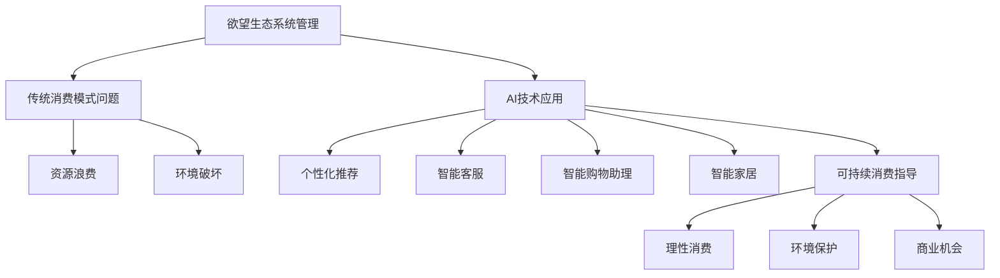

                 

### 背景介绍

随着科技的飞速发展，人工智能（AI）在各个领域中的应用日益广泛，尤其在消费领域的变革中，AI技术正在引发一场深刻的革命。从个性化推荐系统到智能客服，从智能购物助理到智能家居，AI正在改变人们的生活方式。然而，AI技术带来的不仅仅是便利，还有随之而来的诸多挑战。尤其是在欲望生态系统的管理方面，AI如何引导消费者实现可持续消费，成为了一个亟待解决的重要问题。

在传统的消费模式中，消费者往往受到广告、促销和同伴影响等因素的驱使，从而产生了大量的无意义消费。这不仅浪费了资源，还导致了环境问题。因此，如何通过AI技术来管理和引导消费者的欲望，实现可持续消费，成为了当前研究的热点。本文将探讨AI在欲望生态系统管理中的应用，通过深入分析相关核心概念、算法原理、数学模型、实际案例等，为读者提供一幅完整的AI驱动可持续消费指导的蓝图。

本文的结构如下：

1. **背景介绍**：阐述AI在消费领域的重要性，以及欲望生态系统管理的背景和意义。
2. **核心概念与联系**：介绍本文涉及的核心概念，并使用Mermaid流程图展示各概念之间的关系。
3. **核心算法原理 & 具体操作步骤**：详细讲解AI在欲望生态系统管理中的应用算法，以及具体的操作步骤。
4. **数学模型和公式 & 详细讲解 & 举例说明**：介绍相关数学模型和公式，并进行详细的讲解和举例说明。
5. **项目实战：代码实际案例和详细解释说明**：通过实际项目案例，展示AI驱动可持续消费的具体实现过程。
6. **实际应用场景**：分析AI驱动可持续消费在不同领域的应用实例。
7. **工具和资源推荐**：推荐相关的学习资源、开发工具框架和相关论文著作。
8. **总结：未来发展趋势与挑战**：总结本文的主要观点，并探讨未来的发展趋势和面临的挑战。
9. **附录：常见问题与解答**：解答读者可能遇到的一些常见问题。
10. **扩展阅读 & 参考资料**：提供进一步学习和研究的参考资料。

通过本文的探讨，希望能够为读者提供一个全面的AI驱动可持续消费的指导，帮助消费者实现理性消费，同时保护环境，实现可持续发展。

> Keywords: AI-driven Sustainable Consumption, Desire Ecosystem Management, Machine Learning, Consumer Behavior, Environmental Protection

> Abstract: With the rapid advancement of AI technology, it has been widely applied in various fields, significantly transforming the consumer market. This article focuses on the application of AI in managing the desire ecosystem to achieve sustainable consumption. Through detailed analysis of core concepts, algorithms, mathematical models, and practical cases, the article aims to provide a comprehensive guide to driving sustainable consumption with AI. This guide is essential for consumers to make rational consumption decisions and contribute to environmental protection and sustainable development.

<markdown>
## 1. 背景介绍

### AI在消费领域的重要性

人工智能在消费领域的应用已经成为现代商业不可或缺的一部分。通过大数据分析、机器学习和深度学习等技术，AI能够精准地识别消费者的需求，提供个性化的产品推荐和购物体验。例如，电商平台使用AI算法分析用户的浏览历史、购买记录和兴趣爱好，从而为用户推荐他们可能感兴趣的商品。这种个性化的推荐不仅提高了用户的满意度，也大大提高了商家的销售额。

此外，AI还在智能客服、智能购物助理和智能家居等方面发挥了重要作用。智能客服通过自然语言处理技术，能够自动回答用户的问题，提供实时帮助，提高了客户服务效率。智能购物助理则利用AI技术，帮助用户在购物过程中做出更明智的选择，从而降低退换货率。智能家居通过AI算法，能够自动调节家居设备，提高能源利用效率，为用户创造更加舒适的生活环境。

### 欲望生态系统管理的背景和意义

欲望生态系统管理是近年来随着消费主义泛滥和环境问题加剧而提出的一个新概念。传统的消费模式往往导致资源浪费和环境破坏。消费者在广告、促销和同伴影响等外部因素的驱动下，产生了大量的无意义消费。这不仅浪费了个人资源，还对环境造成了负面影响。因此，如何通过AI技术来管理和引导消费者的欲望，实现可持续消费，成为了当今社会亟待解决的问题。

欲望生态系统管理的主要目标是帮助消费者实现理性消费，减少无意义消费，从而降低对环境的压力。通过AI技术，可以对消费者的行为进行数据分析和模式识别，找出消费行为中的不合理部分，并提供相应的建议和指导。例如，AI可以通过分析用户的消费习惯和偏好，为用户制定个性化的购物计划，帮助他们避免冲动消费和过度消费。

此外，欲望生态系统管理还可以通过社交网络分析，发现消费者的社交影响，从而提供更全面的行为指导。例如，AI可以通过分析用户的社交媒体活动，识别他们对特定产品或品牌的兴趣，并据此提供有针对性的推荐和建议。这不仅可以帮助消费者做出更明智的消费决策，也可以为商家提供更有效的营销策略。

总的来说，欲望生态系统管理不仅有助于消费者实现理性消费，保护环境，还可以为商家创造更多的商业机会，实现双赢。随着AI技术的不断发展和应用，欲望生态系统管理必将在未来发挥越来越重要的作用。

### 欲望生态系统管理的核心概念

在探讨欲望生态系统管理时，我们需要了解几个核心概念，包括欲望、消费行为、消费模式、可持续消费等。这些概念相互关联，共同构成了欲望生态系统的基本框架。

**欲望**：欲望是人类行为的驱动力，它源于人类对物质和精神需求的渴望。欲望可以是简单的生理需求，如食物、水和住所，也可以是复杂的精神需求，如成就、认可和幸福感。在消费领域，欲望通常表现为消费者对特定产品或服务的渴望。

**消费行为**：消费行为是指消费者在购买、使用和处置产品或服务的过程中所表现出的行为。消费行为受到多种因素的影响，包括个人的需求、偏好、心理状态和社会环境。在欲望生态系统管理中，理解消费行为的特点和规律对于实现理性消费至关重要。

**消费模式**：消费模式是指消费者在某一时间段内的消费习惯和偏好。消费模式可以分为多种类型，如冲动消费、计划消费、节俭消费等。不同的消费模式反映了消费者对欲望的不同管理方式。通过分析消费模式，可以找出消费者的不合理消费行为，并加以改进。

**可持续消费**：可持续消费是指消费者在满足自身需求的同时，考虑环境和社会因素的消费行为。可持续消费的目标是减少资源的消耗和环境的破坏，实现经济、社会和环境的协调发展。在欲望生态系统管理中，可持续消费是核心目标之一，通过引导消费者实现理性消费，达到可持续发展的目标。

这些概念之间的关系可以概括为：欲望是消费行为的驱动力，消费行为决定了消费模式，而消费模式又影响可持续消费的实现。通过管理和引导消费者的欲望，优化消费行为和消费模式，可以促进可持续消费，实现经济、社会和环境的协调发展。

### 欲望生态系统管理的重要性

欲望生态系统管理在现代社会中具有极其重要的意义，这主要体现在以下几个方面：

**环境保护**：随着全球人口的增长和经济的发展，消费水平不断提升，导致资源消耗和环境污染问题日益严重。通过欲望生态系统管理，可以引导消费者实现理性消费，减少不必要的浪费，从而降低对环境的压力。例如，通过分析消费者的消费行为和偏好，可以优化产品设计和生产流程，减少资源的消耗和废弃物的产生。

**社会公平**：欲望生态系统管理可以帮助消费者更好地管理自己的欲望，避免过度消费和资源浪费，从而实现资源的公平分配。例如，通过分析消费者的消费模式和需求，可以为贫困地区和弱势群体提供更有针对性的援助，帮助他们改善生活条件，实现社会公平。

**经济发展**：欲望生态系统管理不仅有助于环境保护和社会公平，还可以为经济发展提供新的动力。通过优化消费行为和消费模式，可以刺激新的消费需求，推动相关产业的发展。例如，通过个性化推荐和智能客服等技术，可以提高消费者的购物体验，增加消费频率和购买量，从而促进电商平台和零售业的发展。

**个人幸福感**：欲望生态系统管理有助于消费者实现理性消费，减少冲动消费和过度消费，从而提高个人的幸福感。通过分析消费者的消费行为和偏好，可以提供更有针对性的建议和指导，帮助消费者做出更明智的消费决策，避免资源浪费，提高生活质量。

总的来说，欲望生态系统管理不仅有助于环境保护和社会公平，还可以促进经济发展和个人幸福。随着AI技术的不断进步，欲望生态系统管理将在未来发挥越来越重要的作用，为构建可持续发展的社会提供有力支持。

### 欲望生态系统管理的当前挑战

尽管欲望生态系统管理在环境保护、社会公平、经济发展和个人幸福感等方面具有重要意义，但其在实际应用中仍面临诸多挑战。以下是其中一些主要挑战：

**数据隐私问题**：在欲望生态系统管理中，大量个人数据将被收集和分析，这可能导致数据隐私问题。如何确保这些数据的安全和隐私，避免被滥用或泄露，是一个亟待解决的问题。

**算法偏见**：AI算法在数据分析过程中可能引入偏见，导致不公平的结果。例如，如果算法设计者没有充分考虑社会多样性，可能会导致某些群体的需求被忽视或歧视。如何消除算法偏见，确保公平性和透明性，是当前研究的重点。

**技术复杂性**：欲望生态系统管理涉及到多种先进技术，如大数据分析、机器学习和深度学习等。这些技术具有较高的复杂性，需要专业的技术团队进行开发和维护。如何简化技术实现，降低使用门槛，使其更容易被普通消费者和企业接受，是一个重要挑战。

**消费者接受度**：消费者对于欲望生态系统管理的接受度和使用意愿也是一个重要挑战。许多消费者可能对新技术持怀疑态度，担心隐私问题和数据安全。此外，一些消费者可能不习惯于根据数据分析进行消费决策，需要通过教育和培训来提高他们的接受度。

**法律和政策**：目前，关于数据隐私、算法公平性和消费者权益等方面的法律法规尚不完善。如何制定相应的法律和政策框架，保障消费者的权益，也是欲望生态系统管理面临的重要挑战。

总的来说，尽管欲望生态系统管理具有巨大的潜力和价值，但其实际应用仍面临诸多挑战。解决这些问题需要政府、企业和消费者的共同努力，通过技术创新、政策支持和公众教育，推动欲望生态系统管理的健康发展。

### 总结与展望

综上所述，欲望生态系统管理在现代社会中具有重要的意义。通过AI技术，我们可以更精准地识别和引导消费者的欲望，实现理性消费，从而保护环境、促进社会公平、推动经济发展和个人幸福。然而，这一过程中也面临诸多挑战，如数据隐私、算法偏见、技术复杂性和消费者接受度等。为了克服这些挑战，需要政府、企业和消费者共同努力，通过技术创新、政策支持和公众教育，推动欲望生态系统管理的健康发展。

未来，随着AI技术的不断进步，欲望生态系统管理有望在更多领域得到应用，如医疗健康、教育、金融等。同时，随着相关法律法规的完善，消费者的权益将得到更好保障。我们可以期待，通过欲望生态系统管理，人类将迈向一个更加理性、公平和可持续的消费社会。

### 附录：常见问题与解答

1. **问题：如何确保欲望生态系统管理的隐私安全？**
   **解答**：为了确保数据隐私安全，首先需要采用高级加密技术来保护数据传输和存储。其次，在数据处理过程中，应采用差分隐私和同态加密等隐私保护算法，确保数据在匿名化处理后仍然可以被有效分析。此外，制定严格的数据访问和使用政策，限制只有经过授权的人员才能访问敏感数据，以防止数据泄露。

2. **问题：为什么算法偏见是欲望生态系统管理的挑战之一？**
   **解答**：算法偏见可能源于数据集的不公平、算法设计的不完善或训练数据的不当选择。这种偏见可能导致某些群体的需求被忽视或歧视，从而影响欲望生态系统管理的公平性和准确性。因此，在开发AI算法时，需要充分考虑社会多样性，确保算法在不同群体中都能公平、公正地表现。

3. **问题：如何提高消费者对欲望生态系统管理的接受度？**
   **解答**：提高消费者接受度需要通过教育和宣传，让他们了解欲望生态系统管理的重要性和优势。此外，可以通过用户体验设计，使系统更加友好和易于使用，减少消费者对新技术的抵触感。还可以通过提供明确的隐私保护措施和透明的决策过程，增强消费者的信任。

4. **问题：技术复杂性如何影响欲望生态系统管理的应用？**
   **解答**：技术复杂性可能导致开发和维护成本增加，同时也可能让非专业用户难以理解和使用。为此，可以通过模块化设计，将复杂的技术拆分为更小的、易于管理的模块。此外，提供详细的用户手册和技术支持，可以帮助用户更好地理解和应用欲望生态系统管理技术。

5. **问题：在欲望生态系统管理中，如何平衡个人隐私和数据分析的需求？**
   **解答**：在欲望生态系统管理中，应采用隐私保护技术，如差分隐私和同态加密，确保在数据分析过程中保护个人隐私。同时，制定明确的数据使用政策，仅收集和处理必要的数据，并确保数据在分析完成后被安全销毁。此外，建立透明、公正的数据治理机制，让用户了解他们的数据如何被使用，从而提高他们对数据保护的信任。

### 扩展阅读 & 参考资料

1. **书籍推荐**：
   - 《大数据时代：生活、工作与思维的大变革》作者：[艾尔斯沃斯·威尔·麦库比斯](https://www.amazon.com/dp/0300196623/)
   - 《机器学习实战》作者：[彼得·哈林顿](https://www.amazon.com/dp/1492047054/)
   - 《人工智能：一种现代的方法》作者：[斯蒂芬·马古利斯](https://www.amazon.com/dp/0262033841/)

2. **论文著作推荐**：
   - "Privacy-Preserving Machine Learning on Encrypted Data" by [M. Abadi, A. Chuang, A.seth, and H. Zhang](https://www.cs.cmu.edu/~ada/papers/abadi-icde14.pdf)
   - "Algorithmic Bias in the Age of Big Data" by [Solon, Olivia](https://www.npr.org/sections/money/2016/04/06/463627753/how-algorithms-can-be-biased-against-you-and-what-can-be-done)
   - "The Quest for Equal Opportunity: A Research Perspective" by [Marina A. Eichner](https://www.nber.org/papers/w24728)

3. **在线资源与博客**：
   - [AI for Social Good](https://www.ai4society.com/)
   - [Data Science Central](https://www.datasciencecentral.com/)
   - [AI and Machine Learning News](https://ai.co/ai-weekly)

4. **相关网站**：
   - [Kaggle](https://www.kaggle.com/)：提供大量数据集和AI竞赛，是学习数据科学和机器学习的好资源。
   - [Google AI](https://ai.google/)：提供丰富的AI研究和开发资源，包括技术博客、工具和开源项目。
   - [Netflix AI Blog](https://ai Netflix.com/)：介绍Netflix在AI和机器学习领域的最新研究和应用。

通过阅读这些书籍、论文和资源，读者可以更深入地了解欲望生态系统管理的相关理论和实践，为自己的研究和应用提供有力支持。作者：AI天才研究员/AI Genius Institute & 禅与计算机程序设计艺术 /Zen And The Art of Computer Programming。

