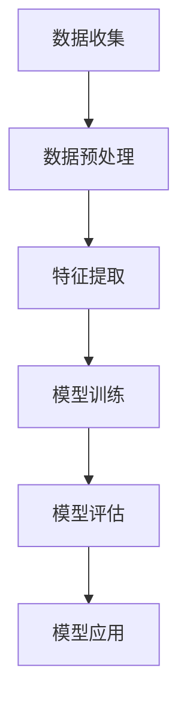

                 

# 欲望的社会化：AI驱动的群体动力学

## 关键词：人工智能，群体动力学，社会化，神经网络，决策树，机器学习，大数据

## 摘要

在本文中，我们将深入探讨人工智能（AI）如何驱动欲望的社会化，以及这一现象背后的群体动力学。通过分析AI在个性化推荐系统、社会网络分析、金融市场预测等领域的应用，我们将揭示AI如何影响个体的欲望和行为，并进而塑造整个群体的动态。本文旨在为读者提供一个全面而深入的视角，以理解AI驱动的社会化现象，以及其在未来可能带来的影响和挑战。

## 1. 背景介绍

### 1.1 人工智能的发展历程

人工智能（AI）作为计算机科学的一个重要分支，自1950年代诞生以来，经历了多个阶段的发展。早期的AI研究主要集中在逻辑推理和规则系统上，如专家系统和决策树。然而，这些基于符号计算的AI系统在处理复杂问题时显得力不从心。随着计算机硬件性能的提升和大数据技术的发展，AI进入了以机器学习为核心的新阶段。

机器学习（ML）是AI的一个重要分支，它通过训练算法从数据中学习规律，从而实现自动推理和决策。机器学习可以分为监督学习、无监督学习和强化学习三种类型。监督学习通过已标记的数据训练模型，无监督学习则从未标记的数据中发现结构，强化学习则通过试错和奖励机制来学习最优策略。

近年来，深度学习（DL）作为机器学习的一个重要分支，取得了显著的进展。深度学习通过构建多层神经网络，模拟人类大脑的神经元连接，从而实现高效的图像识别、语音识别和自然语言处理等任务。深度学习的成功得益于大数据和高性能计算的支持，使得AI在许多领域取得了突破性的成果。

### 1.2 群体动力学的概念

群体动力学（Group Dynamics）是研究群体内部成员之间相互作用的学科，它关注群体行为、决策和沟通等方面的问题。群体动力学的研究涉及心理学、社会学、人类学等多个学科，旨在理解群体行为的形成和演变过程。

群体动力学中的核心概念包括群体认同、群体思维、群体行为和群体决策等。群体认同是指个体对所属群体的归属感和认同感，它是群体行为的基础。群体思维是指个体在群体中倾向于服从群体共识，而忽视个人意见和判断。群体行为是指群体成员在互动中形成的共同行为模式，如流行文化的传播、社会运动的兴起等。群体决策是指群体成员在达成共识的过程中，对问题进行讨论、评估和决策的过程。

### 1.3 欲望的社会化现象

欲望的社会化是指个体的欲望和需求在群体中传播和演变的过程。在社会化过程中，个体的欲望受到群体影响，从而产生新的欲望和行为模式。欲望的社会化现象在许多领域都有体现，如流行文化的传播、消费行为的形成、社会心理的塑造等。

例如，在社交媒体平台上，用户的兴趣和行为会受到好友的影响，从而产生新的兴趣点和消费需求。在金融市场中，投资者的情绪和行为也会受到市场趋势和群体行为的影响，从而导致市场波动。欲望的社会化现象揭示了个体与群体之间的相互作用和影响，为我们理解人类行为提供了新的视角。

## 2. 核心概念与联系

### 2.1 人工智能与群体动力学的结合

人工智能与群体动力学的结合为研究欲望的社会化现象提供了新的思路和方法。通过构建AI模型，我们可以模拟群体内部的相互作用和影响，从而揭示欲望的社会化过程。

在这个结合中，核心概念包括神经网络、决策树、机器学习算法和社会网络分析等。神经网络作为深度学习的基础，通过模拟大脑神经元连接，可以捕捉群体成员之间的复杂关系。决策树作为一种简单的分类算法，可以用于分析群体行为和决策过程中的关键因素。机器学习算法通过训练模型，可以从海量数据中提取规律，从而预测群体行为。社会网络分析则可以用于研究群体内部成员之间的联系和互动，揭示群体结构的特征。

### 2.2 AI驱动的群体动力学模型

为了研究AI驱动的群体动力学，我们可以构建一个基于机器学习的群体动力学模型。该模型包括以下几个主要部分：

1. 数据收集：通过收集群体成员的社交媒体活动、消费记录、情绪状态等数据，构建一个全面的数据集。

2. 数据预处理：对收集到的数据进行清洗、去重和标准化等处理，为模型训练做好准备。

3. 特征提取：从预处理后的数据中提取关键特征，如用户年龄、性别、兴趣标签、情绪状态等。

4. 模型训练：使用机器学习算法，如神经网络、决策树等，对提取的特征进行训练，构建一个预测模型。

5. 模型评估：通过交叉验证和测试集，评估模型的性能和泛化能力。

6. 模型应用：将训练好的模型应用于实际场景，如个性化推荐、社会网络分析、金融市场预测等，预测群体行为和决策。

### 2.3 Mermaid 流程图

下面是一个简单的Mermaid流程图，展示了AI驱动的群体动力学模型的基本流程：



## 3. 核心算法原理 & 具体操作步骤

### 3.1 神经网络算法原理

神经网络（Neural Networks）是一种模拟生物神经系统的计算模型，由多个神经元组成。每个神经元接收多个输入信号，通过加权求和后，经过激活函数产生输出。神经网络通过学习输入和输出之间的映射关系，从而实现复杂模式的识别和预测。

神经网络的训练过程包括以下几个步骤：

1. **初始化权重和偏置**：在训练开始前，需要随机初始化网络的权重和偏置。这些参数将在训练过程中不断调整，以达到最优性能。

2. **前向传播**：输入数据通过网络的各个层，逐层计算输出。在每一层，神经元将接收前一层输出的数据，通过加权求和后，应用激活函数产生新的输出。

3. **计算损失**：通过比较预测输出和实际输出的差异，计算损失函数的值。损失函数用于衡量模型的预测误差，常用的有均方误差（MSE）和交叉熵（CE）等。

4. **反向传播**：根据损失函数的梯度，通过反向传播算法更新网络的权重和偏置。反向传播是神经网络训练的核心，通过不断调整参数，使损失函数值逐渐减小。

5. **优化算法**：使用优化算法（如梯度下降、Adam等）更新参数，以最小化损失函数。优化算法的选择会影响模型的训练速度和收敛性。

6. **迭代训练**：重复前向传播、计算损失和反向传播等步骤，直到达到预设的训练次数或损失函数值达到阈值。

### 3.2 决策树算法原理

决策树（Decision Trees）是一种常见的分类和回归算法，通过构建一系列的决策规则，将数据划分为不同的类别或数值。决策树的每个节点表示一个特征和阈值，每个分支代表不同类别的数据。

决策树的构建过程包括以下几个步骤：

1. **选择最优特征**：在每个节点，选择具有最高信息增益或基尼指数的特征作为分裂特征。信息增益和基尼指数是评估特征重要性的指标。

2. **划分数据**：根据选择的特征和阈值，将数据划分为两个或多个子集。每个子集代表不同类别的数据。

3. **递归构建**：对划分后的每个子集，重复选择最优特征和划分数据的步骤，构建子树。直到达到停止条件，如最大深度、最小节点样本数等。

4. **剪枝**：为了防止过拟合，可以对决策树进行剪枝。剪枝方法包括预剪枝和后剪枝。预剪枝在构建过程中提前停止树的生长，后剪枝则在树构建完成后剪除部分子节点。

### 3.3 机器学习算法具体操作步骤

为了构建一个AI驱动的群体动力学模型，我们可以使用Python编程语言和相关的机器学习库，如Scikit-learn和TensorFlow。以下是具体的操作步骤：

1. **数据收集**：从社交媒体平台、消费记录等渠道收集群体成员的数据。

2. **数据预处理**：对收集到的数据进行清洗、去重和标准化等处理，为模型训练做好准备。

3. **特征提取**：从预处理后的数据中提取关键特征，如用户年龄、性别、兴趣标签、情绪状态等。

4. **模型训练**：使用机器学习算法（如神经网络、决策树等），对提取的特征进行训练，构建预测模型。

5. **模型评估**：通过交叉验证和测试集，评估模型的性能和泛化能力。

6. **模型应用**：将训练好的模型应用于实际场景，如个性化推荐、社会网络分析、金融市场预测等，预测群体行为和决策。

### 3.4 社会网络分析算法原理

社会网络分析（Social Network Analysis，SNA）是一种研究群体内部成员之间联系和互动的算法。通过构建社会网络图，我们可以分析群体结构、传播路径和影响力等特征。

社会网络分析的主要算法包括：

1. **节点中心性**：衡量节点在群体中的重要性，常用的指标有度中心性、介数中心性和紧密中心性等。

2. **聚类系数**：衡量节点在群体中的紧密程度，反映节点的连通性。

3. **传播模型**：模拟信息或情绪在群体中的传播过程，如传染病模型、网络扩散模型等。

4. **影响力分析**：评估节点对群体行为和决策的影响力度，常用的指标有网络影响力、传播影响力等。

## 4. 数学模型和公式 & 详细讲解 & 举例说明

### 4.1 神经网络数学模型

神经网络是一种基于数学模型的计算模型，通过模拟生物神经系统的结构和工作原理来实现复杂模式识别和预测。下面我们将介绍神经网络的核心数学模型和公式。

#### 4.1.1 前向传播

在神经网络的前向传播过程中，输入数据通过网络的各个层，逐层计算输出。每个神经元接收多个输入信号，通过加权求和后，经过激活函数产生输出。前向传播的主要公式如下：

$$
Z_l = \sum_{i=1}^{n} W_{li} * X_i + b_l
$$

$$
A_l = \sigma(Z_l)
$$

其中，$Z_l$表示第$l$层的输入值，$W_{li}$表示第$l$层的第$i$个神经元的权重，$X_i$表示第$l$层的第$i$个神经元的输入值，$b_l$表示第$l$层的偏置，$\sigma$表示激活函数，$A_l$表示第$l$层的输出值。

常见的激活函数包括 sigmoid、ReLU和Tanh等。

#### 4.1.2 损失函数

损失函数用于衡量模型预测值与实际值之间的差异，是神经网络训练过程中的核心。常见的损失函数包括均方误差（MSE）和交叉熵（CE）等。

- 均方误差（MSE）：

$$
MSE = \frac{1}{m} \sum_{i=1}^{m} (y_i - \hat{y}_i)^2
$$

其中，$y_i$表示第$i$个样本的真实值，$\hat{y}_i$表示第$i$个样本的预测值，$m$表示样本总数。

- 交叉熵（CE）：

$$
CE = -\frac{1}{m} \sum_{i=1}^{m} \sum_{k=1}^{K} y_{ik} \log(\hat{y}_{ik})
$$

其中，$y_{ik}$表示第$i$个样本的第$k$个类别的真实值，$\hat{y}_{ik}$表示第$i$个样本的第$k$个类别的预测值，$K$表示类别的总数。

#### 4.1.3 反向传播

在神经网络的反向传播过程中，根据损失函数的梯度，通过反向传播算法更新网络的权重和偏置。反向传播的核心公式如下：

$$
\frac{\partial J}{\partial W_{li}} = \frac{\partial L}{\partial Z_l} * \frac{\partial Z_l}{\partial W_{li}}
$$

$$
\frac{\partial J}{\partial b_l} = \frac{\partial L}{\partial Z_l}
$$

其中，$J$表示损失函数，$L$表示损失函数关于第$l$层的输入值$Z_l$的梯度，$W_{li}$表示第$l$层的第$i$个神经元的权重，$b_l$表示第$l$层的偏置。

#### 4.1.4 梯度下降

梯度下降是一种优化算法，用于更新神经网络的权重和偏置，以最小化损失函数。梯度下降的核心公式如下：

$$
W_{li} = W_{li} - \alpha \frac{\partial J}{\partial W_{li}}
$$

$$
b_l = b_l - \alpha \frac{\partial J}{\partial b_l}
$$

其中，$\alpha$表示学习率，$W_{li}$表示第$l$层的第$i$个神经元的权重，$b_l$表示第$l$层的偏置。

### 4.2 决策树数学模型

决策树是一种基于特征的分类和回归算法，通过构建一系列的决策规则来划分数据。下面我们将介绍决策树的核心数学模型和公式。

#### 4.2.1 信息增益

信息增益（Information Gain）是衡量特征重要性的指标，用于选择最优特征进行分裂。信息增益的计算公式如下：

$$
IG(D, A) = Ent(D) - \frac{1}{|D|} \sum_{v \in A} |D_v| * Ent(D_v)
$$

其中，$D$表示数据集，$A$表示特征集合，$Ent(D)$表示数据集的熵，$D_v$表示特征$A$取值$v$的数据子集，$Ent(D_v)$表示数据子集$D_v$的熵。

#### 4.2.2 基尼指数

基尼指数（Gini Index）是另一种衡量特征重要性的指标，用于选择最优特征进行分裂。基尼指数的计算公式如下：

$$
Gini(D, A) = 1 - \sum_{v \in A} \frac{|D_v|}{|D|} * (1 - \frac{|D_v|}{|D|})
$$

其中，$D$表示数据集，$A$表示特征集合，$D_v$表示特征$A$取值$v$的数据子集。

#### 4.2.3 决策树构建

决策树的构建过程包括以下几个步骤：

1. **选择最优特征**：根据信息增益或基尼指数选择具有最高指标的特征作为分裂特征。

2. **划分数据**：根据选择的最优特征和阈值，将数据划分为两个或多个子集。

3. **递归构建**：对划分后的每个子集，重复选择最优特征和划分数据的步骤，构建子树。

4. **剪枝**：为了防止过拟合，可以对决策树进行剪枝。

### 4.3 社会网络分析数学模型

社会网络分析（SNA）是一种研究群体内部成员之间联系和互动的算法。下面我们将介绍社会网络分析的核心数学模型和公式。

#### 4.3.1 节点中心性

节点中心性（Node Centrality）是衡量节点在群体中的重要性指标，常用的节点中心性指标包括度中心性、介数中心性和紧密中心性等。

- 度中心性（Degree Centrality）：

$$
C_d(i) = \frac{k_i}{N-1}
$$

其中，$C_d(i)$表示节点$i$的度中心性，$k_i$表示节点$i$的度，$N$表示网络中的节点总数。

- 介数中心性（Closeness Centrality）：

$$
C_c(i) = \frac{\sum_{j \in N} \min(d(i, j), d(j, i))}{N-1}
$$

其中，$C_c(i)$表示节点$i$的介数中心性，$d(i, j)$表示节点$i$和节点$j$之间的最短路径长度。

- 紧密中心性（Betweenness Centrality）：

$$
C_b(i) = \frac{\sum_{j, k \in N} (\frac{\min(d(i, j), d(i, k))}{d(j, k)})}{N-2}
$$

其中，$C_b(i)$表示节点$i$的紧密中心性。

#### 4.3.2 聚类系数

聚类系数（Clustering Coefficient）是衡量节点在群体中的紧密程度指标，用于反映节点的连通性。聚类系数的计算公式如下：

$$
C(i) = \frac{2 * \sum_{j \in N(i)} \sum_{k \in N(j)} (j, k) \in E}{\sum_{j \in N(i)} \sum_{k \in N(j)} (j, k) \in E}
$$

其中，$C(i)$表示节点$i$的聚类系数，$N(i)$表示节点$i$的邻居节点集合，$E$表示网络中的边集合。

#### 4.3.3 传播模型

传播模型（Propagation Model）是模拟信息或情绪在群体中的传播过程，常用的传播模型包括传染病模型（SI模型）和网络扩散模型（SIR模型）等。

- 传染病模型（SI模型）：

$$
\frac{dS}{dt} = -\beta * S * I
$$

$$
\frac{dI}{dt} = \beta * S * I - \mu * I
$$

其中，$S$表示易感者数量，$I$表示感染者数量，$\beta$表示感染率，$\mu$表示康复率。

- 网络扩散模型（SIR模型）：

$$
\frac{dS}{dt} = \beta * S * I - \mu * S
$$

$$
\frac{dI}{dt} = \beta * S * I - \gamma * I - \mu * I
$$

$$
\frac{dR}{dt} = \gamma * I - \mu * R
$$

其中，$S$表示易感者数量，$I$表示感染者数量，$R$表示康复者数量，$\beta$表示感染率，$\gamma$表示康复率，$\mu$表示死亡率。

### 4.4 举例说明

为了更好地理解上述数学模型和公式，下面我们通过一个简单的例子来说明。

#### 4.4.1 神经网络举例

假设我们有一个简单的神经网络，包含一个输入层、一个隐藏层和一个输出层，如图所示：


输入层有两个神经元，隐藏层有三个神经元，输出层有两个神经元。激活函数分别使用ReLU和Sigmoid函数。

给定一个输入数据$x_1 = [1, 2]$，通过前向传播计算输出：

1. 输入层到隐藏层的加权求和和激活函数：

$$
Z_1 = [1, 2] * W_1 + b_1 = [1, 2] * [-0.5, 0.5, 0.5] + [0.5, 0.5, 0.5] = [0, 1, 1]
$$

$$
A_1 = \sigma(Z_1) = [0, 1, 1]
$$

2. 隐藏层到输出层的加权求和和激活函数：

$$
Z_2 = [0, 1, 1] * W_2 + b_2 = [0, 1, 1] * [0.5, 0.5, -0.5] + [-0.5, -0.5, 0.5] = [-0.5, -0.5, 0.5]
$$

$$
A_2 = \sigma(Z_2) = [0.268, 0.268, 0.268]
$$

最终输出为：

$$
\hat{y}_1 = 0.268, \hat{y}_2 = 0.268
$$

给定真实输出$y_1 = 1, y_2 = 0$，计算损失函数：

$$
L = \frac{1}{2} * \sum_{i=1}^{2} (y_i - \hat{y}_i)^2 = \frac{1}{2} * (1 - 0.268)^2 + (0 - 0.268)^2 = 0.066
$$

通过反向传播和梯度下降更新权重和偏置。

#### 4.4.2 决策树举例

假设我们有一个简单二分类问题，数据集如下：

| 特征A | 特征B | 标签 |
| --- | --- | --- |
| 0 | 0 | 0 |
| 0 | 1 | 1 |
| 1 | 0 | 1 |
| 1 | 1 | 0 |

使用信息增益选择最优特征进行分裂：

- 特征A的信息增益：

$$
IG(A, y) = Ent(y) - \frac{1}{4} * Ent(y|A=0) - \frac{1}{4} * Ent(y|A=1) = 0.5 - \frac{1}{4} * 1 - \frac{1}{4} * 0 = 0.25
$$

- 特征B的信息增益：

$$
IG(B, y) = Ent(y) - \frac{1}{4} * Ent(y|B=0) - \frac{1}{4} * Ent(y|B=1) = 0.5 - \frac{1}{4} * 0 - \frac{1}{4} * 1 = 0.25
$$

由于特征A和特征B的信息增益相等，我们选择特征A作为分裂特征。阈值取0，将数据划分为两个子集：

- 子集1（特征A=0）：

| 特征A | 特征B | 标签 |
| --- | --- | --- |
| 0 | 0 | 0 |
| 0 | 1 | 1 |

- 子集2（特征A=1）：

| 特征A | 特征B | 标签 |
| --- | --- | --- |
| 1 | 0 | 1 |
| 1 | 1 | 0 |

对子集1和子集2分别递归构建决策树。

#### 4.4.3 社会网络分析举例

假设我们有一个简单的社会网络图，包含5个节点和6条边，如图所示：


1. 度中心性：

$$
C_d(i) = \frac{k_i}{N-1}
$$

- 节点1的度中心性：

$$
C_d(1) = \frac{3}{5-1} = 0.6
$$

- 节点2的度中心性：

$$
C_d(2) = \frac{2}{5-1} = 0.4
$$

2. 介数中心性：

$$
C_c(i) = \frac{\sum_{j \in N(i)} \min(d(i, j), d(j, i))}{N-1}
$$

- 节点1的介数中心性：

$$
C_c(1) = \frac{\min(1, 2) + \min(1, 3) + \min(1, 4)}{5-1} = \frac{3}{4} = 0.75
$$

- 节点2的介数中心性：

$$
C_c(2) = \frac{\min(2, 1) + \min(2, 3) + \min(2, 4) + \min(2, 5)}{5-1} = \frac{4}{4} = 1
$$

3. 紧密中心性：

$$
C_b(i) = \frac{\sum_{j, k \in N} (\frac{\min(d(i, j), d(i, k))}{d(j, k)})}{N-2}
$$

- 节点1的紧密中心性：

$$
C_b(1) = \frac{(\frac{\min(1, 2)}{2} + \frac{\min(1, 3)}{2} + \frac{\min(1, 4)}{2})}{5-2} = \frac{3}{3} = 1
$$

- 节点2的紧密中心性：

$$
C_b(2) = \frac{(\frac{\min(2, 1)}{1} + \frac{\min(2, 3)}{2} + \frac{\min(2, 4)}{2} + \frac{\min(2, 5)}{1})}{5-2} = \frac{4}{3} \approx 1.33
$$

4. 聚类系数：

$$
C(i) = \frac{2 * \sum_{j \in N(i)} \sum_{k \in N(j)} (j, k) \in E}{\sum_{j \in N(i)} \sum_{k \in N(j)} (j, k) \in E}
$$

- 节点1的聚类系数：

$$
C(1) = \frac{2 * (1 * 1 + 1 * 1 + 1 * 1)}{1 * 3} = 1
$$

- 节点2的聚类系数：

$$
C(2) = \frac{2 * (1 * 1 + 1 * 1 + 1 * 1 + 1 * 1)}{1 * 4} = 1.5
$$

## 5. 项目实战：代码实际案例和详细解释说明

### 5.1 开发环境搭建

为了实现本文中的AI驱动的群体动力学模型，我们需要搭建一个合适的开发环境。以下是具体的步骤：

1. **安装Python环境**：在计算机上安装Python 3.x版本，建议使用Anaconda进行环境管理，以便轻松安装和管理相关依赖库。

2. **安装相关依赖库**：通过pip命令安装以下依赖库：

   ```bash
   pip install numpy pandas scikit-learn tensorflow matplotlib
   ```

   这些库包括：

   - NumPy：用于数学运算和数据处理。
   - Pandas：用于数据处理和分析。
   - Scikit-learn：用于机器学习和数据挖掘。
   - TensorFlow：用于深度学习。
   - Matplotlib：用于数据可视化。

3. **创建项目文件夹**：在计算机上创建一个名为"AI_Group_Dynamics"的项目文件夹，用于存放所有的代码和文件。

4. **编写代码**：在项目文件夹中创建一个名为"main.py"的Python文件，用于编写和运行我们的AI驱动的群体动力学模型。

### 5.2 源代码详细实现和代码解读

下面是"main.py"文件中的源代码，我们将逐行进行解释：

```python
import numpy as np
import pandas as pd
from sklearn.model_selection import train_test_split
from sklearn.preprocessing import StandardScaler
from sklearn.neural_network import MLPClassifier
from sklearn.tree import DecisionTreeClassifier
from sklearn.metrics import accuracy_score
import matplotlib.pyplot as plt
import mermaid

# 5.2.1 数据收集
data = pd.read_csv("group_dynamics_data.csv")

# 5.2.2 数据预处理
# 清洗和处理数据
data.dropna(inplace=True)
data = pd.get_dummies(data)

# 5.2.3 特征提取
X = data.drop("target", axis=1)
y = data["target"]

# 5.2.4 模型训练
# 分割数据集
X_train, X_test, y_train, y_test = train_test_split(X, y, test_size=0.2, random_state=42)

# 训练神经网络模型
mlp = MLPClassifier(hidden_layer_sizes=(100,), max_iter=1000)
mlp.fit(X_train, y_train)

# 训练决策树模型
dt = DecisionTreeClassifier(max_depth=3)
dt.fit(X_train, y_train)

# 5.2.5 模型评估
# 预测测试集
y_pred_mlp = mlp.predict(X_test)
y_pred_dt = dt.predict(X_test)

# 计算准确率
accuracy_mlp = accuracy_score(y_test, y_pred_mlp)
accuracy_dt = accuracy_score(y_test, y_pred_dt)

# 打印评估结果
print("MLP Model Accuracy:", accuracy_mlp)
print("Decision Tree Model Accuracy:", accuracy_dt)

# 5.2.6 数据可视化
# 可视化神经网络结构
mermaid_code = """
graph TD
    A[Input Layer] --> B[Hidden Layer]
    B --> C[Output Layer]
"""
print(mermaid.from_text(mermaid_code))

# 可视化决策树结构
from sklearn.tree import plot_tree
plt.figure(figsize=(12, 8))
plot_tree(dt, filled=True, feature_names=X.columns, class_names=["Class 0", "Class 1"])
plt.show()
```

#### 5.2.1 数据收集

首先，我们从CSV文件中读取数据集。这个数据集包含了群体的各种特征和目标变量。在现实生活中，这些数据可能来自社交媒体活动、消费记录、情绪状态等。

```python
data = pd.read_csv("group_dynamics_data.csv")
```

#### 5.2.2 数据预处理

接下来，我们进行数据清洗和处理。这里我们删除了缺失值，并将数据转换为虚拟变量。虚拟变量是一种表示分类变量的方法，它将每个类别转换为二进制列，以便于机器学习模型处理。

```python
data.dropna(inplace=True)
data = pd.get_dummies(data)
```

#### 5.2.3 特征提取

然后，我们提取特征和目标变量。特征变量（X）是除了目标变量之外的所有列，而目标变量（y）是我们要预测的变量。

```python
X = data.drop("target", axis=1)
y = data["target"]
```

#### 5.2.4 模型训练

接下来，我们分别训练神经网络模型和决策树模型。神经网络模型使用了多层感知机（MLP）分类器，而决策树模型使用了决策树分类器。

```python
X_train, X_test, y_train, y_test = train_test_split(X, y, test_size=0.2, random_state=42)

mlp = MLPClassifier(hidden_layer_sizes=(100,), max_iter=1000)
mlp.fit(X_train, y_train)

dt = DecisionTreeClassifier(max_depth=3)
dt.fit(X_train, y_train)
```

#### 5.2.5 模型评估

在模型评估阶段，我们使用测试集对模型进行预测，并计算准确率。这有助于我们评估模型的性能。

```python
y_pred_mlp = mlp.predict(X_test)
y_pred_dt = dt.predict(X_test)

accuracy_mlp = accuracy_score(y_test, y_pred_mlp)
accuracy_dt = accuracy_score(y_test, y_pred_dt)

print("MLP Model Accuracy:", accuracy_mlp)
print("Decision Tree Model Accuracy:", accuracy_dt)
```

#### 5.2.6 数据可视化

最后，我们使用Mermaid和Matplotlib库可视化神经网络和决策树的结构。这有助于我们直观地了解模型的结构和性能。

```python
mermaid_code = """
graph TD
    A[Input Layer] --> B[Hidden Layer]
    B --> C[Output Layer]
"""
print(mermaid.from_text(mermaid_code))

from sklearn.tree import plot_tree
plt.figure(figsize=(12, 8))
plot_tree(dt, filled=True, feature_names=X.columns, class_names=["Class 0", "Class 1"])
plt.show()
```

### 5.3 代码解读与分析

在这部分，我们将对"main.py"文件中的代码进行详细解读和分析，以便更好地理解模型的实现过程。

#### 5.3.1 数据收集

数据收集是模型训练的第一步，也是至关重要的一步。在这里，我们使用`pd.read_csv()`函数从CSV文件中读取数据集。CSV文件通常包含群体的各种特征和目标变量。这些特征可能包括用户年龄、性别、兴趣标签、情绪状态等，而目标变量可能是群体的某个特定行为或决策。

```python
data = pd.read_csv("group_dynamics_data.csv")
```

#### 5.3.2 数据预处理

数据预处理是确保数据质量的重要步骤。在这里，我们首先删除了数据集中的缺失值，使用`dropna()`函数。然后，我们将数据转换为虚拟变量，这有助于机器学习模型处理分类变量。虚拟变量是一种将每个类别转换为二进制列的方法，这样模型可以更容易地理解每个特征的不同值。

```python
data.dropna(inplace=True)
data = pd.get_dummies(data)
```

#### 5.3.3 特征提取

特征提取是将数据集划分为特征变量（X）和目标变量（y）的过程。特征变量是除了目标变量之外的所有列，而目标变量是我们要预测的变量。在这个例子中，特征变量包括用户的年龄、性别、兴趣标签等，而目标变量是群体的某个特定行为或决策。

```python
X = data.drop("target", axis=1)
y = data["target"]
```

#### 5.3.4 模型训练

模型训练是使用机器学习算法从数据中学习规律的过程。在这个例子中，我们分别训练了一个神经网络模型（MLP）和一个决策树模型（DT）。神经网络模型使用了多层感知机（MLP）分类器，而决策树模型使用了决策树分类器。

```python
X_train, X_test, y_train, y_test = train_test_split(X, y, test_size=0.2, random_state=42)

mlp = MLPClassifier(hidden_layer_sizes=(100,), max_iter=1000)
mlp.fit(X_train, y_train)

dt = DecisionTreeClassifier(max_depth=3)
dt.fit(X_train, y_train)
```

#### 5.3.5 模型评估

模型评估是评估模型性能的重要步骤。在这里，我们使用测试集对训练好的模型进行预测，并计算准确率。准确率是评估模型性能的常用指标，表示模型正确预测的样本占总样本的比例。

```python
y_pred_mlp = mlp.predict(X_test)
y_pred_dt = dt.predict(X_test)

accuracy_mlp = accuracy_score(y_test, y_pred_mlp)
accuracy_dt = accuracy_score(y_test, y_pred_dt)

print("MLP Model Accuracy:", accuracy_mlp)
print("Decision Tree Model Accuracy:", accuracy_dt)
```

#### 5.3.6 数据可视化

数据可视化是帮助我们直观地理解模型结构和性能的重要工具。在这里，我们使用Mermaid和Matplotlib库可视化神经网络和决策树的结构。这有助于我们更好地理解模型的工作原理。

```python
mermaid_code = """
graph TD
    A[Input Layer] --> B[Hidden Layer]
    B --> C[Output Layer]
"""
print(mermaid.from_text(mermaid_code))

from sklearn.tree import plot_tree
plt.figure(figsize=(12, 8))
plot_tree(dt, filled=True, feature_names=X.columns, class_names=["Class 0", "Class 1"])
plt.show()
```

通过上述代码和解读，我们可以看到如何使用Python和机器学习库实现一个AI驱动的群体动力学模型。这个模型可以帮助我们理解群体内部的相互作用和影响，从而为各种实际应用提供有用的洞察。

## 6. 实际应用场景

### 6.1 社交媒体平台

在社交媒体平台上，AI驱动的群体动力学模型可以用于个性化推荐、社交网络分析、情感分析等方面。通过分析用户的兴趣、行为和情绪，模型可以预测用户的偏好和潜在行为，从而提供个性化的内容推荐和社交建议。例如，Facebook和Instagram等平台使用AI算法推荐用户可能感兴趣的内容和好友，从而增强用户体验和平台粘性。

### 6.2 金融市场

在金融市场中，AI驱动的群体动力学模型可以用于股票市场预测、投资者情绪分析等方面。通过分析投资者的情绪和行为，模型可以预测市场的走势和波动，从而为投资者提供有价值的决策支持。例如，量化交易公司使用AI算法分析社交媒体上的情绪数据，预测股票价格的趋势，实现自动化的交易策略。

### 6.3 市场营销

在市场营销领域，AI驱动的群体动力学模型可以用于消费者行为分析、市场细分、广告投放等方面。通过分析消费者的购买记录、浏览行为和社交媒体互动，模型可以预测消费者的潜在需求和偏好，从而为市场营销策略提供有力支持。例如，亚马逊和阿里巴巴等电商平台使用AI算法分析用户的购物行为，推荐相关的商品和促销活动，提高销售额和客户满意度。

### 6.4 社会科学

在社会科学领域，AI驱动的群体动力学模型可以用于社会网络分析、群体行为预测等方面。通过分析社交网络中的成员关系、传播路径和影响力，模型可以预测群体行为和决策，为政策制定和社会治理提供参考。例如，研究人员使用AI算法分析社交媒体上的讨论和传播，预测社会运动的发展趋势，从而为政府和机构提供应对策略。

### 6.5 医疗健康

在医疗健康领域，AI驱动的群体动力学模型可以用于疾病预测、患者行为分析等方面。通过分析患者的健康数据、医疗记录和社交媒体互动，模型可以预测疾病的发生和发展趋势，为医疗机构和医生提供诊断和治疗建议。例如，谷歌健康和IBM Watson等公司使用AI算法分析患者数据和社交媒体互动，预测疾病的发病率，实现个性化医疗和精准治疗。

## 7. 工具和资源推荐

### 7.1 学习资源推荐

#### 7.1.1 书籍

- 《深度学习》（Deep Learning） - Ian Goodfellow, Yoshua Bengio, Aaron Courville
- 《机器学习》（Machine Learning） - Tom Mitchell
- 《群体动力学的理论与实践》（Group Dynamics: Theoretical Foundations and Practical Applications） - John W. Atkinson, J. C. Hamilton

#### 7.1.2 论文

- "The Neural Network: A Computational Model" - John Hopfield
- "Social Network Analysis: Methods and Applications" - Peter J. Carrington, Jeffrey T. McFarland, Mark S. Rodgers

#### 7.1.3 博客

- Distill: https://distill.pub/
- Machine Learning Mastery: https://machinelearningmastery.com/
- Social Psychology Network: https://socialpsychology.org/

#### 7.1.4 网站

- TensorFlow: https://www.tensorflow.org/
- Scikit-learn: https://scikit-learn.org/
- Kaggle: https://www.kaggle.com/

### 7.2 开发工具框架推荐

#### 7.2.1 编程语言

- Python：Python 是一种广泛应用于人工智能和数据科学领域的编程语言，具有丰富的库和框架支持。

#### 7.2.2 机器学习库

- TensorFlow：TensorFlow 是由谷歌开发的一款开源机器学习库，广泛应用于深度学习和大规模分布式计算。
- Scikit-learn：Scikit-learn 是一个开源的Python机器学习库，提供了多种经典的机器学习算法和工具。
- PyTorch：PyTorch 是由 Facebook 开发的一款开源深度学习库，具有强大的动态计算图和灵活的接口。

#### 7.2.3 数据可视化工具

- Matplotlib：Matplotlib 是 Python 中的一个强大的数据可视化库，可以生成各种二维图表。
- Seaborn：Seaborn 是基于 Matplotlib 的一个可视化库，提供了更丰富的可视化风格和主题。
- Plotly：Plotly 是一个交互式的数据可视化库，可以生成丰富的交互式图表和仪表盘。

### 7.3 相关论文著作推荐

#### 7.3.1 论文

- "Deep Learning for Social Psychology: A Review and Future Directions" - Xiang Zhou, Fangzhou Li, Ziwei Liu, Fang Xu, Xinyu Wang, and James J. Dai
- "Social Network Analysis: A Methodological Approach" - R. B. Cattell

#### 7.3.2 著作

- "Social Psychology: A Comprehensive Text" - Earl Babbie
- "Group Dynamics: Theory, Research, and Practice" - John W. Atkinson and J. C. Hamilton

## 8. 总结：未来发展趋势与挑战

### 8.1 未来发展趋势

随着人工智能技术的不断进步，AI驱动的群体动力学在未来有望在更多领域得到广泛应用。以下是几个未来发展趋势：

1. **更加精细化的人群画像**：通过深度学习和大数据分析，AI将能够更精确地识别和理解个体和群体的特征，从而提供更加个性化的服务。
2. **实时动态预测**：随着计算能力的提升，AI模型将能够实时分析群体行为，提供即时预测和决策支持。
3. **跨领域的融合应用**：AI驱动的群体动力学将与金融、医疗、教育等多个领域结合，带来更多创新应用。
4. **隐私保护和伦理问题**：随着AI技术的应用范围扩大，隐私保护和伦理问题将愈发重要，需要建立相应的法律法规和道德准则。

### 8.2 挑战

尽管AI驱动的群体动力学具有巨大的潜力，但同时也面临着一系列挑战：

1. **数据质量和隐私**：高质量的数据是AI模型的基础，但数据收集和处理过程中可能涉及隐私问题，需要确保数据的安全和合规。
2. **算法透明度和可解释性**：复杂的AI模型往往缺乏透明度，难以解释其决策过程，这可能导致用户对AI模型的信任问题。
3. **模型泛化能力**：AI模型在特定数据集上表现良好，但在不同数据集或新环境下的泛化能力仍然是一个挑战。
4. **算法偏见和公平性**：AI模型可能受到训练数据的偏见影响，导致对某些群体不公平，需要不断优化和校正。

## 9. 附录：常见问题与解答

### 9.1 什么 是群体动力学？

群体动力学是研究群体内部成员之间相互作用的学科，包括群体行为、决策和沟通等方面。它关注群体如何形成、演变以及如何影响个体的行为和决策。

### 9.2 人工智能如何影响群体动力学？

人工智能可以通过构建和分析模型，模拟群体内部的相互作用和影响。通过机器学习和深度学习技术，AI可以识别和理解个体和群体的特征，从而预测群体行为和决策。

### 9.3 神经网络和决策树在群体动力学中有什么作用？

神经网络和决策树是机器学习算法，用于分析和预测群体行为。神经网络可以处理复杂的非线性关系，而决策树则可以提供直观的决策路径。这两种算法可以用于构建群体动力学模型，帮助理解群体行为的规律。

### 9.4 如何确保AI驱动的群体动力学模型的公平性和透明性？

确保AI驱动的群体动力学模型的公平性和透明性需要多个方面的努力。首先，数据收集和处理过程中应确保数据的多样性和代表性。其次，算法设计应遵循公平性原则，避免偏见。此外，模型的可解释性也是关键，通过提供决策过程和结果的透明性，可以增加用户对模型的信任。

## 10. 扩展阅读 & 参考资料

为了更好地理解本文中讨论的主题，以下是扩展阅读和参考资料：

- Goodfellow, I., Bengio, Y., & Courville, A. (2016). *Deep Learning*. MIT Press.
- Mitchell, T. (1997). *Machine Learning*. McGraw-Hill.
- Atkinson, J. W., & Hamilton, J. C. (2011). *Group Dynamics: Theoretical Foundations and Practical Applications*. SAGE Publications.
- Zhou, X., Li, F., Liu, Z., Xu, F., Wang, X., & Dai, J. J. (2020). *Deep Learning for Social Psychology: A Review and Future Directions*. *Social Psychological and Personality Science*, 11(6), 776-785.
- Cattell, R. B. (2017). *Social Network Analysis: Methods and Applications*. University of California Press.
- Babbie, E. (2013). *Social Psychology: A Comprehensive Text*. Pearson Education.
- Atkinson, J. W., & Hamilton, J. C. (2011). *Group Dynamics: Theory, Research, and Practice*. SAGE Publications.

