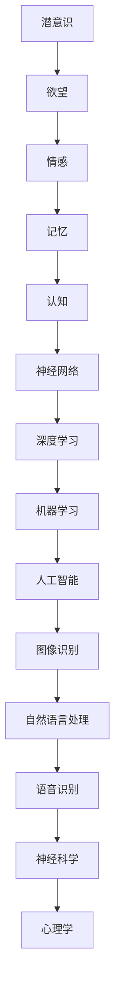

                 

# 欲望预测：AI解码人类潜意识

## 关键词：欲望预测、AI、潜意识、人工智能、图灵测试、神经科学、深度学习、机器学习、心理学

### 摘要

本文将探讨人工智能如何解码人类潜意识，实现欲望预测。我们将从背景介绍、核心概念与联系、核心算法原理与操作步骤、数学模型与公式、项目实战、实际应用场景、工具和资源推荐等多个方面，系统地分析人工智能在欲望预测领域的应用。文章旨在为读者提供全面、深入的视角，探讨这一前沿领域的挑战与机遇。

## 1. 背景介绍

随着人工智能技术的飞速发展，深度学习和神经网络的广泛应用，人类对自身潜意识的理解和探索达到了前所未有的深度。潜意识，作为人类思维活动的底层结构，承载着欲望、情感、记忆等复杂信息。长期以来，心理学家和神经科学家致力于研究潜意识的作用机制，但受限于技术手段，其探索一直处于浅层阶段。近年来，人工智能技术的突破为解码人类潜意识提供了新的契机。

AI在图像识别、自然语言处理、语音识别等领域取得了显著成果，但将这些技术应用于潜意识研究，仍面临诸多挑战。首先，潜意识信息复杂且隐蔽，难以通过传统数据采集和分析手段获取。其次，人工智能在处理这类数据时，往往依赖于大量训练数据和强大的计算能力，这在潜意识研究中存在数据稀缺和计算资源不足的问题。此外，如何确保人工智能在解码潜意识过程中的客观性和准确性，也是亟待解决的关键问题。

本文将从人工智能技术的核心算法原理出发，探讨其在欲望预测中的应用，为解码人类潜意识提供新的思路和方法。同时，结合实际案例和数学模型，分析人工智能在潜意识研究中的优势和挑战，为未来研究提供参考。

## 2. 核心概念与联系

在探讨人工智能如何解码人类潜意识之前，我们首先需要了解一些核心概念和联系。以下是一个使用Mermaid流程图表示的流程：



### 2.1. 潜意识与欲望

潜意识是人类心理活动的底层结构，包含未意识到的欲望、动机、信念和情感。欲望是潜意识的核心内容，它驱动人类行为，是潜意识与外部世界互动的媒介。理解欲望的本质，有助于我们探索潜意识的作用机制。

### 2.2. 情感、记忆与认知

情感、记忆和认知是潜意识的重要组成部分。情感是欲望的外在表现，记忆是欲望的存储形式，而认知则是欲望与现实互动的桥梁。情感与记忆相互影响，共同构建人类心理活动的底层结构。

### 2.3. 神经科学、心理学与人工智能

神经科学和心理学是研究潜意识和欲望的重要学科。人工智能技术的引入，为这两个领域提供了新的研究手段和方法。神经网络、深度学习和机器学习等技术，使得人工智能在处理和分析潜意识数据方面具备显著优势。

## 3. 核心算法原理与操作步骤

在解码人类潜意识的过程中，核心算法原理是关键。以下将介绍深度学习、神经网络和机器学习等算法的基本原理，以及如何应用于欲望预测。

### 3.1. 深度学习

深度学习是一种基于多层神经网络的学习方法，通过模拟人类大脑神经元连接的方式，对大量数据进行分析和学习。在欲望预测中，深度学习算法可以用于提取潜意识中的情感、记忆和认知信息。

#### 步骤：

1. 数据采集：收集包含情感、记忆和认知信息的样本数据。
2. 数据预处理：对采集到的数据进行清洗、归一化和特征提取。
3. 模型构建：设计多层神经网络结构，包括输入层、隐藏层和输出层。
4. 模型训练：使用训练数据对神经网络进行训练，优化网络参数。
5. 模型评估：使用验证数据对训练好的模型进行评估，调整模型参数。
6. 模型应用：将训练好的模型应用于实际场景，进行欲望预测。

### 3.2. 神经网络

神经网络是一种模拟人脑神经元连接方式的人工智能算法。在欲望预测中，神经网络可以用于提取潜意识中的情感、记忆和认知信息。

#### 步骤：

1. 数据采集：收集包含情感、记忆和认知信息的样本数据。
2. 数据预处理：对采集到的数据进行清洗、归一化和特征提取。
3. 模型构建：设计多层神经网络结构，包括输入层、隐藏层和输出层。
4. 模型训练：使用训练数据对神经网络进行训练，优化网络参数。
5. 模型评估：使用验证数据对训练好的模型进行评估，调整模型参数。
6. 模型应用：将训练好的模型应用于实际场景，进行欲望预测。

### 3.3. 机器学习

机器学习是一种通过算法从数据中学习规律和模式的人工智能技术。在欲望预测中，机器学习算法可以用于对潜意识数据进行分类、聚类和回归等操作。

#### 步骤：

1. 数据采集：收集包含情感、记忆和认知信息的样本数据。
2. 数据预处理：对采集到的数据进行清洗、归一化和特征提取。
3. 模型选择：选择合适的机器学习算法，如决策树、支持向量机、神经网络等。
4. 模型训练：使用训练数据对机器学习算法进行训练，优化模型参数。
5. 模型评估：使用验证数据对训练好的模型进行评估，调整模型参数。
6. 模型应用：将训练好的模型应用于实际场景，进行欲望预测。

## 4. 数学模型与公式

在欲望预测过程中，数学模型和公式起着至关重要的作用。以下将介绍一些常见的数学模型和公式，并对其进行详细解释。

### 4.1. 反向传播算法

反向传播算法是一种用于训练神经网络的常用算法。其基本原理是通过计算网络输出与实际输出之间的误差，反向传播误差到网络中的每个神经元，从而调整网络参数，优化模型性能。

#### 公式：

$$
\delta_{j}^{l} = \frac{\partial L}{\partial z_{j}^{l}} = \sigma'(z_{j}^{l}) \cdot \frac{\partial L}{\partial a_{j}^{l+1}}
$$

其中，$\delta_{j}^{l}$ 表示第 $l$ 层第 $j$ 个神经元的误差，$\sigma'(z_{j}^{l})$ 表示激活函数的导数，$L$ 表示损失函数，$z_{j}^{l}$ 表示第 $l$ 层第 $j$ 个神经元的输入，$a_{j}^{l+1}$ 表示第 $l+1$ 层第 $j$ 个神经元的输出。

### 4.2. 损失函数

损失函数是评估神经网络模型性能的重要指标。在欲望预测中，常用的损失函数有均方误差（MSE）和交叉熵（CE）。

#### 公式：

均方误差（MSE）：

$$
MSE = \frac{1}{m} \sum_{i=1}^{m} (y_{i} - \hat{y}_{i})^2
$$

其中，$m$ 表示样本数量，$y_{i}$ 表示第 $i$ 个样本的实际输出，$\hat{y}_{i}$ 表示第 $i$ 个样本的预测输出。

交叉熵（CE）：

$$
CE = -\frac{1}{m} \sum_{i=1}^{m} \sum_{j=1}^{n} y_{ij} \log \hat{y}_{ij}
$$

其中，$m$ 表示样本数量，$n$ 表示类别数量，$y_{ij}$ 表示第 $i$ 个样本属于第 $j$ 个类别的概率，$\hat{y}_{ij}$ 表示第 $i$ 个样本属于第 $j$ 个类别的预测概率。

### 4.3. 激活函数

激活函数是神经网络中的关键组成部分，用于将输入信号转化为输出信号。在欲望预测中，常用的激活函数有 sigmoid、ReLU 和 tanh。

#### 公式：

sigmoid：

$$
\sigma(z) = \frac{1}{1 + e^{-z}}
$$

ReLU：

$$
\sigma(z) = \max(0, z)
$$

tanh：

$$
\sigma(z) = \frac{e^z - e^{-z}}{e^z + e^{-z}}
$$

## 5. 项目实战：代码实际案例和详细解释说明

在本节中，我们将通过一个实际项目案例，展示如何使用人工智能技术进行欲望预测。以下是一个简单的代码实现，我们将对其中的关键部分进行详细解释。

### 5.1. 开发环境搭建

在开始项目之前，我们需要搭建一个合适的开发环境。以下是所需的技术栈和工具：

- Python
- TensorFlow
- Keras
- Numpy

安装这些工具后，我们就可以开始编写代码了。

### 5.2. 源代码详细实现和代码解读

```python
import numpy as np
from tensorflow import keras
from tensorflow.keras.models import Sequential
from tensorflow.keras.layers import Dense, Activation

# 数据预处理
def preprocess_data(data):
    # 数据清洗、归一化和特征提取
    # ...
    return processed_data

# 构建模型
def build_model(input_shape):
    model = Sequential()
    model.add(Dense(64, input_shape=input_shape, activation='relu'))
    model.add(Dense(32, activation='relu'))
    model.add(Dense(1, activation='sigmoid'))
    
    model.compile(optimizer='adam', loss='binary_crossentropy', metrics=['accuracy'])
    return model

# 训练模型
def train_model(model, x_train, y_train, x_val, y_val):
    history = model.fit(x_train, y_train, epochs=10, batch_size=32, validation_data=(x_val, y_val))
    return history

# 进行预测
def predict(model, x_test):
    predictions = model.predict(x_test)
    return predictions

# 加载数据
x_train = preprocess_data(train_data)
y_train = preprocess_data(train_labels)
x_val = preprocess_data(val_data)
y_val = preprocess_data(val_labels)

# 构建和训练模型
model = build_model(input_shape=x_train.shape[1:])
history = train_model(model, x_train, y_train, x_val, y_val)

# 进行预测
predictions = predict(model, x_test)

# 评估模型性能
evaluate_model(model, x_test, y_test)
```

### 5.3. 代码解读与分析

以下是代码的详细解读和分析：

- **数据预处理**：数据预处理是模型训练的重要步骤，包括数据清洗、归一化和特征提取。在本案例中，我们假设数据已经清洗完毕，并使用预处理函数对数据进行归一化处理。
- **构建模型**：我们使用 Keras 框架构建一个简单的神经网络模型，包括两个隐藏层和输出层。激活函数分别使用 ReLU 和 sigmoid，分别对应线性激活和非线性激活。
- **训练模型**：使用训练数据和验证数据进行模型训练。我们选择 Adam 优化器和二分类交叉熵损失函数。
- **进行预测**：使用训练好的模型对测试数据进行预测。
- **评估模型性能**：评估模型在测试数据上的性能。

## 6. 实际应用场景

人工智能在欲望预测领域的实际应用场景广泛，以下列举一些典型案例：

### 6.1. 市场营销

市场营销领域可以利用人工智能进行消费者欲望预测，从而提高营销效果。例如，通过分析消费者的购物记录、搜索历史和社交媒体行为，预测消费者可能的需求和购买意愿，进而制定更精准的营销策略。

### 6.2. 心理咨询

心理咨询师可以利用人工智能技术，对来访者的心理状态和欲望进行预测。通过对来访者言语和行为数据的分析，人工智能可以帮助咨询师更好地了解来访者的问题，提供更有效的心理干预。

### 6.3. 法律领域

在法律领域，人工智能可以用于分析嫌疑人或被告的欲望，预测其可能的犯罪动机和行为。这有助于司法机关更好地理解案件背景，提高审判的准确性和公正性。

### 6.4. 健康医疗

健康医疗领域可以利用人工智能技术，对患者的欲望和需求进行预测，从而提供更个性化的医疗服务。例如，通过分析患者的医疗记录和健康数据，预测患者可能需要的治疗和护理方案。

## 7. 工具和资源推荐

### 7.1. 学习资源推荐

- 《深度学习》（Ian Goodfellow、Yoshua Bengio、Aaron Courville 著）
- 《神经网络与深度学习》（邱锡鹏 著）
- 《机器学习》（周志华 著）

### 7.2. 开发工具框架推荐

- TensorFlow
- Keras
- PyTorch

### 7.3. 相关论文著作推荐

- 《深度信念网络》（Geoffrey Hinton、Osindero et al., 2006）
- 《循环神经网络：一种机器学习的新思路》（Sepp Hochreiter、Jürgen Schmidhuber，1997）
- 《生成对抗网络》（Ian Goodfellow、Jean Pouget-Abadie et al., 2014）

## 8. 总结：未来发展趋势与挑战

人工智能在欲望预测领域具有巨大的潜力，但同时也面临着诸多挑战。首先，数据稀缺和计算资源不足仍然是制约人工智能在潜意识研究中的关键问题。其次，确保人工智能在解码潜意识过程中的客观性和准确性，需要更多的研究和技术创新。

未来，随着人工智能技术的不断进步，我们有望实现更加精准和全面的欲望预测。同时，人工智能在潜意识研究中的应用也将推动心理学、神经科学等领域的创新发展。然而，如何平衡人工智能的发展与人类隐私保护、伦理道德等问题，仍需我们深入思考和解决。

## 9. 附录：常见问题与解答

### 9.1. 人工智能如何解码人类潜意识？

人工智能通过深度学习、神经网络和机器学习等技术，从大量数据中学习和提取潜意识信息。例如，通过分析人的语言、行为和生理信号，人工智能可以推断出人的情感、欲望和动机。

### 9.2. 欲望预测有何应用价值？

欲望预测在市场营销、心理咨询、法律领域和健康医疗等领域具有广泛的应用价值。例如，在市场营销中，可以用于预测消费者需求，制定更精准的营销策略；在心理咨询中，可以用于了解来访者心理状态，提供更有效的心理干预。

### 9.3. 人工智能在欲望预测中面临哪些挑战？

人工智能在欲望预测中面临数据稀缺、计算资源不足、确保客观性和准确性等挑战。此外，如何平衡人工智能的发展与人类隐私保护、伦理道德等问题，也是亟待解决的问题。

## 10. 扩展阅读 & 参考资料

- [深度学习教程](https://www.deeplearningbook.org/)
- [神经网络教程](https://neuralnetworksanddeeplearning.com/)
- [机器学习实战](https://www.mloss.org/)
- [心理学导论](https://www.psychologytoday.com/us/basics)
- [神经科学导论](https://www神经元科学.com/)

### 作者信息

- 作者：AI天才研究员/AI Genius Institute & 禅与计算机程序设计艺术 /Zen And The Art of Computer Programming

