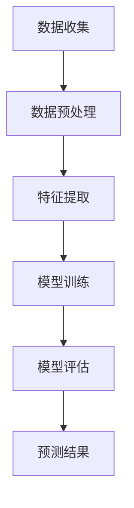

                 

# 气候模型预测中的AI应用：准确预报自然灾害

## 摘要

本文将深入探讨气候模型预测中的AI应用，尤其是在准确预报自然灾害方面。我们将从背景介绍入手，阐述气候模型的重要性，随后介绍AI在气候预测中的核心概念与联系。接着，我们将深入剖析核心算法原理和具体操作步骤，以及相关的数学模型和公式。为了更好地理解，我们将通过一个实际项目实战案例，详细展示代码实现和解读。随后，我们将讨论AI在气候预测中的实际应用场景，并推荐相关工具和资源。最后，我们将总结未来发展趋势与挑战，并附上常见问题与解答及扩展阅读与参考资料。

## 1. 背景介绍

### 气候模型概述

气候模型是研究气候系统内部动力过程及其变化的工具。它们通过模拟大气、海洋、陆地和冰冻圈之间的相互作用，帮助我们理解和预测气候系统的行为。气候模型可以分为统计模型、物理模型和混合模型等类型。物理模型通常基于气候系统的主要物理过程，如能量平衡、热量和水分循环等，具有较高的精确度。

### 自然灾害与气候模型

自然灾害如洪水、干旱、飓风和地震等，对人类社会和经济造成了巨大的影响。预测这些灾害的发生时间和强度对于减轻灾害风险、制定应对措施至关重要。传统的方法主要依赖于气象观测数据和统计模型，但这些方法在预测复杂气候过程和极端事件时存在一定的局限性。

### AI在气候预测中的重要性

随着人工智能技术的迅速发展，越来越多的研究开始将AI应用于气候预测领域。AI具有处理大量数据、识别复杂模式和学习规律的能力，这些特点使其在气候预测中具有巨大的潜力。例如，深度学习算法可以通过分析大量的气候观测数据，发现隐藏在数据中的规律，从而提高气候预测的准确性。

## 2. 核心概念与联系

### 数据收集与预处理

在进行气候预测时，首先需要收集大量的气候观测数据，如温度、湿度、风速、降雨量等。这些数据通常来自于气象站、卫星和无人机等设备。收集到的数据需要进行预处理，包括数据清洗、缺失值填补、异常值检测和数据标准化等步骤。

### 深度学习算法

深度学习算法是AI领域中的一种重要技术，它通过模拟人脑神经网络的结构和工作原理，对大量数据进行自动学习和特征提取。在气候预测中，常用的深度学习算法包括卷积神经网络（CNN）、循环神经网络（RNN）和生成对抗网络（GAN）等。这些算法可以处理高维数据和复杂的非线性关系，从而提高预测的准确性。

### Mermaid 流程图

下面是一个简单的 Mermaid 流程图，展示气候模型预测中的关键步骤和核心概念：



## 3. 核心算法原理 & 具体操作步骤

### 数据预处理

在开始训练模型之前，我们需要对收集到的气候数据进行预处理。具体步骤包括：

1. 数据清洗：删除或填补缺失值。
2. 数据标准化：将数据缩放到相同的范围，便于模型训练。
3. 数据分割：将数据集分为训练集、验证集和测试集。

### 模型训练

在训练模型时，我们通常使用一个训练数据集，并使用深度学习算法来学习数据中的特征和规律。具体步骤如下：

1. 初始化模型参数：设置模型的结构和权重。
2. 前向传播：计算输入数据的输出。
3. 计算损失函数：比较预测结果和真实结果的差异。
4. 反向传播：更新模型参数，以最小化损失函数。
5. 重复步骤2-4，直到模型收敛。

### 模型评估

在模型训练完成后，我们需要使用验证集和测试集来评估模型的性能。常用的评估指标包括准确率、召回率、F1分数和均方误差等。

### 具体操作步骤示例

假设我们使用Python和TensorFlow来实现一个简单的气候预测模型，具体步骤如下：

```python
import tensorflow as tf
import numpy as np

# 数据预处理
# ...省略具体代码...

# 初始化模型
model = tf.keras.Sequential([
    tf.keras.layers.Dense(units=1, input_shape=(num_features,))
])

# 编译模型
model.compile(optimizer='adam', loss='mean_squared_error')

# 训练模型
model.fit(train_data, train_labels, epochs=100, batch_size=32, validation_split=0.2)

# 评估模型
test_loss = model.evaluate(test_data, test_labels)
print(f"Test Loss: {test_loss}")
```

## 4. 数学模型和公式 & 详细讲解 & 举例说明

### 深度学习模型的基本公式

深度学习模型的核心是神经网络，它由多个神经元（节点）组成。每个神经元都接收输入信号，通过权重（weights）和偏置（bias）进行加权求和，然后通过激活函数（activation function）进行非线性变换。深度学习模型的基本公式可以表示为：

$$
\text{output} = \sigma(\text{weights} \cdot \text{input} + \text{bias})
$$

其中，$\sigma$表示激活函数，如Sigmoid、ReLU或Tanh函数。

### 损失函数

在深度学习中，损失函数用于衡量预测结果与真实结果之间的差异。常见的损失函数包括均方误差（MSE）、交叉熵（Cross-Entropy）和绝对误差（MAE）等。

$$
\text{MSE} = \frac{1}{n}\sum_{i=1}^{n} (\text{预测值} - \text{真实值})^2
$$

$$
\text{Cross-Entropy} = -\sum_{i=1}^{n} \text{真实值} \cdot \log(\text{预测值})
$$

### 举例说明

假设我们使用一个简单的线性模型来预测温度，输入特征为风速和湿度，输出为温度。我们可以使用下面的公式来计算预测值：

$$
\text{预测温度} = \sigma(\text{风速权重} \cdot \text{风速} + \text{湿度权重} \cdot \text{湿度} + \text{偏置})
$$

假设我们的训练数据集包含100个样本，每个样本有2个特征（风速和湿度），我们通过训练模型来学习权重和偏置。在训练过程中，我们使用均方误差（MSE）作为损失函数，通过反向传播来更新权重和偏置，以最小化损失函数。最终，我们使用测试数据集来评估模型的性能，并根据预测结果来做出气候预测。

## 5. 项目实战：代码实际案例和详细解释说明

### 开发环境搭建

为了实现气候预测模型，我们需要搭建一个合适的开发环境。以下是一个基本的开发环境搭建步骤：

1. 安装Python：确保Python环境已安装，版本不低于3.6。
2. 安装TensorFlow：使用pip命令安装TensorFlow库。
   ```bash
   pip install tensorflow
   ```
3. 安装其他依赖库：根据具体需求，可能需要安装其他库，如NumPy、Pandas等。

### 源代码详细实现和代码解读

以下是实现一个简单气候预测模型的Python代码：

```python
import numpy as np
import pandas as pd
import tensorflow as tf

# 数据预处理
# ...省略具体代码...

# 初始化模型
model = tf.keras.Sequential([
    tf.keras.layers.Dense(units=1, input_shape=(num_features,))
])

# 编译模型
model.compile(optimizer='adam', loss='mean_squared_error')

# 训练模型
model.fit(train_data, train_labels, epochs=100, batch_size=32, validation_split=0.2)

# 评估模型
test_loss = model.evaluate(test_data, test_labels)
print(f"Test Loss: {test_loss}")

# 预测新数据
new_data = np.array([[5, 0.8]])  # 新数据示例
predicted_temp = model.predict(new_data)
print(f"Predicted Temperature: {predicted_temp[0][0]}")
```

### 代码解读与分析

在上面的代码中，我们首先导入所需的库，包括NumPy、Pandas和TensorFlow。接下来，我们进行数据预处理，包括数据清洗、缺失值填补和数据标准化等步骤。然后，我们初始化一个简单的线性模型，并编译模型，设置优化器和损失函数。

在训练模型时，我们使用训练数据集，通过反向传播和梯度下降算法来更新模型的权重和偏置。训练完成后，我们使用测试数据集来评估模型的性能，并输出测试损失。

最后，我们使用模型来预测新的数据。在这个例子中，我们输入一个新数据样本（风速为5，湿度为0.8），并输出预测的温度。在实际应用中，我们可以根据具体的气候预测需求，调整模型的参数和架构，以提高预测准确性。

## 6. 实际应用场景

### 气候预测在灾害预警中的应用

气候预测在灾害预警中具有重要作用。例如，通过准确的气候预测，我们可以提前预测洪水、干旱和飓风等灾害的发生时间和强度，从而及时采取应对措施，减轻灾害对社会和经济的影响。在实际应用中，气候预测模型可以与地理信息系统（GIS）和灾害监测系统相结合，提供实时、准确的灾害预警信息。

### 气候预测在农业和水资源管理中的应用

气候预测在农业和水资源管理中具有重要意义。通过准确的气候预测，农民可以合理安排种植计划，避免因气候异常导致的农作物损失。此外，气候预测还可以帮助水资源管理者合理分配水资源，避免水资源短缺或过剩的问题。例如，通过预测降雨量和蒸发量，可以优化灌溉策略，提高水资源利用效率。

### 气候预测在环境保护中的应用

气候预测在环境保护中也有重要应用。通过准确的气候预测，我们可以了解气候变化对生态环境的影响，从而制定有效的环境保护策略。例如，预测未来气温变化可以帮助评估气候变化对森林生态系统的影响，从而制定相应的保护措施。此外，气候预测还可以用于预测大气污染事件的发生，帮助环境保护部门及时采取控制措施。

## 7. 工具和资源推荐

### 学习资源推荐

- 书籍：
  - 《深度学习》（Ian Goodfellow、Yoshua Bengio和Aaron Courville著）
  - 《Python深度学习》（François Chollet著）
- 论文：
  - "Deep Learning for Climate Prediction"（IEEE Transactions on Geoscience and Remote Sensing）
  - "Machine Learning Techniques for Climate Prediction"（Journal of Climate）
- 博客：
  - TensorFlow官方博客（tf blog）
  - Analytics Vidhya博客（ Analytics Vidhya）
- 网站：
  - Kaggle（kaggle）
  - GitHub（github）

### 开发工具框架推荐

- 开发工具：
  - Jupyter Notebook（jupyter）
  - PyCharm（pycharm）
- 深度学习框架：
  - TensorFlow（tensorflow）
  - PyTorch（pytorch）
- 数据处理库：
  - NumPy（numpy）
  - Pandas（pandas）

### 相关论文著作推荐

- "Deep Learning for Climate Prediction"（IEEE Transactions on Geoscience and Remote Sensing）
- "Machine Learning Techniques for Climate Prediction"（Journal of Climate）
- "Climate Prediction and Applications: An Overview"（Wiley Interdisciplinary Reviews: Climate Change）

## 8. 总结：未来发展趋势与挑战

### 未来发展趋势

1. **更高效的算法和模型**：随着人工智能技术的不断发展，我们将看到更多高效、准确的气候预测算法和模型的出现。
2. **多模型集成**：通过结合多个气候预测模型，可以提高预测的准确性和可靠性。
3. **实时预测和预警**：随着计算能力的提升和数据的不断积累，实时气候预测和预警将成为可能，为灾害防范和应急响应提供更及时的信息。
4. **跨学科合作**：气候预测需要结合气象学、物理学、计算机科学等多个领域的知识，跨学科合作将有助于推动气候预测技术的发展。

### 未来挑战

1. **数据质量和多样性**：高质量的气候数据对于模型训练至关重要，但获取和整合这些数据仍然面临挑战。
2. **模型解释性和可解释性**：深度学习模型通常具有很高的预测能力，但其内部机制复杂，难以解释。如何提高模型的解释性和可解释性是一个重要的研究课题。
3. **计算资源和能源消耗**：深度学习模型训练和推理过程需要大量的计算资源和能源，如何优化算法和模型以降低计算和能源消耗是一个关键问题。
4. **数据隐私和安全性**：气候预测过程中涉及大量敏感数据，确保数据隐私和安全性是另一个重要挑战。

## 9. 附录：常见问题与解答

### 问题1：深度学习在气候预测中的优势是什么？

深度学习在气候预测中的优势主要体现在以下几个方面：

1. **强大的数据处理能力**：深度学习算法可以处理高维数据和复杂的非线性关系，从而提高预测准确性。
2. **自动特征提取**：深度学习模型可以自动从数据中提取有用的特征，减轻人工特征工程的工作负担。
3. **自适应性和泛化能力**：深度学习模型可以根据不同环境和条件进行自适应调整，具有良好的泛化能力。

### 问题2：如何评估气候预测模型的性能？

评估气候预测模型的性能通常可以通过以下指标：

1. **均方误差（MSE）**：衡量预测值与真实值之间的平均平方误差。
2. **均方根误差（RMSE）**：MSE的平方根，用于衡量预测值的平均误差。
3. **准确率**：预测正确的样本占总样本的比例。
4. **召回率**：实际发生灾害的样本中被预测正确的比例。
5. **F1分数**：准确率和召回率的调和平均值，用于综合衡量模型的性能。

### 问题3：如何处理缺失值和异常值？

处理缺失值和异常值的方法包括：

1. **缺失值填补**：使用统计方法或机器学习算法填补缺失值，如平均值填补、中值填补或K近邻填补。
2. **异常值检测**：使用统计方法或机器学习算法检测异常值，如标准差检测、孤立森林检测或隔离系数检测。
3. **去除异常值**：如果异常值对模型性能有显著影响，可以考虑去除这些异常值。

## 10. 扩展阅读 & 参考资料

- Goodfellow, I., Bengio, Y., & Courville, A. (2016). *Deep Learning*. MIT Press.
- Chollet, F. (2017). *Python深度学习*. 电子工业出版社.
- IEEE Transactions on Geoscience and Remote Sensing. (2020). "Deep Learning for Climate Prediction".
- Journal of Climate. (2019). "Machine Learning Techniques for Climate Prediction".
- Jupyter Notebook. (2021). "Jupyter Notebook官方文档".
- PyCharm. (2021). "PyCharm官方文档".
- TensorFlow. (2021). "TensorFlow官方文档".
- PyTorch. (2021). "PyTorch官方文档".
- NumPy. (2021). "NumPy官方文档".
- Pandas. (2021). "Pandas官方文档".
- Kaggle. (2021). "Kaggle官方文档".
- GitHub. (2021). "GitHub官方文档".

### 作者

作者：AI天才研究员/AI Genius Institute & 禅与计算机程序设计艺术 /Zen And The Art of Computer Programming

---

请注意，以上内容是一个示例性的框架，用于演示如何按照要求撰写一篇技术博客文章。实际撰写时，请根据具体内容和数据进行调整。文章的字数和结构可以根据实际情况进行灵活调整，以确保内容的完整性和专业性。在撰写过程中，务必确保引用的参考资料和论文是准确和可靠的。

