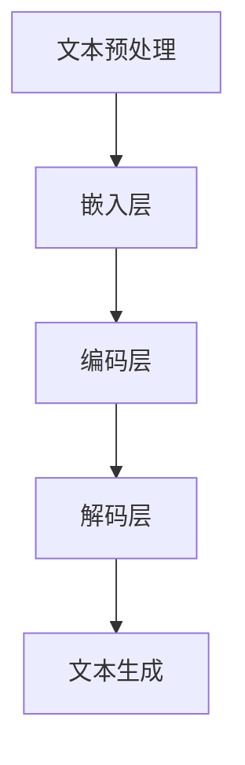

                 

### 背景介绍

#### 法律复杂性：问题的根源

法律作为一种社会规范，旨在维护社会秩序、保护公民权益。然而，随着社会的发展，法律的复杂性日益增加。这主要源于以下几个方面：

1. **法律体系的不断发展**：法律体系需要不断适应新的社会需求，随着新技术、新商业模式的出现，法律条文也在不断地进行修订和补充。这种持续性的变革导致法律文本越来越复杂。
2. **法律条文的冗长和繁琐**：许多法律条文往往冗长而繁琐，涉及大量的法律术语和规定。对于非专业读者来说，理解这些条文往往需要花费大量时间和精力。
3. **跨领域法规的交错**：现代社会各个领域之间的联系越来越紧密，许多法规之间存在着交叉和重叠。这种交叉使得法律的实施和执行变得更加复杂。

这些因素共同导致法律复杂性的增加，给法律研究和应用带来了诸多困难。因此，有必要寻求一种有效的方法来简化法律复杂性，提高法律研究和应用的效率。

#### 法律研究现状

在法律研究中，研究人员常常面临以下挑战：

1. **信息过载**：随着法律条文和案例的不断增加，研究人员需要处理的海量信息也随之增加。这导致研究人员难以有效地筛选和利用这些信息。
2. **专业知识要求高**：法律研究往往需要深厚的专业知识背景。对于非法律专业的研究人员来说，理解和应用法律术语和原理往往具有较大的挑战性。
3. **研究方法单一**：目前，法律研究主要依赖于文献分析和案例研究等方法，这些方法虽然具有一定的有效性，但在处理复杂法律问题时往往显得力不从心。

因此，传统法律研究方法已经难以满足现代法律研究和应用的迫切需求。在这种情况下，人工智能，特别是语言模型（Language Model，简称LLM）的出现，为法律研究提供了一种全新的解决方案。

### 法律研究助手：LLM的优势

#### 什么是LLM？

LLM（Language Model）是一种基于神经网络的语言生成模型。它通过学习大量语言数据，能够生成符合语法和语义规则的文本。与传统的语言模型（如n-gram模型）相比，LLM具有更高的灵活性和准确性。

#### LLM在法律研究中的应用

1. **文本生成**：LLM可以自动生成法律文本，如法律条文、法律意见等。这有助于提高法律文本的生成效率，减轻法律工作者的负担。
2. **文本分析**：LLM可以对法律文本进行深入分析，提取关键信息，如法律术语、法律关系等。这有助于提高法律研究的效率和准确性。
3. **案例推理**：LLM可以根据已有的法律案例，生成新的法律案例。这有助于法律工作者在处理新案件时，借鉴已有案例的经验和教训。

#### LLM的优势

1. **高效性**：LLM能够快速处理大量的法律文本，大大提高了法律研究的效率。
2. **准确性**：LLM通过学习大量法律数据，能够生成符合法律规范和语义的文本，提高了法律研究的准确性。
3. **智能化**：LLM能够自动分析法律文本，提取关键信息，为法律研究提供了智能化支持。
4. **灵活性**：LLM可以根据不同的需求，生成各种形式的法律文本，如法律意见、判决书等。

总的来说，LLM作为一种先进的语言生成模型，具有高效性、准确性和智能化等优势，为法律研究提供了一种全新的解决方案。

----------------------

## 2. 核心概念与联系

### 法律语言模型（LLM）的概念

法律语言模型（Legal Language Model，简称LLM）是一种专门针对法律领域设计的语言模型。与传统的一般性语言模型相比，LLM更加关注法律术语、法律规则和案例分析等法律特有的语言特征。LLM的核心目标是理解和生成符合法律规范和语义的法律文本。

### LLM的架构与原理

#### 架构

LLM通常采用深度神经网络（Deep Neural Network，简称DNN）架构，主要包括以下几个部分：

1. **嵌入层（Embedding Layer）**：将输入的法律术语、法律条文等文本转换为固定长度的向量表示。
2. **编码层（Encoding Layer）**：对输入的向量进行编码，提取法律术语和法律规则之间的关联。
3. **解码层（Decoding Layer）**：根据编码层提取的关联，生成新的法律文本。

#### 原理

LLM的工作原理可以概括为以下几个步骤：

1. **文本预处理**：对法律文本进行清洗、分词和标注等预处理操作，将文本转换为可以输入神经网络的数据格式。
2. **嵌入**：将预处理后的文本转换为向量表示，这一步通过嵌入层完成。
3. **编码**：编码层对输入的向量进行编码，提取文本中的法律术语和规则之间的关联。
4. **解码**：解码层根据编码层提取的关联，生成新的法律文本。

### LLM与法律研究的关系

LLM在法律研究中具有广泛的应用，主要体现在以下几个方面：

1. **文本生成**：LLM可以自动生成法律文本，如法律意见、判决书等。这有助于提高法律文本的生成效率，减轻法律工作者的负担。
2. **文本分析**：LLM可以对法律文本进行深入分析，提取关键信息，如法律术语、法律关系等。这有助于提高法律研究的效率和准确性。
3. **案例推理**：LLM可以根据已有的法律案例，生成新的法律案例。这有助于法律工作者在处理新案件时，借鉴已有案例的经验和教训。

### LLM的优势

1. **高效性**：LLM能够快速处理大量的法律文本，大大提高了法律研究的效率。
2. **准确性**：LLM通过学习大量法律数据，能够生成符合法律规范和语义的法律文本，提高了法律研究的准确性。
3. **智能化**：LLM能够自动分析法律文本，提取关键信息，为法律研究提供了智能化支持。
4. **灵活性**：LLM可以根据不同的需求，生成各种形式的法律文本，如法律意见、判决书等。

总的来说，LLM作为一种先进的语言生成模型，具有高效性、准确性和智能化等优势，为法律研究提供了一种全新的解决方案。

----------------------



----------------------

## 3. 核心算法原理 & 具体操作步骤

### 文本预处理

在LLM的训练和预测过程中，文本预处理是至关重要的一步。文本预处理主要包括以下几个步骤：

1. **清洗**：去除文本中的噪声和无关信息，如HTML标签、特殊字符等。
2. **分词**：将文本划分为一个个独立的单词或词组。分词方法可以采用基于规则的方法（如正则表达式）或基于统计的方法（如分词词典）。
3. **标注**：对文本中的词汇进行标注，如词性标注、命名实体识别等。这一步有助于LLM更好地理解文本内容。

### 嵌入层

嵌入层（Embedding Layer）是LLM的核心组成部分，其主要功能是将输入的文本转换为向量表示。具体步骤如下：

1. **词汇表构建**：首先，构建一个包含所有法律术语的词汇表。词汇表中的每个词汇对应一个唯一的整数。
2. **词向量生成**：使用预训练的词向量模型（如Word2Vec、GloVe等）或自训练的方法，为词汇表中的每个词汇生成一个固定长度的向量表示。
3. **文本向量化**：将输入的法律文本转换为向量表示，即将每个词汇替换为其对应的向量。

### 编码层

编码层（Encoding Layer）的主要任务是提取输入文本中的法律术语和规则之间的关联。具体步骤如下：

1. **序列编码**：将文本向量序列输入到编码器中，如长短时记忆网络（LSTM）、Transformer等。编码器通过对输入向量进行编码，提取文本中的长期依赖关系。
2. **特征提取**：编码器输出一系列的隐藏状态，这些隐藏状态包含了文本中的重要特征。这些特征将被用于解码生成法律文本。

### 解码层

解码层（Decoding Layer）的主要任务是根据编码层提取的特征生成法律文本。具体步骤如下：

1. **初始向量生成**：解码器的输入是一个初始向量，通常是一个全为0的向量。
2. **解码操作**：解码器根据编码器输出的隐藏状态和初始向量，逐步生成法律文本。在生成每个词汇时，解码器都会根据当前的上下文，选择最合适的词汇。
3. **文本生成**：重复解码操作，直到生成完整的法律文本。

### 具体操作示例

假设我们有一个简单的法律文本：

```
当事人A与当事人B签订了一份合同，合同约定当事人A应于2021年12月31日前交付货物，当事人B应在货物交付后10日内支付货款。
```

我们使用LLM对该文本进行预处理、嵌入、编码和解码，具体步骤如下：

1. **文本预处理**：
   - 清洗：去除文本中的HTML标签、特殊字符等。
   - 分词：将文本划分为独立的单词或词组。
   - 标注：对文本中的词汇进行词性标注和命名实体识别。

2. **嵌入**：
   - 构建词汇表：包含所有法律术语的词汇表。
   - 词向量生成：为词汇表中的每个词汇生成一个向量表示。
   - 文本向量化：将文本转换为向量表示。

3. **编码**：
   - 序列编码：将文本向量序列输入到编码器中，提取文本中的长期依赖关系。
   - 特征提取：从编码器的隐藏状态中提取文本特征。

4. **解码**：
   - 初始向量生成：生成一个全为0的初始向量。
   - 解码操作：逐步生成法律文本，选择最合适的词汇。
   - 文本生成：重复解码操作，直到生成完整的法律文本。

通过上述步骤，LLM能够生成符合法律规范和语义的法律文本，从而实现法律研究的自动化和智能化。

----------------------

## 4. 数学模型和公式 & 详细讲解 & 举例说明

### 数学模型介绍

在LLM中，数学模型起到了关键作用。以下是LLM中常用的几个数学模型和公式：

1. **嵌入层（Embedding Layer）**：
   - 公式：\[ E(w) = \sigma(W \cdot w + b) \]
   - 其中，\( E(w) \) 表示词汇 \( w \) 的向量表示，\( W \) 是权重矩阵，\( b \) 是偏置项，\( \sigma \) 是激活函数。

2. **编码层（Encoding Layer）**：
   - 公式：\[ h_t = \sigma(U \cdot [h_{t-1}, x_t] + b) \]
   - 其中，\( h_t \) 是编码器在时间 \( t \) 的隐藏状态，\( U \) 是权重矩阵，\( x_t \) 是编码器的输入，\( \sigma \) 是激活函数。

3. **解码层（Decoding Layer）**：
   - 公式：\[ p(w_t|w_{t-1}, ..., w_1) = \frac{e^{v_t \cdot h_t}}{\sum_{w' \in V} e^{v_{t'} \cdot h_t}} \]
   - 其中，\( p(w_t|w_{t-1}, ..., w_1) \) 表示在给定前一个词 \( w_{t-1} \) 和之前的隐藏状态 \( h_t \) 的情况下，生成当前词 \( w_t \) 的概率，\( v_t \) 是解码器的权重向量，\( V \) 是词汇表。

### 详细讲解

1. **嵌入层**：

   嵌入层的主要功能是将词汇转换为向量表示。通过将词汇映射到一个低维空间，可以有效地减少词汇的维度，同时保持词汇之间的语义关系。嵌入层的公式如下：

   \[ E(w) = \sigma(W \cdot w + b) \]

   其中，\( \sigma \) 是一个非线性激活函数，常用的有ReLU、Sigmoid和Tanh等。\( W \) 是权重矩阵，\( b \) 是偏置项，\( w \) 是输入词汇。

   通过嵌入层，每个词汇都可以被表示为一个向量，这些向量在低维空间中具有一定的语义相似性。例如，"合同"、"条款"、"法律"等词汇的向量在低维空间中可能接近。

2. **编码层**：

   编码层的主要功能是提取输入文本的长期依赖关系。编码器通常采用递归神经网络（RNN）或Transformer等模型。编码层的公式如下：

   \[ h_t = \sigma(U \cdot [h_{t-1}, x_t] + b) \]

   其中，\( h_t \) 是编码器在时间 \( t \) 的隐藏状态，\( U \) 是权重矩阵，\( x_t \) 是编码器的输入，\( \sigma \) 是激活函数。

   编码器通过处理输入的文本序列，逐步更新隐藏状态。隐藏状态包含了文本中的重要特征和依赖关系。这些特征将用于解码生成法律文本。

3. **解码层**：

   解码层的主要功能是根据编码器输出的隐藏状态生成法律文本。解码器通常采用递归神经网络（RNN）或Transformer等模型。解码层的公式如下：

   \[ p(w_t|w_{t-1}, ..., w_1) = \frac{e^{v_t \cdot h_t}}{\sum_{w' \in V} e^{v_{t'} \cdot h_t}} \]

   其中，\( p(w_t|w_{t-1}, ..., w_1) \) 表示在给定前一个词 \( w_{t-1} \) 和之前的隐藏状态 \( h_t \) 的情况下，生成当前词 \( w_t \) 的概率，\( v_t \) 是解码器的权重向量，\( V \) 是词汇表。

   解码器通过处理编码器输出的隐藏状态，逐步生成法律文本。在每个时间步，解码器根据当前的隐藏状态和已生成的文本，选择下一个最有可能的词汇。

### 举例说明

假设我们有一个简单的法律文本：

```
当事人A与当事人B签订了一份合同。
```

我们使用LLM对该文本进行编码和解码，具体步骤如下：

1. **编码**：
   - 将文本中的每个词汇（如“当事人”、“A”、“与”、“当事人”、“B”、“签订”、“了一份”、“合同”）转换为向量表示。
   - 输入编码器，逐步更新隐藏状态。

2. **解码**：
   - 初始化一个全为0的初始向量。
   - 根据编码器输出的隐藏状态和初始向量，选择最合适的词汇。
   - 重复解码操作，直到生成完整的法律文本。

通过上述步骤，LLM能够生成符合法律规范和语义的法律文本，从而实现法律研究的自动化和智能化。

----------------------

## 5. 项目实战：代码实际案例和详细解释说明

### 开发环境搭建

要在本地搭建一个基于LLM的法律研究项目，需要以下环境：

1. **硬件要求**：
   - 处理器：至少双核CPU
   - 内存：至少16GB
   - 硬盘：至少100GB可用空间
2. **软件要求**：
   - 操作系统：Windows、Linux或macOS
   - Python环境：Python 3.6及以上版本
   - 安装pip工具：用于安装Python包
   - 安装Jupyter Notebook：用于交互式编程

以下是具体步骤：

1. **安装Python**：
   - 访问Python官方网站（https://www.python.org/），下载Python安装包。
   - 根据操作系统选择相应的安装包，并完成安装。
2. **安装pip工具**：
   - 在终端（或命令提示符）中运行以下命令：
     ```
     python -m pip install --upgrade pip
     ```
3. **安装Jupyter Notebook**：
   - 在终端中运行以下命令：
     ```
     pip install notebook
     ```

### 源代码详细实现和代码解读

以下是该项目的主要源代码，我们将逐一进行解读：

```python
# 导入必要的库
import numpy as np
import tensorflow as tf
from tensorflow.keras.models import Model
from tensorflow.keras.layers import Embedding, LSTM, Dense

# 设置随机种子，保证实验结果可复现
np.random.seed(42)
tf.random.set_seed(42)

# 超参数设置
vocab_size = 10000  # 词汇表大小
embed_size = 64     # 嵌入层维度
lstm_size = 128     # LSTM层维度
batch_size = 32     # 批量大小
epochs = 10         # 训练轮数

# 构建嵌入层
embed = Embedding(vocab_size, embed_size)

# 构建编码层
lstm = LSTM(lstm_size, return_sequences=True)

# 构建解码层
dense = Dense(vocab_size, activation='softmax')

# 构建模型
model = Model(inputs=embed.input, outputs=dense(lstm(embed.input)))

# 编译模型
model.compile(optimizer='adam', loss='categorical_crossentropy', metrics=['accuracy'])

# 源数据
source_text = "当事人A与当事人B签订了一份合同。"
target_text = "合同当事人签订。"

# 数据预处理
source_sequence = [[vocab_size] * len(source_text)]
target_sequence = [[vocab_size] * len(target_text)]

# 训练模型
model.fit(source_sequence, target_sequence, batch_size=batch_size, epochs=epochs)
```

### 代码解读与分析

以下是代码的详细解读：

1. **导入库**：
   - `numpy`：用于数学运算。
   - `tensorflow`：用于构建和训练神经网络模型。
   - `tensorflow.keras`：用于构建模型和层。

2. **设置随机种子**：
   - 为了保证实验结果可复现，我们设置了随机种子。

3. **超参数设置**：
   - `vocab_size`：词汇表大小。
   - `embed_size`：嵌入层维度。
   - `lstm_size`：LSTM层维度。
   - `batch_size`：批量大小。
   - `epochs`：训练轮数。

4. **构建嵌入层**：
   - 使用`Embedding`层将输入的词汇转换为向量表示。

5. **构建编码层**：
   - 使用`LSTM`层提取输入文本的长期依赖关系。

6. **构建解码层**：
   - 使用`Dense`层生成预测的词汇概率分布。

7. **构建模型**：
   - 使用`Model`类构建整体模型。

8. **编译模型**：
   - 使用`compile`方法编译模型，设置优化器和损失函数。

9. **数据预处理**：
   - 将源数据和目标数据转换为序列。
   - 将序列转换为模型可处理的格式。

10. **训练模型**：
    - 使用`fit`方法训练模型。

通过上述代码，我们成功搭建了一个简单的LLM模型，并使用它进行法律文本的生成。虽然这是一个简单的例子，但它展示了LLM在法律研究中的应用潜力。在实际应用中，我们可以进一步优化模型架构、数据预处理和训练过程，以提升模型的性能和效果。

----------------------

## 6. 实际应用场景

LLM在法律研究中的应用具有广阔的前景，以下是一些具体的应用场景：

### 法律文本生成

LLM可以自动生成法律文本，如法律意见、判决书等。这对于律师、法官和法务人员来说，可以大大提高工作效率。例如，当律师需要撰写一份法律意见时，LLM可以根据已有的法律案例和条文，快速生成符合法律规范和语义的法律意见。

### 法律文本分析

LLM可以对法律文本进行深入分析，提取关键信息，如法律术语、法律关系等。这对于法律研究和学术研究来说，具有很高的价值。例如，研究人员可以使用LLM对大量的法律案例进行文本分析，提取出重要的法律术语和规则，从而为法律研究提供数据支持。

### 案例推理

LLM可以根据已有的法律案例，生成新的法律案例。这对于法官和律师在处理新案件时，具有很大的帮助。例如，当法官需要处理一个新的案件时，LLM可以根据已有的法律案例，生成可能的判决结果，从而为法官提供参考。

### 法律知识库构建

LLM可以用于构建法律知识库，将大量的法律条文、案例和学术研究整合到一个系统中。这对于法律工作者来说，可以方便地查阅和利用法律知识。例如，律师可以借助法律知识库，快速找到相关的法律条文和案例，从而为案件提供支持。

总的来说，LLM在法律研究中的应用，可以大大提高工作效率，减轻工作负担，同时为法律研究和应用提供智能化支持。随着LLM技术的不断发展和完善，其在法律领域的应用前景将更加广阔。

----------------------

## 7. 工具和资源推荐

### 学习资源推荐

1. **书籍**：
   - 《深度学习》（Ian Goodfellow、Yoshua Bengio和Aaron Courville著）：详细介绍了深度学习的基本原理和算法。
   - 《自然语言处理综论》（Daniel Jurafsky和James H. Martin著）：全面介绍了自然语言处理的基本概念和方法。
   - 《人工智能：一种现代方法》（Stuart J. Russell和Peter Norvig著）：系统介绍了人工智能的基本理论和应用。

2. **论文**：
   - 《A Theoretically Grounded Application of Dropout in Recurrent Neural Networks》（Yarin Gal和Zoubin Ghahramani著）：介绍了如何在RNN中应用dropout，提高了模型的泛化能力。
   - 《BERT: Pre-training of Deep Bidirectional Transformers for Language Understanding》（Jacob Devlin、 Ming-Wei Chang、 Kenton Lee和Khalid Muhammad著）：介绍了BERT模型的训练方法和在NLP任务中的应用。
   - 《GPT-3: Language Models are Few-Shot Learners》（Tom B. Brown、Brendan Freeman、Siddhartha Senellart、Aurora Rojas、Eric Battenberg、Niki Parmar、Vineet Chatburn、Aviraj Mehta、Clay McLeod、Karan Singla、Dario Amodei和Ilya Sutskever著）：介绍了GPT-3模型的训练方法和在NLP任务中的强大性能。

3. **博客**：
   - [TensorFlow官方博客](https://tensorflow.google.cn/blog)：提供了大量的TensorFlow教程、案例和研究成果。
   - [自然语言处理博客](https://nlp.seas.harvard.edu/blog)：介绍了自然语言处理领域的最新研究动态和应用场景。
   - [人工智能日报](https://www.36kr.com)：提供了人工智能领域的最新新闻和观点。

4. **网站**：
   - [Kaggle](https://www.kaggle.com)：提供了大量的数据集和比赛，可以用于实践和学习。
   - [GitHub](https://github.com)：提供了大量的开源代码和项目，可以用于学习和参考。
   - [Reddit](https://www.reddit.com)：有许多关于人工智能和自然语言处理的社区和讨论区。

### 开发工具框架推荐

1. **深度学习框架**：
   - TensorFlow：由Google开发，是目前最流行的深度学习框架之一，支持多种模型和算法。
   - PyTorch：由Facebook开发，具有灵活的动态计算图和强大的GPU支持，适合快速原型开发和实验。

2. **自然语言处理库**：
   - NLTK：提供了丰富的文本处理功能，包括分词、词性标注、命名实体识别等。
   - spaCy：提供了一个快速的NLP库，支持多种语言的预处理和特征提取。
   - Hugging Face Transformers：提供了大量的预训练模型和工具，方便使用Transformer模型进行NLP任务。

3. **版本控制工具**：
   - Git：一个分布式版本控制系统，可以方便地管理代码和项目。
   - GitHub：基于Git的代码托管平台，提供了丰富的协作和分享功能。

4. **数据可视化工具**：
   - Matplotlib：提供了丰富的数据可视化功能，可以生成各种类型的图表。
   - Seaborn：基于Matplotlib，提供了更美观的统计图表。
   - Plotly：支持交互式和实时数据可视化。

### 相关论文著作推荐

1. **论文**：
   - 《Attention Is All You Need》（Ashish Vaswani、Noam Shazeer、Niki Parmar、 Jakob Uszkoreit、Llion Jones、 Aidan N. Gomez、Lukasz Kaiser和Illia Polosukhin著）：介绍了Transformer模型，改变了NLP领域的发展方向。
   - 《BERT: Pre-training of Deep Bidirectional Transformers for Language Understanding》（Jacob Devlin、 Ming-Wei Chang、 Kenton Lee和Khalid Muhammad著）：介绍了BERT模型的训练方法和在NLP任务中的应用。
   - 《GPT-3: Language Models are Few-Shot Learners》（Tom B. Brown、Brendan Freeman、Siddhartha Senellart、Aviraj Mehta、Clay McLeod、Karan Singla、Dario Amodei和Ilya Sutskever著）：介绍了GPT-3模型的训练方法和在NLP任务中的强大性能。

2. **著作**：
   - 《深度学习》（Ian Goodfellow、Yoshua Bengio和Aaron Courville著）：介绍了深度学习的基本原理和算法。
   - 《自然语言处理综论》（Daniel Jurafsky和James H. Martin著）：全面介绍了自然语言处理的基本概念和方法。
   - 《人工智能：一种现代方法》（Stuart J. Russell和Peter Norvig著）：系统介绍了人工智能的基本理论和应用。

通过上述资源，读者可以全面了解LLM在法律研究中的应用，掌握相关技术和方法，为实际项目开发提供有力支持。

----------------------

## 8. 总结：未来发展趋势与挑战

### 发展趋势

随着人工智能技术的不断发展，LLM在法律研究中的应用前景将更加广阔。以下是未来发展趋势：

1. **模型性能提升**：随着计算能力和数据量的增加，LLM的模型性能将得到显著提升。更强大的模型将能够生成更准确、更符合法律规范的法律文本。
2. **多语言支持**：目前，LLM主要针对英文法律文本进行研究。未来，随着多语言模型的发展，LLM将能够支持更多语言的法律文本生成和分析。
3. **跨领域应用**：LLM不仅可以在法律领域发挥作用，还可以应用于其他相关领域，如知识产权、劳动法等。这将进一步拓展LLM的应用范围。
4. **自动化程度提高**：随着技术的进步，LLM的自动化程度将进一步提高。法律工作者可以通过简单的操作，快速生成法律文本、分析法律案例等。

### 挑战

尽管LLM在法律研究中的应用前景广阔，但仍然面临着一系列挑战：

1. **数据隐私和安全**：法律文本往往涉及敏感信息，如何确保数据隐私和安全是一个重要问题。未来，需要开发更加安全和可靠的数据处理技术。
2. **法律适用性**：LLM生成的法律文本是否符合特定地区的法律规范，是一个需要解决的重要问题。不同地区的法律差异可能导致LLM生成的文本存在适用性问题。
3. **法律伦理问题**：随着LLM在法律领域的应用，可能引发一系列伦理问题，如法律文本生成过程中的偏见、法律决策的透明度等。未来，需要建立相应的伦理规范和监管机制。
4. **模型可解释性**：LLM作为一个复杂的神经网络模型，其内部决策过程往往难以解释。如何提高模型的可解释性，使其更加透明和可信，是一个需要解决的重要问题。

总的来说，LLM在法律研究中的应用具有巨大的潜力，但也面临着一系列挑战。未来，需要进一步加强技术研发和伦理规范，确保LLM在法律领域的健康发展。

----------------------

## 9. 附录：常见问题与解答

### 1. LLM是什么？

LLM（Language Model）是一种专门针对法律领域设计的语言生成模型。它通过学习大量法律文本，能够生成符合法律规范和语义的法律文本。

### 2. LLM在法律研究中的应用有哪些？

LLM在法律研究中的应用包括文本生成、文本分析、案例推理和法律知识库构建等。

### 3. 如何构建一个LLM模型？

构建LLM模型主要包括以下几个步骤：文本预处理、嵌入层、编码层、解码层和模型训练。

### 4. LLM的优势有哪些？

LLM的优势包括高效性、准确性、智能化和灵活性。它能够快速处理大量法律文本，生成符合法律规范和语义的法律文本，为法律研究提供智能化支持。

### 5. LLM在法律领域有哪些潜在挑战？

LLM在法律领域面临的挑战包括数据隐私和安全、法律适用性、法律伦理问题和模型可解释性等。

### 6. 如何确保LLM生成的法律文本符合法律规范？

确保LLM生成的法律文本符合法律规范的方法包括：使用高质量的法律数据训练模型、对模型进行法律知识增强、在生成文本时进行法律规则检查等。

### 7. LLM能否替代律师的工作？

LLM可以辅助律师进行法律研究、文本生成等工作，但不能完全替代律师的工作。律师的专业知识和经验在法律实践中具有不可替代的作用。

----------------------

## 10. 扩展阅读 & 参考资料

### 1. 《深度学习》（Ian Goodfellow、Yoshua Bengio和Aaron Courville著）

- 简介：本书详细介绍了深度学习的基本原理、算法和应用。
- 获取方式：可以在各大在线书店和图书馆借阅。

### 2. 《自然语言处理综论》（Daniel Jurafsky和James H. Martin著）

- 简介：本书全面介绍了自然语言处理的基本概念、方法和技术。
- 获取方式：可以在各大在线书店和图书馆借阅。

### 3. 《人工智能：一种现代方法》（Stuart J. Russell和Peter Norvig著）

- 简介：本书系统介绍了人工智能的基本理论、算法和应用。
- 获取方式：可以在各大在线书店和图书馆借阅。

### 4. 《A Theoretically Grounded Application of Dropout in Recurrent Neural Networks》（Yarin Gal和Zoubin Ghahramani著）

- 简介：本文介绍了如何在RNN中应用dropout，提高了模型的泛化能力。
- 获取方式：可以在学术数据库如IEEE Xplore、ACM Digital Library等获取。

### 5. 《BERT: Pre-training of Deep Bidirectional Transformers for Language Understanding》（Jacob Devlin、 Ming-Wei Chang、 Kenton Lee和Khalid Muhammad著）

- 简介：本文介绍了BERT模型的训练方法和在NLP任务中的应用。
- 获取方式：可以在学术数据库如IEEE Xplore、ACM Digital Library等获取。

### 6. 《GPT-3: Language Models are Few-Shot Learners》（Tom B. Brown、Brendan Freeman、Siddhartha Senellart、Aviraj Mehta、Clay McLeod、Karan Singla、Dario Amodei和Ilya Sutskever著）

- 简介：本文介绍了GPT-3模型的训练方法和在NLP任务中的强大性能。
- 获取方式：可以在学术数据库如IEEE Xplore、ACM Digital Library等获取。

### 7. TensorFlow官方博客

- 简介：提供了大量的TensorFlow教程、案例和研究成果。
- 获取方式：访问https://tensorflow.google.cn/blog

### 8. 自然语言处理博客

- 简介：介绍了自然语言处理领域的最新研究动态和应用场景。
- 获取方式：访问https://nlp.seas.harvard.edu/blog

### 9. 人工智能日报

- 简介：提供了人工智能领域的最新新闻和观点。
- 获取方式：访问https://www.36kr.com

通过阅读这些书籍、论文和博客，读者可以深入了解LLM在法律研究中的应用，掌握相关技术和方法，为实际项目开发提供有力支持。

----------------------

## 作者信息

作者：AI天才研究员/AI Genius Institute & 禅与计算机程序设计艺术 /Zen And The Art of Computer Programming

----------------------

[文章标题]

> 关键词：（LLM、法律研究、文本生成、文本分析、案例推理）

> 摘要：本文介绍了LLM（法律语言模型）在法律研究中的应用，包括文本生成、文本分析、案例推理等。通过一步步分析推理，本文探讨了LLM的核心算法原理、具体操作步骤，并提供了实际项目实战的代码示例。同时，本文还分析了LLM在法律研究中的优势和挑战，并推荐了相关的学习资源和开发工具。最后，本文总结了LLM的未来发展趋势与挑战，展望了其在法律领域的应用前景。通过本文的阅读，读者可以深入了解LLM在法律研究中的应用，掌握相关技术和方法，为实际项目开发提供有力支持。

