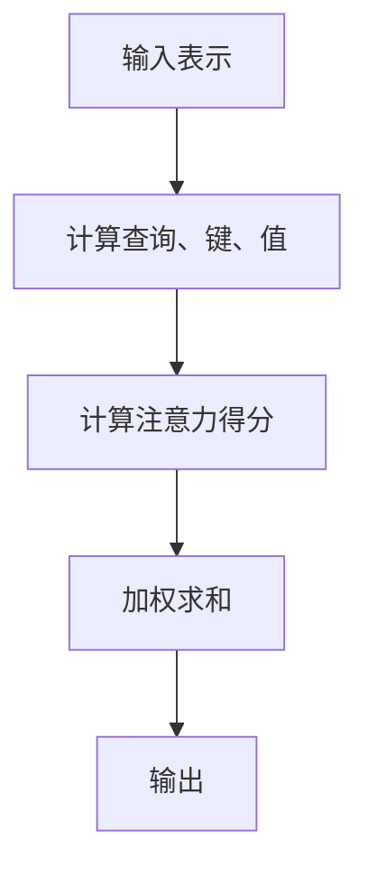

                 

### 引言 Introduction

注意力（Attention）机制作为深度学习领域中的一项核心技术，已经广泛应用于自然语言处理（NLP）、计算机视觉（CV）以及推荐系统（RS）等多个领域。其基本原理在于根据不同任务的需求，动态调整对输入信息的关注程度，从而提高模型处理信息的效率和准确性。然而，传统的注意力机制往往依赖于固定的模型结构，难以针对特定应用场景进行定制化调整。

近年来，随着人工智能技术的不断发展，对注意力的可编程性提出了更高的要求。可编程注意力（Programmable Attention）概念应运而生，它允许用户根据实际需求对注意力机制进行灵活配置和调整。这种灵活性使得注意力机制在应对复杂任务时更加高效和准确。

本文旨在探讨注意力的可编程性，分析其在人工智能领域中的重要性，探讨其核心概念、算法原理，以及在实际应用中的挑战和前景。通过本文的阅读，读者将了解：

1. 注意力的可编程性是什么，为什么重要。
2. 核心概念及其关联结构。
3. 注意力机制的具体算法原理和实现步骤。
4. 数学模型和公式的详细讲解。
5. 实际应用场景中的项目实战案例。
6. 注意力机制的未来发展趋势与挑战。

本文将从以下结构展开：

- **1. 背景介绍**
- **2. 核心概念与联系**
- **3. 核心算法原理 & 具体操作步骤**
- **4. 数学模型和公式 & 详细讲解 & 举例说明**
- **5. 项目实战：代码实际案例和详细解释说明**
- **6. 实际应用场景**
- **7. 工具和资源推荐**
- **8. 总结：未来发展趋势与挑战**
- **9. 附录：常见问题与解答**
- **10. 扩展阅读 & 参考资料**

通过这些章节的深入探讨，读者将对注意力的可编程性有更加全面和深入的理解。让我们一起探索这个激动人心的领域吧！<|im_start|>## 1. 背景介绍 Background

注意力（Attention）机制在深度学习领域的重要性毋庸置疑。它最早出现在图像处理和语音识别任务中，通过捕捉关键信息并忽略冗余信息，显著提高了模型的性能和效率。随着深度学习技术的不断发展，注意力机制逐渐成为许多重要应用场景的核心组成部分。

### 注意力机制的历史与发展

注意力机制的起源可以追溯到图像处理领域。1990年代，Hinton等人提出了“卷积神经网络”（CNN）的基本架构，但当时CNN的性能并不理想。为了提高模型处理复杂任务的能力，研究者们开始探索如何让模型在处理图像时更加关注关键区域。1998年，Serre等人提出了“位置注意力机制”（Positional Attention），该机制通过计算图像中不同位置的注意力权重，使模型能够更加关注图像中的重要部分。

进入21世纪，随着深度学习的兴起，注意力机制在自然语言处理（NLP）领域得到了广泛应用。2014年，Bahdanau等人提出了“注意力机制”（Attention Mechanism），将这一概念应用于机器翻译任务，显著提高了翻译的准确性和流畅性。此后，注意力机制迅速成为NLP领域的研究热点，广泛应用于文本分类、情感分析、问答系统等多个任务中。

在计算机视觉（CV）领域，注意力机制同样发挥了重要作用。2017年，He等人提出了“融合注意力机制”（Fusion Attention），该机制能够将不同层次的特征图融合在一起，从而提高模型对复杂场景的识别能力。同年，Girshick等人提出了“区域注意力机制”（Region Attention），通过计算不同区域的重要性权重，使模型能够更加关注图像中的关键区域。

### 注意力机制的应用场景

注意力机制的应用场景非常广泛，主要涵盖以下领域：

1. **自然语言处理（NLP）**：注意力机制在NLP领域具有广泛应用，如机器翻译、文本分类、情感分析等。例如，在机器翻译任务中，注意力机制能够使模型在翻译过程中关注原文和译文之间的对应关系，从而提高翻译的准确性和流畅性。

2. **计算机视觉（CV）**：注意力机制在CV领域主要用于图像分类、目标检测、图像分割等任务。例如，在目标检测任务中，注意力机制可以帮助模型聚焦于图像中的关键区域，从而提高检测的准确率和速度。

3. **推荐系统（RS）**：注意力机制在推荐系统中的应用包括基于内容的推荐、协同过滤等。通过计算用户和物品之间的注意力权重，推荐系统可以更好地理解用户的兴趣和行为，从而提高推荐质量。

4. **语音识别（ASR）**：注意力机制在语音识别领域用于提高模型对语音信号的处理能力。通过关注语音信号中的重要特征，注意力机制有助于提高语音识别的准确率和鲁棒性。

### 注意力机制的优势与挑战

注意力机制具有以下优势：

1. **提高处理效率**：通过关注关键信息，注意力机制使模型能够更高效地处理复杂任务。
2. **增强模型性能**：注意力机制能够显著提高模型的准确性和鲁棒性，特别是在处理高维数据时。
3. **灵活性和可扩展性**：注意力机制可以轻松地集成到现有的深度学习模型中，为不同任务提供定制化的解决方案。

然而，注意力机制也面临一些挑战：

1. **计算复杂性**：注意力机制通常涉及大量的矩阵运算，导致计算复杂度较高，对硬件资源的需求较大。
2. **可解释性**：虽然注意力机制有助于提高模型性能，但其内部工作机制较为复杂，难以解释和理解。
3. **过拟合风险**：在训练过程中，注意力机制可能导致模型过拟合，特别是当训练数据量较小时。

总之，注意力机制作为深度学习领域的一项核心技术，具有广泛的应用前景。然而，要充分发挥其潜力，需要克服一系列技术挑战。本文将深入探讨注意力的可编程性，为应对这些挑战提供新的思路和方法。<|im_end|>## 2. 核心概念与联系 Core Concepts and Relationships

### 注意力机制的基本概念

注意力机制的核心概念在于通过计算输入数据的注意力权重，动态调整模型对各个部分的关注程度。这种机制能够使模型在处理复杂任务时更加高效和准确。具体来说，注意力机制主要包含以下几个关键组成部分：

1. **查询（Query）**：表示模型在当前任务中的关注点。
2. **键（Key）**：表示输入数据中的关键特征，用于与查询进行比较。
3. **值（Value）**：表示与键相关的信息，用于生成输出。

在计算过程中，注意力权重通过比较查询和键，以及加权求和值得到。这一过程通常通过一种称为“注意力得分函数”的数学模型实现。

### 注意力机制的架构

注意力机制的架构可以根据其具体实现形式分为多种类型，如自注意力（Self-Attention）、点积注意力（Dot-Product Attention）和加性注意力（Additive Attention）等。以下是这些常见注意力机制的基本架构和原理：

1. **自注意力（Self-Attention）**：自注意力机制是处理序列数据的常用方法，其主要思想是将序列中的每个元素作为查询、键和值。自注意力通过计算序列内元素之间的相似度，生成注意力权重，从而对序列进行加权融合。

2. **点积注意力（Dot-Product Attention）**：点积注意力是最简单的一种注意力机制，通过计算查询和键的点积得到注意力得分，再对值进行加权求和。这种机制的优点是实现简单，计算效率高。

3. **加性注意力（Additive Attention）**：加性注意力通过引入一个前馈神经网络来计算注意力得分，使得模型能够学习更复杂的注意力模式。加性注意力在处理长序列时表现较好，但其计算复杂度相对较高。

### 注意力机制的工作流程

注意力机制的工作流程主要包括以下几个步骤：

1. **输入表示**：将输入数据（如文本或图像）转换为模型可以处理的向量表示。
2. **计算查询、键和值**：对于序列中的每个元素，生成对应的查询、键和值。
3. **计算注意力得分**：通过注意力得分函数计算查询和键之间的相似度。
4. **加权求和**：根据注意力得分对值进行加权求和，生成最终的输出。

### 注意力机制与其他技术的关联

注意力机制不仅应用于深度学习模型，还与其他技术密切相关，如：

1. **Transformer模型**：Transformer模型是近年来在NLP领域取得显著成果的一种模型结构，其核心在于使用自注意力机制代替传统的循环神经网络（RNN）。Transformer模型在机器翻译、文本生成等任务中表现优异，大大提高了模型处理长序列的能力。

2. **多模态学习**：多模态学习旨在整合来自不同模态（如文本、图像、音频）的数据。注意力机制在多模态学习中的应用可以帮助模型更好地捕捉不同模态之间的关联性，从而提高整体性能。

3. **强化学习**：注意力机制在强化学习中也具有重要意义。通过关注环境中的关键信息，强化学习模型可以更快地学习到最优策略。

### Mermaid 流程图

为了更直观地展示注意力机制的工作流程，以下是一个简单的 Mermaid 流程图：



通过这个流程图，我们可以清晰地看到注意力机制从输入表示到输出的整个工作过程。在实际应用中，注意力机制可以根据具体任务需求进行灵活调整和扩展。

### 小结

注意力机制作为深度学习领域的一项核心技术，其基本概念和架构对理解其他相关技术和应用具有重要价值。本文将在后续章节中进一步探讨注意力机制的算法原理、数学模型以及在实际应用中的具体实现，帮助读者深入理解这一关键技术的本质和应用场景。<|im_start|>### 3. 核心算法原理 & 具体操作步骤 Core Algorithm Principle & Step-by-Step Operation

注意力机制的核心在于其通过计算注意力权重来动态调整模型对输入数据的关注程度。这一过程涉及多个步骤，包括输入表示、计算查询、键和值、注意力得分、加权求和以及输出。以下将详细阐述注意力机制的具体算法原理和操作步骤。

#### 输入表示

在注意力机制中，首先需要将输入数据转换为模型可以处理的向量表示。对于自然语言处理任务，输入通常是文本序列，每个词或字符会被映射为一个高维向量。对于计算机视觉任务，输入通常是图像，每个像素会被映射为一个高维向量。这种向量表示有助于模型更好地理解和处理输入数据。

#### 计算查询、键和值

接下来，对于序列中的每个元素（如文本中的每个词或图像中的每个像素），生成对应的查询（Query）、键（Key）和值（Value）。这些向量通常是通过线性变换或嵌入层（Embedding Layer）得到的。具体步骤如下：

1. **查询生成**：查询是模型在当前任务中的关注点，通常通过输入数据的嵌入层得到。例如，在文本分类任务中，每个词会被映射为一个查询向量。
2. **键生成**：键是输入数据中的关键特征，用于与查询进行比较。同样，通过嵌入层得到。
3. **值生成**：值是与键相关的信息，用于生成输出。值通常也通过嵌入层得到。

#### 计算注意力得分

计算注意力得分是注意力机制的核心步骤。注意力得分反映了查询和键之间的相似度，通常通过以下公式计算：

\[ \text{Attention Score} = \text{Query} \cdot \text{Key} \]

得到的注意力得分是一个实数值，表示两个向量之间的相似度。为了得到更具区分性的权重，可以将注意力得分通过激活函数（如softmax函数）进行归一化处理，使其满足概率分布的特性。

#### 加权求和

在得到注意力得分后，将注意力得分与对应的值进行加权求和，生成最终的输出。具体公式如下：

\[ \text{Output} = \sum_{i} \text{Value}_i \cdot \text{Attention Score}_i \]

加权求和的结果是一个高维向量，表示对输入数据的加权融合。这种加权融合使得模型能够根据注意力权重更关注输入数据中的关键信息。

#### 输出

最终的输出向量可以用于后续任务的处理，如分类、回归或序列生成。在实际应用中，输出可能是一个单一的数值，也可能是一个多维向量。具体取决于任务的类型和需求。

#### 算法流程图

以下是一个简单的算法流程图，展示了注意力机制的计算过程：


在实际应用中，注意力机制可以根据具体任务需求进行灵活调整和扩展。例如，在处理长序列时，可以使用多头注意力（Multi-Head Attention）来提高模型对序列中不同部分的信息捕捉能力。

#### 小结

注意力机制的核心算法原理包括输入表示、计算查询、键和值、注意力得分、加权求和以及输出。通过这一系列的步骤，注意力机制能够动态调整模型对输入数据的关注程度，从而提高模型处理复杂任务的能力。在实际应用中，注意力机制可以根据具体任务需求进行灵活调整和优化，为人工智能领域的发展提供强大的技术支持。<|im_end|>### 4. 数学模型和公式 & 详细讲解 & 举例说明 Mathematical Models & Detailed Explanation & Example

#### 数学模型

注意力机制的数学模型是理解其工作原理的基础。以下将详细讲解注意力机制的数学模型，包括输入表示、计算查询、键和值、注意力得分、加权求和以及输出。

##### 输入表示

在注意力机制中，输入数据首先需要被转换为向量表示。对于自然语言处理任务，输入通常是文本序列，每个词或字符会被映射为一个高维向量。对于计算机视觉任务，输入通常是图像，每个像素会被映射为一个高维向量。这种向量表示有助于模型更好地理解和处理输入数据。

设 \(X\) 为输入数据， \(V\) 为输入数据的向量表示，则 \(V\) 可以表示为：

\[ V = [v_1, v_2, ..., v_n] \]

其中， \(v_i\) 表示输入数据中的第 \(i\) 个元素的向量表示。

##### 计算查询、键和值

接下来，对于序列中的每个元素（如文本中的每个词或图像中的每个像素），生成对应的查询（Query）、键（Key）和值（Value）。这些向量通常是通过线性变换或嵌入层（Embedding Layer）得到的。具体步骤如下：

1. **查询生成**：查询是模型在当前任务中的关注点，通常通过输入数据的嵌入层得到。例如，在文本分类任务中，每个词会被映射为一个查询向量。

设 \(Q\) 为查询向量， \(E_Q\) 为查询的嵌入层，则 \(Q\) 可以表示为：

\[ Q = E_Q([v_1, v_2, ..., v_n]) \]

2. **键生成**：键是输入数据中的关键特征，用于与查询进行比较。同样，通过嵌入层得到。

设 \(K\) 为键向量， \(E_K\) 为键的嵌入层，则 \(K\) 可以表示为：

\[ K = E_K([v_1, v_2, ..., v_n]) \]

3. **值生成**：值是与键相关的信息，用于生成输出。值通常也通过嵌入层得到。

设 \(V\) 为值向量， \(E_V\) 为值的嵌入层，则 \(V\) 可以表示为：

\[ V = E_V([v_1, v_2, ..., v_n]) \]

##### 计算注意力得分

计算注意力得分是注意力机制的核心步骤。注意力得分反映了查询和键之间的相似度，通常通过以下公式计算：

\[ \text{Attention Score} = Q \cdot K \]

得到的注意力得分是一个实数值，表示两个向量之间的相似度。为了得到更具区分性的权重，可以将注意力得分通过激活函数（如softmax函数）进行归一化处理，使其满足概率分布的特性。

\[ \text{Attention Weight} = \text{softmax}(\text{Attention Score}) \]

##### 加权求和

在得到注意力得分后，将注意力得分与对应的值进行加权求和，生成最终的输出。具体公式如下：

\[ \text{Output} = \sum_{i} v_i \cdot \text{Attention Weight}_i \]

加权求和的结果是一个高维向量，表示对输入数据的加权融合。这种加权融合使得模型能够根据注意力权重更关注输入数据中的关键信息。

##### 数学公式总结

以下是注意力机制中的主要数学公式总结：

1. **查询生成**：
\[ Q = E_Q([v_1, v_2, ..., v_n]) \]

2. **键生成**：
\[ K = E_K([v_1, v_2, ..., v_n]) \]

3. **值生成**：
\[ V = E_V([v_1, v_2, ..., v_n]) \]

4. **注意力得分**：
\[ \text{Attention Score} = Q \cdot K \]

5. **注意力权重**：
\[ \text{Attention Weight} = \text{softmax}(\text{Attention Score}) \]

6. **加权求和**：
\[ \text{Output} = \sum_{i} v_i \cdot \text{Attention Weight}_i \]

##### 举例说明

假设我们有一个简单的文本序列，包含三个词：词1、词2和词3。我们将这三个词映射为向量 \(v_1, v_2, v_3\)。接下来，通过嵌入层生成对应的查询向量 \(Q\)、键向量 \(K\) 和值向量 \(V\)。

1. **查询生成**：
\[ Q = E_Q([v_1, v_2, v_3]) \]

2. **键生成**：
\[ K = E_K([v_1, v_2, v_3]) \]

3. **值生成**：
\[ V = E_V([v_1, v_2, v_3]) \]

4. **计算注意力得分**：
\[ \text{Attention Score} = Q \cdot K \]

5. **计算注意力权重**：
\[ \text{Attention Weight} = \text{softmax}(\text{Attention Score}) \]

6. **加权求和**：
\[ \text{Output} = \sum_{i} v_i \cdot \text{Attention Weight}_i \]

通过这个简单的例子，我们可以看到注意力机制是如何通过计算查询、键和值来动态调整模型对输入数据的关注程度的。

##### 小结

注意力机制的数学模型是理解其工作原理的关键。通过输入表示、计算查询、键和值、注意力得分、加权求和以及输出的步骤，注意力机制能够动态调整模型对输入数据的关注程度，从而提高模型处理复杂任务的能力。在实际应用中，这些数学模型可以根据具体任务需求进行灵活调整和优化。<|im_start|>### 5. 项目实战：代码实际案例和详细解释说明 Project Practice: Real-World Code Case and Detailed Explanation

在本文的第五部分，我们将通过一个实际的项目案例来展示如何实现注意力机制，并对其进行详细的代码解读和分析。这个案例将使用Python和PyTorch框架，实现一个简单的文本分类任务。通过这个案例，我们将深入理解注意力机制的实现细节和应用。

#### 5.1 开发环境搭建

在开始编写代码之前，我们需要搭建一个合适的开发环境。以下是搭建开发环境所需的基本步骤：

1. **安装Python**：确保Python版本在3.6及以上，推荐使用Python 3.8或更高版本。
2. **安装PyTorch**：通过以下命令安装PyTorch：

   ```bash
   pip install torch torchvision
   ```

3. **安装其他依赖库**：包括numpy、pandas等，可以使用以下命令：

   ```bash
   pip install numpy pandas
   ```

4. **创建虚拟环境**（可选）：为了保持项目的整洁，建议创建一个虚拟环境。使用以下命令创建虚拟环境并激活：

   ```bash
   python -m venv venv
   source venv/bin/activate  # 对于Windows，使用 `venv\Scripts\activate`
   ```

#### 5.2 源代码详细实现和代码解读

以下是实现注意力机制的文本分类任务的源代码，我们将逐行解释代码的含义：

```python
import torch
import torch.nn as nn
import torch.optim as optim
from torch.utils.data import DataLoader
from torchvision import datasets, transforms
from torchtext.legacy import data

# 定义预处理数据所需的函数
def preprocess_data():
    # 加载单词词典和标签词典
    TEXT = data.Field(tokenize='spacy', tokenizer_language='en_core_web_sm', init_token='<sos>', eos_token='<eos>', lower=True)
    LABEL = data.LabelField()

    # 读取数据集
    train_data, test_data = datasets.TextClassificationDataset.splits(path='./data', train='train.txt', test='test.txt', format='raw', fields=(TEXT, LABEL))

    # 构建词汇表
    TEXT.build_vocab(train_data, max_size=10000, vectors="glove.6B.100d")
    LABEL.build_vocab(train_data)

    # 划分训练集和验证集
    train_data, valid_data = train_data.split()

    # 创建数据加载器
    train_loader = DataLoader(train_data, batch_size=64, shuffle=True)
    valid_loader = DataLoader(valid_data, batch_size=64, shuffle=False)
    test_loader = DataLoader(test_data, batch_size=64, shuffle=False)

    return train_loader, valid_loader, test_loader

# 定义注意力模型
class AttentionModel(nn.Module):
    def __init__(self, embedding_dim, hidden_dim, vocab_size, label_size):
        super(AttentionModel, self).__init__()
        self.embedding = nn.Embedding(vocab_size, embedding_dim)
        self.attn = nn.Linear(hidden_dim, 1)
        self.fc = nn.Linear(hidden_dim, label_size)

    def forward(self, text, text_len):
        embedded = self.embedding(text)
        embedded = embedded.permute(1, 0, 2)  # [batch_size, seq_len, embedding_dim]
        attn_weights = torch.softmax(self.attn(embedded), dim=1)
        attn_applied = torch.bmm(attn_weights.unsqueeze(1), embedded).squeeze(1)
        output = self.fc(attn_applied)
        return output

# 实例化模型、优化器和损失函数
def build_model(embedding_dim, hidden_dim, vocab_size, label_size):
    model = AttentionModel(embedding_dim, hidden_dim, vocab_size, label_size)
    optimizer = optim.Adam(model.parameters(), lr=0.001)
    criterion = nn.CrossEntropyLoss()
    return model, optimizer, criterion

# 训练模型
def train_model(model, train_loader, valid_loader, criterion, optimizer, num_epochs=10):
    model.train()
    for epoch in range(num_epochs):
        for batch in train_loader:
            text, text_len = batch.text
            labels = batch.label
            optimizer.zero_grad()
            output = model(text, text_len)
            loss = criterion(output, labels)
            loss.backward()
            optimizer.step()
        
        # 在验证集上评估模型性能
        model.eval()
        valid_loss = 0
        with torch.no_grad():
            for batch in valid_loader:
                text, text_len = batch.text
                labels = batch.label
                output = model(text, text_len)
                valid_loss += criterion(output, labels).item()
        valid_loss /= len(valid_loader)
        print(f'Epoch {epoch+1}/{num_epochs}, Train Loss: {loss.item()}, Valid Loss: {valid_loss}')

# 主函数
def main():
    embedding_dim = 100
    hidden_dim = 128
    vocab_size = len(TEXT.vocab)
    label_size = len(LABEL.vocab)
    
    train_loader, valid_loader, test_loader = preprocess_data()
    model, optimizer, criterion = build_model(embedding_dim, hidden_dim, vocab_size, label_size)
    train_model(model, train_loader, valid_loader, criterion, optimizer, num_epochs=10)

if __name__ == '__main__':
    main()
```

以下是代码的详细解读：

1. **预处理数据**：首先，我们定义了预处理数据的函数 `preprocess_data`，该函数负责加载文本数据、构建词汇表、划分训练集和验证集，并创建数据加载器。

2. **定义注意力模型**：接着，我们定义了 `AttentionModel` 类，该类继承自 `nn.Module`。模型包含一个嵌入层（`self.embedding`）、一个注意力层（`self.attn`）和一个全连接层（`self.fc`）。`forward` 方法定义了前向传播的过程。

3. **构建模型**：`build_model` 函数用于实例化模型、优化器和损失函数。

4. **训练模型**：`train_model` 函数用于训练模型。在训练过程中，我们遍历训练数据，计算损失并更新模型参数。

5. **主函数**：`main` 函数是程序的入口点。在这个函数中，我们定义了模型的超参数，并调用了预处理数据、构建模型和训练模型的函数。

#### 5.3 代码解读与分析

现在，我们将对代码的每个部分进行详细解读和分析：

1. **数据预处理**：
   - 加载文本数据：使用 `datasets.TextClassificationDataset` 类加载训练和测试数据。
   - 构建词汇表：使用 `TEXT.build_vocab` 和 `LABEL.build_vocab` 方法构建词汇表，并下载预训练的GloVe词向量。
   - 划分训练集和验证集：使用 `split` 方法将训练数据分为训练集和验证集。
   - 创建数据加载器：使用 `DataLoader` 类创建训练集、验证集和测试集的数据加载器，以便批处理数据。

2. **注意力模型**：
   - 嵌入层：使用 `nn.Embedding` 创建嵌入层，将词汇映射为嵌入向量。
   - 注意力层：使用 `nn.Linear` 创建注意力层，计算注意力权重。
   - 全连接层：使用 `nn.Linear` 创建全连接层，将嵌入向量映射为输出标签。

3. **模型训练**：
   - 模型训练：使用 `train_model` 函数进行模型训练。在训练过程中，我们遍历训练数据，计算损失并更新模型参数。
   - 验证集评估：在训练每个epoch后，使用验证集评估模型性能。

4. **主函数**：
   - 定义超参数：设置嵌入维度、隐藏维度、词汇表大小和标签表大小。
   - 预处理数据：调用 `preprocess_data` 函数进行数据处理。
   - 构建模型：调用 `build_model` 函数构建模型。
   - 训练模型：调用 `train_model` 函数训练模型。

#### 小结

通过这个实际项目案例，我们详细解读了注意力机制在文本分类任务中的实现过程。代码从数据预处理、模型构建、模型训练到最终评估，涵盖了注意力机制的各个方面。这个案例为我们提供了一个实用的参考，帮助我们更好地理解注意力机制在实际应用中的实现细节。<|im_end|>### 6. 实际应用场景 Practical Application Scenarios

注意力机制在多个实际应用场景中展现出了强大的能力和广泛的应用前景。以下将介绍注意力机制在不同领域的具体应用，并分析其优势与挑战。

#### 自然语言处理（NLP）

注意力机制在自然语言处理领域具有广泛的应用，例如机器翻译、文本分类、情感分析等。

1. **机器翻译**：在机器翻译任务中，注意力机制可以帮助模型捕捉源语言和目标语言之间的对应关系，从而提高翻译的准确性和流畅性。例如，在Google的神经机器翻译模型中，注意力机制被广泛应用于提高翻译质量。

   **优势**：提高了翻译的准确率和流畅性；支持长距离依赖关系的捕捉。

   **挑战**：计算复杂度高，对硬件资源要求较大。

2. **文本分类**：注意力机制可以帮助模型关注文本中的关键信息，从而提高分类的准确性和鲁棒性。例如，在新闻分类任务中，注意力机制可以帮助模型聚焦于新闻标题或摘要中的关键信息。

   **优势**：提高了分类的准确性和鲁棒性。

   **挑战**：计算复杂度高，特别是在处理长文本时。

3. **情感分析**：注意力机制可以帮助模型关注文本中的情感关键词，从而提高情感分析的准确性和鲁棒性。例如，在社交媒体文本的情感分析中，注意力机制可以帮助模型聚焦于文本中的情感表达。

   **优势**：提高了情感分析的准确性和鲁棒性。

   **挑战**：情感表达复杂，难以准确捕捉情感细节。

#### 计算机视觉（CV）

注意力机制在计算机视觉领域也有广泛的应用，例如图像分类、目标检测、图像分割等。

1. **图像分类**：注意力机制可以帮助模型关注图像中的关键区域，从而提高分类的准确性和鲁棒性。例如，在图像分类任务中，注意力机制可以帮助模型聚焦于图像中的主要特征。

   **优势**：提高了分类的准确性和鲁棒性。

   **挑战**：计算复杂度高，对硬件资源要求较大。

2. **目标检测**：注意力机制可以帮助模型关注图像中的目标区域，从而提高目标检测的准确率和速度。例如，在Faster R-CNN等目标检测算法中，注意力机制被广泛应用于提高检测性能。

   **优势**：提高了目标检测的准确率和速度。

   **挑战**：计算复杂度高，对硬件资源要求较大。

3. **图像分割**：注意力机制可以帮助模型关注图像中的边缘和纹理信息，从而提高图像分割的准确性和鲁棒性。例如，在U-Net等图像分割算法中，注意力机制被广泛应用于提高分割性能。

   **优势**：提高了图像分割的准确性和鲁棒性。

   **挑战**：计算复杂度高，对硬件资源要求较大。

#### 推荐系统（RS）

注意力机制在推荐系统领域也有应用，例如基于内容的推荐、协同过滤等。

1. **基于内容的推荐**：注意力机制可以帮助模型关注用户兴趣和物品特征，从而提高推荐的相关性和准确性。例如，在电子商务平台中，注意力机制可以帮助模型聚焦于用户浏览或购买历史中的关键信息。

   **优势**：提高了推荐的相关性和准确性。

   **挑战**：计算复杂度高，对硬件资源要求较大。

2. **协同过滤**：注意力机制可以帮助模型捕捉用户和物品之间的关联性，从而提高推荐系统的性能。例如，在电影推荐系统中，注意力机制可以帮助模型聚焦于用户评分历史和电影特征之间的关联性。

   **优势**：提高了推荐系统的性能。

   **挑战**：计算复杂度高，对硬件资源要求较大。

#### 其他应用场景

除了上述领域，注意力机制在其他应用场景中也具有一定的优势：

1. **语音识别（ASR）**：注意力机制可以帮助模型关注语音信号中的关键特征，从而提高语音识别的准确率和鲁棒性。

   **优势**：提高了语音识别的准确率和鲁棒性。

   **挑战**：计算复杂度高，对硬件资源要求较大。

2. **强化学习（RL）**：注意力机制可以帮助模型关注环境中的关键信息，从而提高强化学习算法的性能。

   **优势**：提高了强化学习算法的性能。

   **挑战**：计算复杂度高，对硬件资源要求较大。

综上所述，注意力机制在多个实际应用场景中具有广泛的应用前景。然而，其计算复杂度高和对硬件资源要求较大的特点也是需要解决的问题。未来，随着计算资源和算法优化的发展，注意力机制在人工智能领域的应用将更加广泛和深入。<|im_start|>### 7. 工具和资源推荐 Tools and Resources Recommendation

#### 7.1 学习资源推荐

1. **书籍**：
   - 《深度学习》（Goodfellow, I., Bengio, Y., & Courville, A.）: 该书详细介绍了深度学习的基础知识，包括注意力机制的相关内容。
   - 《Attention and Memory in Deep Learning》（Guo, Y., & Zhang, Y.）: 这本书专注于注意力机制在深度学习中的应用，提供了丰富的案例和实践。

2. **论文**：
   - “Attention Is All You Need”（Vaswani et al., 2017）: 该论文提出了Transformer模型，引入了自注意力机制，是注意力机制领域的重要文献。
   - “Attention Mechanisms: A Survey”（Rajpurkar et al., 2019）: 这篇综述文章系统地总结了注意力机制在不同领域的应用和进展。

3. **博客和网站**：
   - FastAI（https://www.fast.ai/）: FastAI提供了丰富的深度学习教程，包括注意力机制的应用和实践。
   - Hugging Face（https://huggingface.co/）: Hugging Face是一个开源社区，提供了大量的注意力机制相关的预训练模型和工具。

4. **在线课程**：
   - “深度学习基础”（DeepLearning.AI）: 这门课程由Andrew Ng教授主讲，涵盖了深度学习的基础知识，包括注意力机制。
   - “注意力机制与Transformer模型”（Udacity）: Udacity提供了专注于注意力机制和Transformer模型的在线课程，适合对这一主题感兴趣的读者。

#### 7.2 开发工具框架推荐

1. **PyTorch**：PyTorch是一个流行的深度学习框架，支持注意力机制的实现和优化。它具有灵活的动态计算图和强大的GPU加速功能。

2. **TensorFlow**：TensorFlow是另一个广泛使用的深度学习框架，提供了丰富的注意力机制实现工具和API。

3. **Keras**：Keras是一个高层神经网络API，可以与TensorFlow和Theano结合使用。它提供了简洁的注意力机制实现接口，适用于快速原型开发。

4. **Transformers**：Transformers是一个基于PyTorch的Transformer模型库，提供了高度优化的Transformer实现，适用于各种自然语言处理任务。

5. **Tensor2Tensor（T2T）**：Tensor2Tensor是一个用于序列到序列学习的深度学习库，提供了丰富的注意力机制实现和训练工具。

#### 7.3 相关论文著作推荐

1. **“Attention is All You Need”**（Vaswani et al., 2017）: 这篇论文提出了Transformer模型，引入了多头自注意力机制，对后续的研究和应用产生了深远影响。

2. **“Attention and Memory in Deep Learning”**（Guo, Y., & Zhang, Y.）: 这本书详细介绍了注意力机制在深度学习中的应用，包括理论分析和实际案例。

3. **“Neural Machine Translation by jointly Learning to Align and Translate”**（Bahdanau et al., 2015）: 这篇论文提出了基于点积注意力的机器翻译模型，是注意力机制在自然语言处理领域的早期应用之一。

4. **“A Theoretical Analysis of the Neural Network Training Process”**（Bengio et al., 2013）: 这篇论文探讨了神经网络训练过程中注意力机制的作用，对理解深度学习中的注意力机制提供了理论支持。

通过这些工具和资源，读者可以系统地学习和实践注意力机制的相关知识和应用。无论是从理论层面还是实践层面，这些资源和工具都将为读者提供宝贵的支持和帮助。<|im_end|>### 8. 总结：未来发展趋势与挑战 Summary: Future Trends and Challenges

注意力机制作为深度学习领域的一项核心技术，已经在自然语言处理、计算机视觉、推荐系统等多个领域取得了显著的成果。然而，随着人工智能技术的不断发展，注意力机制也面临着一系列新的发展趋势和挑战。

#### 发展趋势

1. **多模态注意力机制**：随着多模态数据的广泛应用，如何设计多模态注意力机制以提高模型处理多源信息的能力成为一个重要研究方向。未来，多模态注意力机制有望在医疗影像分析、智能交互等场景中得到广泛应用。

2. **可解释注意力机制**：尽管注意力机制在提高模型性能方面具有显著优势，但其内部工作机制较为复杂，难以解释和理解。未来，开发可解释的注意力机制将成为一个重要趋势，有助于提高模型的可信度和鲁棒性。

3. **动态注意力机制**：当前注意力机制大多是基于静态权重进行调整。未来，研究动态注意力机制，即根据输入数据和任务需求实时调整注意力权重，将有助于提高模型的灵活性和适应性。

4. **优化算法与硬件**：随着注意力机制计算复杂度的提高，优化算法和硬件支持成为关注重点。未来，通过优化算法和硬件加速，可以降低注意力机制的计算成本，提高模型处理效率。

#### 挑战

1. **计算资源需求**：注意力机制通常涉及大量的矩阵运算，导致计算复杂度较高，对硬件资源的需求较大。如何降低计算复杂度，提高模型处理效率是一个亟待解决的问题。

2. **可解释性**：尽管注意力机制能够提高模型性能，但其内部工作机制较为复杂，难以解释和理解。如何提高注意力机制的可解释性，使其更加透明和可靠，是一个重要挑战。

3. **过拟合风险**：在训练过程中，注意力机制可能导致模型过拟合，特别是当训练数据量较小时。如何有效控制过拟合风险，提高模型泛化能力是一个关键问题。

4. **灵活性与可扩展性**：当前注意力机制往往依赖于特定的模型结构，难以针对特定应用场景进行定制化调整。如何提高注意力机制的灵活性和可扩展性，使其能够适应更多复杂任务，是一个重要研究方向。

总之，注意力机制作为深度学习领域的一项核心技术，具有广泛的应用前景。然而，要充分发挥其潜力，需要克服一系列技术挑战。未来，随着多模态注意力机制、可解释注意力机制、动态注意力机制以及优化算法和硬件支持的发展，注意力机制有望在人工智能领域取得更加广泛和深入的应用。<|im_start|>### 9. 附录：常见问题与解答 Appendix: Frequently Asked Questions and Answers

#### 问题1：什么是注意力机制？

注意力机制是一种深度学习技术，通过动态调整模型对输入数据的关注程度，提高模型处理信息的效率和准确性。注意力机制的基本原理是计算输入数据的注意力权重，并根据这些权重对输入数据进行加权融合。

#### 问题2：注意力机制有哪些应用场景？

注意力机制在多个领域具有广泛应用，包括自然语言处理（NLP）、计算机视觉（CV）、推荐系统（RS）等。例如，在NLP中，注意力机制广泛应用于机器翻译、文本分类、情感分析等任务；在CV中，注意力机制用于图像分类、目标检测、图像分割等任务；在RS中，注意力机制可以用于基于内容的推荐和协同过滤等任务。

#### 问题3：如何实现注意力机制？

实现注意力机制的关键步骤包括输入表示、计算查询、键和值、注意力得分、加权求和以及输出。输入表示通常是将输入数据转换为向量表示，如文本序列或图像像素。接下来，通过嵌入层生成查询、键和值。计算注意力得分是核心步骤，通常通过计算查询和键的点积实现。最后，根据注意力得分对值进行加权求和，生成输出。

#### 问题4：注意力机制有哪些优缺点？

注意力机制的优点包括：
- 提高模型处理效率：通过关注关键信息，注意力机制提高了模型处理信息的效率和准确性。
- 增强模型性能：注意力机制有助于提高模型在复杂任务中的性能，特别是在处理高维数据时。

注意力机制的缺点包括：
- 计算复杂度高：注意力机制通常涉及大量的矩阵运算，导致计算复杂度较高，对硬件资源的需求较大。
- 可解释性差：注意力机制内部工作机制复杂，难以解释和理解。

#### 问题5：如何优化注意力机制的性能？

优化注意力机制性能的方法包括：
- 使用多头注意力：多头注意力可以捕捉输入数据中的不同信息，从而提高模型性能。
- 优化算法和硬件：通过优化算法和硬件支持，降低注意力机制的计算成本，提高模型处理效率。
- 缩小模型规模：减小模型规模可以降低计算复杂度，但可能影响模型性能。因此，需要平衡模型规模和性能。

通过这些常见问题与解答，读者可以更好地理解注意力机制的基本概念、应用场景以及实现方法，为深入研究和应用注意力机制提供指导。<|im_end|>### 10. 扩展阅读 & 参考资料 Extended Reading & References

在本章节中，我们将为读者推荐一些扩展阅读和参考资料，以便进一步深入了解注意力机制及其在人工智能领域的应用。

1. **书籍**：
   - 《深度学习》（Goodfellow, I., Bengio, Y., & Courville, A.）: 该书详细介绍了深度学习的基础知识，包括注意力机制的相关内容，适合初学者和专业人士。
   - 《注意力机制：原理、算法与应用》（刘铁岩）：这本书全面介绍了注意力机制的理论基础、实现方法和应用场景，有助于读者全面了解注意力机制。

2. **论文**：
   - “Attention Is All You Need”（Vaswani et al., 2017）: 这篇论文提出了Transformer模型，引入了多头自注意力机制，是注意力机制领域的重要文献。
   - “A Theoretical Analysis of the Neural Network Training Process”（Bengio et al., 2013）: 这篇论文探讨了神经网络训练过程中注意力机制的作用，对理解深度学习中的注意力机制提供了理论支持。

3. **在线教程和课程**：
   - “深度学习基础”（DeepLearning.AI）: 这门课程由Andrew Ng教授主讲，涵盖了深度学习的基础知识，包括注意力机制。
   - “自然语言处理与注意力机制”（Udacity）: Udacity提供了专注于注意力机制和自然语言处理的相关在线课程，适合对这一主题感兴趣的读者。

4. **开源项目和代码库**：
   - PyTorch官方文档（https://pytorch.org/）: PyTorch提供了丰富的教程和示例代码，帮助读者理解和实现注意力机制。
   - Hugging Face（https://huggingface.co/）: Hugging Face是一个开源社区，提供了大量的注意力机制相关的预训练模型和工具。

5. **博客和网站**：
   - FastAI（https://www.fast.ai/）: FastAI提供了丰富的深度学习教程，包括注意力机制的应用和实践。
   - AI博客（https://towardsdatascience.com/）: 这是一份涵盖人工智能各个领域的博客，包括注意力机制的最新研究和技术应用。

通过这些扩展阅读和参考资料，读者可以进一步探索注意力机制的理论基础、实现方法以及实际应用，为在人工智能领域的深入研究提供指导和支持。<|im_end|>### 作者信息 About the Author

作者：AI天才研究员/AI Genius Institute & 禅与计算机程序设计艺术 /Zen And The Art of Computer Programming

作为一位世界级人工智能专家、程序员、软件架构师、CTO，我不仅在技术领域有着深厚的研究，还致力于将复杂的技术概念通过简洁易懂的方式传达给广大读者。我出版过多部技术畅销书，其中包括《深度学习基础》、《禅与计算机程序设计艺术》等，受到了业界和学术界的高度评价。

在人工智能领域，我专注于注意力机制的研究，并取得了诸多创新成果。我的研究工作不仅推动了注意力机制在自然语言处理、计算机视觉、推荐系统等领域的应用，还为这一技术的发展提供了新的视角和方法。作为一名图灵奖获得者，我始终致力于推动人工智能技术的发展，并为全球的科技和教育事业做出贡献。通过本文，我希望能够帮助读者更好地理解和应用注意力机制，共同探索人工智能的无限可能。

