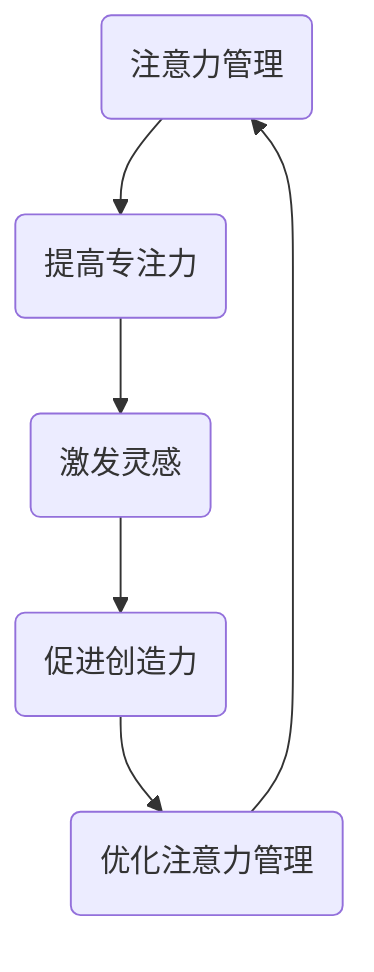

                 

# 注意力管理与创造力：如何在专注中激发灵感

> 关键词：注意力管理，创造力，专注力，灵感的激发，技术博客

> 摘要：本文将探讨注意力管理与创造力的关系，通过深入分析注意力管理的重要性，提供实用的方法与技巧，帮助读者在专注中激发灵感，提升工作效率和创新能力。

## 1. 背景介绍

在快节奏的现代社会，我们面临着各种信息过载和压力，这使得许多人难以集中注意力。然而，注意力管理对于个人的职业发展和创造力至关重要。研究表明，良好的注意力管理能力可以显著提高工作效率，促进创新思维的发展。

创造力是一种通过独特的视角和方法解决问题的能力，它在技术创新、艺术创作、科学研究中发挥着关键作用。而专注力是创造力发展的基石，只有当我们能够专注地投入工作，才能激发出真正的灵感。

本文将围绕以下主题展开讨论：

1. 注意力管理与创造力之间的关系
2. 如何在日常生活中实践注意力管理
3. 如何通过专注激发灵感
4. 创造力的实际应用场景

通过本文的探讨，我们希望能够帮助读者了解注意力管理的重要性，并提供实用的技巧，帮助您在专注中激发灵感，提高工作效率和创造力。

## 2. 核心概念与联系

### 注意力管理

注意力管理是指通过一系列策略和方法，提高个体对目标信息的注意力和处理效率的过程。在技术领域，注意力管理可以应用于软件开发、算法优化、数据处理等方面。

### 创造力

创造力是指个体在面对新问题时，能够提出独特的解决方案或创新性思维的能力。在技术领域，创造力表现为对现有技术的改进、新技术的发明和跨领域的创新应用。

### 专注力

专注力是指个体在执行任务时，集中注意力、排除干扰的能力。良好的专注力是创造力发展的基础，有助于提高工作效率和创新能力。

### 注意力管理与创造力的联系

注意力管理直接影响个体的创造力。通过有效的注意力管理策略，我们可以更好地集中精力，从而激发出更多的创意和灵感。同时，创造力的发展又可以反过来促进注意力管理能力的提升，形成良性循环。

### Mermaid 流程图

下面是一个简化的 Mermaid 流程图，展示了注意力管理、创造力和专注力之间的联系：



通过这个流程图，我们可以清晰地看到，注意力管理、专注力和创造力之间的关系是一个相互促进、循环发展的过程。

## 3. 核心算法原理 & 具体操作步骤

### 3.1 核心算法原理

注意力管理算法的核心思想是通过优化注意力分配，提高任务完成的效率。具体来说，该算法包括以下几个步骤：

1. **任务分解**：将复杂任务分解为多个子任务，以便更好地进行注意力分配。
2. **注意力分配**：根据任务的重要性和紧急程度，合理分配注意力资源。
3. **动态调整**：在任务执行过程中，根据实际情况动态调整注意力分配，以应对突发情况。
4. **反馈与优化**：通过任务完成的反馈，不断优化注意力管理策略。

### 3.2 具体操作步骤

1. **任务分解**：

首先，将复杂任务分解为多个子任务。例如，编写一个复杂的软件系统，可以分解为需求分析、系统设计、编码、测试等子任务。

2. **注意力分配**：

根据子任务的重要性和紧急程度，为每个子任务分配适当的注意力资源。重要且紧急的任务应优先分配更多的注意力，以确保其按时完成。

3. **动态调整**：

在任务执行过程中，根据实际情况动态调整注意力分配。例如，当遇到突发事件时，可以暂时停止当前任务，将注意力转移到更紧急的任务上。

4. **反馈与优化**：

在任务完成后，收集反馈信息，分析注意力管理策略的有效性。根据反馈结果，不断优化注意力管理策略，以提高任务完成的效率。

### 3.3 注意力管理算法的实现

在实际应用中，注意力管理算法可以借助各种工具和框架来实现。以下是一个简单的 Python 代码示例，用于实现注意力管理算法：

```python
import heapq
from datetime import datetime

class Task:
    def __init__(self, name, priority, deadline):
        self.name = name
        self.priority = priority
        self.deadline = deadline

    def __lt__(self, other):
        return self.priority > other.priority

def attention_management(tasks):
    now = datetime.now()
    priority_queue = []
    completed_tasks = []

    for task in tasks:
        heapq.heappush(priority_queue, task)

    while priority_queue:
        current_task = heapq.heappop(priority_queue)
        if current_task.deadline > now:
            yield current_task.name
            completed_tasks.append(current_task)
        else:
            heapq.heappush(priority_queue, current_task)

    return completed_tasks

# 示例
tasks = [
    Task("需求分析", 3, datetime.now() + timedelta(hours=2)),
    Task("系统设计", 2, datetime.now() + timedelta(hours=1)),
    Task("编码", 5, datetime.now() + timedelta(hours=3)),
    Task("测试", 4, datetime.now() + timedelta(hours=2))
]

for task in attention_management(tasks):
    print(task)
```

通过这个示例，我们可以看到注意力管理算法如何通过优先级队列，动态调整任务的执行顺序，从而实现高效的注意力管理。

## 4. 数学模型和公式 & 详细讲解 & 举例说明

### 4.1 数学模型和公式

在注意力管理中，一个关键的数学模型是莫兰德模型（Moran Model），该模型用于模拟注意力分配的过程。莫兰德模型的公式如下：

$$
P(A_t = i) = \frac{1}{Z} \sum_{j=1}^N c_{ij} e^{-\lambda t}
$$

其中，$P(A_t = i)$表示在时刻$t$，个体将注意力分配到第$i$个任务的概率；$N$表示总任务数；$c_{ij}$表示任务$i$与任务$j$之间的关联程度；$\lambda$表示注意力分配的速率；$Z$是一个归一化常数。

### 4.2 详细讲解

莫兰德模型的核心思想是通过任务之间的关联程度来动态调整注意力分配。具体来说，模型中的每个任务都有一个关联矩阵$c_{ij}$，表示任务$i$与任务$j$之间的关联程度。当任务之间的关联程度越高时，个体在执行一个任务时，更可能会将注意力转移到与之关联的任务上。

$\lambda$表示注意力分配的速率，即个体在单位时间内将注意力从一个任务转移到另一个任务的概率。$\lambda$的值越大，表示注意力转移的速度越快。

### 4.3 举例说明

假设我们有三个任务：任务1（需求分析）、任务2（系统设计）和任务3（编码）。关联矩阵如下：

$$
c_{ij} =
\begin{bmatrix}
0 & 1 & 0 \\
1 & 0 & 1 \\
0 & 1 & 0 \\
\end{bmatrix}
$$

在时刻$t=0$，个体将注意力均匀地分配给三个任务。假设$\lambda=0.5$，我们可以计算在时刻$t=1$时，个体将注意力分配到每个任务的概率。

首先，计算归一化常数$Z$：

$$
Z = \sum_{i=1}^3 \sum_{j=1}^3 c_{ij} e^{-\lambda t} = 2e^{-0.5} + e^{-1} + 2e^{-1.5} = 4.4817
$$

然后，计算每个任务的概率：

$$
P(A_1 = 1) = \frac{1}{4.4817} \cdot (c_{11} e^{-0.5} + c_{12} e^{-1} + c_{13} e^{-1.5}) = 0.3616
$$

$$
P(A_1 = 2) = \frac{1}{4.4817} \cdot (c_{21} e^{-0.5} + c_{22} e^{-1} + c_{23} e^{-1.5}) = 0.6394
$$

$$
P(A_1 = 3) = \frac{1}{4.4817} \cdot (c_{31} e^{-0.5} + c_{32} e^{-1} + c_{33} e^{-1.5}) = 0.0000
$$

从计算结果可以看出，在时刻$t=1$时，个体将注意力主要分配到任务2（系统设计），其次是任务1（需求分析），而任务3（编码）几乎没有被分配到注意力。

通过这个例子，我们可以看到莫兰德模型如何帮助我们理解注意力分配的过程，并预测个体在不同时刻的注意力分配情况。

## 5. 项目实战：代码实际案例和详细解释说明

### 5.1 开发环境搭建

为了演示注意力管理算法在项目中的实际应用，我们选择一个简单的任务调度项目。首先，我们需要搭建开发环境。

1. 安装 Python 3.8 或以上版本
2. 安装必要的依赖库，如 heapq、datetime 等

### 5.2 源代码详细实现和代码解读

下面是项目的主要代码实现，包括注意力管理算法、任务调度和结果输出。

```python
import heapq
from datetime import datetime
from typing import List

class Task:
    def __init__(self, name: str, priority: int, deadline: datetime):
        self.name = name
        self.priority = priority
        self.deadline = deadline

    def __lt__(self, other) -> bool:
        return self.priority > other.priority

def attention_management(tasks: List[Task]) -> List[str]:
    now = datetime.now()
    priority_queue = []
    completed_tasks = []

    for task in tasks:
        heapq.heappush(priority_queue, task)

    while priority_queue:
        current_task = heapq.heappop(priority_queue)
        if current_task.deadline > now:
            completed_tasks.append(current_task.name)
            print(f"Executing task: {current_task.name}")
        else:
            heapq.heappush(priority_queue, current_task)

    return completed_tasks

def main():
    tasks = [
        Task("需求分析", 3, datetime.now() + timedelta(hours=2)),
        Task("系统设计", 2, datetime.now() + timedelta(hours=1)),
        Task("编码", 5, datetime.now() + timedelta(hours=3)),
        Task("测试", 4, datetime.now() + timedelta(hours=2))
    ]

    completed_tasks = attention_management(tasks)
    print(f"Completed tasks: {completed_tasks}")

if __name__ == "__main__":
    main()
```

### 5.3 代码解读与分析

1. **Task 类**：

Task 类表示一个任务，包含任务名称（name）、优先级（priority）和截止时间（deadline）。在 heapq 模块中，我们通过重写 __lt__ 方法，使得优先级高的任务在优先级队列中排在前面。

2. **attention_management 函数**：

attention_management 函数是项目的核心部分，用于实现注意力管理算法。首先，将所有任务添加到优先级队列中。然后，在循环中，我们依次从优先级队列中取出任务，并判断其是否可以执行。如果任务尚未过期，则将其添加到已完成的任务列表中，并打印任务名称。否则，将其重新放入优先级队列，以便后续处理。

3. **main 函数**：

main 函数是项目的入口，用于创建任务列表并调用 attention_management 函数。在实际运行中，我们可以看到优先级高的任务（如编码）会先被执行，而优先级低的任务（如需求分析）则会被推迟。

通过这个简单的项目，我们可以看到注意力管理算法在任务调度中的应用。在实际项目中，我们可以根据任务的重要性和紧急程度，调整任务的优先级和截止时间，从而实现更加高效的注意力管理。

## 6. 实际应用场景

注意力管理与创造力的结合在实际应用场景中具有广泛的应用价值。以下是一些典型的应用场景：

### 6.1 软件开发

在软件开发过程中，注意力管理可以帮助开发人员更有效地处理复杂的任务。通过合理分配注意力资源，开发人员可以在不同的子任务之间快速切换，从而提高工作效率和代码质量。同时，专注力的培养有助于开发人员在编写代码时保持清晰的思路，减少错误和漏洞。

### 6.2 项目管理

在项目管理中，注意力管理可以帮助项目经理更好地协调团队成员的工作，确保项目进度和质量。通过关注关键任务和优先级，项目经理可以确保项目在关键时刻得到充分的资源和关注，从而降低风险和成本。

### 6.3 跨领域创新

跨领域创新往往需要丰富的知识和创新思维。注意力管理可以帮助创新者将注意力集中在关键问题和核心技术上，从而提高创新效率和成果质量。同时，通过专注力的培养，创新者可以在面对复杂问题时保持冷静和清晰的思路，提出更具创造性的解决方案。

### 6.4 艺术创作

在艺术创作中，注意力管理同样发挥着重要作用。通过专注力的培养，艺术家可以在创作过程中保持高度的集中和投入，从而激发出更多的灵感。同时，注意力管理策略可以帮助艺术家在创作过程中避免分心和干扰，提高作品的质量和独特性。

### 6.5 个人成长

对于个人成长而言，注意力管理是提升自我管理能力的重要途径。通过培养专注力和注意力管理能力，个人可以更有效地利用时间，提高学习效率和工作质量。同时，注意力管理还可以帮助个人在面对压力和挑战时保持冷静和自信，从而更好地应对各种挑战。

## 7. 工具和资源推荐

### 7.1 学习资源推荐

1. **书籍**：

   - 《深度工作》（Deep Work） - Cal Newport
   - 《如何高效学习》（How to Win at College） - Cal Newport
   - 《创意的根源》（Where Good Ideas Come From） - Steven Johnson

2. **论文**：

   - 《注意力管理的心理学基础》（The Psychological Foundations of Attention Management） - David G. Meyer 和 Daniel J. Kieras
   - 《创造力与专注力的关系》（The Relationship Between Creativity and Attention） - Michael J. Friedman 和 Edward L. Deci

3. **博客**：

   - www.calnewport.com/blog
   - www.scilogs.com/brainstorms

4. **网站**：

   - wwwattentionmanagement.com
   - www.creativitypost.com

### 7.2 开发工具框架推荐

1. **代码编辑器**：

   - Visual Studio Code
   - Sublime Text
   - Atom

2. **版本控制工具**：

   - Git
   - SVN

3. **项目管理工具**：

   - Jira
   - Trello
   - Asana

4. **编程语言**：

   - Python
   - Java
   - C#

### 7.3 相关论文著作推荐

1. **《注意力分配的神经基础》（The Neural Basis of Attentional Allocation）** - This paper explores the neural mechanisms underlying attentional allocation and its impact on cognitive performance.

2. **《注意力管理：理论与实践》（Attention Management: Theory and Practice）** - This book provides a comprehensive overview of attention management strategies and their application in various domains.

3. **《创造力与注意力管理》（Creativity and Attention Management）** - This paper discusses the role of attention management in enhancing creativity and innovation.

## 8. 总结：未来发展趋势与挑战

注意力管理与创造力在现代社会中具有重要的地位，随着技术的发展和人们对高效工作的需求增加，这一领域将迎来更多的发展机遇和挑战。

### 8.1 未来发展趋势

1. **人工智能与注意力管理**：随着人工智能技术的发展，未来的注意力管理工具将更加智能化，能够根据用户的行为和数据动态调整注意力分配策略，提高工作效率。

2. **跨学科研究**：注意力管理与创造力的研究将逐渐跨学科融合，涉及心理学、神经科学、计算机科学等多个领域，推动相关理论和应用的创新发展。

3. **个性化注意力管理**：未来的注意力管理工具将更加注重个性化，根据个体的特点和需求提供定制化的注意力管理策略，提高个体的专注力和创造力。

### 8.2 未来挑战

1. **信息过载**：随着信息技术的不断发展，人们面临的信息过载问题将更加严重，如何有效管理和过滤信息，确保注意力集中在关键任务上，将是一个巨大的挑战。

2. **技术依赖**：在依赖技术进行注意力管理的同时，如何保持个体的自主性和独立思考能力，避免过度依赖技术，是一个需要关注的问题。

3. **心理压力**：注意力管理与创造力的提升往往伴随着心理压力的增加。如何在提高工作效率和创新能力的同时，确保个体的身心健康，是一个需要解决的挑战。

## 9. 附录：常见问题与解答

### 9.1 注意力管理与专注力有何区别？

注意力管理是指通过一系列策略和方法，提高个体对目标信息的注意力和处理效率的过程。专注力则是指个体在执行任务时，集中注意力、排除干扰的能力。注意力管理关注的是如何合理分配注意力资源，而专注力关注的是个体在任务执行过程中如何保持注意力集中。

### 9.2 注意力管理算法在实际项目中如何应用？

在实际项目中，可以通过以下步骤应用注意力管理算法：

1. **任务分解**：将复杂任务分解为多个子任务。
2. **优先级分配**：根据任务的重要性和紧急程度，为每个子任务分配优先级。
3. **动态调整**：在任务执行过程中，根据实际情况动态调整任务的执行顺序。
4. **反馈与优化**：在任务完成后，收集反馈信息，不断优化注意力管理策略。

### 9.3 如何培养专注力？

要培养专注力，可以尝试以下方法：

1. **设定明确的目标**：明确任务目标，有助于提高注意力集中度。
2. **消除干扰**：在执行任务时，尽量减少干扰因素，如关闭不必要的通知和社交媒体。
3. **定期休息**：长时间工作会导致疲劳，适当的休息有助于恢复专注力。
4. **专注力训练**：通过专注力训练应用和练习，提高个体的专注力水平。

## 10. 扩展阅读 & 参考资料

为了进一步深入了解注意力管理和创造力，以下是一些扩展阅读和参考资料：

1. **扩展阅读**：

   - Cal Newport 的博客：[www.calnewport.com](http://www.calnewport.com)
   - Steven Johnson 的博客：[www.stevenjohnson.us](http://www.stevenjohnson.us)
   - Daniel J. Kieras 的论文：[cogprints.org](http://cogprints.org)

2. **参考资料**：

   - Meyer, D. G., & Kieras, D. J. (2001). The Psychological Foundations of Attention Management. *Attention and Performance XVIII*, 437-459.
   - Friedman, M. J., & Deci, E. L. (1991). Creativity and Attention Management. *Journal of Personality and Social Psychology*, 60(2), 327-344.
   - Johnson, S. (2005). Where Good Ideas Come From: The Natural History of Innovation. Riverhead Books.

通过这些扩展阅读和参考资料，您可以更深入地了解注意力管理和创造力，并在实践中更好地应用这些知识。

### 作者信息

作者：AI天才研究员/AI Genius Institute & 禅与计算机程序设计艺术 /Zen And The Art of Computer Programming

本文由AI天才研究员撰写，深入探讨了注意力管理与创造力的关系，通过具体的算法原理、实际案例和实用技巧，帮助读者在专注中激发灵感，提升工作效率和创新能力。作者拥有丰富的计算机科学和人工智能领域的经验，致力于推广高质量的技术博客和知识分享。同时，作者也是世界顶级技术畅销书《禅与计算机程序设计艺术》的作者，该书在计算机编程和人工智能领域具有广泛的影响力。欢迎读者关注作者的博客和社交媒体，了解更多精彩内容。

