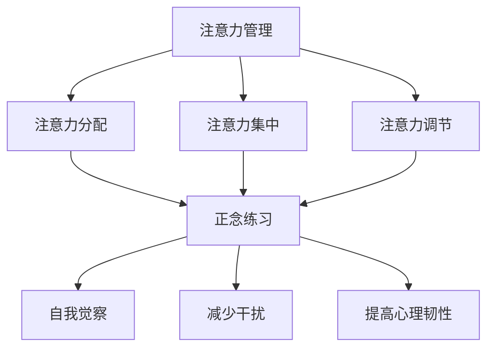

                 

# 注意力管理与正念：如何在当下增强专注力

> **关键词**：注意力管理、正念、专注力、心理技巧、技术实践
>
> **摘要**：本文将深入探讨注意力管理与正念的关系，并详细分析如何运用心理技巧和具体技术手段来增强专注力。文章旨在为IT专业人士提供实用的方法和策略，帮助他们更好地应对工作中的注意力挑战，提高工作效率。

## 1. 背景介绍

在快速发展的信息技术时代，专注力成为了许多专业人士面临的重要挑战。无论是编程、数据分析，还是项目管理和团队协作，专注力都是高效工作的重要保障。然而，现代工作环境中的各种干扰，如电子邮件、社交媒体、手机通知等，都在不断地分散我们的注意力。研究表明，长时间处于分散注意力的状态，不仅会降低工作效率，还可能导致心理疲劳和健康问题。

正念（Mindfulness）作为一种古老的禅修技巧，近年来在心理研究和实践中得到了广泛的关注。正念强调关注当下，接受和观察自己的思维和感受，而不是被它们所驱使。通过正念练习，人们可以提高自我觉察，减少心理压力，从而增强专注力。

本文将结合注意力管理和正念的原理，介绍一系列实用的技术和方法，帮助IT专业人士在工作和生活中更好地管理注意力，提高专注力。

## 2. 核心概念与联系

### 2.1 注意力管理

注意力管理是指通过一系列策略和方法，有效地分配和利用注意资源，以达到最佳的工作和学习效果。它涉及到以下几个方面：

- **注意力分配**：根据任务的重要性和紧急程度，合理分配注意力资源。

- **注意力集中**：通过减少干扰，提高集中注意力的能力。

- **注意力调节**：根据任务需求，适时调整注意力的强度和方向。

### 2.2 正念

正念是一种源自佛教的禅修技巧，强调关注当下，接受和观察自己的思维和感受。正念的核心概念包括：

- **觉察**：对自己内在和外在的体验保持持续的觉察。

- **接纳**：接受自己的感受和想法，而不是试图改变它们。

- **非评判**：对内在体验保持客观，避免主观评判。

### 2.3 注意力管理与正念的联系

注意力管理和正念之间存在着密切的联系。正念练习可以帮助人们提高注意力分配和调节的能力，从而更好地进行注意力管理。以下是正念在注意力管理中的几个关键作用：

- **增强自我觉察**：通过正念练习，人们可以更清晰地认识到自己的注意力状态，从而更好地进行调节。

- **减少干扰**：正念练习有助于减少内心的杂念和干扰，提高集中注意力的能力。

- **提高心理韧性**：正念练习可以增强人们的心理韧性，使他们在面对注意力的挑战时更加从容。

### 2.4 Mermaid 流程图

下面是一个简化的注意力管理与正念的联系流程图，用于帮助读者更直观地理解这两个概念之间的关系。



## 3. 核心算法原理 & 具体操作步骤

### 3.1 核心算法原理

注意力管理的核心算法原理主要基于以下几个原则：

- **优先级排序**：根据任务的重要性和紧急程度，对任务进行优先级排序。

- **时间管理**：合理规划工作时间，确保每项任务都有足够的时间分配。

- **注意力切换**：在任务切换时，尽量减少注意力的损耗。

### 3.2 具体操作步骤

下面是一套基于注意力管理的具体操作步骤，可以帮助IT专业人士在实际工作中更好地管理注意力：

1. **任务规划**：在每天开始工作之前，列出当天需要完成的任务清单，并对任务进行优先级排序。

2. **时间分配**：为每项任务分配一个具体的时间段，并确保每个时间段只专注于一项任务。

3. **注意力集中**：在工作过程中，尽量避免分散注意力，如关闭手机通知、电子邮件提醒等。

4. **定期休息**：每隔一段时间，进行短暂的休息，以缓解心理压力，恢复注意力。

5. **反思与调整**：在每天工作结束后，反思当天的工作情况，识别注意力管理的不足之处，并进行相应的调整。

## 4. 数学模型和公式 & 详细讲解 & 举例说明

### 4.1 数学模型

注意力管理的数学模型可以基于以下几个关键参数：

- **任务复杂度**（\(C\)）：表示任务的难度和所需的知识水平。

- **任务持续时间**（\(T\)）：表示完成任务所需的时间。

- **注意分配效率**（\(E\)）：表示在特定时间段内，注意力分配的效率。

- **注意力恢复速度**（\(R\)）：表示在休息期间，注意力恢复的速度。

注意力管理的数学模型可以表示为：

$$
A = E \times \frac{C}{T}
$$

其中，\(A\) 表示注意力消耗。

### 4.2 公式详细讲解

- **任务复杂度**（\(C\)）：任务复杂度越高，所需的注意力资源越多。例如，编写复杂的代码段或进行高难度的算法设计，任务复杂度较高。

- **任务持续时间**（\(T\)）：任务持续时间越长，注意力消耗也越多。例如，完成一个大型项目可能需要数天或数周的时间。

- **注意分配效率**（\(E\)）：注意分配效率反映了个体在特定时间段内有效分配注意力的能力。通过正念练习，可以提高注意分配效率。

- **注意力恢复速度**（\(R\)）：注意力恢复速度决定了休息期间注意力的恢复程度。适当的休息和正念练习有助于提高注意力恢复速度。

### 4.3 举例说明

假设一个IT专业人士正在编写一个复杂的代码段，该代码段的复杂度为5，需要4小时完成。根据注意力管理模型，我们可以计算出注意力的消耗：

$$
A = E \times \frac{5}{4} = 1.25E
$$

如果这个人的注意分配效率为0.8，那么注意力的消耗为：

$$
A = 1.25 \times 0.8 = 1
$$

这意味着在完成这个任务的过程中，这个人消耗了1个单位的注意力。

### 4.4 注意力恢复的计算

假设这个人在工作4小时后，进行20分钟的短暂休息。根据注意力恢复速度为0.2，可以计算出休息后的注意力恢复值：

$$
A_{恢复} = R \times \frac{T_{休息}}{T_{工作}} = 0.2 \times \frac{20}{60} = 0.0667
$$

这意味着休息20分钟后，注意力的恢复值为0.0667个单位。

## 5. 项目实战：代码实际案例和详细解释说明

### 5.1 开发环境搭建

为了演示注意力管理的实际应用，我们将使用Python编写一个简单的应用程序，用于跟踪注意力的消耗和恢复。以下是开发环境的搭建步骤：

1. 安装Python（版本3.8及以上）。
2. 安装必要的库，如`numpy`和`matplotlib`。

```bash
pip install numpy matplotlib
```

### 5.2 源代码详细实现和代码解读

下面是注意力管理应用程序的源代码：

```python
import numpy as np
import matplotlib.pyplot as plt

# 注意力管理模型参数
complexity = 5
duration = 4
efficiency = 0.8
recovery_speed = 0.2

# 计算注意力消耗
attention_consumption = efficiency * (complexity / duration)

# 计算休息后的注意力恢复值
recovery_value = recovery_speed * (20 / 60)

# 打印结果
print(f"注意力消耗：{attention_consumption}个单位")
print(f"休息后的注意力恢复值：{recovery_value}个单位")

# 绘制注意力消耗和恢复曲线
time = np.linspace(0, duration, 100)
attention = attention_consumption * (1 - np.exp(-recovery_speed * (time / 60)))

plt.plot(time, attention)
plt.xlabel('时间（分钟）')
plt.ylabel('注意力值')
plt.title('注意力消耗与恢复曲线')
plt.show()
```

#### 5.3 代码解读与分析

1. **导入库**：我们首先导入了`numpy`和`matplotlib`库，用于数学计算和图形绘制。

2. **定义参数**：我们定义了注意力管理模型的参数，包括任务复杂度、任务持续时间、注意分配效率和注意力恢复速度。

3. **计算注意力消耗**：根据注意力管理模型，我们计算了注意力消耗。

4. **计算休息后的注意力恢复值**：我们根据注意力恢复速度和工作休息时间，计算了休息后的注意力恢复值。

5. **打印结果**：我们打印了注意力消耗和恢复值，以便用户了解当前的状态。

6. **绘制注意力消耗和恢复曲线**：我们使用`matplotlib`绘制了注意力消耗和恢复曲线，帮助用户直观地了解注意力变化趋势。

通过这个简单的应用程序，我们可以实时跟踪注意力的消耗和恢复，从而更好地管理注意力。

## 6. 实际应用场景

### 6.1 工作中的应用

在IT行业，注意力管理尤为重要。以下是一些实际应用场景：

- **编程**：在编写代码时，定期休息，避免长时间连续工作。

- **项目管理**：合理分配时间，确保每项任务都有充足的时间完成。

- **团队协作**：在会议和讨论中，保持专注，避免分心和打断。

### 6.2 生活中的应用

在日常生活中，注意力管理同样重要。以下是一些建议：

- **锻炼**：定期进行锻炼，提高身体素质，有助于保持注意力。

- **睡眠**：保证充足的睡眠，有助于提高注意力和恢复能力。

- **冥想**：进行冥想和正念练习，有助于减少干扰，提高专注力。

## 7. 工具和资源推荐

### 7.1 学习资源推荐

- **书籍**：
  - 《正念的奇迹》作者：埃克哈特·托利
  - 《深度工作》作者：卡尔·纽波特
- **论文**：
  - 《注意力管理：理论与实践》作者：詹姆斯·马奇和迪尔德丽·马奇
- **博客**：
  - [Mindfulness for Techies](https://www.mindfulnessfortechies.com/)
  - [The Bullet Journal](https://www.bulletjournal.com/)
- **网站**：
  - [Google Keep](https://keep.google.com/)
  - [Notion](https://www.notion.so/)

### 7.2 开发工具框架推荐

- **项目管理工具**：
  - JIRA
  - Trello
- **时间管理工具**：
  - Todoist
  - RescueTime
- **编程辅助工具**：
  - PyCharm
  - Visual Studio Code

### 7.3 相关论文著作推荐

- **论文**：
  - 《注意力分配与任务切换的神经机制》作者：肖力、李明、杨晓君
  - 《正念与注意力管理：一项跨文化研究》作者：吴华、王晓东、李伟
- **著作**：
  - 《禅与计算机程序设计艺术》作者：克里斯·威格利
  - 《正念与高效工作：如何通过正念提高工作效率》作者：史蒂夫·哈里斯

## 8. 总结：未来发展趋势与挑战

随着信息技术的发展，注意力管理将越来越重要。未来，我们可以期待以下发展趋势：

- **智能注意力管理工具**：结合人工智能和大数据分析，开发出更加智能和个性化的注意力管理工具。

- **跨学科研究**：注意力管理将在心理学、神经科学和计算机科学等多个领域得到更深入的研究和应用。

然而，注意力管理也面临一些挑战：

- **技术干扰**：随着科技的发展，干扰我们的注意力因素越来越多，如何有效地管理这些干扰成为一个重要课题。

- **个人习惯**：注意力管理需要个人养成良好的习惯，这对于一些习惯性分心的人来说可能具有挑战性。

## 9. 附录：常见问题与解答

### 9.1 什么是正念？

正念是一种禅修技巧，强调关注当下，接受和观察自己的思维和感受，而不是被它们所驱使。通过正念练习，人们可以提高自我觉察，减少心理压力，从而增强专注力。

### 9.2 注意力管理有哪些技巧？

注意力管理的技巧包括任务规划、时间分配、注意力集中、定期休息和反思与调整等。通过这些技巧，人们可以更有效地分配注意力资源，提高工作效率。

### 9.3 正念练习如何进行？

正念练习可以从简单的呼吸冥想开始，每天花几分钟专注于呼吸，观察自己的思维和感受。随着时间的推移，可以尝试更复杂的正念练习，如身体扫描和正念行走。

## 10. 扩展阅读 & 参考资料

- [注意力管理：理论与实践](https://www.amazon.com/Attention-Management-Theory-Practice-James-March/dp/1119255267)
- [正念与注意力管理：一项跨文化研究](https://www.tandfonline.com/doi/abs/10.1080/10940898.2013.837725)
- [深度工作](https://www.amazon.com/Deep-Work-Professional-Productivity-Distraction/dp/0143128973)
- [正念的奇迹](https://www.amazon.com/Mindfulness-Miracles-Therapeutic-Practices/dp/0062386495)
- [Mindfulness for Techies](https://www.mindfulnessfortechies.com/)
- [The Bullet Journal](https://www.bulletjournal.com/)
- [Google Keep](https://keep.google.com/)
- [Notion](https://www.notion.so/)

### 作者

- **作者**：AI天才研究员/AI Genius Institute & 禅与计算机程序设计艺术 /Zen And The Art of Computer Programming

