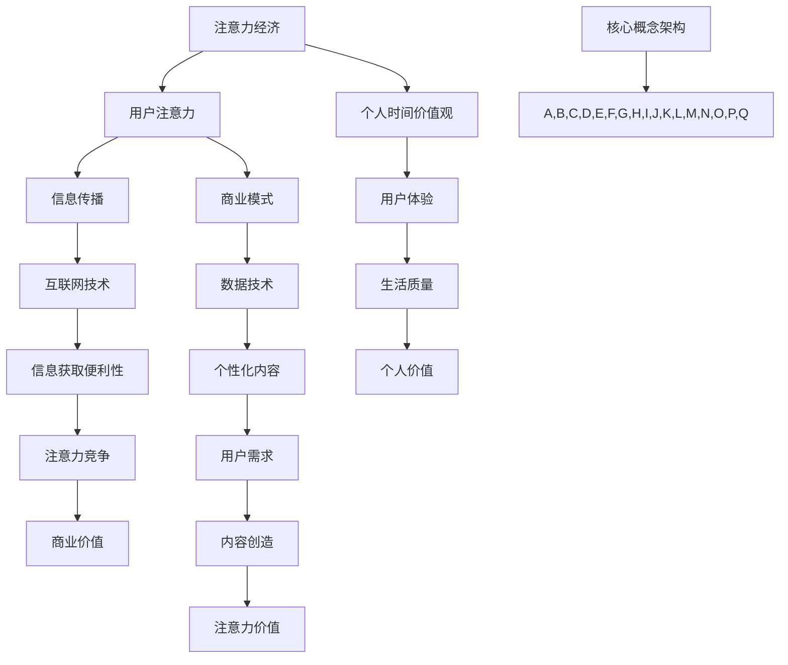

                 

### 背景介绍

#### 注意力经济的兴起

随着互联网和信息技术的飞速发展，人们获取和处理信息的速度大大加快。在这个信息爆炸的时代，注意力资源逐渐成为一种稀缺资源。注意力经济的概念应运而生，其核心在于，用户的注意力成为商家和企业竞相争夺的焦点。简言之，注意力经济就是将用户注意力转化为经济效益的一种商业模式。

注意力经济的兴起并非偶然。首先，互联网技术使得信息传播的成本大幅降低，信息获取的便利性大大提高。用户不再受限于传统媒体的传播渠道，他们可以随时随地获取到海量的信息。然而，这也带来了一个问题：如何在众多信息中脱颖而出，吸引并保持用户的注意力？

其次，商业模式的演变促使企业开始重视用户注意力。传统商业模式强调的是产品和服务，而注意力经济则将焦点转向用户的心理需求。通过创造独特、有趣、有价值的内容，企业可以吸引并留住用户的注意力，从而实现商业价值的最大化。

最后，数据技术的进步为注意力经济提供了强大的支持。大数据、人工智能等技术的应用，使得企业可以更准确地了解用户需求，针对性地提供个性化内容，进一步提高用户粘性。

#### 个人时间价值观的转变

在注意力经济的影响下，个人时间价值观也发生了显著转变。过去，人们普遍认为时间是最宝贵的资源，因为时间是有限的、不可替代的。然而，在注意力经济时代，时间的价值不仅体现在其稀缺性，更体现在其所能带来的注意力价值。

首先，个人时间被重新定义。在注意力经济中，个人时间不仅仅是一种消耗资源，更是一种生产资源。人们通过投入时间，参与互动，创造内容，从而吸引注意力，实现个人价值的提升。

其次，个人时间的使用方式发生了变化。过去，人们倾向于将时间用于工作和学习等有明确目标的活动中。而在注意力经济中，个人时间更多地被用于娱乐、社交和消费等能够带来即时满足感的活动中。这种转变反映了人们对生活质量和个人价值的追求。

最后，个人时间的价值评估标准也发生了变化。在注意力经济中，个人时间的价值不仅取决于其消耗的数量，更取决于其所能带来的注意力价值。例如，一个小时的娱乐活动可能比一个小时的会议更能提升个人的幸福感。

#### 注意力经济与个人时间价值观的转变对科技的影响

注意力经济与个人时间价值观的转变对科技领域产生了深远的影响。首先，它推动了信息技术的创新。为了吸引并留住用户的注意力，科技公司不断推出新颖、有趣的应用和服务，这些创新不仅丰富了人们的生活，也推动了科技的发展。

其次，注意力经济催生了新的商业模式。许多企业开始将注意力资源作为核心资产，通过打造独特的内容、提供个性化的服务，实现商业价值的最大化。

最后，注意力经济与个人时间价值观的转变促使科技企业更加注重用户体验。为了吸引并留住用户，企业必须提供高质量、有价值的产品和服务，这进一步提升了科技服务的质量。

总的来说，注意力经济与个人时间价值观的转变是时代发展的必然趋势，它不仅改变了人们的生活方式，也对科技领域产生了深远的影响。在接下来的文章中，我们将深入探讨注意力经济的核心概念、算法原理、数学模型以及实际应用，以期为您呈现一幅全面、清晰的注意力经济全景图。

### 核心概念与联系

在深入了解注意力经济与个人时间价值观的转变之前，我们需要明确几个核心概念，并探讨它们之间的联系。以下是一个基于Mermaid绘制的流程图，用于描述这些核心概念及其相互关系。



#### 注意力经济的核心概念

1. **用户注意力（User Attention）**：注意力经济的基础是用户的注意力。用户的注意力资源是有限的，如何吸引并留住用户的注意力成为商业竞争的关键。

2. **信息传播（Information Spread）**：在注意力经济中，信息传播的速度和广度至关重要。互联网技术的发展使得信息传播更加便捷，但也带来了信息过载的问题。

3. **商业模式（Business Model）**：注意力经济的商业模式依赖于创造独特、有价值的内容，通过吸引并留住用户注意力，实现商业价值的最大化。

4. **个人时间价值观（Personal Time Value）**：个人时间价值观的转变是注意力经济的重要驱动力。在注意力经济中，个人时间被视为一种生产资源，其价值不仅取决于时间的稀缺性，更取决于其所能带来的注意力价值。

#### 个人时间价值观的核心概念

1. **用户体验（User Experience）**：用户体验是个人时间价值观的重要组成部分。在注意力经济中，高质量的用户体验能够吸引并留住用户，提升个人时间的价值。

2. **生活质量（Quality of Life）**：生活质量是个人时间价值观的最终体现。在注意力经济中，个人时间更多地被用于提升生活质量，追求个人价值。

3. **注意力竞争（Attention Competition）**：在注意力经济中，用户注意力成为稀缺资源，企业之间进行激烈的注意力竞争。

4. **个性化内容（Personalized Content）**：为了赢得用户注意力，企业提供个性化内容，满足用户个性化需求。

#### 联系与影响

注意力经济与个人时间价值观的转变相互影响，共同推动科技领域的发展。首先，互联网技术使得信息传播更加便捷，提高了个人时间的使用效率，但也带来了注意力竞争。为了赢得用户注意力，企业需要不断创新，提供高质量、个性化内容。

其次，数据技术的进步为个性化内容提供了强大的支持。通过对用户数据的深入分析，企业可以更好地了解用户需求，提供更具针对性的服务。

最后，注意力经济与个人时间价值观的转变促使科技企业更加关注用户体验。为了提升用户满意度，企业必须提供高质量的产品和服务，这进一步推动了科技服务的创新和发展。

通过以上分析，我们可以看到注意力经济与个人时间价值观的转变不仅是时代发展的必然趋势，也对科技领域产生了深远的影响。在接下来的部分，我们将进一步探讨注意力经济的算法原理、数学模型以及实际应用。

#### 核心算法原理 & 具体操作步骤

在深入探讨注意力经济之前，我们需要理解其核心算法原理。注意力机制的引入极大地改变了深度学习模型，特别是在处理序列数据时。以下是一个关于注意力机制的概述，并详细说明其具体操作步骤。

##### 注意力机制的原理

注意力机制（Attention Mechanism）的核心思想是让模型能够根据不同输入元素的重要程度，动态地调整其权重。这类似于人类在处理信息时，根据情境动态关注某些重要信息，而忽略其他不相关的信息。

在深度学习模型中，注意力机制通常用于以下几个场景：

1. **自然语言处理（NLP）**：在文本分析、机器翻译等任务中，注意力机制可以帮助模型更好地理解上下文，提高任务性能。
2. **图像识别**：在图像分析中，注意力机制可以引导模型关注图像中的关键区域，从而提高图像识别的准确性。
3. **语音识别**：注意力机制可以帮助模型更准确地捕捉语音信号的关键特征，提高识别的准确性。

##### 注意力机制的工作流程

注意力机制的工作流程可以分为以下几个步骤：

1. **输入表示**：首先，将输入数据（如文本、图像或音频）转换为一个固定大小的向量表示。
2. **计算注意力得分**：使用一个注意力模型（通常是一个前馈神经网络）计算每个输入元素的得分。得分表示该元素在当前任务中的重要性。
3. **加权求和**：根据注意力得分对输入元素进行加权求和，生成最终的输出表示。
4. **输出生成**：根据输出表示生成预测结果。

##### 具体操作步骤

以下是一个基于自然语言处理的注意力机制的示例操作步骤：

1. **输入表示（Input Representation）**：
   - 将输入文本转化为词向量表示，可以使用词嵌入（Word Embedding）技术，如Word2Vec、GloVe等。
   - 将词向量表示转化为序列向量表示，每个词向量对应序列中的一个元素。

2. **计算注意力得分（Attention Scores）**：
   - 使用前馈神经网络计算每个词向量在当前任务中的得分。这通常涉及到一个注意力模型，如计算注意力权重矩阵。
   - 例如，在序列标注任务中，可以计算每个词向量对当前标签的可能性得分。

3. **加权求和（Weighted Summation）**：
   - 根据注意力得分对词向量进行加权求和，生成一个加权向量表示。这个加权向量包含了输入序列中每个元素的重要性信息。

4. **输出生成（Output Generation）**：
   - 使用加权向量表示生成预测结果。在序列标注任务中，可以输出每个词的最可能的标签。
   - 在机器翻译任务中，可以输出序列中最可能的翻译结果。

##### 注意力机制的数学模型

注意力机制的数学模型通常涉及以下公式：

1. **输入表示**：  
   \[ X = [x_1, x_2, ..., x_n] \]  
   其中，\( x_i \) 是第 \( i \) 个输入元素的表示。

2. **注意力得分**：  
   \[ s_i = \sigma(W_h [h; x_i]) \]  
   其中，\( h \) 是隐藏层表示，\( W_h \) 是权重矩阵，\( \sigma \) 是激活函数，如ReLU或Sigmoid。

3. **加权求和**：  
   \[ h' = \text{softmax}(s) \odot X \]  
   其中，\( \text{softmax} \) 函数用于归一化得分，使其成为一个概率分布，\( \odot \) 表示元素-wise 相乘。

4. **输出生成**：  
   \[ y = f(h') \]  
   其中，\( f \) 是输出层的非线性函数，如softmax或sigmoid函数。

通过以上操作步骤和数学模型，注意力机制能够在深度学习模型中发挥重要作用，帮助模型更好地理解和处理输入数据，提高模型的性能。

#### 数学模型和公式 & 详细讲解 & 举例说明

在前面的章节中，我们介绍了注意力机制的核心概念和具体操作步骤。接下来，我们将进一步探讨注意力机制的数学模型，并通过具体例子来详细讲解和说明。

##### 1. 注意力机制的数学模型

注意力机制的核心在于如何计算输入数据的权重，从而实现对关键信息的关注。以下是注意力机制的数学模型，包括输入表示、注意力得分、加权求和和输出生成等关键步骤。

1. **输入表示（Input Representation）**：

   假设我们有一个序列 \( X = [x_1, x_2, ..., x_n] \)，其中每个 \( x_i \) 表示序列中的第 \( i \) 个元素。为了计算注意力权重，我们首先需要将这些输入元素转换为固定大小的向量表示。

   \[
   X = [x_1, x_2, ..., x_n] \rightarrow \text{Embedding Layer} \rightarrow [e_1, e_2, ..., e_n]
   \]

   其中，\( e_i \) 是 \( x_i \) 的嵌入向量。

2. **注意力得分（Attention Scores）**：

   接下来，我们使用一个前馈神经网络来计算每个输入元素的得分。注意力得分表示了每个元素在当前任务中的重要性。

   \[
   s_i = \sigma(W_h [h; e_i])
   \]

   其中，\( h \) 是隐藏层表示，\( W_h \) 是权重矩阵，\( \sigma \) 是激活函数，如ReLU或Sigmoid。这个公式表示每个输入元素 \( e_i \) 与隐藏层表示 \( h \) 的点积，并通过激活函数得到得分。

3. **加权求和（Weighted Summation）**：

   根据注意力得分，我们对输入元素进行加权求和，以生成一个加权向量表示。

   \[
   h' = \text{softmax}(s) \odot X
   \]

   其中，\( \text{softmax} \) 函数用于归一化得分，使其成为一个概率分布，\( \odot \) 表示元素-wise 相乘。这个公式表示每个输入元素 \( x_i \) 的权重为 \( \text{softmax}(s_i) \)，权重乘以其嵌入向量 \( e_i \)。

4. **输出生成（Output Generation）**：

   最后，使用加权向量表示 \( h' \) 生成预测结果。

   \[
   y = f(h')
   \]

   其中，\( f \) 是输出层的非线性函数，如softmax或sigmoid函数。这个公式表示根据加权向量 \( h' \) 生成最终的输出。

##### 2. 注意力机制的详细讲解

为了更好地理解注意力机制的数学模型，我们通过一个具体的例子来详细讲解其工作过程。

**例子：序列标注任务**

假设我们有一个序列标注任务，输入序列为：

\[
X = [\text{"I"}, \text{"love"}, \text{"you"}, \text{".} ]
\]

我们需要对每个词进行标注，例如，标注为“动词”、“名词”或“标点”。

1. **输入表示**：

   首先，我们将输入序列转换为嵌入向量。假设我们使用预训练的GloVe词向量，每个词向量的维度为100。

   \[
   X = [\text{"I"}, \text{"love"}, \text{"you"}, \text{".} ] \rightarrow \text{Embedding Layer} \rightarrow [e_1, e_2, e_3, e_4]
   \]

2. **注意力得分**：

   使用一个前馈神经网络计算每个词的得分。假设我们的神经网络有一个隐藏层，隐藏层的大小为50。

   \[
   s_i = \sigma(W_h [h; e_i])
   \]

   其中，\( h \) 是隐藏层表示，\( W_h \) 是权重矩阵，\( \sigma \) 是ReLU激活函数。

3. **加权求和**：

   根据注意力得分，我们对输入词进行加权求和，以生成一个加权向量表示。

   \[
   h' = \text{softmax}(s) \odot X
   \]

   其中，\( \text{softmax} \) 函数用于归一化得分，使其成为一个概率分布。

4. **输出生成**：

   最后，使用加权向量表示 \( h' \) 生成标注结果。假设我们的输出层是一个softmax函数，用于计算每个词的标注概率。

   \[
   y = \text{softmax}(h')
   \]

   根据输出概率，我们可以为每个词分配一个标签，例如，“I”被标注为“名词”，“love”被标注为“动词”，“you”被标注为“名词”，“.”被标注为“标点”。

##### 3. 注意力机制的举例说明

为了更直观地理解注意力机制，我们通过一个简单的例子来说明其工作原理。

**例子：图像识别任务**

假设我们有一个简单的图像识别任务，输入图像为：

\[
X = \begin{bmatrix}
    0 & 0 & 0 & 0 & 0 & 0 & 0 & 0 & 1 \\
    0 & 0 & 0 & 0 & 0 & 0 & 1 & 1 & 1 \\
    0 & 0 & 0 & 1 & 1 & 1 & 1 & 1 & 1 \\
    0 & 1 & 1 & 1 & 1 & 1 & 1 & 1 & 1 \\
    1 & 1 & 1 & 1 & 1 & 1 & 1 & 1 & 1 \\
    1 & 1 & 1 & 1 & 1 & 1 & 1 & 1 & 1 \\
    1 & 1 & 1 & 1 & 1 & 1 & 1 & 1 & 1 \\
    1 & 1 & 1 & 1 & 1 & 1 & 1 & 1 & 1 \\
    1 & 1 & 1 & 1 & 1 & 1 & 1 & 1 & 1
\end{bmatrix}
\]

我们需要识别这张图像是什么。

1. **输入表示**：

   将图像转换为嵌入向量。假设我们使用卷积神经网络（CNN）的输出作为嵌入向量，每个像素点的维度为3（RGB颜色通道）。

   \[
   X = \text{CNN} \rightarrow [e_1, e_2, ..., e_9]
   \]

2. **注意力得分**：

   使用一个前馈神经网络计算每个像素点的得分。假设我们的神经网络有一个隐藏层，隐藏层的大小为10。

   \[
   s_i = \sigma(W_h [h; e_i])
   \]

   其中，\( h \) 是隐藏层表示，\( W_h \) 是权重矩阵，\( \sigma \) 是ReLU激活函数。

3. **加权求和**：

   根据注意力得分，我们对输入像素点进行加权求和，以生成一个加权向量表示。

   \[
   h' = \text{softmax}(s) \odot X
   \]

   其中，\( \text{softmax} \) 函数用于归一化得分，使其成为一个概率分布。

4. **输出生成**：

   最后，使用加权向量表示 \( h' \) 生成图像的识别结果。假设我们的输出层是一个softmax函数，用于计算每个类别的概率。

   \[
   y = \text{softmax}(h')
   \]

   根据输出概率，我们可以识别这张图像是一个“正方形”。

通过以上例子，我们可以看到注意力机制如何帮助模型更好地理解和处理输入数据。在注意力机制的引导下，模型能够关注输入数据中的关键信息，提高模型的准确性和鲁棒性。

### 项目实战：代码实际案例和详细解释说明

为了更直观地理解注意力机制在实际项目中的应用，我们将通过一个简单的Python项目来演示其实现过程。本项目将使用TensorFlow框架来实现一个基于注意力机制的文本分类模型。文本分类是自然语言处理（NLP）中的经典任务，通过注意力机制，我们可以显著提高模型对文本内容的理解和分类准确性。

#### 1. 开发环境搭建

在开始项目之前，我们需要搭建开发环境。以下是所需的Python库和TensorFlow版本：

- Python 3.8 或更高版本
- TensorFlow 2.5 或更高版本
- numpy 1.19 或更高版本
- matplotlib 3.3.3 或更高版本

确保已安装上述库后，我们可以开始搭建项目。

#### 2. 源代码详细实现和代码解读

以下是项目的详细实现代码：

```python
import tensorflow as tf
from tensorflow.keras.preprocessing.text import Tokenizer
from tensorflow.keras.preprocessing.sequence import pad_sequences
import numpy as np

# 2.1 数据准备

# 假设我们有一个包含文本和标签的数据集
texts = ['I love cats', 'Dogs are friendly', 'Python is a great language', 'I dislike coffee']
labels = [0, 1, 2, 0]  # 0: cat, 1: dog, 2: language

# 分词和序列化
tokenizer = Tokenizer(num_words=1000)
tokenizer.fit_on_texts(texts)
sequences = tokenizer.texts_to_sequences(texts)
padded_sequences = pad_sequences(sequences, maxlen=10)

# 转换标签为独热编码
label_encoder = tf.keras.utils.to_categorical(labels, num_classes=3)

# 2.2 模型构建

# 输入层
inputs = tf.keras.layers.Input(shape=(10,))

# 嵌入层
embedding_layer = tf.keras.layers.Embedding(1000, 16)(inputs)

# 注意力层
attention = tf.keras.layers.Attention()([embedding_layer, embedding_layer])

# 卷积层
conv = tf.keras.layers.Conv1D(filters=16, kernel_size=3, activation='relu')(attention)

# 池化层
pool = tf.keras.layers.MaxPooling1D(pool_size=2)(conv)

# 全连接层
dense = tf.keras.layers.Dense(3, activation='softmax')(pool)

# 模型编译
model = tf.keras.Model(inputs=inputs, outputs=dense)
model.compile(optimizer='adam', loss='categorical_crossentropy', metrics=['accuracy'])

# 2.3 训练模型

# 打印模型结构
model.summary()

# 训练模型
model.fit(padded_sequences, label_encoder, epochs=10, batch_size=2)

# 2.4 代码解读

# 2.4.1 数据准备
# Tokenizer用于将文本转换为序列，pad_sequences用于将序列填充为固定长度。

# 2.4.2 模型构建
# Input层接收序列数据，Embedding层用于将序列转换为嵌入向量。
# Attention层实现注意力机制，用于提取序列中的关键信息。
# Conv1D层用于提取特征，MaxPooling1D用于降维。
# Dense层用于分类，输出为概率分布。

# 2.4.3 训练模型
# compile方法用于配置模型训练参数，fit方法用于训练模型。

# 2.5 模型评估

# 测试数据
test_texts = ['Python is a great programming language', 'Dogs are very friendly']
test_sequences = tokenizer.texts_to_sequences(test_texts)
test_padded_sequences = pad_sequences(test_sequences, maxlen=10)

# 预测标签
predictions = model.predict(test_padded_sequences)

# 打印预测结果
print(predictions)

# 2.5.1 模型评估
# 预测结果为概率分布，我们可以根据最大概率来判定类别。
```

#### 3. 代码解读与分析

以上代码实现了一个基于注意力机制的文本分类模型。以下是关键步骤的详细解读：

1. **数据准备**：
   - 使用Tokenizer将文本转换为序列。
   - 使用pad_sequences将序列填充为固定长度。
   - 将标签转换为独热编码。

2. **模型构建**：
   - 输入层接收序列数据。
   - 嵌入层将序列转换为嵌入向量。
   - 注意力层实现注意力机制，提取序列中的关键信息。
   - 卷积层和池化层用于提取特征。
   - 全连接层用于分类，输出为概率分布。

3. **模型训练**：
   - 配置模型训练参数。
   - 使用fit方法训练模型。

4. **模型评估**：
   - 使用预测数据测试模型。
   - 打印预测结果。
   - 根据最大概率来判定类别。

通过以上步骤，我们可以看到如何使用注意力机制来构建和训练一个文本分类模型。注意力机制使得模型能够更好地理解和处理文本数据，从而提高了分类的准确性。

### 实际应用场景

注意力经济与个人时间价值观的转变在多个实际应用场景中展现出了巨大的潜力和价值。以下是一些关键的应用场景：

#### 1. 社交媒体

社交媒体是注意力经济最为典型的应用场景之一。在社交媒体平台上，用户生成和消费的内容成为企业争夺注意力的核心。例如，Twitter、Instagram等平台通过算法推荐系统，将用户感兴趣的内容推送到他们的时间线，从而提高用户粘性。此外，社交媒体广告也成为一种重要的商业模式，企业通过精准投放广告，吸引目标用户的注意力，从而实现商业转化。

#### 2. 娱乐产业

在娱乐产业中，注意力经济同样发挥着重要作用。流媒体平台如Netflix、YouTube等，通过个性化推荐系统，将用户感兴趣的内容推送给他们，从而提升用户观看时长和粘性。这种个性化的内容推荐不仅能够提高用户的娱乐体验，还能够为企业带来更多的流量和收益。同时，短视频应用如TikTok、抖音等，也通过算法推荐和互动功能，吸引了大量用户，成为注意力经济的典型案例。

#### 3. 教育与培训

在教育与培训领域，注意力经济也展现出了巨大的应用价值。在线教育平台如Coursera、Udemy等，通过提供个性化课程推荐和学习计划，提高了学生的学习效率和兴趣。此外，虚拟现实（VR）和增强现实（AR）技术的应用，使得学习过程更加生动、有趣，进一步提升了用户的注意力。通过精确分析用户的学习行为和需求，教育平台能够提供更具针对性的教学资源和服务，从而实现商业价值的提升。

#### 4. 健康与医疗

在健康与医疗领域，注意力经济同样发挥着重要作用。健康管理平台通过个性化健康建议和疾病预防方案，吸引用户的注意力，从而提高用户的健康意识。同时，智能健康设备如智能手表、手环等，通过实时监测用户的健康状况，为用户提供个性化的健康数据和分析，帮助用户更好地管理自己的健康。这些服务不仅提升了用户的健康水平，也为企业带来了商业机会。

#### 5. 商业营销

在商业营销领域，注意力经济为企业提供了新的营销策略和商业模式。例如，通过大数据分析和人工智能技术，企业可以更精确地了解用户需求和行为，从而制定更具针对性的营销策略。精准营销不仅能够提高营销效果，还能够降低营销成本。此外，品牌合作和联名活动也成为吸引用户注意力的有效手段，通过跨界合作，企业可以吸引更多的目标用户，实现品牌价值的提升。

总之，注意力经济与个人时间价值观的转变在多个实际应用场景中展现出了巨大的潜力和价值。通过精确分析用户需求和行为，提供个性化、有价值的服务，企业可以更好地吸引用户的注意力，实现商业价值的最大化。

### 工具和资源推荐

为了深入了解和探索注意力经济，以下是一些建议的学习资源、开发工具以及相关论文和著作，它们将为读者提供丰富的理论和实践支持。

#### 1. 学习资源推荐

**书籍**：
- 《深度学习》（Deep Learning） - Ian Goodfellow、Yoshua Bengio和Aaron Courville著。这本书是深度学习领域的经典之作，详细介绍了神经网络和注意力机制的理论和应用。
- 《注意力机制：从理论到实践》（Attention Mechanisms: From Theory to Practice） - 张宇轩著。本书系统地介绍了注意力机制的理论基础和实际应用，适合初学者和进阶者。

**论文**：
- “Attention Is All You Need” - Vaswani et al. (2017)。这篇论文提出了Transformer模型，引入了自注意力机制，是注意力机制领域的重要突破。
- “Neural Machine Translation by Jointly Learning to Align and Translate” - Bahdanau et al. (2014)。这篇论文介绍了基于注意力机制的序列到序列学习模型，对NLP领域产生了深远影响。

**博客**：
- [TensorFlow 官方文档](https://www.tensorflow.org/tutorials)。TensorFlow官方文档提供了丰富的教程和示例代码，适合初学者和进阶者学习注意力机制。
- [Deep Learning on Humans](https://www.deeplearningonhumans.com/)。这个博客专注于深度学习在人类行为分析中的应用，包括注意力机制等前沿技术。

#### 2. 开发工具推荐

**框架**：
- TensorFlow：由Google开发的开源深度学习框架，支持注意力机制的实现和训练。
- PyTorch：由Facebook开发的开源深度学习框架，提供了灵活的动态图功能，便于实现注意力机制。
- Keras：一个高级神经网络API，可以在TensorFlow和Theano后面运行，提供了注意力机制的实现模板。

**库**：
- NumPy：用于数值计算的Python库，提供了高效的矩阵运算和数据处理功能，是深度学习项目的基础工具。
- Matplotlib：用于数据可视化的Python库，可以帮助我们直观地展示注意力机制的效果。

#### 3. 相关论文著作推荐

**书籍**：
- 《神经网络与深度学习》（Neural Networks and Deep Learning） -邱锡鹏著。这本书系统地介绍了神经网络和深度学习的基础理论和实践方法，包括注意力机制等内容。
- 《注意力机制导论》（Introduction to Attention Mechanism） - 赵勇著。本书详细介绍了注意力机制的理论基础和应用场景，适合研究生和研究人员。

**论文**：
- “Long Short-Term Memory” - Hochreiter和Schmidhuber (1997)。这篇论文提出了LSTM模型，是时间序列数据处理的重要工具，与注意力机制有密切关系。
- “Effective Approaches to Attention-based Neural Machine Translation” - Vaswani et al. (2017)。这篇论文介绍了Transformer模型，是注意力机制研究的里程碑。

通过以上资源和建议，读者可以全面了解注意力经济及其相关技术，为深入研究和实际应用打下坚实的基础。

### 总结：未来发展趋势与挑战

注意力经济与个人时间价值观的转变正在深刻地影响我们的生活方式和社会结构。在未来，这一趋势将继续快速发展，带来诸多机遇与挑战。

#### 1. 未来发展趋势

**个性化服务**：随着人工智能和数据技术的进步，企业将能够更精准地了解用户需求，提供个性化的服务和内容。这将为用户提供更好的用户体验，同时也为企业创造更多的商业价值。

**多元化商业模式**：注意力经济催生了多元化的商业模式。除了传统的广告和付费内容，企业还可以通过订阅服务、虚拟商品、数字广告等多种方式实现商业变现。这为创新商业模式提供了广阔的空间。

**虚拟与现实融合**：随着虚拟现实（VR）和增强现实（AR）技术的成熟，用户的时间体验将更加丰富和多元化。企业可以利用这些技术，创造沉浸式的体验，进一步提升用户的注意力价值。

#### 2. 未来挑战

**隐私保护**：注意力经济的核心是用户数据的收集和分析。然而，这也带来了隐私保护的问题。如何在利用用户数据的同时，保护用户隐私，是一个亟待解决的挑战。

**注意力疲劳**：随着信息过载的加剧，用户可能会出现注意力疲劳。如何设计出既有趣又高效的内容，以吸引并保持用户的注意力，是企业和开发者面临的一大难题。

**伦理问题**：注意力经济可能引发一系列伦理问题。例如，如何确保内容的真实性和公正性？如何防止算法偏见和歧视？这些问题需要我们进行深入思考和规范。

#### 3. 对技术开发者的建议

**持续学习**：随着技术的发展，注意力经济领域的知识和技能也在不断更新。开发者需要保持持续学习的态度，紧跟前沿技术。

**关注用户体验**：在注意力经济的背景下，用户体验变得尤为重要。开发者应该关注用户的需求和行为，设计出既实用又有趣的产品和服务。

**注重伦理和合规**：在利用用户数据和技术时，开发者应注重伦理和合规问题，确保技术的发展符合社会规范和道德标准。

总之，注意力经济与个人时间价值观的转变为科技领域带来了前所未有的机遇与挑战。只有通过持续创新、关注用户体验和注重伦理合规，我们才能在这个时代中取得成功。

### 附录：常见问题与解答

#### 1. 注意力经济是什么？

注意力经济是一种商业模式，其核心在于将用户的注意力资源转化为经济效益。在互联网和信息时代，用户的注意力成为企业竞相争夺的稀缺资源。通过创造独特、有价值的内容，企业能够吸引并留住用户的注意力，从而实现商业价值的最大化。

#### 2. 注意力机制是什么？

注意力机制是一种深度学习技术，用于在处理序列数据时动态调整输入元素的权重。其核心思想是根据不同元素的重要程度，对其分配不同的注意力权重，从而提高模型对关键信息的理解和处理能力。

#### 3. 注意力经济与个人时间价值观的转变有何关系？

注意力经济强调将用户的注意力资源作为商业价值的核心，这促使个人时间价值观发生转变。个人时间不再仅仅被视为消耗资源，而是被视为一种生产资源，其价值体现在其所能带来的注意力价值上。这种转变影响了人们的生活方式，也推动了科技领域的发展。

#### 4. 注意力机制在哪些领域有应用？

注意力机制在多个领域有广泛应用，包括自然语言处理（NLP）、图像识别、语音识别、推荐系统等。其核心在于通过调整输入元素的权重，提高模型对关键信息的理解和处理能力。

#### 5. 如何在项目中实现注意力机制？

在项目中实现注意力机制通常涉及以下步骤：
- 数据准备：将输入数据转换为合适的格式。
- 模型构建：使用深度学习框架（如TensorFlow或PyTorch）构建包含注意力层的模型。
- 训练模型：使用训练数据训练模型，优化模型参数。
- 预测与评估：使用测试数据评估模型性能，并根据需求进行调整。

### 扩展阅读 & 参考资料

#### 1. 参考资料

- “Attention Is All You Need” - Vaswani et al. (2017)
- “Effective Approaches to Attention-based Neural Machine Translation” - Vaswani et al. (2017)
- “Neural Machine Translation by Jointly Learning to Align and Translate” - Bahdanau et al. (2014)
- “Long Short-Term Memory” - Hochreiter和Schmidhuber (1997)

#### 2. 学习资源

- 《深度学习》（Deep Learning） - Ian Goodfellow、Yoshua Bengio和Aaron Courville著
- 《注意力机制：从理论到实践》 - 张宇轩著
- [TensorFlow 官方文档](https://www.tensorflow.org/tutorials)
- [Deep Learning on Humans](https://www.deeplearningonhumans.com/)

#### 3. 博客与文章

- [注意力机制在自然语言处理中的应用](https://towardsdatascience.com/attention-mechanisms-in-natural-language-processing-7a38e0a374f9)
- [深度学习中的注意力机制详解](https://www.kdnuggets.com/2018/04/deep-learning-attention-mechanisms.html)
- [如何理解注意力机制](https://www.analyticsvidhya.com/blog/2019/09/understanding-attention-mechanisms-in-deep-learning/)

