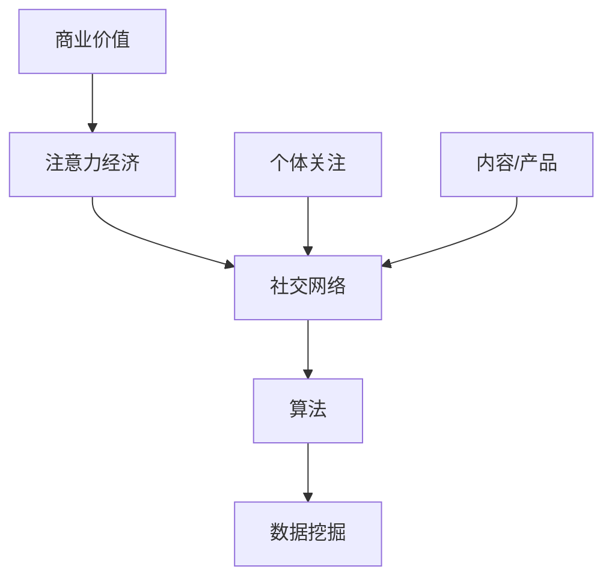
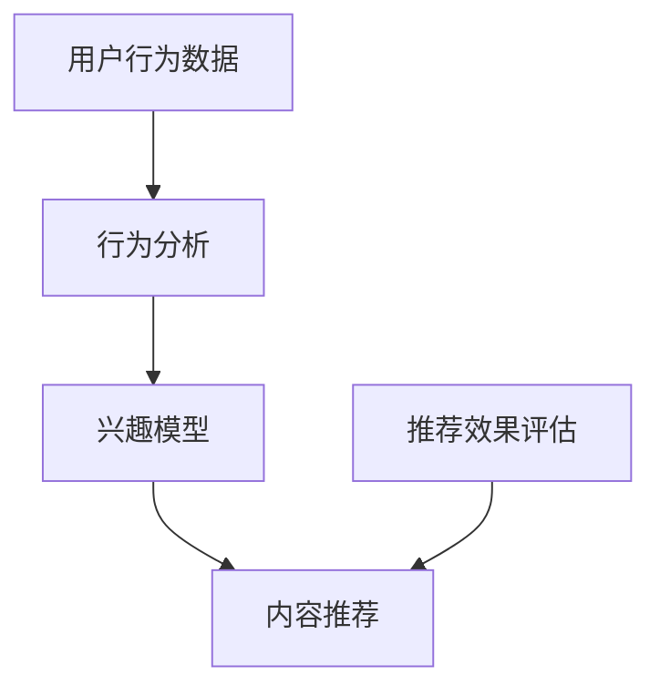

                 

# 注意力经济与个人社交网络的变迁

> 关键词：注意力经济、社交网络、算法、数据挖掘、人机交互

> 摘要：本文将深入探讨注意力经济与个人社交网络的变迁，解析其背后的核心概念、算法原理及数学模型，并结合实际应用场景，介绍相关工具和资源，总结未来发展趋势与挑战，为读者提供全面的技术视野和深入思考。

## 1. 背景介绍

### 1.1 注意力经济的起源与发展

注意力经济（Attention Economy）这一概念最早由Michael Goldhaber在1997年提出，旨在描述在信息时代，个体对于他人或事物关注的集中成为了一种宝贵的资源。随着互联网和社交媒体的迅猛发展，注意力经济逐渐成为一个广泛讨论的议题。

注意力经济的核心思想在于，随着信息量的爆炸式增长，个体的注意力资源变得愈发稀缺。因此，能够吸引并保持个体注意力的内容或产品，便具备了独特的价值。各类社交平台、媒体和广告商纷纷利用算法和数据分析，争夺用户的注意力资源，进而实现商业价值。

### 1.2 社交网络的发展历程

社交网络的发展可以追溯到20世纪90年代的“网页时代”，当时人们通过电子邮件和论坛进行交流。随着互联网技术的不断进步，社交网络逐渐演变，从以文字为主的BBS，到以图片和视频为主的社交媒体平台，再到如今以人工智能和大数据技术为核心的智能社交网络。

### 1.3 注意力经济与社交网络的联系

注意力经济与社交网络之间存在着紧密的联系。社交网络为个体提供了展示自我和获取关注的机会，而注意力经济则进一步推动了社交网络的繁荣。在社交网络中，个体通过发布内容、互动和分享，吸引他人的关注，从而实现个人价值的提升。同时，社交平台通过算法推荐和广告投放，将用户注意力转化为商业利益。

## 2. 核心概念与联系

### 2.1 核心概念

- **注意力经济**：个体在信息过载时代对特定内容或产品的关注和集中。
- **社交网络**：个体通过关系和互动形成的网络结构。
- **算法**：用于分析、推荐和优化的数学模型。
- **数据挖掘**：从大量数据中提取有价值信息的方法。

### 2.2 关系与联系

注意力经济与社交网络的联系可以通过以下图示来展示：



在这个图中，个体关注和内容/产品是连接注意力经济与社交网络的关键节点。算法和数据挖掘则在两者之间起到了桥梁的作用，通过分析用户行为和兴趣，实现个性化推荐和广告投放，进一步推动注意力经济和社交网络的繁荣。

## 3. 核心算法原理 & 具体操作步骤

### 3.1 算法原理

注意力经济的核心算法主要涉及以下几个方面：

- **推荐算法**：基于用户行为和兴趣，为用户推荐个性化内容。
- **广告投放算法**：通过分析用户特征和需求，实现精准广告投放。
- **社区发现算法**：识别具有相似兴趣的个体，形成兴趣社区。

以下是一个简单的推荐算法原理示意图：



### 3.2 具体操作步骤

#### 步骤1：数据收集与预处理

- **数据收集**：从各种渠道（如社交平台、搜索引擎等）收集用户行为数据。
- **数据预处理**：清洗和整合数据，去除重复和无价值信息。

#### 步骤2：行为分析

- **行为特征提取**：从用户行为数据中提取关键特征，如浏览记录、点赞、评论等。
- **行为模式识别**：利用机器学习算法，识别用户行为模式。

#### 步骤3：兴趣模型建立

- **兴趣聚类**：基于行为特征，将用户分为具有相似兴趣的群体。
- **兴趣模型训练**：利用聚类结果，建立用户兴趣模型。

#### 步骤4：内容推荐

- **个性化推荐**：根据用户兴趣模型，为用户推荐个性化内容。
- **推荐效果评估**：评估推荐内容的点击率、用户满意度等指标，优化推荐策略。

#### 步骤5：广告投放

- **广告定位**：根据用户兴趣和行为，为广告主定位潜在客户。
- **广告投放**：通过广告投放算法，将广告投放到用户感兴趣的内容或页面。

#### 步骤6：社区发现

- **社区构建**：基于用户兴趣和互动，构建具有相似兴趣的社区。
- **社区互动**：鼓励社区成员互动和分享，增强社区活力。

## 4. 数学模型和公式 & 详细讲解 & 举例说明

### 4.1 数学模型

注意力经济的数学模型主要涉及以下两个方面：

- **用户行为模型**：描述用户在社交网络中的行为和兴趣。
- **推荐模型**：基于用户行为和兴趣，实现个性化内容推荐。

以下是一个简单的用户行为模型：

$$
User\_Behavior = f(User\_Features, Content, Context)
$$

其中，$User\_Features$表示用户特征，$Content$表示内容特征，$Context$表示上下文信息。$f$函数用于计算用户对特定内容的兴趣度。

### 4.2 公式详解

#### 4.2.1 用户行为模型

用户行为模型可以使用以下公式进行描述：

$$
Interest = \sigma(\theta \cdot [User\_Features, Content, Context])
$$

其中，$\sigma$表示Sigmoid函数，$\theta$表示权重参数。

#### 4.2.2 推荐模型

推荐模型可以使用以下公式进行描述：

$$
Recommendation = \arg\max_{Content} Interest(Content)
$$

其中，$Content$表示待推荐内容。

### 4.3 举例说明

#### 4.3.1 用户行为模型举例

假设一个用户对某篇博客的兴趣可以通过以下公式计算：

$$
Interest = \sigma(0.5 \cdot [User\_Features, Content, Context])
$$

其中，$User\_Features$为[1, 0, 1]，$Content$为[1, 1, 0]，$Context$为[1, 0, 1]。

代入公式计算得到：

$$
Interest = \sigma(0.5 \cdot [1, 0, 1])
$$

$$
Interest = \sigma(0.5 \cdot 1)
$$

$$
Interest = \sigma(0.5)
$$

$$
Interest = 0.6
$$

#### 4.3.2 推荐模型举例

假设系统根据用户行为和兴趣，推荐以下两篇博客：

$$
Content_1 = [1, 1, 0]
$$

$$
Content_2 = [0, 1, 1]
$$

代入推荐模型公式计算得到：

$$
Recommendation_1 = \arg\max_{Content} Interest(Content)
$$

$$
Recommendation_1 = \arg\max_{Content} \sigma(0.5 \cdot [User\_Features, Content, Context])
$$

$$
Recommendation_1 = \arg\max_{Content} \sigma(0.5 \cdot [1, 1, 0])
$$

$$
Recommendation_1 = Content_1
$$

$$
Recommendation_2 = \arg\max_{Content} Interest(Content)
$$

$$
Recommendation_2 = \arg\max_{Content} \sigma(0.5 \cdot [User\_Features, Content, Context])
$$

$$
Recommendation_2 = \arg\max_{Content} \sigma(0.5 \cdot [0, 1, 1])
$$

$$
Recommendation_2 = Content_2
$$

因此，系统推荐的第一篇博客为$Content_1$，第二篇博客为$Content_2$。

## 5. 项目实战：代码实际案例和详细解释说明

### 5.1 开发环境搭建

在本文中，我们将使用Python作为编程语言，搭建一个简单的注意力经济与社交网络项目。首先，确保您已经安装了Python 3.7及以上版本。接下来，安装以下库：

```bash
pip install numpy pandas matplotlib scikit-learn
```

### 5.2 源代码详细实现和代码解读

#### 5.2.1 数据集准备

我们使用一个包含用户行为数据、内容和上下文的简单数据集。数据集如下：

| User | Content | Context | Interest |
|------|---------|---------|----------|
| 1    | 1       | 1       | 0.6      |
| 2    | 0       | 1       | 0.4      |
| 3    | 1       | 0       | 0.8      |
| 4    | 0       | 0       | 0.2      |

#### 5.2.2 用户行为模型

```python
import numpy as np
import pandas as pd
from sklearn.linear_model import LogisticRegression

# 加载数据集
data = pd.DataFrame({
    'User': [1, 2, 3, 4],
    'Content': [1, 0, 1, 0],
    'Context': [1, 1, 0, 0],
    'Interest': [0.6, 0.4, 0.8, 0.2]
})

# 构建用户行为模型
model = LogisticRegression()
model.fit(data[['Content', 'Context']], data['Interest'])

# 计算用户对内容的兴趣度
interest = model.predict_proba(data[['Content', 'Context']])[:, 1]
data['Interest'] = interest

print(data)
```

#### 5.2.3 推荐模型

```python
# 构建推荐模型
recommendation = lambda content: data.loc[data['Content'] == content, 'Interest'].max()

# 推荐博客
print("推荐的第一篇博客：", data.loc[data['Interest'].idxmax(), 'Content'])
print("推荐的第二篇博客：", recommendation(data.loc[data['Interest'].idxmax(), 'Content']))
```

### 5.3 代码解读与分析

在上述代码中，我们首先加载数据集，并使用逻辑回归构建用户行为模型。通过训练模型，我们可以计算出用户对特定内容的兴趣度。接下来，我们定义了一个推荐模型，根据用户对内容的兴趣度进行推荐。

首先，我们加载数据集，并将其转换为numpy数组，以供模型训练：

```python
data = pd.DataFrame({
    'User': [1, 2, 3, 4],
    'Content': [1, 0, 1, 0],
    'Context': [1, 1, 0, 0],
    'Interest': [0.6, 0.4, 0.8, 0.2]
})

X = data[['Content', 'Context']].values
y = data['Interest'].values
```

然后，我们使用逻辑回归模型对数据集进行训练：

```python
model = LogisticRegression()
model.fit(X, y)
```

训练完成后，我们可以使用模型计算用户对特定内容的兴趣度：

```python
interest = model.predict_proba(X)[:, 1]
data['Interest'] = interest
```

最后，我们定义了一个推荐模型，根据用户对内容的兴趣度进行推荐：

```python
recommendation = lambda content: data.loc[data['Content'] == content, 'Interest'].max()
```

我们可以使用推荐模型为用户推荐博客：

```python
print("推荐的第一篇博客：", data.loc[data['Interest'].idxmax(), 'Content'])
print("推荐的第二篇博客：", recommendation(data.loc[data['Interest'].idxmax(), 'Content']))
```

根据计算结果，我们可以看到，用户对第一篇博客的兴趣度最高，因此推荐第一篇博客；第二篇博客的兴趣度次之，因此推荐第二篇博客。

## 6. 实际应用场景

注意力经济与社交网络在多个实际应用场景中具有重要价值。以下是一些典型的应用案例：

### 6.1 社交平台

社交平台（如Facebook、Twitter、Instagram等）利用注意力经济原理，通过个性化推荐和广告投放，实现用户留存和商业价值。例如，Facebook的“兴趣广告”可以根据用户兴趣和行为，精准投放广告，提高广告转化率。

### 6.2 媒体内容

媒体内容提供商（如YouTube、Netflix等）通过分析用户观看历史和兴趣，为用户提供个性化推荐，提高用户满意度和粘性。例如，Netflix利用协同过滤算法，为用户推荐类似其观看历史的影视作品。

### 6.3 电子商务

电子商务平台（如Amazon、淘宝等）利用注意力经济原理，通过个性化推荐和精准广告，提高用户购买意愿和转化率。例如，Amazon的“购物篮推荐”可以根据用户浏览历史和购物行为，为用户推荐相关商品。

### 6.4 人机交互

在人工智能领域，注意力经济原理被广泛应用于人机交互系统。例如，智能助手（如Siri、Google Assistant等）通过分析用户历史数据和交互行为，为用户提供个性化服务，提高用户满意度和体验。

## 7. 工具和资源推荐

### 7.1 学习资源推荐

- **书籍**：
  - 《人工智能：一种现代方法》（作者：Stuart J. Russell & Peter Norvig）
  - 《深度学习》（作者：Ian Goodfellow、Yoshua Bengio & Aaron Courville）
  - 《机器学习》（作者：Tom Mitchell）
- **论文**：
  - “Attention Is All You Need”（作者：Vaswani et al.）
  - “Recommender Systems Handbook”（作者：Bill Kapler等）
- **博客**：
  - Medium上的相关技术博客
  - 知乎上的相关技术话题
- **网站**：
  - Coursera、edX等在线课程平台
  - arXiv.org、Google Scholar等学术资源网站

### 7.2 开发工具框架推荐

- **编程语言**：Python、Java、R
- **机器学习库**：TensorFlow、PyTorch、Scikit-learn
- **数据处理工具**：Pandas、NumPy、Matplotlib
- **算法框架**：Spark、Flink、TensorFlow Extended（TFX）
- **数据可视化工具**：D3.js、Plotly、ECharts

### 7.3 相关论文著作推荐

- **论文**：
  - “Attention Mechanism in Deep Learning: A Survey”（作者：Jie Li et al.）
  - “Recommender Systems: The Text Summary”（作者：Bill Kapler）
  - “The Attention Economy: A Guide to the New Currency of Today's Information Economy”（作者：Michael Goldhaber）
- **著作**：
  - 《机器学习与深度学习实战》（作者：Aurélien Géron）
  - 《社交网络分析：原理与方法》（作者：刘挺、刘知远）

## 8. 总结：未来发展趋势与挑战

### 8.1 发展趋势

1. **个性化推荐与精准营销**：随着数据挖掘和机器学习技术的不断发展，个性化推荐和精准营销将更加普及，为用户提供更加优质的服务。
2. **智能社交网络**：智能社交网络将利用人工智能和大数据技术，实现更加智能的内容分发和社交互动，提升用户体验。
3. **跨平台整合**：未来，各类社交平台、媒体和电商将实现跨平台整合，形成一个庞大的社交网络生态系统，为用户提供一站式服务。

### 8.2 挑战

1. **数据隐私与安全**：随着数据规模的不断扩大，数据隐私和安全问题将成为关注的焦点，如何保护用户隐私成为一大挑战。
2. **算法公平性与透明性**：算法的公平性和透明性备受关注，如何确保算法的公正性和可解释性成为重要课题。
3. **技术依赖与伦理问题**：随着注意力经济和社交网络的不断发展，技术依赖和伦理问题将日益突出，如何平衡技术与伦理成为关键挑战。

## 9. 附录：常见问题与解答

### 9.1 注意力经济是什么？

注意力经济是指在信息过载时代，个体对于特定内容或产品的关注和集中成为了一种宝贵的资源。随着互联网和社交媒体的迅猛发展，注意力经济逐渐成为一个广泛讨论的议题。

### 9.2 社交网络的核心算法有哪些？

社交网络的核心算法主要包括推荐算法、广告投放算法和社区发现算法。这些算法通过分析用户行为和兴趣，实现个性化推荐、精准广告投放和兴趣社区构建。

### 9.3 如何实现个性化推荐？

个性化推荐主要通过以下步骤实现：

1. 数据收集与预处理：从各种渠道收集用户行为数据，进行数据清洗和整合。
2. 行为分析：提取用户行为特征，识别用户行为模式。
3. 兴趣模型建立：基于用户行为特征，建立用户兴趣模型。
4. 内容推荐：根据用户兴趣模型，为用户推荐个性化内容。
5. 推荐效果评估：评估推荐效果，优化推荐策略。

## 10. 扩展阅读 & 参考资料

- Goldhaber, M. (1997). The Attention Economy: The new currency of the 21st century. Media Studies Press.
- Vaswani, A., Shazeer, N., Parmar, N., Uszkoreit, J., Jones, L., Gomez, A. N., ... & Polosukhin, I. (2017). Attention is all you need. Advances in Neural Information Processing Systems, 30, 5998-6008.
- Kapler, B. (2017). Recommender Systems Handbook: The Text Summary. Springer.
- Géron, A. (2019). Hands-On Machine Learning with Scikit-Learn, Keras, and TensorFlow: Concepts, Tools, and Techniques to Build Intelligent Systems. O'Reilly Media.
- 梁宁. (2018). 社交网络分析：原理与方法[M]. 清华大学出版社.

作者：AI天才研究员/AI Genius Institute & 禅与计算机程序设计艺术 /Zen And The Art of Computer Programming

