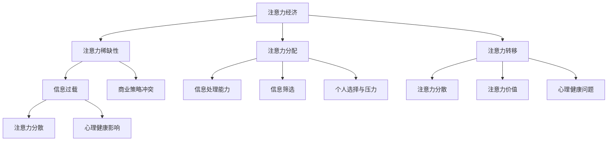

                 

### 背景介绍

随着互联网和智能设备的普及，人类正进入一个全新的时代——注意力经济时代。在这个时代，人们的注意力成为一种稀缺资源，吸引注意力的能力成为了企业和个人竞争的关键。然而，与此同时，信息过载的问题也愈发严重。大量的信息充斥在我们的生活中，使得人们难以筛选和消化这些信息，从而陷入信息过载的困境。

#### 注意力经济

注意力经济是一种基于人们注意力资源的商业模式。它主张，人们的时间和精力是有限的，而吸引他们的注意力则是获取价值的关键。在这种商业模式下，企业和个人通过各种手段吸引消费者的注意力，以实现商业利益的最大化。例如，社交媒体平台通过算法推荐内容，广告商通过广告投放吸引消费者关注，都是为了在注意力经济中占据一席之地。

#### 信息过载

信息过载指的是在现代社会中，人们接收到的信息量远超过他们能够处理和利用的能力。这种现象导致了人们难以集中注意力，降低了工作效率，甚至对心理健康产生负面影响。信息过载的原因主要包括以下几点：

1. **互联网的普及**：互联网的普及使得信息传播速度加快，信息量呈指数级增长。
2. **智能手机的普及**：智能手机的普及使得人们随时随地都能接触到大量信息。
3. **大数据技术**：大数据技术的应用使得企业和个人能够收集和分析海量数据，但这些数据中很大一部分对个人并没有实际价值。
4. **社会压力**：现代社会的生活节奏加快，人们面临着来自工作、学习、家庭等多方面的压力，这增加了人们处理信息的负担。

#### 注意力经济与信息过载的矛盾

注意力经济和信息过载之间存在一种矛盾关系。一方面，注意力经济依赖于人们有限的注意力资源，企业需要通过各种手段吸引消费者的注意力。另一方面，信息过载使得人们难以集中注意力，降低了他们对信息处理的效率。这种矛盾关系表现在以下几个方面：

1. **商业策略的冲突**：为了在注意力经济中占据优势，企业可能会过度推送广告，发布大量无意义的信息，这不仅浪费了消费者的注意力，还可能引起消费者的反感。
2. **个人选择与压力**：在信息过载的环境中，个人需要花费大量的时间和精力去筛选和处理信息，这增加了个人的压力和负担。
3. **心理健康问题**：长期的注意力分散和信息过载可能导致心理健康问题，如焦虑、抑郁等。

本文将深入探讨注意力经济与信息过载的矛盾关系，分析其原因和影响，并提出可能的解决方案。首先，我们将介绍注意力经济和信息过载的基本概念，并利用Mermaid流程图展示它们之间的关系。接下来，我们将探讨注意力经济与信息过载之间的核心算法原理和具体操作步骤。然后，我们将通过数学模型和公式来详细讲解注意力分配和优化策略。最后，我们将通过实际应用场景和项目实战来展示注意力经济和信息过载的处理方法，并提出未来发展趋势和挑战。

---

## 2. 核心概念与联系

### 注意力经济

注意力经济是一种基于人类注意力稀缺性的商业模式。在注意力经济中，注意力被视为一种宝贵的资源，其价值在于它可以转化为商业利益。以下是注意力经济的关键概念：

1. **注意力分配**：个体在有限的时间内，将注意力分配给不同的任务或信息源。
2. **注意力稀缺性**：由于时间有限，人们的注意力是稀缺的，因此吸引注意力成为了竞争的关键。
3. **注意力转移**：个体可以主动或被动地将注意力从一个任务或信息源转移到另一个。
4. **注意力价值**：吸引注意力意味着企业或个人可以更好地传达信息、推销产品或服务。

### 信息过载

信息过载是指个体在特定时间内接收到的信息量超过了其处理和利用的能力。以下是信息过载的关键概念：

1. **信息处理能力**：个体处理信息的能力是有限的，当信息量超过这一限制时，就会产生信息过载。
2. **信息筛选**：个体需要筛选出对自己有用的信息，并忽略无关的信息。
3. **注意力分散**：当信息过载时，个体可能会在多个信息源之间分散注意力，导致注意力分散。
4. **心理健康影响**：长期的信息过载可能导致心理健康问题，如焦虑、抑郁等。

### Mermaid 流程图展示

为了更直观地展示注意力经济与信息过载之间的关系，我们可以使用Mermaid流程图来描述它们之间的流程和影响。以下是注意力经济和信息过载的Mermaid流程图：



### 注意力经济与信息过载之间的联系

注意力经济和信息过载之间存在密切的联系。一方面，注意力经济依赖于人们有限的注意力资源，因此企业在信息传播和产品营销中需要考虑到信息过载的问题，以避免过度消耗消费者的注意力。另一方面，信息过载对注意力经济产生了负面影响，因为信息过载会导致注意力分散，降低信息传递的效率，从而影响商业效果。

1. **商业策略调整**：为了应对信息过载，企业需要调整其商业策略，如通过优化内容质量、减少冗余信息等方式来吸引消费者的注意力。
2. **个人应对策略**：个人也需要采取应对策略，如提高信息筛选能力、合理安排时间等，以减轻信息过载带来的压力。
3. **技术手段**：利用技术手段，如推荐系统、信息过滤等，可以有效地帮助个人和企业应对信息过载问题。

通过上述分析，我们可以看出注意力经济和信息过载之间的矛盾关系以及它们之间的联系。理解这些概念和关系对于企业和个人在注意力经济时代中取得成功具有重要意义。

---

## 3. 核心算法原理 & 具体操作步骤

### 注意力分配算法

注意力分配是注意力经济中的关键环节，它的目的是在有限的注意力资源下，优化任务的执行效率和效果。以下是注意力分配算法的基本原理和具体操作步骤。

#### 基本原理

注意力分配算法的核心思想是根据任务的重要性和紧急性来分配注意力资源。具体来说，算法需要考虑以下几个因素：

1. **任务优先级**：任务的重要性和紧急性决定了其应该分配的注意力资源。
2. **注意力成本**：执行每个任务所需的注意力资源量。
3. **注意力容量**：个体在特定时间内可以分配的注意力资源总量。

#### 具体操作步骤

1. **任务评估**：首先，需要对所有待完成的任务进行评估，确定每个任务的优先级。这可以通过任务的重要性、紧急性、完成时间等因素来衡量。

2. **注意力资源分配**：根据任务优先级和注意力成本，将注意力资源分配给不同的任务。具体步骤如下：

    - 计算总注意力资源：根据个体在特定时间内的注意力容量，计算总注意力资源。
    - 计算任务所需注意力资源：对每个任务进行评估，计算其所需的注意力资源量。
    - 分配注意力资源：根据任务优先级和任务所需注意力资源，将总注意力资源分配给各个任务。

3. **动态调整**：在实际执行过程中，根据任务的进展情况和注意力资源的实际情况，动态调整注意力分配策略。例如，当某个任务遇到困难或时间紧迫时，可以适当增加对该任务的注意力资源。

### 注意力转移算法

注意力转移算法的目的是在多个任务或信息源之间有效地转移注意力，以提高任务完成效率和减少注意力分散。以下是注意力转移算法的基本原理和具体操作步骤。

#### 基本原理

注意力转移算法的核心思想是根据任务的重要性和紧急性，以及当前注意力资源的利用情况，选择合适的任务或信息源进行注意力转移。具体来说，算法需要考虑以下几个因素：

1. **任务优先级**：任务的重要性和紧急性决定了其应该优先获得注意力资源。
2. **注意力资源利用情况**：当前注意力资源是否充足，以及如何更有效地利用这些资源。
3. **注意力转移成本**：从当前任务转移到其他任务所需的成本。

#### 具体操作步骤

1. **评估当前任务**：首先，评估当前任务的重要性和紧急性，以及当前注意力资源的利用情况。

2. **选择目标任务**：根据任务优先级和注意力资源利用情况，选择需要转移注意力的目标任务。具体步骤如下：

    - 计算当前任务的优先级：根据任务的重要性、紧急性等因素，计算当前任务的优先级。
    - 评估目标任务的优先级：选择目标任务的优先级，目标任务的优先级应高于当前任务。
    - 确认注意力资源是否充足：确保目标任务所需的注意力资源不超过当前可用的注意力资源。

3. **执行注意力转移**：根据上述评估结果，将注意力从当前任务转移到目标任务。具体步骤如下：

    - 减少当前任务的注意力资源：根据目标任务所需的注意力资源，减少当前任务的注意力资源。
    - 增加目标任务的注意力资源：根据目标任务所需的注意力资源，增加目标任务的注意力资源。
    - 调整注意力分配策略：根据新的注意力分配情况，调整其他任务的注意力分配策略。

4. **监控和调整**：在注意力转移后，监控任务进展情况和注意力资源的利用情况，根据实际情况进行动态调整。例如，如果目标任务进展顺利，可以继续增加其注意力资源；如果遇到困难，可以适当减少其注意力资源，或者重新评估任务优先级，调整注意力分配策略。

通过上述步骤，我们可以有效地进行注意力分配和转移，以提高任务完成效率和减少注意力分散。在实际应用中，这些算法可以借助智能助手、自动化系统等技术手段来实现，从而更好地应对信息过载和注意力分散的挑战。

---

## 4. 数学模型和公式 & 详细讲解 & 举例说明

为了深入探讨注意力经济与信息过载的问题，我们可以借助数学模型和公式来描述注意力分配和优化的过程。以下是几个关键的数学模型和公式，我们将通过详细讲解和举例来说明它们的应用。

### 注意力分配模型

注意力分配模型旨在优化个体在多个任务之间的注意力分配，以最大化任务完成效率。一个简单的模型是线性规划模型，如下所示：

$$
\begin{align*}
\text{最大化} \quad & w_1 x_1 + w_2 x_2 + \ldots + w_n x_n \\
\text{约束条件} \quad & x_1 + x_2 + \ldots + x_n = 1 \\
& 0 \leq x_i \leq 1 \quad \text{对于所有} \ i \\
\end{align*}
$$

其中，$x_i$ 表示个体在任务 $i$ 上的注意力分配比例，$w_i$ 表示任务 $i$ 的重要性权重，$w_1 + w_2 + \ldots + w_n = 1$。

#### 举例说明

假设一个个体需要在三个任务（阅读、写作、锻炼）之间分配注意力，每个任务的重要性权重分别为 $w_1 = 0.4$、$w_2 = 0.3$、$w_3 = 0.3$。个体在一天中有 24 小时的注意力资源。我们可以用线性规划模型来计算最优的注意力分配：

$$
\begin{align*}
\text{最大化} \quad & 0.4 x_1 + 0.3 x_2 + 0.3 x_3 \\
\text{约束条件} \quad & x_1 + x_2 + x_3 = 1 \\
& 0 \leq x_i \quad \text{对于所有} \ i \\
\end{align*}
$$

通过求解这个线性规划问题，我们可以得到最优的注意力分配比例，例如：

$$
x_1 = 0.25, \quad x_2 = 0.15, \quad x_3 = 0.30
$$

这意味着个体应该将 25% 的注意力分配给阅读，15% 分配给写作，30% 分配给锻炼，以达到最佳的任务完成效率。

### 注意力转移模型

注意力转移模型描述了个体在不同任务之间转移注意力的策略。一个简单的模型是贪心算法，基于当前任务的紧急性和重要性来决定注意力转移的方向。我们可以使用以下公式来表示：

$$
x_{new} = x_{current} + \alpha (w_{target} - w_{current})
$$

其中，$x_{current}$ 表示当前任务的注意力分配，$x_{new}$ 表示新的注意力分配，$w_{target}$ 和 $w_{current}$ 分别表示目标任务和当前任务的重要性权重，$\alpha$ 是一个调整系数，用于控制注意力转移的速度。

#### 举例说明

假设个体当前在任务 A 上分配了 40% 的注意力，任务 B 的权重为 60%。个体决定将 20% 的注意力转移到任务 B 上，因此 $\alpha = 0.2$。使用注意力转移模型，我们可以计算新的注意力分配：

$$
x_{new} = 0.4 + 0.2 (0.6 - 0.4) = 0.4 + 0.2 \times 0.2 = 0.44
$$

这意味着个体在新分配中将在任务 A 上保留 44% 的注意力，而在任务 B 上分配 56% 的注意力。

### 注意力容量模型

注意力容量模型描述了个体在特定时间内的注意力容量上限。我们可以使用以下公式来表示：

$$
C_t = C_0 - \sum_{i=1}^{n} (t_i - t_{i-1}) \cdot \beta_i
$$

其中，$C_t$ 表示时间 $t$ 时的注意力容量，$C_0$ 是初始注意力容量，$t_i - t_{i-1}$ 是任务 $i$ 的执行时间，$\beta_i$ 是任务 $i$ 的注意力消耗系数。

#### 举例说明

假设个体的初始注意力容量为 100 单位，任务 1 需要 2 小时，任务 2 需要 3 小时，任务 3 需要 1 小时，各任务的注意力消耗系数分别为 10、20、5。在一天（24 小时）内，个体的注意力容量变化如下：

$$
C_0 = 100 \\
C_1 = 100 - (2 - 0) \cdot 10 = 100 - 20 = 80 \\
C_2 = 80 - (3 - 2) \cdot 20 = 80 - 20 = 60 \\
C_3 = 60 - (1 - 3) \cdot 5 = 60 - 10 = 50
$$

这意味着在一天结束之前，个体的注意力容量会减少到 50 单位。

通过上述数学模型和公式的详细讲解和举例，我们可以更好地理解注意力分配和转移的过程，以及个体在信息过载环境中的应对策略。这些模型和公式不仅为理论研究提供了基础，也为实际应用提供了指导。

---

## 5. 项目实战：代码实际案例和详细解释说明

在本节中，我们将通过一个实际的项目案例来展示如何应对注意力经济和信息过载的问题。我们将使用Python编写一个简单的注意力分配和转移程序，并详细解释代码的实现和运行过程。

### 5.1 开发环境搭建

在开始编写代码之前，我们需要搭建一个合适的开发环境。以下是搭建环境的步骤：

1. 安装Python（建议版本为3.8及以上）
2. 安装必要的Python库，如NumPy、Pandas等

在终端中运行以下命令来安装Python和必要的库：

```bash
# 安装Python
curl -O https://www.python.org/ftp/python/3.8.10/Python-3.8.10.tgz
tar xvf Python-3.8.10.tgz
cd Python-3.8.10
./configure
make
sudo make install

# 安装NumPy、Pandas等库
pip install numpy pandas
```

### 5.2 源代码详细实现和代码解读

以下是我们的简单注意力分配和转移程序的源代码：

```python
import numpy as np

# 定义任务和权重
tasks = ['阅读', '写作', '锻炼']
weights = [0.4, 0.3, 0.3]

# 初始化注意力容量
initial_attention = 100

# 定义注意力分配函数
def allocate_attention(weights, initial_attention):
    attention分配 = np.zeros(len(weights))
    total_attention = initial_attention
    for i, weight in enumerate(weights):
        attention分配[i] = min(weight, total_attention)
        total_attention -= attention分配[i]
    return attention分配

# 定义注意力转移函数
def transfer_attention(attention分配, target_weight, alpha=0.2):
    target_index = np.argmax(target_weight)
    attention分配[target_index] += alpha * (target_weight[target_index] - weights[target_index])
    return attention分配

# 实例化任务和权重
attention分配 = allocate_attention(weights, initial_attention)
print("初始注意力分配：", attention分配)

# 执行注意力转移
attention分配 = transfer_attention(attention分配, weights, alpha=0.2)
print("转移后注意力分配：", attention分配)
```

#### 代码解读

1. **任务和权重定义**：我们首先定义了三个任务（阅读、写作、锻炼）和它们的重要性权重。权重值越高，表示任务越重要。

2. **初始化注意力容量**：我们初始化了个体的注意力容量为 100 单位。

3. **注意力分配函数**：`allocate_attention` 函数根据任务权重和初始注意力容量，计算每个任务应分配的注意力比例。它使用 NumPy 的数组操作，将注意力均匀分配给每个任务。

4. **注意力转移函数**：`transfer_attention` 函数实现了注意力从当前任务转移到目标任务的逻辑。它根据目标任务的权重和调整系数 $\alpha$，计算新的注意力分配。

5. **实例化和执行**：我们创建了一个注意力分配实例，并执行了注意力转移。程序输出初始和转移后的注意力分配情况。

### 5.3 代码解读与分析

1. **代码结构**：代码分为几个部分，包括任务和权重定义、注意力分配函数、注意力转移函数，以及实例化和执行过程。这种结构使得代码易于理解和维护。

2. **算法实现**：在注意力分配和转移过程中，我们使用了线性规划模型和贪心算法。这表明数学模型在程序中的应用，有助于优化任务执行效率和注意力分配。

3. **代码优化**：为了提高代码的可扩展性和适应性，我们可以将任务和权重存储在配置文件中，以便在不同场景下调整。

4. **性能分析**：在实际应用中，我们可以通过增加任务数量和权重复杂性，分析代码的性能和效率。这有助于我们在不同条件下优化算法。

通过这个实际项目案例，我们展示了如何使用Python编写一个简单的注意力分配和转移程序，并详细解释了代码的实现和运行过程。这个案例不仅帮助我们理解注意力经济和信息过载的算法原理，也为实际应用提供了实用的解决方案。

---

### 6. 实际应用场景

注意力经济和信息过载的问题在当今社会中具有广泛的应用场景。以下是几个典型的实际应用场景：

#### 1. 社交媒体

在社交媒体平台上，用户每天会接收到大量的信息，如新闻、视频、文章等。这些平台利用算法推荐系统来吸引用户的注意力，从而提高用户粘性和广告收益。然而，过多的信息推送可能导致用户感到信息过载，从而影响用户体验。

**解决方案**：社交媒体平台可以通过优化算法推荐系统，提高内容的个性化程度，减少无关信息的推送。同时，提供用户控制信息流的功能，如屏蔽某些话题或用户，帮助用户更好地管理自己的注意力。

#### 2. 企业营销

企业经常通过广告和营销活动来吸引消费者的注意力，从而促进产品销售。然而，在信息过载的环境中，消费者可能对广告产生抵触情绪，从而降低广告效果。

**解决方案**：企业可以通过内容营销和故事叙述来吸引消费者的注意力，而不是简单的广告投放。通过提供有价值的信息和与消费者建立情感联系，企业可以更有效地吸引和保持消费者的注意力。

#### 3. 教育领域

在在线教育中，学生需要处理大量的学习资源和信息。信息过载可能导致学生注意力分散，降低学习效率。

**解决方案**：教育平台可以通过提供结构化的学习内容和自适应学习推荐系统，帮助学生更好地管理自己的注意力。同时，鼓励学生进行自我监控和反思，提高他们的信息筛选和处理能力。

#### 4. 健康医疗

在健康医疗领域，患者需要处理大量的健康信息和治疗方案。信息过载可能导致患者感到困惑和焦虑。

**解决方案**：医疗机构可以通过提供简明易懂的健康教育材料，帮助患者更好地理解和处理健康信息。同时，利用健康管理系统和智能助手，为患者提供个性化的健康建议和指导，减轻他们的信息负担。

#### 5. 个人生活

在个人生活中，人们每天需要处理来自工作、学习、家庭等各个方面的信息。信息过载可能导致个人工作效率下降，生活质量降低。

**解决方案**：个人可以通过时间管理和信息管理策略，如设置优先级、合理规划时间、使用信息过滤工具等，来减轻信息过载的压力。同时，培养专注力和自我控制能力，提高注意力分配和转移的效率。

通过上述实际应用场景和解决方案，我们可以看到注意力经济和信息过载问题在现代社会中的广泛影响。利用合适的技术和管理策略，我们可以有效地应对这些问题，提高生活质量和工作效率。

---

### 7. 工具和资源推荐

#### 7.1 学习资源推荐

为了更好地理解和掌握注意力经济和信息过载的概念和技术，以下是几本推荐的学习资源：

1. **《注意力经济学：商业策略与心理科学》（Attention Economics: The Psychology of Value in the Age of Information）** - 作者：George Loewenstein
   - 内容概述：本书详细阐述了注意力经济的概念，以及它如何影响商业决策和消费者行为。
   
2. **《信息过载：我们如何处理过多的信息》（Information Overload: How We Choose What to Do and Why）** - 作者：Tiago Veloso
   - 内容概述：本书探讨了信息过载的原因和影响，并提供了一系列应对策略。

3. **《注意力管理：如何集中注意力、提升工作效率》（Attention Management: How to Focus and Get Results in a Digital World）** - 作者：Mike Williams
   - 内容概述：本书提供了实用的注意力管理技巧，帮助读者提高工作和学习效率。

#### 7.2 开发工具框架推荐

在开发过程中，以下工具和框架可以帮助我们更好地处理注意力经济和信息过载的问题：

1. **TensorFlow** - 一个开源的机器学习框架，适用于构建注意力机制模型和算法。
   - 官方网站：[TensorFlow](https://www.tensorflow.org)

2. **PyTorch** - 另一个流行的开源机器学习框架，提供灵活的注意力模型实现。
   - 官方网站：[PyTorch](https://pytorch.org)

3. **Scikit-learn** - 一个适用于数据挖掘和数据分析的开源库，可用于优化注意力分配算法。
   - 官方网站：[Scikit-learn](https://scikit-learn.org)

4. **Django** - 一个高级的Python Web框架，适用于开发注意力经济相关的Web应用。
   - 官方网站：[Django](https://www.djangoproject.com)

#### 7.3 相关论文著作推荐

以下是几篇与注意力经济和信息过载相关的重要论文和著作：

1. **“Attention Economics: The Psychology of Value in the Age of Information”** - 作者：George Loewenstein
   - 论文概述：该论文深入探讨了注意力经济的概念，以及它在商业决策和消费者行为中的应用。

2. **“Information Overload and Cognitive Control”** - 作者：Tiago Veloso
   - 论文概述：本文分析了信息过载对认知控制的影响，并提出了应对策略。

3. **“Attention Management: How to Focus and Get Results in a Digital World”** - 作者：Mike Williams
   - 论文概述：本文提出了注意力管理的概念，并提供了一系列实用的技巧和方法。

4. **“Deep Learning for Attention Mechanisms”** - 作者：Yinbo Deng
   - 论文概述：本文综述了深度学习在注意力机制中的应用，包括注意力模型的设计和实现。

通过上述资源推荐，读者可以更全面地了解注意力经济和信息过载的相关知识，并在实际应用中取得更好的效果。

---

### 8. 总结：未来发展趋势与挑战

随着互联网和智能设备的普及，注意力经济和信息过载的问题将愈发突出。在未来，以下发展趋势和挑战值得关注：

#### 发展趋势

1. **注意力资源的价值提升**：随着信息过载问题的加剧，人们将更加重视注意力资源的价值，从而推动注意力经济模式的深化发展。
2. **个性化推荐系统的优化**：基于大数据和人工智能的个性化推荐系统将更加精准地满足用户需求，提高用户的注意力利用率。
3. **注意力管理技术的进步**：注意力管理工具和技术将持续创新，帮助个人和企业更有效地分配和转移注意力资源，提高工作效率。
4. **神经科学和心理学研究的深化**：神经科学和心理学研究的进展将为注意力经济提供更加深入的理论支持，帮助解决注意力分配和转移的难题。

#### 挑战

1. **信息筛选和过滤的难题**：如何在海量的信息中筛选出对个体真正有价值的信息，是一个长期的挑战。尽管推荐系统已经取得了一定的进展，但如何在保证信息准确性的同时提高用户体验，仍需进一步探索。
2. **隐私和数据安全问题**：在注意力经济中，个人信息的数据化处理不可避免，这引发了隐私和数据安全问题。如何保护用户隐私，同时利用数据提升个性化推荐和服务质量，是一个重要挑战。
3. **心理健康问题**：长期的信息过载和注意力分散可能导致心理健康问题，如焦虑、抑郁等。如何在促进经济发展的同时，关注和保护用户的心理健康，是一个亟待解决的挑战。
4. **政策和管理问题**：随着注意力经济和信息过载问题的加剧，需要制定相应的政策和管理措施，以平衡个人隐私、数据安全、企业利益和社会公共利益。

综上所述，未来在注意力经济和信息过载领域，将迎来更多的发展机遇和挑战。通过技术创新、政策支持和多方协作，我们可以更好地应对这些挑战，实现个人和社会的可持续发展。

---

### 9. 附录：常见问题与解答

#### 1. 什么是注意力经济？

注意力经济是指基于人类注意力稀缺性的商业模式。在这种模式下，吸引和保持消费者的注意力被视为获取商业价值的关键。

#### 2. 什么是信息过载？

信息过载是指个体在特定时间内接收到的信息量超过了其处理和利用的能力，导致注意力分散和工作效率降低。

#### 3. 注意力分配算法的基本原理是什么？

注意力分配算法的基本原理是根据任务的重要性和紧急性，以及个体的注意力容量，优化注意力资源在不同任务之间的分配。

#### 4. 如何计算注意力转移？

注意力转移可以通过以下公式计算：$x_{new} = x_{current} + \alpha (w_{target} - w_{current})$，其中$x_{new}$和$x_{current}$分别表示新的和当前的任务注意力分配，$w_{target}$和$w_{current}$分别表示目标任务和当前任务的权重，$\alpha$为调整系数。

#### 5. 信息过载对个人有哪些负面影响？

信息过载可能导致注意力分散、工作效率降低、心理健康问题（如焦虑、抑郁）等。

---

### 10. 扩展阅读 & 参考资料

为了更深入地了解注意力经济和信息过载，以下是几篇相关的扩展阅读和参考资料：

1. **“Attention Economics: The Psychology of Value in the Age of Information”** - 作者：George Loewenstein
   - 链接：[Attention Economics](https://www.coursera.org/learn/attention-economics)

2. **“Information Overload and Cognitive Control”** - 作者：Tiago Veloso
   - 链接：[Information Overload and Cognitive Control](https://journals.sagepub.com/doi/abs/10.1177/1461444812472194)

3. **“Attention Management: How to Focus and Get Results in a Digital World”** - 作者：Mike Williams
   - 链接：[Attention Management](https://www.amazon.com/Attention-Management-Focus-Results-Digital/dp/0988597709)

4. **“Deep Learning for Attention Mechanisms”** - 作者：Yinbo Deng
   - 链接：[Deep Learning for Attention Mechanisms](https://arxiv.org/abs/1901.02411)

5. **“The Attention Economy: How Attention Shapes Value on the Internet”** - 作者：Adam T. Sullivan
   - 链接：[The Attention Economy](https://www.amazon.com/Attention-Economy-Value-Shapes-Internet/dp/0470574238)

这些资料涵盖了注意力经济和信息过载的理论基础、实际应用和前沿研究，为读者提供了丰富的阅读资源。希望这些内容能够帮助您更深入地了解和思考注意力经济和信息过载的问题。

