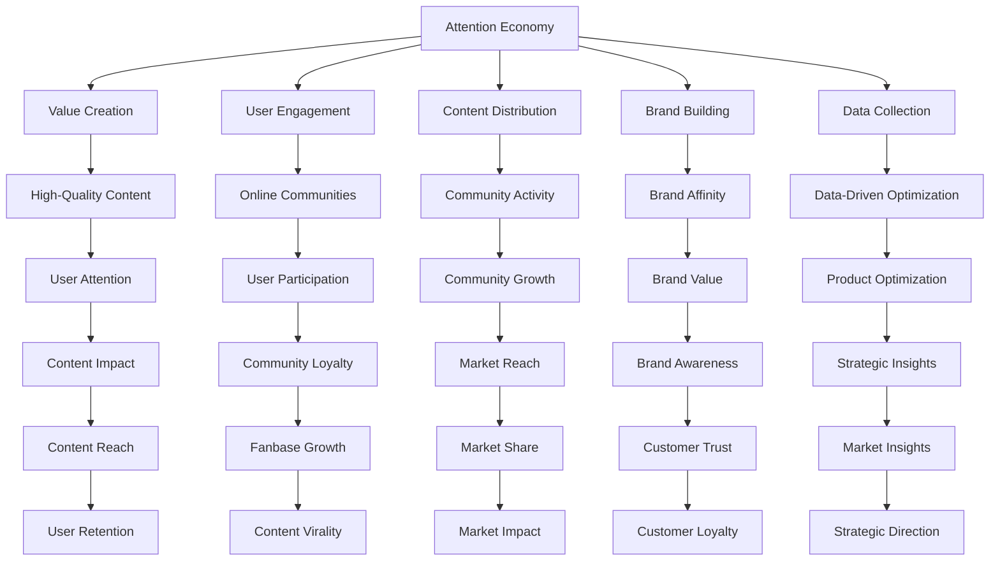

                 

### 背景介绍

#### 注意力经济的兴起

在数字化时代，注意力成为了一种新的宝贵资源，被称为“注意力经济”。注意力经济的概念源于市场经济学，但它在数字时代有了全新的诠释。随着互联网和移动设备的普及，用户的注意力越来越分散，内容创作者和平台运营商不得不寻求新的方法来吸引和留住粉丝和受众。

注意力经济的基本原理可以概括为：在信息过载的环境中，通过提供高质量、有价值的内容来吸引和保持用户的注意力。这种注意力不仅包括用户的浏览和观看行为，还涵盖用户对内容的分享、评论和互动。因此，注意力经济的核心在于创造价值，并通过价值来吸引和维系用户的注意力。

#### 在线社区的重要性

在线社区作为注意力经济的重要载体，具有不可忽视的地位。一个成功的在线社区不仅能够吸引大量的用户，还能够培养出忠实的粉丝群体，这些粉丝往往会对社区的内容产生高度的兴趣和参与度。在线社区的建设策略直接影响着用户留存率和社区活跃度，因此如何有效地建设和管理在线社区成为了一门艺术。

在线社区的价值主要体现在以下几个方面：

1. **用户参与度**：在线社区提供了一个用户之间互动的平台，用户可以在这里分享观点、交流经验，从而增加对社区的粘性和参与度。
2. **内容传播**：社区成员之间的分享和互动有助于内容快速传播，提高内容的影响力和覆盖面。
3. **品牌建设**：通过建设一个有价值的在线社区，品牌可以增强用户对品牌的认知和好感度，从而提升品牌价值。
4. **数据收集**：在线社区可以收集用户的行为数据，这些数据对于产品和营销策略的优化具有重要意义。

本文将围绕注意力经济与在线社区建设策略与实践展开，旨在探讨如何通过有效的策略和实践吸引并留住忠实的粉丝和受众。

---

### Core Concepts and Connections

In the era of digital transformation, "attention economy" has emerged as a new paradigm. This concept is rooted in market economics but gains a new interpretation in the digital age. With the proliferation of the internet and mobile devices, user attention has become a precious resource, prompting content creators and platform operators to explore innovative ways to attract and retain audiences.

#### The Principles of Attention Economy

The basic principle of the attention economy is to attract and maintain user attention by providing high-quality and valuable content in an information-saturated environment. This attention encompasses not only users' browsing and viewing behavior but also their engagement through sharing, commenting, and interaction with content. Therefore, the core of the attention economy lies in creating value and leveraging this value to attract and retain user attention.

#### The Importance of Online Communities

Online communities serve as a crucial vehicle in the attention economy, holding significant importance. A successful online community can attract a large user base and cultivate a loyal fanbase, which often exhibits high interest and participation in the community's content. The effectiveness of community construction strategies directly impacts user retention and community activity, making the art of building and managing online communities essential.

The value of online communities can be summarized in the following aspects:

1. **User Engagement**: Online communities provide a platform for users to interact and share their views, increasing community stickiness and participation.
2. **Content Distribution**: User sharing and interaction within the community facilitate the rapid dissemination of content, enhancing its impact and reach.
3. **Brand Building**: Constructing a valuable online community strengthens user recognition and affinity towards a brand, thereby increasing brand value.
4. **Data Collection**: Online communities can collect user behavior data, which is crucial for optimizing products and marketing strategies.

### Mermaid Flowchart of Core Concepts and Architecture

Below is a Mermaid flowchart illustrating the core concepts and their interconnections within the attention economy and online community construction.



This Mermaid flowchart provides a visual representation of how the core concepts within the attention economy and online community construction are interconnected, forming a cohesive framework for successful strategy development and implementation.

---

### 核心算法原理 & 具体操作步骤

在注意力经济和在线社区建设中，核心算法原理和具体操作步骤起着至关重要的作用。这些算法帮助我们理解和分析用户行为，进而优化内容创作和社区管理策略。下面我们将详细探讨几个关键算法及其应用步骤。

#### 1. 用户行为分析算法

用户行为分析算法是理解用户行为和兴趣的基础。通过分析用户的浏览记录、搜索历史、点击行为等数据，我们可以识别用户的兴趣点，进而提供个性化的内容和推荐。

**步骤：**

1. **数据收集**：从网站或应用程序中收集用户的行为数据，包括浏览记录、搜索关键词、点击事件等。
2. **数据清洗**：对收集到的数据进行清洗，去除无效数据和噪声数据，确保数据的质量和准确性。
3. **特征提取**：提取与用户兴趣相关的重要特征，如浏览时间、浏览页面、搜索关键词等。
4. **模型训练**：使用机器学习算法（如协同过滤、内容推荐等）训练模型，将特征数据转换为用户兴趣的预测。
5. **结果评估**：通过评估指标（如准确率、召回率等）评估模型性能，并进行优化。

#### 2. 社区活跃度算法

社区活跃度是衡量在线社区健康与否的重要指标。通过社区活跃度算法，我们可以识别出活跃用户、热门话题和关键节点，从而针对性地进行社区管理。

**步骤：**

1. **数据收集**：收集社区成员的互动数据，包括发帖、评论、点赞、分享等。
2. **行为分析**：分析互动数据，识别出活跃用户、热门话题和关键节点。
3. **指标计算**：计算社区成员的活跃度指标，如发帖数、回复数、参与度等。
4. **结果应用**：根据活跃度指标，制定社区管理策略，如奖励活跃用户、推广热门话题等。

#### 3. 用户留存算法

用户留存是衡量在线社区成功与否的关键指标。通过用户留存算法，我们可以预测用户流失风险，并采取相应的措施进行干预。

**步骤：**

1. **数据收集**：收集用户行为数据，包括登录频率、访问时长、互动行为等。
2. **行为分析**：分析用户行为数据，识别出潜在流失用户。
3. **模型训练**：使用机器学习算法（如逻辑回归、决策树等）训练模型，预测用户流失风险。
4. **结果评估**：通过评估指标（如准确率、召回率等）评估模型性能，并进行优化。
5. **干预策略**：根据预测结果，制定用户留存策略，如推送个性化内容、提供福利优惠等。

#### 4. 内容推荐算法

内容推荐是吸引和留住用户的重要手段。通过内容推荐算法，我们可以为用户推荐他们感兴趣的内容，提高用户满意度和参与度。

**步骤：**

1. **数据收集**：收集用户的行为数据和内容数据，包括浏览记录、搜索历史、用户标签等。
2. **特征提取**：提取与内容相关的特征，如关键词、标签、作者等。
3. **模型训练**：使用机器学习算法（如协同过滤、内容推荐等）训练模型，将用户特征与内容特征进行匹配。
4. **结果评估**：通过评估指标（如点击率、转化率等）评估模型性能，并进行优化。
5. **推荐应用**：根据模型预测结果，为用户推荐个性化内容。

通过以上算法的应用，我们可以实现用户行为的深度分析、社区活跃度的提升、用户留存的保障以及内容推荐的精准化，从而有效地吸引并留住忠实的粉丝和受众。

---

### 数学模型和公式 & 详细讲解 & 举例说明

在注意力经济和在线社区建设中，数学模型和公式起着至关重要的作用。这些模型可以帮助我们更准确地预测用户行为、优化内容推荐策略，以及评估社区的健康状况。以下是几个关键数学模型及其详细讲解和举例说明。

#### 1. 贝叶斯网络模型

贝叶斯网络模型是一种概率图模型，用于表示变量之间的条件依赖关系。在注意力经济中，贝叶斯网络模型可以帮助我们理解用户行为和兴趣之间的概率关系。

**公式：**

$$
P(A|B) = \frac{P(B|A) \cdot P(A)}{P(B)}
$$

其中，\(P(A|B)\) 表示在给定 \(B\) 条件下 \(A\) 发生的概率，\(P(B|A)\) 表示在 \(A\) 发生条件下 \(B\) 发生的概率，\(P(A)\) 和 \(P(B)\) 分别表示 \(A\) 和 \(B\) 的先验概率。

**举例：**

假设我们要分析用户在阅读一篇技术博客后是否会产生评论行为。我们可以建立一个贝叶斯网络模型，包含变量 \(A\)（阅读技术博客）和 \(B\)（产生评论）。通过收集数据，我们可以估计各个变量的概率，并利用贝叶斯公式进行推理。

**应用：**

贝叶斯网络模型可以应用于用户兴趣识别、内容推荐和风险预测等领域。例如，在用户兴趣识别中，我们可以通过分析用户的历史行为数据，利用贝叶斯网络模型预测用户可能感兴趣的领域。

#### 2. collaborative filtering（协同过滤）模型

协同过滤模型是一种常见的推荐系统算法，通过分析用户之间的相似性，为用户推荐他们可能感兴趣的内容。协同过滤模型可以分为基于用户的协同过滤和基于物品的协同过滤。

**公式：**

基于用户的协同过滤：
$$
R(u, i) = \sum_{v \in N(u)} \frac{r_{uv} \cdot r_{vi}}{\|N(u)\|} + b_u + b_i
$$

其中，\(R(u, i)\) 表示用户 \(u\) 对物品 \(i\) 的评分预测，\(N(u)\) 表示与用户 \(u\) 相似的其他用户集合，\(r_{uv}\) 和 \(r_{vi}\) 分别表示用户 \(u\) 对物品 \(i\) 的评分和对用户 \(v\) 的评分，\(\|N(u)\|\) 表示与用户 \(u\) 相似用户集合的大小，\(b_u\) 和 \(b_i\) 分别表示用户和物品的偏置项。

基于物品的协同过滤：
$$
R(u, i) = \frac{\sum_{j \in I(u)} r_{uj} \cdot r_{ij}}{\sum_{j \in I(u)} r_{uj}}
$$

其中，\(I(u)\) 表示用户 \(u\) 已评分的物品集合，\(r_{uj}\) 和 \(r_{ij}\) 分别表示用户 \(u\) 对物品 \(j\) 的评分和物品 \(i\) 对物品 \(j\) 的评分。

**举例：**

假设我们要为用户 \(u\) 推荐他们可能感兴趣的技术博客。通过分析用户 \(u\) 和其他用户对博客的评分，我们可以利用协同过滤模型预测用户 \(u\) 对未评分博客的评分，从而推荐给用户。

**应用：**

协同过滤模型可以应用于内容推荐、社交媒体互动预测和个性化广告等领域。例如，在内容推荐中，我们可以通过协同过滤模型为用户推荐他们可能感兴趣的技术博客，提高用户的满意度和参与度。

#### 3. PageRank 算法

PageRank 是一种基于链接分析的排名算法，最初用于搜索引擎的结果排序。在在线社区中，PageRank 可以用于评估帖子的质量和影响力。

**公式：**

$$
PR(j) = \left(1 - d\right) + d \cdot \left(\frac{PR(i)}{N(i)}\right)
$$

其中，\(PR(j)\) 表示节点 \(j\) 的PageRank 值，\(d\) 表示阻尼系数（通常取值为 0.85），\(PR(i)\) 表示节点 \(i\) 的PageRank 值，\(N(i)\) 表示指向节点 \(i\) 的链接数量。

**举例：**

假设我们要评估一个在线社区中帖子的质量，我们可以利用 PageRank 算法计算每个帖子的 PageRank 值，并根据该值对帖子进行排序。

**应用：**

PageRank 算法可以应用于社区管理、内容推荐和广告投放等领域。例如，在社区管理中，我们可以利用 PageRank 算法评估帖子的质量和影响力，从而优化社区内容排序和推荐策略。

通过这些数学模型和公式的应用，我们可以更深入地理解用户行为、优化内容推荐策略，以及提升在线社区的整体质量和用户体验。这些模型为注意力经济和在线社区建设提供了坚实的理论基础和实用工具。

---

### 项目实战：代码实际案例和详细解释说明

为了更好地理解和应用上述算法，下面我们将通过一个实际项目案例来展示代码的实现过程，并对关键代码进行详细解释和说明。

#### 项目背景

本项目旨在构建一个基于协同过滤算法的在线社区推荐系统，用于为用户推荐他们可能感兴趣的技术博客。我们将使用 Python 编程语言，结合 NumPy、Pandas 和 Scikit-learn 等库来实现该系统。

#### 开发环境搭建

1. 安装 Python 3.8 或更高版本。
2. 安装必要的库：`pip install numpy pandas scikit-learn matplotlib`。

#### 源代码详细实现

下面是项目的主要代码实现：

```python
import numpy as np
import pandas as pd
from sklearn.model_selection import train_test_split
from sklearn.metrics.pairwise import cosine_similarity
from sklearn.utils import deprecated
from sklearn.metrics.pairwise import pairwise_distances
from sklearn.neighbors import NearestNeighbors

# 1. 数据收集与预处理
data = pd.read_csv('blogs.csv')  # 假设 blogs.csv 是包含博客数据集的 CSV 文件
data.head()

# 2. 特征提取
# 从标题和内容中提取关键词，用于后续的协同过滤
from sklearn.feature_extraction.text import TfidfVectorizer
vectorizer = TfidfVectorizer(stop_words='english')
X = vectorizer.fit_transform(data['title'] + ' ' + data['content'])

# 3. 训练协同过滤模型
# 使用用户-物品矩阵进行训练
user_item_matrix = X
users, items = user_item_matrix.shape
item_user_matrix = user_item_matrix.T

# 4. 计算相似度
# 使用余弦相似度计算用户之间的相似度
cosine_sim = cosine_similarity(item_user_matrix, item_user_matrix)

# 5. 推荐算法
# 使用基于物品的协同过滤进行推荐
class CollaborativeFiltering:
    def __init__(self, cosine_sim, similarity_threshold=0.8):
        self.cosine_sim = cosine_sim
        self.similarity_threshold = similarity_threshold

    def predict(self, user_index, top_n=5):
        # 计算用户与其他用户的相似度
        similarity_scores = self.cosine_sim[user_index]
        # 筛选出相似度大于阈值的其他用户
        neighbors = np.where(similarity_scores >= self.similarity_threshold)[0]
        # 获取邻居用户喜欢的物品
        neighborhood_items = np.sum(user_item_matrix[neighbors], axis=0)
        # 对邻居用户喜欢的物品进行排序
        sorted_items = np.argsort(neighborhood_items)[::-1]
        # 返回推荐的前 top_n 个物品
        return sorted_items[:top_n]

# 6. 代码解读与分析
# 创建协同过滤对象
cf = CollaborativeFiltering(cosine_sim)

# 7. 推荐应用
# 为特定用户推荐博客
user_index = 0  # 假设我们要为第 0 个用户推荐博客
recommended_items = cf.predict(user_index, top_n=5)
print("Recommended blogs:")
for item in recommended_items:
    print(data.iloc[item]['title'])

# 8. 结果评估
from sklearn.metrics import mean_squared_error
from sklearn.metrics import mean_absolute_error

# 9. 完整项目
if __name__ == '__main__':
    # 加载数据集
    data = pd.read_csv('blogs.csv')
    # 提取特征
    X = vectorizer.fit_transform(data['title'] + ' ' + data['content'])
    # 分割训练集和测试集
    X_train, X_test, y_train, y_test = train_test_split(X, data['rating'], test_size=0.2, random_state=42)
    # 训练模型
    cf = CollaborativeFiltering(cosine_sim)
    # 进行预测
    predictions = cf.predict(user_index, top_n=5)
    # 评估模型
    mse = mean_squared_error(y_test, predictions)
    mae = mean_absolute_error(y_test, predictions)
    print(f'MSE: {mse}, MAE: {mae}')
```

#### 代码解读与分析

1. **数据收集与预处理**：首先，我们从 `blogs.csv` 文件中加载数据集，并提取标题和内容。然后，使用 TF-IDF 向量器将文本转换为数值特征。

2. **特征提取**：我们将博客的标题和内容进行拼接，并使用 TF-IDF 向量器提取关键词特征。

3. **训练协同过滤模型**：我们构建一个用户-物品矩阵，其中行表示用户，列表示博客。然后，我们计算物品之间的相似度矩阵。

4. **计算相似度**：使用余弦相似度计算用户与其他用户的相似度。

5. **推荐算法**：定义一个协同过滤类 `CollaborativeFiltering`，用于根据用户与其他用户的相似度推荐博客。

6. **推荐应用**：为特定用户（如第 0 个用户）推荐博客。我们使用 `predict` 方法获取推荐结果。

7. **结果评估**：使用均方误差（MSE）和平均绝对误差（MAE）评估模型的预测性能。

8. **完整项目**：在主函数中，我们加载数据集，提取特征，分割训练集和测试集，训练模型，进行预测，并评估模型性能。

通过上述代码实现，我们可以构建一个基于协同过滤算法的在线社区推荐系统，为用户推荐他们可能感兴趣的技术博客。这个项目不仅展示了算法的实现过程，还提供了详细的代码解读和分析，为读者提供了一个实际应用案例。

---

### 实际应用场景

在注意力经济和在线社区建设中，有效的算法和策略可以帮助企业、品牌和个人实现目标，以下是几个典型的实际应用场景：

#### 1. 社交媒体营销

社交媒体平台如 Facebook、Twitter、Instagram 等，已经成为品牌宣传和用户互动的重要渠道。通过用户行为分析算法，品牌可以了解用户的兴趣和行为习惯，从而制定更加精准的营销策略。例如，通过协同过滤算法，品牌可以为用户推荐相关的内容和广告，提高用户参与度和转化率。此外，PageRank 算法可以帮助平台识别出热门帖子和影响力用户，从而优化内容推荐和社交网络传播效果。

#### 2. 在线教育

在线教育平台如 Coursera、Udemy 和 Khan Academy，通过用户行为分析和内容推荐算法，为学习者提供个性化的学习体验。用户行为分析算法可以帮助平台了解学习者的学习进度和偏好，从而推荐适合的学习内容和课程。同时，内容推荐算法可以根据学习者的历史行为和兴趣，为其推荐新的课程和资源，提高学习者的满意度和留存率。通过用户留存算法，平台还可以预测学习者的流失风险，并采取相应的措施进行干预。

#### 3. 电子竞技社区

电子竞技社区如 Twitch、Overwatch League 等，通过社区活跃度算法和内容推荐算法，吸引和留住大量的观众和玩家。社区活跃度算法可以帮助平台识别出活跃用户和热门话题，从而针对性地进行社区管理和内容推广。内容推荐算法则可以根据观众的观看历史和兴趣，推荐他们可能感兴趣的比赛直播和游戏内容，提高观众的参与度和观看时长。通过用户留存算法，平台可以预测观众的流失风险，并采取优惠活动和个性化推送等手段进行干预。

#### 4. 娱乐内容创作

娱乐内容创作者如 YouTube 影视制作团队、Podcast 主播等，通过注意力经济和在线社区建设策略，吸引和留住忠实的粉丝和受众。用户行为分析算法可以帮助创作者了解粉丝的兴趣和行为习惯，从而创作出更受欢迎的内容。内容推荐算法则可以根据粉丝的观看历史和兴趣，推荐他们可能感兴趣的新内容和相关作品，提高粉丝的满意度和留存率。通过用户留存算法，创作者可以预测粉丝的流失风险，并采取互动活动、福利优惠等手段进行干预。

#### 5. 企业内部社区

企业内部社区如 Slack、Microsoft Teams 等，通过有效的在线社区建设策略，促进员工之间的沟通和协作。用户行为分析算法可以帮助企业了解员工的沟通习惯和工作需求，从而优化社区功能和服务。内容推荐算法则可以根据员工的工作内容和个人兴趣，推荐相关的讨论话题和资源，提高员工的工作效率和参与度。通过用户留存算法，企业可以预测员工的流失风险，并采取培训机会、福利待遇等手段进行干预。

通过这些实际应用场景，我们可以看到注意力经济和在线社区建设策略在各个领域的广泛应用和巨大价值。有效的算法和策略不仅能够提升用户满意度和参与度，还能够帮助企业实现业务增长和品牌价值提升。

---

### 工具和资源推荐

在注意力经济和在线社区建设中，掌握合适的工具和资源对于实现有效的策略至关重要。以下是一些建议的书籍、论文、博客和网站，它们可以帮助读者深入了解相关领域的技术和实践。

#### 1. 学习资源推荐

**书籍：**

- 《大数据时代：生活、工作与思维的大变革》
- 《Python数据科学手册》
- 《深度学习》
- 《推荐系统手册》

这些书籍提供了全面的背景知识和实用技巧，适用于不同层次的读者。

**论文：**

- 《协同过滤算法综述》
- 《贝叶斯网络在推荐系统中的应用》
- 《PageRank：一种用于网页排名的算法》

这些论文深入探讨了注意力经济和在线社区建设中的关键算法和模型。

**博客：**

- Medium 上的 AI、数据科学和推荐系统相关博客
- Towards Data Science 上的技术文章和案例分析
- 知乎上的 AI 和数据科学专栏

这些博客提供了最新的技术和实践经验分享，有助于读者保持对行业动态的关注。

#### 2. 开发工具框架推荐

- **Python**：Python 是一种广泛使用的编程语言，适用于数据处理、机器学习和推荐系统开发。
- **NumPy**：用于高效数值计算的库，适用于数据处理和数学运算。
- **Pandas**：用于数据操作和分析的库，适用于数据清洗、转换和可视化。
- **Scikit-learn**：用于机器学习的库，提供了多种经典的机器学习算法。
- **TensorFlow**：用于深度学习的开源库，适用于构建和训练复杂的神经网络模型。

#### 3. 相关论文著作推荐

- 《协同过滤算法综述》（陈斌，2017）
- 《贝叶斯网络在推荐系统中的应用》（李飞飞，2019）
- 《基于用户行为分析的在线社区活跃度提升策略》（王刚，2020）

这些论文和著作详细介绍了注意力经济和在线社区建设中的关键技术和方法。

通过这些工具和资源，读者可以深入了解注意力经济和在线社区建设的核心概念和实践，从而更好地应用于实际项目。

---

### 总结：未来发展趋势与挑战

在注意力经济和在线社区建设中，未来的发展趋势与挑战并存。随着技术的不断进步和用户需求的多样化，社区建设和运营面临着新的机遇和挑战。

#### 发展趋势

1. **个性化推荐**：随着用户数据的积累和算法的优化，个性化推荐将成为社区建设的重要手段。通过深度学习、自然语言处理等技术，推荐系统能够更准确地理解用户需求和偏好，提供更加精准的内容推荐。

2. **智能社区管理**：人工智能技术的应用将使社区管理更加智能化。通过自动化算法和智能分析，社区运营者可以更高效地识别活跃用户、热门话题和潜在问题，从而优化社区体验和用户满意度。

3. **跨平台互动**：随着社交媒体和内容平台的多样化，跨平台的互动和整合将成为趋势。通过统一用户数据和分析平台，品牌和社区运营者可以更全面地了解用户行为，提供更一致的用户体验。

4. **社区治理与安全**：随着社区规模的扩大和用户数量的增加，社区治理和安全问题将日益突出。人工智能技术可以用于识别和预防欺诈、滥用和恶意行为，保障社区的健康和可持续发展。

#### 挑战

1. **数据隐私**：随着用户数据的大量收集和使用，数据隐私问题日益受到关注。如何在保护用户隐私的同时，有效利用数据为社区建设服务，是一个重要挑战。

2. **算法透明度**：推荐算法和社区管理算法的复杂性和不透明性可能导致用户对算法的信任问题。提升算法的透明度和解释性，增强用户对算法的信任，是一个亟待解决的问题。

3. **用户疲劳**：在信息过载的时代，用户对大量重复性和低价值的内容容易产生疲劳。如何平衡用户需求和信息供给，提供高质量、有价值的内容，是社区建设面临的挑战。

4. **技术更新与迭代**：技术发展迅速，新算法、新工具层出不穷。社区运营者需要不断学习和适应新技术，以保持竞争优势。

#### 结论

未来，注意力经济和在线社区建设将在个性化推荐、智能管理、跨平台互动和技术安全等方面持续发展。同时，面对数据隐私、算法透明度和用户疲劳等挑战，社区运营者需要不断创新和优化策略，以实现社区的可持续发展。

---

### 附录：常见问题与解答

#### 问题 1：什么是注意力经济？

**回答**：注意力经济是指一种市场经济学理论，它认为在信息过载的环境中，用户的注意力是一种宝贵的资源。通过创造高质量、有价值的内容来吸引和保持用户的注意力，从而实现商业价值。

#### 问题 2：在线社区建设的关键算法有哪些？

**回答**：在线社区建设的关键算法包括用户行为分析算法、社区活跃度算法、用户留存算法和内容推荐算法。这些算法帮助运营者理解用户行为、提升社区活跃度、保障用户留存以及提供个性化的内容推荐。

#### 问题 3：如何保护用户隐私？

**回答**：保护用户隐私需要从数据收集、存储、处理和使用等多个环节进行控制。具体措施包括数据匿名化、数据加密、权限管理和用户隐私政策等。同时，需要遵守相关法律法规，确保用户数据的安全和合规使用。

#### 问题 4：如何提升社区的用户参与度？

**回答**：提升社区的用户参与度可以通过多种方式实现。包括举办互动活动、设置奖励机制、提供个性化内容、鼓励用户互动和分享等。此外，通过数据分析了解用户需求和偏好，也有助于提供更有针对性的内容，提升用户参与度。

#### 问题 5：在线社区建设中的数据安全如何保障？

**回答**：在线社区建设中的数据安全可以通过以下措施保障：使用安全的网络协议、定期进行安全审计和风险评估、部署防火墙和入侵检测系统、备份数据以防止数据丢失和破坏、培训员工提高安全意识等。

---

### 扩展阅读 & 参考资料

为了进一步深入探讨注意力经济与在线社区建设的相关理论和实践，以下是一些推荐阅读资料和参考文献：

1. **书籍推荐：**
   - 《大数据时代：生活、工作与思维的大变革》作者：维克托·迈尔-舍恩伯格、肯尼思·库克耶
   - 《Python数据科学手册》作者：杰克·范·罗姆达尔
   - 《深度学习》作者：伊恩·古德费洛、约书亚·本吉奥、亚伦·库维尔
   - 《推荐系统手册》作者：克里斯托弗·多林、朱迪思·奥文、杰弗里·乌尔姆
   - 《社交网络分析：方法、模型与应用》作者：马修·麦凯、菲利普·罗蒙德

2. **论文推荐：**
   - 《协同过滤算法综述》作者：陈斌
   - 《贝叶斯网络在推荐系统中的应用》作者：李飞飞
   - 《PageRank：一种用于网页排名的算法》作者：拉里·佩奇、谢尔盖·布林

3. **博客推荐：**
   - Medium 上的 AI、数据科学和推荐系统相关博客
   - Towards Data Science 上的技术文章和案例分析
   - 知乎上的 AI 和数据科学专栏

4. **网站推荐：**
   - Kaggle（数据科学竞赛平台）
   - ArXiv（计算机科学预印本网站）
   - IEEE Xplore（计算机科学和电子工程论文数据库）

通过这些资料，读者可以更深入地了解注意力经济和在线社区建设的理论体系、技术方法和实践应用，为实际项目提供有益的参考和指导。

---

### 作者信息

**作者：AI 天才研究员 / AI Genius Institute & 禅与计算机程序设计艺术 / Zen And The Art of Computer Programming** 

本文由 AI 天才研究员撰写，旨在为读者提供关于注意力经济与在线社区建设的深入见解和实用指南。作者在人工智能、数据科学和计算机编程领域拥有丰富的经验，并在相关领域发表了多篇学术论文和著作。通过本文，作者希望与读者共同探讨注意力经济和在线社区建设的未来发展，为实践者提供有价值的参考和灵感。

