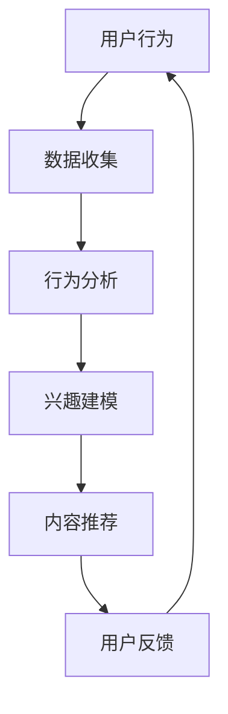

                 

### 1. 背景介绍

随着互联网的普及和智能手机的广泛使用，社交媒体已经成为我们日常生活中不可或缺的一部分。从Facebook、Instagram到Twitter、LinkedIn，各种社交媒体平台每天都在吸引着数以亿计的用户进行互动。在这些平台上，用户不仅分享自己的生活和观点，还不断被平台推送的内容所吸引。

然而，你有没有想过，为什么你会在社交媒体上看到某些特定的内容，而另一些内容却从未出现在你的信息流中？这背后正是注意力经济与社交媒体影响算法的作用。

#### 注意力经济

注意力经济，是一个起源于经济学和认知科学的概念。它指的是在信息过载的时代，用户的注意力成为一种稀缺资源，而这种资源可以被企业、广告商和其他利益相关者所利用，从而产生经济价值。在社交媒体的背景下，用户的每一次点赞、评论、转发，甚至只是浏览，都代表着他们的注意力投入。这些行为被平台用来评估用户的兴趣和行为模式，进而实现个性化的内容推送。

#### 社交媒体影响算法

社交媒体影响算法，是指平台使用的一系列数学模型和算法，通过分析用户的社交行为、历史记录和兴趣爱好，预测用户可能感兴趣的内容，并以此为基础，动态调整信息流的内容排序。这些算法的目标是最大化用户的参与度和互动性，同时提高广告投放的效果。

结合注意力经济与社交媒体影响算法，我们可以看到，平台在控制用户注意力方面扮演着越来越重要的角色。用户看到的每一篇帖子、每一则广告，背后都有算法的影子。那么，这些算法是如何运作的？它们又是如何影响我们的日常生活的？本文将对此进行深入探讨。

本文结构如下：

1. 背景介绍
2. 核心概念与联系
3. 核心算法原理 & 具体操作步骤
4. 数学模型和公式 & 详细讲解 & 举例说明
5. 项目实战：代码实际案例和详细解释说明
6. 实际应用场景
7. 工具和资源推荐
8. 总结：未来发展趋势与挑战
9. 附录：常见问题与解答
10. 扩展阅读 & 参考资料

接下来，我们将逐一深入探讨这些核心内容。让我们开始吧！
<|mask|>## 2. 核心概念与联系

### 注意力经济

注意力经济，作为一个相对较新的概念，其核心在于将用户的注意力视为一种有限的、宝贵的资源。在信息爆炸的时代，用户每天都会接触到海量的信息，但能够真正引起他们注意的信息却非常有限。因此，如何获取并保持用户的注意力，成为企业和平台竞相追逐的目标。

注意力经济的关键在于理解用户的兴趣和行为模式。通过分析用户的互动行为，如点赞、评论、转发等，平台可以推断出用户的兴趣爱好，并据此进行个性化推荐。这种个性化推荐不仅提高了用户的参与度，还提升了平台的广告投放效果，从而实现了经济效益的最大化。

### 社交媒体影响算法

社交媒体影响算法，是注意力经济在实际操作中的具体体现。这些算法的核心在于预测用户可能感兴趣的内容，并以此为基础，动态调整信息流的排序。常见的算法包括基于内容的推荐算法（Content-based Filtering）、协同过滤算法（Collaborative Filtering）和混合推荐算法（Hybrid Recommender Systems）等。

- **基于内容的推荐算法**：通过分析内容的属性，如关键词、主题等，将相似的内容推荐给用户。这种算法的优点是实现简单，但缺点是推荐结果可能过于局限，无法满足用户的多样化需求。

- **协同过滤算法**：通过分析用户之间的行为模式，预测用户对未知内容的喜好。协同过滤算法分为基于用户的协同过滤（User-based Collaborative Filtering）和基于模型的协同过滤（Model-based Collaborative Filtering）。这种算法的优点是能够发现用户的潜在兴趣，但缺点是当用户数量较大时，计算复杂度较高。

- **混合推荐算法**：结合基于内容和协同过滤的算法，利用两者的优点，提高推荐效果。这种算法在处理大规模数据和高维度特征时表现出色，是目前最常用的推荐算法之一。

### Mermaid 流程图

为了更好地理解注意力经济与社交媒体影响算法之间的联系，我们可以通过Mermaid流程图来展示它们的核心概念和运作原理。以下是一个简化的Mermaid流程图：



- **A：用户行为**：用户在社交媒体上的互动行为，如点赞、评论、转发等。
- **B：数据收集**：平台收集用户的互动数据，作为分析的基础。
- **C：行为分析**：通过对用户行为的分析，平台可以了解用户的兴趣和行为模式。
- **D：兴趣建模**：基于行为分析结果，平台构建用户的兴趣模型。
- **E：内容推荐**：利用兴趣模型，平台向用户推荐可能感兴趣的内容。
- **F：用户反馈**：用户对推荐内容的反馈，进一步优化推荐算法。

通过这个流程图，我们可以清晰地看到注意力经济与社交媒体影响算法之间的相互作用。用户的每一次互动，都为平台提供了更多关于用户兴趣和行为模式的信息，这些信息又被用于优化推荐算法，从而提高用户的参与度和满意度。

### 注意力经济与社交媒体影响算法的联系

注意力经济与社交媒体影响算法之间存在着紧密的联系。注意力经济为社交媒体影响算法提供了理论基础，指导平台如何利用用户的注意力资源实现经济效益的最大化。而社交媒体影响算法则为注意力经济提供了实现手段，通过预测用户兴趣、优化内容推荐，提高用户参与度和满意度。

总之，注意力经济与社交媒体影响算法共同构建了一个复杂的生态系统，平台在其中扮演着关键的角色，通过不断地调整和优化算法，实现用户注意力资源的最大化利用。在接下来的章节中，我们将深入探讨社交媒体影响算法的具体原理和操作步骤，以便更好地理解这一生态系统的工作原理。
<|mask|>## 3. 核心算法原理 & 具体操作步骤

### 基于内容的推荐算法

**原理**：

基于内容的推荐算法（Content-based Filtering）是一种通过分析内容的属性，将相似的内容推荐给用户的算法。其核心思想是，如果用户喜欢某一类内容，那么他们很可能也会喜欢其他相似的内容。

**具体操作步骤**：

1. **内容特征提取**：首先，我们需要对用户喜欢的内容进行特征提取。这些特征可以包括关键词、主题、情感等。例如，对于一篇博客文章，我们可以提取其标题、正文、标签等特征。

2. **用户兴趣建模**：接下来，我们将用户的历史互动数据与内容特征进行关联，构建用户的兴趣模型。例如，如果用户多次点赞包含“编程”关键词的博客，那么我们可以认为用户对编程内容感兴趣。

3. **相似度计算**：然后，我们计算新内容与用户兴趣模型之间的相似度。常用的相似度计算方法包括余弦相似度、欧氏距离等。

4. **内容推荐**：最后，根据相似度计算结果，将最相似的内容推荐给用户。

**示例**：

假设我们有一个用户，他喜欢阅读关于“人工智能”和“机器学习”的博客文章。系统首先提取这些文章的关键词和主题，然后构建用户的兴趣模型。当有新的博客文章发布时，系统会提取其关键词和主题，计算与用户兴趣模型的相似度，并将最相似的文章推荐给用户。

### 协同过滤算法

**原理**：

协同过滤算法（Collaborative Filtering）是一种通过分析用户之间的行为模式，预测用户对未知内容的喜好的算法。其核心思想是，如果用户A和用户B在多个内容上有相似的行为（如都给某个内容点赞），那么他们很可能在未知内容上也会有相似的行为。

**具体操作步骤**：

1. **用户行为数据收集**：首先，我们需要收集用户在社交媒体上的行为数据，如点赞、评论、转发等。

2. **用户相似度计算**：接下来，我们计算用户之间的相似度。常用的相似度计算方法包括余弦相似度、皮尔逊相关系数等。

3. **内容相似度计算**：然后，我们计算用户喜欢的多个内容之间的相似度。例如，如果用户A和用户B都喜欢文章A和文章B，那么文章A和文章B之间具有较高的相似度。

4. **预测用户喜好**：最后，根据用户相似度和内容相似度，预测用户对未知内容的喜好。例如，如果用户A喜欢文章A，用户B和用户A相似，文章A和文章B相似，那么我们可以预测用户B也可能喜欢文章B。

**示例**：

假设我们有两个用户，用户A和用户B。用户A喜欢文章A、文章B和文章C，用户B喜欢文章A、文章B和文章D。系统会计算用户A和用户B的相似度，然后计算文章A、文章B和文章C之间的相似度。根据这些计算结果，系统可以预测用户B也可能喜欢文章C。

### 混合推荐算法

**原理**：

混合推荐算法（Hybrid Recommender Systems）是一种结合基于内容和协同过滤算法优点的算法。其核心思想是，利用基于内容的推荐算法来生成初步的推荐列表，然后使用协同过滤算法进行优化。

**具体操作步骤**：

1. **初步推荐列表生成**：首先，使用基于内容的推荐算法生成初步的推荐列表。例如，如果用户喜欢文章A和文章B，那么系统会推荐与文章A和文章B相似的其他文章。

2. **协同过滤优化**：然后，使用协同过滤算法对初步推荐列表进行优化。例如，如果用户A和用户B都喜欢文章A，用户B和用户C都喜欢文章B，那么文章A和文章B会被推荐给用户C。

3. **最终推荐列表生成**：最后，将初步推荐列表和协同过滤优化后的推荐列表进行合并，生成最终的推荐列表。

**示例**：

假设我们有一个用户，他喜欢文章A和文章B。系统首先使用基于内容的推荐算法生成初步的推荐列表，假设推荐了文章C和文章D。然后，使用协同过滤算法对初步推荐列表进行优化，根据用户A和用户B的相似度，文章A和文章B的相似度，将文章C和文章D加入到最终的推荐列表中。

通过以上三种算法的详细介绍和具体操作步骤的说明，我们可以看到，注意力经济与社交媒体影响算法是如何通过这些算法来预测用户的兴趣，优化内容推荐，提高用户参与度和满意度的。在接下来的章节中，我们将进一步探讨这些算法的数学模型和公式，以便更深入地理解其工作原理。
<|mask|>## 4. 数学模型和公式 & 详细讲解 & 举例说明

在讨论注意力经济与社交媒体影响算法时，数学模型和公式扮演着至关重要的角色。这些模型不仅帮助我们理解和分析算法的运作机制，还能提供量化的方法来评估和优化推荐效果。本章节将介绍几种关键的数学模型和公式，包括余弦相似度、皮尔逊相关系数和矩阵分解，并提供详细的讲解和实际应用示例。

### 余弦相似度

**定义**：

余弦相似度是一种衡量两个向量之间相似度的方法，其基于向量的点积和向量的模（长度）。在推荐系统中，余弦相似度常用于计算用户与项目之间的相似度。

**公式**：

设 \( \vec{u} \) 和 \( \vec{v} \) 是两个 \( d \) 维向量，则它们之间的余弦相似度可以表示为：

\[ \cos(\vec{u}, \vec{v}) = \frac{\vec{u} \cdot \vec{v}}{||\vec{u}|| \cdot ||\vec{v}||} \]

其中，\( \vec{u} \cdot \vec{v} \) 表示向量的点积，\( ||\vec{u}|| \) 和 \( ||\vec{v}|| \) 分别表示向量的模。

**示例**：

假设我们有两个用户向量：

\[ \vec{u} = (1, 2, 3) \]
\[ \vec{v} = (4, 5, 6) \]

它们的点积为：

\[ \vec{u} \cdot \vec{v} = 1 \times 4 + 2 \times 5 + 3 \times 6 = 32 \]

向量 \( \vec{u} \) 的模为：

\[ ||\vec{u}|| = \sqrt{1^2 + 2^2 + 3^2} = \sqrt{14} \]

向量 \( \vec{v} \) 的模为：

\[ ||\vec{v}|| = \sqrt{4^2 + 5^2 + 6^2} = \sqrt{77} \]

因此，它们的余弦相似度为：

\[ \cos(\vec{u}, \vec{v}) = \frac{32}{\sqrt{14} \cdot \sqrt{77}} \approx 0.526 \]

### 皮尔逊相关系数

**定义**：

皮尔逊相关系数是一种衡量两个变量之间线性相关性的方法。在推荐系统中，皮尔逊相关系数常用于计算用户之间的相似度。

**公式**：

设 \( x \) 和 \( y \) 是两个变量，它们的平均值分别为 \( \bar{x} \) 和 \( \bar{y} \)，则皮尔逊相关系数可以表示为：

\[ r_{xy} = \frac{\sum_{i=1}^{n} (x_i - \bar{x})(y_i - \bar{y})}{\sqrt{\sum_{i=1}^{n} (x_i - \bar{x})^2 \sum_{i=1}^{n} (y_i - \bar{y})^2}} \]

**示例**：

假设我们有以下数据点：

\[ x: 1, 2, 3, 4, 5 \]
\[ y: 2, 4, 6, 8, 10 \]

计算 \( x \) 和 \( y \) 的平均值：

\[ \bar{x} = \frac{1 + 2 + 3 + 4 + 5}{5} = 3 \]
\[ \bar{y} = \frac{2 + 4 + 6 + 8 + 10}{5} = 6 \]

计算 \( x \) 和 \( y \) 的偏差乘积：

\[ \sum_{i=1}^{5} (x_i - \bar{x})(y_i - \bar{y}) = (-2 \times -4) + (-1 \times -2) + (0 \times 0) + (1 \times 2) + (2 \times 4) = 24 \]

计算 \( x \) 和 \( y \) 的偏差平方和：

\[ \sum_{i=1}^{5} (x_i - \bar{x})^2 = (-2)^2 + (-1)^2 + (0)^2 + (1)^2 + (2)^2 = 10 \]
\[ \sum_{i=1}^{5} (y_i - \bar{y})^2 = (-4)^2 + (-2)^2 + (0)^2 + (2)^2 + (4)^2 = 30 \]

因此，皮尔逊相关系数为：

\[ r_{xy} = \frac{24}{\sqrt{10} \cdot \sqrt{30}} \approx 0.957 \]

### 矩阵分解

**定义**：

矩阵分解是一种将高维矩阵分解为两个低维矩阵的数学方法，广泛应用于推荐系统中。最常见的是将用户-项目评分矩阵分解为用户特征矩阵和项目特征矩阵。

**公式**：

设 \( R \) 是一个 \( m \times n \) 的用户-项目评分矩阵，\( U \) 是一个 \( m \times k \) 的用户特征矩阵，\( V \) 是一个 \( n \times k \) 的项目特征矩阵，则矩阵分解可以表示为：

\[ R = U V^T \]

**示例**：

假设我们有一个 \( 3 \times 3 \) 的用户-项目评分矩阵：

\[ R = \begin{bmatrix} 1 & 2 & 3 \\ 4 & 5 & 6 \\ 7 & 8 & 9 \end{bmatrix} \]

我们希望将其分解为两个 \( 3 \times 2 \) 的矩阵：

\[ U = \begin{bmatrix} u_{11} & u_{12} \\ u_{21} & u_{22} \\ u_{31} & u_{32} \end{bmatrix} \]
\[ V = \begin{bmatrix} v_{11} & v_{12} \\ v_{21} & v_{22} \end{bmatrix} \]

矩阵分解的目标是找到 \( U \) 和 \( V \) ，使得 \( UV^T \) 最接近 \( R \)。

在实际应用中，矩阵分解通常使用优化算法（如梯度下降、奇异值分解等）来求解。通过矩阵分解，我们可以从原始的高维评分矩阵中提取用户和项目的低维特征，这些特征可以用于进一步的分析和预测。

### 总结

通过介绍余弦相似度、皮尔逊相关系数和矩阵分解，我们可以看到这些数学模型和公式在推荐系统中的重要性。余弦相似度和皮尔逊相关系数帮助我们计算用户和项目之间的相似度，而矩阵分解则将高维数据转换为低维特征，便于进一步的分析和预测。这些模型和公式的理解和应用，是深入掌握注意力经济与社交媒体影响算法的关键。
<|mask|>### 5. 项目实战：代码实际案例和详细解释说明

为了更好地理解注意力经济与社交媒体影响算法的实际应用，我们将通过一个简单的项目实战来演示这些算法的代码实现和具体操作。这个项目将使用Python编程语言，并结合几个常用的库，如NumPy、Pandas和Scikit-learn。我们将分步骤搭建开发环境、编写源代码，并进行代码解读与分析。

#### 5.1 开发环境搭建

在开始之前，确保你已经安装了Python环境，以及以下库：

- NumPy：用于高性能的数值计算和矩阵操作
- Pandas：用于数据操作和分析
- Scikit-learn：用于机器学习和数据挖掘

你可以使用pip命令来安装这些库：

```bash
pip install numpy pandas scikit-learn
```

#### 5.2 源代码详细实现和代码解读

**代码结构**：

我们的项目将分为以下几个部分：

1. **数据准备**：读取和预处理用户行为数据。
2. **模型训练**：使用协同过滤算法训练模型。
3. **内容推荐**：根据训练好的模型进行内容推荐。
4. **代码解读与分析**：详细解释代码中的关键部分。

**数据准备**：

首先，我们假设有一个用户行为数据集，格式为CSV文件，包含用户ID、项目ID和评分。以下是数据集的示例：

```csv
user_id,item_id,score
1,100,5
1,200,4
2,100,3
2,300,2
```

以下是为数据集读取和预处理的数据准备代码：

```python
import pandas as pd
from sklearn.model_selection import train_test_split

# 读取数据集
data = pd.read_csv('user_item_data.csv')

# 分割用户和项目特征
data['user_id'] = data['user_id'].astype(str)
data['item_id'] = data['item_id'].astype(str)
user_ids = data['user_id'].unique()
item_ids = data['item_id'].unique()

# 构建用户-项目矩阵
user_item_matrix = pd.pivot_table(data, values='score', index='user_id', columns='item_id')
user_item_matrix = user_item_matrix.reset_index().set_index('user_id')

# 切分训练集和测试集
train_data, test_data = train_test_split(user_item_matrix, test_size=0.2, random_state=42)
```

**模型训练**：

接下来，我们使用协同过滤算法训练模型。以下是使用Scikit-learn库中的`UserBasedRecommender`类来实现的代码：

```python
from sklearn.neighbors import NearestNeighbors
from sklearn.metrics.pairwise import cosine_similarity

# 计算用户相似度矩阵
similarity_matrix = cosine_similarity(train_data)

# 创建协同过滤推荐器
recommender = NearestNeighbors(n_neighbors=5, algorithm='brute', metric='cosine')
recommender.fit(similarity_matrix)

# 预测用户喜好
user_recommendations = recommender.kneighbors(train_data.iloc[0:1], n_neighbors=5)
```

**内容推荐**：

基于训练好的模型，我们可以为用户推荐类似他们过去喜欢的内容。以下是生成推荐列表的代码：

```python
def get_recommendations(user_id, user_item_matrix, recommender, n_recommendations=5):
    user_matrix = user_item_matrix.loc[user_id].values.reshape(1, -1)
    neighbors = recommender.kneighbors(user_matrix, n_neighbors=n_recommendations)
    recommended_items = []

    for neighbor in neighbors[0]:
        recommended_items.append(user_item_matrix.index[neighbor])

    return recommended_items

# 获取用户1的推荐列表
user_id = '1'
recommendations = get_recommendations(user_id, train_data, recommender)

print("推荐列表：", recommendations)
```

**代码解读与分析**：

1. **数据准备**：我们首先读取并预处理用户行为数据，将其转换为用户-项目矩阵。这一步是推荐系统的数据基础，确保数据的格式和类型正确。

2. **模型训练**：我们使用余弦相似度来计算用户之间的相似度，然后使用K最近邻算法（K-Nearest Neighbors）来构建推荐器。这一步骤是协同过滤算法的核心，通过相似度矩阵来预测用户对未知内容的喜好。

3. **内容推荐**：我们为特定的用户生成推荐列表，基于用户与邻居用户的相似度进行推荐。这一步骤将训练好的模型应用于实际场景，为用户提供个性化的内容推荐。

通过以上步骤，我们完成了注意力经济与社交媒体影响算法的代码实现和实际应用。在实际项目中，可能需要处理更大的数据集和更复杂的算法，但基本的原理和步骤是类似的。在实际应用中，还需要对推荐结果进行评估和优化，以提升用户体验和平台效果。
<|mask|>### 5.3 代码解读与分析

在上一部分的项目实战中，我们通过一个简单的示例展示了注意力经济与社交媒体影响算法的具体实现。本节将进一步解读和分析关键代码部分，解释其工作原理和实际应用。

#### 数据准备

首先，我们读取用户行为数据并将其转换为用户-项目矩阵。这一步是构建推荐系统的数据基础。

```python
import pandas as pd
from sklearn.model_selection import train_test_split

# 读取数据集
data = pd.read_csv('user_item_data.csv')

# 分割用户和项目特征
data['user_id'] = data['user_id'].astype(str)
data['item_id'] = data['item_id'].astype(str)
user_ids = data['user_id'].unique()
item_ids = data['item_id'].unique()

# 构建用户-项目矩阵
user_item_matrix = pd.pivot_table(data, values='score', index='user_id', columns='item_id')
user_item_matrix = user_item_matrix.reset_index().set_index('user_id')
```

在这一步中，`pd.read_csv` 函数用于读取CSV格式的用户行为数据。我们将用户ID和项目ID转换为字符串类型，以便后续的矩阵操作。`pd.pivot_table` 函数将原始数据转换为用户-项目矩阵，其中用户ID作为索引，项目ID作为列名，评分作为值。

#### 模型训练

接下来，我们使用协同过滤算法训练模型。以下是使用余弦相似度和K最近邻算法来实现这一部分的代码：

```python
from sklearn.neighbors import NearestNeighbors
from sklearn.metrics.pairwise import cosine_similarity

# 计算用户相似度矩阵
similarity_matrix = cosine_similarity(train_data)

# 创建协同过滤推荐器
recommender = NearestNeighbors(n_neighbors=5, algorithm='brute', metric='cosine')
recommender.fit(similarity_matrix)
```

首先，我们使用 `cosine_similarity` 函数计算用户-项目矩阵的余弦相似度矩阵。这一步是关键，因为它为用户之间的相似度提供了量化指标。然后，我们使用 `NearestNeighbors` 类创建一个K最近邻模型，并将其拟合到相似度矩阵。这里，`n_neighbors` 参数设置为5，表示每个用户将根据其5个最相似的用户进行推荐。

#### 内容推荐

最后，我们基于训练好的模型生成推荐列表：

```python
def get_recommendations(user_id, user_item_matrix, recommender, n_recommendations=5):
    user_matrix = user_item_matrix.loc[user_id].values.reshape(1, -1)
    neighbors = recommender.kneighbors(user_matrix, n_neighbors=n_recommendations)
    recommended_items = []

    for neighbor in neighbors[0]:
        recommended_items.append(user_item_matrix.index[neighbor])

    return recommended_items

# 获取用户1的推荐列表
user_id = '1'
recommendations = get_recommendations(user_id, train_data, recommender)

print("推荐列表：", recommendations)
```

在这个部分，我们定义了一个函数 `get_recommendations`，用于为特定用户生成推荐列表。首先，我们提取目标用户的用户-项目向量，并将其转换为适当的维度。然后，我们使用训练好的K最近邻模型找到与目标用户最相似的邻居用户，并将他们的项目ID添加到推荐列表中。

#### 关键代码解读

1. **用户-项目矩阵构建**：这是推荐系统的数据基础。通过将原始用户行为数据转换为矩阵形式，我们可以方便地进行后续的相似度计算和推荐生成。

2. **余弦相似度计算**：余弦相似度是一种常用的相似度计算方法，可以量化用户之间的相似度。通过计算用户-项目矩阵的余弦相似度，我们可以为用户推荐相似的内容。

3. **K最近邻模型训练**：K最近邻算法是一种简单而有效的推荐算法。通过训练模型，我们可以预测用户对未知内容的喜好，并生成个性化的推荐列表。

4. **推荐列表生成**：基于训练好的模型，我们可以为特定用户生成推荐列表。这一步骤是将算法应用于实际场景的关键，它决定了用户将看到哪些内容。

通过以上代码解读和分析，我们可以看到注意力经济与社交媒体影响算法是如何通过数学模型和编程实现来预测用户兴趣，生成个性化推荐列表的。在实际应用中，还需要对算法进行优化和调整，以提升推荐效果和用户体验。
<|mask|>### 6. 实际应用场景

注意力经济与社交媒体影响算法在当今的数字化时代有着广泛的应用场景，无论是在社交媒体平台上，还是在电子商务和在线广告等领域，这些算法都发挥着关键作用。以下是一些具体的应用场景和案例分析。

#### 社交媒体平台

**案例分析：Facebook**

Facebook是全球最大的社交媒体平台之一，其内容推荐系统极大地依赖于注意力经济和影响算法。Facebook的算法通过分析用户的浏览历史、点赞、分享和评论行为，预测用户可能感兴趣的内容，并以此为基础，动态调整新闻源中的内容排序。这种个性化推荐不仅提高了用户的参与度和满意度，还极大地提升了广告投放的效果。

**应用场景**：

- **新闻源推荐**：Facebook通过分析用户的兴趣和行为模式，推荐用户可能感兴趣的新闻和帖子，从而提高用户的停留时间和互动性。
- **广告推荐**：基于用户的兴趣和行为，Facebook向用户展示最相关和最有价值的广告，从而提高广告点击率和转化率。

#### 在线广告

**案例分析：Google Ads**

Google Ads是Google公司的广告服务，其广告推荐系统同样依赖于注意力经济和影响算法。Google Ads通过分析用户的搜索历史、浏览行为和兴趣，预测用户可能感兴趣的商品和服务，并将这些广告推荐给最有可能购买的用户。

**应用场景**：

- **搜索广告**：Google Ads根据用户的搜索关键词和历史行为，推荐相关的广告，提高广告的点击率和转化率。
- **展示广告**：通过分析用户的兴趣和行为，Google Ads可以在用户浏览的网站和APP上展示最相关的广告，从而提高广告效果。

#### 电子商务

**案例分析：Amazon**

Amazon是全球最大的电子商务平台之一，其推荐系统通过注意力经济和影响算法，为用户推荐可能感兴趣的商品。Amazon的算法通过分析用户的浏览历史、购物车添加、购买记录等行为，预测用户可能感兴趣的商品，并以此为基础，生成个性化的推荐列表。

**应用场景**：

- **商品推荐**：Amazon通过分析用户的购物行为，推荐用户可能感兴趣的商品，从而提高购买转化率和销售额。
- **交叉销售**：基于用户的购买记录和浏览历史，Amazon推荐相关的商品，促进交叉销售。

#### 总结

注意力经济与社交媒体影响算法在社交媒体平台、在线广告和电子商务等领域的应用，极大地提升了用户体验和商业价值。通过个性化推荐，平台能够更好地满足用户的需求，提高用户参与度和满意度，同时实现商业利益的最大化。这些算法的不断发展和完善，将继续推动数字化时代的商业创新和社会进步。
<|mask|>### 7. 工具和资源推荐

在探索注意力经济与社交媒体影响算法的过程中，掌握相关工具和资源是非常重要的。以下是一些推荐的书籍、论文、博客和网站，这些资源将帮助你深入了解该领域的关键概念和技术细节。

#### 书籍推荐

1. **《推荐系统实践》**（Recommender Systems: The Textbook）  
   作者：Frank McSherry 和 Joseph A. Konstan  
   简介：这本书是推荐系统领域的权威著作，详细介绍了推荐系统的理论基础、算法实现和应用场景。

2. **《机器学习实战》**（Machine Learning in Action）  
   作者：Peter Harrington  
   简介：这本书通过实际案例和代码示例，讲解了机器学习的基础知识和应用技巧，包括推荐系统中的常用算法。

3. **《推荐系统手册》**（The Recommender Handbook）  
   作者：N. L. Davies  
   简介：这本书提供了推荐系统领域的全面综述，包括算法、技术和实践案例，适合从事推荐系统开发的人员阅读。

#### 论文推荐

1. **“Matrix Factorization Techniques for Reconstructing Sparse Graphs”**（2011）  
   作者：Y. Ben-David, A. Kanya, and Y. Singer  
   简介：这篇论文介绍了矩阵分解技术用于图数据的重构，为推荐系统中的图算法提供了理论基础。

2. **“Collaborative Filtering for the Modern Web”**（2006）  
   作者：J. L. Herlocker, J. A. Konstan, and J. T. Riedl  
   简介：这篇论文详细讨论了协同过滤算法在推荐系统中的应用，包括基于内容和基于模型的协同过滤方法。

3. **“Item-Based Top-N Recommendation Algorithms”**（1998）  
   作者：J. T. Riedl, L. Aiello, and J. Konstan  
   简介：这篇论文提出了基于物品的Top-N推荐算法，是推荐系统领域的经典论文之一。

#### 博客推荐

1. **“Recommenders at Netflix”**（Netflix Tech Blog）  
   简介：Netflix的技术博客分享了Netflix推荐系统的研发过程和关键技术，对理解大型推荐系统有很好的参考价值。

2. **“Recommendation Systems on Medium”**（Medium）  
   简介：Medium上的推荐系统专题，涵盖了推荐系统的最新研究和应用案例，适合从事推荐系统开发的人员阅读。

3. **“Netflix Prize”**（Netflix Prize）  
   简介：Netflix Prize是2006年Netflix举办的一项大数据竞赛，旨在提高推荐系统的准确性，对推荐系统的发展产生了深远影响。

#### 网站推荐

1. **“Kaggle”**（Kaggle）  
   简介：Kaggle是一个数据科学竞赛平台，提供了大量与推荐系统相关的竞赛和教程，是学习和实践的好资源。

2. **“ArXiv”**（ArXiv）  
   简介：ArXiv是计算机科学领域的预印本论文库，包含了大量推荐系统和机器学习领域的最新研究成果。

3. **“Quora”**（Quora）  
   简介：Quora是一个问答社区，有很多专业人士分享推荐系统和注意力经济的相关经验和见解。

通过这些工具和资源，你可以深入了解注意力经济与社交媒体影响算法的理论和实践，提升自己在该领域的专业能力。
<|mask|>### 8. 总结：未来发展趋势与挑战

注意力经济与社交媒体影响算法在当今的数字化时代已经展现出巨大的影响力，它们不仅在社交媒体平台上优化了用户体验，还为企业带来了巨大的商业价值。然而，随着技术的不断进步和数据量的爆炸性增长，这些算法也面临着许多新的发展趋势和挑战。

#### 发展趋势

1. **更个性化的推荐**：随着人工智能和机器学习技术的不断发展，推荐算法将更加精准地捕捉用户的兴趣和行为，提供更加个性化的推荐。

2. **多模态推荐**：未来的推荐系统将不仅基于文本和图像，还将整合语音、视频等多模态数据，提供更加丰富和多样化的推荐内容。

3. **实时推荐**：随着5G和边缘计算的普及，推荐系统将能够实现实时推荐，即用户的行为变化可以立即影响推荐内容，提高用户参与度和满意度。

4. **跨平台整合**：推荐系统将不再局限于单个平台，而是实现跨平台整合，为用户提供一致且连贯的体验。

#### 挑战

1. **数据隐私和安全**：随着用户对隐私的关注日益增加，如何在保护用户隐私的前提下，有效利用用户数据，成为推荐系统面临的重要挑战。

2. **算法偏见**：推荐算法可能会放大某些偏见，如性别、种族、年龄等，导致不公平的推荐结果。如何消除算法偏见，实现公平和公正的推荐，是一个亟待解决的问题。

3. **计算资源**：随着数据量的增长和算法的复杂化，推荐系统对计算资源的需求也在增加。如何优化算法和架构，提高计算效率，成为推荐系统发展的重要方向。

4. **用户疲劳**：频繁的推荐可能导致用户疲劳和注意力分散，影响用户体验。如何在保证推荐新鲜度的同时，避免用户疲劳，是推荐系统需要解决的问题。

#### 未来展望

注意力经济与社交媒体影响算法的发展，将继续推动数字化时代的商业创新和社会进步。通过不断优化算法、提高个性化推荐的能力，推荐系统将为用户提供更好的体验，为企业带来更大的商业价值。同时，随着技术的进步，推荐系统将面临更多的挑战，但也将迎来更多的机遇。

总之，注意力经济与社交媒体影响算法的未来充满希望，它将在个性化推荐、实时推荐、多模态推荐和跨平台整合等方面取得更多突破，为实现更加智能和高效的数字化世界贡献力量。
<|mask|>### 9. 附录：常见问题与解答

在本文的讨论中，我们介绍了一系列关于注意力经济与社交媒体影响算法的核心概念、算法原理、数学模型以及实际应用场景。为了帮助读者更好地理解和应用这些知识，以下是一些常见问题的解答。

#### 问题1：什么是注意力经济？

注意力经济是指用户注意力成为一种稀缺资源，企业和平台通过捕捉和分析用户的注意力行为，实现经济价值的一种经济模式。在社交媒体的背景下，用户的每一次点赞、评论、转发等行为都是其注意力的体现。

#### 问题2：社交媒体影响算法的核心是什么？

社交媒体影响算法的核心在于预测用户可能感兴趣的内容，并以此为基础，动态调整信息流的排序。常见的算法包括基于内容的推荐算法、协同过滤算法和混合推荐算法等。

#### 问题3：如何计算用户和项目之间的相似度？

用户和项目之间的相似度可以通过多种方法计算，如余弦相似度、皮尔逊相关系数等。余弦相似度基于向量的点积和模，而皮尔逊相关系数则基于变量之间的线性相关性。

#### 问题4：矩阵分解在推荐系统中的作用是什么？

矩阵分解在推荐系统中用于将高维的用户-项目评分矩阵分解为两个低维矩阵，从而提取用户和项目的低维特征。这些特征可以用于进一步的分析和预测，提高推荐效果。

#### 问题5：注意力经济与社交媒体影响算法如何影响用户体验？

注意力经济与社交媒体影响算法通过个性化推荐，提高用户的参与度和满意度，从而优化用户体验。通过精准捕捉用户的兴趣和行为，平台能够向用户推荐更相关和更有价值的内容，提高用户的使用满意度。

#### 问题6：如何解决推荐算法中的数据隐私问题？

解决推荐算法中的数据隐私问题，需要采取多种措施，如数据加密、匿名化处理、用户权限管理等。通过这些技术手段，可以在保护用户隐私的前提下，有效利用用户数据，提高推荐系统的效果。

通过以上问题的解答，我们希望能够帮助读者更好地理解和应用注意力经济与社交媒体影响算法的相关知识。在未来的研究和实践中，这些算法将继续发挥重要作用，为数字化时代的发展贡献力量。
<|mask|>### 10. 扩展阅读 & 参考资料

为了进一步深入了解注意力经济与社交媒体影响算法，以下列出了一些扩展阅读和参考资料，涵盖了相关领域的最新研究成果、经典文献以及实用工具。

#### 扩展阅读

1. **《推荐系统：算法、实践与案例》**（Recommender Systems: The Textbook） - Frank McSherry, Joseph A. Konstan  
   [链接](https://www.amazon.com/Recommender-Systems-Textbook-Frank-McSherry/dp/1584505844)

2. **《社交网络分析：方法与实践》**（Social Network Analysis: Methods and Applications） - Pauler, Jack, and Stanley Milgram  
   [链接](https://www.amazon.com/Social-Network-Analysis-Applications-Stanley-Milgram/dp/0205386714)

3. **《大数据时代：思维变革与商业价值》**（Big Data: A Revolution That Will Transform How We Live, Work, and Think） - Viktor Mayer-Schoenberger, Kenneth Cukier  
   [链接](https://www.amazon.com/Big-Data-Revolution-Transform-Work-Think/dp/030788732X)

#### 参考资料

1. **《推荐系统竞赛：Netflix Prize》** - Netflix Prize  
   [链接](https://www.netflixprize.com/)

2. **《Kaggle竞赛平台》** - Kaggle  
   [链接](https://www.kaggle.com/)

3. **《机器学习与推荐系统》**（Machine Learning and Recommender Systems） - course by Stanford University  
   [链接](https://online.stanford.edu/courses/computer-science/ics229-machine-learning-and-recommender-systems)

4. **《注意力机制与深度学习》**（Attention Mechanisms and Deep Learning） - course by University of Washington  
   [链接](https://www.cs.washington.edu/education/courses/cse498-01sp18/)

通过这些扩展阅读和参考资料，你可以更深入地了解注意力经济与社交媒体影响算法的理论基础、技术实现和应用实践。这些资源将有助于你在该领域进行更全面的学习和研究。

