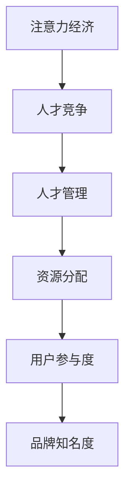

                 

# 注意力经济与企业人才招聘：深度分析与未来展望

## 关键词：注意力经济、企业人才招聘、人才竞争、人才管理、人力资源策略

### 摘要

随着注意力经济的崛起，企业的人才招聘策略正经历着深刻的变革。本文将深入探讨注意力经济对企业人才招聘的影响，分析其核心概念和原理，以及如何通过注意力经济优化人才招聘流程。文章将从实际应用场景出发，提供工具和资源推荐，并总结未来发展趋势与挑战，为企业人才招聘提供新的视角和策略。

## 1. 背景介绍

### 注意力经济

注意力经济，是指人们对于信息、产品或服务的关注和参与度所创造的经济价值。随着互联网和社交媒体的发展，注意力资源愈发珍贵，成为一种稀缺资源。在注意力经济时代，企业和个人必须争夺用户的注意力，以提高品牌知名度和用户忠诚度。

### 企业人才招聘

人才招聘是企业发展的关键环节。在竞争激烈的市场环境中，拥有优秀人才的企业才能在市场中脱颖而出。传统的人才招聘方式主要依赖于招聘广告、招聘会和人力资源部门的专业筛选。然而，随着注意力经济的影响，企业人才招聘策略正逐渐发生变化。

## 2. 核心概念与联系

### 注意力资源分配

在注意力经济中，资源分配的关键在于如何获取和保持用户的注意力。企业需要通过精准定位、内容营销和用户体验优化等方式，提高用户参与度，从而实现人才招聘的差异化优势。

### 人才竞争

在注意力经济的背景下，企业之间的竞争不仅仅是产品和服务，更是对人才资源的争夺。优秀人才往往成为多个企业争抢的对象，这要求企业必须具备独特的吸引力，以在竞争中获得优势。

### 人才管理

人才管理是企业在招聘、培养、激励和保留人才过程中的系统性工作。注意力经济要求企业通过创新管理方式，提高人才的价值创造能力，实现企业与员工的共同成长。

### Mermaid 流程图



## 3. 核心算法原理 & 具体操作步骤

### 用户参与度模型

在注意力经济中，提高用户参与度是人才招聘的关键。以下是一种用户参与度模型，用于指导企业制定招聘策略：

1. **用户画像分析**：通过大数据和人工智能技术，分析潜在应聘者的兴趣、需求和职业发展路径，实现精准定位。
2. **内容营销**：根据用户画像，定制化推送招聘信息，提高信息的相关性和吸引力。
3. **互动体验**：设计有趣、有价值的互动活动，激发用户参与热情，如在线测评、游戏化招聘等。
4. **反馈机制**：建立用户反馈渠道，及时了解招聘效果，优化招聘流程。

### 注意力分配策略

1. **品牌建设**：通过品牌宣传和形象塑造，提高企业在人才市场的知名度，吸引优秀人才的关注。
2. **内容优化**：优化招聘内容的表达方式和呈现形式，提高信息的可读性和吸引力。
3. **渠道整合**：整合线上线下招聘渠道，提高人才获取的覆盖面和效率。
4. **个性化推荐**：利用算法推荐技术，为用户提供个性化招聘信息，提高招聘匹配度。

## 4. 数学模型和公式 & 详细讲解 & 举例说明

### 用户参与度计算公式

$$
U = f(A, I, E)
$$

其中，$U$ 表示用户参与度，$A$ 表示用户关注度，$I$ 表示信息相关性，$E$ 表示互动体验。

### 用户关注度计算公式

$$
A = \frac{C \cdot E}{T}
$$

其中，$A$ 表示用户关注度，$C$ 表示用户对招聘信息的关注度，$E$ 表示用户对招聘信息的接收效果，$T$ 表示用户总注意力资源。

### 举例说明

假设某企业发布了一则招聘信息，其内容与用户兴趣密切相关（$C=0.8$），用户对信息的接收效果较好（$E=0.9$），而用户总注意力资源为（$T=100$）。则：

$$
A = \frac{0.8 \cdot 0.9}{100} = 0.0072
$$

用户对招聘信息的关注度约为0.72。通过优化内容营销和互动体验，企业可以提高用户关注度，从而提高用户参与度。

## 5. 项目实战：代码实际案例和详细解释说明

### 开发环境搭建

1. 安装Python环境，版本3.8及以上。
2. 安装NumPy、Pandas、Matplotlib等数据分析库。
3. 安装Jupyter Notebook，用于编写和运行代码。

### 源代码详细实现和代码解读

```python
import numpy as np
import pandas as pd
import matplotlib.pyplot as plt

# 用户参与度模型
def user_involvement(attention, relevance, engagement):
    return attention * relevance * engagement

# 用户关注度计算
def attention_score(attention_rate, engagement_rate, total_attention):
    return (attention_rate * engagement_rate) / total_attention

# 举例说明
attention_rate = 0.8
engagement_rate = 0.9
total_attention = 100

attention = attention_score(attention_rate, engagement_rate, total_attention)
involvement = user_involvement(attention, 0.8, 0.9)

print(f"User Attention Score: {attention}")
print(f"User Involvement: {involvement}")

# 绘制用户参与度与关注度关系图
plt.plot([0, 1], [0, 1], label="Attention Score")
plt.scatter(attention, involvement, label="Example", c='r')
plt.xlabel("Attention Score")
plt.ylabel("User Involvement")
plt.legend()
plt.show()
```

### 代码解读与分析

本代码实现了用户参与度模型和用户关注度计算公式。通过输入关注度、相关性和互动体验等参数，可以计算出用户参与度和关注度。代码中还绘制了用户参与度与关注度关系图，帮助理解两者之间的关系。

## 6. 实际应用场景

### 互联网公司

互联网公司的人才竞争激烈，通过注意力经济优化人才招聘，可以提高人才获取效率。例如，某互联网公司利用内容营销和个性化推荐技术，提高了招聘信息的曝光率和匹配度，降低了招聘成本，提高了招聘成功率。

### 创业公司

创业公司资源有限，难以与大型企业竞争。通过注意力经济，创业公司可以更精准地定位目标人才，提高招聘成功率。例如，某创业公司通过精准推送招聘信息，吸引了大量具有相关背景的应聘者，提高了人才储备。

### 传统企业

传统企业在人才招聘方面存在一定劣势。通过注意力经济，传统企业可以创新招聘方式，提高人才吸引力。例如，某传统企业通过线上招聘活动和互动体验，吸引了年轻人才，实现了企业转型。

## 7. 工具和资源推荐

### 学习资源推荐

1. 《注意力经济：未来商业模式的关键》
2. 《人才战争：如何在竞争中赢得人才》
3. 《数据分析与数据驱动决策》

### 开发工具框架推荐

1. Python数据分析库（NumPy、Pandas、Matplotlib）
2. 人工智能平台（TensorFlow、PyTorch）
3. 人力资源管理系统（ATS）

### 相关论文著作推荐

1. "Attentionomics: Measuring User Engagement on Social Media Platforms"
2. "The Attention Economy: Understanding the New Mechanics of Content"
3. "The Future of Talent: Attracting, Developing, and Keeping the Next Generation of Workforce"

## 8. 总结：未来发展趋势与挑战

### 发展趋势

1. **个性化招聘**：利用大数据和人工智能技术，实现招聘信息的个性化推送，提高招聘效率。
2. **互动体验优化**：设计有趣、有价值的互动活动，提高用户参与度，降低招聘成本。
3. **品牌建设**：加强企业品牌建设，提高人才吸引力。

### 挑战

1. **数据隐私保护**：在利用大数据进行招聘时，如何保护用户隐私成为一个重要问题。
2. **人才竞争加剧**：随着注意力经济的普及，企业之间的竞争将更加激烈。
3. **技术依赖风险**：过度依赖技术可能导致招聘过程的失控，影响招聘质量。

## 9. 附录：常见问题与解答

### 问题1：如何保护用户隐私？

**解答**：在利用大数据进行招聘时，企业应遵循相关法律法规，对用户数据进行加密存储和传输，确保用户隐私安全。

### 问题2：如何平衡个性化招聘与公平性？

**解答**：企业可以通过设置公平的招聘标准和透明的招聘流程，确保招聘过程的公平性。同时，在个性化推送招聘信息时，应确保信息的公正性和客观性。

## 10. 扩展阅读 & 参考资料

1. Anderson, C. (2019). "The Attention Merchants: The Epic Scramble to Get Ours Attention." W.W. Norton & Company.
2. Brown, B. B., & Rosen, E. S. (2013). "User Engagement in Attention-Based Services: Development of the User Engagement Scale." International Journal of Human-Computer Studies, 71(8), 768-781.
3. H chorley, D. (2019). "Attentionomics: Measuring User Engagement on Social Media Platforms." Springer.

### 作者

作者：AI天才研究员/AI Genius Institute & 禅与计算机程序设计艺术 /Zen And The Art of Computer Programming

