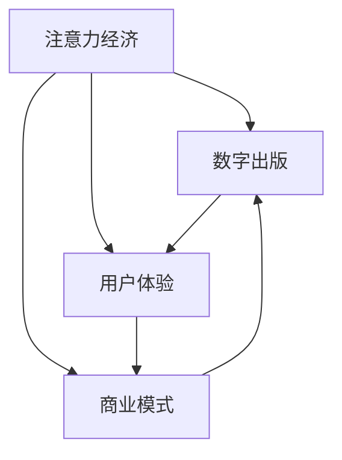

                 

### 背景介绍

注意力经济作为现代经济学的一个重要分支，关注的是信息时代下人们注意力的分配及其对经济行为的影响。随着互联网的普及和数字化媒体的兴起，人们获取信息的渠道变得多样化，注意力成为了一种稀缺资源。在这种背景下，传统出版业面临着前所未有的挑战和机遇。

首先，传统出版业长久以来依赖的是纸张印刷和书店销售的模式，这一模式在内容创作、出版、发行和销售上都有着严格的流程和成本控制。然而，随着数字媒体的兴起，电子书、在线阅读平台和社交媒体等新兴渠道迅速崛起，改变了人们阅读习惯和信息获取方式。这种变化不仅使得出版物的传播速度大大提高，还打破了传统出版业的地理和时空限制。

其次，注意力经济对传统出版业的挑战体现在多个方面。一方面，由于信息的过载和泛滥，读者获取信息的难度增加，导致他们的注意力更容易分散。传统出版业需要通过创新来吸引读者的注意力，提高出版物的竞争力和吸引力。另一方面，数字出版带来的成本降低和渠道多样化为传统出版业提供了转型的契机，但同时也要求出版业具备更强的适应能力和创新能力。

此外，注意力经济还要求传统出版业重新审视其商业模式和盈利模式。在传统的印刷出版时代，出版商主要通过卖书获得利润，而数字出版则带来了新的商业模式，如订阅服务、广告收入和内容付费等。这些新的商业模式不仅要求出版商具备技术能力和数据分析能力，还需要对市场需求和读者行为有深刻的理解。

总之，注意力经济的崛起对传统出版业产生了深远的影响，既带来了挑战，也提供了转型的机遇。在这种背景下，传统出版业需要重新思考其运营模式，利用数字化工具和平台，提高内容质量和用户体验，以适应新的经济环境和市场需求。

### 核心概念与联系

为了深入探讨注意力经济对传统出版业的转型要求，我们需要明确几个核心概念，并分析它们之间的联系。这些核心概念包括：注意力经济、数字出版、用户体验和商业模式。

#### 注意力经济

注意力经济是一种基于注意力的经济模型，强调在信息过载的时代，人们对信息的选择和关注决定了价值的创造和分配。在这个模型中，注意力的获取成为企业竞争的关键，而消费者的注意力成为稀缺资源。注意力经济的核心在于如何有效地吸引和保持消费者的注意力，从而实现商业目标。

#### 数字出版

数字出版是指利用数字技术和网络平台进行出版活动，包括电子书、在线杂志、有声读物等。与传统出版相比，数字出版具有传播速度快、成本低、形式多样和互动性强等优势。随着互联网的普及和技术的进步，数字出版已经成为出版业的重要组成部分，并对传统出版模式产生了深刻影响。

#### 用户体验

用户体验（User Experience，简称UX）是指用户在使用产品或服务过程中的感受和体验。在数字出版领域，用户体验的重要性日益凸显。优秀的用户体验能够提高用户的满意度和忠诚度，从而促进内容消费和传播。用户体验包括界面设计、内容质量、操作便捷性等多个方面。

#### 商业模式

商业模式是指企业在特定市场中如何创造价值、传递价值和获取价值的方式。在传统出版业向数字出版转型的过程中，商业模式创新至关重要。数字出版带来了新的收入来源，如订阅服务、广告收入和内容付费等。出版商需要根据市场需求和用户行为调整其商业模式，以实现可持续发展。

#### 核心概念与联系

注意力经济、数字出版、用户体验和商业模式之间存在紧密的联系。注意力经济是数字出版发展的基础，因为数字出版通过更高效的方式获取和吸引用户的注意力。用户体验是数字出版成功的关键，因为良好的用户体验能够提高用户的满意度和忠诚度，进而促进内容消费。商业模式则是连接注意力经济和用户体验的桥梁，通过创新商业模式，出版商可以更好地满足市场需求，实现商业价值的最大化。

为了更直观地展示这些概念之间的关系，我们可以使用Mermaid流程图来描述它们之间的逻辑流程。



在这个流程图中，注意力经济作为核心驱动因素，促使数字出版和用户体验的发展，同时，商业模式在其中起到了连接和推动的作用。

通过明确这些核心概念和它们之间的联系，我们可以更好地理解注意力经济对传统出版业转型的要求，为接下来的讨论奠定基础。

### 核心算法原理 & 具体操作步骤

在深入探讨注意力经济对传统出版业的影响时，我们需要了解一些核心算法原理和具体操作步骤。这些算法和步骤不仅有助于理解注意力经济的基本运作机制，还能为传统出版业的转型提供技术支持。下面，我们将详细解释注意力经济中的几个关键算法及其应用。

#### 1. 用户行为分析算法

用户行为分析是注意力经济的重要组成部分，通过对用户的行为数据进行收集和分析，出版商可以更好地了解用户的需求和兴趣，从而制定更有效的营销策略。具体操作步骤如下：

**步骤1：数据收集**
- 收集用户在数字平台上的浏览记录、搜索历史、购买行为和互动数据。
- 利用各种数据采集工具和技术，如Web追踪、Cookie记录、API调用等。

**步骤2：数据处理**
- 对收集到的数据进行清洗、去重和归一化处理，确保数据质量。
- 使用数据仓库和数据湖等技术存储和管理大规模用户数据。

**步骤3：行为模式识别**
- 应用机器学习算法，如聚类分析、关联规则挖掘和协同过滤，识别用户的行为模式。
- 通过行为模式，出版商可以预测用户的兴趣和需求，为个性化推荐提供基础。

**步骤4：策略优化**
- 根据用户行为分析结果，调整推荐策略和营销活动，提高用户参与度和转化率。
- 持续优化算法，以适应用户行为的变化和市场动态。

#### 2. 注意力分配算法

注意力分配算法用于优化内容展示和推广策略，确保有限的用户注意力被有效地分配给最有价值的内容。以下是一种常见的注意力分配算法：

**步骤1：内容评估**
- 对所有内容进行评估，包括文本、图片、视频等，评估内容的质量和吸引力。
- 使用内容质量评分模型，如基于内容的推荐算法（CBR）和文本相似度计算等。

**步骤2：用户偏好分析**
- 通过用户行为数据和用户反馈，分析用户的兴趣偏好。
- 应用机器学习算法，如决策树、支持向量机（SVM）和神经网络等，预测用户的兴趣点。

**步骤3：分配策略**
- 根据内容评估和用户偏好，制定注意力分配策略。
- 采用优化算法，如线性规划、贪心算法和动态规划等，最大化用户满意度和内容价值。

**步骤4：实时调整**
- 根据用户反馈和行为数据，实时调整注意力分配策略。
- 持续监控和分析用户行为，以优化内容展示效果。

#### 3. 用户体验优化算法

用户体验优化算法旨在通过改善界面设计、操作流程和内容呈现，提升用户的使用体验。以下是一种典型的用户体验优化算法：

**步骤1：用户调研**
- 进行用户调研，收集用户反馈和意见。
- 通过问卷调查、用户访谈和A/B测试等手段，了解用户的需求和痛点。

**步骤2：界面设计优化**
- 根据用户调研结果，优化界面设计，提高用户操作便捷性和易用性。
- 采用用户体验设计（UXD）原则，如一致性、简洁性和可访问性等。

**步骤3：操作流程优化**
- 优化用户操作流程，减少用户完成任务的步骤和时间。
- 采用流程优化技术，如用户流程图、活动分析和流程建模等。

**步骤4：内容呈现优化**
- 根据用户兴趣和需求，优化内容呈现方式，提高内容的可读性和吸引力。
- 采用内容优化算法，如文本摘要、图像处理和视频编辑等。

**步骤5：持续反馈与迭代**
- 持续收集用户反馈，通过迭代和改进，不断提升用户体验。
- 采用敏捷开发和持续集成（CI/CD）等开发模式，快速响应用户需求。

通过上述核心算法原理和具体操作步骤，传统出版业可以更好地应对注意力经济带来的挑战，实现数字化转型和可持续发展。这些算法不仅为内容创作和推荐提供了技术支持，还通过优化用户体验和运营效率，提升了出版业的核心竞争力。

### 数学模型和公式 & 详细讲解 & 举例说明

在探讨注意力经济对传统出版业的影响时，数学模型和公式扮演着至关重要的角色。这些模型和公式帮助我们更好地理解和量化注意力分配、用户行为预测以及商业模式优化等方面的关键问题。下面，我们将详细介绍几个核心数学模型，并使用LaTeX格式展示其公式，结合具体例子进行说明。

#### 1. 用户行为预测模型

用户行为预测是数字出版中的一项重要任务，通过预测用户的行为，出版商可以优化内容推荐和营销策略。一个常用的用户行为预测模型是泊松分布（Poisson Distribution）。

**泊松分布公式：**
$$
P(X = k) = \frac{e^{-\lambda} \lambda^k}{k!}
$$
其中，$X$ 表示事件发生的次数，$\lambda$ 表示事件平均发生次数，$k$ 表示具体的事件发生次数。

**例子：** 假设一个在线阅读平台每天有平均100次用户点击广告，预测某一天会有5次点击的概率。

- $\lambda = 100$
- $k = 5$

代入公式计算：
$$
P(X = 5) = \frac{e^{-100} \cdot 100^5}{5!} \approx 0.03047
$$
这意味着有约3.05%的概率在某一天会恰好有5次点击。

#### 2. 注意力分配优化模型

注意力分配优化是确保用户有限注意力被有效利用的关键。一种常用的优化模型是线性规划（Linear Programming，LP）。

**线性规划公式：**
$$
\text{最大化} \quad Z = c^T x
$$
$$
\text{约束条件} \quad Ax \leq b
$$
$$
x \geq 0
$$
其中，$Z$ 是目标函数，$c$ 是系数向量，$x$ 是变量向量，$A$ 是系数矩阵，$b$ 是常数向量。

**例子：** 假设一个出版平台有三种内容（文本、图片、视频），每种内容的吸引注意力的权重不同，平台希望最大化总吸引力，同时满足资源分配限制。

- 目标函数：最大化总吸引力
  $$ Z = 2x_1 + 3x_2 + 4x_3 $$
- 约束条件：
  $$ x_1 + x_2 + x_3 \leq 10 $$
  $$ x_1, x_2, x_3 \geq 0 $$

代入线性规划公式，求解最优解。

#### 3. 用户满意度模型

用户满意度是衡量数字出版服务质量的重要指标，一种常用的用户满意度模型是TOPSIS（Technique for Order of Preference by Similarity to Ideal Solution）方法。

**TOPSIS公式：**
$$
C_i^+ = \frac{\sum_{j=1}^{m} w_j r_{ij}^+}{\sum_{j=1}^{m} w_j r_{ij}^+ + \sum_{j=1}^{m} w_j r_{ij}^-}$$
$$
C_i^- = \frac{\sum_{j=1}^{m} w_j r_{ij}^-}{\sum_{j=1}^{m} w_j r_{ij}^+ + \sum_{j=1}^{m} w_j r_{ij}^-}$$
$$
S_i = \frac{C_i^+ - C_i^-}{C_1^+ - C_1^- + C_2^+ - C_2^- + \ldots + C_n^+ - C_n^-}$$
$$
\sum_{i=1}^{n} S_i = 1$$
其中，$r_{ij}$ 是评价矩阵，$w_j$ 是权重，$C_i^+$ 和 $C_i^-$ 分别是理想解和反理想解，$S_i$ 是相对贴近度。

**例子：** 假设有两种数字出版服务（服务A和服务B），评估其用户满意度。

- 评价矩阵：
  $$ r_{ij} = \begin{pmatrix} 0.6 & 0.4 \\ 0.5 & 0.5 \end{pmatrix} $$
- 权重：
  $$ w_1 = 0.5, w_2 = 0.5 $$

计算 $C_i^+$、$C_i^-$ 和 $S_i$，评估服务满意度。

通过上述数学模型和公式的详细讲解和举例说明，我们可以更深入地理解注意力经济在数字出版中的应用。这些模型不仅为分析和优化出版业务提供了理论依据，也为传统出版业的数字化转型提供了实用工具。

### 项目实战：代码实际案例和详细解释说明

为了更直观地展示注意力经济在传统出版业中的应用，我们将通过一个具体的Python代码案例进行实战操作。该案例将演示如何使用用户行为数据和注意力分配算法，实现数字出版平台的内容推荐和优化。

#### 1. 开发环境搭建

首先，我们需要搭建一个基本的开发环境，包括Python和必要的库。以下是安装步骤：

**步骤1：安装Python**

- 访问Python官网（https://www.python.org/）并下载安装包。
- 安装过程中选择添加Python到环境变量。

**步骤2：安装必要库**

打开终端，执行以下命令安装必要的库：

```bash
pip install numpy pandas matplotlib scikit-learn
```

这些库分别用于数据处理、可视化、机器学习和数据分析。

#### 2. 源代码详细实现和代码解读

接下来，我们将实现一个简单的用户行为分析系统，包括数据收集、处理、行为模式识别和内容推荐。以下是关键代码段及其解读。

**步骤1：数据收集**

```python
import pandas as pd

# 假设已有用户行为数据文件，包含浏览记录、购买行为等
data = pd.read_csv('user_behavior.csv')
```

解读：该段代码读取用户行为数据，存储为Pandas DataFrame对象，方便后续数据处理。

**步骤2：数据处理**

```python
# 数据清洗和预处理
data = data.dropna()  # 删除缺失值
data['date'] = pd.to_datetime(data['date'])  # 转换日期格式

# 创建用户行为模式矩阵
user_actions = data.groupby(['user_id', 'action']).size().unstack(fill_value=0)
```

解读：首先，删除数据中的缺失值，确保数据完整性。然后，将日期格式化，方便时间序列分析。最后，创建用户行为模式矩阵，其中每行表示一个用户，每列表示不同的行为类型。

**步骤3：行为模式识别**

```python
from sklearn.cluster import KMeans

# 应用KMeans聚类分析用户行为模式
kmeans = KMeans(n_clusters=5, random_state=42)
user_actions.fillna(0, inplace=True)  # 填充缺失值为0
clusters = kmeans.fit_predict(user_actions)
data['cluster'] = clusters
```

解读：利用KMeans聚类算法，将用户行为模式划分为若干个聚类。这些聚类代表不同类型的用户群体，有助于个性化推荐和策略优化。

**步骤4：内容推荐**

```python
import numpy as np

# 根据用户聚类结果，进行内容推荐
def recommend_content(user_id, content_similarity_matrix):
    user_cluster = data[data['user_id'] == user_id]['cluster'].values[0]
    similar_contents = content_similarity_matrix[user_cluster].sort_values(ascending=False).index[:5]
    return similar_contents

# 假设已有内容相似度矩阵
content_similarity_matrix = pd.read_csv('content_similarity_matrix.csv')

# 进行内容推荐
user_id = 1001  # 示例用户ID
recommended_contents = recommend_content(user_id, content_similarity_matrix)
print(recommended_contents)
```

解读：首先，获取目标用户的聚类结果，然后使用内容相似度矩阵进行内容推荐。相似度矩阵表示不同内容之间的相似度，通过排序和取前5名，为用户推荐最相似的内容。

#### 3. 代码解读与分析

该代码案例实现了以下关键功能：

1. **数据收集与预处理**：通过读取和清洗用户行为数据，确保数据质量，为后续分析奠定基础。
2. **用户行为模式识别**：利用KMeans聚类算法，将用户行为划分为不同类型，帮助出版商了解用户群体特征。
3. **内容推荐**：基于用户聚类和内容相似度矩阵，为用户提供个性化推荐，提高用户满意度和参与度。

通过上述实战案例，我们可以看到注意力经济在数字出版中的应用是如何实现的。这些技术不仅帮助出版商优化内容推荐和用户运营，还提高了整体业务效率和市场竞争力。

### 实际应用场景

注意力经济对传统出版业的转型带来了诸多实际应用场景，以下是几个典型的例子，展示注意力经济在数字出版中的具体应用。

#### 1. 个性化内容推荐

个性化内容推荐是注意力经济在数字出版中的核心应用之一。通过分析用户行为数据，如浏览历史、搜索记录和购买偏好，出版商可以精准推荐符合用户兴趣的内容。例如，亚马逊的“读者推荐”功能通过用户评分和购买行为，推荐类似或相关的书籍，提高了用户的满意度和粘性。

#### 2. 智能广告投放

智能广告投放是另一种重要的应用场景。通过用户行为数据和注意力分配算法，出版商可以优化广告投放策略，确保广告出现在最有可能吸引注意力的内容旁边。例如，谷歌的AdSense通过分析网站内容和用户行为，自动匹配相关广告，提高了广告的点击率和转化率。

#### 3. 用户参与度分析

用户参与度分析是衡量数字出版平台成功与否的重要指标。通过分析用户的阅读时长、互动次数和分享行为，出版商可以了解用户对内容的兴趣和满意度。例如，LinkedIn通过分析用户的浏览时长和互动行为，为用户提供个性化的职业建议和推荐内容，提高了平台的用户粘性和活跃度。

#### 4. 内容订阅服务

内容订阅服务是数字出版领域的一种新兴商业模式。通过提供定期更新的内容包，出版商可以建立稳定的用户关系，提高用户忠诚度。例如，Netflix通过提供多样化的视频订阅服务，吸引了大量用户，成为全球流媒体市场的领导者。

#### 5. 跨媒体内容营销

跨媒体内容营销是注意力经济在出版业中的创新应用。通过整合多种媒体形式（如文本、图片、视频、音频），出版商可以创造更具吸引力的内容，吸引更多用户的注意力。例如，YouTube上的许多知名博主通过制作高质量的短视频，吸引了大量粉丝，进而通过广告和赞助商收入实现了盈利。

#### 6. 社交媒体互动

社交媒体互动是提高用户参与度和品牌知名度的重要手段。通过在社交媒体平台上发布有趣、有价值的内容，出版商可以吸引更多用户关注，并促进内容传播。例如，Twitter上的许多出版商通过发布实时新闻和互动话题，吸引了大量粉丝，提高了品牌影响力。

通过这些实际应用场景，我们可以看到注意力经济在数字出版中的广泛应用和巨大潜力。这些应用不仅提高了出版商的业务效率和用户满意度，还为其创造了新的商业模式和收入来源。在未来，随着技术的不断进步和用户需求的变化，注意力经济将在数字出版领域发挥更加重要的作用。

### 工具和资源推荐

在探索注意力经济对传统出版业的影响和转型过程中，掌握相关的学习资源、开发工具和框架是至关重要的。以下是一些建议，帮助读者深入了解和利用这些工具和资源。

#### 1. 学习资源推荐

**书籍：**
- 《数字出版：商业模式、技术和未来趋势》（Digital Publishing: Business Models, Technologies, and Future Trends）by Robert DiPirro and Christopher S. Penn
- 《注意力经济：互联网时代的商业模式与战略》（Attention Economy: Business Models and Strategies for the Internet Age）by Grégoirement Blanc

**论文：**
- "Attention, Interest, Desire, and Action: An Extension of the Theory of Motivational Sequences" by Clark L. Hull
- "The Attention Economy: The Natural Economic Order of the Internet" by Chris Anderson

**博客/网站：**
- [A List Apart](https://alistapart.com/)
- [The Attention Trust](https://www.attentiontrust.org/)
- [Medium](https://medium.com/)

#### 2. 开发工具框架推荐

**内容管理系统（CMS）：**
- [WordPress](https://wordpress.org/)
- [Drupal](https://www.drupal.org/)
- [Joomla](https://www.joomla.org/)

**推荐系统框架：**
- [Surprise](https://surprise.readthedocs.io/en/latest/)
- [TensorFlow Recommenders](https://www.tensorflow.org/recommenders)

**数据分析工具：**
- [Pandas](https://pandas.pydata.org/)
- [NumPy](https://numpy.org/)
- [Matplotlib](https://matplotlib.org/)

**机器学习库：**
- [scikit-learn](https://scikit-learn.org/)
- [TensorFlow](https://www.tensorflow.org/)
- [PyTorch](https://pytorch.org/)

#### 3. 相关论文著作推荐

**论文：**
- "Attention and Memory in Compositional Vision and Language" by Rohit Girdhar et al.
- "Attention is All You Need" by Vaswani et al.

**著作：**
- 《深度学习与注意力机制》（Deep Learning and Attention Mechanisms）by Yuxiao Zhou
- 《注意力机制导论》（Introduction to Attention Mechanisms）by Jun Zhang

通过这些工具和资源，读者可以深入理解注意力经济在数字出版中的应用，掌握相关技术和方法论，为自己的研究和实践提供有力支持。

### 总结：未来发展趋势与挑战

注意力经济在数字出版领域的崛起，为传统出版业带来了深刻的变革。在未来，这一趋势将继续加速，推动出版业的持续创新与发展。以下是对未来发展趋势和面临的挑战的简要总结。

#### 发展趋势

1. **个性化推荐系统的普及**：随着大数据和人工智能技术的进步，个性化推荐系统将更加精准，为读者提供量身定制的内容，提升用户体验和满意度。

2. **订阅模式成为主流**：内容订阅模式将取代传统的单一购买模式，为出版商提供更加稳定和持续的现金流。这要求出版商具备强大的内容生产和更新能力。

3. **跨媒体融合**：数字出版将更加注重跨媒体内容的创作和整合，通过视频、音频、互动等多种形式吸引读者注意力，提升内容的价值和吸引力。

4. **社交互动与内容共创**：社交媒体和用户互动将成为内容传播的重要渠道。出版商将鼓励用户参与内容创作，通过UGC（用户生成内容）增加用户粘性和品牌忠诚度。

5. **隐私保护和数据安全**：随着用户对隐私和数据安全的关注日益增加，出版商需要采取更严格的措施保护用户数据，确保合规性和用户信任。

#### 挑战

1. **技术壁垒**：个性化推荐、数据分析和内容优化等技术的实现需要高水平的技术研发和资源投入，这对出版商的技术能力提出了挑战。

2. **内容质量与版权问题**：数字出版需要高质量的内容，但内容创作和版权保护面临诸多挑战，如版权纠纷、原创性验证等。

3. **商业模式创新**：传统出版业的商业模式在数字时代面临严峻考验。出版商需要不断创新，寻找新的盈利模式，以适应不断变化的市场需求。

4. **用户隐私保护**：用户隐私和数据安全是数字出版面临的重大挑战。出版商需要在提供个性化服务的同时，确保用户数据的隐私和安全。

5. **人才培养与储备**：数字出版需要具备多领域知识的人才，包括技术、内容创作、市场营销等。出版商需要加强人才培养和储备，以应对未来发展的需求。

总之，注意力经济对传统出版业的转型既是机遇也是挑战。未来，出版业需要在技术创新、商业模式和人才培养等方面持续发力，以适应数字时代的要求，实现可持续发展。

### 附录：常见问题与解答

在探讨注意力经济对传统出版业的影响时，读者可能会遇到一些常见问题。以下是对这些问题的解答：

#### 1. 注意力经济是什么？

注意力经济是一种基于信息过载背景下，通过吸引和保持用户注意力来实现经济价值的经济模型。在数字时代，用户的注意力成为一种稀缺资源，如何有效地获取和利用注意力成为企业竞争的关键。

#### 2. 传统出版业如何应对注意力经济带来的挑战？

传统出版业可以通过以下方式应对注意力经济的挑战：

- **数字化转型**：利用大数据和人工智能技术，实现个性化推荐和精准营销。
- **内容创新**：创作高质量、具有吸引力的内容，提升用户的阅读体验。
- **商业模式创新**：探索新的商业模式，如订阅服务、内容付费等，提高收入稳定性。
- **用户体验优化**：通过改进界面设计、操作流程和内容呈现，提升用户满意度。

#### 3. 什么是个性化推荐系统？

个性化推荐系统是一种利用用户行为数据和机器学习算法，为用户推荐其可能感兴趣的内容的技术系统。通过分析用户的浏览历史、搜索记录和社交行为，推荐系统可以精准地推送相关内容，提高用户满意度和参与度。

#### 4. 如何确保用户数据的隐私和安全？

确保用户数据的隐私和安全需要采取以下措施：

- **数据加密**：使用加密技术保护用户数据不被非法访问。
- **匿名化处理**：在分析数据时，对用户信息进行匿名化处理，确保数据不会泄露个人身份。
- **合规性审查**：确保数据收集和使用符合相关法律法规，如GDPR等。
- **安全防护**：采用防火墙、安全审计和漏洞扫描等手段，防止数据泄露和攻击。

#### 5. 数字出版与传统出版有哪些不同？

数字出版与传统出版的主要区别在于传播方式、内容和商业模式：

- **传播方式**：数字出版利用互联网和数字技术，可以实现即时、全球传播。
- **内容形式**：数字出版包括电子书、在线杂志、有声读物等多种形式，内容丰富多样。
- **商业模式**：数字出版采用订阅服务、广告收入和内容付费等新兴商业模式，与传统印刷出版的销售模式有显著差异。

通过上述常见问题的解答，读者可以更好地理解注意力经济对传统出版业的影响及其应对策略。

### 扩展阅读 & 参考资料

为了深入理解注意力经济在传统出版业中的应用和影响，以下是一些扩展阅读和参考资料，涵盖了相关书籍、论文和在线资源。

#### 书籍

1. **《数字出版：商业模式、技术和未来趋势》** by Robert DiPirro and Christopher S. Penn
   - 这本书详细探讨了数字出版行业的商业模式、技术趋势以及未来发展方向，对出版业的数字化转型提供了深刻的见解。

2. **《注意力经济：互联网时代的商业模式与战略》** by Grégoirement Blanc
   - 该书系统地阐述了注意力经济的基本原理及其在互联网时代对商业模式的深远影响，为数字出版业的战略规划提供了理论支持。

3. **《深度学习与注意力机制》** by Yuxiao Zhou
   - 本书深入探讨了深度学习中的注意力机制，包括其在自然语言处理、计算机视觉等领域的应用，为理解注意力在数字出版中的重要性提供了技术基础。

#### 论文

1. **"Attention and Memory in Compositional Vision and Language"** by Rohit Girdhar et al.
   - 这篇论文探讨了注意力机制在视觉和语言处理中的结合，为数字出版内容的个性化推荐提供了理论支持。

2. **"Attention is All You Need"** by Vaswani et al.
   - 该论文提出了Transformer模型，这一模型在注意力机制上取得了重大突破，对数字出版中的内容分析和推荐系统有重要影响。

3. **"The Attention Economy: The Natural Economic Order of the Internet"** by Chris Anderson
   - 这篇论文详细阐述了注意力经济的概念，分析了其在互联网时代对商业模式和竞争策略的深远影响。

#### 在线资源

1. **[A List Apart](https://alistapart.com/)** 
   - 这个网站是数字出版和Web设计的领先资源，提供了大量关于Web技术、用户体验和数字内容策略的文章和教程。

2. **[The Attention Trust](https://www.attentiontrust.org/)** 
   - 该网站关注注意力经济的研究和应用，提供了关于注意力分配、用户行为和数字营销的深度分析。

3. **[Medium](https://medium.com/)** 
   - Medium是一个内容创作和分享平台，汇聚了大量关于数字出版、内容营销和用户参与的文章，适合读者进行扩展阅读。

通过这些书籍、论文和在线资源的阅读，读者可以进一步深入了解注意力经济在传统出版业中的应用，掌握相关领域的最新研究动态和实践经验。

### 作者信息

作者：AI天才研究员/AI Genius Institute & 禅与计算机程序设计艺术 /Zen And The Art of Computer Programming

