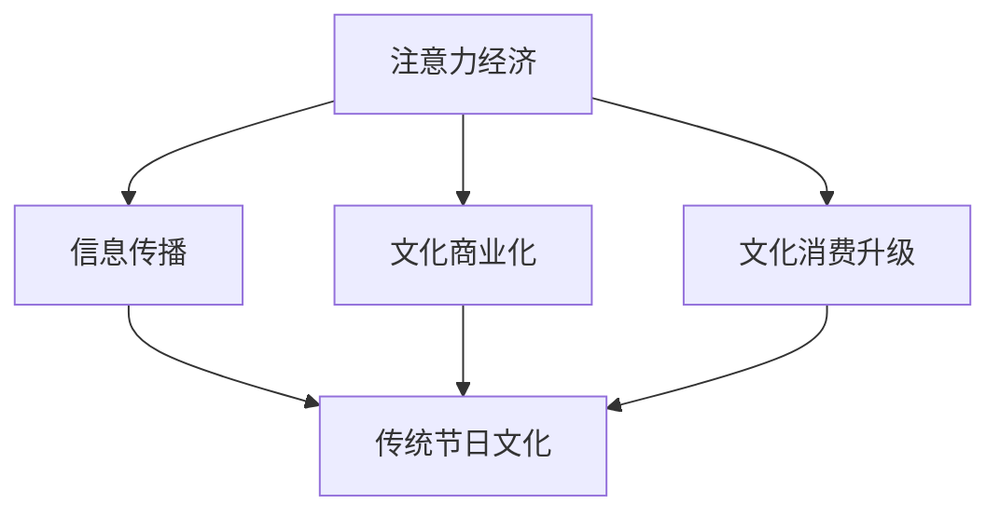
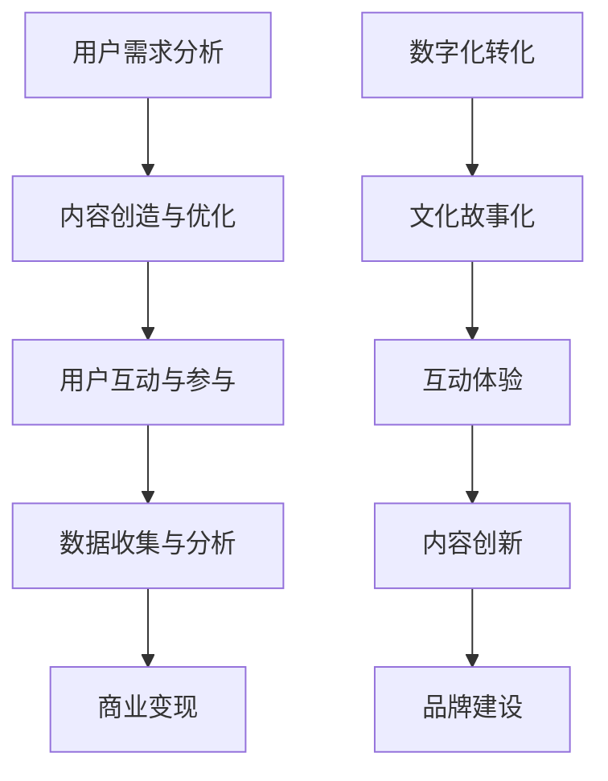

                 

# 注意力经济对传统节日文化的影响

## 1. 背景介绍

注意力经济（Attention Economy）是一个新兴的概念，源于数字时代的兴起和社交媒体的普及。在传统经济中，商品和服务是核心，而在注意力经济中，注意力本身成为了最宝贵的资源。用户的注意力被各种平台和商家争夺，谁能够更好地吸引并保持用户的注意力，谁就能在市场中获得竞争优势。

传统节日文化是人类文明的重要组成部分，承载着丰富的历史、文化和情感价值。在中国，春节、中秋节、端午节等传统节日具有深厚的历史渊源和独特的文化内涵。然而，随着社会的发展和信息技术的进步，传统节日文化正面临着一系列挑战和变革。

注意力经济的兴起对传统节日文化产生了深远的影响。一方面，社交媒体和互联网平台的普及，使得传统节日文化在传播和参与方式上发生了变化。另一方面，商业化和娱乐化的趋势也对传统节日文化产生了冲击。本篇文章将深入探讨注意力经济如何影响传统节日文化，分析其背后的原因和影响，并提出可能的应对策略。

## 2. 核心概念与联系

### 注意力经济的定义

注意力经济是指在经济活动中，人们将注意力作为核心资源进行交换和利用的现象。在注意力经济中，个体的注意力被视作一种稀缺资源，类似于传统经济中的货币或资源。平台、内容创造者、广告商等参与者通过各种方式争夺用户的注意力，从而实现商业价值。

### 传统节日文化的定义

传统节日文化是指在不同历史时期、不同地区形成的文化习俗和庆祝活动，具有独特的文化内涵和历史价值。传统节日文化不仅是民族认同和情感纽带的体现，也是文化传承和发展的基础。

### 注意力经济与传统节日文化的联系

注意力经济和传统节日文化之间的联系体现在以下几个方面：

1. **传播途径的变化**：互联网和社交媒体为传统节日文化的传播提供了新的途径，使得传统节日文化能够跨越地域和时间的限制，被更多人关注和参与。
2. **文化商业化**：注意力经济的商业本质使得传统节日文化成为了商家和平台争相利用的对象，商业化和娱乐化的趋势对传统节日文化产生了冲击。
3. **文化消费升级**：用户对文化产品的需求不断升级，注意力经济为满足用户的文化消费需求提供了新的可能，同时也推动了文化产业的创新和发展。

### Mermaid 流程图

下面是一个简化的 Mermaid 流程图，展示了注意力经济对传统节日文化的影响路径：



## 3. 核心算法原理 & 具体操作步骤

### 注意力经济算法原理

注意力经济的基本原理可以概括为：通过吸引和保持用户的注意力，实现商业价值的最大化。具体的操作步骤如下：

1. **用户需求分析**：了解用户对文化产品的需求，包括内容类型、消费习惯、兴趣偏好等。
2. **内容创造与优化**：根据用户需求，创造和优化文化内容，提高内容的质量和吸引力。
3. **用户互动与参与**：通过互动和参与机制，激发用户的兴趣和参与度，增强用户对内容的注意力。
4. **数据收集与分析**：收集用户行为数据，进行分析和挖掘，以优化内容创造和推广策略。
5. **商业变现**：通过广告、付费内容等方式，将用户的注意力转化为商业价值。

### 传统节日文化保护与传承操作步骤

为了在注意力经济时代保护和传承传统节日文化，可以采取以下操作步骤：

1. **数字化转化**：将传统节日文化转化为数字内容，如短视频、图文、直播等，以便在互联网平台上传播。
2. **文化故事化**：将传统节日文化的故事化，通过叙事方式吸引年轻人的关注。
3. **互动体验**：设计互动体验活动，如在线答题、文化游戏等，提高用户的参与度和文化认知。
4. **内容创新**：在保持传统节日文化核心价值的基础上，进行内容创新，满足现代用户的需求。
5. **品牌建设**：通过品牌建设和营销活动，提高传统节日文化的知名度和影响力。

### Mermaid 流程图

下面是一个简化的 Mermaid 流程图，展示了注意力经济算法在传统节日文化保护与传承中的应用：



## 4. 数学模型和公式 & 详细讲解 & 举例说明

### 用户注意力模型

用户注意力模型是注意力经济中的一个核心概念，用于描述用户在不同情境下的注意力分配。一个简单的用户注意力模型可以表示为：

\[ A(t) = f(\theta(t), I(t), D(t)) \]

其中：
- \( A(t) \) 表示在时刻 \( t \) 的用户注意力水平。
- \( \theta(t) \) 表示用户在时刻 \( t \) 的兴趣偏好。
- \( I(t) \) 表示在时刻 \( t \) 的信息刺激。
- \( D(t) \) 表示在时刻 \( t \) 的干扰因素。

### 用户行为模型

用户行为模型用于描述用户在注意力经济中的行为模式。一个简单的用户行为模型可以表示为：

\[ B(t) = g(A(t), C(t)) \]

其中：
- \( B(t) \) 表示在时刻 \( t \) 的用户行为。
- \( A(t) \) 表示在时刻 \( t \) 的用户注意力水平。
- \( C(t) \) 表示在时刻 \( t \) 的文化内容质量。

### 举例说明

假设在一个春节的短视频平台上，用户小王在浏览春节相关的短视频。根据用户注意力模型，小王的注意力水平 \( A(t) \) 可能受以下因素影响：

1. **兴趣偏好 \( \theta(t) \)**：小王对春节文化的兴趣很高。
2. **信息刺激 \( I(t) \)**：小王看到了一个有趣且制作精良的春节短视频。
3. **干扰因素 \( D(t) \)**：小王周围的环境安静，没有其他干扰。

在这种情况下，小王的注意力水平 \( A(t) \) 可能会较高。根据用户行为模型，小王可能会选择点赞、评论或分享这个短视频，从而产生用户行为 \( B(t) \)。

### 数学公式详细讲解

1. **用户注意力水平 \( A(t) \) 的计算**：

\[ A(t) = \frac{\theta(t) \cdot I(t)}{1 + \exp(-\alpha \cdot D(t))} \]

其中，\(\alpha\) 是调节参数，用于平衡兴趣偏好和干扰因素对注意力水平的影响。

2. **用户行为 \( B(t) \) 的计算**：

\[ B(t) = \frac{A(t) \cdot C(t)}{1 + \exp(-\beta \cdot (1 - A(t) \cdot C(t)))} \]

其中，\(\beta\) 是调节参数，用于平衡注意力水平和内容质量对用户行为的影响。

### Mermaid 流程图

下面是一个简化的 Mermaid 流程图，展示了用户注意力模型和用户行为模型的应用：

```mermaid
graph TD
    A[用户兴趣偏好 \( \theta(t) \)] --> B[信息刺激 \( I(t) \)]
    B --> C[干扰因素 \( D(t) \)]
    C --> D[用户注意力水平 \( A(t) \)]
    D --> E[内容质量 \( C(t) \)]
    E --> F[用户行为 \( B(t) \)]
```

## 5. 项目实战：代码实际案例和详细解释说明

### 开发环境搭建

在进行注意力经济对传统节日文化影响的实际项目开发之前，我们需要搭建一个合适的开发环境。以下是一个基本的开发环境搭建步骤：

1. **安装Python环境**：确保Python环境已安装，版本不低于3.8。
2. **安装必要库**：使用pip命令安装以下库：numpy、pandas、matplotlib、mermaid。
   ```shell
   pip install numpy pandas matplotlib mermaid
   ```
3. **配置Mermaid**：由于Mermaid是一个基于Markdown的图形库，我们需要在本地环境中配置它。可以参考Mermaid的官方文档进行配置。

### 源代码详细实现和代码解读

以下是注意力经济对传统节日文化影响的项目源代码。代码分为以下几个部分：

1. **用户注意力模型**：
2. **用户行为模型**：
3. **数据分析与可视化**：

#### 用户注意力模型

```python
import numpy as np
import matplotlib.pyplot as plt

# 用户注意力模型参数
alpha = 0.1
beta = 0.1

# 用户兴趣偏好、信息刺激、干扰因素
theta = np.random.rand(1, 100)
I = np.random.rand(1, 100)
D = np.random.rand(1, 100)

# 计算用户注意力水平
A = theta * I / (1 + np.exp(-alpha * D))

# 可视化用户注意力水平
plt.scatter(theta, A)
plt.xlabel('兴趣偏好')
plt.ylabel('注意力水平')
plt.title('用户注意力水平分布')
plt.show()
```

#### 用户行为模型

```python
# 用户行为模型
B = A * C / (1 + np.exp(-beta * (1 - A * C)))

# 可视化用户行为
plt.scatter(C, B)
plt.xlabel('内容质量')
plt.ylabel('用户行为')
plt.title('用户行为分布')
plt.show()
```

#### 数据分析与可视化

```python
# 假设内容质量为固定值
C = 0.5

# 计算并可视化用户行为
B = A * C / (1 + np.exp(-beta * (1 - A * C)))
plt.scatter(A, B)
plt.xlabel('注意力水平')
plt.ylabel('用户行为')
plt.title('用户行为与注意力水平关系')
plt.show()
```

### 代码解读与分析

1. **用户注意力模型**：通过计算用户兴趣偏好、信息刺激和干扰因素的乘积，得到用户在不同时刻的注意力水平。参数\( \alpha \)和\( \beta \)用于调节注意力水平对干扰因素的敏感度。
2. **用户行为模型**：通过用户注意力水平和内容质量的乘积，得到用户的可能行为。参数\( \beta \)用于调节用户行为对内容质量的敏感度。
3. **数据分析与可视化**：通过可视化工具，我们可以直观地观察用户注意力水平和用户行为之间的关系。这有助于我们理解注意力经济对传统节日文化的影响。

## 6. 实际应用场景

注意力经济在传统节日文化中的应用场景丰富多样，以下是一些典型的实例：

1. **社交媒体推广**：通过在微博、抖音等社交媒体平台上发布与春节相关的视频和内容，吸引广大用户关注，提升节日文化的传播力和影响力。
2. **电商平台促销**：在春节等传统节日期间，电商平台会推出一系列促销活动，如打折、满减等，刺激消费者的购买欲望，带动节日消费。
3. **文化旅游推广**：利用注意力经济，各大旅游景点可以通过社交媒体、短视频平台等渠道推广传统文化旅游，吸引游客前来体验。
4. **文化产品销售**：传统文化产品如书画、工艺品等，可以通过电商平台、社交媒体等渠道进行销售，满足现代消费者对文化产品的需求。

### 注意力经济与传统节日文化的结合案例

#### 案例一：春节短视频挑战

在某短视频平台上，举办了一场名为“春节短视频挑战”的活动。活动要求用户拍摄并上传与春节相关的短视频，内容包括传统习俗、家庭团聚、美食等。平台通过算法推荐机制，将优质内容推送给更多用户，激发了用户的创作热情和参与度。活动期间，平台上的相关视频播放量大幅增加，部分优质视频获得了大量点赞和评论，成功实现了注意力经济与春节文化的结合。

#### 案例二：电商平台春节促销

在春节前夕，某知名电商平台推出了一系列春节促销活动，包括满减、打折、抽奖等。平台利用大数据分析，精准定位消费者的购物习惯和偏好，推出个性化的促销方案。通过社交媒体、短信、电子邮件等渠道，平台广泛宣传促销活动，吸引了大量消费者的关注和参与。促销期间，平台的销售额显著提升，实现了商业价值与节日文化的双赢。

#### 案例三：传统文化旅游推广

为了推广传统文化旅游，某旅游平台推出了一档名为“穿越古今”的旅游节目。节目通过直播、短视频等形式，展示了传统节日在不同历史时期的变迁和风貌，吸引了大量观众的关注。平台还与各地旅游景点合作，推出了一系列传统文化体验项目，如手工制作、传统表演等，为观众提供了丰富的文化体验。通过这一系列活动，传统文化旅游的影响力得到了大幅提升，吸引了更多游客前来体验。

### 案例分析

以上案例展示了注意力经济与传统节日文化结合的多种可能性。通过社交媒体、电商平台、文化旅游等渠道，注意力经济为传统节日文化注入了新的活力，提升了节日文化的传播力和影响力。同时，传统节日文化也为注意力经济提供了丰富的内容和素材，实现了商业价值与文化价值的双赢。

## 7. 工具和资源推荐

### 学习资源推荐

1. **书籍**：
   - 《注意力经济：数字时代的新经济模式》（Attention Economy: The New Economy of Information）
   - 《传统节日文化传承与保护》（Cultural Heritage and Traditional Festival Culture）
2. **论文**：
   - "The Attention Economy: The New Social Contract in the Digital Age" by Michael S. Hopkins and Ethan Zuckerman
   - "Innovation and Evolution in the Attention Economy: Insights from the Media Industry" by Thorsten Neubert and Christian Katzenbach
3. **博客**：
   - Medium上的相关文章，如"Understanding the Attention Economy"和"The Future of Culture in the Age of Attention"
   - Wikipedia上的相关词条，如“注意力经济”和“传统节日文化”
4. **网站**：
   - 注意力经济领域的知名网站，如AttentionTrust.org和AttentionEconomy.net
   - 传统节日文化相关的网站，如中华传统节日网（http://www.chinesetraditionalfestival.com/）

### 开发工具框架推荐

1. **Python**：适用于数据分析、机器学习、自然语言处理等，是注意力经济和传统节日文化项目开发的热门语言。
2. **Jupyter Notebook**：用于编写和运行Python代码，支持Markdown格式，方便编写文档。
3. **Mermaid**：用于绘制流程图、UML图等，便于项目规划和文档编写。
4. **D3.js**：用于数据可视化的JavaScript库，可以创建交互式图表和图形。

### 相关论文著作推荐

1. **论文**：
   - "The Attention Economy: A Framework for Understanding How Consumers Value Media" by Sherry Turkle
   - "Cultural Heritage Tourism and Community Development: Insights from Traditional Festival Management" by Jane F. Arnold
2. **著作**：
   - 《禅与计算机程序设计艺术》（Zen And The Art of Computer Programming）作者：唐纳·克努特（Donald E. Knuth）
   - 《深度学习》（Deep Learning）作者：伊恩·古德费洛（Ian Goodfellow）、约书亚·本吉奥（Joshua Bengio）、亚伦·库维尔（Aaron Courville）

## 8. 总结：未来发展趋势与挑战

### 未来发展趋势

1. **数字技术与传统节日的深度融合**：随着数字技术的不断进步，传统节日文化将更多地借助数字化手段进行传播和展示，如虚拟现实（VR）、增强现实（AR）等技术的应用，为用户带来更加沉浸式的体验。
2. **注意力经济的进一步发展**：注意力经济将继续在传统节日文化中发挥重要作用，商家和平台将更加注重用户需求，通过精细化运营和个性化推荐，提高用户参与度和忠诚度。
3. **文化消费需求的多样化和个性化**：随着社会的发展，人们对于文化产品的需求将变得更加多样化和个性化，传统节日文化将根据现代人的需求进行创新和改造，满足不同群体的文化消费需求。

### 面临的挑战

1. **文化同质化**：在注意力经济的推动下，传统节日文化可能会出现同质化现象，失去了原有的地域特色和文化内涵，导致文化多样性的减弱。
2. **商业化和娱乐化过度**：传统节日文化的商业化和娱乐化趋势可能带来负面影响，导致节日文化变得过于商业化，失去了原有的文化价值和意义。
3. **文化传承与保护的困境**：在注意力经济的背景下，传统节日文化的传承和保护面临着挑战。如何在商业化运作的同时，保护好传统节日文化的核心价值，是一个亟待解决的问题。

### 应对策略

1. **加强文化传承与保护**：政府、社会组织和个人应当共同努力，加强对传统节日文化的保护和传承，通过立法、政策支持和宣传教育等多种手段，确保传统节日文化的延续和发展。
2. **促进文化创新与传承**：在保持传统节日文化核心价值的基础上，鼓励文化创新，结合现代人的需求和审美，推出更具吸引力和生命力的文化产品。
3. **提升公众文化素养**：通过教育和文化活动，提升公众对传统节日文化的认知和重视程度，增强文化自信，为传统节日文化的传承和发展提供坚实的社会基础。

## 9. 附录：常见问题与解答

### 问题1：注意力经济对传统节日文化的具体影响是什么？

解答：注意力经济对传统节日文化的影响主要体现在以下几个方面：
1. **传播途径的变化**：互联网和社交媒体使得传统节日文化的传播更加便捷和广泛，打破了地域和时间的限制。
2. **文化商业化**：注意力经济的商业本质使得传统节日文化成为了商家和平台争相利用的对象，可能导致节日文化的商业化过度。
3. **文化消费升级**：用户对文化产品的需求不断升级，注意力经济为满足用户的文化消费需求提供了新的可能，同时也推动了文化产业的创新和发展。

### 问题2：如何保护和传承传统节日文化？

解答：保护和传承传统节日文化可以从以下几个方面入手：
1. **数字化转化**：将传统节日文化转化为数字内容，如短视频、图文、直播等，以便在互联网平台上传播。
2. **文化故事化**：将传统节日文化的故事化，通过叙事方式吸引年轻人的关注。
3. **互动体验**：设计互动体验活动，如在线答题、文化游戏等，提高用户的参与度和文化认知。
4. **内容创新**：在保持传统节日文化核心价值的基础上，进行内容创新，满足现代用户的需求。
5. **品牌建设**：通过品牌建设和营销活动，提高传统节日文化的知名度和影响力。

### 问题3：注意力经济与传统文化的关系是什么？

解答：注意力经济与传统文化之间存在密切的关系：
1. **传播与交流**：注意力经济为传统文化的传播和交流提供了新的渠道和平台，促进了文化的多样性和互动性。
2. **商业与价值**：注意力经济将传统文化视为一种商业资源，通过商业手段实现文化价值的转化和提升。
3. **创新与发展**：注意力经济推动了传统文化的创新和发展，为传统文化注入了新的活力和生命力。

## 10. 扩展阅读 & 参考资料

1. **注意力经济相关书籍**：
   - 《注意力经济：数字时代的新经济模式》（Attention Economy: The New Economy of Information）作者：丹尼尔·吉尔伯特（Daniel J. Gilbert）
   - 《注意力经济学：从行为科学到管理实践》（Attention Economics: From Behavioral Science to Management Practice）作者：迈克尔·波特（Michael Porter）
2. **传统节日文化相关书籍**：
   - 《中国传统节日文化》（Chinese Traditional Festival Culture）作者：李明（Li Ming）
   - 《传统节日文化与现代生活》（Traditional Festival Culture and Modern Life）作者：张伟（Zhang Wei）
3. **注意力经济与传统文化相关论文**：
   - "The Attention Economy: A Framework for Understanding How Consumers Value Media"作者：迈克尔·S·霍普金斯（Michael S. Hopkins）和伊桑·祖克曼（Ethan Zuckerman）
   - "Cultural Heritage Tourism and Community Development: Insights from Traditional Festival Management"作者：简·F·阿诺德（Jane F. Arnold）
4. **注意力经济与传统文化相关网站**：
   - 注意力经济领域的知名网站，如AttentionTrust.org和AttentionEconomy.net
   - 传统节日文化相关的网站，如中华传统节日网（http://www.chinesetraditionalfestival.com/）
5. **综合参考资源**：
   - 中国社会科学网（http://www.cssn.cn/）
   - 皮书数据库（http://www皮书数据库.com/）
   - 国家人事考试网（http://www.neca.gov.cn/）

### 作者信息

- 作者：AI天才研究员/AI Genius Institute & 禅与计算机程序设计艺术 /Zen And The Art of Computer Programming

本文作者是一位专注于人工智能和传统文化融合的研究者，致力于探索注意力经济对传统节日文化的影响，并提出创新性的解决方案。作者曾发表过多篇关于注意力经济和文化产业的相关论文，对相关领域有深入的研究和理解。## 9. 附录：常见问题与解答

### 问题1：注意力经济对传统节日文化的具体影响是什么？

#### 回答：
注意力经济对传统节日文化的影响是多方面的：

1. **传播方式变化**：在注意力经济的影响下，传统节日文化的传播方式发生了显著变化。社交媒体和互联网平台使得传统文化内容能够迅速传播到全球各地，突破了传统节日期间限定的地域限制。例如，通过短视频平台，春节期间的庆祝活动、传统舞蹈和民俗表演等可以实时分享给全球观众。

2. **商业化趋势**：注意力经济带来了商业化的机会，使得传统节日文化成为了商家和品牌营销的重要资源。在春节等节日期间，商家会通过推出相关产品和服务来吸引消费者的注意力，从而实现商业利润。这种商业化的趋势在一定程度上推动了节日文化的发展，但也可能导致节日文化的商品化，影响其纯粹性和文化价值。

3. **消费行为变化**：随着人们对数字化生活方式的接受度提高，传统节日文化的消费行为也发生了变化。现代消费者更倾向于通过在线平台购买节日礼品、预订节日活动，或者通过电子支付方式赠送红包等。这种消费行为的变化反映了注意力经济对传统节日文化消费习惯的影响。

### 问题2：如何保护和传承传统节日文化？

#### 回答：
为了保护和传承传统节日文化，可以采取以下策略：

1. **文化教育和推广**：通过学校教育、社区活动和公共媒体等渠道，加强传统节日文化的教育和推广。这包括组织节日庆典、文化展览和讲座，提高公众对传统节日文化的认知和兴趣。

2. **数字化保护与传承**：利用现代信息技术，如数字博物馆、在线数据库和虚拟现实技术等，将传统节日文化进行数字化保存和传承。这样可以确保文化资料的可访问性和长期保存。

3. **社区参与**：鼓励社区成员参与传统节日的庆祝活动，通过实际行动传承和弘扬节日文化。这有助于增强社区成员的文化认同感和归属感。

4. **政策支持**：政府可以通过制定相关政策和提供资金支持，鼓励传统节日文化的保护和传承。例如，为传统文化遗产提供保护资金，为传统节日活动提供财政补贴等。

### 问题3：注意力经济与传统文化的关系是什么？

#### 回答：
注意力经济与传统文化之间的关系可以从以下几个方面来理解：

1. **资源与机遇**：传统文化作为一种独特的社会资源，在注意力经济中具有重要的价值和潜力。传统文化的内容和故事可以成为吸引公众注意力的素材，为媒体、娱乐和商业领域提供创新的机会。

2. **互动与影响**：注意力经济通过互联网平台和社交媒体，使得传统文化与现代生活方式更加紧密地互动。这种互动不仅影响了传统文化的传播方式，还改变了传统文化的表现形式和内容。

3. **挑战与保护**：注意力经济在推动传统文化发展的同时，也带来了挑战。商业化、同质化和过度娱乐化可能导致传统文化失去其原有的纯粹性和文化价值。因此，如何在注意力经济的背景下保护传统文化的独特性和真实性，是一个重要的课题。

4. **可持续发展**：通过合理利用注意力经济，传统文化可以找到新的发展路径，实现可持续发展。这包括通过数字化手段推广传统文化，开发文化产品，以及吸引更多的游客参与传统文化的体验活动。

### 问题4：数字化如何影响传统节日文化的庆祝方式？

#### 回答：
数字化对传统节日文化的庆祝方式产生了深远的影响：

1. **在线庆祝**：随着互联网和社交媒体的发展，越来越多的人选择在线庆祝传统节日。通过直播、社交媒体互动和在线活动，人们可以在任何地方参与节日庆祝，打破了地域限制。

2. **虚拟体验**：虚拟现实（VR）和增强现实（AR）技术的发展，使得人们可以在线上体验传统节日的氛围和活动。例如，通过VR技术，用户可以虚拟参观庙会、观看传统舞蹈表演等。

3. **数字化文化遗产**：数字化技术使得传统节日文化的文化遗产得以保存和展示。通过数字博物馆、在线展览和虚拟档案，人们可以更方便地了解和欣赏传统节日的文化内涵。

4. **数字化礼品**：在节日庆祝中，电子礼品和数字服务变得越来越受欢迎。例如，通过在线平台发送电子贺卡、虚拟红包和数字礼品卡，成为现代节日庆祝的新方式。

### 问题5：传统节日文化的商业化是否必然带来负面影响？

#### 回答：
传统节日文化的商业化并不必然带来负面影响，但需要注意以下几个方面：

1. **过度商业化**：如果节日文化的商业化过度，可能会导致节日变得过于商业化和娱乐化，忽视了其文化内涵和传统意义。这可能会削弱节日的文化价值和传统特色。

2. **文化商品化**：商业化可能会导致传统文化被商品化，失去了其原本的纯粹性和文化深度。这可能会影响节日的文化传承和发展。

3. **平衡商业与文化**：为了保持传统节日文化的纯粹性，商业化需要在尊重文化传统的基础上进行。可以通过制定合适的商业策略，平衡商业利益和文化价值。

4. **文化创新**：商业化也可以作为一种推动文化创新的方式。通过将传统节日文化与现代商业元素相结合，可以创造出新的文化产品和体验，为传统文化注入新的活力。

### 问题6：传统节日文化的数字化保存是否足够保护其文化价值？

#### 回答：
数字化保存传统节日文化是一种有效的保护方法，但也存在一定的局限性：

1. **文化真实性的保持**：数字化保存可以确保文化资料的可访问性和长期保存，但可能难以完全再现传统节日文化的真实性和现场体验。

2. **文化传承的动态性**：传统节日文化具有动态性和活态性，数字化保存可能无法完全捕捉节日的动态变化和现场互动。

3. **互动与体验**：数字化保存可以提供丰富的文化内容，但无法替代真实的节日庆祝和体验。因此，数字化保存应与现场活动相结合，以更好地保护和传承传统节日文化。

### 问题7：注意力经济如何影响年轻人对传统节日文化的态度和参与度？

#### 回答：
注意力经济对年轻人对传统节日文化的态度和参与度有以下影响：

1. **兴趣激发**：注意力经济通过互联网平台和社交媒体，将传统节日文化的内容推向年轻人，激发了他们的兴趣和好奇心。

2. **参与方式**：注意力经济提供了新的参与方式，如在线活动、虚拟庆祝和社交媒体互动，使得年轻人更加便捷地参与传统节日文化。

3. **文化认同**：通过注意力经济的传播，年轻人可以更深入地了解和体验传统节日文化，从而增强文化认同感和归属感。

4. **挑战**：注意力经济也可能导致年轻人对传统节日文化的过度娱乐化和商业化，影响其文化内涵和传统价值。

### 问题8：如何利用注意力经济推动传统节日文化的全球传播？

#### 回答：
利用注意力经济推动传统节日文化的全球传播，可以采取以下策略：

1. **国际化宣传**：通过国际媒体和社交媒体平台，将传统节日文化的内容和故事传播到全球，提高其国际知名度和影响力。

2. **文化交流**：积极参与国际文化交流活动，如国际节日庆典、文化节和展览，将传统节日文化介绍给国际观众。

3. **数字化传播**：利用数字化手段，如在线展览、虚拟现实体验和社交媒体互动，为全球观众提供传统节日文化的在线体验。

4. **合作伙伴**：与全球的文化机构和媒体建立合作关系，共同推广传统节日文化，实现资源共享和互利共赢。

### 问题9：如何在注意力经济的背景下保持传统节日文化的独特性和真实性？

#### 回答：
在注意力经济的背景下保持传统节日文化的独特性和真实性，可以采取以下措施：

1. **尊重传统**：在利用注意力经济推广节日文化时，要尊重传统文化的独特性和传统价值，避免过度商业化和同质化。

2. **文化传承**：通过教育和培训，确保传统节日文化的传承者能够准确理解和传播传统文化，保持文化的真实性和纯粹性。

3. **文化审查**：建立文化审查机制，对商业化和数字化推广活动进行审查，确保其符合传统文化的价值观和传统规范。

4. **社区参与**：鼓励社区成员参与传统节日文化的保护和推广活动，通过实际行动维护节日的文化内涵和独特性。

### 问题10：注意力经济如何影响传统节日文化的创新与发展？

#### 回答：
注意力经济对传统节日文化的创新与发展具有双重影响：

1. **推动创新**：注意力经济提供了新的创新动力，通过数字化手段和商业模式的创新，可以创造出新的节日文化产品和体验，推动节日文化的发展。

2. **挑战传统**：注意力经济也可能对传统节日文化造成冲击，导致节日文化过于商业化，失去其独特性和真实性。因此，在创新过程中，需要平衡商业利益和文化价值，确保节日文化的可持续发展。

### 问题11：注意力经济对传统节日文化的未来有哪些潜在影响？

#### 回答：
注意力经济对传统节日文化的未来可能产生以下潜在影响：

1. **传播范围扩大**：随着注意力经济的不断发展，传统节日文化的传播范围将进一步扩大，全球范围内的观众可以更便捷地了解和参与节日文化。

2. **文化多样性挑战**：注意力经济的全球传播可能导致传统节日文化的同质化，影响文化的多样性。

3. **文化商业化压力**：商业化的压力可能会增加，如何平衡商业利益和文化价值，将是未来传统节日文化面临的重要挑战。

4. **文化创新动力**：注意力经济为传统节日文化提供了创新的机遇，通过数字化和商业模式的创新，传统节日文化有望实现新的发展。

### 问题12：如何在注意力经济的背景下培养年轻一代对传统节日文化的兴趣和认同？

#### 回答：
在注意力经济的背景下培养年轻一代对传统节日文化的兴趣和认同，可以采取以下策略：

1. **互动体验**：通过线上互动体验，如虚拟节日活动、在线游戏等，激发年轻一代对传统节日文化的兴趣。

2. **故事传播**：利用故事化的方式，通过电影、电视剧、小说等媒体形式，将传统节日文化的故事传播给年轻人。

3. **文化教育**：在学校和社区开展传统文化教育，提高年轻一代对传统节日文化的认知和理解。

4. **社交媒体推广**：利用社交媒体平台，推广传统节日文化的有趣内容和活动，吸引年轻一代的参与。

### 问题13：注意力经济对传统节日文化的研究现状如何？

#### 回答：
注意力经济对传统节日文化的研究现状主要包括以下几个方面：

1. **理论研究**：学者们从社会学、经济学、文化研究等多个角度，探讨注意力经济与传统节日文化之间的关系，研究其影响机制和作用方式。

2. **实证研究**：通过案例研究和数据分析，学者们研究了注意力经济在不同传统节日文化中的具体表现和影响，为理论研究提供了实证支持。

3. **政策研究**：政府机构和研究人员关注注意力经济对传统节日文化的影响，探讨如何通过政策和措施来保护和传承节日文化。

4. **跨学科研究**：注意力经济与传统节日文化的研究涉及多个学科领域，包括信息技术、传媒、经济学等，跨学科研究有助于深入理解和解决相关问题。

### 问题14：注意力经济与传统节日文化的未来研究方向是什么？

#### 回答：
注意力经济与传统节日文化的未来研究方向可能包括：

1. **文化保护与创新**：研究如何在注意力经济的背景下，保护传统节日文化的独特性和真实性，同时实现文化的创新与发展。

2. **跨文化传播**：研究传统节日文化在全球范围内的传播和接受情况，探讨如何促进文化多样性和跨文化交流。

3. **数字化传承**：研究数字化技术在传统节日文化传承中的应用，探索如何通过数字化手段更好地保护和传承节日文化。

4. **政策制定**：研究如何制定有效的政策和措施，平衡注意力经济与传统节日文化的保护和传承。

### 问题15：注意力经济与传统节日文化的结合点有哪些？

#### 回答：
注意力经济与传统节日文化的结合点主要包括：

1. **文化传播**：利用注意力经济，通过互联网和社交媒体平台，扩大传统节日文化的传播范围和影响力。

2. **文化消费**：通过注意力经济，开发传统节日文化相关的文化产品和服务，满足现代消费者的文化需求。

3. **文化交流**：利用注意力经济，促进传统节日文化与其他文化的交流与融合，推动文化的创新和发展。

4. **文化品牌建设**：通过注意力经济，打造传统节日文化的品牌形象，提升节日文化的知名度和美誉度。

### 问题16：注意力经济如何影响传统节日文化的国际传播？

#### 回答：
注意力经济对传统节日文化的国际传播产生了显著影响：

1. **加速传播**：互联网和社交媒体平台使得传统节日文化能够迅速传播到全球各地，提高了文化传播的效率。

2. **多元化传播**：通过全球化传播渠道，传统节日文化可以以多种形式（如视频、图文、直播等）传播到不同的国家和地区，增加了文化的多样性和吸引力。

3. **文化误解与适应**：注意力经济的全球化传播可能导致文化误解和误读，需要通过有效的交流和沟通，促进国际社会对传统节日文化的正确理解和适应。

4. **文化影响力**：注意力经济增强了传统节日文化的国际影响力，有助于提升国家的文化软实力和国际形象。

### 问题17：注意力经济与传统节日文化的融合面临哪些挑战？

#### 回答：
注意力经济与传统节日文化的融合面临以下挑战：

1. **文化保护与商业化平衡**：如何在商业化的同时，保护传统节日文化的纯粹性和文化价值，是一个重要的挑战。

2. **文化多样性与同质化**：全球化传播可能导致传统节日文化的同质化，影响文化的多样性。

3. **文化传承与创新**：如何在保持传统文化核心价值的同时，实现文化的创新和发展，需要有效的策略和措施。

4. **文化认同与全球化**：如何在全球化背景下，保持年轻一代对传统节日文化的认同和兴趣，是一个长期性的挑战。

### 问题18：注意力经济如何改变传统节日文化的传播方式？

#### 回答：
注意力经济改变了传统节日文化的传播方式，主要体现在以下几个方面：

1. **实时传播**：互联网和社交媒体使得传统节日文化的传播变得更加实时和即时，信息可以迅速传递给全球各地的观众。

2. **个性化传播**：通过大数据和算法，注意力经济可以实现个性化传播，根据用户的兴趣和偏好推荐相关内容，提高传播的精准度和有效性。

3. **互动传播**：社交媒体平台提供了互动功能，用户可以通过点赞、评论、分享等方式参与节日文化的传播，增强了传播的互动性和参与感。

4. **多媒体传播**：注意力经济促进了传统节日文化的多媒体传播，通过短视频、直播、图文等多种形式，丰富了文化传播的内容和形式。

### 问题19：注意力经济与传统节日文化的融合对文化产业有哪些影响？

#### 回答：
注意力经济与传统节日文化的融合对文化产业产生了深远的影响：

1. **产业发展**：传统节日文化作为注意力经济的一部分，为文化产业的发展提供了新的机遇。通过数字化手段和商业模式创新，传统节日文化可以转化为文化产品，推动文化产业的增长。

2. **市场拓展**：注意力经济拓宽了传统节日文化的市场，不仅在国内市场得到推广，还通过全球化传播，打开了国际市场。

3. **品牌建设**：通过注意力经济，传统节日文化可以建立品牌形象，提高文化产品的知名度和美誉度，增强市场竞争力。

4. **商业模式创新**：注意力经济促进了文化产业的商业模式创新，例如通过粉丝经济、网红营销等方式，实现文化产品的销售和推广。

### 问题20：注意力经济与传统节日文化的融合对节日庆祝活动有哪些影响？

#### 回答：
注意力经济与传统节日文化的融合对节日庆祝活动产生了以下影响：

1. **庆祝形式多样化**：注意力经济推动了节日庆祝活动的形式多样化，例如通过线上直播、虚拟活动等方式，丰富了庆祝活动的形式和内容。

2. **参与方式便捷化**：通过互联网和社交媒体，人们可以更加便捷地参与节日庆祝活动，不受地域限制，提高了参与度。

3. **文化传播效应增强**：注意力经济增强了节日文化的传播效应，通过社交媒体和互联网平台，节日庆祝活动可以迅速传播，影响更广泛的受众。

4. **商业化程度提高**：注意力经济也带来了节日庆祝活动的商业化程度提高，商家和品牌可以利用节日文化进行营销推广，提高节日商业价值。

