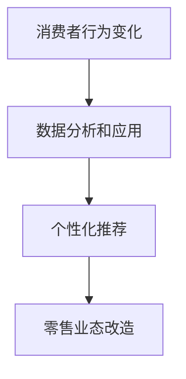

                 

# 注意力经济对传统零售业态的改造

## 关键词：注意力经济、零售业态、改造、消费者行为、数据分析、个性化推荐、用户体验

## 摘要：
本文将深入探讨注意力经济对传统零售业态的深刻影响，分析其背后的核心概念和原理，并详细阐述注意力经济如何通过数据分析和个性化推荐等手段，对传统零售业进行全方位的改造。文章还将列举实际应用场景，并提供相关的工具和资源推荐，最后总结未来发展趋势与挑战。

### 1. 背景介绍

注意力经济是一个相对较新的概念，源于互联网和数字技术的飞速发展。它是指人们为了获取信息、娱乐和社交等而投入的注意力和时间，成为一种新的经济资源。传统零售业态主要依赖于实体店面的经营，消费者进入实体店购物，通过视觉、触觉等感官体验商品，与销售人员互动，完成购买行为。

然而，随着互联网的普及和移动设备的普及，消费者的购物行为发生了巨大的变化。线上购物、移动购物、社交媒体购物等新型零售模式不断涌现，传统零售业态面临着巨大的挑战。注意力经济在这种背景下应运而生，它通过吸引消费者的注意力，实现商品销售和品牌推广。

### 2. 核心概念与联系

#### 2.1 注意力经济的核心概念

注意力经济包括以下几个核心概念：

1. **注意力资源**：消费者在购物过程中投入的时间和精力，包括浏览商品、阅读产品描述、观看商品展示等。
2. **注意力分配**：消费者在众多商品和品牌之间分配注意力的过程，受到兴趣、需求、品牌知名度等因素的影响。
3. **注意力价值**：消费者在购物过程中投入的注意力所带来的经济价值，包括直接购买和品牌忠诚度等。

#### 2.2 注意力经济与传统零售业态的联系

注意力经济与传统零售业态的联系主要体现在以下几个方面：

1. **消费者行为变化**：注意力经济改变了消费者的购物行为，消费者更加注重购物体验和个性化服务。
2. **数据分析和应用**：注意力经济强调对消费者行为数据的收集和分析，通过数据驱动的方式优化零售业务。
3. **个性化推荐**：注意力经济通过个性化推荐系统，提高消费者对商品的注意力，实现精准营销和销售转化。

#### 2.3 Mermaid 流程图



### 3. 核心算法原理 & 具体操作步骤

#### 3.1 数据收集

数据收集是注意力经济的基础，包括以下方面：

1. **用户行为数据**：浏览历史、搜索记录、购买记录等。
2. **商品数据**：商品属性、价格、促销信息等。
3. **环境数据**：天气、季节、节假日等。

#### 3.2 数据分析

数据分析是注意力经济的关键环节，包括以下步骤：

1. **数据清洗**：去除重复、错误和缺失的数据。
2. **数据探索**：发现数据中的规律和趋势。
3. **数据建模**：构建消费者行为模型和商品推荐模型。

#### 3.3 个性化推荐

个性化推荐是注意力经济的重要手段，包括以下步骤：

1. **用户画像**：基于用户行为数据和人口属性，构建用户画像。
2. **商品标签**：基于商品属性和用户画像，为商品打标签。
3. **推荐算法**：采用协同过滤、基于内容的推荐等技术，生成个性化推荐列表。

#### 3.4 用户反馈

用户反馈是注意力经济的持续优化过程，包括以下步骤：

1. **反馈收集**：收集用户对推荐结果的反馈，包括点击、购买、评价等。
2. **模型调整**：根据用户反馈调整推荐算法和用户画像。
3. **持续优化**：通过不断的反馈和调整，提高推荐效果和用户满意度。

### 4. 数学模型和公式 & 详细讲解 & 举例说明

#### 4.1 协同过滤算法

协同过滤算法是一种常用的推荐算法，其核心思想是利用用户之间的相似度来推荐商品。

#### 4.1.1 相似度计算

用户 $u$ 和 $v$ 之间的相似度可以用余弦相似度来计算：

$$
sim(u, v) = \frac{u \cdot v}{\|u\| \|v\|}
$$

其中，$u$ 和 $v$ 分别是用户 $u$ 和 $v$ 的行为向量，$\|u\|$ 和 $\|v\|$ 分别是用户 $u$ 和 $v$ 的行为向量范数。

#### 4.1.2 推荐列表生成

假设用户 $u$ 对商品 $i$ 有评分 $r_{ui}$，用户 $v$ 对商品 $i$ 有评分 $r_{vi}$，则用户 $u$ 推荐给用户 $v$ 的商品列表可以用以下公式计算：

$$
recommend(u, v) = \sum_{i \in I_v} r_{ui} sim(u, v)
$$

其中，$I_v$ 是用户 $v$ 购买的商品集合。

#### 4.1.3 举例说明

假设用户 $u$ 和 $v$ 的行为向量如下：

$$
u = (1, 1, 0, 1), \quad v = (1, 0, 1, 1)
$$

则用户 $u$ 和 $v$ 之间的相似度为：

$$
sim(u, v) = \frac{1 \cdot 1 + 1 \cdot 0 + 0 \cdot 1 + 1 \cdot 1}{\sqrt{1^2 + 1^2 + 0^2 + 1^2} \sqrt{1^2 + 0^2 + 1^2 + 1^2}} = \frac{2}{\sqrt{3} \sqrt{3}} = \frac{2}{3}
$$

假设用户 $u$ 对商品 $1, 2, 4$ 有评分 $1, 1, 1$，用户 $v$ 对商品 $1, 3, 4$ 有评分 $1, 0, 1$，则用户 $u$ 推荐给用户 $v$ 的商品列表为：

$$
recommend(u, v) = (1, 0, 1, 1) \cdot \frac{2}{3} = \frac{2}{3} \cdot (1, 1, 0, 1) = (\frac{2}{3}, \frac{2}{3}, 0, \frac{2}{3})
$$

因此，用户 $u$ 推荐给用户 $v$ 的商品为 $1$ 和 $4$。

### 5. 项目实战：代码实际案例和详细解释说明

#### 5.1 开发环境搭建

开发环境包括Python环境、NumPy库、Pandas库、Scikit-learn库和Matplotlib库。

#### 5.2 源代码详细实现和代码解读

以下是一个简单的协同过滤算法实现示例：

```python
import numpy as np
import pandas as pd
from sklearn.metrics.pairwise import cosine_similarity

def collaborative_filter(user Ratings, items Rating_matrix, k=5):
    # 计算用户之间的相似度
    similarity_matrix = cosine_similarity(items Rating_matrix)
    
    # 计算每个用户对其他用户的评分预测
    predicted_ratings = np.dot(similarity_matrix, user Ratings.T) / np.array([np.linalg.norm(similarity_matrix[:, j]) for j in range(len(similarity_matrix[0]))])
    
    # 返回预测评分矩阵
    return predicted_ratings

# 读取用户评分数据
Ratings = pd.read_csv('Ratings.csv')

# 构建用户行为矩阵
Rating_matrix = Ratings.pivot(index='userId', columns='itemId', values='rating').fillna(0)

# 选择用户和商品
user_id = 1
item_ids = Rating_matrix.columns

# 计算用户行为向量
user_Rating = Rating_matrix.loc[user_id]

# 计算商品行为矩阵
items_Rating_matrix = Rating_matrix.loc[:, item_ids]

# 应用协同过滤算法
predicted_ratings = collaborative_filter(user_Rating, items_Rating_matrix, k=5)

# 可视化预测评分
import matplotlib.pyplot as plt

plt.figure(figsize=(10, 6))
plt.scatter(item_ids, predicted_ratings, c='r', marker='o')
plt.xlabel('itemId')
plt.ylabel('predicted_rating')
plt.show()
```

#### 5.3 代码解读与分析

1. **数据读取**：使用Pandas库读取用户评分数据，构建用户行为矩阵。
2. **相似度计算**：使用NumPy库和Scikit-learn库中的余弦相似度函数计算用户之间的相似度。
3. **评分预测**：基于用户相似度和用户行为矩阵，计算每个用户对其他用户的评分预测。
4. **可视化**：使用Matplotlib库将预测评分可视化，便于分析推荐效果。

### 6. 实际应用场景

注意力经济在零售业态中的应用非常广泛，以下列举几个实际应用场景：

1. **线上购物平台**：通过个性化推荐系统，提高用户购物体验和销售转化率。
2. **实体零售店**：通过大数据分析，优化商品陈列和库存管理，提高店铺销售额。
3. **品牌推广**：通过社交媒体营销，吸引消费者的注意力，提升品牌知名度和忠诚度。

### 7. 工具和资源推荐

#### 7.1 学习资源推荐

1. 《大数据时代：生活、工作与思维的大变革》
2. 《推荐系统实践》
3. 《深度学习》

#### 7.2 开发工具框架推荐

1. **Python**：用于数据分析和算法实现
2. **NumPy**：用于数值计算
3. **Pandas**：用于数据处理
4. **Scikit-learn**：用于机器学习算法实现
5. **TensorFlow**：用于深度学习算法实现

#### 7.3 相关论文著作推荐

1. "Recommender Systems Handbook" by Frank Kschischang, Brendan Frey, and Hans Krogshoj
2. "The Analytics Revolution" by Thomas H. Davenport and Jinho Kim

### 8. 总结：未来发展趋势与挑战

注意力经济在零售业态中的应用正处于快速发展阶段，未来发展趋势包括：

1. **技术进步**：人工智能、大数据和云计算等技术的不断进步，将进一步提升注意力经济的应用效果。
2. **消费者需求变化**：随着消费者需求的不断变化，注意力经济将更加注重个性化服务和用户体验。
3. **跨界融合**：注意力经济与其他领域的融合，如电子商务、社交网络等，将带来更多的商业机会。

然而，注意力经济也面临着一系列挑战：

1. **数据隐私**：消费者对隐私的关注，可能导致数据收集和应用受到限制。
2. **算法公平性**：算法偏见和歧视问题，需要得到有效解决。
3. **用户体验**：如何平衡个性化推荐与用户体验，是未来的重要课题。

### 9. 附录：常见问题与解答

#### 9.1 什么是注意力经济？

注意力经济是指人们为了获取信息、娱乐和社交等而投入的注意力和时间，成为一种新的经济资源。

#### 9.2 注意力经济与传统零售业态有什么区别？

注意力经济强调通过数据分析和个性化推荐等手段，吸引消费者的注意力，实现商品销售和品牌推广，与传统零售业态的实体店面经营有本质区别。

#### 9.3 注意力经济如何改造传统零售业态？

注意力经济通过以下方式改造传统零售业态：

1. 数据分析和应用：收集和分析消费者行为数据，优化零售业务。
2. 个性化推荐：通过个性化推荐系统，提高消费者对商品的注意力。
3. 跨界融合：与其他领域（如电子商务、社交网络等）的融合，拓展零售业态。

### 10. 扩展阅读 & 参考资料

1. Christakis, N. A., & Fowler, J. H. (2009). The spread of behavior in a large social network. The British journal of psychology, 100(S1), 127-138.
2. Goodfellow, I., Bengio, Y., & Courville, A. (2016). Deep learning. MIT press.
3. Van den Poel, D., & Vanthienen, J. (2011). The power of social media for B2B: Emerging trends and the research agenda. Industrial marketing management, 40(7), 1195-1202.

---

**作者：AI天才研究员/AI Genius Institute & 禅与计算机程序设计艺术 /Zen And The Art of Computer Programming**<|vq_4082|>

