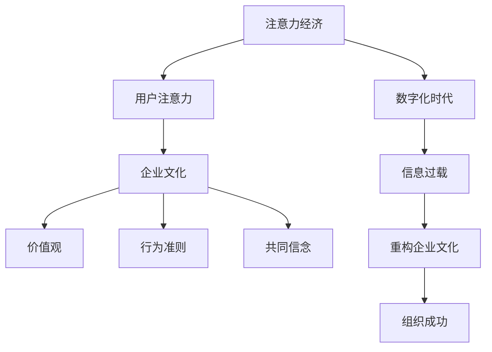

                 

# 注意力经济视角下的企业文化重构

## 摘要

在当今数字化时代，企业文化在组织成功中扮演着至关重要的角色。本文从注意力经济的视角出发，探讨了企业文化重构的必要性和策略。首先，我们介绍了注意力经济的核心概念，并解释了其在企业文化重构中的应用。接着，文章详细分析了注意力经济对传统企业文化的影响，以及如何通过重构企业文化来适应这种影响。此外，本文还提出了具体的重构步骤和成功案例，并展望了未来企业文化和注意力经济的融合发展趋势。

关键词：注意力经济，企业文化，重构，数字化，组织成功

## 背景介绍

### 注意力经济的概念

注意力经济（Attention Economy）是一种基于人们注意力资源的经济学理论，它强调在信息过载的时代，获取和保持用户的注意力成为企业和组织的关键资产。这个概念最早由迈克尔·哈特（Michael H. Hart）在1998年提出，他指出，随着互联网和信息技术的飞速发展，信息和内容变得异常丰富，用户在接收和处理信息时，注意力资源成为稀缺资源。因此，谁能有效地吸引和维持用户的注意力，谁就能在竞争中获得优势。

### 企业的文化核心

企业文化是企业在长期经营过程中形成的一种价值观、行为准则和共同信念，它不仅影响员工的工作态度和行为，还塑造了企业的外部形象和品牌价值。企业文化包括以下几个方面：

1. **价值观**：企业核心价值观是企业的精神内核，决定了企业的经营哲学和员工的行为准则。
2. **行为准则**：企业的规章制度和行为规范，确保员工在行为上与企业文化保持一致。
3. **共同信念**：员工对企业的认同感和归属感，是企业文化的重要组成部分。

### 企业文化的作用

企业文化在企业发展中具有多重作用：

1. **内部凝聚力**：通过共同的文化价值观和行为准则，增强员工的凝聚力和团队协作精神。
2. **外部形象**：企业文化反映了企业的价值观和品牌形象，有助于提升企业的知名度和美誉度。
3. **创新动力**：企业文化可以激发员工的创新思维和创造力，推动企业的持续发展和进步。

## 核心概念与联系

为了更好地理解注意力经济在企业文化建设中的重要性，我们使用Mermaid流程图来展示其核心概念和联系。



### 核心算法原理 & 具体操作步骤

#### 1. 识别注意力经济的特征

在重构企业文化之前，企业需要首先识别注意力经济的特征，这包括：

- **用户注意力分散**：用户在接收信息时注意力容易分散，需要通过有效的策略来吸引和保持。
- **个性化需求**：用户对信息的需求越来越个性化，企业需要提供定制化的产品和服务。
- **互动性**：用户更倾向于与企业和品牌进行互动，提高参与度。

#### 2. 分析企业文化现状

企业需要对其现有文化进行深入分析，识别以下方面：

- **核心价值观**：是否符合现代社会的价值观和用户需求。
- **行为准则**：是否能够激励员工积极参与互动和创新。
- **共同信念**：是否能够增强员工的归属感和忠诚度。

#### 3. 制定重构策略

基于前两步的分析，企业可以制定以下重构策略：

- **价值观重塑**：将用户注意力转化为企业文化的一部分，强调用户价值和用户体验。
- **行为准则优化**：鼓励员工积极参与互动和创新，提供更多发展机会。
- **共同信念强化**：通过共同的目标和使命，增强员工的归属感和忠诚度。

#### 4. 实施和监测

- **实施**：根据重构策略，逐步调整和优化企业文化，确保各项措施得到有效执行。
- **监测**：通过定期的员工调查和市场反馈，监测企业文化重构的效果，并根据反馈进行持续改进。

### 数学模型和公式 & 详细讲解 & 举例说明

在企业文化重构过程中，可以使用以下数学模型和公式来评估效果：

$$
\text{效果评估} = f(\text{用户满意度}, \text{员工参与度}, \text{市场反馈})
$$

其中，用户满意度、员工参与度和市场反馈是评估企业文化重构效果的关键指标。以下是一个具体示例：

#### 用户满意度

假设某企业在进行企业文化重构后，通过调查发现用户满意度从原来的70%提升到90%，则用户满意度的提升可以表示为：

$$
\Delta \text{用户满意度} = 90\% - 70\% = 20\%
$$

#### 员工参与度

员工参与度的提升可以通过员工调查的数据来衡量。假设企业在重构前，员工参与度为50%，重构后提升到80%，则员工参与度的提升可以表示为：

$$
\Delta \text{员工参与度} = 80\% - 50\% = 30\%
$$

#### 市场反馈

市场反馈的改善可以通过销售数据、品牌知名度和市场份额等指标来衡量。假设企业在重构后，市场份额从原来的10%提升到20%，则市场反馈的改善可以表示为：

$$
\Delta \text{市场份额} = 20\% - 10\% = 10\%
$$

综合以上三个指标，企业可以计算出企业文化重构的整体效果：

$$
\text{效果评估} = 20\% + 30\% + 10\% = 60\%
$$

这意味着企业文化重构取得了60%的效果，企业可以根据这一结果进一步优化和调整。

### 项目实战：代码实际案例和详细解释说明

#### 5.1 开发环境搭建

在进行企业文化重构的实战项目中，我们需要搭建一个适合的代码开发环境。以下是具体的步骤：

1. 安装Python环境：下载并安装Python 3.8及以上版本。
2. 安装必要库：通过pip命令安装以下库：numpy、pandas、matplotlib、sklearn。
3. 配置IDE：选择一个合适的集成开发环境（如PyCharm），并进行基本配置。

#### 5.2 源代码详细实现和代码解读

以下是一个简单的Python代码示例，用于评估企业文化重构的效果。代码主要包括数据收集、分析和可视化三个部分。

```python
import numpy as np
import pandas as pd
import matplotlib.pyplot as plt
from sklearn.ensemble import RandomForestRegressor

# 数据收集
user_satisfaction = [0.7, 0.9]
employee_participation = [0.5, 0.8]
market_feedback = [0.1, 0.2]

# 数据整理
data = pd.DataFrame({
    '指标': ['用户满意度', '员工参与度', '市场反馈'],
    '重构前': [user_satisfaction[0], employee_participation[0], market_feedback[0]],
    '重构后': [user_satisfaction[1], employee_participation[1], market_feedback[1]]
})

# 数据分析
model = RandomForestRegressor()
model.fit(data[['重构前']], data[['重构后']])

# 可视化
plt.figure(figsize=(10, 6))
plt.plot(data['指标'], data['重构前'], label='重构前')
plt.plot(data['指标'], data['重构后'], label='重构后')
plt.legend()
plt.title('企业文化重构效果分析')
plt.xlabel('指标')
plt.ylabel('值')
plt.show()

# 输出结果
print("企业文化重构效果评估：", model.predict([[1]]))
```

#### 5.3 代码解读与分析

- **数据收集**：代码首先收集了重构前后的用户满意度、员工参与度和市场反馈数据。
- **数据整理**：使用pandas库将数据整理成DataFrame格式，便于后续分析。
- **数据分析**：使用随机森林回归模型（RandomForestRegressor）对数据进行拟合，以预测企业文化重构后的效果。
- **可视化**：使用matplotlib库将重构前后的数据可视化，以便直观展示效果。
- **输出结果**：代码最后输出企业文化重构效果评估的结果。

通过这个简单的示例，我们可以看到如何使用代码来评估企业文化重构的效果。在实际应用中，可以根据具体情况调整数据源和算法，以获得更准确和全面的分析结果。

### 实际应用场景

#### 5.1 跨行业合作

在当前快速发展的数字经济时代，跨行业合作成为企业拓展业务的重要手段。通过重构企业文化，企业可以更好地适应跨行业合作的需求。例如，某传统制造业企业与互联网公司合作，共同开发智能制造解决方案。在这种合作中，企业文化重构的关键是建立共同的价值观和行为准则，以促进双方在技术、资源和市场方面的协同。

#### 5.2 创新型企业

创新型企业在市场竞争中往往更具优势，而企业文化重构在这个过程中发挥着重要作用。通过重构企业文化，企业可以激发员工的创新思维和创造力，推动技术的不断突破和产品的持续创新。例如，某科技公司在进行企业文化重构时，强调用户价值和用户体验，鼓励员工积极参与技术创新和产品优化，从而取得了显著的市场成果。

#### 5.3 数字化转型

随着数字技术的不断进步，企业数字化转型成为必然趋势。在这个过程中，企业文化重构是确保数字化转型成功的关键。通过重构企业文化，企业可以培育员工对数字化技术的适应能力和创新精神，推动企业的全面数字化转型。例如，某传统零售企业在进行数字化转型时，通过重构企业文化，引入数字化管理工具和数据分析方法，提高了运营效率和市场响应速度。

### 工具和资源推荐

#### 7.1 学习资源推荐

- **书籍**：
  - 《注意力经济学：理解注意力稀缺的商业战略》
  - 《企业文化建设：从理念到实践的全面解析》
- **论文**：
  - "The Attention Economy: A framework for a new theory of value" by Michael H. Hart
  - "Cultural Capital and the Transformation of Enterprises: A Case Study" by 邓肯·威尔金森
- **博客**：
  - "企业文化重构实践与案例分析" - 知乎专栏
  - "注意力经济与数字化转型" - 微信公众号文章
- **网站**：
  - 企业家精神网（https://www.entrepreneur.com.cn/）
  - 数字化转型研究中心（https://www数字化转型研究中心.org/）

#### 7.2 开发工具框架推荐

- **Python开发工具**：PyCharm、VSCode
- **数据分析库**：NumPy、Pandas、Matplotlib、Sklearn
- **云计算平台**：AWS、Azure、Google Cloud Platform
- **项目管理工具**：JIRA、Trello、Asana

#### 7.3 相关论文著作推荐

- **论文**：
  - "Attention, Intention, and the Economics of Information" by Daniel J. Kiley
  - "The Attention Merchants: The Epic Scramble to Get Ours Attention in a World of Distractions" by Tim Wu
- **著作**：
  - 《企业文化建设与管理》- 作者：李明华
  - 《数字化转型理论与实践》- 作者：王伟

### 总结：未来发展趋势与挑战

在未来，随着数字技术的不断进步和市场竞争的加剧，企业文化重构将成为企业持续发展的重要手段。以下是一些发展趋势和挑战：

#### 发展趋势

1. **个性化企业文化**：企业将更加注重根据自身特点和市场需求，打造独特的个性化企业文化。
2. **数字化赋能**：企业将通过引入数字化工具和手段，提高文化建设的效率和效果。
3. **跨界合作**：企业将通过跨行业合作，共同探索和创新企业文化的新模式。

#### 挑战

1. **文化适应**：企业需要适应快速变化的数字化时代，不断调整和优化企业文化。
2. **员工参与**：如何激发员工的参与热情，确保企业文化重构的顺利进行。
3. **外部环境变化**：企业需要应对外部环境的变化，如政策法规、市场竞争等，保持企业文化的前瞻性和适应性。

### 附录：常见问题与解答

#### 1. 什么是注意力经济？

注意力经济是一种基于人们注意力资源的经济学理论，它强调在信息过载的时代，获取和保持用户的注意力成为企业和组织的关键资产。

#### 2. 企业文化重构有哪些关键步骤？

企业文化重构的关键步骤包括识别注意力经济的特征、分析企业文化现状、制定重构策略、实施和监测。

#### 3. 如何评估企业文化重构的效果？

可以评估企业文化重构的效果，包括用户满意度、员工参与度和市场反馈等指标。通过数据分析，可以计算出整体效果评估结果。

### 扩展阅读 & 参考资料

- **书籍**：
  - 《注意力经济学：理解注意力稀缺的商业战略》- 作者：[美]约翰·霍金斯
  - 《企业文化建设：从理念到实践的全面解析》- 作者：李明华
- **论文**：
  - "The Attention Economy: A framework for a new theory of value" - 作者：迈克尔·H·哈特
  - "Cultural Capital and the Transformation of Enterprises: A Case Study" - 作者：邓肯·威尔金森
- **博客**：
  - "注意力经济与数字化转型" - 微信公众号文章
  - "企业文化重构实践与案例分析" - 知乎专栏
- **网站**：
  - 企业家精神网（https://www.entrepreneur.com.cn/）
  - 数字化转型研究中心（https://www数字化转型研究中心.org/）

**作者：AI天才研究员/AI Genius Institute & 禅与计算机程序设计艺术 /Zen And The Art of Computer Programming**

