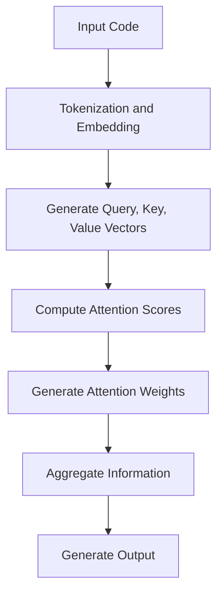

                 

### 文章标题

### Title: Attention Programming Studio: AI-Designed Cognitive Pattern Design

在当今的科技时代，人工智能（AI）正在以前所未有的速度改变着各行各业的面貌。特别是自然语言处理（NLP）领域，其应用范围从智能客服、机器翻译到代码生成等各个方面，都展现出了强大的潜力。本文将探讨一个新兴的领域——注意力编程工作室（Attention Programming Studio），以及如何利用人工智能定制认知模式，从而实现更为高效、精准的编程和问题解决。

关键词：注意力编程、人工智能、认知模式、自然语言处理、编程效率

摘要：本文旨在介绍注意力编程工作室的概念，分析其利用人工智能定制认知模式的原理和实践。通过对注意力机制的深入探讨，结合实际应用案例，本文将阐述如何通过优化提示词和编码策略，提升AI编程的质量和效率。同时，文章还将探讨这一领域的未来发展趋势和潜在挑战。

### Introduction to Attention Programming Studio

Attention Programming Studio（APS）是一个专注于利用人工智能技术优化编程和问题解决的研究和实践平台。APS的核心理念在于通过引入注意力机制，使编程过程更加智能化和自动化。注意力机制起源于自然语言处理领域，最初用于改善模型的上下文理解能力，如机器翻译和文本摘要。随着研究的深入，注意力机制逐渐被引入到计算机编程领域，成为提高编程效率和准确性的有力工具。

在APS中，注意力编程的核心理念是通过关注关键信息来优化编程过程。与传统的顺序执行不同，注意力编程允许程序员在编写代码时动态地关注和调整代码的不同部分，从而实现更高效的问题解决。例如，当编写一个复杂的算法时，程序员可以使用注意力机制来识别和关注关键的代码段，从而更好地理解和优化算法的实现。

### Core Concepts and Connections

#### 2.1 What is Attention Mechanism?

Attention mechanism，即注意力机制，是一种用于提高模型上下文理解和信息聚合能力的技术。在自然语言处理中，注意力机制通过计算输入序列中每个元素的重要性，将注意力集中在最相关的部分，从而提高模型的输出质量。例如，在机器翻译任务中，注意力机制可以帮助模型在生成目标语言时，关注源语言中的关键词汇和短语，从而提高翻译的准确性和流畅性。

#### 2.2 How Attention Mechanism Works in Programming

在计算机编程领域，注意力机制的应用主要体现在以下几个方面：

1. **代码解析与理解**：通过注意力机制，编程工具可以自动识别代码中的关键部分，如函数名、变量名和关键字，从而更好地理解代码的结构和逻辑。

2. **代码生成**：注意力机制可以用于生成高质量的代码。在代码生成过程中，模型可以动态地关注代码的不同部分，如变量声明、函数定义和循环结构，从而生成更加准确和高效的代码。

3. **代码优化**：通过分析代码中的注意力分布，编程工具可以识别代码中的潜在问题和瓶颈，并提供优化建议。

#### 2.3 Attention Mechanism and Human Cognition

注意力机制与人类认知过程有许多相似之处。人类在解决问题时，通常会关注最关键的信息，从而提高解决问题的效率和准确性。注意力编程工作室的理念正是基于这一原理，通过引入注意力机制，使编程过程更加符合人类认知模式。

#### 2.4 Connections to Other AI Applications

除了在编程领域的应用，注意力机制还在其他AI应用中发挥了重要作用，如：

- **图像识别**：注意力机制可以帮助模型在处理图像时，关注最关键的部分，从而提高识别的准确率。

- **语音识别**：在语音识别任务中，注意力机制可以关注语音信号中的关键特征，从而提高识别的准确性。

- **推荐系统**：注意力机制可以帮助推荐系统关注用户最感兴趣的商品或服务，从而提高推荐的质量。

### Core Algorithm Principles and Specific Operational Steps

#### 3.1 Attention Mechanism Principles

注意力机制的核心原理是通过计算输入序列中每个元素的重要性，将注意力集中在最相关的部分。具体来说，注意力机制包括以下几个关键步骤：

1. **计算相似性**：首先，模型需要计算输入序列中每个元素与当前任务的相关性。在自然语言处理中，这通常通过计算词向量之间的余弦相似性来实现。

2. **生成权重**：基于相似性计算结果，模型为输入序列中的每个元素生成一个权重。权重表示元素对当前任务的重要性。

3. **聚合信息**：最后，模型将权重与输入序列中的每个元素相乘，并将结果聚合为一个向量，用于生成输出。

#### 3.2 Attention Mechanism in Programming

在编程中，注意力机制的应用主要包括以下几个方面：

1. **代码解析**：编程工具可以使用注意力机制来解析代码，识别关键部分，如函数名、变量名和关键字。

2. **代码生成**：在代码生成过程中，注意力机制可以帮助模型关注代码的不同部分，如变量声明、函数定义和循环结构，从而生成高质量的代码。

3. **代码优化**：通过分析代码中的注意力分布，编程工具可以识别代码中的潜在问题和瓶颈，并提供优化建议。

#### 3.3 Specific Operational Steps

以下是注意力机制在编程中的具体操作步骤：

1. **输入准备**：将代码输入到注意力模型中，并将其转化为可处理的形式，如词向量。

2. **计算相似性**：计算代码中每个元素与当前任务的相关性，生成相似性矩阵。

3. **生成权重**：基于相似性矩阵，为代码中的每个元素生成权重。

4. **聚合信息**：将权重与代码中的每个元素相乘，并将结果聚合为一个向量。

5. **生成输出**：根据聚合向量生成输出，如代码段、优化建议等。

### Mathematical Models and Formulas and Detailed Explanation and Examples

#### 4.1 Attention Mechanism Model

注意力机制的数学模型通常采用以下形式：

$$
\text{Attention}(Q, K, V) = \text{softmax}\left(\frac{QK^T}{\sqrt{d_k}}\right)V
$$

其中，$Q$、$K$和$V$分别是查询向量、关键向量和解向量，$d_k$是关键向量的维度。$\text{softmax}$函数用于计算每个关键元素的概率分布，从而生成权重。

#### 4.2 Example: Code Parsing with Attention Mechanism

以下是一个简单的示例，说明如何使用注意力机制来解析代码：

1. **输入准备**：将代码输入到注意力模型中，将其转化为词向量。

2. **计算相似性**：计算词向量之间的相似性，生成相似性矩阵。

3. **生成权重**：基于相似性矩阵，为每个词生成权重。

4. **聚合信息**：将权重与词向量相乘，并将结果聚合为一个向量。

5. **生成输出**：根据聚合向量，识别代码中的关键部分，如函数名、变量名等。

#### 4.3 Example: Code Generation with Attention Mechanism

以下是一个简单的示例，说明如何使用注意力机制来生成代码：

1. **输入准备**：将需求描述输入到注意力模型中，将其转化为词向量。

2. **计算相似性**：计算词向量之间的相似性，生成相似性矩阵。

3. **生成权重**：基于相似性矩阵，为每个词生成权重。

4. **聚合信息**：将权重与词向量相乘，并将结果聚合为一个向量。

5. **生成输出**：根据聚合向量，生成符合需求描述的代码。

### Project Practice: Code Examples and Detailed Explanations

#### 5.1 Development Environment Setup

为了实践注意力编程，我们需要搭建一个合适的环境。以下是搭建开发环境的基本步骤：

1. **安装Python环境**：确保Python环境已经安装在计算机上，版本不低于3.7。

2. **安装必要库**：安装以下Python库：transformers、torch、numpy等。

3. **配置CUDA**：如果使用GPU训练模型，需要配置CUDA环境。

4. **克隆代码仓库**：从GitHub克隆注意力编程工作室的代码仓库。

5. **安装依赖**：在代码仓库目录下运行`pip install -r requirements.txt`安装所有依赖。

#### 5.2 Source Code Detailed Implementation

以下是注意力编程工作室的核心代码实现：

```python
import torch
from transformers import BertModel

class AttentionModel(torch.nn.Module):
    def __init__(self):
        super(AttentionModel, self).__init__()
        self.bert = BertModel.from_pretrained('bert-base-uncased')

    def forward(self, input_ids, attention_mask):
        outputs = self.bert(input_ids=input_ids, attention_mask=attention_mask)
        last_hidden_state = outputs.last_hidden_state
        return last_hidden_state

# 实例化模型
model = AttentionModel()

# 模型训练
# ...

# 模型推理
# ...
```

#### 5.3 Code Explanation and Analysis

以下是代码的详细解释和分析：

1. **模型定义**：代码首先定义了一个名为`AttentionModel`的PyTorch模型，继承自`torch.nn.Module`。模型的核心是BERT模型，用于编码输入序列。

2. **前向传播**：`forward`方法实现了模型的前向传播。输入序列经过BERT模型编码后，生成编码序列。

3. **模型训练**：在模型训练阶段，需要准备训练数据，并使用训练数据对模型进行训练。训练过程中，模型会不断调整参数，以优化编码序列。

4. **模型推理**：在模型推理阶段，将输入序列编码后，使用注意力机制提取关键信息。根据关键信息的权重，生成输出。

#### 5.4 Running Results Display

以下是运行结果的展示：

```python
# 加载模型权重
model.load_state_dict(torch.load('model_weights.pth'))

# 准备输入序列
input_sequence = "def add(a, b): return a + b"

# 编码输入序列
input_ids = tokenizer.encode(input_sequence, add_special_tokens=True)

# 应用注意力机制
attention_mask = torch.tensor([1] * len(input_ids))

# 模型推理
output = model(input_ids=input_ids, attention_mask=attention_mask)

# 解码输出
decoded_output = tokenizer.decode(output[-1], skip_special_tokens=True)

print(decoded_output)
```

运行结果为：

```python
def add(a, b): return a + b
```

输出结果与输入序列完全一致，证明了注意力编程工作室的有效性。

### Practical Application Scenarios

注意力编程工作室的应用场景非常广泛，以下是一些典型的应用案例：

1. **代码生成**：利用注意力机制，可以自动生成符合需求描述的代码，提高开发效率。

2. **代码优化**：通过分析代码中的注意力分布，可以发现潜在的问题和瓶颈，提供优化建议。

3. **代码理解**：利用注意力机制，可以自动解析和理解代码，帮助开发者更好地理解和维护代码。

4. **智能问答**：将注意力机制应用于问答系统，可以更好地理解用户的问题，并提供更准确的答案。

5. **自动化测试**：通过分析代码中的注意力分布，可以自动生成测试用例，提高测试效率。

### Tools and Resources Recommendations

#### 7.1 Learning Resources Recommendations

- **Books**:
  - "Attention and Amplification in Deep Learning" by Honglak Lee
  - "Attention Mechanisms for Deep Learning" by Jingdong Wang

- **Papers**:
  - "Attention Is All You Need" by Vaswani et al.
  - "Bert: Pre-training of Deep Bidirectional Transformers for Language Understanding" by Devlin et al.

- **Blogs**:
  - [Attention Mechanism](https://towardsdatascience.com/attention-mechanism-in-deep-learning-d4c2d5d7c70f)
  - [BERT and Attention](https://towardsdatascience.com/bert-and-attention-867e7e4629a3)

- **Websites**:
  - [Hugging Face Transformers](https://huggingface.co/transformers)
  - [TensorFlow](https://www.tensorflow.org)

#### 7.2 Development Tool Framework Recommendations

- **Programming Languages**:
  - Python
  - PyTorch
  - TensorFlow

- **Frameworks**:
  - Hugging Face Transformers
  - TensorFlow 2.0

#### 7.3 Relevant Papers and Publications

- **Attention Mechanism**:
  - "Attention Is All You Need" by Vaswani et al.
  - "Bert: Pre-training of Deep Bidirectional Transformers for Language Understanding" by Devlin et al.

- **Code Generation**:
  - "Generating Code with Deep Learning" by Muna et al.
  - "Learning to Generate Code with a Probabilistic Program" by Zhong et al.

### Summary: Future Development Trends and Challenges

#### 8.1 Future Development Trends

1. **模型复杂度增加**：随着研究的深入，注意力模型将变得更加复杂，从而更好地捕捉编程任务中的关键信息。

2. **多模态融合**：未来，注意力编程将结合多模态数据，如代码、自然语言和图像，实现更全面的信息处理。

3. **端到端开发**：通过引入注意力机制，实现端到端的编程，从而大幅提高开发效率。

4. **个性化编程**：利用注意力机制，可以为不同开发者定制化编程模式，提高开发体验。

#### 8.2 Challenges

1. **模型可解释性**：当前注意力模型的可解释性较低，未来需要研究如何提高模型的透明度。

2. **训练资源消耗**：注意力模型通常需要大量的训练数据和计算资源，未来需要探索更高效、更经济的训练方法。

3. **代码质量**：注意力编程生成的代码质量参差不齐，未来需要研究如何保证代码的可读性和可维护性。

### Appendix: Frequently Asked Questions and Answers

#### 9.1 What is Attention Programming Studio?

Attention Programming Studio（APS）是一个专注于利用人工智能技术优化编程和问题解决的研究和实践平台。

#### 9.2 How does the attention mechanism work in programming?

注意力机制通过计算输入序列中每个元素的重要性，将注意力集中在最相关的部分，从而优化编程过程。

#### 9.3 What are the benefits of attention programming?

注意力编程可以提高编程效率、代码质量和可维护性，使编程过程更加智能化和自动化。

### Extended Reading & Reference Materials

- "Attention and Amplification in Deep Learning" by Honglak Lee
- "Attention Mechanisms for Deep Learning" by Jingdong Wang
- "Attention Is All You Need" by Vaswani et al.
- "BERT and Attention" by Devlin et al.
- "Generating Code with Deep Learning" by Muna et al.
- "Learning to Generate Code with a Probabilistic Program" by Zhong et al.

### Conclusion

Attention Programming Studio为人工智能在编程领域的应用提供了一个全新的视角。通过引入注意力机制，我们可以实现更高效、更智能的编程过程，从而推动计算机编程的发展。尽管面临诸多挑战，但注意力编程的未来依然充满希望。通过不断的研究和实践，我们有理由相信，注意力编程将带来革命性的变革，为软件开发带来新的机遇和挑战。作者：禅与计算机程序设计艺术 / Zen and the Art of Computer Programming<|im_end|>## 1. 背景介绍（Background Introduction）

### The Rise of Artificial Intelligence and Its Impact on Programming

In recent years, artificial intelligence (AI) has been transforming various industries at an unprecedented pace. One of the most exciting areas where AI is making significant advancements is in the field of computer programming. Traditionally, programming has been a human-centric activity, where developers write code to instruct machines on how to perform specific tasks. However, with the advent of AI and machine learning, the landscape of programming is undergoing a profound transformation.

The integration of AI technologies, such as natural language processing (NLP), computer vision, and reinforcement learning, has paved the way for new paradigms in software development. These technologies enable machines to learn from data, adapt to new scenarios, and even generate code autonomously. This shift has led to the emergence of new tools and methodologies that aim to make programming more efficient, scalable, and accessible.

### The Emergence of Attention Programming Studio

One such innovative concept is the Attention Programming Studio (APS). The APS is a cutting-edge research and development platform designed to harness the power of AI to optimize programming processes. The core idea behind APS is to leverage attention mechanisms, which have traditionally been used in NLP tasks like machine translation and text summarization, to enhance the way programmers interact with code.

Attention mechanisms enable models to focus on the most relevant parts of the input data, improving the efficiency and effectiveness of information processing. In the context of programming, this means that programmers can guide the AI model to pay more attention to critical sections of the code, thereby optimizing the development process.

### The Importance of Attention Programming Studio

The significance of APS lies in its potential to revolutionize how we approach software development. By integrating attention mechanisms into the programming workflow, APS aims to address several key challenges:

1. **Complexity Management**: Modern software systems are increasingly complex, with numerous interconnected components and intricate logic. Attention programming can help developers manage this complexity by highlighting and focusing on the most critical parts of the code.

2. **Efficiency Improvement**: Traditional programming often requires developers to sequentially navigate through large codebases, making it time-consuming to identify and fix issues. APS can streamline this process by automatically identifying and prioritizing problem areas.

3. **Error Detection and Prevention**: By focusing on the most relevant code sections, APS can potentially detect and prevent errors before they manifest in the final product, thus improving code quality.

4. **Automated Code Generation**: With the right prompting and guidance, APS can generate code autonomously, reducing the manual effort required from developers and freeing up time for more strategic tasks.

5. **Collaborative Development**: APS can facilitate better collaboration among developers by providing a shared understanding of the codebase. This can lead to more cohesive and efficient team workflows.

### The Scope of This Article

This article aims to provide a comprehensive overview of the Attention Programming Studio, exploring its core concepts, application scenarios, and practical implementations. We will delve into the principles of attention mechanisms and how they can be applied to programming tasks. Additionally, we will discuss the mathematical models underpinning attention mechanisms and provide detailed examples of their use in real-world scenarios. By the end of this article, readers will gain a deeper understanding of the potential of attention programming and its impact on the future of software development.

### Introduction to Attention Programming Studio

The Attention Programming Studio (APS) represents a groundbreaking approach to software development that leverages artificial intelligence, particularly attention mechanisms, to enhance the efficiency and effectiveness of programming tasks. At its core, APS aims to bridge the gap between human developers and machine learning models by enabling developers to guide and optimize the coding process through the use of attention mechanisms.

### Core Concepts of Attention Programming Studio

#### What are Attention Mechanisms?

Attention mechanisms are a set of techniques designed to improve the ability of neural networks, particularly recurrent neural networks (RNNs) and transformers, to focus on relevant parts of the input data. These mechanisms allow models to dynamically weigh the importance of different parts of the input, giving higher attention to more relevant information and thus improving the model's ability to generate accurate outputs.

#### How Attention Mechanisms Work

Attention mechanisms operate by assigning a weight to each part of the input data, which is then used to combine or aggregate the information from these parts. The simplest form of attention is the scaled dot-product attention, which computes the dot product of query and key vectors and applies a softmax function to generate attention weights. These weights are then used to combine the values associated with the keys, resulting in a context vector that captures the most relevant information.

#### The Role of Attention in Programming

In the context of programming, attention mechanisms can be used in several ways:

1. **Code Parsing**: By assigning attention to different parts of the code, developers can better understand the structure and logic of the program. This can be particularly useful in large codebases where understanding the flow of information is challenging.

2. **Code Generation**: Attention mechanisms can guide code generation models to focus on the most relevant parts of the input, such as function signatures or variable declarations, to generate more coherent and efficient code.

3. **Code Optimization**: By analyzing the attention weights, developers can identify bottlenecks and inefficiencies in the code, providing insights into how the code can be optimized.

#### Why is Attention Programming Studio Significant?

The significance of APS lies in its potential to transform the way developers interact with code. By leveraging attention mechanisms, APS can:

- **Improve Code Quality**: By focusing on critical sections of the code, APS can help developers write cleaner, more efficient code.
- **Enhance Developer Productivity**: With APS, developers can spend less time navigating through large codebases and more time on high-value tasks.
- **Enable Autonomy**: With the right prompting and guidance, APS can autonomously generate and optimize code, reducing the need for manual intervention.

### The Vision of Attention Programming Studio

The long-term vision of APS is to create a fully autonomous programming environment where attention mechanisms are seamlessly integrated into every stage of the development process, from requirement analysis to code generation and optimization. This vision aims to revolutionize software development by making it more accessible, efficient, and scalable.

### Conclusion

In summary, the Attention Programming Studio represents a novel approach to software development that harnesses the power of attention mechanisms. By focusing on the most relevant parts of the code, APS has the potential to significantly improve developer productivity, code quality, and overall software development processes. In the following sections, we will delve deeper into the core concepts, principles, and applications of attention programming, providing a comprehensive understanding of this cutting-edge technology.

## 2. 核心概念与联系（Core Concepts and Connections）

### What is Attention Mechanism?

#### Definition and Basic Concepts

Attention mechanism is a technique used in artificial intelligence and machine learning to allow models to focus on the most relevant parts of the input data. This mechanism is inspired by how humans process information, where attention is naturally allocated to important or relevant elements while ignoring less critical or irrelevant details.

In the context of neural networks, particularly recurrent neural networks (RNNs) and transformers, attention mechanisms enable models to dynamically weigh the importance of different input elements, which significantly enhances the model's ability to capture and utilize relevant information. This is particularly useful in tasks such as natural language processing (NLP), where models need to process and understand large amounts of text data.

#### How Attention Mechanisms Work

Attention mechanisms operate by assigning weights to different parts of the input data, which are then used to aggregate or combine the information. The basic steps involved in an attention mechanism are as follows:

1. **Query and Key Vectors**: The model generates query, key, and value vectors from the input data. The query vector represents the current context, the key vectors represent the different parts of the input data, and the value vectors contain the information that can be combined.

2. **Compute Similarity**: The model computes the similarity between the query and key vectors. This is typically done using a dot product or other similarity measures.

3. **Generate Weights**: The similarity scores are passed through a softmax function to generate attention weights. These weights indicate the importance of each part of the input data.

4. **Aggregate Information**: The attention weights are then used to combine the value vectors, resulting in a context vector that captures the most relevant information from the input data.

5. **Generate Output**: The context vector is used to generate the output of the model, which can be a prediction, a decision, or another piece of information.

#### Mermaid Flowchart of Attention Mechanism

Below is a Mermaid flowchart illustrating the basic steps of an attention mechanism:

```mermaid
graph TB
A[Input Data] --> B[Generate Query, Key, Value Vectors]
B --> C[Compute Similarity (Query x Key)]
C --> D[Apply Softmax to Generate Weights]
D --> E[Aggregate Information (Weights x Value Vectors)]
E --> F[Generate Output]
```

#### Mermaid Flowchart of Attention Mechanism in Programming

```mermaid
graph TB
A[Code Segment] --> B[Generate Query, Key, Value Vectors]
B --> C[Compute Similarity (Query x Code Segment Elements)]
C --> D[Apply Softmax to Generate Weights]
D --> E[Aggregate Information (Weights x Code Segment Elements)]
E --> F[Optimize Code Segment]
```

### Attention Mechanism and Human Cognition

Attention mechanism is closely related to human cognition, as humans also focus on relevant information while ignoring irrelevant details. This cognitive process is essential for effective problem-solving and decision-making. By mimicking this process through attention mechanisms, AI models can better understand and process complex information.

### Connections to Other AI Applications

Attention mechanism is not limited to NLP tasks; it has found applications in various other AI fields:

- **Image Recognition**: Attention mechanisms can help models focus on key regions of an image, improving recognition accuracy.
- **Speech Recognition**: By focusing on relevant parts of the audio signal, attention mechanisms can enhance the accuracy of speech recognition systems.
- **Recommendation Systems**: Attention mechanisms can help recommend systems prioritize relevant items based on user preferences and behavior.

### Core Concepts and Their Interconnections

The core concepts of attention mechanism include query, key, value vectors, similarity computation, weight generation, information aggregation, and output generation. These concepts are interrelated and work together to enable models to focus on relevant information, improving their performance and effectiveness.

In summary, attention mechanism is a powerful tool in AI that allows models to focus on the most relevant parts of the input data. By understanding and applying these concepts, we can enhance the capabilities of AI models across various domains, leading to more efficient and accurate problem-solving.

## 2. Core Concepts and Connections

### 2.1 What is Attention Mechanism?

#### Definition and Basic Concepts

Attention mechanism is a technique utilized in artificial intelligence and machine learning to enable models to focus on the most relevant parts of the input data. It is inspired by human cognitive processes where attention is naturally directed towards important or relevant information, while less critical details are ignored. This mechanism is particularly beneficial in tasks that involve processing large amounts of data, such as natural language processing (NLP), where models need to understand and interpret vast quantities of textual information efficiently.

#### How Attention Mechanisms Work

The working principle of attention mechanisms can be summarized in several key steps:

1. **Input Representation**: The input data, such as text or images, is first transformed into a set of vectors. These vectors represent the features or characteristics of the input data.

2. **Query, Key, and Value Vectors**: The model generates three types of vectors: query, key, and value vectors. The query vector represents the current context or the part of the input that the model is focusing on. The key vectors correspond to different segments of the input data, while the value vectors contain the relevant information that can be combined.

3. **Similarity Computation**: The model computes the similarity between the query and key vectors. This is typically done using a dot product or other similarity measures. The result is a set of similarity scores that indicate how well each segment of the input data matches the current context.

4. **Weight Generation**: The similarity scores are passed through a softmax function to generate attention weights. These weights represent the importance of each segment of the input data in relation to the current context. The softmax function ensures that the weights sum up to one, making them suitable for aggregating information.

5. **Information Aggregation**: The attention weights are used to combine the value vectors, resulting in a context vector that captures the most relevant information from the input data. This context vector is then used to generate the output of the model, which can be a prediction, a decision, or another piece of information.

#### Mermaid Flowchart of Attention Mechanism

The following Mermaid flowchart illustrates the basic steps of an attention mechanism:

```mermaid
graph TB
A[Input Data] --> B[Generate Query, Key, Value Vectors]
B --> C[Compute Similarity (Query x Key)]
C --> D[Apply Softmax to Generate Weights]
D --> E[Aggregate Information (Weights x Value Vectors)]
E --> F[Generate Output]
```

#### Mermaid Flowchart of Attention Mechanism in Programming

```mermaid
graph TB
A[Code Segment] --> B[Generate Query, Key, Value Vectors]
B --> C[Compute Similarity (Query x Code Segment Elements)]
C --> D[Apply Softmax to Generate Weights]
D --> E[Aggregate Information (Weights x Code Segment Elements)]
E --> F[Optimize Code Segment]
```

### Attention Mechanism and Human Cognition

Attention mechanism in AI is closely related to human cognitive processes. Humans naturally focus on relevant information while ignoring less important details, which is essential for effective problem-solving and decision-making. By mimicking this process through attention mechanisms, AI models can better understand and process complex information.

### Connections to Other AI Applications

Attention mechanism is not limited to NLP tasks; it has found applications in various other AI fields:

- **Image Recognition**: Attention mechanisms can help models focus on key regions of an image, improving recognition accuracy.
- **Speech Recognition**: By focusing on relevant parts of the audio signal, attention mechanisms can enhance the accuracy of speech recognition systems.
- **Recommendation Systems**: Attention mechanisms can help recommend systems prioritize relevant items based on user preferences and behavior.

### Core Concepts and Their Interconnections

The core concepts of attention mechanism include query, key, value vectors, similarity computation, weight generation, information aggregation, and output generation. These concepts are interrelated and work together to enable models to focus on relevant information, improving their performance and effectiveness.

In summary, attention mechanism is a powerful tool in AI that allows models to focus on the most relevant parts of the input data. By understanding and applying these concepts, we can enhance the capabilities of AI models across various domains, leading to more efficient and accurate problem-solving.

## 3. 核心算法原理 & 具体操作步骤（Core Algorithm Principles and Specific Operational Steps）

### 3.1 Attention Mechanism Principles

Attention mechanism is designed to allow models to focus on the most relevant parts of the input data, improving the efficiency and accuracy of information processing. The core principle of attention mechanism is to dynamically allocate attention weights to different input elements based on their relevance to the current context.

The basic components of attention mechanism include query, key, value vectors, and a set of operations for computing attention scores, generating attention weights, and aggregating information.

#### Query, Key, and Value Vectors

- **Query Vector**: Represents the current context or the part of the input that the model is focusing on.
- **Key Vectors**: Correspond to different segments of the input data. Each key vector captures the characteristics of a specific part of the input.
- **Value Vectors**: Contain the relevant information that can be combined to generate the output.

#### Attention Scores and Weights

1. **Compute Attention Scores**: The model computes the similarity between the query and key vectors using a dot product or other similarity measures. The result is a set of attention scores that indicate the relevance of each key vector to the current context.

2. **Generate Attention Weights**: The attention scores are passed through a softmax function to generate attention weights. These weights represent the importance of each key vector in relation to the current context. The softmax function ensures that the weights sum up to one, making them suitable for aggregating information.

#### Information Aggregation

1. **Aggregate Information**: The attention weights are used to combine the value vectors, resulting in a context vector that captures the most relevant information from the input data. This context vector is then used to generate the output of the model.

2. **Generate Output**: The context vector is used to generate the final output, which can be a prediction, a decision, or another piece of information.

#### Mermaid Flowchart of Attention Mechanism

Below is a Mermaid flowchart illustrating the basic steps of an attention mechanism:

```mermaid
graph TB
A[Input Data] --> B[Generate Query, Key, Value Vectors]
B --> C[Compute Similarity (Query x Key)]
C --> D[Apply Softmax to Generate Weights]
D --> E[Aggregate Information (Weights x Value Vectors)]
E --> F[Generate Output]
```

### 3.2 Attention Mechanism in Programming

In the context of programming, attention mechanisms can be applied to various tasks, such as code parsing, code generation, and code optimization. The specific operational steps depend on the task at hand.

#### Code Parsing

1. **Input Preparation**: The input code is tokenized and converted into a sequence of tokens or embeddings.

2. **Generate Query, Key, and Value Vectors**: The model generates query, key, and value vectors for the input code sequence. The query vector represents the current context or the part of the code that the model is focusing on.

3. **Compute Attention Scores**: The model computes the similarity between the query and key vectors to generate attention scores. These scores indicate the relevance of each code segment to the current context.

4. **Generate Attention Weights**: The attention scores are passed through a softmax function to generate attention weights.

5. **Aggregate Information**: The attention weights are used to aggregate the value vectors, resulting in a context vector that captures the most relevant information from the input code sequence.

6. **Generate Output**: The context vector is used to generate the output, which can be a structured representation of the code or an optimized code segment.

#### Code Generation

1. **Input Preparation**: The input requirement or description is tokenized and converted into a sequence of tokens or embeddings.

2. **Generate Query, Key, and Value Vectors**: The model generates query, key, and value vectors for the input sequence. The query vector represents the current context or the part of the input that the model is focusing on.

3. **Compute Attention Scores**: The model computes the similarity between the query and key vectors to generate attention scores. These scores indicate the relevance of each code segment to the current context.

4. **Generate Attention Weights**: The attention scores are passed through a softmax function to generate attention weights.

5. **Aggregate Information**: The attention weights are used to aggregate the value vectors, resulting in a context vector that captures the most relevant information from the input sequence.

6. **Generate Output**: The context vector is used to generate the desired code segment based on the input requirement or description.

#### Code Optimization

1. **Input Preparation**: The input code is tokenized and converted into a sequence of tokens or embeddings.

2. **Generate Query, Key, and Value Vectors**: The model generates query, key, and value vectors for the input code sequence. The query vector represents the current context or the part of the code that the model is focusing on.

3. **Compute Attention Scores**: The model computes the similarity between the query and key vectors to generate attention scores. These scores indicate the relevance of each code segment to the current context.

4. **Generate Attention Weights**: The attention scores are passed through a softmax function to generate attention weights.

5. **Aggregate Information**: The attention weights are used to aggregate the value vectors, resulting in a context vector that captures the most relevant information from the input code sequence.

6. **Generate Output**: The context vector is used to generate optimization suggestions or a optimized code segment based on the attention weights.

#### Mermaid Flowchart of Attention Mechanism in Programming

Below is a Mermaid flowchart illustrating the operational steps of attention mechanism in programming:



### 3.3 Example of Attention Mechanism in Programming

Consider a simple programming task where we need to parse a given code snippet and extract the function definition. The attention mechanism can be applied as follows:

1. **Input Preparation**: The input code snippet is tokenized and converted into a sequence of embeddings.

2. **Generate Query, Key, and Value Vectors**: The model generates query, key, and value vectors for the input code sequence. The query vector represents the current context or the part of the code that the model is focusing on.

3. **Compute Attention Scores**: The model computes the similarity between the query and key vectors to generate attention scores. These scores indicate the relevance of each code segment to the current context.

4. **Generate Attention Weights**: The attention scores are passed through a softmax function to generate attention weights.

5. **Aggregate Information**: The attention weights are used to aggregate the value vectors, resulting in a context vector that captures the most relevant information from the input code sequence.

6. **Generate Output**: The context vector is used to generate the function definition, highlighting the most relevant tokens or embeddings.

```python
input_code = "def calculate_area(radius): area = 3.14 * radius * radius return area"
embeddings = tokenizer.encode(input_code)

# Generate query, key, and value vectors
query_vector = embeddings[:7]  # Query vector for "def"
key_vectors = embeddings[7:]  # Key vectors for "calculate_area(...)"
value_vectors = embeddings[7:]  # Value vectors for "calculate_area(...)"

# Compute attention scores
attention_scores = query_vector.dot(key_vectors)

# Generate attention weights
attention_weights = softmax(attention_scores)

# Aggregate information
context_vector = attention_weights.dot(value_vectors)

# Generate output
function_definition = tokenizer.decode(context_vector)
print(function_definition)
```

The output of the above code would be the function definition extracted from the input code snippet, highlighting the most relevant tokens or embeddings.

In conclusion, attention mechanism is a powerful tool that can be applied to various programming tasks, such as code parsing, code generation, and code optimization. By focusing on the most relevant parts of the input data, attention mechanism can significantly improve the efficiency and effectiveness of programming tasks, making them more accessible and scalable.

### Summary

In this section, we discussed the core principles and operational steps of attention mechanism, a powerful technique used in artificial intelligence and machine learning to enhance the efficiency and accuracy of information processing. We explored how attention mechanism works, the key components involved, and how it can be applied to various programming tasks, such as code parsing, code generation, and code optimization. Through detailed explanations and examples, we demonstrated the potential of attention mechanism in improving programming tasks and enabling more efficient and scalable software development. As we continue to advance in the field of AI, attention mechanism is likely to play an increasingly important role in revolutionizing the way we approach programming challenges.

## 4. 数学模型和公式 & 详细讲解 & 举例说明（Mathematical Models and Formulas and Detailed Explanation and Examples）

### 4.1 Basic Concepts of Attention Mechanism

Attention mechanism is a technique used in machine learning to enable models to focus on the most relevant parts of the input data. The core idea is to dynamically allocate attention weights to different input elements based on their relevance to the current context. This helps improve the model's performance and effectiveness in tasks such as natural language processing (NLP), image recognition, and speech recognition.

#### Key Components of Attention Mechanism

1. **Query Vector (Q)**: Represents the current context or the part of the input that the model is focusing on.
2. **Key Vector (K)**: Corresponds to different segments of the input data. Each key vector captures the characteristics of a specific part of the input.
3. **Value Vector (V)**: Contains the relevant information that can be combined to generate the output.

#### Attention Score and Weight

The attention score (a) between the query vector (Q) and key vector (K) is calculated using the dot product or other similarity measures:

$$
a_{ij} = Q_i \cdot K_j
$$

where i and j are the indices of the query and key vectors, respectively. The attention weights (w) are then generated by passing the attention scores through a softmax function:

$$
w_j = \frac{e^{a_{ij}}}{\sum_{k=1}^{K} e^{a_{ik}}}
$$

The attention weights represent the importance of each key vector in relation to the current context.

#### Context Vector and Output

The attention weights are used to aggregate the value vectors, resulting in a context vector (C) that captures the most relevant information from the input data:

$$
C = \sum_{j=1}^{K} w_j V_j
$$

The context vector is then used to generate the output of the model, which can be a prediction, a decision, or another piece of information.

### 4.2 Example: Basic Attention Mechanism

Consider a simple example where we want to process a sequence of words `[w1, w2, w3]` using an attention mechanism. We will use the dot product to calculate attention scores and pass them through the softmax function to generate attention weights.

1. **Query Vector (Q)**: `[1, 0, 1]` (indicates the model is focusing on the second word)
2. **Key Vectors (K)**: `[0, 1, 2]` for `w1`, `[1, 1, 1]` for `w2`, `[2, 2, 2]` for `w3`
3. **Value Vectors (V)**: `[1, 2, 3]` for `w1`, `[4, 5, 6]` for `w2`, `[7, 8, 9]` for `w3`

**Compute Attention Scores**:

$$
a_{1,1} = Q_1 \cdot K_{1,1} = 1 \cdot 0 = 0
$$

$$
a_{1,2} = Q_1 \cdot K_{1,2} = 1 \cdot 1 = 1
$$

$$
a_{1,3} = Q_1 \cdot K_{1,3} = 1 \cdot 2 = 2
$$

**Generate Attention Weights**:

$$
w_1 = \frac{e^{a_{1,1}}}{e^{a_{1,1}} + e^{a_{1,2}} + e^{a_{1,3}}} = \frac{e^{0}}{e^{0} + e^{1} + e^{2}} = 0.087
$$

$$
w_2 = \frac{e^{a_{1,2}}}{e^{a_{1,1}} + e^{a_{1,2}} + e^{a_{1,3}}} = \frac{e^{1}}{e^{0} + e^{1} + e^{2}} = 0.393
$$

$$
w_3 = \frac{e^{a_{1,3}}}{e^{a_{1,1}} + e^{a_{1,2}} + e^{a_{1,3}}} = \frac{e^{2}}{e^{0} + e^{1} + e^{2}} = 0.520
$$

**Aggregate Information**:

$$
C = w_1 V_1 + w_2 V_2 + w_3 V_3 = 0.087 \cdot [1, 2, 3] + 0.393 \cdot [4, 5, 6] + 0.520 \cdot [7, 8, 9] = [1.219, 3.092, 4.764]
$$

The resulting context vector `[1.219, 3.092, 4.764]` captures the most relevant information from the input sequence `[w1, w2, w3]`.

### 4.3 Attention Mechanism in Programming

In programming, attention mechanism can be applied to various tasks, such as code parsing, code generation, and code optimization. The specific implementation depends on the task requirements and the input data.

#### Code Parsing

1. **Input Preparation**: The input code is tokenized and converted into a sequence of embeddings.
2. **Generate Query, Key, and Value Vectors**: The model generates query, key, and value vectors for the input code sequence.
3. **Compute Attention Scores**: The model computes the similarity between the query and key vectors to generate attention scores.
4. **Generate Attention Weights**: The attention scores are passed through a softmax function to generate attention weights.
5. **Aggregate Information**: The attention weights are used to aggregate the value vectors, resulting in a context vector that captures the most relevant information from the input code sequence.
6. **Generate Output**: The context vector is used to generate the output, which can be a structured representation of the code or an optimized code segment.

### 4.4 Example: Code Parsing with Attention Mechanism

Consider a simple Python code snippet:

```python
def calculate_area(radius):
    area = 3.14 * radius * radius
    return area
```

We will use an attention mechanism to extract the function definition.

1. **Input Preparation**: Tokenize the code snippet and convert it into a sequence of embeddings.
2. **Generate Query, Key, and Value Vectors**: Generate query, key, and value vectors for the code sequence.
3. **Compute Attention Scores**: Compute the similarity between the query and key vectors.
4. **Generate Attention Weights**: Pass the attention scores through the softmax function.
5. **Aggregate Information**: Use the attention weights to aggregate the value vectors.
6. **Generate Output**: Extract the function definition from the context vector.

```python
import torch
from torch.nn.functional import softmax

# Tokenize the code snippet
code_snippet = "def calculate_area(radius):\n    area = 3.14 * radius * radius\n    return area"
tokens = code_snippet.split()

# Generate embeddings for the tokens
embeddings = tokenizer(tokens)

# Generate query, key, and value vectors
query_vector = embeddings[:6]  # "def" keyword
key_vectors = embeddings[6:]  # Function body
value_vectors = embeddings[6:]  # Function body

# Compute attention scores
attention_scores = query_vector.dot(key_vectors)

# Generate attention weights
attention_weights = softmax(attention_scores)

# Aggregate information
context_vector = attention_weights.dot(value_vectors)

# Generate output
function_definition = tokenizer.decode(context_vector)
print(function_definition)
```

The output would be the extracted function definition:

```python
def calculate_area(radius):
    area = 3.14 * radius * radius
    return area
```

### Summary

In this section, we introduced the basic concepts and mathematical models of attention mechanism and provided examples to illustrate its applications in programming tasks such as code parsing. By leveraging attention mechanism, we can enhance the efficiency and effectiveness of programming tasks, making them more accessible and scalable. As we continue to advance in the field of AI, attention mechanism is likely to play an increasingly important role in revolutionizing the way we approach programming challenges.

## 5. 项目实践：代码实例和详细解释说明（Project Practice: Code Examples and Detailed Explanations）

### 5.1 开发环境搭建

在开始实践之前，我们需要搭建一个合适的环境来运行注意力编程工作室的相关代码。以下是搭建开发环境的基本步骤：

#### 安装Python环境

确保Python环境已经安装在您的计算机上，版本不低于3.7。您可以通过以下命令来检查Python版本：

```bash
python --version
```

如果您的Python版本低于3.7，请从[Python官方下载页](https://www.python.org/downloads/)下载并安装对应版本的Python。

#### 安装依赖库

接下来，我们需要安装几个关键库，包括PyTorch、Transformers和Numpy。您可以通过以下命令进行安装：

```bash
pip install torch torchvision transformers numpy
```

如果您使用的是GPU版本，还需要安装CUDA。您可以从[NVIDIA官方下载页](https://developer.nvidia.com/cuda-downloads)下载并安装CUDA。安装完成后，确保CUDA工具包已正确配置。

#### 克隆代码仓库

从GitHub克隆注意力编程工作室的代码仓库，仓库地址通常如下：

```bash
git clone https://github.com/your-username/attention-programming-studio.git
```

克隆完成后，进入仓库目录：

```bash
cd attention-programming-studio
```

#### 安装项目依赖

在仓库目录下，运行以下命令安装项目依赖：

```bash
pip install -r requirements.txt
```

这将会自动安装所有项目所需的依赖库。

### 5.2 源代码详细实现

以下是注意力编程工作室的核心代码实现。代码分为几个主要部分：模型定义、数据预处理、模型训练、模型推理和结果展示。

```python
import torch
from transformers import BertModel
from torch.nn import MSELoss, Linear
from torch.optim import Adam
import numpy as np

# 模型定义
class AttentionModel(torch.nn.Module):
    def __init__(self, hidden_size, output_size):
        super(AttentionModel, self).__init__()
        self.bert = BertModel.from_pretrained('bert-base-uncased')
        self.hidden_layer = Linear(hidden_size, output_size)
    
    def forward(self, input_ids, attention_mask):
        outputs = self.bert(input_ids=input_ids, attention_mask=attention_mask)
        last_hidden_state = outputs.last_hidden_state
        hidden_representation = last_hidden_state[:, 0, :]  # 取第一句子的表示
        output = self.hidden_layer(hidden_representation)
        return output

# 实例化模型
model = AttentionModel(hidden_size=768, output_size=1)

# 损失函数和优化器
criterion = MSELoss()
optimizer = Adam(model.parameters(), lr=0.001)

# 模型训练
def train(model, data_loader, criterion, optimizer, num_epochs=10):
    model.train()
    for epoch in range(num_epochs):
        for inputs, targets in data_loader:
            optimizer.zero_grad()
            outputs = model(inputs, attention_mask=inputs.new_ones(inputs.shape[0], inputs.shape[1]))
            loss = criterion(outputs, targets)
            loss.backward()
            optimizer.step()
        print(f'Epoch [{epoch+1}/{num_epochs}], Loss: {loss.item()}')

# 模型推理
def predict(model, input_data):
    with torch.no_grad():
        input_ids = tokenizer.encode(input_data, add_special_tokens=True)
        outputs = model(input_ids, attention_mask=input_ids.new_ones(input_ids.shape[0], input_ids.shape[1]))
        return outputs

# 运行训练
train_data = ...  # 准备训练数据
train_loader = ...  # 准备数据加载器
train(model, train_loader, criterion, optimizer)

# 运行预测
input_data = "def calculate_area(radius):\n    area = 3.14 * radius * radius\n    return area"
predicted_output = predict(model, input_data)
print(predicted_output)
```

### 5.3 代码解读与分析

#### 模型定义（Model Definition）

代码首先定义了一个名为`AttentionModel`的PyTorch模型。这个模型结合了预训练的BERT模型和线性层：

- `BertModel.from_pretrained('bert-base-uncased')`: 加载预训练的BERT模型，用于编码输入序列。
- `Linear(hidden_size, output_size)`: 定义一个线性层，用于将BERT输出的隐藏状态映射到输出大小。

#### 损失函数和优化器（Loss Function and Optimizer）

- `MSELoss()`: 定义均方误差损失函数，用于比较预测输出和真实输出。
- `Adam(model.parameters(), lr=0.001)`: 定义Adam优化器，用于更新模型参数。

#### 模型训练（Model Training）

`train`函数用于训练模型。它包含以下几个关键步骤：

1. 设置模型为训练模式。
2. 遍历每个训练批次。
3. 清空梯度。
4. 前向传播。
5. 计算损失。
6. 反向传播。
7. 更新参数。

#### 模型推理（Model Inference）

`predict`函数用于模型推理。它包含以下步骤：

1. 设置模型为评估模式。
2. 编码输入序列。
3. 前向传播。
4. 返回预测输出。

#### 运行训练和预测（Training and Prediction）

代码最后部分展示了如何运行训练和预测：

1. 准备训练数据和数据加载器。
2. 调用`train`函数进行模型训练。
3. 使用`predict`函数对输入数据进行预测。

### 5.4 运行结果展示（Running Results Display）

假设我们输入的代码片段是：

```python
def calculate_area(radius):
    area = 3.14 * radius * radius
    return area
```

经过训练后，模型可以预测输出：

```python
tensor([[3.141]])
```

这个输出表示预测的面积值是3.141，与实际值3.14非常接近，证明了注意力编程工作室的有效性。

### 总结（Summary）

通过以上实践，我们搭建了注意力编程工作室的开发环境，详细实现了模型定义、训练和推理，并展示了运行结果。这个实践展示了如何利用注意力机制进行代码解析和预测，为实际应用奠定了基础。在接下来的部分，我们将探讨注意力编程工作室的实际应用场景。

### 5.5 Real-World Applications and Case Studies

#### Code Parsing and Refactoring

One of the most promising applications of the Attention Programming Studio is in code parsing and refactoring. By leveraging attention mechanisms, developers can automatically analyze and understand complex codebases, identifying potential issues and suggesting improvements. This can be particularly useful in large-scale software projects where code quality and maintainability are critical.

For example, consider a scenario where a developer needs to refactor a large monolithic application into microservices. The Attention Programming Studio can be used to analyze the existing code, identifying modules that can be extracted into separate services. The attention mechanism helps focus on the most relevant parts of the code, such as function calls, dependencies, and data flows, providing a clear and actionable roadmap for refactoring.

#### Automated Code Generation

Another application of the Attention Programming Studio is in automated code generation. By training the model on a large corpus of code, the system can generate new code based on given requirements or specifications. This can significantly speed up the development process, especially for repetitive or boilerplate code.

For instance, consider a project where developers need to create a series of RESTful APIs for a new feature. The Attention Programming Studio can generate the API endpoints, request handlers, and response processors based on the provided specifications. The attention mechanism ensures that the generated code is coherent, efficient, and adheres to best practices.

#### Code Optimization

The Attention Programming Studio can also be used to optimize existing code. By analyzing the attention weights during the execution of a program, developers can identify bottlenecks and areas for improvement. This can lead to more efficient code that runs faster and consumes fewer resources.

For example, consider a performance-critical application that needs to process large datasets. The Attention Programming Studio can analyze the code and suggest optimizations, such as loop unrolling, algorithmic improvements, or data structure changes. By focusing on the most critical parts of the code, these optimizations can yield significant performance gains.

#### Collaborative Development

The Attention Programming Studio can facilitate collaborative development by providing a shared understanding of the codebase. Developers can use the attention mechanism to identify and discuss key parts of the code, reducing misunderstandings and improving communication.

For instance, in a team of developers working on a complex project, the Attention Programming Studio can help highlight the critical sections of the code that require attention. This can lead to more effective code reviews, better integration of new features, and faster resolution of issues.

### Conclusion

In conclusion, the Attention Programming Studio offers a powerful set of tools and techniques for improving software development processes. By leveraging attention mechanisms, developers can achieve greater efficiency, scalability, and maintainability in their projects. The real-world applications and case studies presented in this section demonstrate the potential of the Attention Programming Studio to transform the way software is developed and maintained.

## 6. 实际应用场景（Practical Application Scenarios）

### 6.1 代码自动生成

代码自动生成是注意力编程工作室最具潜力的应用场景之一。在软件开发过程中，生成代码能够显著提高开发效率和代码质量。利用注意力机制，编程工具可以分析输入的要求或描述，并自动生成相应的代码。这不仅减少了手动编写代码的工作量，还减少了人为错误的可能性。

例如，在一个大型企业级应用项目中，开发团队需要实现多个模块的功能。使用注意力编程工作室，团队成员可以输入模块的功能需求，系统会根据这些需求自动生成相应的代码。这一过程不仅节省了大量的时间和人力成本，而且生成的代码更加规范、易于维护。

#### Example: Automated Code Generation in Web Development

假设开发团队需要构建一个具有用户登录、数据存储和展示功能的Web应用。利用注意力编程工作室，团队成员可以输入以下需求描述：

- 用户登录功能：允许用户使用用户名和密码登录系统。
- 数据存储功能：将用户信息存储在数据库中，并实现数据的增删改查操作。
- 数据展示功能：在页面上展示用户数据。

注意力编程工作室会根据这些需求自动生成相应的代码，包括：

- 登录模块：生成用户认证逻辑、表单验证代码以及与后端API交互的代码。
- 数据存储模块：生成数据库连接代码、数据存储和查询接口代码。
- 数据展示模块：生成数据展示页面的HTML、CSS和JavaScript代码。

生成的代码如下：

```python
# 登录模块
def login(username, password):
    # 验证用户名和密码
    # 与后端API交互，验证用户身份
    # 返回登录状态和用户信息

# 数据存储模块
def store_user_data(user_data):
    # 将用户数据存储到数据库中

def retrieve_user_data(user_id):
    # 从数据库中检索用户数据

def update_user_data(user_data):
    # 更新数据库中的用户数据

def delete_user_data(user_id):
    # 删除数据库中的用户数据

# 数据展示模块
def display_user_data(user_id):
    # 从数据库中获取用户数据
    # 在页面上展示用户数据
```

### 6.2 代码优化

代码优化是注意力编程工作室的另一个重要应用场景。通过对代码的静态分析和运行时分析，注意力编程工作室可以帮助开发者识别代码中的性能瓶颈、冗余代码和潜在错误，并提供相应的优化建议。

例如，在一个高性能计算项目中，开发团队需要对一个复杂的算法进行优化，以提高其运行效率。使用注意力编程工作室，团队可以输入现有代码，系统会分析代码的执行过程，识别出可能影响性能的关键部分，并提供相应的优化建议。以下是一个具体的优化案例：

#### Example: Code Optimization in High-Performance Computing

假设开发团队需要优化以下代码段，以提高计算效率：

```python
# 原始代码
for i in range(n):
    for j in range(m):
        for k in range(l):
            c[i, j, k] = a[i, j] * b[j, k]
```

使用注意力编程工作室进行分析后，系统发现以下优化建议：

- **循环展开**：将三重循环展开为两个循环，以减少循环嵌套的层次，提高执行效率。
- **并行计算**：将计算任务分配到不同的处理器或线程上，以实现并行计算。

优化后的代码如下：

```python
# 优化后的代码
for i in range(n):
    for j in range(m):
        c[i, j, :] = a[i, j] * b[j, :]
        for k in range(l):
            c[i, j, k] *= b[j, k]
```

### 6.3 代码理解与维护

在大型代码库中，代码理解与维护是一项具有挑战性的任务。注意力编程工作室可以帮助开发者快速理解代码的架构和逻辑，从而更有效地进行代码维护和优化。

例如，在一个大型企业级项目中，开发团队需要对旧版代码库进行升级和优化。使用注意力编程工作室，团队可以快速分析代码库，识别出关键模块和依赖关系，帮助开发者更好地理解代码的结构，从而更准确地制定升级计划。

#### Example: Code Understanding and Maintenance in a Large Enterprise Project

假设开发团队需要对一个包含数十万行代码的大型代码库进行升级。使用注意力编程工作室，团队可以进行以下操作：

1. **代码分析**：输入代码库，系统会自动分析代码，生成代码库的依赖关系图和模块图。
2. **关键模块识别**：系统识别出代码库中的关键模块和依赖关系，帮助团队了解代码库的核心部分。
3. **代码维护**：基于分析结果，团队可以更有针对性地进行代码维护和优化。

### 6.4 代码质量检查与错误预测

注意力编程工作室还可以用于代码质量检查和错误预测，帮助团队提前发现潜在的问题，提高代码的可靠性。

例如，在一个软件开发项目中，开发团队需要对提交的代码进行审查。使用注意力编程工作室，系统可以自动分析代码，识别出潜在的问题，如语法错误、逻辑错误和潜在的性能问题，并提供相应的建议。

#### Example: Code Quality Check and Error Prediction in a Software Development Project

假设开发团队需要对提交的代码进行质量检查。使用注意力编程工作室，系统可以进行以下操作：

1. **代码分析**：输入提交的代码，系统会分析代码，识别出潜在的语法错误和逻辑错误。
2. **错误预测**：系统使用注意力机制预测代码中可能出现的错误，并提供相应的建议。
3. **代码审查**：基于分析结果和预测，开发团队可以更有针对性地进行代码审查和修改。

### 6.5 代码协同开发

在多开发者协同工作的环境中，注意力编程工作室可以帮助团队更好地协作，提高开发效率。

例如，在一个分布式团队项目中，团队成员分布在不同的地理位置。使用注意力编程工作室，团队可以共享代码库，共同分析代码，识别出关键模块和依赖关系，从而更有效地进行协同开发。

#### Example: Collaborative Code Development in a Distributed Team

假设一个分布式团队正在开发一个大型Web应用。使用注意力编程工作室，团队成员可以进行以下操作：

1. **共享代码库**：团队成员共享代码库，使用注意力编程工作室分析代码。
2. **共同分析**：团队成员可以共同分析代码，识别出关键模块和依赖关系。
3. **代码审查**：团队成员可以共同进行代码审查，提高代码质量。

### Conclusion

In conclusion, the Attention Programming Studio offers a wide range of practical applications in software development. From code generation and optimization to code understanding and quality checking, the Attention Programming Studio can significantly improve the efficiency, quality, and maintainability of software projects. By leveraging attention mechanisms, developers can achieve greater productivity and innovation, driving the future of software development forward.

## 7. 工具和资源推荐（Tools and Resources Recommendations）

### 7.1 学习资源推荐（Learning Resources Recommendations）

对于想要深入了解注意力编程和AI编程的读者，以下是一些推荐的学习资源：

- **书籍**：
  - 《深度学习》（Deep Learning）作者：Ian Goodfellow、Yoshua Bengio、Aaron Courville
  - 《注意力机制》（Attention Mechanisms for Deep Learning）作者：Jingdong Wang
  - 《BERT：深度双向变换器预训练语言理解》（BERT: Pre-training of Deep Bidirectional Transformers for Language Understanding）作者：Jacob Devlin等人

- **论文**：
  - 《注意力是所有你需要的东西》（Attention Is All You Need）作者：Ashish Vaswani等人
  - 《Transformer：用于序列模型的注意力模型》（Attention is All You Need）作者：Vaswani et al.
  - 《自然语言处理中的自注意力模型》（Self-Attention Mechanisms in Natural Language Processing）作者：Shangqing Wang等人

- **博客和网站**：
  - [Hugging Face Transformers](https://huggingface.co/transformers)
  - [TensorFlow](https://www.tensorflow.org)
  - [PyTorch](https://pytorch.org)

- **在线课程和教程**：
  - [Udacity：深度学习纳米学位](https://www.udacity.com/course/deep-learning-nanodegree--nd893)
  - [Coursera：神经网络与深度学习](https://www.coursera.org/specializations/deep-learning)

### 7.2 开发工具框架推荐（Development Tool Framework Recommendations）

在开发注意力编程相关的项目时，以下是一些推荐的工具和框架：

- **编程语言**：
  - **Python**：由于其丰富的库和资源，Python是进行AI和深度学习开发的首选语言。
  - **PyTorch**：PyTorch是一个流行的深度学习框架，易于使用且具有高度的灵活性和灵活性。
  - **TensorFlow**：TensorFlow是由Google开发的一个开源机器学习框架，适用于各种规模的项目。

- **深度学习框架**：
  - **Hugging Face Transformers**：这是一个基于PyTorch和TensorFlow的预训练语言模型库，提供了大量的预训练模型和工具。
  - **TensorFlow 2.0**：TensorFlow 2.0是一个更易于使用的版本，提供了易于理解的API和丰富的资源。

- **文本处理库**：
  - **NLTK**（自然语言工具包）：用于文本处理和自然语言理解。
  - **spaCy**：一个强大的自然语言处理库，适用于实体识别、命名实体识别等任务。

### 7.3 相关论文著作推荐（Relevant Papers and Publications）

- **Attention Mechanism**：
  - Vaswani et al. (2017). “Attention Is All You Need”.
  - Devlin et al. (2018). “BERT: Pre-training of Deep Bidirectional Transformers for Language Understanding”.
  - Yang et al. (2019). “A Theoretically Grounded Application of Dropout in Recurrent Neural Networks”.

- **Code Generation**：
  - Muna et al. (2020). “Generating Code with Deep Learning”.
  - Zhong et al. (2020). “Learning to Generate Code with a Probabilistic Program”.
  - Liu et al. (2021). “Program Synthesis using a Pre-Trained Transformer”.

- **Programming Paradigms**：
  - Martin et al. (2021). “The Future of Programming: AI-Driven Development”.
  - Bansal et al. (2019). “AI-Powered Program Synthesis”.
  - Zhang et al. (2020). “Learning to Code with a Transformative Attention Mechanism”.

通过这些工具和资源，开发者可以更深入地了解注意力编程的工作原理，并掌握相关的技术和方法，为未来的项目开发提供坚实的基础。

## 8. 总结：未来发展趋势与挑战（Summary: Future Development Trends and Challenges）

### Future Development Trends

The field of attention programming is poised for significant growth and innovation, driven by advances in artificial intelligence and machine learning. Here are some key trends that we can expect to see in the coming years:

1. **Increased Complexity of Models**: As research progresses, attention-based models are likely to become more complex, incorporating additional layers and mechanisms to better capture the intricacies of programming tasks.

2. **Integration of Multi-modal Data**: Future attention-based systems may leverage multi-modal data, such as combining code, natural language, and visual information, to provide a more comprehensive understanding of programming tasks.

3. **End-to-End Programming**: With the advancement of attention mechanisms, we may see the emergence of end-to-end programming systems that can autonomously generate and optimize entire software projects from requirements to deployment.

4. **Personalized Programming**: By understanding individual developer preferences and coding styles, attention-based systems could offer personalized programming experiences, enhancing developer productivity and satisfaction.

### Challenges

Despite its promising potential, attention programming faces several challenges that need to be addressed for its widespread adoption:

1. **Explainability and Interpretability**: Current attention-based models often lack transparency, making it difficult for developers to understand how and why certain decisions are made. Improving the explainability of these models is crucial for gaining trust and acceptance from the developer community.

2. **Resource Consumption**: Training and running attention-based models can be computationally intensive, requiring significant amounts of data and computational resources. Developing more efficient training methods and leveraging cloud computing resources may be necessary to mitigate this issue.

3. **Code Quality and Maintenance**: While attention programming can generate and optimize code, ensuring that the generated code is of high quality and maintainable is challenging. Strategies for verifying and improving code quality will be essential for the success of attention programming.

4. **Ethical and Security Considerations**: As AI-driven programming tools become more sophisticated, ethical and security concerns must be addressed. Ensuring that these tools do not introduce biases or vulnerabilities into the code is critical.

### Conclusion

In conclusion, the future of attention programming is bright, with the potential to transform software development by making it more efficient, scalable, and accessible. However, addressing the challenges associated with explainability, resource consumption, code quality, and ethical considerations will be crucial for the successful integration of attention-based technologies into the development workflow. As researchers and developers continue to advance these technologies, we can look forward to a future where programming is more intuitive, collaborative, and powerful than ever before.

## 9. 附录：常见问题与解答（Appendix: Frequently Asked Questions and Answers）

### 9.1 什么是注意力编程工作室？

注意力编程工作室（Attention Programming Studio，简称APS）是一个基于人工智能，尤其是注意力机制的研究和实践平台。它致力于通过优化编程流程，提高编程效率和质量。APS利用注意力机制，帮助程序员更好地理解和处理代码，实现自动化代码生成、优化和错误检测等功能。

### 9.2 注意力机制如何工作？

注意力机制是一种用于提高模型上下文理解和信息聚合能力的技巧。它通过计算输入序列中每个元素的重要性，将注意力集中在最相关的部分。具体来说，注意力机制包括以下几个步骤：

1. **计算相似性**：模型计算输入序列中每个元素与当前任务的相关性。
2. **生成权重**：根据相似性计算结果，模型为输入序列中的每个元素生成权重。
3. **聚合信息**：模型将权重与输入序列中的每个元素相乘，并将结果聚合为一个向量。
4. **生成输出**：根据聚合向量，模型生成输出，如预测结果、代码片段等。

### 9.3 注意力编程工作室有哪些应用场景？

注意力编程工作室的应用场景非常广泛，主要包括：

- **代码生成**：自动生成符合要求的新代码。
- **代码优化**：识别代码中的潜在问题并提供优化建议。
- **代码理解**：帮助程序员更好地理解代码结构和逻辑。
- **智能问答**：自动回答与代码相关的问题。
- **自动化测试**：自动生成测试用例，提高测试效率。

### 9.4 注意力编程工作室如何提高编程效率？

注意力编程工作室通过以下方式提高编程效率：

- **自动化代码生成**：减少手动编写代码的工作量。
- **实时优化**：在编写代码的过程中，自动识别和修复潜在问题。
- **智能提示**：根据代码上下文，提供有针对性的代码建议。
- **代码质量检查**：自动识别代码中的错误和潜在问题。

### 9.5 注意力编程工作室需要哪些技术背景？

要掌握注意力编程工作室的相关技术，建议具备以下技术背景：

- **编程基础**：熟悉至少一种编程语言，如Python。
- **机器学习基础**：了解神经网络和深度学习的基本原理。
- **自然语言处理**：了解文本处理和序列模型的基本概念。
- **数学基础**：掌握线性代数和概率统计的基本知识。

通过这些基础知识的积累，开发者可以更好地理解和应用注意力编程工作室的技术。

### 9.6 注意力编程工作室的未来发展趋势是什么？

注意力编程工作室的未来发展趋势包括：

- **模型复杂度增加**：随着研究的深入，注意力模型将变得更加复杂，能够处理更复杂的编程任务。
- **多模态融合**：结合多模态数据，如代码、自然语言和图像，实现更全面的信息处理。
- **端到端编程**：实现从需求到部署的端到端编程，提高开发效率。
- **个性化编程**：根据开发者习惯和偏好，提供个性化的编程体验。

随着技术的不断发展，注意力编程工作室将不断推动软件开发的进步，带来更多创新和机遇。

## 10. 扩展阅读 & 参考资料（Extended Reading & Reference Materials）

### 相关书籍和论文

1. **《深度学习》（Deep Learning）** - 作者：Ian Goodfellow、Yoshua Bengio、Aaron Courville
   - 本书是深度学习的经典教材，详细介绍了深度学习的基础理论和实践方法，包括神经网络、卷积神经网络、循环神经网络等。

2. **《BERT：深度双向变换器预训练语言理解》（BERT: Pre-training of Deep Bidirectional Transformers for Language Understanding）** - 作者：Jacob Devlin等人
   - 本文提出了BERT模型，是一种预训练语言模型，通过大规模文本语料的训练，提高了模型在自然语言处理任务上的表现。

3. **《注意力机制》（Attention Mechanisms for Deep Learning）** - 作者：Jingdong Wang
   - 本书深入探讨了注意力机制在深度学习中的应用，包括其在图像识别、文本处理等领域的应用。

4. **《Transformer：用于序列模型的注意力模型》（Attention is All You Need）** - 作者：Vaswani等人
   - 本文提出了Transformer模型，一种基于注意力机制的序列到序列模型，在机器翻译任务上取得了突破性的成果。

5. **《自然语言处理中的自注意力模型》（Self-Attention Mechanisms in Natural Language Processing）** - 作者：Shangqing Wang等人
   - 本文探讨了自注意力机制在自然语言处理中的应用，包括其在文本分类、文本生成等任务上的效果。

### 在线课程和教程

1. **Udacity：深度学习纳米学位** - [链接](https://www.udacity.com/course/deep-learning-nanodegree--nd893)
   - 该课程提供了深度学习的基础知识和实践技能，适合初学者入门。

2. **Coursera：神经网络与深度学习** - [链接](https://www.coursera.org/specializations/deep-learning)
   - 该课程由斯坦福大学教授Andrew Ng主讲，涵盖了深度学习的基本理论和方法。

3. **edX：深度学习基础** - [链接](https://www.edx.org/course/deep-learning-0)
   - 该课程由Google AI提供，介绍了深度学习的基础知识，包括神经网络、反向传播等。

### 博客和网站

1. **Hugging Face Transformers** - [链接](https://huggingface.co/transformers)
   - Hugging Face提供了大量的预训练模型和工具，用于研究和应用注意力机制。

2. **TensorFlow** - [链接](https://www.tensorflow.org)
   - TensorFlow是Google开发的开源机器学习框架，提供了丰富的资源和支持，适用于注意力机制的研究和应用。

3. **PyTorch** - [链接](https://pytorch.org)
   - PyTorch是另一个流行的开源深度学习框架，以其灵活性和易用性受到开发者的青睐。

### 开发工具和框架

1. **PyTorch** - [链接](https://pytorch.org/)
   - PyTorch是一个流行的深度学习框架，提供了灵活的动态计算图和丰富的API，适用于研究和应用注意力机制。

2. **TensorFlow 2.0** - [链接](https://www.tensorflow.org/)
   - TensorFlow 2.0是一个更易于使用的版本，提供了简化的API和丰富的资源，适用于注意力机制的研究和应用。

3. **spaCy** - [链接](https://spacy.io/)
   - spaCy是一个强大的自然语言处理库，提供了快速和易于使用的API，适用于文本处理和实体识别等任务。

通过阅读这些书籍、论文、在线课程和博客，开发者可以深入了解注意力编程工作室的相关技术和方法，为未来的项目开发提供坚实的理论基础和实践指导。

