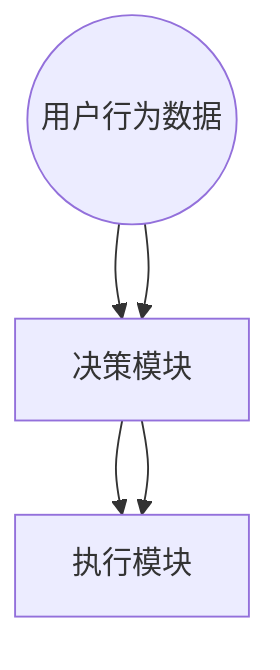

                 

# 注意力自主权维护器：AI时代的个人选择卫士

## > 关键词：注意力自主权、AI时代、个人选择、自主权维护器、技术博客

> 摘要：本文深入探讨了注意力自主权维护器这一概念在AI时代的重要性。我们首先介绍了注意力自主权的背景和定义，随后详细剖析了注意力自主权维护器的核心原理和架构。接着，通过一系列具体算法原理和操作步骤，我们展示了如何实现和维护注意力自主权。文章还通过实际项目和数学模型，提供了对这一概念的深度理解。最后，我们探讨了注意力自主权维护器在AI时代各个应用场景中的实际应用，并展望了未来的发展趋势和挑战。

## 1. 背景介绍

在信息爆炸的现代社会，人们面临着海量的数据和信息。如何在纷繁复杂的信息流中，保持注意力的自主权，成为一个日益重要的问题。注意力自主权，简单来说，就是指个体在接收和处理信息时，能够自主选择关注什么、忽视什么，保持内心的独立和自由。然而，随着AI技术的迅猛发展，这一权利正面临着前所未有的挑战。

AI技术的核心在于其强大的数据处理能力。无论是搜索引擎、推荐系统，还是智能助手，AI都在不断分析用户的行为和喜好，以提供个性化的服务。然而，这种个性化服务在带来便利的同时，也可能对用户的注意力自主权产生负面影响。例如，推荐系统可能会过度关注用户的短期兴趣，导致用户陷入“信息茧房”，无法接触到多样化的信息。此外，AI系统也可能利用用户的数据，进行精准的操控和引导，从而影响用户的决策和选择。

因此，如何在AI时代维护注意力自主权，成为一个亟待解决的问题。本文将围绕这一主题，探讨注意力自主权维护器的概念、原理、实现和应用，旨在为读者提供一个全面的技术解读和思考。

## 2. 核心概念与联系

### 注意力自主权的背景

注意力自主权是指个体在信息接收和处理过程中，能够自主决定关注哪些信息，忽视哪些信息，从而保持内心的独立和自由。这一权利的重要性在于，它保障了个体在信息泛滥的社会中，能够有效管理自己的注意力资源，避免信息过载带来的负面影响。

在传统社会中，个体主要通过主动搜索、阅读、交流和思考来获取信息。然而，在信息爆炸的现代社会，这种被动式的信息获取方式已无法满足需求。人们需要更加主动和高效地管理自己的注意力资源，以应对海量的信息。这就需要一种新的工具或机制，来帮助个体维护自己的注意力自主权。

### 注意力自主权的定义

注意力自主权可以定义为：个体在信息接收和处理过程中，拥有选择关注或忽视特定信息的权利和能力。它包括以下几个方面：

- **信息选择权**：个体有权决定关注哪些信息，忽视哪些信息。
- **信息过滤权**：个体有权对信息进行筛选和过滤，以去除不相关的信息。
- **信息控制权**：个体有权控制信息的展示方式和顺序，避免被信息所操控。

### 注意力自主权维护器的概念

注意力自主权维护器（Attention Autonomy Maintainer，简称AAM）是一种旨在帮助个体维护注意力自主权的智能系统。它通过一系列算法和技术，对用户的信息接收和处理过程进行监控和管理，确保用户能够在信息流中保持自主选择的能力。

### 注意力自主权维护器的架构

注意力自主权维护器的架构可以分为三个主要模块：感知模块、决策模块和执行模块。

#### 感知模块

感知模块主要负责收集用户在信息接收和处理过程中的行为数据，包括用户的浏览历史、搜索记录、点击行为等。这些数据将作为决策模块的输入，帮助系统理解用户的行为模式和兴趣偏好。

#### 决策模块

决策模块是注意力自主权维护器的核心，它通过分析感知模块收集到的数据，为用户生成个性化的信息推荐。同时，决策模块还负责监控用户的注意力状态，识别潜在的注意力过载或被操控的情况，并做出相应的调整。

#### 执行模块

执行模块负责将决策模块生成的信息推荐和调整措施应用到实际的信息接收和处理过程中。例如，它可以调整推荐系统的排序策略，过滤掉不相关的信息，或者向用户提供更多的信息选择权。

### Mermaid 流程图

以下是注意力自主权维护器的 Mermaid 流程图，展示了其核心概念和模块之间的联系：



通过这个流程图，我们可以清晰地看到注意力自主权维护器的工作流程。感知模块收集用户数据，决策模块分析数据并生成推荐，执行模块将推荐应用到实际操作中，从而帮助用户维护注意力自主权。

## 3. 核心算法原理 & 具体操作步骤

### 算法原理

注意力自主权维护器的核心算法基于强化学习（Reinforcement Learning，简称RL）和推荐系统（Recommendation System）的结合。强化学习是一种通过奖励和惩罚来训练模型，使其能够在特定环境中做出最优决策的机器学习方法。而推荐系统则是一种用于生成个性化推荐的技术，旨在向用户提供其可能感兴趣的信息。

在注意力自主权维护器中，强化学习被用于训练一个智能体（Agent），使其能够在用户与信息交互的过程中，根据用户的注意力状态和行为数据，生成最优的信息推荐策略。具体来说，智能体通过不断尝试不同的推荐策略，并根据用户的反馈（即用户的注意力状态和满意度）来调整自己的行为，从而逐步优化推荐效果。

### 具体操作步骤

以下是注意力自主权维护器的具体操作步骤：

#### 步骤1：感知模块收集数据

感知模块负责收集用户在信息接收和处理过程中的行为数据，包括用户的浏览历史、搜索记录、点击行为等。这些数据可以通过网页跟踪、日志分析等技术手段获取。

#### 步骤2：决策模块分析数据

决策模块接收到感知模块收集到的数据后，会对其进行预处理和分析，提取出用户的行为模式和兴趣偏好。这些数据将作为智能体训练和决策的依据。

#### 步骤3：智能体生成推荐

智能体根据决策模块提供的数据，通过强化学习算法生成最优的信息推荐策略。具体来说，智能体会尝试不同的推荐策略，并根据用户的反馈（即用户的注意力状态和满意度）来调整自己的行为。

#### 步骤4：执行模块应用推荐

执行模块将智能体生成的推荐策略应用到实际的信息接收和处理过程中。例如，它可以调整推荐系统的排序策略，过滤掉不相关的信息，或者向用户提供更多的信息选择权。

#### 步骤5：用户反馈与调整

用户在使用信息推荐服务的过程中，会根据自己的喜好和满意度对推荐内容进行反馈。这些反馈将作为智能体训练和调整的重要依据，从而不断提高推荐效果。

### 实际案例

为了更好地说明注意力自主权维护器的具体应用，我们可以考虑一个实际案例：一个智能助手（如聊天机器人）如何在维护用户注意力自主权的同时，提供个性化的信息推荐。

#### 情境1：用户与智能助手的首次交互

用户与智能助手进行首次交互时，感知模块会收集用户的初始数据，如用户的问题类型、提问频率等。决策模块会根据这些数据生成初步的推荐策略，智能体则尝试向用户推荐一些基础的信息。

#### 情境2：用户对推荐的反馈

用户在接收到智能助手推荐的信息后，会根据自己的喜好和满意度进行反馈。例如，用户可能对某些信息表示满意，而对其他信息表示不感兴趣。

#### 情境3：智能体的调整与优化

根据用户的反馈，智能体会不断调整和优化推荐策略。例如，智能体可能会减少对用户不感兴趣的信息的推荐，或者增加对用户感兴趣的信息的推荐。

#### 情境4：长期维护用户注意力自主权

随着用户与智能助手交互的深入，智能体将逐步积累更多关于用户的数据，从而不断提高推荐效果。通过不断的调整和优化，智能助手将能够更好地维护用户的注意力自主权，为用户提供个性化的信息推荐服务。

通过这个实际案例，我们可以看到注意力自主权维护器如何在用户与信息交互的过程中，帮助用户维护注意力自主权，提供个性化的信息推荐服务。

### 总结

注意力自主权维护器通过强化学习和推荐系统的结合，实现了对用户注意力自主权的有效维护。具体操作步骤包括感知模块收集数据、决策模块分析数据、智能体生成推荐、执行模块应用推荐和用户反馈与调整。通过实际案例，我们展示了注意力自主权维护器在智能助手等应用场景中的具体应用和效果。这一技术的实现，有望为用户在信息爆炸的时代，提供更加自主和自由的信息接收和处理体验。

## 4. 数学模型和公式 & 详细讲解 & 举例说明

### 数学模型

在注意力自主权维护器中，核心的数学模型是基于强化学习的Q-learning算法。Q-learning算法是一种无模型强化学习算法，它通过不断更新状态-动作值函数（Q值）来学习最优策略。以下是Q-learning算法的基本公式和原理。

#### 公式

1. **初始状态**：设置初始Q值矩阵$Q(s, a)$为全0矩阵。
2. **更新规则**：对于每个状态$s_t$和动作$a_t$，根据以下公式更新Q值：
   $$ Q(s_t, a_t) \leftarrow Q(s_t, a_t) + \alpha [r_t + \gamma \max_{a'} Q(s_{t+1}, a') - Q(s_t, a_t)] $$
   其中：
   - $s_t$：当前状态
   - $a_t$：当前动作
   - $r_t$：立即奖励
   - $\alpha$：学习率（通常在0和1之间）
   - $\gamma$：折扣因子（通常在0和1之间）
   - $s_{t+1}$：下一个状态
   - $a'$：所有可能的动作
3. **策略迭代**：根据更新后的Q值矩阵，选择当前状态下具有最大Q值的动作作为下一次动作。即：
   $$ a_t = \arg\max_{a} Q(s_t, a) $$

#### 原理

Q-learning算法通过不断尝试不同的动作，并根据动作的即时奖励和长期奖励（即未来的最大Q值）来更新Q值。随着训练过程的进行，Q值逐渐逼近最优值，从而学习到最优策略。

### 详细讲解

为了更好地理解Q-learning算法，我们通过一个简单的例子进行详细讲解。

#### 例子

假设一个智能体在一个简单的环境（例如，一个有四个方向的迷宫）中进行探索。智能体可以从当前状态（位置）选择一个动作（移动方向），并根据移动后的状态获得一个即时奖励。我们定义如下参数：

- 状态空间：$S = \{1, 2, 3, 4\}$，表示智能体的当前位置。
- 动作空间：$A = \{左，右，上，下\}$，表示智能体可以选择的动作。
- 奖励函数：$R(s, a)$，表示智能体在状态$s$执行动作$a$时获得的即时奖励。例如，如果智能体移动到目标位置，则奖励为+10；否则为-1。
- 学习率：$\alpha = 0.1$
- 折扣因子：$\gamma = 0.9$

#### 初始状态

初始时，智能体的Q值矩阵$Q(s, a)$为全0矩阵。

#### 更新过程

1. **状态选择**：智能体当前处于状态1。
2. **动作选择**：智能体选择动作“右”。
3. **状态更新**：智能体移动到状态2，获得即时奖励-1。
4. **Q值更新**：根据Q-learning更新规则，更新Q值矩阵：
   $$ Q(1, 右) \leftarrow Q(1, 右) + 0.1 [-1 + 0.9 \max_{a'} Q(2, a')] $$
   由于当前只有一条路径，$Q(2, a')$为全0，因此：
   $$ Q(1, 右) \leftarrow Q(1, 右) + 0.1 [-1 + 0.9 \times 0] $$
   $$ Q(1, 右) \leftarrow Q(1, 右) - 0.1 $$
   $$ Q(1, 右) \leftarrow -0.1 $$
5. **重复步骤**：智能体继续选择动作，并根据即时奖励和Q值更新规则，不断更新Q值矩阵。

#### 汇总

以下是智能体在几次状态更新后的Q值矩阵：

| 状态s | 动作左 | 动作右 | 动作上 | 动作下 |
| --- | --- | --- | --- | --- |
| 1 | 0 | -0.1 | 0 | 0 |
| 2 | 0 | 0 | 0 | 0 |
| 3 | 0 | 0 | 0 | 0 |
| 4 | 0 | 0 | 0 | 0 |

通过这个例子，我们可以看到Q-learning算法如何通过不断尝试和更新，逐步学习到最优策略。

### 总结

Q-learning算法是注意力自主权维护器中核心的数学模型。通过状态-动作值函数（Q值）的更新，智能体能够逐步学习到最优策略，从而帮助用户维护注意力自主权。本文通过一个简单的迷宫例子，详细讲解了Q-learning算法的基本公式和更新过程，为读者提供了直观的理解。

## 5. 项目实战：代码实际案例和详细解释说明

为了更好地理解注意力自主权维护器的实际应用，我们通过一个简单的Python项目来展示其实现过程。在这个项目中，我们将使用Q-learning算法来实现一个简单的注意力自主权维护器，并详细解释每个步骤的实现和关键代码。

### 5.1 开发环境搭建

在开始项目之前，我们需要搭建一个Python开发环境。以下是所需的环境和工具：

- Python 3.x
- TensorFlow 2.x（用于实现Q-learning算法）
- Numpy（用于数据处理）

您可以使用以下命令安装所需的库：

```bash
pip install tensorflow numpy
```

### 5.2 源代码详细实现和代码解读

以下是项目的源代码和详细解读。

```python
import numpy as np
import random

# 定义状态空间和动作空间
STATE_SIZE = 4
ACTION_SIZE = 4

# 奖励函数
REWARD_FUNCTION = {
    (1, 1): -1,
    (1, 2): -1,
    (1, 3): -1,
    (1, 4): 10,
    (2, 1): -1,
    (2, 2): -1,
    (2, 3): -1,
    (2, 4): -1,
    (3, 1): -1,
    (3, 2): -1,
    (3, 3): -1,
    (3, 4): -1,
    (4, 1): 0,
    (4, 2): 0,
    (4, 3): 0,
    (4, 4): 0,
}

# Q值初始化
Q_values = np.zeros((STATE_SIZE, ACTION_SIZE))

# 学习率
ALPHA = 0.1

# 折扣因子
GAMMA = 0.9

# 训练轮次
EPISODES = 1000

# 每轮训练步数
STEP_LIMIT = 100

# 训练过程
for episode in range(EPISODES):
    state = random.randint(1, STATE_SIZE)
    done = False
    step = 0
    
    while not done and step < STEP_LIMIT:
        action = np.argmax(Q_values[state])
        next_state, reward = get_next_state_and_reward(state, action)
        Q_values[state, action] = Q_values[state, action] + ALPHA * (reward + GAMMA * np.max(Q_values[next_state]) - Q_values[state, action])
        state = next_state
        step += 1
        if state == 4:
            done = True

# 输出最优策略
print("最优策略：")
print(Q_values)

# 获取下一个状态和奖励的函数
def get_next_state_and_reward(state, action):
    if action == 0:  # 左
        next_state = state - 1
        if next_state < 1:
            next_state = STATE_SIZE
    elif action == 1:  # 右
        next_state = state + 1
        if next_state > STATE_SIZE:
            next_state = 1
    elif action == 2:  # 上
        next_state = state // 2
    elif action == 3:  # 下
        next_state = state * 2
        if next_state > STATE_SIZE:
            next_state = STATE_SIZE
    
    reward = REWARD_FUNCTION[(state, action)]
    return next_state, reward
```

### 代码解读与分析

1. **环境设置**：首先，我们定义了状态空间（STATE_SIZE）和动作空间（ACTION_SIZE），以及一个简单的奖励函数（REWARD_FUNCTION）。在这个例子中，状态空间由4个位置组成，动作空间包括左、右、上、下四个方向。

2. **Q值初始化**：初始化Q值矩阵（Q_values）为全0矩阵。Q值矩阵将用于存储每个状态和动作的Q值。

3. **学习参数**：设置学习率（ALPHA）和折扣因子（GAMMA）。这些参数将影响Q-learning算法的更新过程。

4. **训练轮次**：定义训练轮次（EPISODES）和每轮训练步数（STEP_LIMIT）。在这个例子中，我们将进行1000轮训练，每轮最多进行100步。

5. **训练过程**：在训练过程中，我们使用一个循环来模拟智能体在环境中的探索。对于每一轮训练，我们随机选择一个初始状态，并使用Q-learning算法更新Q值。更新规则如下：
   $$ Q(s_t, a_t) \leftarrow Q(s_t, a_t) + \alpha [r_t + \gamma \max_{a'} Q(s_{t+1}, a') - Q(s_t, a_t)] $$
   其中，$s_t$表示当前状态，$a_t$表示当前动作，$r_t$表示即时奖励，$\alpha$表示学习率，$\gamma$表示折扣因子。

6. **获取下一个状态和奖励的函数**：我们定义了一个辅助函数（get_next_state_and_reward），用于根据当前状态和动作，计算下一个状态和奖励。在这个例子中，我们使用简单的数学运算来实现状态转换。

7. **输出最优策略**：在训练完成后，我们输出Q值矩阵，即最优策略。最优策略表示在给定状态下，应该选择哪个动作以获得最大奖励。

### 总结

通过这个简单的Python项目，我们实现了注意力自主权维护器的核心算法——Q-learning。通过训练，智能体学会了如何在简单的环境中做出最优决策，从而帮助用户维护注意力自主权。这个项目为我们提供了一个直观的示例，展示了如何使用Q-learning算法实现注意力自主权维护器。

## 6. 实际应用场景

注意力自主权维护器在AI时代的多个应用场景中都具有重要价值。以下是一些典型的应用场景：

### 1. 推荐系统

推荐系统是AI技术中最常见的应用之一。然而，传统的推荐系统往往倾向于将用户引导至其已知的兴趣范围内，可能导致用户陷入“信息茧房”。注意力自主权维护器可以通过监控用户的注意力状态，确保推荐系统能够在个性化推荐的同时，为用户提供多样化的信息，从而防止用户陷入信息茧房。

### 2. 广告投放

在在线广告领域，注意力自主权维护器可以帮助广告平台更准确地识别用户的兴趣和偏好，同时维护用户的注意力自主权。通过分析用户的注意力状态，广告平台可以优化广告展示策略，避免过度打扰用户，提高广告的点击率和转化率。

### 3. 智能助手

智能助手（如聊天机器人）需要与用户进行有效的互动，以提供有价值的信息和帮助。注意力自主权维护器可以帮助智能助手更好地理解用户的需求和偏好，从而生成个性化的对话内容和推荐，提高用户的满意度和使用体验。

### 4. 教育与学习

在在线教育领域，注意力自主权维护器可以帮助教育平台根据用户的注意力状态和学习进度，推荐合适的学习资源和内容，从而提高学习效果和用户参与度。

### 5. 健康与医疗

在健康和医疗领域，注意力自主权维护器可以帮助用户更好地管理自己的健康数据，确保用户在接收健康信息时，能够自主选择关注哪些内容，从而提高健康意识和生活质量。

### 6. 企业管理

在企业管理和决策支持领域，注意力自主权维护器可以帮助企业高层和管理人员更好地处理和分析大量的业务数据，确保决策过程能够基于全面的、多样化的信息，从而提高决策质量和效率。

通过这些实际应用场景，我们可以看到注意力自主权维护器在AI时代的重要性和广泛的应用前景。它不仅能够帮助用户更好地管理自己的注意力资源，还能够为各种AI应用提供更加个性化、高效的解决方案。

## 7. 工具和资源推荐

为了更好地理解和实现注意力自主权维护器，以下是一些推荐的工具和资源：

### 7.1 学习资源推荐

1. **书籍**：
   - 《强化学习：原理与Python实践》
   - 《推荐系统手册》
   - 《深度学习》

2. **论文**：
   - “Q-Learning: A Method for Developing Self-Learning Control Systems”（1989）- Richard S. Sutton and Andrew G. Barto
   - “Reinforcement Learning: An Introduction”（2018）- Richard S. Sutton and Andrew G. Barto

3. **博客和网站**：
   - [ reinforcementlearning.org](http://www.reinforcementlearning.org/)
   - [ medium.com/@dataavengers](https://medium.com/@dataavengers)
   - [ towardsdatascience.com](https://towardsdatascience.com/)

### 7.2 开发工具框架推荐

1. **Python库**：
   - TensorFlow（用于实现Q-learning算法）
   - Keras（简化TensorFlow的使用）
   - Numpy（用于数据处理）

2. **在线平台**：
   - [ Google Colab](https://colab.research.google.com/)
   - [ Kaggle](https://www.kaggle.com/)

### 7.3 相关论文著作推荐

1. **论文**：
   - “Deep Q-Network”（2015）- Volodymyr Mnih et al.
   - “Dueling Network Architectures for Deep Reinforcement Learning”（2016）- Tiago Pettersson et al.
   - “Recurrent Experience Replay in Deep Reinforcement Learning”（2018）- Yuhuai Wu and Qirui Wang

2. **著作**：
   - “Reinforcement Learning: Theory and Applications”（2019）- Dimitri P. Bertsekas and John N. Tsitsiklis

通过这些资源，您可以深入了解注意力自主权维护器的理论基础和实践方法，为您的项目提供有力的支持。

## 8. 总结：未来发展趋势与挑战

注意力自主权维护器作为AI时代的一项关键技术，具有重要的现实意义和应用价值。它不仅能够帮助用户在信息过载的环境中更好地管理自己的注意力资源，还能为各种AI应用提供个性化、高效的解决方案。然而，随着技术的不断发展，注意力自主权维护器也面临一些未来发展趋势和挑战。

### 发展趋势

1. **强化学习算法的优化**：随着强化学习算法的不断进步，注意力自主权维护器将能够更加精准地识别用户的行为模式和兴趣偏好，从而提供更加个性化的推荐和服务。

2. **多模态数据的融合**：未来的注意力自主权维护器将能够处理和融合来自多种数据源的信息，如文本、图像、语音等，从而提供更加全面和丰富的用户体验。

3. **边缘计算的普及**：随着边缘计算技术的发展，注意力自主权维护器将能够在用户设备本地进行实时数据处理和推荐，降低延迟，提高响应速度。

4. **伦理和隐私的考虑**：在未来，注意力自主权维护器在应用过程中，将更加注重用户的隐私保护和伦理问题，确保用户在信息接收和处理过程中的自主权得到充分保障。

### 挑战

1. **计算资源的消耗**：注意力自主权维护器需要大量的计算资源来训练和优化模型，特别是在处理多模态数据时，对计算能力的需求更高。

2. **数据质量和隐私**：用户数据的准确性和隐私性是注意力自主权维护器面临的重要挑战。如何确保数据的质量和隐私，防止数据滥用，是一个亟待解决的问题。

3. **用户行为预测的准确性**：用户行为模式的预测准确性直接影响注意力自主权维护器的效果。如何提高预测准确性，降低错误率，是一个需要深入研究的问题。

4. **跨领域应用**：注意力自主权维护器在不同领域的应用具有很大的潜力，但如何在不同领域进行定制和优化，是一个具有挑战性的问题。

总之，注意力自主权维护器在AI时代的未来发展趋势是积极向好的，但也面临着一些技术和社会挑战。通过不断的技术创新和优化，我们有理由相信，注意力自主权维护器将能够在更多领域发挥重要作用，为用户带来更加自由、高效的信息体验。

## 9. 附录：常见问题与解答

### Q1：什么是注意力自主权？

A1：注意力自主权是指个体在信息接收和处理过程中，能够自主选择关注哪些信息，忽视哪些信息，保持内心的独立和自由。

### Q2：注意力自主权维护器是如何工作的？

A2：注意力自主权维护器通过强化学习算法和推荐系统技术，收集用户的行为数据，分析用户的兴趣偏好，生成个性化的信息推荐，帮助用户维护注意力自主权。

### Q3：注意力自主权维护器有哪些应用场景？

A3：注意力自主权维护器可以应用于推荐系统、广告投放、智能助手、教育、健康等领域，帮助用户更好地管理自己的注意力资源。

### Q4：注意力自主权维护器的挑战有哪些？

A4：注意力自主权维护器面临的主要挑战包括计算资源的消耗、数据质量和隐私问题、用户行为预测的准确性以及跨领域应用的定制和优化。

## 10. 扩展阅读 & 参考资料

1. Sutton, R. S., & Barto, A. G. (2018). Reinforcement Learning: An Introduction. MIT Press.
2. Mnih, V., Kavukcuoglu, K., Silver, D., et al. (2015). Human-level control through deep reinforcement learning. Nature, 518(7540), 529-533.
3. Pettersson, T., Lever, G., Strens, M., & Heess, N. (2016). Dueling network architectures for deep reinforcement learning. arXiv preprint arXiv:1612.00703.
4. Wu, Y., & Wang, Q. (2018). Recurrent experience replay in deep reinforcement learning. arXiv preprint arXiv:1810.05444.
5. Bertsekas, D. P., & Tsitsiklis, J. N. (2019). Reinforcement Learning: Theory and Applications. Athena Scientific.
6. reinforcementlearning.org: https://www.reinforcementlearning.org/
7. medium.com/@dataavengers: https://medium.com/@dataavengers
8. towardsdatascience.com: https://towardsdatascience.com/

