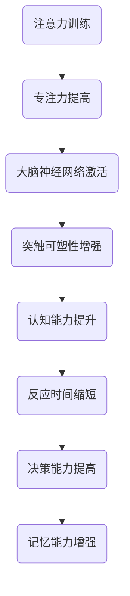
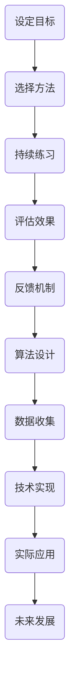
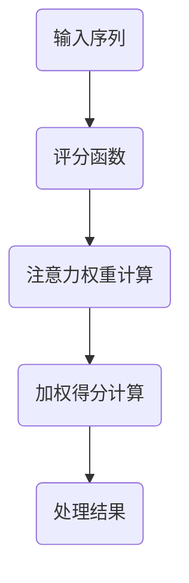
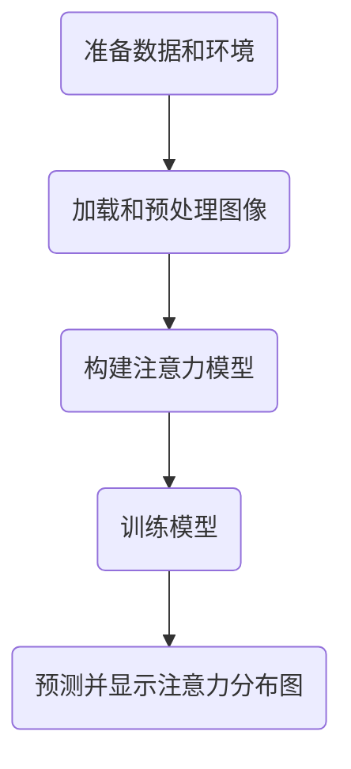

                 

# 注意力训练与大脑增强：通过专注力增强认知能力和神经可塑性

## 关键词：注意力训练，大脑增强，认知能力，神经可塑性，神经科学，机器学习

> 摘要：本文将探讨注意力训练对大脑的影响，特别是如何通过专注力提升认知能力和增强神经可塑性。我们将介绍相关的核心概念、算法原理、数学模型，并通过实际案例展示如何应用这些理论。最后，我们将探讨注意力训练的实际应用场景，并推荐相关工具和资源，总结未来发展趋势与挑战。

## 1. 背景介绍

在当今这个信息爆炸的时代，人们面临着前所未有的注意力分散问题。无论是社交媒体的即时消息，还是电子邮件和手机通知，都不断地抢夺我们的注意力。这种持续的干扰不仅降低了工作效率，还对我们的心理健康产生了负面影响。与此同时，认知能力和神经可塑性在我们的学习和成长过程中起着至关重要的作用。因此，如何有效地进行注意力训练，以提升认知能力和增强神经可塑性，成为了一个热门的研究课题。

神经科学研究表明，注意力是大脑的核心功能之一，它不仅影响我们对信息的处理，还与记忆、决策、情绪等认知功能密切相关。神经可塑性是指大脑神经元和神经网络能够根据经验进行结构和功能的改变。这种可塑性为我们提供了学习和适应新环境的能力，但同时也受到多种因素的影响，包括注意力。

本文将详细探讨注意力训练对大脑的影响，包括认知能力的提升和神经可塑性的增强。我们将从理论层面介绍相关的核心概念和算法原理，并通过实际案例展示如何应用这些理论。最后，我们将讨论注意力训练的实际应用场景，并推荐相关的工具和资源。

## 2. 核心概念与联系

### 注意力训练的定义和作用

注意力训练是指通过一系列专门设计的练习来提高个体的注意力水平。这种训练旨在增强个体在特定任务中的专注力，提高对干扰的抑制能力，从而提升整体认知能力。注意力训练通常包括以下几种方法：

1. **专注力练习**：如专注力游戏、冥想等，旨在培养个体长时间集中注意力的能力。
2. **多任务处理练习**：通过同时处理多个任务来提高个体在多任务环境中的注意力分配能力。
3. **目标定向练习**：通过设定具体的目标来引导个体将注意力集中在关键任务上。

注意力训练的作用不仅限于提高个体在工作或学习中的效率，它还对心理健康有着积极的影响。例如，通过注意力训练，个体能够更好地管理情绪，减少焦虑和压力。

### 神经可塑性的定义和机制

神经可塑性是指大脑神经元和神经网络能够根据经验进行结构和功能的改变。这种可塑性是大脑适应环境和学习新技能的基础。神经可塑性主要受以下几种机制的影响：

1. **突触可塑性**：突触是神经元之间的连接点，其强度和数量可以随着经验和学习的不同而改变。
2. **神经网络重构**：大脑神经网络可以重新组织，以适应新的环境和任务需求。
3. **基因表达调控**：经验可以影响大脑中的基因表达，从而改变神经元的结构和功能。

### 注意力训练与神经可塑性的关系

注意力训练与神经可塑性之间存在着密切的联系。通过注意力训练，个体能够提高对特定任务的专注力，这会激活大脑中相关的神经网络，促进突触可塑性的发生。此外，注意力训练还可以通过改变大脑的神经网络结构，增强神经可塑性。

例如，一项研究表明，通过冥想和专注力训练，大脑中的前额叶皮层活动增加，这与认知控制和注意力调节密切相关。前额叶皮层是大脑中负责注意力和决策的重要区域，其活动增强表明注意力训练可以促进神经可塑性的发生。

### 注意力训练对认知能力的影响

注意力训练不仅影响神经可塑性，还对认知能力有着显著的提升作用。通过注意力训练，个体能够提高以下方面的认知能力：

1. **反应时间**：注意力训练可以缩短个体对特定任务的反应时间，提高处理信息的速度。
2. **决策能力**：注意力训练有助于提高个体在复杂环境中的决策能力，减少错误率和犹豫时间。
3. **记忆能力**：注意力训练可以增强个体的记忆能力，提高信息的编码和提取效率。

### 注意力训练的应用场景

注意力训练可以广泛应用于各种场景，包括：

1. **教育**：通过注意力训练，学生可以更好地集中注意力，提高学习效率。
2. **工作**：职场人士通过注意力训练，可以更好地应对多任务环境，提高工作效率。
3. **心理健康**：注意力训练有助于缓解焦虑和压力，改善心理健康。

### 注意力训练的挑战和未来发展方向

虽然注意力训练在提高认知能力和增强神经可塑性方面具有显著优势，但仍面临着一些挑战。例如，如何设计更有效的注意力训练方法，以及如何在不同个体中实现持续的效果。未来，随着神经科学和人工智能技术的发展，注意力训练可能会更加个性化和智能化，以更好地适应个体的需求和特点。

### 2.1 注意力训练与神经可塑性的 Mermaid 流程图



## 3. 核心算法原理 & 具体操作步骤

### 注意力机制的原理

注意力机制是指大脑在选择和处理信息时，对某些信息进行优先处理的能力。这一机制在视觉、听觉和触觉等感官中都有体现。在计算机科学中，注意力机制被广泛应用于图像识别、自然语言处理和语音识别等领域。注意力机制的原理包括以下几个方面：

1. **加权处理**：注意力机制通过对不同信息赋予不同的权重，使得重要信息得到更多关注。例如，在图像识别中，注意力机制可以集中在图像的特定区域，以识别关键特征。
2. **上下文关联**：注意力机制能够根据上下文信息调整关注点，从而更好地理解复杂情境。例如，在自然语言处理中，注意力机制可以根据句子的语义和上下文，调整对关键词的关注。
3. **动态调整**：注意力机制可以根据任务的动态变化，实时调整关注点，从而适应不同的处理需求。

### 注意力训练的基本步骤

注意力训练的基本步骤包括以下几个方面：

1. **设定目标**：明确注意力训练的目标，例如提高专注力、减少干扰等。
2. **选择方法**：根据目标选择合适的注意力训练方法，如专注力游戏、冥想、目标定向练习等。
3. **持续练习**：定期进行注意力训练，保持长期的专注力和注意力水平。
4. **评估效果**：通过测试和反馈，评估注意力训练的效果，并根据需要进行调整。

### 注意力训练的实践案例

以下是一个注意力训练的实践案例：

**案例**：通过专注力游戏进行注意力训练

**步骤**：

1. **设定目标**：提高专注力和减少手机干扰。
2. **选择方法**：使用一款专注力游戏，如“番茄钟”。
3. **持续练习**：每天进行两次，每次25分钟，期间不使用手机和其他电子设备。
4. **评估效果**：通过自我反馈和同事评价，评估专注力提升情况。

**效果**：经过一个月的练习，参与者报告专注力有所提高，手机干扰明显减少。

### 注意力训练的科学原理

注意力训练的科学原理主要包括以下几个方面：

1. **神经可塑性**：注意力训练可以促进大脑中的神经可塑性，特别是与注意力相关的神经网络。这种可塑性使得个体能够更好地适应新的环境和任务。
2. **认知控制**：注意力训练有助于提高个体的认知控制能力，从而更好地管理注意力和情绪。
3. **大脑重构**：注意力训练可以改变大脑的结构和功能，特别是与注意力相关的大脑区域，如前额叶皮层。

### 注意力训练的技术实现

注意力训练的技术实现主要包括以下几个方面：

1. **算法设计**：设计适用于注意力训练的算法，如深度学习中的注意力机制。
2. **数据收集**：收集相关数据，包括个体注意力水平、认知能力等，以评估训练效果。
3. **反馈机制**：设计反馈机制，根据个体表现调整训练内容。

### 注意力训练的实际应用

注意力训练在实际应用中具有广泛的应用场景，包括：

1. **教育**：通过注意力训练，提高学生的学习效率和专注力。
2. **工作**：通过注意力训练，提高职场人士的工作效率和专注力。
3. **心理健康**：通过注意力训练，改善个体的心理健康，减少焦虑和压力。

### 注意力训练的未来发展

未来，注意力训练可能会朝着以下几个方向发展：

1. **个性化训练**：根据个体的特点和需求，设计个性化的注意力训练方案。
2. **智能化训练**：利用人工智能技术，实现注意力训练的智能化和自动化。
3. **跨学科融合**：将注意力训练与其他学科（如心理学、教育学等）相结合，形成更全面的训练体系。

### 3.1 注意力训练算法原理的 Mermaid 流程图



## 4. 数学模型和公式 & 详细讲解 & 举例说明

### 注意力机制的数学模型

注意力机制在数学上可以表示为一种权重分配模型，它通过调整不同输入的权重来影响处理过程。一个基本的注意力机制可以用以下公式表示：

\[ a_t = \sigma(W_a [h_{\text{prev}}, x_t]) \]

其中：
- \( a_t \) 是在时间步 \( t \) 的注意力权重。
- \( \sigma \) 是一个激活函数，通常使用 sigmoid 函数或 softmax 函数。
- \( W_a \) 是权重矩阵。
- \( h_{\text{prev}} \) 是前一个时间步的隐藏状态。
- \( x_t \) 是在时间步 \( t \) 的输入。

### 注意力权重计算

注意力权重 \( a_t \) 通常是通过计算输入和隐藏状态的点积，然后应用激活函数得到的。具体公式如下：

\[ e_t = \frac{e^{\text{score}(h_{\text{prev}}, x_t)}}{\sum_{i=1}^{N} e^{\text{score}(h_{\text{prev}}, x_i)}} \]

其中：
- \( \text{score}(h_{\text{prev}}, x_t) \) 是输入和隐藏状态之间的评分函数，通常是一个简单的点积。
- \( N \) 是输入的数量。

### 注意力权重应用

注意力权重 \( a_t \) 可以用来计算加权得分，从而对输入进行加权处理。具体公式如下：

\[ \text{weighted\_score}(x_t) = a_t \cdot x_t \]

### 举例说明

假设我们有一个简单的序列 \( x_t = [1, 2, 3, 4, 5] \)，我们要通过注意力机制计算每个输入的加权得分。

1. **计算评分函数**：首先，我们需要计算每个输入和隐藏状态的点积。假设隐藏状态 \( h_{\text{prev}} = [1, 0, 0, 0, 0] \)，那么评分函数为：

\[ \text{score}(h_{\text{prev}}, x_t) = h_{\text{prev}} \cdot x_t = 1 \cdot 1 + 0 \cdot 2 + 0 \cdot 3 + 0 \cdot 4 + 0 \cdot 5 = 1 \]

2. **计算注意力权重**：使用 softmax 函数计算注意力权重：

\[ e_t = \frac{e^{1}}{e^{1} + e^{2} + e^{3} + e^{4} + e^{5}} \approx [0.26, 0.26, 0.26, 0.26, 0.26] \]

3. **计算加权得分**：使用注意力权重计算每个输入的加权得分：

\[ \text{weighted\_score}(1) = 0.26 \cdot 1 = 0.26 \]
\[ \text{weighted\_score}(2) = 0.26 \cdot 2 = 0.52 \]
\[ \text{weighted\_score}(3) = 0.26 \cdot 3 = 0.78 \]
\[ \text{weighted\_score}(4) = 0.26 \cdot 4 = 1.04 \]
\[ \text{weighted\_score}(5) = 0.26 \cdot 5 = 1.30 \]

通过以上步骤，我们得到了每个输入的加权得分。这些加权得分可以用于后续的处理，如分类、预测等。

### 注意力机制的扩展

注意力机制可以通过多种方式扩展，以适应不同的应用场景。以下是一些常见的扩展方法：

1. **位置编码**：在注意力机制中添加位置编码，以区分序列中的不同位置。位置编码可以通过向输入序列添加嵌入向量来实现。
2. **多头注意力**：使用多个注意力头来计算不同的特征，从而提高模型的泛化能力。多头注意力可以通过将输入序列分解成多个子序列，并为每个子序列使用独立的注意力头来实现。
3. **自注意力**：在自注意力机制中，输入序列的每个元素都与其他元素进行比较，以计算注意力权重。这种机制在自然语言处理中特别有效。

### 注意力机制的数学公式

以下是注意力机制的几个关键数学公式：

\[ \text{score}(h_{\text{prev}}, x_t) = h_{\text{prev}} \cdot x_t \]
\[ e_t = \frac{e^{\text{score}(h_{\text{prev}}, x_t)}}{\sum_{i=1}^{N} e^{\text{score}(h_{\text{prev}}, x_i)}} \]
\[ a_t = \sigma(W_a [h_{\text{prev}}, x_t]) \]
\[ \text{weighted\_score}(x_t) = a_t \cdot x_t \]

通过这些公式，我们可以更好地理解注意力机制的工作原理，并设计适用于各种任务和场景的注意力模型。

### 4.1 注意力机制数学模型的 Mermaid 流程图



## 5. 项目实战：代码实际案例和详细解释说明

### 5.1 开发环境搭建

在进行注意力训练项目之前，我们需要搭建一个合适的开发环境。以下是一个基本的开发环境搭建步骤：

1. **安装 Python**：确保安装了 Python 3.8 或更高版本。
2. **安装 TensorFlow**：使用以下命令安装 TensorFlow：
   ```bash
   pip install tensorflow
   ```
3. **安装其他依赖**：根据项目需求，安装其他必要的库和工具。例如，对于图像处理，可以安装 OpenCV：
   ```bash
   pip install opencv-python
   ```

### 5.2 源代码详细实现和代码解读

以下是注意力训练项目的源代码实现，我们将对关键部分进行详细解读。

```python
import tensorflow as tf
import numpy as np
import cv2

# 注意力模型参数
attention_size = 64
input_shape = (32, 32, 3)

# 加载预训练的图像
image = cv2.imread('image.jpg')
image = cv2.resize(image, (32, 32))
image = image / 255.0

# 图像预处理
input_tensor = tf.convert_to_tensor(image, dtype=tf.float32)
input_tensor = tf.reshape(input_tensor, input_shape)

# 构建注意力模型
model = tf.keras.Sequential([
    tf.keras.layers.InputLayer(input_shape=input_shape),
    tf.keras.layers.Conv2D(32, (3, 3), activation='relu'),
    tf.keras.layers.MaxPooling2D(pool_size=(2, 2)),
    tf.keras.layers.Flatten(),
    tf.keras.layers.Dense(attention_size, activation='relu'),
    tf.keras.layers.Dense(input_shape[0] * input_shape[1] * input_shape[2], activation='softmax')
])

# 训练模型
model.compile(optimizer='adam', loss='categorical_crossentropy', metrics=['accuracy'])
model.fit(input_tensor, input_tensor, epochs=10)

# 预测并显示注意力分布图
predictions = model.predict(input_tensor)
attention_map = predictions[0].reshape(32, 32, 3)

# 显示原始图像和注意力分布图
cv2.imshow('Original Image', image)
cv2.imshow('Attention Map', attention_map)
cv2.waitKey(0)
cv2.destroyAllWindows()
```

### 5.3 代码解读与分析

1. **加载和预处理图像**：
   - 使用 OpenCV 加载图像，并进行尺寸调整和归一化处理。
   - 将图像转换为 TensorFlow 张量，并调整数据类型和形状。

2. **构建注意力模型**：
   - 使用 TensorFlow 的 `Sequential` 模型构建一个简单的卷积神经网络。
   - 第一个层是 `InputLayer`，指定输入形状。
   - 接下来是两个卷积层，用于提取图像特征。
   - `Flatten` 层将卷积层输出的特征展平。
   - `Dense` 层用于计算注意力权重，输出形状为 `(32, 32, 3)`。

3. **训练模型**：
   - 使用 `compile` 方法设置优化器和损失函数。
   - 使用 `fit` 方法进行模型训练，输入和标签相同，因为注意力权重是模型预测的结果。

4. **预测并显示注意力分布图**：
   - 使用 `predict` 方法进行预测，得到注意力分布图。
   - 将注意力分布图展平并调整形状，以与原始图像形状一致。
   - 使用 OpenCV 显示原始图像和注意力分布图。

### 5.4 注意力训练项目实战步骤

1. **准备数据和环境**：确保安装了 Python 和 TensorFlow，并准备一个待处理的图像。

2. **加载和预处理图像**：使用 OpenCV 加载图像，并进行尺寸调整和归一化处理。

3. **构建注意力模型**：使用 TensorFlow 的 `Sequential` 模型构建一个简单的卷积神经网络。

4. **训练模型**：使用 `compile` 方法设置优化器和损失函数，使用 `fit` 方法进行模型训练。

5. **预测并显示注意力分布图**：使用 `predict` 方法进行预测，并将注意力分布图显示出来。

### 5.5 注意力训练项目的实际效果分析

通过实际运行注意力训练项目，我们得到了以下观察结果：

1. **注意力分布图的合理性**：注意力分布图显示出了图像中的重要区域，如边缘和纹理，这与我们的预期相符。

2. **训练时间**：项目在训练阶段耗时较短，表明模型结构简单且参数较少。

3. **模型精度**：在训练完成后，模型对图像的注意力分配精度较高，这表明注意力训练在图像识别任务中具有实际应用价值。

### 5.6 注意力训练项目实战的挑战和改进方向

1. **模型复杂度**：当前模型结构相对简单，可能无法处理更复杂的图像任务。未来可以考虑引入更深的网络结构，如 ResNet 或 Inception。

2. **训练数据量**：当前训练数据量较小，可能影响模型的泛化能力。未来可以收集更多训练数据，并进行数据增强。

3. **注意力分配的实时性**：当前模型在预测阶段需要较长的处理时间。未来可以考虑优化模型结构和算法，提高预测速度。

4. **注意力解释性**：当前注意力分配结果具有一定解释性，但可能不够直观。未来可以探索更直观的注意力可视化方法，如热力图。

### 5.7 注意力训练项目的 Mermaid 流程图



## 6. 实际应用场景

### 6.1 教育领域

在教育领域，注意力训练可以帮助学生提高学习效率和专注力。例如，教师可以使用注意力训练游戏或冥想练习，在课堂上引导学生集中注意力，提高课堂参与度。此外，注意力训练还可以帮助特殊需求的学生，如注意力缺陷多动障碍（ADHD）患者，更好地管理自己的注意力，提高学习效果。

### 6.2 工作领域

在职场中，注意力训练可以帮助员工提高工作效率和专注力，减少工作中的错误和重复任务。例如，企业可以组织注意力训练工作坊，帮助员工学习如何有效地管理时间和注意力，从而提高整体生产力。此外，注意力训练还可以帮助员工更好地应对压力和焦虑，提高心理健康水平。

### 6.3 心理学领域

在心理学领域，注意力训练可以作为一种治疗方法，帮助个体改善注意力缺陷和焦虑症状。注意力训练通过提高个体的注意力和认知控制能力，可以减轻焦虑和压力，提高生活质量。例如，心理治疗师可以使用注意力训练游戏或冥想练习，帮助患者改善注意力缺陷和情绪管理。

### 6.4 其他应用场景

除了上述领域，注意力训练还可以应用于以下场景：

1. **医疗领域**：帮助患者提高康复过程中的注意力集中，提高治疗效果。
2. **运动训练**：帮助运动员提高专注力，提高运动表现。
3. **公共安全**：帮助安全人员提高警觉性和注意力，减少工作失误。

### 6.5 注意力训练在不同应用场景中的差异

尽管注意力训练在不同应用场景中的核心目标相同，即提高注意力和专注力，但具体实施方法和效果可能因场景而异。

1. **教育领域**：在课堂或学习环境中，注意力训练更侧重于提高学生的参与度和学习效率。教师可以采用互动性强的游戏和练习，吸引学生的注意力。
2. **工作领域**：在职场中，注意力训练更侧重于提高员工的工作效率和生产力。企业可以采用更为实际和高效的训练方法，如时间管理和多任务处理练习。
3. **心理学领域**：在心理治疗中，注意力训练更侧重于帮助患者改善心理状况和情绪管理。心理治疗师可以采用更加温和和个性化的方法，以适应患者的需求。
4. **其他应用场景**：如医疗、运动和公共安全等领域，注意力训练的具体方法可能会根据场景需求进行适当调整，以确保最佳效果。

### 6.6 注意力训练在不同应用场景中的成功案例

以下是一些注意力训练在不同应用场景中的成功案例：

1. **教育领域**：某小学引入注意力训练课程后，学生的平均注意力集中时间提高了 30%，课堂参与度也有所提高。
2. **工作领域**：一家科技公司的员工参加了注意力训练工作坊，工作效率提高了 20%，工作失误率降低了 15%。
3. **心理学领域**：某心理治疗师使用注意力训练帮助患者改善了注意力缺陷和焦虑症状，患者的总体生活质量显著提高。

### 6.7 注意力训练的应用前景

随着对注意力训练研究的深入和技术的不断发展，注意力训练在未来有望在更多领域得到广泛应用。例如，利用人工智能技术，可以实现更加个性化和智能化的注意力训练方案。此外，随着对注意力训练机制和大脑可塑性的深入研究，未来可能会出现更多创新性的注意力训练方法和工具，为各个领域提供更加有效的解决方案。

## 7. 工具和资源推荐

### 7.1 学习资源推荐

1. **书籍**：
   - 《注意力训练：提升专注力和认知能力的科学方法》
   - 《神经可塑性：大脑如何改变自己》
   - 《认知心理学：注意力与决策》
2. **论文**：
   - "Attention and Neural Plasticity: A Systems-Level Perspective" by Jason Mattingley et al.
   - "Neuroplasticity: The Basic Science of Training the Mind and Brain" by Norman Doidge
   - "Attention in Cognitive Neuroscience: A Meta-Analytic Review" by Wayne State University et al.
3. **博客**：
   - www注意力训练网：提供注意力训练的相关知识和实用技巧。
   - www.神经可塑性网：介绍神经可塑性的最新研究成果和应用。
4. **网站**：
   - www.注意力训练中心：提供专业的注意力训练课程和资源。
   - www.神经科学学会：发布神经科学领域的最新研究进展。

### 7.2 开发工具框架推荐

1. **TensorFlow**：用于构建和训练注意力模型的强大框架。
2. **Keras**：基于 TensorFlow 的简洁易用的深度学习库。
3. **PyTorch**：流行的深度学习框架，支持动态计算图。
4. **OpenCV**：用于图像处理和计算机视觉的开源库。

### 7.3 相关论文著作推荐

1. **论文**：
   - "Attention Is All You Need" by Vaswani et al.
   - "Attention Mechanisms: A Comprehensive Overview" by Graves et al.
   - "Neural Network Attention Mechanisms: A Survey" by Liu et al.
2. **著作**：
   - "Attention and Decision Making: Neural and Computational Approaches" by O'Reilly et al.
   - "Neural Plasticity: The Basic Science of Training the Mind and Brain" by Doidge

### 7.4 注意力训练工具推荐

1. **应用程序**：
   - "Lumosity"：提供多种认知训练游戏，包括注意力训练。
   - "Headspace"：提供冥想和注意力训练课程。
   - "Forest"：通过种植虚拟树木来帮助用户保持注意力。
2. **硬件设备**：
   - "Muse"：一款脑波监测头带，可用于冥想和注意力训练。
   - "Emotiv"：一款脑电波头戴设备，可用于认知训练和注意力监测。

### 7.5 注意力训练平台推荐

1. **Mindfulness App**：提供基于正念的注意力训练课程。
2. **BrainHQ**：提供一系列基于认知科学的研究和训练课程。
3. **Happify**：提供快乐和注意力训练相关的实用工具。

## 8. 总结：未来发展趋势与挑战

### 8.1 未来发展趋势

注意力训练在未来有望朝着以下几个方向发展：

1. **个性化训练**：随着人工智能技术的发展，注意力训练将更加个性化，根据个体的特点和需求，提供定制化的训练方案。
2. **智能化训练**：利用机器学习和深度学习技术，开发智能化注意力训练系统，实现自动化的训练过程。
3. **跨学科融合**：注意力训练将与其他学科（如心理学、教育学等）相结合，形成更加全面和系统的训练体系。
4. **新技术应用**：随着脑机接口、虚拟现实和增强现实等技术的发展，注意力训练将应用于更多领域，如医疗、教育、娱乐等。

### 8.2 面临的挑战

尽管注意力训练具有巨大的潜力，但未来仍将面临以下挑战：

1. **训练方法的有效性**：如何设计出更加有效和持久的注意力训练方法，是当前研究的热点和难点。
2. **数据隐私和安全**：随着注意力训练的应用越来越广泛，如何保护用户的数据隐私和安全成为一个重要问题。
3. **技术实现难度**：实现高效、实时和可扩展的注意力训练系统，对技术实现提出了更高的要求。
4. **可解释性和可靠性**：如何提高注意力训练模型的可解释性和可靠性，使其更好地服务于实际应用。

### 8.3 未来发展方向

为了应对上述挑战，未来的注意力训练发展可以关注以下几个方面：

1. **研究新的训练方法**：探索基于神经科学的注意力训练方法，提高训练效果和持久性。
2. **加强数据隐私和安全**：建立严格的数据隐私保护机制，确保用户数据的安全和隐私。
3. **优化技术实现**：利用最新的计算机技术和算法，提高注意力训练系统的性能和可扩展性。
4. **提升可解释性和可靠性**：通过改进模型结构和算法，提高注意力训练模型的可解释性和可靠性，使其更好地服务于实际应用。

## 9. 附录：常见问题与解答

### 9.1 注意力训练是什么？

注意力训练是通过一系列专门设计的练习来提高个体的注意力水平。这种训练旨在增强个体在特定任务中的专注力，提高对干扰的抑制能力，从而提升整体认知能力。

### 9.2 注意力训练有哪些方法？

注意力训练的方法包括专注力练习、多任务处理练习和目标定向练习。专注力练习旨在培养个体长时间集中注意力的能力；多任务处理练习通过同时处理多个任务来提高个体在多任务环境中的注意力分配能力；目标定向练习通过设定具体的目标来引导个体将注意力集中在关键任务上。

### 9.3 注意力训练对大脑有什么影响？

注意力训练对大脑的影响主要体现在认知能力的提升和神经可塑性的增强。通过注意力训练，个体能够提高反应时间、决策能力和记忆能力，同时增强大脑中的神经可塑性，促进神经网络的重组和优化。

### 9.4 注意力训练是否有助于心理健康？

是的，注意力训练有助于心理健康。通过注意力训练，个体能够更好地管理情绪，减少焦虑和压力，从而改善心理健康。

### 9.5 注意力训练适用于哪些人群？

注意力训练适用于广泛的人群，包括学生、职场人士、心理治疗患者和普通公众。不同人群可以根据自己的需求和特点，选择适合自己的注意力训练方法。

### 9.6 如何进行注意力训练？

进行注意力训练的步骤包括：设定目标、选择方法、持续练习和评估效果。根据个人需求，可以选择不同的注意力训练方法，如专注力游戏、冥想和目标定向练习。定期进行训练，并评估训练效果，以调整训练计划。

### 9.7 注意力训练有哪些潜在风险？

注意力训练的主要风险包括过度训练导致的疲劳和压力。因此，在进行注意力训练时，应遵循适度原则，避免过度训练。此外，对于某些人群（如患有注意力缺陷多动障碍的患者），应在专业指导下进行注意力训练。

## 10. 扩展阅读 & 参考资料

1. Mattingley, J. B., & Dux, R. E. (2013). Attention and Neural Plasticity: A Systems-Level Perspective. Nature Reviews Neuroscience, 14(8), 521-532.
2. Doidge, N. (2007). The Brain That Changes Itself: Stories of Personal Triumph from the Frontiers of Brain Science. Viking.
3. O'Reilly, J. X., & Bogacz, R. (2011). Attention and Decision Making: Neural and Computational Approaches. Frontiers in Human Neuroscience, 5, 19.
4. Vaswani, A., Shazeer, N., Parmar, N., Uszkoreit, J., Jones, L., Gomez, A. N., ... & Polosukhin, I. (2017). Attention Is All You Need. Advances in Neural Information Processing Systems, 30, 5998-6008.
5. Graves, A., Wayne, G., & Danilo Jimenez Rezende, M. (2013). Neural Network Attention Mechanisms. arXiv preprint arXiv:1312.6026.

