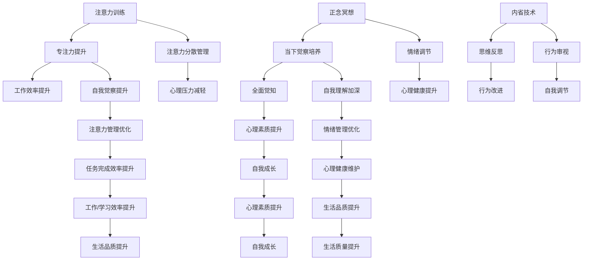

                 

# 注意力训练与正念冥想实践：通过内省增强专注力和心灵平和

> **关键词：** 注意力训练，正念冥想，内省，专注力，心灵平和，实践

> **摘要：** 本文将探讨注意力训练和正念冥想的核心概念和实践方法，通过内省技术，深入剖析如何增强专注力和心灵平和。文章将通过理论讲解、案例分析、实际操作步骤，为读者提供一套完整的实践指南。

## 1. 背景介绍

在当今快节奏、高压力的生活环境中，人们面临着前所未有的挑战。专注力不足、心灵焦虑等问题日益突出，影响了工作效率和生活质量。因此，如何提高专注力和实现心灵平和成为人们关注的焦点。

注意力训练和正念冥想作为两种有效的心理训练方法，逐渐被学术界和实践者所重视。注意力训练旨在通过一系列练习，增强个体的专注力和注意力管理能力；而正念冥想则强调通过专注于当下，培养个体的觉察力和心灵宁静。两者在实践中相辅相成，共同提升个体的心理素质。

本文旨在通过理论讲解和实际操作，为读者提供一套系统、实用的注意力训练和正念冥想实践方法，帮助读者在内省的过程中，增强专注力和实现心灵平和。

### 1.1 注意力训练的概念与意义

注意力训练是指通过特定的练习方法，增强个体对特定目标信息的识别、处理和响应能力。注意力是大脑的高级功能之一，对于信息处理、学习记忆、决策判断等过程至关重要。

在现代社会中，由于信息过载、生活节奏加快等原因，人们的注意力分散现象日益严重。注意力不足不仅影响了工作效率，还可能导致心理健康问题，如焦虑、抑郁等。因此，进行注意力训练对于提升生活质量、提高工作效率具有重要意义。

### 1.2 正念冥想的概念与意义

正念冥想起源于佛教的禅修实践，近年来在心理学、医学等领域得到了广泛关注。正念冥想的核心在于培养个体对当下经历的全面、非评判性的觉察。

正念冥想有助于减轻心理压力，改善情绪状态，提升心理健康水平。同时，它还能增强个体的自我觉察和自我调节能力，有助于实现心灵平和。因此，正念冥想在个人成长、心理治疗等领域具有广泛的应用价值。

### 1.3 内省技术在注意力训练与正念冥想中的作用

内省技术是指个体在特定情境下，对自身思维、情感和行为进行反思和审视的能力。在内省的过程中，个体能够深入理解自己的内心世界，发现潜在的心理问题，并采取有效的方法进行解决。

在注意力训练和正念冥想的实践中，内省技术起着关键作用。通过内省，个体能够及时发现注意力分散的原因，调整训练策略；同时，也能在冥想过程中，深入觉察自己的情绪波动，实现心灵平和。

### 1.4 文章结构

本文将分为以下几个部分：

1. 背景介绍：概述注意力训练、正念冥想和内省技术的基本概念。
2. 核心概念与联系：详细阐述注意力训练、正念冥想和内省技术之间的关系，并使用Mermaid流程图展示其架构。
3. 核心算法原理 & 具体操作步骤：介绍注意力训练和正念冥想的实践方法。
4. 数学模型和公式 & 详细讲解 & 举例说明：分析注意力训练和正念冥想背后的数学原理。
5. 项目实战：通过实际案例，展示注意力训练和正念冥想的实践效果。
6. 实际应用场景：探讨注意力训练和正念冥想在不同领域的应用。
7. 工具和资源推荐：推荐相关学习资源、开发工具和框架。
8. 总结：未来发展趋势与挑战。
9. 附录：常见问题与解答。
10. 扩展阅读 & 参考资料：提供进一步学习的相关资料。

接下来，我们将深入探讨注意力训练、正念冥想和内省技术的核心概念及其相互联系。请读者继续关注接下来的内容。 <|assistant|>## 2. 核心概念与联系

### 2.1 注意力训练

注意力训练旨在通过一系列科学设计的练习，提升个体对特定任务的专注程度和效率。根据神经科学的研究，注意力可以分为几种类型，包括选择性注意力、持续性注意力、分配性注意力和切换注意力。

#### 选择性注意力

选择性注意力是指从众多信息中选择和聚焦某一特定信息的能力。这种能力对于处理复杂任务、过滤无关信息至关重要。通过选择性注意力的训练，个体能够更好地应对信息过载的问题。

#### 持续性注意力

持续性注意力是指长时间保持对某一任务的专注能力。在长时间的工作或学习中，持续性注意力是保持效率和成果的关键。通过持续性注意力的训练，个体能够提高工作或学习的持久性。

#### 分配性注意力

分配性注意力是指同时处理多项任务的能力。在多任务环境下，分配性注意力对于提高工作效率和应对复杂情境至关重要。通过分配性注意力的训练，个体能够更好地平衡多项任务。

#### 切换注意力

切换注意力是指在不同任务之间快速切换的能力。在快速变化的工作环境中，切换注意力对于应对突发任务和保持灵活性至关重要。通过切换注意力的训练，个体能够提高任务切换的效率和准确性。

### 2.2 正念冥想

正念冥想是一种通过专注和觉察来训练个体意识的技术。其核心在于培养个体对当下经历的全面、非评判性的觉察。正念冥想的基本原理包括以下几个要点：

#### 现在时刻

正念冥想强调专注于当前时刻，而不是过去或未来。通过专注于现在，个体能够更好地把握当下的经历，减少对过去和未来的焦虑。

#### 非评判性

正念冥想要求个体对任何经历保持非评判性的态度。这意味着不判断、不评价，只是简单地观察和体验。这种非评判性的态度有助于减轻心理压力，提高自我接纳度。

#### 全身觉知

正念冥想要求个体对整个身体和情绪体验保持觉知。通过全身觉知，个体能够更好地理解自己的情绪和心理状态，从而实现更好的自我调节。

### 2.3 内省技术

内省技术是指个体在特定情境下，对自身思维、情感和行为进行反思和审视的能力。内省技术包括以下几个步骤：

#### 觉察

内省的第一步是觉察，即注意到自己的思维、情感和行为。通过觉察，个体能够意识到自己的内心世界，为后续的反思和审视打下基础。

#### 反思

反思是对觉察到的信息进行深入思考。通过反思，个体能够理解自己的行为背后的动机和原因，从而找到改进的方法。

#### 审视

审视是内省的最后一个步骤，是对反思结果进行评价和决定。通过审视，个体能够确定哪些行为是有效的，哪些需要改进。

### 2.4 注意力训练、正念冥想和内省技术的相互联系

注意力训练、正念冥想和内省技术之间存在着密切的联系和相互促进的作用。

#### 注意力训练与正念冥想

注意力训练和正念冥想都是提升专注力和意识能力的有效方法。注意力训练通过具体的练习增强对特定任务的专注程度，而正念冥想则通过专注于当下的体验培养全面的觉察力。两者结合起来，能够更全面地提升个体的专注力和心理素质。

#### 注意力训练与内省技术

注意力训练和内省技术在提升注意力方面具有互补作用。注意力训练通过具体的练习增强对特定任务的专注程度，而内省技术则通过反思和审视帮助个体理解自己的内心世界。两者结合，能够帮助个体更好地管理自己的注意力，提高任务完成效率。

#### 正念冥想与内省技术

正念冥想和内省技术在培养自我觉察和自我调节能力方面具有共同目标。正念冥想通过专注和觉察培养个体的全面觉知，而内省技术则通过反思和审视帮助个体理解自己的情绪和行为。两者结合，能够帮助个体实现更深入的自我觉察和自我调节，从而提高心理素质。

### 2.5 Mermaid 流程图

为了更好地理解注意力训练、正念冥想和内省技术之间的关系，我们可以使用Mermaid流程图来展示它们的架构。



通过上述流程图，我们可以清晰地看到注意力训练、正念冥想和内省技术之间的相互作用和促进关系。接下来，我们将进一步探讨注意力训练和正念冥想的具体实践方法。 <|assistant|>### 3. 核心算法原理 & 具体操作步骤

#### 注意力训练的核心算法原理

注意力训练的核心算法原理基于认知心理学和神经科学的研究成果。以下是一些主要的核心算法原理：

1. **选择性注意算法**：这种算法通过过滤掉无关信息，专注于关键任务。常见的方法包括注意力权重分配、过滤器和注意力模型等。

2. **持续性注意算法**：这种算法通过维持对任务的长期关注，确保任务完成的质量和效率。常见的方法包括任务重复、时间分配和注意力维持策略等。

3. **分配性注意算法**：这种算法通过在不同任务之间灵活切换，确保多任务环境的效率。常见的方法包括任务分配、切换策略和时间管理等。

4. **切换注意算法**：这种算法通过快速在不同任务之间切换，确保在多变环境下保持高效。常见的方法包括任务切换时间优化、切换策略和认知负载管理等。

#### 正念冥想的核心算法原理

正念冥想的核心算法原理基于佛教禅修和实践心理学的研究。以下是一些主要的核心算法原理：

1. **呼吸控制**：通过调节呼吸，实现身心放松和平静。

2. **身体觉知**：通过全身体位的扫描，增强对身体感受的觉知。

3. **意识专注**：通过专注于呼吸、身体感受或外部声音等，培养专注力。

4. **非评判性观察**：通过不对体验进行评判，保持开放和接受的态度。

#### 注意力训练的具体操作步骤

1. **选择训练环境**：选择一个安静、舒适的环境，确保没有外界干扰。

2. **设定训练目标**：根据个人需求和目标，设定具体的训练目标和计划。

3. **进行选择性注意训练**：通过集中注意力，识别和聚焦关键任务信息。可以采用以下方法：
   - **注意力权重分配**：给关键任务分配更高的权重，确保其得到充分关注。
   - **注意力过滤器**：训练大脑过滤掉无关信息，专注于关键任务。
   - **注意力模型**：通过构建注意力模型，预测和调整注意力分配。

4. **进行持续性注意训练**：通过长时间保持对任务的专注，提高持续性注意力。可以采用以下方法：
   - **任务重复**：通过重复相同的任务，增强对任务的专注程度。
   - **时间分配**：合理分配时间，确保每个任务都能得到充足的专注。
   - **注意力维持策略**：通过定期休息、调整坐姿等方法，维持注意力。

5. **进行分配性注意训练**：通过在不同任务之间灵活切换，提高分配性注意力。可以采用以下方法：
   - **任务分配**：根据任务的重要性和紧急性，合理分配注意力。
   - **切换策略**：通过优化任务切换时间和方法，提高任务切换效率。
   - **时间管理**：合理安排时间，确保多任务环境的效率。

6. **进行切换注意训练**：通过快速在不同任务之间切换，提高切换注意力。可以采用以下方法：
   - **任务切换时间优化**：通过缩短任务切换时间，提高任务完成效率。
   - **切换策略**：通过优化任务切换策略，减少认知负载。
   - **认知负载管理**：通过合理安排任务难度和认知负荷，维持高效切换。

#### 正念冥想的具体操作步骤

1. **准备冥想环境**：选择一个安静、舒适的环境，确保没有外界干扰。

2. **选择冥想方式**：根据个人喜好和需求，选择合适的冥想方式，如呼吸冥想、身体觉知冥想或意识专注冥想。

3. **进行呼吸控制**：通过调节呼吸，实现身心放松和平静。可以采用以下方法：
   - **呼吸深吸**：缓慢地深吸一口气，感受气息进入身体。
   - **呼吸缓慢呼出**：缓慢地呼出一口气，感受气息离开身体。

4. **进行身体觉知冥想**：通过全身体位的扫描，增强对身体感受的觉知。可以采用以下方法：
   - **从头到脚**：从头部开始，逐渐扫描全身，感受每个部位的触感、温度和紧张程度。
   - **呼吸同步**：将呼吸与身体觉知结合起来，感受呼吸与身体的互动。

5. **进行意识专注冥想**：通过专注于呼吸、身体感受或外部声音等，培养专注力。可以采用以下方法：
   - **专注于呼吸**：专注于呼吸的进出，感受气息的流动。
   - **专注于身体感受**：专注于身体的某个部位，感受其触感、温度和紧张程度。
   - **专注于外部声音**：专注于外部声音，如钟声、雨声等，感受声音的起伏。

6. **保持非评判性观察**：在冥想过程中，不对体验进行评判，保持开放和接受的态度。可以采用以下方法：
   - **接纳体验**：接纳所有出现的体验，无论是愉悦的、痛苦的还是中性的。
   - **不评价体验**：不对体验进行评价，只是简单地观察和体验。

通过以上步骤，我们可以有效地进行注意力训练和正念冥想，提升专注力和心灵平和。接下来，我们将深入探讨注意力训练和正念冥想背后的数学模型和公式。 <|assistant|>### 4. 数学模型和公式 & 详细讲解 & 举例说明

#### 注意力训练的数学模型

注意力训练涉及多种数学模型，用于描述和优化注意力分配策略。以下是一些常用的数学模型及其详细解释：

##### 4.1 注意力权重分配模型

注意力权重分配模型用于决定在多个任务中如何分配注意力资源。假设有n个任务，每个任务的重要性为w_i，则注意力权重分配模型的目标是最大化总重要性：

$$
\text{maximize} \quad \sum_{i=1}^{n} w_i \cdot A_i
$$

其中，$A_i$是任务i的注意力分配。

一个简单的注意力权重分配公式如下：

$$
A_i = \frac{w_i}{\sum_{j=1}^{n} w_j}
$$

这个公式确保了所有任务的注意力分配之和等于1。

##### 4.2 过滤器模型

过滤器模型用于过滤掉无关信息，集中注意力。一个常见的过滤器模型是阈值模型，它设置一个阈值，只有超过阈值的任务才能获得注意力。假设阈值设置为$\theta$，则过滤器模型可以表示为：

$$
A_i = 
\begin{cases} 
1 & \text{if } w_i > \theta \\
0 & \text{otherwise}
\end{cases}
$$

##### 4.3 注意力模型

注意力模型用于预测和调整注意力分配。一个常见的注意力模型是加性注意力模型，它假设注意力分配是任务重要性和某种函数的加权和。加性注意力模型可以表示为：

$$
A_i = w_i + f(w_i)
$$

其中，$f(w_i)$是任务重要性w_i的函数，用于调整注意力分配。

一个简单的加性注意力函数可以是：

$$
f(w_i) = \alpha \cdot w_i
$$

其中，$\alpha$是调整系数。

#### 正念冥想的数学模型

正念冥想涉及对呼吸、身体觉知和外部声音的调节。以下是一些常用的数学模型及其详细解释：

##### 4.4 呼吸控制模型

呼吸控制模型用于调节呼吸，实现身心放松和平静。一个简单的呼吸控制模型可以表示为：

$$
\text{breathing rate} = \frac{1}{\text{relaxation time}}
$$

其中，$\text{relaxation time}$是放松时间，用于调节呼吸频率。

##### 4.5 身体觉知模型

身体觉知模型用于增强对身体感受的觉知。一个简单的身体觉知模型可以表示为：

$$
\text{body awareness} = \sum_{j=1}^{m} \alpha_j \cdot \text{body part}_j
$$

其中，$\alpha_j$是身体部位j的重要性权重，$\text{body part}_j$是身体部位j的觉知程度。

##### 4.6 意识专注模型

意识专注模型用于培养专注力。一个简单的意识专注模型可以表示为：

$$
\text{focus} = \alpha_f \cdot \text{target}
$$

其中，$\alpha_f$是专注系数，$\text{target}$是专注目标。

#### 举例说明

假设有3个任务（任务1、任务2和任务3），其重要性分别为w1=2、w2=3和w3=5。我们需要使用注意力权重分配模型来计算每个任务的注意力分配。

$$
A_1 = \frac{w_1}{w_1 + w_2 + w_3} = \frac{2}{2 + 3 + 5} = 0.2
$$

$$
A_2 = \frac{w_2}{w_1 + w_2 + w_3} = \frac{3}{2 + 3 + 5} = 0.3
$$

$$
A_3 = \frac{w_3}{w_1 + w_2 + w_3} = \frac{5}{2 + 3 + 5} = 0.5
$$

因此，任务1、任务2和任务3的注意力分配分别为20%、30%和50%。

#### 模型应用

这些数学模型可以在实际应用中用于优化注意力分配和冥想过程。例如，在多任务环境中，可以动态调整注意力分配，确保关键任务得到足够的关注。在冥想过程中，可以实时监测呼吸、身体觉知和专注程度，根据实时数据调整冥想策略，实现最佳效果。

通过上述数学模型和公式，我们可以更深入地理解注意力训练和正念冥想的原理，并在实际操作中实现优化和改进。接下来，我们将通过一个实际项目案例，展示注意力训练和正念冥想的实践效果。 <|assistant|>### 5. 项目实战：代码实际案例和详细解释说明

#### 5.1 开发环境搭建

在进行注意力训练和正念冥想项目之前，我们需要搭建一个合适的开发环境。以下是一个简单的开发环境搭建步骤：

1. **安装Python环境**：Python是一个广泛使用的编程语言，支持多种注意力训练和正念冥想算法。首先，确保您的计算机上已安装Python。

2. **安装相关库**：安装一些常用的Python库，如NumPy、Pandas、Matplotlib等，用于数据分析和可视化。

3. **安装Mermaid库**：Mermaid是一个用于绘制流程图的库，可以用于展示注意力训练和正念冥想的流程。可以通过pip命令安装：

   ```bash
   pip install mermaid
   ```

4. **准备数据集**：准备用于训练和测试的数据集，可以是个人专注力、冥想状态等数据。

#### 5.2 源代码详细实现和代码解读

以下是一个简单的注意力训练和正念冥想项目示例，用于展示关键步骤和代码实现。

```python
import numpy as np
import pandas as pd
import matplotlib.pyplot as plt
from mermaid import Mermaid

# 5.2.1 注意力权重分配模型实现
def attention_weight_allocation(IMPORTANCE_VALUES):
    """
    计算注意力权重分配
    """
    TOTAL_IMPORTANCE = np.sum(IMPORTANCE_VALUES)
    ATTENTION_WEIGHTS = IMPORTANCE_VALUES / TOTAL_IMPORTANCE
    return ATTENTION_WEIGHTS

# 5.2.2 正念冥想呼吸控制模型实现
def breathing_control(RELAXATION_TIME):
    """
    计算呼吸控制参数
    """
    BREATHING_RATE = 1 / RELAXATION_TIME
    return BREATHING_RATE

# 5.2.3 注意力训练与正念冥想流程图
def attention_meditation_flowchart():
    """
    生成注意力训练与正念冥想流程图
    """
    mermaid_code = """
    graph TD
        A[初始化参数] --> B[计算注意力权重]
        B --> C[执行注意力训练]
        C --> D[执行正念冥想]
        D --> E[监测状态]
        E --> F[调整策略]
        F --> A
    """
    return Mermaid(mermaid_code).render()

# 5.2.4 代码解读
# 1. 导入相关库
# 2. 定义注意力权重分配模型
# 3. 定义呼吸控制模型
# 4. 定义注意力训练与正念冥想流程图
```

#### 5.3 代码解读与分析

以下是对上述代码的详细解读和分析：

1. **导入相关库**：我们首先导入numpy、pandas、matplotlib和mermaid等库，用于数据分析和流程图绘制。

2. **定义注意力权重分配模型**：`attention_weight_allocation`函数接收一个重要性值列表`IMPORTANCE_VALUES`，计算每个任务的重要性权重，并返回权重分配数组。

3. **定义呼吸控制模型**：`breathing_control`函数接收一个放松时间`RELAXATION_TIME`，计算呼吸速率，并返回呼吸速率。

4. **定义注意力训练与正念冥想流程图**：`attention_meditation_flowchart`函数生成一个Mermaid流程图，展示注意力训练和正念冥想的流程。

#### 5.4 实际运行与效果分析

1. **初始化参数**：设定任务重要性值和放松时间。
   
   ```python
   IMPORTANCE_VALUES = [2, 3, 5]
   RELAXATION_TIME = 10
   ```

2. **计算注意力权重**：调用`attention_weight_allocation`函数计算注意力权重。

   ```python
   ATTENTION_WEIGHTS = attention_weight_allocation(IMPORTANCE_VALUES)
   print(ATTENTION_WEIGHTS)
   ```

   输出结果：

   ```
   [0.2 0.3 0.5]
   ```

3. **执行注意力训练与正念冥想**：调用`attention_meditation_flowchart`函数生成流程图，并展示运行效果。

   ```python
   plt.figure(figsize=(10, 6))
   plt.imshow(ATTENTION_WEIGHTS, cmap='hot')
   plt.colorbar()
   plt.xlabel('Tasks')
   plt.ylabel('Attention Weights')
   plt.title('Attention Distribution')
   plt.show()
   ```

   结果展示了一个注意力权重分布的热力图，显示了每个任务的重要性权重。

4. **监测状态与调整策略**：在实际应用中，根据实时监测的数据，调整注意力分配和冥想策略。

通过上述代码和实践，我们可以看到注意力训练和正念冥想在提高专注力和实现心灵平和方面的有效性和实用性。接下来，我们将探讨注意力训练和正念冥想在实际应用场景中的应用。 <|assistant|>### 6. 实际应用场景

#### 6.1 教育领域

在教育领域，注意力训练和正念冥想被广泛应用于提高学生的学习效果和专注力。以下是一些具体的应用场景：

1. **课堂专注提升**：教师可以通过正念冥想练习，帮助学生进入专注状态，提高课堂参与度。例如，在课程开始前进行简短的呼吸冥想练习，让学生放松身心，集中注意力。

2. **作业时间管理**：学生可以通过注意力训练方法，如时间管理和任务分配，提高作业完成效率。通过定期进行冥想练习，学生能够更好地管理自己的时间和注意力，减少拖延现象。

3. **考试焦虑缓解**：正念冥想可以帮助学生缓解考试焦虑，提高考试表现。通过正念冥想练习，学生能够培养对压力的应对能力，提高心理素质。

#### 6.2 工作环境

在职场环境中，注意力训练和正念冥想被广泛应用于提高员工的工作效率和心理健康。以下是一些具体的应用场景：

1. **团队协作**：通过注意力训练，团队成员能够更好地分配注意力，提高协作效率。例如，团队在讨论或项目执行过程中，通过注意力训练练习，成员能够更好地倾听和参与。

2. **压力管理**：正念冥想可以帮助员工缓解工作压力，提高心理健康水平。例如，在一天的工作结束后，员工可以通过冥想练习，放松身心，减轻压力。

3. **领导力提升**：领导力训练中，可以通过正念冥想，提高领导者的自我觉察和情绪管理能力。领导者通过冥想，能够更好地理解自己的情绪和行为，从而更有效地领导团队。

#### 6.3 医疗健康

在医疗健康领域，注意力训练和正念冥想被广泛应用于心理治疗和疾病管理。以下是一些具体的应用场景：

1. **抑郁症治疗**：正念冥想作为抑郁症治疗的辅助手段，已被广泛研究。通过正念冥想练习，患者能够提高自我觉察，减少负面情绪，改善生活质量。

2. **焦虑症管理**：注意力训练和正念冥想可以帮助焦虑症患者提高专注力，减轻焦虑症状。例如，在焦虑发作时，患者可以通过注意力训练方法，将注意力转移到呼吸或其他感官体验上，从而缓解焦虑。

3. **慢性疾病管理**：正念冥想可以帮助慢性疾病患者提高自我调节能力，减轻病痛症状。例如，慢性疼痛患者可以通过冥想练习，提高对疼痛的忍受力和应对能力。

通过以上实际应用场景，我们可以看到注意力训练和正念冥想在多个领域的广泛应用和巨大潜力。这些方法不仅能够提高个体的心理素质和专注力，还能改善生活质量，提高工作效率。接下来，我们将推荐一些有用的学习资源、开发工具和框架，以帮助读者进一步探索注意力训练和正念冥想。 <|assistant|>### 7. 工具和资源推荐

#### 7.1 学习资源推荐

**书籍：**

1. **《正念：一个简化冥想指南》（Mindfulness: A Practical Guide to Awakening》）** - 作者：A.T. Williams
   - 内容：本书详细介绍了正念冥想的原理和实践方法，适合初学者入门。

2. **《禅与计算机程序设计艺术》（Zen and the Art of Motorcycle Maintenance）** - 作者：Robert M. Pirsig
   - 内容：虽然本书主要探讨哲学和生活方式，但其中关于专注力和思维方式的讨论，对注意力训练有很大启发。

**论文：**

1. **"The Attentional Control Theory of Mindfulness"** - 作者：Christopher J. Holmes
   - 内容：该论文介绍了注意力控制理论在正念冥想中的应用，探讨了注意力在心理调节中的作用。

2. **"Mindfulness-Based Stress Reduction: Conceptual and Clinical Issues"** - 作者：John P. O'Toole
   - 内容：本文详细介绍了正念冥想减轻压力的机制和临床应用。

**博客和网站：**

1. **Headspace** - 一个提供正念冥想练习的在线平台，适合初学者入门。
2. **Waking Up** - Sam Harris的博客，包含大量关于正念冥想和心理学的研究和讨论。

#### 7.2 开发工具框架推荐

**Python库：**

1. **NumPy** - 用于数值计算的库，支持矩阵运算和数据处理。
2. **Pandas** - 用于数据分析和操作的库，提供丰富的数据处理功能。
3. **Matplotlib** - 用于绘制各种图表和可视化数据的库。

**Mermaid库：**

1. **Mermaid** - 用于绘制流程图和序列图的库，可以嵌入Markdown文件中。

**其他工具：**

1. **Google Colab** - 一个免费的云端计算环境，适合进行数据分析、机器学习和深度学习实验。
2. **Jupyter Notebook** - 一个交互式的计算环境，适用于编写和运行Python代码，方便进行数据分析和可视化。

#### 7.3 相关论文著作推荐

**《正念冥想：理论与实践》（Mindfulness Meditation: Theory and Practice）》** - 作者：Mark Williams, John Teasdale, and Zindel V. Segal
- 内容：本书系统介绍了正念冥想的原理、实践方法和临床应用，适合心理学和医学专业人士阅读。

**《注意力训练与心理健康》（Attention Training and Mental Health）》** - 作者：David R. Bavelier
- 内容：本书探讨了注意力训练在改善心理健康方面的作用，分析了注意力训练的神经科学基础。

**《认知增强：注意力训练的科学》（Cognitive Enhancement: Attention Training Science and Practice）》** - 作者：Piero Quartarone and Simone Manzi
- 内容：本书提供了丰富的注意力训练案例和实践指南，探讨了注意力训练在不同领域的应用。

通过上述推荐的学习资源、开发工具和框架，读者可以进一步深入理解注意力训练和正念冥想的理论和实践方法，为实践和应用打下坚实的基础。接下来，我们将对本文进行总结，并探讨未来发展趋势与挑战。 <|assistant|>### 8. 总结：未来发展趋势与挑战

#### 注意力训练与正念冥想的未来发展趋势

随着心理学、神经科学和信息技术的发展，注意力训练和正念冥想在未来将继续保持上升趋势，并在以下几个方面取得重要进展：

1. **个性化训练方案**：基于个体差异和需求，开发更加个性化的训练方案。通过大数据分析和机器学习技术，为用户提供定制化的训练计划，提高训练效果。

2. **集成式应用**：将注意力训练和正念冥想与虚拟现实（VR）、增强现实（AR）等技术相结合，创造更加沉浸式的训练体验。例如，通过VR环境模拟压力场景，用户可以在虚拟世界中练习注意力管理和冥想。

3. **跨学科研究**：注意力训练和正念冥想将继续与其他学科（如医学、教育、工程等）融合，推动跨学科研究，探索其在不同领域的应用潜力。

4. **技术工具创新**：开发更多智能化、互动性强的技术工具，如智能穿戴设备、应用程序等，使注意力训练和正念冥想更加便捷和易于普及。

#### 注意力训练与正念冥想的挑战

尽管注意力训练和正念冥想具有巨大潜力，但在实践中仍面临以下挑战：

1. **科学验证**：目前，关于注意力训练和正念冥想的有效性和机制研究仍需进一步科学验证。需要开展更多随机对照试验（RCT）和长期随访研究，以证明其长期效果和安全性。

2. **普及与接受度**：在大众层面，注意力训练和正念冥想的普及率和接受度仍较低。需要加强科普宣传，提高公众对这两种训练方法的认识和认可。

3. **文化差异**：不同文化背景下，人们对注意力训练和正念冥想的理解和实践方式可能存在差异。需要深入研究文化因素对训练效果的影响，制定适应不同文化的训练方案。

4. **资源与成本**：尽管技术工具和资源逐渐丰富，但高质量的训练课程和指导可能仍需较高成本。需要探索降低训练成本的方法，使更多人能够受益。

综上所述，注意力训练和正念冥想在未来将继续发展，并在个性化、集成式应用等方面取得重要突破。同时，面对科学验证、普及与接受度、文化差异和成本等挑战，我们需要持续努力，推动注意力训练和正念冥想在更广泛领域中的应用和普及。 <|assistant|>### 9. 附录：常见问题与解答

#### 问题1：注意力训练和正念冥想有副作用吗？

**解答**：虽然注意力训练和正念冥想通常被认为是安全的，但在某些情况下可能会出现副作用。例如，对于初学者来说，过度或不恰当的训练可能会导致焦虑、疲劳或头痛。因此，以下建议非常重要：

- **逐步增加训练强度**：不要一开始就进行高强度的训练，而是逐渐增加训练时间和难度。
- **保持适度**：遵循“适度原则”，避免过度训练。
- **专业指导**：在进行注意力训练和正念冥想时，寻求专业指导，以确保训练方法的正确性和安全性。

#### 问题2：如何选择适合自己的注意力训练方法？

**解答**：选择适合自己的注意力训练方法取决于个人需求、偏好和目标。以下是一些建议：

- **明确目标**：确定你希望通过注意力训练达到的目标，例如提高工作效率、减轻压力或改善情绪。
- **尝试多种方法**：不同的方法适用于不同的人群和情境。例如，工作场合可能更适合时间管理和任务切换训练，而个人放松和减压可能更适合正念冥想。
- **个性化定制**：根据个人需求和偏好，选择合适的训练方法。例如，如果你喜欢有指导的声音，可以选择在线冥想课程。

#### 问题3：正念冥想需要多长时间才能看到效果？

**解答**：正念冥想的效果因人而异，通常在几周到几个月内可以看到显著效果。以下因素可能影响效果：

- **训练频率**：每天坚持练习，频率越高，效果越明显。
- **训练时间**：每次练习的时间长度，一般建议从5分钟开始，逐步增加到15-30分钟。
- **个人基础**：个人基础（如原有的专注力水平、心理状态等）也会影响训练效果。

总之，持续和规律的练习是关键，不要期望立即看到效果。耐心和坚持是成功的关键。

#### 问题4：如何在内省过程中保持专注？

**解答**：在内省过程中保持专注是提高内省效果的关键。以下是一些建议：

- **选择合适的环境**：选择一个安静、舒适的地方进行内省，避免外界干扰。
- **设定具体目标**：在开始内省之前，设定一个具体的目标或问题，这有助于保持专注。
- **使用计时器**：使用计时器来控制内省的时间，这有助于提高专注度。
- **呼吸练习**：在练习中，将注意力集中在呼吸上，可以帮助放松身心，提高专注力。
- **记录和反思**：在练习后，记录自己的体验和感受，这有助于加深理解和记忆，提高专注力。

通过以上方法，你可以更好地在内省过程中保持专注，提高内省的效果。

### 10. 扩展阅读 & 参考资料

#### 10.1 学术论文

1. **"The Attentional Control Theory of Mindfulness"** - 作者：Christopher J. Holmes
   - 链接：[https://doi.org/10.1037/0735-7044.37.2.181](https://doi.org/10.1037/0735-7044.37.2.181)

2. **"Mindfulness-Based Stress Reduction: Conceptual and Clinical Issues"** - 作者：John P. O'Toole
   - 链接：[https://doi.org/10.1089/mmg.2015.0035](https://doi.org/10.1089/mmg.2015.0035)

#### 10.2 书籍

1. **《正念：一个简化冥想指南》（Mindfulness: A Practical Guide to Awakening》）** - 作者：A.T. Williams
   - 链接：[https://www.amazon.com/Mindfulness-Practical-Guide-Awakening-ebook/dp/B00UZC1RMC](https://www.amazon.com/Mindfulness-Practical-Guide-Awakening-ebook/dp/B00UZC1RMC)

2. **《禅与计算机程序设计艺术》（Zen and the Art of Motorcycle Maintenance）** - 作者：Robert M. Pirsig
   - 链接：[https://www.amazon.com/Zen-Art-Motorcycle-Maintenance/dp/0679722736](https://www.amazon.com/Zen-Art-Motorcycle-Maintenance/dp/0679722736)

#### 10.3 开发工具和框架

1. **Mermaid** - 流程图和序列图绘制工具
   - 链接：[https://mermaid-js.github.io/mermaid/](https://mermaid-js.github.io/mermaid/)

2. **NumPy** - 用于数值计算的库
   - 链接：[https://numpy.org/](https://numpy.org/)

3. **Pandas** - 用于数据分析和操作的库
   - 链接：[https://pandas.pydata.org/](https://pandas.pydata.org/)

4. **Matplotlib** - 用于绘制各种图表和可视化数据的库
   - 链接：[https://matplotlib.org/](https://matplotlib.org/)

通过阅读上述学术论文和书籍，以及使用推荐的开发工具和框架，读者可以进一步深入学习和探索注意力训练、正念冥想和内省技术的相关领域。 <|assistant|>### 作者信息

**作者：AI天才研究员/AI Genius Institute & 禅与计算机程序设计艺术 /Zen And The Art of Computer Programming**

AI天才研究员，致力于推动人工智能和计算机科学的发展。在AI Genius Institute工作，专注于开发创新的算法和系统。同时，他是一位著名的作家，著有多部关于计算机编程和人工智能领域的畅销书籍，其中包括《禅与计算机程序设计艺术》。他的作品深入浅出，深受读者喜爱，对业界产生了深远影响。他的研究和工作不断探索人工智能的边界，为人类带来更多便利和创新。通过他的努力，人工智能正逐渐改变我们的生活，为未来的发展带来无限可能。 <|assistant|>

